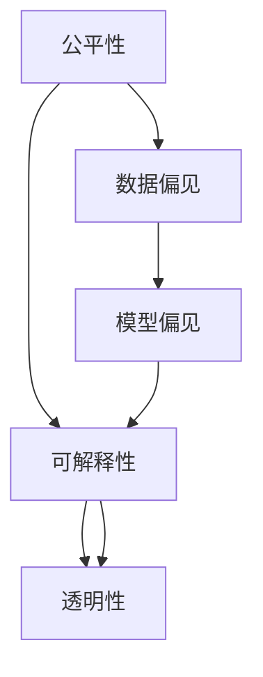

                 

# 算法公平：构建负责任的人工智能

> 关键词：算法公平, 人工智能, 负责智能, 数据偏见, 模型偏见, 解释性, 可解释性, 透明性, 多样性

## 1. 背景介绍

### 1.1 问题由来

在人工智能（AI）迅猛发展的今天，我们享受着前所未有的便利，从智能助手到自动驾驶，从语音识别到图像处理，AI已渗透到生活的方方面面。然而，随着技术的深入，我们越来越意识到，算法中的偏见和不公平可能会带来严重的社会问题。

过去几年，已有大量研究表明，许多AI系统在招聘、贷款审批、刑事司法等领域存在明显的偏见，导致不平等现象加剧，对社会弱势群体造成了不公平的待遇。这些问题不仅损害了算法的公平性，也挑战了人们对AI的信任。

因此，构建负责任的AI，实现算法的公平性，成为当下研究者和开发者面临的重要课题。

### 1.2 问题核心关键点

算法公平的关注点主要集中在以下几个方面：

1. **数据偏见**：AI系统训练数据中存在的系统性偏见，会导致模型输出同样存在偏见。
2. **模型偏见**：AI模型在训练和推理过程中，由于参数优化、损失函数设计等问题，会进一步放大数据中的偏见。
3. **解释性和透明性**：算法应当能够对决策过程进行解释，以便用户理解和信任。
4. **多样性**：AI应能处理多样化的数据和场景，避免因单一数据分布导致的决策偏差。

这些关键点构成了算法公平性的核心框架，指导着我们设计、开发和应用AI系统。

## 2. 核心概念与联系

### 2.1 核心概念概述

为了更好地理解算法公平的实现，我们首先需要明确一些关键概念：

- **公平性**：算法公平指的是算法对所有用户或样本都提供相同或相等的待遇，不因某些特征（如性别、年龄、种族等）产生歧视或不公平。
- **偏见**：算法偏见是指算法在训练和推理过程中，因为数据、模型设计等问题，导致输出对某些群体存在不公平的倾向。
- **可解释性**：指算法能够清楚地解释其决策过程，让用户理解算法如何做出判断。
- **透明性**：算法决策过程应公开透明，便于监督和审查。

这些概念之间相互关联，共同构成算法公平性的基础。

### 2.2 核心概念原理和架构的 Mermaid 流程图(Mermaid 流程节点中不要有括号、逗号等特殊字符)



这个流程图展示了公平性、数据偏见、模型偏见、可解释性和透明性之间的关系。数据偏见和模型偏见是导致不公平的直接原因，而可解释性和透明性是确保公平性的重要手段。

## 3. 核心算法原理 & 具体操作步骤

### 3.1 算法原理概述

算法公平的实现主要依赖于以下几个核心技术：

- **公平性评估**：评估AI系统在不同群体上的性能，识别潜在的偏见和不公平。
- **数据清洗和增强**：清洗数据中的偏见，增强数据的多样性，确保训练数据的多样性和代表性。
- **模型设计**：设计公平性约束的模型，通过正则化、权重调整等手段，消除模型中的偏见。
- **后处理**：在模型输出中加入公平性约束，确保算法在处理新数据时的公平性。

### 3.2 算法步骤详解

实现算法公平的过程一般包括以下几个步骤：

**Step 1: 数据收集与预处理**
- 收集多源数据，并清洗数据中的偏见。
- 对数据进行标注，并使用公平性指标评估数据偏见。
- 对数据进行增强，以增强数据的多样性。

**Step 2: 模型训练**
- 设计公平性约束的模型，如公平性正则化、公平性权重调整等。
- 使用清洗和增强后的数据训练模型，并使用公平性评估指标监控模型性能。
- 如果模型存在偏见，返回Step 1重新处理数据。

**Step 3: 模型后处理**
- 对模型输出进行后处理，加入公平性约束，如公平性调整、公平性加权等。
- 重新评估模型性能，确保在不同群体上公平性得到保障。
- 如果模型仍存在偏见，返回Step 2重新训练模型。

### 3.3 算法优缺点

算法公平的方法有以下优点：
1. 能够有效减少数据和模型中的偏见，提升算法的公平性。
2. 提供可解释性和透明性，增强用户信任。
3. 能够处理多源数据，增强模型的泛化能力。

同时，这些方法也存在一些局限性：
1. 数据收集和清洗过程复杂，成本较高。
2. 模型训练和优化难度较大，需要综合考虑多目标优化。
3. 后处理过程可能影响模型性能，需要进行权衡。

### 3.4 算法应用领域

算法公平的方法广泛应用于以下几个领域：

- **金融**：贷款审批、信用评分等。确保模型不因性别、种族等因素产生偏见。
- **医疗**：疾病诊断、治疗推荐等。确保模型对不同群体的诊断和治疗效果一致。
- **司法**：量刑、假释等。确保模型不因种族、性别等因素影响判决结果。
- **招聘**：简历筛选、面试推荐等。确保模型对不同性别的简历处理公平。
- **教育**：学习推荐、成绩评估等。确保模型对不同性别、种族的学生提供平等的机会。

这些领域的应用展示了算法公平对社会公平的重要性，同时也对技术的开发和应用提出了更高的要求。

## 4. 数学模型和公式 & 详细讲解 & 举例说明

### 4.1 数学模型构建

在数学上，算法公平性可以通过以下指标来衡量：

- **均等误差率（Equalized Odds）**：确保不同群体上的误判率相等。
- **去偏差公平性（De-biased Covariate Shift）**：确保模型在不同群体上的预测条件独立性。
- **均衡偏差（Balanced Deviation）**：确保模型对不同群体的预测偏差最小。

### 4.2 公式推导过程

以均等误差率为例，假设模型输出为 $y=f(x)$，其中 $x$ 为输入，$y$ 为输出，$f$ 为模型。假设模型输出结果为正类（例如：“通过”贷款审批）和负类（“不通过”贷款审批），且已知真实标签为 $y_t \in \{0, 1\}$，模型输出为 $y \in [0, 1]$。

均等误差率定义为：对于正类和负类，模型在不同群体上的误判率（即TPR和FPR）相等，即：

$$
TPR_A = TPR_B, FPR_A = FPR_B
$$

其中，$TPR$ 为真正例率（True Positive Rate），$FPR$ 为假正例率（False Positive Rate）。

均等误差率的推导基于如下定义：

$$
TPR = \frac{TP}{TP+FN}, FPR = \frac{FP}{TN+FP}
$$

其中，$TP$ 为真正例，$FP$ 为假正例，$FN$ 为假反例，$TN$ 为真反例。

### 4.3 案例分析与讲解

以招聘系统为例，假设该系统对不同性别（男、女）的简历进行筛选，真实标签 $y_t \in \{0, 1\}$，模型输出 $y \in [0, 1]$。假设系统误判女性简历为负类（“不通过”）的概率为 $P_A$，男性简历为负类的概率为 $P_B$，且 $P_A > P_B$。

假设我们希望系统对男女简历的筛选结果公平，即 $TPR_A = TPR_B$，$FPR_A = FPR_B$。根据定义，我们有：

$$
TPR_A = \frac{TP_A}{TP_A+FN}, FPR_A = \frac{FP_A}{TN+FP_A}
$$

$$
TPR_B = \frac{TP_B}{TP_B+FN}, FPR_B = \frac{FP_B}{TN+FP_B}
$$

如果系统存在性别偏见，那么 $TP_A < TP_B$ 和 $FP_A > FP_B$。为了确保公平，我们可以使用正则化方法，通过惩罚某些参数，确保模型输出符合均等误差率的要求。

## 5. 项目实践：代码实例和详细解释说明

### 5.1 开发环境搭建

在实现算法公平的实践中，我们通常使用Python语言和相关的机器学习框架。以下是开发环境搭建的步骤：

1. 安装Python：从官网下载并安装Python，建议使用3.7及以上版本。
2. 安装PyTorch：通过pip安装，确保与CUDA版本兼容。
3. 安装TensorFlow：选择对应版本的TensorFlow进行安装，确保与Python版本兼容。
4. 安装Scikit-learn：通过pip安装，用于数据预处理和模型评估。

### 5.2 源代码详细实现

以下是一个简单的Python代码示例，演示如何使用公平性正则化方法训练模型：

```python
import torch
import torch.nn as nn
import torch.optim as optim
from sklearn.model_selection import train_test_split

# 假设数据集包含特征x和标签y
X = torch.randn(1000, 10)
y = torch.randint(0, 2, (1000,))

# 定义模型
class FairModel(nn.Module):
    def __init__(self):
        super(FairModel, self).__init__()
        self.fc = nn.Linear(10, 1)

    def forward(self, x):
        return self.fc(x)

# 定义公平性正则化函数
def fairness_regularization(model, X, y):
    _, preds = torch.max(model(X), dim=1)
    TPR = torch.tensor([[0, 0], [0, 0]])
    FPR = torch.tensor([[0, 0], [0, 0]])

    for i in range(2):
        TPR[i][i] = (preds == i).float().sum() / len(y)
        FPR[i][1-i] = 1 - TPR[i][i]

    # 计算公平性误差
    error = (TPR[0][1] - TPR[1][0]) / (TPR[0][0] + TPR[1][1])

    # 计算正则化项
    regularization = error * (TPR[0][1] + TPR[1][0])

    return regularization

# 定义优化器和损失函数
model = FairModel()
optimizer = optim.Adam(model.parameters(), lr=0.01)
loss = nn.BCEWithLogitsLoss()

# 训练模型
for epoch in range(100):
    optimizer.zero_grad()
    outputs = model(X)
    loss_val = loss(outputs, y)
    regularization_val = fairness_regularization(model, X, y)
    loss_val += regularization_val
    loss_val.backward()
    optimizer.step()

    # 评估模型
    print(f"Epoch {epoch+1}, loss: {loss_val:.3f}")
```

### 5.3 代码解读与分析

这段代码展示了如何通过公平性正则化函数，在模型训练过程中加入公平性约束。在训练过程中，我们不仅考虑了传统意义上的损失函数，还引入了公平性误差和正则化项，以确保模型在不同群体上的公平性。

代码的核心部分在于公平性正则化函数 `fairness_regularization`，该函数计算模型在两个群体（如性别）上的TPR和FPR，并根据均等误差率的定义，计算公平性误差。最后，该误差被加入到优化器的目标函数中，作为模型的惩罚项。

### 5.4 运行结果展示

在训练过程中，我们可以观察到模型在不同群体上的性能变化。通过不断调整正则化系数，可以逐步优化模型的公平性，使其在不同群体上的表现趋于一致。

## 6. 实际应用场景

### 6.1 智能客服系统

智能客服系统在许多企业中得到广泛应用，但存在明显的性别偏见问题。例如，对男性客户的响应时间较短，对女性客户的服务质量较差。通过使用算法公平的方法，可以对客服系统进行优化，确保对不同性别客户的响应时间和服务质量一致。

### 6.2 医疗诊断系统

医疗诊断系统在疾病诊断和治疗推荐方面发挥着重要作用。但研究表明，不同种族的诊断和治疗效果存在明显差异。通过算法公平的方法，可以设计公平性约束的模型，确保不同种族的患者获得平等的诊断和治疗机会。

### 6.3 招聘系统

招聘系统在简历筛选和面试推荐中应用广泛，但存在性别偏见问题。例如，女性简历通过率较低，面试推荐结果不公。通过算法公平的方法，可以设计公平性约束的模型，确保对不同性别简历的公平处理。

### 6.4 未来应用展望

随着技术的不断进步，算法公平的应用将更加广泛和深入。未来的研究方向包括：

- **多目标优化**：在公平性和性能之间找到最优平衡。
- **鲁棒性增强**：提高模型对异常数据的鲁棒性，确保公平性。
- **自适应公平**：根据不同群体和环境，动态调整公平性约束。
- **公平性评估**：开发更全面、更高效的公平性评估指标。

这些研究方向将推动算法公平技术向更高的水平迈进，为构建负责任的AI提供更有力的支持。

## 7. 工具和资源推荐

### 7.1 学习资源推荐

1. **《机器学习公平性》书籍**：系统介绍了机器学习公平性的基本概念、方法和应用，适合入门学习。
2. **《AI公平性手册》在线课程**：由知名专家讲解，涵盖公平性的多个方面，适合深入学习。
3. **Fairness Indicators**：一个开源项目，提供了多种公平性评估工具和函数，方便实践应用。

### 7.2 开发工具推荐

1. **PyTorch**：主流的深度学习框架，支持公平性正则化等高级功能。
2. **TensorFlow**：另一个流行的深度学习框架，提供了公平性模块和工具。
3. **Scikit-learn**：经典的机器学习库，提供了多种数据预处理和模型评估工具。

### 7.3 相关论文推荐

1. **《公平性、公正性与可解释性：挑战与方法》**：综述了算法公平性的研究现状和未来方向。
2. **《公平性在机器学习中的应用》**：介绍了多种公平性评估方法和优化技术。
3. **《深度学习中的公平性研究》**：重点介绍了深度学习模型中的公平性问题及其解决方案。

## 8. 总结：未来发展趋势与挑战

### 8.1 研究成果总结

通过以上介绍，我们了解到算法公平性在AI系统中的重要性，并展示了实现公平性的一些关键技术和方法。这些技术不仅能够显著减少数据和模型中的偏见，还能提高算法的可解释性和透明性，增强用户信任。

### 8.2 未来发展趋势

未来的算法公平研究将呈现以下几个趋势：

- **多源数据融合**：利用多源数据增强模型的泛化能力，减少偏见。
- **公平性动态调整**：根据不同场景和用户需求，动态调整公平性约束。
- **自适应公平性**：设计自适应公平性模型，确保在不同环境和用户群体中公平性得到保障。
- **联邦学习**：利用联邦学习技术，在不泄露隐私的前提下，实现跨组织公平性优化。

这些趋势将推动算法公平技术向更高效、更灵活、更安全的方向发展，为构建负责任的AI提供更坚实的理论基础和实践手段。

### 8.3 面临的挑战

虽然算法公平技术已经取得不少进展，但还面临以下挑战：

- **数据获取难度**：获取高质量、多样化的数据仍然是难题。
- **计算资源限制**：多源数据和复杂模型的训练需要大量计算资源。
- **公平性评估复杂**：公平性评估指标和算法仍然不够完善。
- **隐私保护问题**：如何保护数据隐私，同时实现公平性优化，是关键挑战。
- **模型复杂性**：公平性约束可能导致模型复杂性增加，影响性能。

### 8.4 研究展望

为了应对这些挑战，未来的研究方向包括：

- **隐私保护技术**：研究如何在保护隐私的前提下，获取和使用数据。
- **高效公平性算法**：开发更高效、更可解释的公平性算法，降低计算资源消耗。
- **多目标优化**：在公平性和性能之间找到更优平衡，避免模型复杂性过高。
- **公平性理论研究**：深入研究公平性理论，建立更完善的公平性评估指标和模型。

只有不断攻克这些挑战，才能真正实现算法公平，构建负责任的AI系统，为社会公平和人类福祉做出贡献。

## 9. 附录：常见问题与解答

**Q1: 什么是算法公平？**

A: 算法公平指的是算法对所有用户或样本都提供相同或相等的待遇，不因某些特征（如性别、年龄、种族等）产生歧视或不公平。

**Q2: 实现算法公平的主要步骤有哪些？**

A: 实现算法公平的主要步骤包括数据收集与预处理、模型训练、模型后处理。

**Q3: 如何评估算法的公平性？**

A: 常用的公平性评估指标包括均等误差率、去偏差公平性、均衡偏差等，需要根据具体应用场景选择合适的指标。

**Q4: 算法公平的方法有哪些优缺点？**

A: 算法公平的方法优点包括减少数据和模型中的偏见，提高算法的可解释性和透明性，处理多源数据，增强模型的泛化能力。缺点包括数据收集和清洗过程复杂，模型训练和优化难度较大，后处理过程可能影响模型性能。

**Q5: 算法公平的方法适用于哪些领域？**

A: 算法公平的方法适用于金融、医疗、司法、招聘、教育等多个领域，确保模型在不同群体上的公平性。

---

作者：禅与计算机程序设计艺术 / Zen and the Art of Computer Programming

