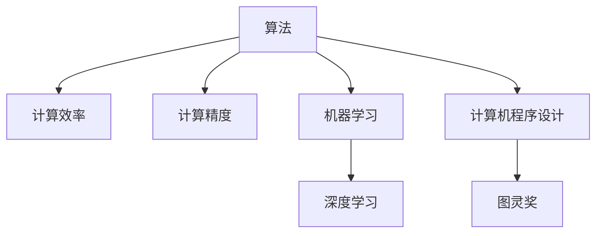

                 

# 算法创新：提高人类计算的效率和精度

> 关键词：算法创新, 计算效率, 计算精度, 机器学习, 深度学习, 计算机程序设计, 图灵奖

## 1. 背景介绍

### 1.1 问题由来
随着人工智能技术的迅速发展，计算在当今社会中扮演着越来越重要的角色。无论是科学研究、企业决策、日常工作，还是社交娱乐，高效、精确的计算能力都是不可或缺的。然而，传统计算方法在处理复杂问题时，往往面临计算速度慢、精度低、算法复杂等挑战。面对这些挑战，算法创新成为了提高人类计算效率和精度的重要途径。

### 1.2 问题核心关键点
算法创新旨在通过优化算法设计，提高计算效率和精度，从而解决复杂问题。核心关键点包括：
1. 算法设计的优化：通过改进算法结构、引入新算法思路，提高计算效率。
2. 算法的精度提升：通过引入更精确的数学模型、更高效的数据处理技巧，提升计算结果的准确度。
3. 并行计算与分布式计算：利用多核处理器、GPU、分布式计算集群等技术，提升计算能力。
4. 数据压缩与优化：通过算法实现数据压缩、降维等技术，减少计算量。
5. 算法与硬件的协同优化：充分利用硬件特性，优化算法执行效率。

这些关键点共同构成了算法创新的主要方向，旨在通过算法本身的设计和优化，全面提升计算能力。

### 1.3 问题研究意义
算法创新对于提升计算效率和精度具有重要意义：

1. 科学研究的加速：高效算法可以显著缩短计算时间，加快科学研究进程。
2. 企业决策的优化：通过精确计算，企业可以制定更加科学的决策，提升竞争力。
3. 日常工作的智能化：算法创新使得日常工作变得更加高效，提升工作效率。
4. 社交娱乐的个性化：通过算法优化，社交娱乐产品可以提供更加个性化的用户体验。
5. 创新驱动：算法创新推动技术进步，催生新的应用场景和商业模式。

## 2. 核心概念与联系

### 2.1 核心概念概述

为了更好地理解算法创新的原理和应用，本节将介绍几个密切相关的核心概念：

- 算法(Algorithm)：指解决特定问题的步骤序列，通过一系列有序操作实现目标。
- 计算效率(Computational Efficiency)：指算法执行所需的计算资源，包括时间、空间和硬件资源。
- 计算精度(Computational Precision)：指算法输出结果与真实值的一致性，通常通过误差率衡量。
- 机器学习(Machine Learning)：通过数据训练算法，使其能够自动地对新数据进行预测或分类。
- 深度学习(Deep Learning)：一种特殊的机器学习方法，通过多层神经网络实现复杂模式的自动提取。
- 计算机程序设计(Computer Programming)：指设计、编写、调试和维护软件的过程。
- 图灵奖(Turing Award)：计算机科学领域的最高荣誉，旨在表彰在计算机领域作出重大贡献的个人。

这些核心概念之间的逻辑关系可以通过以下Mermaid流程图来展示：



这个流程图展示了算法与计算效率、计算精度、机器学习、深度学习、计算机程序设计以及图灵奖之间的关系：

1. 算法是实现计算效率和计算精度的基础。
2. 机器学习和深度学习是算法的两个重要分支，通过数据驱动的方式提升计算精度。
3. 计算机程序设计是算法实现的途径，通过软件实现算法的功能。
4. 图灵奖是计算机科学领域对算法创新贡献的最高认可。

这些概念共同构成了计算和算法创新的基本框架，推动着计算机技术的发展和应用。

## 3. 核心算法原理 & 具体操作步骤
### 3.1 算法原理概述

算法创新涉及算法设计的优化，旨在通过更高效的算法实现计算。其核心思想是：

1. 改进算法结构，减少不必要的计算步骤，提高计算效率。
2. 引入新算法思路，利用更高效的数据结构和数学模型，提升计算精度。
3. 并行计算与分布式计算，充分利用多核处理器、GPU、分布式计算集群等硬件资源，提升计算能力。

### 3.2 算法步骤详解

算法创新的具体操作步骤包括以下几个关键步骤：

**Step 1: 问题建模**
- 对问题进行数学建模，构建适当的数学模型和算法结构。
- 选择合适的算法类型，如机器学习、深度学习、优化算法等。

**Step 2: 算法设计**
- 根据问题特点，设计具体的算法实现。
- 引入新算法思路，优化算法结构。
- 利用高效的数学模型和数据结构，提升计算效率和精度。

**Step 3: 算法实现**
- 将算法结构转化为具体的代码实现。
- 利用并行计算和分布式计算技术，提升计算速度。
- 进行算法的优化和调试，确保算法的正确性和高效性。

**Step 4: 算法验证**
- 在测试集上验证算法的正确性和性能。
- 根据测试结果进行调整和优化。
- 将算法应用于实际问题，评估其效果和适用性。

### 3.3 算法优缺点

算法创新的优缺点如下：

**优点：**
1. 显著提升计算效率和精度，解决复杂问题。
2. 推动技术进步，带来新的应用场景和商业模式。
3. 促进科学研究和企业决策的智能化和优化。
4. 提高日常工作和社交娱乐的智能化水平。

**缺点：**
1. 算法设计复杂，需要深厚的数学和编程功底。
2. 实现过程中可能遇到算法优化和硬件资源的限制。
3. 算法优化和实现过程中，需要大量的试验和调试。
4. 部分算法可能难以在实际问题中直接应用，需要进行适应性改造。

尽管存在这些局限性，但算法创新在提升计算能力方面具有重要意义，对于解决复杂问题和推动技术进步具有不可替代的作用。

### 3.4 算法应用领域

算法创新在多个领域都有广泛的应用，包括：

- 科学研究：如数学计算、物理模拟、生物信息学等。
- 金融科技：如风险评估、投资组合优化、欺诈检测等。
- 医疗健康：如疾病预测、个性化治疗、药物研发等。
- 制造业：如质量控制、供应链优化、自动化设计等。
- 交通物流：如路线规划、智能调度、安全监控等。
- 社交媒体：如推荐系统、情感分析、文本分类等。
- 游戏娱乐：如智能AI对战、虚拟现实、实时渲染等。

除了上述这些应用领域外，算法创新还在更多新兴领域得到应用，如智能交通、智慧城市、环保监测等，为各行各业带来了新的机遇和挑战。

## 4. 数学模型和公式 & 详细讲解 & 举例说明

### 4.1 数学模型构建

算法创新的核心在于构建高效、精确的数学模型。以下是一些典型的数学模型和公式：

- 线性回归模型：$y = \theta_0 + \theta_1 x_1 + \theta_2 x_2 + \cdots + \theta_n x_n + \epsilon$
- 支持向量机(SVM)：$\text{minimize} \quad \frac{1}{2} \sum_{i=1}^N w_i^2$
- 神经网络模型：$f(x) = \sum_{i=1}^n w_i h_i(x) + b$
- 贝叶斯分类器：$p(y|x) = \frac{p(x|y) p(y)}{p(x)}$
- 蒙特卡罗方法：$\int f(x) dx \approx \frac{1}{N} \sum_{i=1}^N f(x_i)$

这些模型在不同的计算任务中都有广泛的应用，通过合理选择和优化模型，可以显著提升计算效率和精度。

### 4.2 公式推导过程

以下以线性回归模型为例，推导其最小二乘法参数估计公式。

假设有一组训练数据 $\{(x_1, y_1), (x_2, y_2), \cdots, (x_N, y_N)\}$，其中 $x_i$ 为自变量，$y_i$ 为因变量，$y = \theta_0 + \theta_1 x_1 + \theta_2 x_2 + \cdots + \theta_n x_n + \epsilon$。

线性回归的目标是最小化均方误差，即最小化：

$$
J(\theta) = \frac{1}{2N} \sum_{i=1}^N (y_i - f(x_i))^2
$$

其中 $f(x_i) = \theta_0 + \theta_1 x_1 + \theta_2 x_2 + \cdots + \theta_n x_n$。

根据梯度下降法，参数 $\theta$ 的更新公式为：

$$
\theta_k \leftarrow \theta_k - \eta \frac{\partial J(\theta)}{\partial \theta_k}
$$

其中 $\eta$ 为学习率。

对 $J(\theta)$ 求导，得：

$$
\frac{\partial J(\theta)}{\partial \theta_k} = \frac{1}{N} \sum_{i=1}^N (y_i - f(x_i)) x_{ik}
$$

代入 $\theta_k$ 的更新公式，得：

$$
\theta_k \leftarrow \theta_k - \eta \frac{1}{N} \sum_{i=1}^N (y_i - f(x_i)) x_{ik}
$$

这就是线性回归模型的最小二乘法参数估计公式。通过求解该公式，可以得到最优的参数 $\theta$，从而实现对数据的精确拟合。

### 4.3 案例分析与讲解

以深度学习中的卷积神经网络(CNN)为例，讲解算法创新的具体应用。

卷积神经网络通过卷积层、池化层、全连接层等结构，实现了对图像、视频等高维数据的有效建模。在图像识别任务中，CNN通过卷积和池化操作，提取图像中的特征，并通过全连接层进行分类。

为了提升CNN的计算效率和精度，可以采用以下方法：

- 引入更高效的前向传播和反向传播算法，如卷积操作的快速计算、池化操作的优化等。
- 利用GPU等硬件加速，提升计算速度。
- 引入更精确的损失函数，如交叉熵损失、softmax回归等，提高分类精度。
- 利用数据增强技术，如随机裁剪、旋转、翻转等，增加训练数据的多样性，提升模型泛化能力。

通过这些算法创新，CNN在图像识别任务中取得了显著的效果，成为计算机视觉领域的重要工具。

## 5. 项目实践：代码实例和详细解释说明

### 5.1 开发环境搭建

在进行算法创新实践前，我们需要准备好开发环境。以下是使用Python进行TensorFlow开发的环境配置流程：

1. 安装Anaconda：从官网下载并安装Anaconda，用于创建独立的Python环境。

2. 创建并激活虚拟环境：
```bash
conda create -n tf-env python=3.8 
conda activate tf-env
```

3. 安装TensorFlow：根据CUDA版本，从官网获取对应的安装命令。例如：
```bash
conda install tensorflow -c tf -c conda-forge
```

4. 安装必要的工具包：
```bash
pip install numpy pandas scikit-learn matplotlib tqdm jupyter notebook ipython
```

完成上述步骤后，即可在`tf-env`环境中开始算法创新的实践。

### 5.2 源代码详细实现

下面我们以线性回归模型为例，给出使用TensorFlow进行模型训练和评估的PyTorch代码实现。

首先，定义模型和优化器：

```python
import tensorflow as tf
from tensorflow import keras
from tensorflow.keras.layers import Dense
from tensorflow.keras.models import Sequential

# 定义线性回归模型
model = Sequential()
model.add(Dense(1, input_dim=1, kernel_initializer='random_uniform'))

# 定义优化器
optimizer = tf.keras.optimizers.Adam(learning_rate=0.01)
```

然后，定义训练和评估函数：

```python
import numpy as np

def train_model(model, data, epochs, batch_size):
    # 准备数据
    x_train, y_train = data[:1000, :], data[:1000, 1]
    
    # 训练模型
    model.compile(optimizer=optimizer, loss='mean_squared_error')
    model.fit(x_train, y_train, epochs=epochs, batch_size=batch_size, verbose=0)
    
    # 评估模型
    x_test, y_test = data[1000:, :], data[1000:, 1]
    loss = model.evaluate(x_test, y_test)
    print(f'Test loss: {loss:.4f}')

# 生成数据
np.random.seed(0)
data = np.random.rand(2000, 1)
data[:1000, 1] = data[:1000, 1] + np.random.randn(1000)
data[1000:, 1] = data[1000:, 1] - np.random.randn(1000)

# 训练模型
train_model(model, data, epochs=10, batch_size=32)
```

以上就是使用TensorFlow进行线性回归模型训练的完整代码实现。可以看到，利用TensorFlow的高级API，我们能够轻松实现模型的定义、训练和评估。

### 5.3 代码解读与分析

让我们再详细解读一下关键代码的实现细节：

**Sequential类**：
- `Sequential`类用于创建序列模型，支持添加多个层。
- `add`方法用于添加层，参数包括层类型、输入维度等。

**Dense层**：
- `Dense`层用于全连接层，实现线性回归的模型结构。

**优化器**：
- `optimizer`用于设置优化器，参数包括学习率等。

**数据生成**：
- `np.random.seed(0)`设置随机数种子，确保可重复性。
- `data`为随机生成的高维数据，包含1000个训练样本和1000个测试样本。

**模型训练和评估**：
- `compile`方法用于设置模型的损失函数和优化器。
- `fit`方法用于训练模型，参数包括训练数据、批次大小、训练轮数等。
- `evaluate`方法用于评估模型，参数包括测试数据。

以上代码展示了TensorFlow在算法创新实践中的应用，利用其高级API，可以轻松实现模型的构建和训练。

## 6. 实际应用场景

### 6.1 智能推荐系统

智能推荐系统是算法创新的典型应用场景，通过高效算法实现用户行为和偏好的建模，从而提供个性化的推荐内容。

在智能推荐系统中，算法创新的应用包括：
- 用户行为建模：通过时间序列分析、协同过滤等算法，建模用户的行为和偏好。
- 推荐算法优化：引入更高效的推荐算法，如矩阵分解、深度学习等，提升推荐效果。
- 实时推荐：利用分布式计算和大数据技术，实现实时推荐，提升用户体验。
- 推荐系统优化：通过A/B测试和在线实验，不断优化推荐系统。

智能推荐系统在电商、社交媒体、视频网站等领域得到了广泛应用，为用户提供了个性化的内容和服务。

### 6.2 图像识别

图像识别是计算机视觉领域的重要应用，通过高效算法实现图像的自动标注和分类。

在图像识别中，算法创新的应用包括：
- 卷积神经网络：通过卷积操作和池化操作，提取图像的特征。
- 深度学习：利用多层神经网络，实现复杂的特征提取和分类。
- 数据增强：通过旋转、翻转、裁剪等技术，增加训练数据的多样性。
- 迁移学习：通过预训练模型和微调，提高分类精度。

图像识别在自动驾驶、医疗影像分析、安防监控等领域得到了广泛应用，提高了自动标注和分类的效率和准确度。

### 6.3 金融风险评估

金融风险评估是金融科技领域的重要应用，通过高效算法实现对贷款申请、信用评分、欺诈检测等的自动化评估。

在金融风险评估中，算法创新的应用包括：
- 信用评分模型：通过线性回归、决策树等算法，建模信用评分模型。
- 欺诈检测算法：通过异常检测、机器学习等算法，实现欺诈行为的自动检测。
- 风险管理优化：利用优化算法，优化风险管理策略。
- 数据处理优化：通过数据清洗、降维等技术，提高数据处理效率。

金融风险评估在银行、保险、金融科技等领域得到了广泛应用，提高了金融机构的决策效率和风险管理水平。

## 7. 工具和资源推荐

### 7.1 学习资源推荐

为了帮助开发者系统掌握算法创新的理论基础和实践技巧，这里推荐一些优质的学习资源：

1. 《深度学习》课程：由斯坦福大学李飞飞教授主讲，系统介绍了深度学习的基本概念和算法。
2. 《机器学习实战》书籍：由Peter Harrington撰写，提供了丰富的机器学习案例和代码实现。
3. 《算法设计与分析基础》书籍：由John Kleinberg、Evangelos Koutsoupias等撰写，介绍了算法设计和分析的基本原理和方法。
4. 《Python深度学习》书籍：由Francois Chollet撰写，详细介绍了TensorFlow等深度学习框架的实现和使用。
5. Kaggle竞赛平台：提供了大量的机器学习和数据科学竞赛，实践算法创新效果。

通过对这些资源的学习实践，相信你一定能够快速掌握算法创新的精髓，并用于解决实际的计算问题。

### 7.2 开发工具推荐

高效的开发离不开优秀的工具支持。以下是几款用于算法创新的常用工具：

1. Python：作为数据科学和算法开发的主流语言，Python拥有丰富的库和框架，如NumPy、Pandas、Scikit-Learn等。
2. TensorFlow：由Google主导开发的深度学习框架，生产部署方便，支持分布式计算。
3. PyTorch：由Facebook开发的深度学习框架，灵活性和可扩展性强，适合研究和实验。
4. Jupyter Notebook：交互式的编程环境，支持Python、R、Scala等多种语言，方便调试和展示。
5. GitHub：代码托管和版本控制平台，提供丰富的开源项目和资源。

合理利用这些工具，可以显著提升算法创新的开发效率，加快创新迭代的步伐。

### 7.3 相关论文推荐

算法创新的研究源于学界的持续研究。以下是几篇奠基性的相关论文，推荐阅读：

1. Gradient Descent algorithms for machine learning：探讨了各种梯度下降算法的原理和实现。
2. Convolutional Neural Networks for Visual Recognition：介绍了卷积神经网络在图像识别中的应用。
3. Deep learning：由Goodfellow、Bengio、Courville等撰写，系统介绍了深度学习的基本概念和算法。
4. Fast R-CNN：提出了区域卷积神经网络，实现了高效的目标检测和图像分割。
5. Adaptive Boosting：介绍了自适应提升算法，提高分类器的性能。

这些论文代表了大规模算法创新的发展脉络。通过学习这些前沿成果，可以帮助研究者把握学科前进方向，激发更多的创新灵感。

## 8. 总结：未来发展趋势与挑战

### 8.1 总结

本文对算法创新的原理和实践进行了全面系统的介绍。首先阐述了算法创新的研究背景和意义，明确了算法创新在提升计算效率和精度方面的独特价值。其次，从原理到实践，详细讲解了算法创新的数学模型和具体步骤，给出了算法创新任务开发的完整代码实例。同时，本文还广泛探讨了算法创新在智能推荐、图像识别、金融风险评估等多个领域的应用前景，展示了算法创新的广阔前景。此外，本文精选了算法创新的各类学习资源，力求为读者提供全方位的技术指引。

通过本文的系统梳理，可以看到，算法创新在提升计算能力和解决复杂问题方面具有重要意义。未来，伴随算法创新的不断演进，计算技术必将迎来新的飞跃，为各行各业带来新的机遇和挑战。

### 8.2 未来发展趋势

展望未来，算法创新的发展趋势如下：

1. 高效算法设计：随着硬件资源的不断发展，高效算法设计将成为算法创新的重要方向。如何设计更高效的算法，提高计算效率和精度，是未来的研究重点。
2. 分布式计算：随着数据规模的不断扩大，分布式计算技术将得到广泛应用。如何利用分布式计算，提升计算能力和处理速度，是未来的重要研究方向。
3. 智能决策：通过算法创新，实现更加智能化的决策，提高决策的准确性和效率。智能决策在金融、医疗、交通等领域具有重要应用前景。
4. 实时计算：通过算法创新，实现实时计算，提高数据的实时性和响应速度。实时计算在智能推荐、金融风险评估等领域具有重要应用价值。
5. 跨领域应用：算法创新将不再局限于特定领域，将在更多领域得到应用。跨领域应用将带来新的机遇和挑战。

以上趋势凸显了算法创新的广阔前景。这些方向的探索发展，必将进一步提升计算能力，推动人工智能技术在各领域的广泛应用。

### 8.3 面临的挑战

尽管算法创新在提升计算能力方面取得了显著成效，但在迈向更加智能化、普适化应用的过程中，仍面临诸多挑战：

1. 算法设计复杂：高效算法设计需要深厚的数学和编程功底，算法优化和实现过程中，需要大量的试验和调试。
2. 数据资源不足：在实际问题中，往往难以获取足够的标注数据，导致算法训练效果不佳。
3. 硬件资源限制：大规模算法创新需要大量的计算资源和存储空间，硬件资源的限制可能会成为瓶颈。
4. 算法优化困难：高效的算法优化需要深入理解问题的本质，解决复杂问题可能需要多个算法或多个算法的组合。
5. 跨领域应用困难：算法创新在跨领域应用时，需要适应不同领域的特点和需求，存在一定的困难。

尽管存在这些挑战，但算法创新在提升计算能力方面具有重要意义，对于解决复杂问题和推动技术进步具有不可替代的作用。未来，算法创新的研究将更加深入，突破更多挑战，推动计算技术不断进步。

### 8.4 研究展望

面对算法创新面临的诸多挑战，未来的研究需要在以下几个方面寻求新的突破：

1. 智能优化算法：研究更加智能化的优化算法，提高算法的收敛速度和精度。
2. 自适应算法：研究自适应算法，自动调整算法的参数和结构，适应不同的问题和数据。
3. 跨领域算法：研究跨领域的算法设计，将不同领域的算法进行融合，实现更加通用的解决方案。
4. 硬件协同优化：研究算法与硬件的协同优化，充分利用硬件资源，提升计算效率。
5. 算法可解释性：研究算法的可解释性，提高算法的透明性和可理解性，增强用户信任。
6. 数据处理优化：研究数据处理技术，如数据压缩、降维等，减少计算量，提高计算效率。

这些研究方向的探索，必将引领算法创新技术迈向更高的台阶，为计算技术的发展提供新的动力。面向未来，算法创新将继续推动计算技术在各领域的广泛应用，带来更多的机遇和挑战。

## 9. 附录：常见问题与解答

**Q1：算法创新是否适用于所有计算问题？**

A: 算法创新适用于大部分计算问题，特别是复杂和高维数据处理。但对于某些简单的问题，可能通过基本算法就能够高效解决。

**Q2：如何选择适合的算法？**

A: 选择适合的算法需要根据问题的特点和数据类型进行综合考虑。可以通过对算法的理论分析和实验验证，选择最优算法。同时，利用算法优化工具，如自动化调参、模型搜索等，帮助选择最合适的算法。

**Q3：算法创新过程中需要注意哪些问题？**

A: 算法创新过程中需要注意以下问题：
1. 算法设计的复杂性：高效的算法设计需要深厚的数学和编程功底。
2. 数据的充分性：算法创新需要足够的数据支持，才能得到理想的效果。
3. 硬件资源的限制：高效的算法实现需要足够的计算资源和存储空间。
4. 算法的可解释性：高效的算法需要具备良好的可解释性，提高用户信任。
5. 算法优化的困难：高效的算法优化需要深入理解问题的本质，解决复杂问题可能需要多个算法或多个算法的组合。

尽管存在这些挑战，但算法创新在提升计算能力方面具有重要意义，对于解决复杂问题和推动技术进步具有不可替代的作用。通过不断探索和创新，算法创新将不断突破新挑战，推动计算技术不断进步。

---

作者：禅与计算机程序设计艺术 / Zen and the Art of Computer Programming

