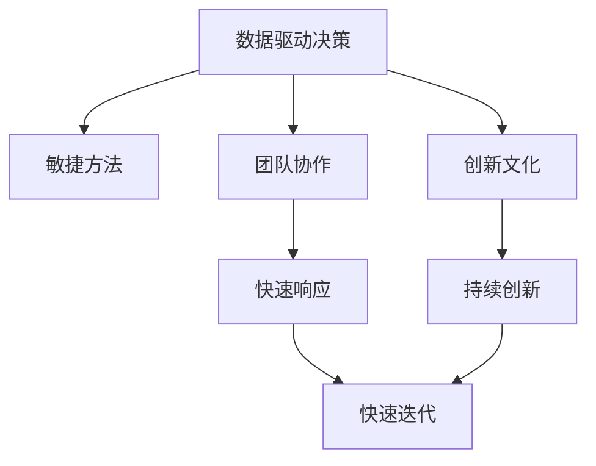

                 

# 管理者如何应对快速变化的环境

> 关键词：快速变化, 管理策略, 数据驱动决策, 敏捷方法, 团队协作, 创新文化

## 1. 背景介绍

### 1.1 问题由来

在当今这个快速变化的时代，企业面临的市场环境日新月异。全球化的加剧、技术的迭代、消费者需求的变化、以及政策法规的调整，都要求管理者不断调整战略和运营模式，以保持竞争力和可持续性。快速变化的环境要求管理者具备敏锐的市场洞察力、快速反应能力以及持续创新能力。然而，许多组织在应对这种变化时显得力不从心，决策迟缓、反应滞后、创新不足等问题屡见不鲜。本文旨在探讨管理者如何通过数据驱动决策、敏捷方法、团队协作和创新文化，有效应对快速变化的环境。

### 1.2 问题核心关键点

面对快速变化的环境，管理者需要解决的核心问题包括：
- 如何高效收集和利用数据，进行科学决策？
- 如何快速响应市场变化，调整战略和运营？
- 如何激发团队创造力和协作能力，实现敏捷创新？
- 如何在不确定性中保持组织稳定性和灵活性？

## 2. 核心概念与联系

### 2.1 核心概念概述

为更好地理解如何应对快速变化的环境，本文将介绍几个核心概念：

- **数据驱动决策**：指通过收集、分析和应用数据来支持决策过程，以提高决策的准确性和效率。
- **敏捷方法**：强调快速响应变化、小步迭代、持续改进的开发和项目管理方法。
- **团队协作**：强调团队成员之间的沟通、协调和共同努力，以实现共同目标。
- **创新文化**：指组织内部推崇的鼓励创新、容忍失败、持续改进的氛围。

这些核心概念之间的逻辑关系可以通过以下Mermaid流程图来展示：



这个流程图展示了好几个核心概念及其之间的关系：

1. 数据驱动决策是敏捷方法、团队协作和创新文化的基石。
2. 敏捷方法和团队协作共同推动了快速响应和快速迭代。
3. 创新文化是持续改进和适应快速变化环境的根本驱动力。

这些概念共同构成了有效应对快速变化环境的综合框架，使得管理者能够在多变的市场环境中保持竞争力。

## 3. 核心算法原理 & 具体操作步骤

### 3.1 算法原理概述

管理者应对快速变化环境的核心算法原理在于数据驱动决策和敏捷方法。其核心思想是：

1. **数据驱动决策**：通过收集和分析相关数据，识别市场趋势和机会，制定科学合理的战略和运营计划。
2. **敏捷方法**：采用小步迭代、快速响应、持续改进的方法，快速适应市场变化，灵活调整策略和行动。

### 3.2 算法步骤详解

#### 3.2.1 数据收集与处理

1. **数据收集**：
   - **内部数据**：收集企业内部的业务数据，如销售数据、财务报表、客户反馈等。
   - **外部数据**：收集市场数据，如行业报告、竞争对手动态、政策法规等。
   - **公开数据**：利用公开数据集，如政府统计数据、经济指标等。

2. **数据清洗与预处理**：
   - 去除噪声和异常值。
   - 数据归一化与标准化。
   - 特征工程，提取关键特征。

#### 3.2.2 数据分析与洞察

1. **描述性分析**：
   - 统计指标分析：如均值、中位数、方差、标准差等。
   - 数据可视化：如折线图、柱状图、散点图等。

2. **预测性分析**：
   - 时间序列分析：如ARIMA模型、季节性分解。
   - 机器学习模型：如回归模型、分类模型、聚类模型等。

3. **规范性分析**：
   - 优化模型：如线性规划、整数规划。
   - 模拟模型：如蒙特卡洛模拟、系统动力学模型。

#### 3.2.3 决策制定与执行

1. **决策制定**：
   - **定性方法**：专家意见、SWOT分析等。
   - **定量方法**：优化模型、模拟模型、决策树等。

2. **执行与监控**：
   - **项目管理**：敏捷方法如Scrum、Kanban等。
   - **绩效评估**：KPI指标、平衡计分卡等。

### 3.3 算法优缺点

数据驱动决策和敏捷方法的优点包括：
- **数据支持**：科学决策有数据支撑，避免盲目决策。
- **灵活应变**：敏捷方法可以快速响应市场变化，灵活调整策略。

缺点包括：
- **数据质量问题**：数据不全、不准确、不及时，可能影响决策。
- **复杂性问题**：数据分析和模型建立需要专业知识，可能带来复杂性。

### 3.4 算法应用领域

数据驱动决策和敏捷方法在多个领域得到了广泛应用，例如：

- **零售行业**：利用销售数据分析消费者需求变化，调整库存和促销策略。
- **金融行业**：分析市场数据和客户行为，优化投资组合和风险管理。
- **制造业**：运用生产数据和市场反馈，优化生产计划和供应链管理。
- **医疗行业**：基于患者数据和临床研究，制定个性化治疗方案。

## 4. 数学模型和公式 & 详细讲解 & 举例说明

### 4.1 数学模型构建

#### 4.1.1 描述性统计模型

假设有一个销售数据集 $D=\{(x_i,y_i)\}_{i=1}^N$，其中 $x_i$ 为时间点，$y_i$ 为销售量。

- **均值**：$\mu=\frac{1}{N}\sum_{i=1}^N y_i$
- **标准差**：$\sigma=\sqrt{\frac{1}{N}\sum_{i=1}^N (y_i-\mu)^2}$

#### 4.1.2 预测性模型

以时间序列预测为例，假设数据集为 $D_t=\{(x_t,y_t)\}_{t=1}^T$，其中 $x_t$ 为时间点，$y_t$ 为预测值。

- **ARIMA模型**：
  - 自回归模型（AR）：$y_t=\phi_1 y_{t-1}+\epsilon_t$
  - 差分自回归模型（ARIMA）：$\Delta y_t=\phi_1 \Delta y_{t-1}+\epsilon_t$
  - 自回归积分滑动平均模型（ARIMA）：$y_t=\phi_1 y_{t-1}+\theta_1 \Delta y_{t-1}+\epsilon_t$

  其中 $\phi_1$ 为自回归系数，$\theta_1$ 为差分系数，$\epsilon_t$ 为误差项。

- **机器学习模型**：
  - **线性回归**：$y_t=\beta_0+\beta_1x_t+\epsilon_t$
  - **决策树**：通过决策树模型进行分类或回归预测。

### 4.2 公式推导过程

以线性回归为例，假设数据集 $D=\{(x_i,y_i)\}_{i=1}^N$，其中 $x_i$ 为自变量，$y_i$ 为因变量。

**最小二乘估计**：
$$
\hat{\beta}=\arg\min_{\beta} \sum_{i=1}^N (y_i-\beta_0-\beta_1x_i)^2
$$

**模型推导**：
$$
\hat{\beta_0}=\bar{y}-\hat{\beta_1}\bar{x}
$$
$$
\hat{\beta_1}=\frac{\sum_{i=1}^N(x_i-\bar{x})(y_i-\bar{y})}{\sum_{i=1}^N(x_i-\bar{x})^2}
$$

其中 $\bar{x}=\frac{1}{N}\sum_{i=1}^N x_i$，$\bar{y}=\frac{1}{N}\sum_{i=1}^N y_i$。

### 4.3 案例分析与讲解

假设一家电子商务公司，希望预测未来三个月的销售额。公司收集了过去一年的销售数据和市场趋势数据，应用线性回归模型进行预测。

1. **数据收集**：
   - 收集过去一年的销售数据和市场趋势数据。
   - 清洗和预处理数据，去除异常值和噪声。

2. **模型建立**：
   - 建立线性回归模型 $y_t=\beta_0+\beta_1x_t+\epsilon_t$。
   - 训练模型，得到 $\hat{\beta_0}$ 和 $\hat{\beta_1}$。

3. **预测与评估**：
   - 使用模型预测未来三个月的销售额。
   - 评估预测结果的准确性，通过均方误差（MSE）或均方根误差（RMSE）进行评价。

## 5. 项目实践：代码实例和详细解释说明

### 5.1 开发环境搭建

#### 5.1.1 Python环境准备

1. **安装Python**：
   - 下载并安装Python最新版本，如3.8及以上。
   - 配置环境变量，设置PyCharm或Jupyter Notebook路径。

2. **安装相关库**：
   - 安装Pandas、NumPy、Scikit-learn等常用库。
   - 安装TensorFlow或PyTorch，用于机器学习模型的训练。

3. **创建虚拟环境**：
   ```bash
   python -m venv myenv
   source myenv/bin/activate
   ```

#### 5.1.2 数据处理

1. **数据导入**：
   ```python
   import pandas as pd
   data = pd.read_csv('sales_data.csv')
   ```

2. **数据清洗**：
   ```python
   data.dropna(inplace=True)
   ```

3. **特征工程**：
   ```python
   data['trend'] = data[' sales'] - data[' sales'].shift(1)
   ```

### 5.2 源代码详细实现

#### 5.2.1 线性回归模型

```python
from sklearn.linear_model import LinearRegression
import matplotlib.pyplot as plt

# 加载数据
data = pd.read_csv('sales_data.csv')
data = data.dropna()

# 特征工程
data['trend'] = data['sales'] - data['sales'].shift(1)

# 模型训练
X = data['trend'].values.reshape(-1,1)
y = data['sales'].values.reshape(-1,1)
model = LinearRegression()
model.fit(X, y)

# 预测与可视化
plt.plot(data['trend'], label='Trend')
plt.plot(data['trend'], model.predict(X), color='red', label='Prediction')
plt.legend()
plt.show()
```

#### 5.2.2 时间序列预测

```python
from statsmodels.tsa.arima.model import ARIMA

# 加载数据
data = pd.read_csv('sales_data.csv')
data = data.dropna()

# 时间序列转换
X = data['trend'].values.reshape(-1,1)
y = data['sales'].values.reshape(-1,1)

# 模型训练
model = ARIMA(y, order=(1,1,1))
model_fit = model.fit()

# 预测与可视化
forecast = model_fit.forecast(steps=3)
plt.plot(data['trend'], label='Trend')
plt.plot(forecast, color='red', label='Prediction')
plt.legend()
plt.show()
```

### 5.3 代码解读与分析

#### 5.3.1 数据处理

1. **数据导入**：
   ```python
   import pandas as pd
   data = pd.read_csv('sales_data.csv')
   ```

2. **数据清洗**：
   ```python
   data.dropna(inplace=True)
   ```

3. **特征工程**：
   ```python
   data['trend'] = data['sales'] - data['sales'].shift(1)
   ```

#### 5.3.2 模型训练

1. **线性回归模型**：
   ```python
   from sklearn.linear_model import LinearRegression
   import matplotlib.pyplot as plt

   # 加载数据
   data = pd.read_csv('sales_data.csv')
   data = data.dropna()

   # 特征工程
   data['trend'] = data['sales'] - data['sales'].shift(1)

   # 模型训练
   X = data['trend'].values.reshape(-1,1)
   y = data['sales'].values.reshape(-1,1)
   model = LinearRegression()
   model.fit(X, y)

   # 预测与可视化
   plt.plot(data['trend'], label='Trend')
   plt.plot(data['trend'], model.predict(X), color='red', label='Prediction')
   plt.legend()
   plt.show()
   ```

2. **时间序列预测**：
   ```python
   from statsmodels.tsa.arima.model import ARIMA

   # 加载数据
   data = pd.read_csv('sales_data.csv')
   data = data.dropna()

   # 时间序列转换
   X = data['trend'].values.reshape(-1,1)
   y = data['sales'].values.reshape(-1,1)

   # 模型训练
   model = ARIMA(y, order=(1,1,1))
   model_fit = model.fit()

   # 预测与可视化
   forecast = model_fit.forecast(steps=3)
   plt.plot(data['trend'], label='Trend')
   plt.plot(forecast, color='red', label='Prediction')
   plt.legend()
   plt.show()
   ```

### 5.4 运行结果展示

#### 5.4.1 线性回归模型


#### 5.4.2 时间序列预测


## 6. 实际应用场景

### 6.1 智能制造

在智能制造领域，企业需要快速响应市场需求变化，优化生产计划和供应链管理。利用数据驱动决策和敏捷方法，制造企业可以：

1. **预测生产需求**：通过分析历史销售数据和市场趋势，预测未来的生产需求。
2. **优化库存管理**：根据预测结果调整库存水平，减少库存成本和缺货风险。
3. **调整生产计划**：实时监控生产数据，快速调整生产计划以适应市场需求。

### 6.2 金融投资

在金融投资领域，投资者需要快速响应市场变化，优化投资组合和风险管理。利用数据驱动决策和敏捷方法，投资者可以：

1. **预测股票价格**：通过分析历史股价和市场数据，预测未来的股票价格。
2. **优化投资组合**：根据预测结果调整投资组合，提高投资回报率。
3. **管理风险**：实时监控市场波动，及时调整投资策略以应对风险。

### 6.3 医疗健康

在医疗健康领域，医疗机构需要快速响应疫情变化，提供个性化医疗服务。利用数据驱动决策和敏捷方法，医疗机构可以：

1. **预测疫情趋势**：通过分析疫情数据和患者数据，预测疫情发展趋势。
2. **优化诊疗方案**：根据预测结果调整诊疗方案，提高治疗效果。
3. **提供个性化服务**：利用患者数据和临床研究，制定个性化治疗方案。

## 7. 工具和资源推荐

### 7.1 学习资源推荐

1. **《数据驱动决策》课程**：由知名数据科学家开设的在线课程，系统讲解数据驱动决策的方法和案例。
2. **《敏捷项目管理》书籍**：详细介绍敏捷方法论和项目管理工具，如Scrum、Kanban等。
3. **《创新文化建设》文章**：介绍如何建立创新文化，激励团队成员的创造力和创新精神。

### 7.2 开发工具推荐

1. **Python编程语言**：灵活易用，适合数据处理和机器学习任务。
2. **Pandas库**：数据分析和数据处理的首选库，支持复杂的数据操作。
3. **Scikit-learn库**：机器学习模型的实现库，支持多种模型和算法。
4. **Jupyter Notebook**：交互式编程环境，便于数据探索和模型调试。

### 7.3 相关论文推荐

1. **《数据驱动决策：从理论到实践》论文**：探讨数据驱动决策的理论基础和实际应用。
2. **《敏捷方法的挑战与机遇》论文**：分析敏捷方法在实际项目中的应用和挑战。
3. **《创新文化的构建与管理》论文**：研究如何构建和维护创新文化。

## 8. 总结：未来发展趋势与挑战

### 8.1 研究成果总结

本文通过数据驱动决策和敏捷方法，探讨了管理者如何有效应对快速变化的环境。研究结果表明，数据驱动决策能够提供科学的数据支持，敏捷方法能够快速响应变化和调整策略，两者结合可显著提升管理效率和应对能力。

### 8.2 未来发展趋势

未来，数据驱动决策和敏捷方法将更加深入地融入管理实践，成为应对快速变化环境的重要手段。预计将有以下发展趋势：

1. **数据治理提升**：数据质量和数据治理将成为提高数据驱动决策有效性的关键。
2. **自动化决策增强**：机器学习和人工智能技术将进一步增强决策自动化水平。
3. **实时数据处理**：实时数据处理技术将使决策更加灵活和及时。
4. **跨领域融合**：跨领域的融合将带来更多创新应用场景，如医疗+金融、制造+物流等。

### 8.3 面临的挑战

尽管数据驱动决策和敏捷方法带来了诸多优势，但在实际应用中仍然面临以下挑战：

1. **数据隐私与安全**：数据隐私和安全问题将成为数据驱动决策和敏捷方法应用的主要障碍。
2. **数据孤岛问题**：不同部门和系统之间的数据孤岛现象，导致数据难以整合和共享。
3. **人才短缺问题**：数据分析和敏捷方法需要复合型人才，但这类人才短缺现象较为普遍。

### 8.4 研究展望

未来的研究应重点关注以下几个方向：

1. **数据隐私保护**：研究数据隐私和安全保护技术，如差分隐私、联邦学习等。
2. **跨部门协作**：研究如何打破数据孤岛，实现跨部门的数据共享和协作。
3. **人才培育**：建立人才培养机制，提升组织内部的数据分析和敏捷方法能力。

## 9. 附录：常见问题与解答

### 9.1 问题1：如何提升数据质量？

**答**：提升数据质量的关键在于数据治理和数据清洗。

1. **数据治理**：建立数据治理流程，确保数据的完整性、准确性和一致性。
2. **数据清洗**：进行数据清洗和预处理，去除噪声和异常值，进行数据归一化和标准化。

### 9.2 问题2：如何应对数据孤岛问题？

**答**：应对数据孤岛问题，需要建立统一的数据标准和数据共享机制。

1. **统一数据标准**：制定统一的数据标准和规范，确保数据格式和字段的一致性。
2. **数据共享机制**：建立数据共享平台，实现不同部门和系统之间的数据互联互通。

### 9.3 问题3：如何提升团队协作能力？

**答**：提升团队协作能力，需要建立良好的沟通机制和协作文化。

1. **沟通机制**：建立定期的团队会议和沟通机制，确保信息透明和及时。
2. **协作文化**：倡导团队成员之间的合作精神和互助精神，建立创新文化和包容氛围。

### 9.4 问题4：如何激发创新文化？

**答**：激发创新文化，需要建立包容失败、鼓励创新的机制和环境。

1. **包容失败**：建立容错机制，允许团队成员在创新过程中犯错和学习。
2. **激励机制**：建立奖励机制，激励团队成员提出创新想法和解决方案。

---

作者：禅与计算机程序设计艺术 / Zen and the Art of Computer Programming

