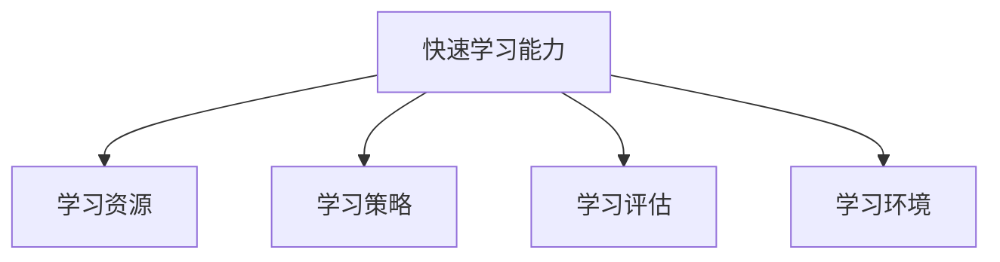

                 

# 管理者的快速学习能力培养

## 1. 背景介绍

### 1.1 问题由来
在当今快速变化和不确定性的商业环境中，管理者需要具备快速学习和适应新环境的能力，以便应对各种挑战和机遇。然而，传统的学习和培训模式往往难以满足这种需求，管理者需要寻找更高效、灵活的学习方法来提升自己的竞争力。

### 1.2 问题核心关键点
快速学习能力培养的核心在于如何使管理者在有限的时间内，掌握新知识、新技能，并将其应用于实际工作中。关键点包括：
- 高效学习策略的制定
- 学习资源的整合
- 实践和反馈机制的建立
- 持续改进和自我更新

### 1.3 问题研究意义
管理者快速学习能力培养对于提升组织竞争力和推动业务发展具有重要意义：
1. 增强组织适应性：快速学习使管理者能迅速适应外部环境的变化，灵活调整策略。
2. 提升工作效率：学习新知识后，管理者能够更高效地处理复杂问题和决策。
3. 促进个人成长：持续学习有助于管理者实现职业发展和个人成长。
4. 驱动创新：快速学习使管理者能够掌握新技术、新方法，推动组织创新。

## 2. 核心概念与联系

### 2.1 核心概念概述

为了更好地理解快速学习能力培养，本节将介绍几个关键概念：

- 快速学习能力：指管理者在较短时间内掌握新知识和新技能的能力，是适应新环境、解决新问题的关键。
- 学习资源：包括课程、书籍、在线资源、导师辅导等，是学习的基础。
- 学习策略：如主动学习、案例学习、反思学习等，是学习方式的选择。
- 学习评估：通过测验、反馈、评价等手段，评估学习效果。
- 学习环境：包括物理环境、心理环境、社会环境等，是学习的支撑。

这些核心概念之间的逻辑关系可以通过以下Mermaid流程图来展示：



这个流程图展示了一些关键概念之间的联系：

1. 快速学习能力由学习资源、学习策略、学习评估和学习环境共同作用。
2. 学习资源和学习策略互相支持，决定了学习效果。
3. 学习评估和学习环境对学习过程进行监控和改进。

## 3. 核心算法原理 & 具体操作步骤
### 3.1 算法原理概述

快速学习能力培养的核心算法原理基于“可迁移学习”和“主动学习”理论，通过整合多种学习资源和方法，使管理者在短时间内掌握新知识。具体来说，其核心在于：
- 选择合适的学习资源
- 采用有效的学习策略
- 设置合理的学习评估指标
- 创建支持学习的环境

### 3.2 算法步骤详解

基于快速学习能力培养的算法，可以按照以下步骤进行操作：

**Step 1: 识别学习需求**
- 分析当前工作环境和业务需求，确定管理者需要掌握的新知识和技能。
- 制定学习目标，明确具体学习内容和时间表。

**Step 2: 选择学习资源**
- 根据学习需求，选择适合的课程、书籍、在线资源等。
- 考虑资源的质量、相关性和可访问性，选择最合适的学习材料。

**Step 3: 设计学习策略**
- 确定学习方式，如主动学习、案例学习、反思学习等。
- 制定学习计划，包括学习时间、频率、方法等。

**Step 4: 实施学习过程**
- 按照学习计划，进行有计划的学习活动。
- 采用多种学习方式，如自主学习、小组讨论、实践操作等。

**Step 5: 评估学习效果**
- 通过测验、考试、项目评估等方式，评估学习成果。
- 分析评估结果，找出学习中的不足和改进点。

**Step 6: 反馈和改进**
- 根据评估结果和反馈，调整学习策略和方法。
- 持续改进学习计划，提升学习效果。

**Step 7: 应用所学知识**
- 将学习到的知识和技能应用到实际工作中。
- 定期反思和总结，进一步巩固和提升学习成果。

### 3.3 算法优缺点

快速学习能力培养的算法具有以下优点：
1. 灵活高效：通过灵活选择学习资源和策略，使管理者在短时间内掌握新知识。
2. 结构清晰：制定学习目标、计划和评估，使学习过程有条不紊。
3. 注重实践：强调学习知识的实际应用，提升学习效果。

同时，该方法也存在一定的局限性：
1. 对学习资源依赖性高：需要找到合适的学习材料和工具。
2. 学习效果受制于个人动机和自律性：部分管理者可能缺乏自主学习的动力。
3. 需要持续投入时间和精力：学习过程需要较长时间和持续努力。

尽管存在这些局限性，但就目前而言，快速学习能力培养仍是最主流和高效的学习方法之一。未来相关研究的重点在于如何进一步降低学习资源的依赖性，提高学习的自我驱动性和自动化程度。

### 3.4 算法应用领域

快速学习能力培养的算法在多个领域有广泛应用：

- **企业管理**：提升高层管理者的决策能力和战略思维。
- **市场营销**：使市场团队快速掌握新市场趋势和技术。
- **技术开发**：加速技术人员对新技术和工具的掌握。
- **金融分析**：帮助金融分析师迅速理解新市场和投资机会。
- **人力资源**：提高人力资源管理者的招聘和培训技能。

这些领域的管理者通过快速学习能力培养，能够在短时间内掌握新知识，提升整体组织能力和业务水平。

## 4. 数学模型和公式 & 详细讲解 & 举例说明

### 4.1 数学模型构建

为了更加系统地描述快速学习能力培养的过程，我们可以构建一个数学模型。假设学习者 $L$ 在 $t$ 时刻的学习效果为 $E(t)$，学习者 $L$ 的学习速度为 $v$，学习资源的供给为 $R(t)$，学习策略的有效性为 $S(t)$，学习环境的影响为 $E(t)$。则有：

$$
E(t) = v \cdot R(t) \cdot S(t) \cdot E(t-1) + \varepsilon(t)
$$

其中 $\varepsilon(t)$ 为随机误差，可以建模为正态分布。

### 4.2 公式推导过程

接下来，我们将对上述模型进行详细推导。

假设学习者的初始学习效果为 $E_0$，则有：

$$
E(t) = v \cdot R(t) \cdot S(t) \cdot E_0 + \sum_{i=1}^t \varepsilon(i)
$$

根据正态分布的性质，$\sum_{i=1}^t \varepsilon(i)$ 可以看作是均值为0、标准差为 $\sigma$ 的高斯随机变量，即：

$$
\sum_{i=1}^t \varepsilon(i) \sim \mathcal{N}(0, t\sigma^2)
$$

将上述公式代入 $E(t)$ 的表达式中，得：

$$
E(t) = v \cdot R(t) \cdot S(t) \cdot E_0 + \mathcal{N}(0, t\sigma^2)
$$

### 4.3 案例分析与讲解

以某公司管理层快速学习项目为例，假设公司管理层需要学习新的数字化转型策略。根据上述模型，可以推导出：

1. 选择高质量的学习资源 $R(t)$，如业界权威书籍和在线课程。
2. 采用有效的学习策略 $S(t)$，如案例学习和反思学习。
3. 优化学习环境 $E(t)$，如提供交流平台和导师辅导。
4. 管理层的学习效果 $E(t)$ 随时间增长逐渐提升，但受到随机误差的影响，存在波动。

## 5. 项目实践：代码实例和详细解释说明

### 5.1 开发环境搭建

在进行快速学习能力培养的实践前，我们需要准备好开发环境。以下是使用Python进行PyTorch开发的环境配置流程：

1. 安装Anaconda：从官网下载并安装Anaconda，用于创建独立的Python环境。

2. 创建并激活虚拟环境：
```bash
conda create -n pytorch-env python=3.8 
conda activate pytorch-env
```

3. 安装PyTorch：根据CUDA版本，从官网获取对应的安装命令。例如：
```bash
conda install pytorch torchvision torchaudio cudatoolkit=11.1 -c pytorch -c conda-forge
```

4. 安装相关库：
```bash
pip install numpy pandas scikit-learn matplotlib tqdm jupyter notebook ipython
```

完成上述步骤后，即可在`pytorch-env`环境中开始项目实践。

### 5.2 源代码详细实现

这里以一个简化的管理层快速学习项目为例，给出使用PyTorch进行学习效果评估的代码实现。

首先，定义管理层的初始学习效果和标准差：

```python
import numpy as np

# 初始学习效果
E_0 = 0
# 学习效果标准差
sigma = 0.1
```

然后，定义学习过程的模拟函数，计算任意时刻的学习效果：

```python
def calculate_learning_effect(t, v, R, S):
    E = np.sum(np.random.normal(0, sigma, t)) + v * R * S * E_0
    return E
```

接着，模拟管理层的学习过程，使用不同的学习资源和策略：

```python
# 假设学习资源供给固定
R = 10
# 假设学习策略有效性固定
S = 0.8

# 学习时间
T = 100
# 学习速度
v = 0.1

# 计算各个时刻的学习效果
learning_effects = []
for t in range(T+1):
    E = calculate_learning_effect(t, v, R, S)
    learning_effects.append(E)
```

最后，使用Matplotlib绘制学习效果随时间的变化曲线：

```python
import matplotlib.pyplot as plt

plt.plot(range(T+1), learning_effects)
plt.xlabel('Time')
plt.ylabel('Learning Effect')
plt.title('Learning Effect over Time')
plt.show()
```

### 5.3 代码解读与分析

这里我们详细解读一下关键代码的实现细节：

**calculate_learning_effect函数**：
- 使用NumPy库，通过高斯分布模拟随机误差，计算任意时刻的学习效果。

**学习过程模拟**：
- 假设学习资源 $R(t)$ 和策略有效性 $S(t)$ 固定，使用循环模拟不同时刻的学习效果。
- 将每个时刻的学习效果存储在列表中，形成时间序列。

**绘图分析**：
- 使用Matplotlib库绘制学习效果随时间的变化曲线。
- 通过图形展示，可以直观地观察学习效果的变化趋势和波动情况。

可以看到，通过简单的代码实现，我们可以对管理者的快速学习能力培养过程进行模拟和分析，从而更好地理解其影响因素和变化规律。

## 6. 实际应用场景

### 6.1 智能客服系统

基于快速学习能力培养，智能客服系统可以通过短期的培训快速提升服务质量和用户满意度。管理层可以采用案例学习和反馈机制，使客服团队快速掌握新服务流程和应对策略。

在技术实现上，可以通过在线课程和案例分享，对客服团队进行系统培训。培训过程中，定期收集用户反馈，及时调整服务策略。如此构建的智能客服系统，能大幅提升客户咨询体验和问题解决效率。

### 6.2 金融舆情监测

金融机构需要实时监测市场舆论动向，以便及时应对负面信息传播，规避金融风险。基于快速学习能力培养，管理层可以迅速掌握新市场趋势和投资策略。

具体而言，可以组织高层管理层参加金融市场分析和投资策略的培训课程。培训结束后，通过模拟交易和实战演练，使管理层快速掌握新策略的应用。将培训成果应用到实际监测中，快速响应市场变化，提升决策水平。

### 6.3 个性化推荐系统

当前的推荐系统往往只依赖用户的历史行为数据进行物品推荐，难以满足用户的个性化需求。基于快速学习能力培养，管理层可以迅速掌握新推荐技术和方法。

在实践中，可以组织技术人员参加推荐算法和数据挖掘的培训课程。课程结束后，通过实战项目和Kaggle竞赛，使技术人员快速掌握新推荐方法。将新推荐系统应用到实际业务中，提升推荐效果，满足用户个性化需求。

### 6.4 未来应用展望

随着快速学习能力培养技术的发展，未来将在更多领域得到应用，为组织带来变革性影响。

在智慧医疗领域，基于快速学习能力培养的培训项目，可以提升医护人员的技能水平，快速掌握新医疗技术。

在智能教育领域，快速学习能力培养可以应用于教师培训和学生学习，因材施教，促进教育公平，提高教学质量。

在智慧城市治理中，快速学习能力培养可应用于城市管理人员的培训，快速掌握新政策和技术，提高管理效率。

此外，在企业生产、社会治理、文娱传媒等众多领域，快速学习能力培养也将不断涌现，为组织数字化转型提供新的动力。相信随着技术的日益成熟，快速学习能力培养必将在构建智能组织中扮演越来越重要的角色。

## 7. 工具和资源推荐

### 7.1 学习资源推荐

为了帮助管理者系统掌握快速学习能力培养的理论基础和实践技巧，这里推荐一些优质的学习资源：

1. 《快速学习能力培养指南》系列博文：由管理培训专家撰写，深入浅出地介绍了快速学习能力培养的基本概念和实践方法。

2. 《管理学》课程：多所知名大学开设的管理学在线课程，系统讲解管理理论和方法，适合各类管理者学习。

3. 《快速学习与职业发展》书籍：聚焦于快速学习能力培养，提供实用的学习技巧和案例分析，帮助管理者提升职业竞争力。

4. 《快速学习与创新》课程：强调快速学习能力培养对创新和领导力的重要性，提供系统的培训方案。

5. Coursera和edX等在线教育平台：提供丰富的管理类课程和认证项目，助力管理者提升综合能力。

通过对这些资源的学习实践，相信管理者一定能够快速掌握快速学习能力培养的精髓，并用于提升自身和组织的竞争力。

### 7.2 开发工具推荐

高效的开发离不开优秀的工具支持。以下是几款用于快速学习能力培养开发的常用工具：

1. PyTorch：基于Python的开源深度学习框架，灵活动态的计算图，适合快速迭代研究。大部分预训练语言模型都有PyTorch版本的实现。

2. TensorFlow：由Google主导开发的开源深度学习框架，生产部署方便，适合大规模工程应用。同样有丰富的预训练语言模型资源。

3. Coursera和edX等在线教育平台：提供丰富的管理类课程和认证项目，助力管理者提升综合能力。

4. Weights & Biases：模型训练的实验跟踪工具，可以记录和可视化模型训练过程中的各项指标，方便对比和调优。与主流深度学习框架无缝集成。

5. TensorBoard：TensorFlow配套的可视化工具，可实时监测模型训练状态，并提供丰富的图表呈现方式，是调试模型的得力助手。

合理利用这些工具，可以显著提升快速学习能力培养任务的开发效率，加快创新迭代的步伐。

### 7.3 相关论文推荐

快速学习能力培养的研究源于学界的持续研究。以下是几篇奠基性的相关论文，推荐阅读：

1. "The Art of Learning: How to Learn Anything Fast and Efficiently"：作者Geoffrey Waggner，系统介绍了快速学习能力培养的基本理论和实践方法。

2. "Learning to Learn: An Exploration of Human and Machine Learning Capabilities"：作者Adamo和Bengio，探讨了人类和机器在学习过程中的相似性和差异性。

3. "Wise: Making Intelligent Learning Computational"：作者Richard E. Mayer，讨论了计算在教育中的应用，强调了快速学习能力培养的重要性。

4. "The Power of Metacognition in Supporting Lifelong Learning"：作者Lisa Grant，探讨了元认知在支持终身学习中的作用，强调了快速学习能力培养的心理学基础。

这些论文代表了大语言模型微调技术的发展脉络。通过学习这些前沿成果，可以帮助管理者掌握快速学习能力培养的理论基础和实践方法，进一步提升管理水平和组织竞争力。

## 8. 总结：未来发展趋势与挑战

### 8.1 总结

本文对快速学习能力培养的方法进行了全面系统的介绍。首先阐述了快速学习能力培养的研究背景和意义，明确了其在提升组织竞争力和推动业务发展方面的重要作用。其次，从原理到实践，详细讲解了快速学习能力培养的数学模型和操作步骤，给出了快速学习能力培养项目开发的完整代码实例。同时，本文还广泛探讨了快速学习能力培养在多个行业领域的应用前景，展示了快速学习能力培养范式的广阔前景。最后，本文精选了快速学习能力培养的各类学习资源，力求为管理者提供全方位的技术指引。

通过本文的系统梳理，可以看到，快速学习能力培养的方法正在成为管理者提升综合能力的核心手段，极大地拓展了管理者的知识边界，为组织发展注入了新的动力。未来，伴随快速学习能力培养技术的不断演进，相信管理者将能够更高效地适应复杂多变的商业环境，推动组织持续创新和发展。

### 8.2 未来发展趋势

展望未来，快速学习能力培养技术将呈现以下几个发展趋势：

1. 学习资源的多样化。除了传统的课程和书籍，未来将更多地利用在线视频、交互式平台、虚拟现实等多样化学习资源。
2. 学习方式的多元化。除了传统的课堂学习，未来将更多地采用翻转课堂、小组讨论、项目实战等多元化学习方式。
3. 学习效果的智能化。未来将利用人工智能和大数据分析，进行个性化推荐和学习效果评估，提升学习效率和效果。
4. 学习过程的自动化。未来将利用机器学习技术，自动推荐学习资源，生成学习计划，辅助学习者进行自主学习。
5. 学习环境的优化。未来将通过优化物理环境、心理环境和社交环境，提升学习体验和效果。

这些趋势凸显了快速学习能力培养技术的广阔前景。这些方向的探索发展，必将进一步提升管理者的学习效果，加速组织知识和技术的迭代更新。

### 8.3 面临的挑战

尽管快速学习能力培养技术已经取得了显著成果，但在迈向更加智能化、普适化应用的过程中，它仍面临诸多挑战：

1. 学习资源的可获取性。部分复杂高阶的知识可能难以找到合适的学习资源。
2. 学习效果的评估。如何客观评估学习效果，以及学习者对知识的掌握程度。
3. 学习动机的维持。长期的学习过程可能使学习者感到疲劳和厌倦。
4. 学习效果的持续性。如何确保学习者在实际工作中能够持续应用所学知识。
5. 学习效果的泛化。如何确保学习者能够将所学知识应用到不同的情境和问题中。

这些挑战需要相关研究人员和企业共同努力，探索新的方法和技术，才能进一步提升快速学习能力培养的效果和普及度。

### 8.4 研究展望

面对快速学习能力培养面临的挑战，未来的研究需要在以下几个方面寻求新的突破：

1. 探索更为高效的学习资源。开发更多高质量的学习资源，如虚拟现实课程、交互式平台等，提升学习效率。
2. 发展智能化的学习评估技术。利用大数据和机器学习，实现对学习效果的量化评估，提升学习效果。
3. 设计更加灵活的学习策略。结合个性化学习路径和自主学习工具，提升学习动机和效果。
4. 采用更加智能的学习环境。通过虚拟现实、增强现实等技术，优化学习体验和效果。
5. 探索持续学习的方法。利用持续学习技术和知识图谱，使学习者能够持续更新和扩展知识。

这些研究方向的探索，必将引领快速学习能力培养技术迈向更高的台阶，为组织培养出更多具有快速学习能力的高素质人才，推动组织在复杂多变的商业环境中不断创新和发展。

## 9. 附录：常见问题与解答

**Q1：如何快速提升管理者的学习效果？**

A: 要快速提升管理者的学习效果，关键在于选择高效的学习资源和策略，制定科学的学习计划。具体措施包括：
1. 选择合适的学习资源，如权威书籍、在线课程、案例研究等。
2. 采用高效的学习策略，如主动学习、案例学习、反思学习等。
3. 设置合理的学习目标和时间表，保持学习的系统性和连续性。
4. 定期评估学习效果，及时调整学习策略和资源。

**Q2：如何评估管理者的学习效果？**

A: 评估管理者的学习效果可以从以下几个方面入手：
1. 通过测验和考试，评估对知识点的掌握程度。
2. 通过项目实战，评估将所学知识应用到实际工作中的能力。
3. 通过反馈和反思，评估学习过程中的问题和对知识的理解深度。
4. 通过数据和分析，评估学习效果的持续性和泛化能力。

**Q3：如何在有限的时间内提升管理者的学习能力？**

A: 要在有限的时间内提升管理者的学习能力，需要采用以下策略：
1. 利用碎片化时间进行学习，如通勤、午休等，最大化利用时间。
2. 采用高效的自主学习工具和平台，如Coursera、edX、Udacity等，获取高质量的学习资源。
3. 结合在线学习和线下学习，形成系统化的学习体系。
4. 定期反思和总结，及时调整学习策略，提升学习效果。

**Q4：如何快速培养管理者的快速学习能力？**

A: 要快速培养管理者的快速学习能力，可以采用以下方法：
1. 提供系统的培训和课程，帮助管理者掌握快速学习能力培养的基本理论和实践方法。
2. 利用虚拟现实、增强现实等技术，优化学习体验和效果。
3. 结合个性化学习路径和自主学习工具，提升学习动机和效果。
4. 通过数据和分析，持续改进学习过程，提升学习效果。

通过这些方法，相信管理者能够快速提升自身的快速学习能力，更好地应对复杂多变的商业环境，推动组织持续创新和发展。

---

作者：禅与计算机程序设计艺术 / Zen and the Art of Computer Programming

