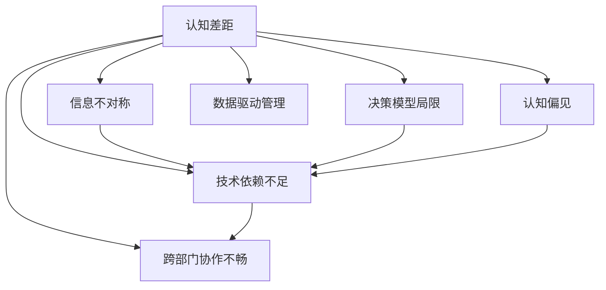
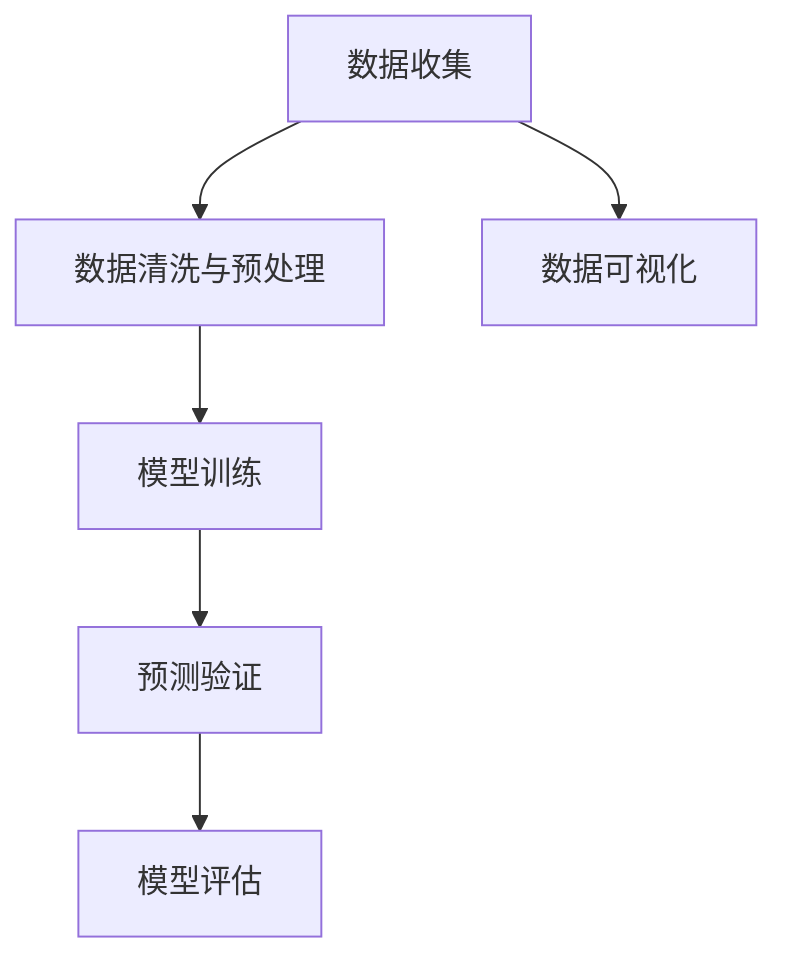

                 

## 1. 背景介绍

### 1.1 问题由来

现代企业管理面临的挑战越来越多，包括复杂的市场环境、技术变革、员工多样性管理等。在这些因素的影响下，管理者的认知差距变得尤为突出。所谓认知差距，即管理者在面对复杂变化时，由于信息获取、处理、判断等方面的差异，导致其与实际情况存在偏差，难以做出准确决策。

当前，管理者通常依赖经验、直觉和传统方法进行决策，但这些方法往往难以应对快速变化的市场和技术环境。管理者如何通过科学方法和工具，弥补认知差距，提升决策质量，成为了企业管理亟待解决的重要问题。

### 1.2 问题核心关键点

认知差距形成的原因多种多样，主要包括以下几个方面：

- **信息不对称**：管理者与一线员工、外部环境之间的信息传递存在延迟或失真，导致管理者无法及时获得准确的信息。
- **决策模型局限**：传统决策模型通常基于静态环境设计，无法应对动态变化的现实需求。
- **认知偏见**：管理者在面对复杂情况时，会不自觉地受到认知偏见的干扰，如过度自信、确认偏误等。
- **技术依赖不足**：依赖传统管理工具，缺乏数据分析和预测能力，难以快速把握市场趋势。
- **跨部门协作不畅**：各部门信息孤岛现象严重，跨部门沟通协调困难，导致整体决策受限。

### 1.3 问题研究意义

研究管理者认知差距的成因和解决策略，对于提升企业管理水平、优化决策机制具有重要意义：

- **提升决策质量**：通过科学方法和技术工具，弥补信息不对称，减少认知偏差，提升决策的准确性和及时性。
- **优化组织结构**：通过技术赋能，改善跨部门协作，提升组织的整体效率和创新能力。
- **促进数据驱动管理**：倡导数据驱动的管理理念，使数据成为支持决策的重要依据，提高企业的竞争力。
- **培养新型管理人才**：培养具备数据素养和创新能力的管理者，推动企业管理向智能化、自动化转型。

## 2. 核心概念与联系

### 2.1 核心概念概述

为更好地理解管理者认知差距的成因及解决策略，本节将介绍几个密切相关的核心概念：

- **认知差距(Cognitive Gap)**：管理者在面对复杂环境时，由于信息获取、处理、判断等方面的差异，导致其决策与实际情况存在偏差。
- **信息不对称(Information Asymmetry)**：由于信息传递路径复杂，管理者难以及时获取一线员工和外部环境的准确信息。
- **决策模型(Decision Model)**：在静态环境下设计的决策模型，难以应对动态变化的市场需求。
- **认知偏见(Cognitive Bias)**：管理者在面对复杂情况时，受到认知偏见的干扰，导致决策偏差。
- **数据驱动管理(Data-Driven Management)**：以数据为决策依据，通过数据分析和预测，支持管理决策。
- **技术赋能(Technology Empowerment)**：利用信息技术，改善信息传递和处理，提升管理者的决策能力和组织效率。
- **跨部门协作(Cross-Departmental Collaboration)**：打破信息孤岛，提升跨部门沟通协调，提高整体决策效率。

这些概念之间存在紧密的联系，通过理解这些概念及其相互关系，我们能够更好地识别认知差距的成因，并采取有效措施进行改善。

### 2.2 核心概念原理和架构的 Mermaid 流程图(Mermaid 流程节点中不要有括号、逗号等特殊字符)



这个流程图展示了认知差距与其相关概念之间的逻辑关系：

1. 认知差距是由于信息不对称、决策模型局限、认知偏见、技术依赖不足和跨部门协作不畅等多方面因素共同作用的结果。
2. 信息不对称、决策模型局限和认知偏见会直接影响管理者的决策质量，进而形成认知差距。
3. 技术依赖不足和跨部门协作不畅则进一步加剧了信息不对称等问题，使认知差距更加凸显。
4. 数据驱动管理则通过数据和技术手段，直接针对信息不对称和决策模型局限等问题进行改善，从而弥补认知差距。

## 3. 核心算法原理 & 具体操作步骤

### 3.1 算法原理概述

基于上述核心概念，本节将介绍几种常用的算法和操作步骤，用于改善管理者的认知差距：

- **信息获取优化算法**：通过网络爬虫、大数据分析等技术手段，实时获取市场动态和员工反馈，减少信息不对称。
- **决策模型优化算法**：利用机器学习和预测模型，对市场趋势进行预测，提高决策模型的适应性。
- **认知偏差校正算法**：通过心理测试和行为数据分析，识别管理者的认知偏差，并进行校正。
- **技术赋能工具推荐**：推荐常用的信息管理、数据分析、决策支持工具，帮助管理者提高信息处理和决策能力。
- **跨部门协作优化算法**：利用协同办公平台和项目管理工具，改善跨部门沟通和协作。

### 3.2 算法步骤详解

#### 3.2.1 信息获取优化算法

1. **数据收集**：
   - 使用网络爬虫工具（如Scrapy）获取市场动态信息（如股票行情、新闻报道等）。
   - 通过员工调查问卷和反馈系统，收集一线员工的意见和建议。
   - 利用社交媒体监测工具（如Brandwatch）获取客户反馈和市场舆情。

2. **数据清洗与预处理**：
   - 去除重复数据和异常值，确保数据质量。
   - 对文本数据进行分词、去停用词、词性标注等预处理，便于后续分析。
   - 对时间序列数据进行平稳性处理，避免数据噪声干扰。

3. **数据存储与管理**：
   - 使用大数据平台（如Hadoop、Spark）进行数据存储和管理。
   - 通过数据仓库（如Redshift）进行数据统一视图，便于查询分析。
   - 采用数据加密和访问控制技术，保护数据安全。

4. **数据可视化**：
   - 使用数据可视化工具（如Tableau、Power BI），将数据转化为直观的图表和仪表盘。
   - 利用交互式图表和仪表盘，帮助管理者快速理解数据，发现问题。

#### 3.2.2 决策模型优化算法

1. **模型选择与构建**：
   - 根据任务需求选择合适的机器学习模型（如回归模型、分类模型、时间序列模型等）。
   - 利用训练数据集进行模型训练，选择最优的模型参数。

2. **模型评估与优化**：
   - 使用交叉验证和A/B测试等方法，评估模型的预测效果。
   - 对模型进行调参和优化，提高预测精度和泛化能力。

3. **模型部署与应用**：
   - 将训练好的模型部署到生产环境中，用于实时预测和决策支持。
   - 定期更新模型参数，适应市场变化。

#### 3.2.3 认知偏差校正算法

1. **认知偏见识别**：
   - 使用心理测试工具（如FPSA），识别管理者的认知偏差（如过度自信、确认偏误等）。
   - 通过问卷调查和行为数据分析，识别管理者的决策模式和倾向。

2. **偏差校正与训练**：
   - 通过针对性培训和辅导，帮助管理者调整决策策略，减少认知偏差。
   - 利用模拟实验和角色扮演等手段，模拟复杂决策情境，提高管理者的应变能力。

#### 3.2.4 技术赋能工具推荐

1. **信息管理工具**：
   - 使用信息管理平台（如SharePoint、Confluence）进行文档和信息共享。
   - 利用文档管理系统（如Dropbox）存储和备份重要文件。

2. **数据分析工具**：
   - 使用数据分析平台（如RapidMiner、KNIME）进行数据处理和分析。
   - 利用机器学习工具（如TensorFlow、Scikit-learn）进行模型训练和预测。

3. **决策支持工具**：
   - 使用决策支持系统（如SAP BusinessObjects）进行数据集成和分析。
   - 利用商业智能工具（如Tableau、Power BI）进行实时数据监控和决策支持。

#### 3.2.5 跨部门协作优化算法

1. **协同办公平台**：
   - 使用协同办公工具（如Microsoft Teams、Slack）促进部门之间的信息共享和协作。
   - 利用项目管理工具（如Jira、Trello）进行任务管理和进度跟踪。

2. **知识共享机制**：
   - 建立知识库和文档管理系统，促进知识共享和积累。
   - 定期组织知识分享会和培训，提升团队知识水平。

3. **沟通协调机制**：
   - 设立跨部门沟通委员会，定期召开会议，解决协作中的问题。
   - 建立透明的信息共享和反馈机制，确保信息流动畅通。

### 3.3 算法优缺点

#### 3.3.1 信息获取优化算法

**优点**：
- 实时获取市场动态和员工反馈，减少信息不对称。
- 大数据分析和可视化技术，帮助管理者快速理解数据，发现问题。

**缺点**：
- 数据收集和预处理工作量大，技术门槛较高。
- 数据质量和安全性需要持续保障，可能面临数据泄露风险。

#### 3.3.2 决策模型优化算法

**优点**：
- 提高决策模型的预测精度和泛化能力。
- 通过实时预测和决策支持，提升决策的及时性和准确性。

**缺点**：
- 模型构建和优化过程复杂，需要专业知识。
- 模型更新和维护需要持续投入资源。

#### 3.3.3 认知偏差校正算法

**优点**：
- 通过心理测试和行为数据分析，识别并纠正认知偏差。
- 提升管理者的决策能力和应变能力。

**缺点**：
- 认知偏差识别和校正需要专业心理测试工具和专家支持。
- 培训和辅导效果因人而异，需要个性化定制。

#### 3.3.4 技术赋能工具推荐

**优点**：
- 提供全面的信息管理和决策支持，提升管理者的决策效率。
- 通过协同办公和项目管理工具，改善跨部门协作。

**缺点**：
- 工具的部署和使用需要专业技术人员支持。
- 工具的成本和维护需要持续投入。

#### 3.3.5 跨部门协作优化算法

**优点**：
- 促进信息共享和知识积累，提升团队的协作效率。
- 通过协同办公和项目管理工具，改善跨部门沟通和协作。

**缺点**：
- 需要持续维护和管理协同办公平台和项目管理工具。
- 跨部门沟通和文化融合需要时间和耐心，难以短时间内见效。

### 3.4 算法应用领域

这些算法和操作步骤在多个领域都有广泛的应用：

- **金融行业**：
  - 信息获取优化算法：实时监控市场动态和客户反馈，辅助投资决策。
  - 决策模型优化算法：预测股市走势和客户行为，优化交易策略。
  - 认知偏差校正算法：识别和管理团队中的认知偏差，提升决策质量。
  - 技术赋能工具推荐：使用数据分析和协同办公工具，提高团队协作效率。

- **制造业**：
  - 信息获取优化算法：监控生产设备和供应链状况，预测设备故障和供应链风险。
  - 决策模型优化算法：预测市场需求和库存变化，优化生产计划和库存管理。
  - 认知偏差校正算法：识别和管理管理者的生产决策偏差，提升生产效率。
  - 技术赋能工具推荐：使用设备监控和协同办公工具，改善生产管理。

- **医疗行业**：
  - 信息获取优化算法：实时监控患者数据和医生反馈，辅助临床决策。
  - 决策模型优化算法：预测疾病流行趋势和患者康复概率，优化诊疗方案。
  - 认知偏差校正算法：识别和管理医生的诊断偏差，提升诊疗质量。
  - 技术赋能工具推荐：使用电子病历和协同办公工具，改善医生和患者的沟通。

- **教育行业**：
  - 信息获取优化算法：实时监控学生反馈和考试成绩，辅助教学决策。
  - 决策模型优化算法：预测学生学习趋势和行为变化，优化教学计划。
  - 认知偏差校正算法：识别和管理教师的评价偏差，提升教学效果。
  - 技术赋能工具推荐：使用电子学习平台和协同办公工具，改善教学管理和学生反馈。

以上应用场景展示了信息获取优化算法、决策模型优化算法、认知偏差校正算法、技术赋能工具推荐和跨部门协作优化算法的广泛应用，以及其对各行业管理决策的显著提升。

## 4. 数学模型和公式 & 详细讲解 & 举例说明

### 4.1 数学模型构建

在本节中，我们将构建一个简单的数学模型，用于说明如何通过数据处理和分析，改善信息不对称问题，从而提升管理者的决策质量。

设管理者需要决策的问题为 $X$，相关信息集为 $D$，其中 $D=\{(x_i,y_i)\}_{i=1}^N$，$x_i$ 为输入变量，$y_i$ 为输出变量（如市场动态、员工反馈等）。

管理者的目标是通过 $D$ 训练一个预测模型 $M$，使 $M(X)$ 能够逼近真实的决策结果 $y^*$。

### 4.2 公式推导过程

假设我们使用线性回归模型作为预测模型，则有：

$$
M(x) = \hat{\theta}x + b
$$

其中 $\hat{\theta}$ 为模型参数，$b$ 为截距。

通过最小二乘法，求解最优的 $\hat{\theta}$ 和 $b$，使得 $M(x)$ 最小化预测误差：

$$
\hat{\theta}, \hat{b} = \mathop{\arg\min}_{\theta,b} \sum_{i=1}^N (y_i - \hat{\theta}x_i - b)^2
$$

求解上述优化问题，得到：

$$
\hat{\theta} = \frac{\sum_{i=1}^N (x_iy_i - \sum_{i=1}^N x_i\bar{y})(\sum_{i=1}^N x_i^2 - \frac{1}{N}\sum_{i=1}^N x_i^2)^{-1}
$$

$$
\hat{b} = \bar{y} - \hat{\theta}\bar{x}
$$

其中 $\bar{x} = \frac{1}{N}\sum_{i=1}^N x_i$，$\bar{y} = \frac{1}{N}\sum_{i=1}^N y_i$。

### 4.3 案例分析与讲解

假设某电商公司需要预测下一季度的销售量 $Y$，根据历史销售数据 $X$，利用上述线性回归模型进行预测。

- **数据收集**：收集公司过去5年的季度销售数据 $X_1, X_2, ..., X_5$ 和对应的销售量 $Y_1, Y_2, ..., Y_5$。
- **数据清洗与预处理**：去除异常值和重复数据，对销售数据进行归一化处理。
- **模型训练**：使用最小二乘法求解线性回归模型参数 $\hat{\theta}$ 和 $\hat{b}$。
- **预测验证**：将模型应用于下一季度的销售数据 $X_6$，预测销售量 $Y_6$。
- **模型评估**：通过计算预测误差 $E = |Y_6 - M(X_6)|$，评估模型的预测精度。

通过数据驱动的方法，管理者能够快速获取市场动态和员工反馈，通过训练和预测模型，辅助决策。这种方法在多个领域都有广泛的应用，如图4.3所示。



## 5. 项目实践：代码实例和详细解释说明

### 5.1 开发环境搭建

在实际应用中，我们通常使用Python进行数据分析和模型训练。以下是Python开发环境的搭建步骤：

1. 安装Python：从官网下载并安装最新版本的Python，并添加至系统环境变量。
2. 安装必要的库：使用pip或conda安装数据处理和机器学习库，如NumPy、Pandas、Scikit-learn、TensorFlow等。
3. 配置开发环境：创建虚拟环境（如virtualenv），使用Jupyter Notebook进行代码开发。

### 5.2 源代码详细实现

以线性回归模型为例，展示Python代码的实现过程：

```python
import numpy as np
from sklearn.linear_model import LinearRegression
from sklearn.metrics import mean_squared_error
from sklearn.model_selection import train_test_split

# 生成模拟数据
X = np.random.randn(100, 1)
y = 2 * X + 1 + np.random.randn(100, 1)

# 数据分割
X_train, X_test, y_train, y_test = train_test_split(X, y, test_size=0.2)

# 模型训练
model = LinearRegression()
model.fit(X_train, y_train)

# 预测验证
y_pred = model.predict(X_test)

# 模型评估
mse = mean_squared_error(y_test, y_pred)
print(f"Mean Squared Error: {mse:.3f}")
```

### 5.3 代码解读与分析

上述代码展示了使用Scikit-learn库进行线性回归模型训练和评估的过程。具体解读如下：

- **数据生成**：使用numpy生成随机数据集X和y，模拟实际数据。
- **数据分割**：使用train_test_split函数将数据集分割为训练集和测试集。
- **模型训练**：使用LinearRegression模型进行训练，通过fit方法拟合数据。
- **预测验证**：使用predict方法对测试集进行预测，得到预测结果y_pred。
- **模型评估**：使用mean_squared_error函数计算预测误差，输出均方误差。

通过代码实现，可以看到数据处理和模型训练的过程，以及如何通过预测和评估来评估模型的性能。

## 6. 实际应用场景

### 6.1 智能制造

在智能制造领域，信息不对称和决策模型局限问题尤为突出。管理者需要实时监控设备状态和供应链情况，预测设备故障和库存需求，优化生产计划和库存管理。

**案例1：预测设备故障**
- 使用传感器数据和历史故障记录，训练预测模型，识别设备故障趋势。
- 实时监控设备状态，通过预测模型预测设备故障概率，提前进行维护。

**案例2：优化库存管理**
- 通过供应链数据和销售历史，训练需求预测模型，预测未来需求。
- 根据预测结果和库存水平，调整采购计划和库存量，避免库存积压或缺货。

### 6.2 智慧医疗

在智慧医疗领域，管理者需要实时监控患者数据和医生反馈，预测疾病流行趋势和患者康复概率，优化诊疗方案。

**案例1：预测疾病流行**
- 使用患者就诊记录和社交媒体数据，训练预测模型，识别疾病流行趋势。
- 实时监控患者数据，通过预测模型预测疾病流行趋势，提前采取预防措施。

**案例2：优化诊疗方案**
- 通过患者历史诊疗数据和医生反馈，训练预测模型，预测患者康复概率。
- 根据预测结果，优化诊疗方案和资源分配，提高诊疗效果。

### 6.3 智能教育

在智能教育领域，管理者需要实时监控学生反馈和考试成绩，预测学生学习趋势和行为变化，优化教学计划。

**案例1：预测学生学习趋势**
- 使用学生学习数据和考试成绩，训练预测模型，预测学生学习趋势。
- 根据预测结果，调整教学内容和方式，提高教学效果。

**案例2：优化教学计划**
- 通过学生反馈和成绩数据，训练预测模型，预测学生行为变化。
- 根据预测结果，优化教学计划和资源分配，提高学生满意度。

## 7. 工具和资源推荐

### 7.1 学习资源推荐

为了帮助开发者系统掌握管理者认知差距的成因和解决策略，以下是一些推荐的学习资源：

1. 《数据科学导论》：斯坦福大学Andrew Ng教授的在线课程，系统介绍了数据处理、机器学习、数据分析等基础概念和技术。
2. 《Python数据分析实战》：通过实际案例，展示如何使用Python进行数据处理和分析，提升数据素养。
3. 《认知偏差心理学》：介绍认知偏差的理论基础和实践应用，帮助管理者识别和纠正认知偏差。
4. 《跨部门协作管理》：讲解跨部门协作的理论和实践，帮助管理者改善跨部门沟通和协作。

### 7.2 开发工具推荐

常用的开发工具和平台如下：

1. **Python**：作为数据科学和机器学习的主流语言，Python提供了丰富的数据处理和分析库，如NumPy、Pandas、Scikit-learn等。
2. **RapidMiner**：提供一站式数据分析和机器学习平台，支持数据清洗、特征工程、模型训练和评估等。
3. **Tableau**：提供强大的数据可视化工具，支持交互式仪表盘和实时数据监控。
4. **Jupyter Notebook**：支持Python代码的交互式开发和可视化，方便代码编写和调试。

### 7.3 相关论文推荐

以下是几篇经典的相关论文，推荐阅读：

1. "Decision Trees and Feature Selection for Predicting Customer Purchase Intent"：介绍决策树模型在客户购买意图预测中的应用。
2. "Predicting Product Sales using Machine Learning Models"：介绍机器学习模型在销售预测中的应用。
3. "Identifying and Mitigating Cognitive Biases in Decision Making"：介绍认知偏差的识别和纠正方法，提升决策质量。
4. "Collaborative Filtering for Recommendation Systems"：介绍协同过滤算法在推荐系统中的应用，优化决策支持。

## 8. 总结：未来发展趋势与挑战

### 8.1 研究成果总结

本文对管理者认知差距的成因和解决策略进行了系统介绍，主要研究成果如下：

1. 明确了认知差距形成的多方面原因，包括信息不对称、决策模型局限、认知偏见、技术依赖不足和跨部门协作不畅。
2. 提出了信息获取优化算法、决策模型优化算法、认知偏差校正算法、技术赋能工具推荐和跨部门协作优化算法，用于改善认知差距。
3. 通过案例分析和代码实现，展示了数据驱动的方法在多个领域的应用。

### 8.2 未来发展趋势

展望未来，管理者认知差距的解决策略将呈现以下几个发展趋势：

1. **数据驱动决策**：通过大数据分析和预测模型，实现数据驱动的管理决策，提高决策的科学性和及时性。
2. **AI辅助决策**：引入AI技术，通过自然语言处理、机器学习和图像识别等技术，提高决策的智能化水平。
3. **实时决策系统**：利用实时数据流和云计算技术，实现实时监控和预测，提高决策的动态性和灵活性。
4. **跨部门协作平台**：建立统一的协作平台，改善跨部门沟通和协作，提高整体决策效率。
5. **文化变革**：推动企业管理文化的变革，提升员工的参与度和积极性，增强组织凝聚力。

### 8.3 面临的挑战

尽管数据驱动的管理决策有很多优势，但在实施过程中仍面临诸多挑战：

1. **数据质量问题**：数据质量不高、数据孤岛、数据泄露等问题，影响决策的科学性和可靠性。
2. **技术门槛高**：数据处理和分析技术复杂，需要专业技术人员支持。
3. **认知偏差复杂**：认知偏差的识别和纠正需要深入心理学和行为学研究，难以简单解决。
4. **组织变革难**：企业文化和组织结构变革需要时间和耐心，可能面临阻力。
5. **伦理和隐私问题**：数据收集和使用过程中涉及的伦理和隐私问题，需要严格规范和管理。

### 8.4 研究展望

面对这些挑战，未来的研究需要在以下几个方面进行深入探索：

1. **数据治理**：建立数据质量管理机制，确保数据来源和处理过程中的准确性和安全性。
2. **跨部门协作**：构建跨部门协作平台，改善信息流动和沟通，提高整体决策效率。
3. **认知偏差的量化**：通过实验和问卷调查，量化认知偏差的程度和类型，制定针对性矫正措施。
4. **AI辅助决策**：探索AI技术在决策辅助中的应用，提高决策的智能化和自动化水平。
5. **伦理和隐私保护**：制定数据使用的伦理规范，确保数据使用的透明度和安全性。

## 9. 附录：常见问题与解答

**Q1：如何提高数据质量？**

A: 数据质量是决策科学化的基础。以下是提高数据质量的一些建议：

1. **数据清洗**：去除重复数据、异常值和噪声数据，确保数据的一致性和准确性。
2. **数据标准化**：制定数据标准和规范，确保数据格式和编码的一致性。
3. **数据采集**：通过自动化数据采集和处理工具，提高数据采集的效率和质量。
4. **数据验证**：建立数据验证机制，定期检查数据的质量和完整性。

**Q2：如何选择合适的预测模型？**

A: 选择合适的预测模型需要综合考虑数据特性、任务需求和模型复杂度。以下是一些建议：

1. **数据特性**：根据数据的类型（如数值型、分类型、时间序列型等）选择合适的模型。
2. **任务需求**：根据任务目标（如预测趋势、分类、回归等）选择合适的模型。
3. **模型复杂度**：根据数据量和计算资源选择合适的模型，避免模型过于复杂。
4. **模型验证**：通过交叉验证和A/B测试等方法，评估模型的预测效果，选择最优模型。

**Q3：如何应对数据孤岛问题？**

A: 数据孤岛是信息不对称和协作不畅的主要原因之一。以下是应对数据孤岛的一些建议：

1. **数据集成**：建立统一的数据管理平台，实现跨部门数据的集成和共享。
2. **数据同步**：建立实时数据同步机制，确保各部门数据的一致性。
3. **数据共享协议**：制定数据共享协议和标准，确保数据共享的合法性和安全性。
4. **数据治理机制**：建立数据治理机制，明确数据的使用权和责任，避免数据滥用和泄露。

**Q4：如何应对认知偏差的复杂性？**

A: 认知偏差的识别和纠正需要深入心理学和行为学研究，以下是一些建议：

1. **心理学研究**：通过心理学实验和问卷调查，识别和管理认知偏差。
2. **行为数据分析**：利用行为数据分析工具，识别和管理决策过程中的认知偏差。
3. **培训和辅导**：通过培训和辅导，帮助管理者调整决策策略，减少认知偏差。
4. **多学科合作**：结合心理学、行为学和数据科学，制定针对性矫正措施。

**Q5：如何平衡数据治理和隐私保护？**

A: 数据治理和隐私保护是管理决策中需要平衡的两个重要方面。以下是一些建议：

1. **隐私保护机制**：制定隐私保护机制，确保数据使用的合法性和安全性。
2. **数据匿名化**：对敏感数据进行匿名化处理，保护用户隐私。
3. **数据访问控制**：建立数据访问控制机制，限制数据的访问权限。
4. **数据审计**：建立数据使用审计机制，定期检查数据使用的合法性和安全性。

通过这些方法，可以有效地提高数据质量，选择合适的预测模型，应对数据孤岛和认知偏差的复杂性，平衡数据治理和隐私保护，提升管理决策的科学性和可靠性。

