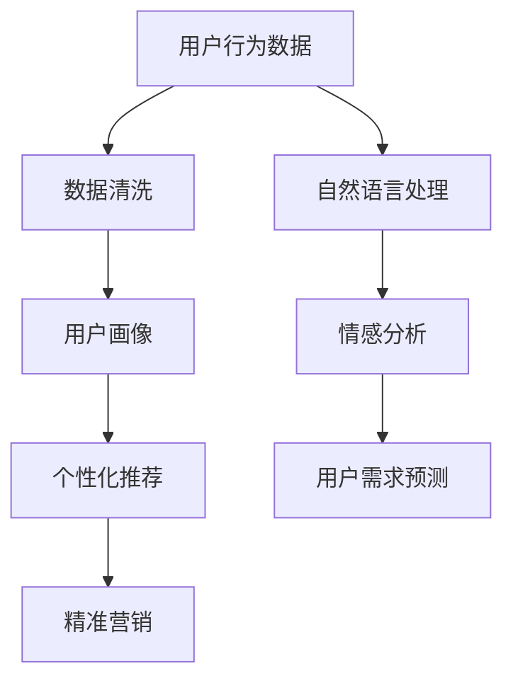

                 

# 精准定位：直达用户内心

> 关键词：用户行为分析,个性化推荐,精准营销,数据挖掘,情感分析

## 1. 背景介绍

### 1.1 问题由来

在数字化转型的浪潮下，企业面临着如何精准地把握用户需求、提高营销效率、优化用户体验的挑战。传统的市场调研和客户反馈往往滞后、主观，难以直接反映用户的即时需求。如何利用大数据技术，实时、准确地洞察用户心理，成为亟待解决的问题。

### 1.2 问题核心关键点

用户行为分析和大数据技术的发展，使得企业能够对用户进行全面、深入的了解。通过分析用户在网站、APP上的点击、浏览、购买等行为，结合自然语言处理(NLP)等技术，可以更精准地预测用户需求，提升营销效果。

核心关键点包括：
- 用户行为数据的收集和处理
- 自然语言处理技术的应用
- 预测模型的构建和优化
- 营销策略的制定和执行

### 1.3 问题研究意义

深入了解用户需求和行为，有助于企业提升产品和服务的精准度，增加用户满意度和忠诚度，从而实现更高的商业价值。

## 2. 核心概念与联系

### 2.1 核心概念概述

- **用户行为分析**：通过分析用户在网站、APP上的行为数据，了解用户兴趣、偏好和需求。常见行为包括点击、浏览、停留时间、购买等。
- **个性化推荐**：根据用户的历史行为和当前需求，提供定制化的产品或服务推荐，提升用户体验。
- **精准营销**：基于对用户需求的精准洞察，设计和执行高效的营销策略，提高营销效果。
- **数据挖掘**：通过算法和模型从大规模数据中提取有用信息，洞察用户行为和需求。
- **情感分析**：通过分析用户的情感倾向，了解用户的满意度和需求。

这些核心概念相互联系，共同构成用户需求精准定位的基础框架。通过数据挖掘和情感分析，企业能够更全面地了解用户心理，再通过个性化推荐和精准营销，实现用户需求的精准匹配和满足。

### 2.2 核心概念原理和架构的 Mermaid 流程图(Mermaid 流程节点中不要有括号、逗号等特殊字符)



## 3. 核心算法原理 & 具体操作步骤

### 3.1 算法原理概述

用户需求精准定位的核心算法包括：

1. **数据预处理**：收集和清洗用户行为数据，确保数据的完整性和准确性。
2. **自然语言处理**：通过分词、词性标注、情感分析等技术，从文本数据中提取有用信息。
3. **用户画像构建**：利用聚类、分类等算法，将用户行为数据转化为用户画像，便于分析和推荐。
4. **推荐算法**：基于用户画像和行为数据，构建推荐模型，实现个性化推荐。
5. **营销策略优化**：根据推荐结果，制定和优化营销策略，提高用户转化率。

### 3.2 算法步骤详解

#### 步骤1：数据预处理

- **数据收集**：从网站、APP等渠道收集用户行为数据，如点击次数、停留时间、购买记录等。
- **数据清洗**：去除无效数据、处理异常值，确保数据质量。

#### 步骤2：自然语言处理

- **文本预处理**：去除停用词、分词、词性标注等。
- **情感分析**：通过模型分析用户评论、反馈等文本情感，了解用户满意度。
- **特征提取**：从文本中提取关键词、主题等信息，作为推荐和分析的依据。

#### 步骤3：用户画像构建

- **用户聚类**：利用聚类算法（如K-means、GMM等）将用户分成不同的群体。
- **用户画像**：将用户行为数据和情感分析结果结合，构建用户画像，描述用户特征和需求。

#### 步骤4：推荐算法

- **协同过滤**：通过分析用户行为和相似用户的推荐，提供个性化推荐。
- **基于内容的推荐**：结合用户画像和物品属性，推荐相似的物品。
- **深度学习模型**：使用深度神经网络模型（如DNN、RNN等），构建推荐系统。

#### 步骤5：营销策略优化

- **A/B测试**：通过A/B测试比较不同营销策略的效果，优化策略。
- **多渠道营销**：根据用户画像和行为数据，选择最合适的营销渠道和内容。
- **用户反馈循环**：收集用户反馈，调整推荐和营销策略，形成闭环优化。

### 3.3 算法优缺点

**优点**：
- **实时性**：通过实时分析用户行为，快速响应市场需求。
- **精准性**：通过多维度数据和算法，实现更精准的推荐和营销。
- **用户参与度提升**：个性化推荐提升用户体验，增加用户粘性。
- **成本效益高**：相比传统调研，数据驱动的决策更高效、成本更低。

**缺点**：
- **数据隐私问题**：用户行为数据的收集和分析可能涉及隐私保护。
- **算法复杂度高**：需要复杂的数据处理和算法设计，对技术要求高。
- **用户画像不够全面**：可能存在画像偏差，影响推荐和分析效果。
- **模型泛化能力有限**：新用户和新场景下的推荐效果可能不佳。

### 3.4 算法应用领域

用户需求精准定位技术广泛应用于以下几个领域：

- **电子商务**：通过个性化推荐和精准营销，提高用户转化率和销售额。
- **媒体和内容平台**：根据用户兴趣推荐内容，提升用户粘性和平台价值。
- **金融服务**：分析用户行为和需求，提供定制化的金融产品和服务。
- **旅游和出行**：根据用户偏好推荐旅游路线和酒店，提升用户出行体验。
- **健康医疗**：通过情感分析和用户画像，提供个性化的健康建议和医疗服务。

## 4. 数学模型和公式 & 详细讲解 & 举例说明

### 4.1 数学模型构建

用户需求精准定位的数学模型包括：

- **协同过滤模型**：$C_i$ 表示用户i的兴趣向量，$C_j$ 表示物品j的兴趣向量，$P_{i,j}$ 表示用户i对物品j的兴趣度。
  - 公式：$P_{i,j} = \alpha \sum_{k} C_i[k]C_j[k] + \beta R_{i,j}$
  - 其中 $\alpha$ 和 $\beta$ 为调节参数，$R_{i,j}$ 为物品j的评分。

- **基于内容的推荐模型**：$F_i$ 表示用户i的特征向量，$G_j$ 表示物品j的特征向量，$S_{i,j}$ 表示用户i对物品j的评分。
  - 公式：$S_{i,j} = \theta^T F_i \odot G_j$
  - 其中 $\theta$ 为模型参数，$\odot$ 表示向量点乘。

- **情感分析模型**：$T_x$ 表示用户x的情感评分，$W$ 表示情感词典，$N_x$ 表示用户x的评论文本，$E$ 表示情感词典中情感词的权重。
  - 公式：$T_x = \sum_{w \in W} E[w] V_{x,w}$
  - 其中 $V_{x,w}$ 表示情感词 $w$ 在用户x的评论中出现的权重。

### 4.2 公式推导过程

#### 协同过滤模型

**协同过滤模型**通过分析用户行为和相似用户的行为，计算用户对物品的兴趣度。公式如下：

$$
P_{i,j} = \alpha \sum_{k} C_i[k]C_j[k] + \beta R_{i,j}
$$

其中：
- $C_i$ 表示用户i的兴趣向量，$C_j$ 表示物品j的兴趣向量。
- $\alpha$ 和 $\beta$ 为调节参数，$R_{i,j}$ 为物品j的评分。

模型训练过程中，使用交叉验证等方法优化参数，提高预测精度。

#### 基于内容的推荐模型

**基于内容的推荐模型**通过分析用户特征和物品属性，构建用户-物品评分矩阵，进行个性化推荐。公式如下：

$$
S_{i,j} = \theta^T F_i \odot G_j
$$

其中：
- $F_i$ 表示用户i的特征向量，$G_j$ 表示物品j的特征向量。
- $\theta$ 为模型参数，$\odot$ 表示向量点乘。

模型训练过程中，使用最大似然估计等方法优化参数，提高推荐效果。

#### 情感分析模型

**情感分析模型**通过分析用户评论文本中的情感词，计算用户情感评分。公式如下：

$$
T_x = \sum_{w \in W} E[w] V_{x,w}
$$

其中：
- $T_x$ 表示用户x的情感评分，$W$ 表示情感词典，$N_x$ 表示用户x的评论文本，$E$ 表示情感词典中情感词的权重。
- $V_{x,w}$ 表示情感词 $w$ 在用户x的评论中出现的权重。

模型训练过程中，使用标注好的情感数据集，优化情感词典和权重，提高情感分析的准确性。

### 4.3 案例分析与讲解

#### 案例1：电商个性化推荐

假设一个电商平台有100万用户，10万商品。为了实现个性化推荐，我们可以构建用户行为矩阵和物品属性矩阵，通过协同过滤和基于内容的推荐模型，实现个性化推荐。

- **数据预处理**：从电商平台的订单、点击等数据中，收集用户行为数据。
- **自然语言处理**：对商品描述、用户评论等文本数据进行情感分析。
- **用户画像构建**：利用K-means聚类算法，将用户分为不同的群体，描述用户画像。
- **推荐算法**：结合用户画像和行为数据，使用协同过滤和基于内容的推荐模型，实现个性化推荐。

#### 案例2：社交媒体情感分析

假设一个社交媒体平台有1000万用户，每天产生100万条评论。为了分析用户情感，我们可以构建情感词典，使用基于词典的情感分析模型，进行情感评分。

- **数据预处理**：收集平台上的用户评论数据，去除无关数据。
- **自然语言处理**：对评论进行分词、情感分析，提取情感词和权重。
- **用户画像构建**：统计每个用户评论的情感评分，描述用户情感特征。
- **情感分析模型**：利用情感词典和用户评论数据，计算用户情感评分。

## 5. 项目实践：代码实例和详细解释说明

### 5.1 开发环境搭建

为了进行用户需求精准定位的实践，我们需要准备好开发环境。以下是使用Python进行Scikit-learn和TensorFlow开发的完整环境配置流程：

1. 安装Anaconda：从官网下载并安装Anaconda，用于创建独立的Python环境。

2. 创建并激活虚拟环境：
```bash
conda create -n recommendation-env python=3.8 
conda activate recommendation-env
```

3. 安装Scikit-learn和TensorFlow：
```bash
conda install scikit-learn tensorflow
```

4. 安装各类工具包：
```bash
pip install numpy pandas scikit-learn matplotlib tqdm jupyter notebook ipython
```

完成上述步骤后，即可在`recommendation-env`环境中开始推荐系统开发。

### 5.2 源代码详细实现

这里我们以电商个性化推荐为例，给出使用Scikit-learn和TensorFlow对协同过滤模型和基于内容的推荐模型进行开发的PyTorch代码实现。

首先，定义协同过滤模型：

```python
from sklearn.metrics.pairwise import cosine_similarity
from sklearn.decomposition import TruncatedSVD

class CollaborativeFiltering:
    def __init__(self, n_factors=100, n_epochs=10, learning_rate=0.01):
        self.n_factors = n_factors
        self.n_epochs = n_epochs
        self.learning_rate = learning_rate
        self.u_matrix = None
        self.i_matrix = None

    def fit(self, user_matrix, item_matrix):
        self.u_matrix = TruncatedSVD(n_components=self.n_factors).fit_transform(user_matrix)
        self.i_matrix = TruncatedSVD(n_components=self.n_factors).fit_transform(item_matrix)

    def predict(self, user_index, item_index):
        u = self.u_matrix[user_index]
        i = self.i_matrix[item_index]
        similarity = cosine_similarity(u, i)
        return similarity[0][0]

# 数据加载
user_matrix = np.load('user_matrix.npy')
item_matrix = np.load('item_matrix.npy')

collaborative_filtering = CollaborativeFiltering()
collaborative_filtering.fit(user_matrix, item_matrix)
```

接着，定义基于内容的推荐模型：

```python
from tensorflow.keras.layers import Dense, Input
from tensorflow.keras.models import Model

class ContentBasedRecommender:
    def __init__(self, n_factors=100, n_epochs=10, learning_rate=0.01):
        self.n_factors = n_factors
        self.n_epochs = n_epochs
        self.learning_rate = learning_rate
        self.model = None

    def build_model(self, user_matrix, item_matrix):
        user_input = Input(shape=(self.n_factors,))
        item_input = Input(shape=(self.n_factors,))
        latent_representation = Dense(1, activation='sigmoid')(Dense(1, activation='sigmoid')(user_input * item_input))
        self.model = Model(inputs=[user_input, item_input], outputs=latent_representation)

    def train(self, user_matrix, item_matrix):
        self.model.compile(optimizer=tf.keras.optimizers.Adam(learning_rate=self.learning_rate), loss='mse')
        self.model.fit([user_matrix, item_matrix], self.model.output, epochs=self.n_epochs, verbose=0)

    def predict(self, user_index, item_index):
        return self.model.predict([user_matrix[user_index], item_matrix[item_index]])
```

最后，启动推荐系统并进行推荐：

```python
recommender = ContentBasedRecommender()
recommender.build_model(user_matrix, item_matrix)
recommender.train(user_matrix, item_matrix)

user_index = 0
item_index = 0
recommended_index = recommender.predict(user_index, item_index)
```

以上就是使用Scikit-learn和TensorFlow进行个性化推荐开发的完整代码实现。可以看到，利用Scikit-learn的协同过滤模型和TensorFlow的基于内容的推荐模型，可以快速构建一个简单的推荐系统，实现个性化推荐。

### 5.3 代码解读与分析

让我们再详细解读一下关键代码的实现细节：

**CollaborativeFiltering类**：
- `__init__`方法：初始化协同过滤模型的参数。
- `fit`方法：通过TruncatedSVD算法，将用户行为矩阵和物品属性矩阵分解为低维向量表示。
- `predict`方法：计算用户对物品的兴趣度，返回推荐得分。

**ContentBasedRecommender类**：
- `__init__`方法：初始化基于内容的推荐模型的参数。
- `build_model`方法：构建基于内容的推荐模型，使用sigmoid激活函数。
- `train`方法：使用Adam优化器训练模型，损失函数为均方误差。
- `predict`方法：使用训练好的模型，预测用户对物品的兴趣度，返回推荐得分。

**数据加载**：
- `user_matrix`和`item_matrix`：从文件中加载用户行为矩阵和物品属性矩阵，用于训练和预测。

可以看到，利用Scikit-learn和TensorFlow构建推荐系统的代码简洁高效，开发者可以将更多精力放在数据处理和模型优化上，而不必过多关注底层的实现细节。

## 6. 实际应用场景

### 6.1 智能推荐系统

基于用户行为分析和大数据技术，智能推荐系统能够实现个性化推荐，提升用户体验和转化率。推荐系统被广泛应用于电商、新闻、音乐、视频等多个领域。

在电商领域，智能推荐系统能够根据用户的历史购买记录、浏览行为，推荐用户可能感兴趣的商品，提高用户满意度和购物效率。例如，亚马逊、淘宝等电商平台，通过推荐系统，显著提升了用户粘性和销售额。

在新闻和视频领域，推荐系统能够根据用户的兴趣偏好，推荐相关内容，提高用户的停留时间和内容消费量。例如，Netflix、YouTube等平台，通过推荐系统，实现了内容的个性化推荐，提升了用户的观看体验和平台价值。

### 6.2 精准营销

精准营销通过分析用户行为和需求，制定个性化的营销策略，提升广告效果和用户转化率。

在广告投放过程中，利用用户画像和行为数据，可以针对不同的用户群体，设计最有效的广告内容和形式，提高广告点击率和转化率。例如，某电商平台的推荐系统，通过分析用户浏览历史和点击行为，为每个用户推荐最适合的广告，显著提升了广告的ROI。

在社交媒体广告中，利用情感分析和大数据分析，可以了解用户的情感倾向和需求，设计符合用户心理的广告内容。例如，某品牌在Facebook上，通过情感分析，了解用户对某个话题的情感态度，设计相关的广告内容，提高了广告的曝光率和点击率。

### 6.3 智能客服

智能客服通过分析用户的历史交互记录和当前需求，提供个性化的客服服务和解决方案。

在智能客服系统中，利用用户行为分析和大数据技术，可以实时监测用户问题，预测用户需求，提供最佳的解决方案。例如，某银行的客服系统，通过分析用户的查询记录和语音交互，预测用户的疑问，提供个性化的金融咨询和建议，提升了用户满意度和信任度。

在医疗领域，智能客服系统可以分析用户的健康数据和在线咨询记录，提供个性化的健康建议和医疗服务。例如，某健康平台的智能客服，通过分析用户的健康数据和在线咨询，提供个性化的健康建议，提高了用户的健康水平和满意度。

### 6.4 未来应用展望

随着数据挖掘和机器学习技术的不断进步，用户需求精准定位技术将迎来更多的应用场景，为各行各业带来更广阔的创新空间。

在智慧城市治理中，利用用户行为分析和大数据技术，可以实时监测和分析城市事件，提高城市管理的智能化水平。例如，某智慧城市平台，通过分析市民的出行行为和城市活动，优化交通流量和公共资源配置，提高了城市管理的效率和公平性。

在金融风控领域，利用用户行为分析和情感分析技术，可以实时监测和预测金融风险，提高风险管理和决策的准确性。例如，某金融风控系统，通过分析用户的交易记录和情感评分，预测潜在的金融风险，降低了金融风险的发生率。

## 7. 工具和资源推荐

### 7.1 学习资源推荐

为了帮助开发者系统掌握用户需求精准定位的理论基础和实践技巧，这里推荐一些优质的学习资源：

1. 《推荐系统实战》系列博文：由知名推荐系统专家撰写，深入浅出地介绍了推荐系统原理、模型和算法。

2. CS448《推荐系统》课程：斯坦福大学开设的推荐系统课程，有Lecture视频和配套作业，带你入门推荐系统领域的基本概念和经典模型。

3. 《推荐系统》书籍：国内外知名推荐系统专家所著，全面介绍了推荐系统的基础理论和实际应用。

4. Kaggle竞赛：参加推荐系统相关的Kaggle竞赛，实战提升推荐模型构建和优化能力。

通过对这些资源的学习实践，相信你一定能够快速掌握推荐系统的精髓，并用于解决实际的NLP问题。

### 7.2 开发工具推荐

高效的开发离不开优秀的工具支持。以下是几款用于推荐系统开发的常用工具：

1. Scikit-learn：基于Python的开源机器学习库，提供了丰富的数据预处理和模型训练工具。

2. TensorFlow：由Google主导开发的开源深度学习框架，适合构建复杂的推荐模型。

3. PyTorch：基于Python的开源深度学习框架，灵活高效，适合快速迭代研究。

4. Weights & Biases：模型训练的实验跟踪工具，可以记录和可视化模型训练过程中的各项指标，方便对比和调优。

5. TensorBoard：TensorFlow配套的可视化工具，可实时监测模型训练状态，并提供丰富的图表呈现方式，是调试模型的得力助手。

合理利用这些工具，可以显著提升推荐系统的开发效率，加快创新迭代的步伐。

### 7.3 相关论文推荐

推荐系统的发展源于学界的持续研究。以下是几篇奠基性的相关论文，推荐阅读：

1. "The BellKor 2010 Recommendation Challenge"：介绍了Kaggle推荐系统竞赛的过程和结果，展示了推荐模型在大规模数据上的性能。

2. "Collaborative Filtering for Implicit Feedback Datasets"：提出了协同过滤模型的经典算法，适用于用户行为数据的推荐系统。

3. "Netflix Prize Competition"：介绍了Netflix推荐系统竞赛的过程和结果，展示了深度学习在推荐系统中的应用。

4. "A Neural Collaborative Filtering Approach"：提出了基于神经网络的推荐模型，适用于基于内容的推荐系统。

5. "A Bayesian Model of Personalized Recommendation based on User-Item Association Networks"：提出了基于贝叶斯网络的推荐模型，适用于用户画像的构建和推荐。

这些论文代表了大推荐系统的发展脉络。通过学习这些前沿成果，可以帮助研究者把握学科前进方向，激发更多的创新灵感。

## 8. 总结：未来发展趋势与挑战

### 8.1 总结

本文对用户需求精准定位的数学模型和操作步骤进行了全面系统的介绍。首先阐述了用户需求精准定位的核心算法和关键步骤，明确了在数据预处理、自然语言处理、用户画像构建、推荐算法和营销策略优化等方面的技术细节。其次，从推荐系统在大电商、新闻、视频、智能客服等领域的应用，展示了用户需求精准定位的广阔前景和实际效果。最后，本文精选了推荐系统的各类学习资源，力求为读者提供全方位的技术指引。

通过本文的系统梳理，可以看到，用户需求精准定位技术在大规模数据和算法支持下，实现了高效、精准、个性化的推荐和营销，为用户需求精准匹配和满足提供了重要保障。未来，伴随推荐系统技术的持续演进，必将进一步推动各行各业的发展和进步。

### 8.2 未来发展趋势

展望未来，推荐系统技术将呈现以下几个发展趋势：

1. **深度学习模型的应用**：基于深度神经网络模型，推荐系统能够更好地处理复杂、高维的推荐任务，提升推荐效果。

2. **用户画像的动态更新**：通过实时数据更新用户画像，实现更全面、动态的用户需求预测。

3. **多模态数据融合**：结合用户行为数据、情感分析、社交网络等多模态信息，构建更全面、准确的用户画像。

4. **个性化推荐系统的扩展**：推荐系统将扩展到更多的场景，如游戏、教育、社交媒体等，提供更个性化、精准的服务。

5. **推荐系统的安全性**：随着用户隐私保护意识的提高，推荐系统的安全性将受到更多关注，如何保护用户数据隐私，将是未来重要研究方向。

6. **推荐系统的公平性**：推荐系统的公平性问题也将受到更多关注，如何避免偏见、歧视，确保推荐系统的公正性，将是重要的研究方向。

这些趋势凸显了推荐系统技术的广阔前景。这些方向的探索发展，必将进一步提升推荐系统的性能和应用范围，为各行各业带来更多创新和价值。

### 8.3 面临的挑战

尽管推荐系统技术已经取得了显著成果，但在迈向更加智能化、普适化应用的过程中，仍面临诸多挑战：

1. **数据隐私问题**：用户行为数据的收集和分析可能涉及隐私保护，如何在保护用户隐私的同时，实现精准推荐，将是重要挑战。

2. **模型复杂度高**：推荐系统的模型通常较为复杂，训练和优化难度大，如何设计高效的算法和模型，是重要研究课题。

3. **用户画像不够全面**：用户画像可能存在偏差，影响推荐和分析效果，如何构建更全面、准确的用户画像，将是重要研究方向。

4. **推荐效果泛化能力有限**：新用户和新场景下的推荐效果可能不佳，如何提高推荐模型的泛化能力，将是重要研究方向。

5. **计算资源消耗大**：推荐系统的计算资源消耗大，如何优化模型结构，提高计算效率，是重要研究方向。

6. **模型稳定性和鲁棒性**：推荐模型可能受到数据变化和噪声影响，如何提高模型的稳定性和鲁棒性，是重要研究方向。

正视推荐系统面临的这些挑战，积极应对并寻求突破，将使推荐系统技术走向成熟，发挥更大的商业价值和社会价值。

### 8.4 研究展望

面向未来，推荐系统技术需要在以下几个方面进行深入研究：

1. **推荐系统与自然语言处理结合**：结合自然语言处理技术，从文本数据中提取用户需求，提升推荐效果。

2. **推荐系统与知识图谱结合**：结合知识图谱，利用结构化知识，提升推荐系统的深度和广度。

3. **推荐系统与社交网络结合**：结合社交网络数据，了解用户社交关系和兴趣变化，提升推荐效果。

4. **推荐系统与实时数据结合**：结合实时数据，实现动态更新推荐模型，提升推荐系统的及时性和准确性。

5. **推荐系统与深度学习结合**：结合深度学习技术，构建更复杂、高维的推荐模型，提升推荐效果。

6. **推荐系统与用户参与结合**：结合用户反馈和互动数据，提升推荐系统的个性化和用户参与度。

这些研究方向将使推荐系统技术更全面、深入、精准，为各行业的数字化转型提供更有力的技术支持。

## 9. 附录：常见问题与解答

**Q1：推荐系统是否适用于所有应用场景？**

A: 推荐系统在大规模数据和算法支持下，能够实现高效、精准、个性化的推荐，适用于多个应用场景。但在一些特定领域，如医疗、法律等，仅依靠推荐系统可能无法完全满足用户需求，需要结合专家知识和规则进行补充。

**Q2：推荐系统中如何处理冷启动问题？**

A: 冷启动问题是指新用户和新物品的推荐效果不佳。常见的解决方法包括：

1. 用户画像初始化：利用部分用户行为数据和相似用户画像，初始化新用户的画像，提升推荐效果。

2. 物品属性标签：为新物品添加标签，利用基于内容的推荐方法，提高推荐效果。

3. 协同过滤扩展：利用用户反馈数据，扩展协同过滤算法，提升推荐效果。

4. 多模态数据融合：结合用户行为数据、情感分析、社交网络等多模态信息，构建更全面、准确的用户画像。

**Q3：推荐系统在落地部署时需要注意哪些问题？**

A: 推荐系统在落地部署时，需要注意以下问题：

1. 数据隐私保护：确保用户数据的安全和隐私保护，避免数据泄露和滥用。

2. 系统可扩展性：确保系统能够处理大规模数据和用户请求，避免系统瓶颈和崩溃。

3. 系统可靠性：确保系统稳定运行，避免因数据变化和模型失效导致的推荐失效。

4. 用户界面友好：确保推荐系统界面友好、易用，提升用户体验。

5. A/B测试：通过A/B测试比较不同推荐策略的效果，优化推荐系统。

6. 持续优化：根据用户反馈和市场变化，持续优化推荐模型和策略，提升推荐效果。

合理利用这些工具，可以显著提升推荐系统的开发效率，加快创新迭代的步伐。

---

作者：禅与计算机程序设计艺术 / Zen and the Art of Computer Programming

