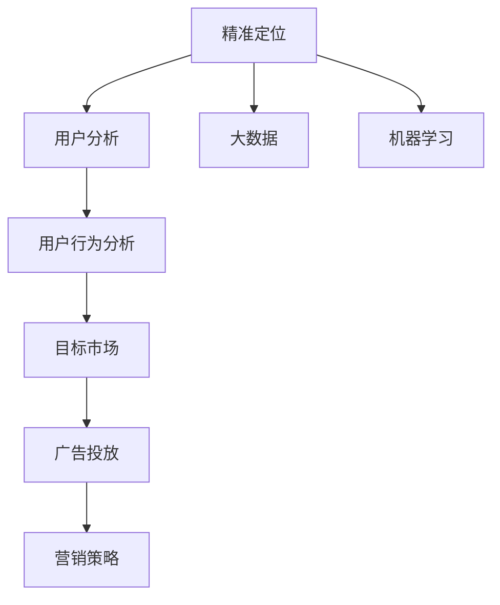

                 

# 精准定位：直达用户内心

> 关键词：精准定位, 用户分析, 数据分析, 大数据, 机器学习, 用户行为, 目标市场, 广告投放, 营销策略

## 1. 背景介绍

### 1.1 问题由来
在现代商业环境中，企业的成功往往依赖于对目标市场的精准定位和有效营销。传统上，市场调研、问卷调查和焦点小组讨论等方法虽然仍在使用，但随着消费者行为的快速变化，以及大数据、人工智能技术的发展，传统的调研方法已经难以满足市场需求。通过深入分析用户行为数据，使用机器学习模型进行用户行为预测和市场细分，成为当前营销策略的核心。

### 1.2 问题核心关键点
精准定位的核心在于理解消费者的真实需求和行为模式，以及如何将这些数据转化为可操作的营销策略。本节将详细介绍精准定位的基本原理和关键技术。

### 1.3 问题研究意义
精准定位能够显著提高营销策略的效率和效果，减少资源浪费，提升客户满意度和忠诚度。在大数据时代，通过数据分析和机器学习模型，可以实时监测和预测用户行为，从而实现精准营销。

## 2. 核心概念与联系

### 2.1 核心概念概述

本节将介绍精准定位过程中涉及的几个关键概念：

- **精准定位**：通过分析用户行为数据，识别出目标市场的特定群体，并制定针对这些群体的营销策略。
- **用户分析**：使用数据挖掘和机器学习技术，分析用户行为模式和偏好，从而洞察用户需求。
- **大数据**：指体量巨大、来源多样的数据集，通常用于分析用户行为、趋势预测等。
- **机器学习**：使用算法从数据中学习规律，用于预测用户行为、推荐产品等。
- **用户行为分析**：分析用户在网站、应用上的行为数据，了解用户的兴趣和习惯。
- **目标市场**：指一个具体的消费者群体，具备相似的需求和行为特征。
- **广告投放**：将广告展示给特定的用户群体，提高广告效果和ROI。
- **营销策略**：根据用户行为和市场数据，制定有效的营销计划和策略。

这些概念之间的关系可以通过以下Mermaid流程图来展示：



这个流程图展示了几类关键概念及其之间的联系：精准定位通过对大数据的分析，使用机器学习技术对用户行为进行预测，从而识别出特定的目标市场，并制定有效的营销策略和广告投放方案。

## 3. 核心算法原理 & 具体操作步骤
### 3.1 算法原理概述

精准定位的核心算法主要依赖于数据分析和机器学习技术。具体而言，包括以下几个关键步骤：

1. **数据收集**：从各种渠道收集用户行为数据，如网站浏览记录、购物历史、社交媒体互动等。
2. **数据预处理**：清洗和处理数据，去除噪音和异常值，构建合适的特征集合。
3. **用户行为分析**：使用聚类、分类等机器学习算法，识别出用户的行为模式和偏好。
4. **目标市场细分**：将用户分为多个细分市场，每个市场具有相似的行为特征。
5. **精准定位**：确定每个细分市场中的典型用户，并根据其行为特征制定针对性的营销策略。
6. **广告投放**：将广告展示给特定的目标用户群体，提高广告效果和转化率。

### 3.2 算法步骤详解

以下是对精准定位核心算法的详细步骤讲解：

**Step 1: 数据收集**

从多个渠道收集用户行为数据，包括但不限于：

- 网站和应用的用户行为数据，如浏览记录、点击次数、停留时间等。
- 社交媒体互动数据，如点赞、评论、分享等。
- 电商平台购物数据，如购买记录、搜索历史等。

**Step 2: 数据预处理**

对收集到的数据进行清洗和预处理，包括：

- 去除噪音和异常值，确保数据的准确性。
- 数据归一化，将不同来源的数据统一格式。
- 特征提取，将原始数据转换为模型可以理解的特征。
- 特征选择，选择对模型有帮助的关键特征。

**Step 3: 用户行为分析**

使用机器学习算法分析用户行为数据，识别出用户的行为模式和偏好。常见的算法包括：

- 聚类算法（如K-Means、层次聚类）用于识别用户群体。
- 分类算法（如决策树、随机森林、SVM）用于识别用户偏好。
- 关联规则算法（如Apriori、FP-Growth）用于挖掘用户行为模式。

**Step 4: 目标市场细分**

将用户分为多个细分市场，每个市场具有相似的行为特征。具体步骤包括：

- 计算用户之间的相似度，使用距离度量如欧几里得距离、余弦相似度等。
- 将用户分为多个聚类，每个聚类代表一个细分市场。
- 确定每个细分市场的特征，如用户年龄段、性别、地域等。

**Step 5: 精准定位**

确定每个细分市场中的典型用户，并根据其行为特征制定针对性的营销策略。具体步骤包括：

- 从每个细分市场中随机抽取一定数量的用户，作为代表性样本。
- 分析这些样本的行为特征，识别出最能代表细分市场的典型用户。
- 根据典型用户的行为特征，制定针对性的营销策略和广告投放方案。

**Step 6: 广告投放**

将广告展示给特定的目标用户群体，提高广告效果和转化率。具体步骤包括：

- 选择合适的广告平台，如Google AdWords、Facebook Ads等。
- 确定广告的展示位置和形式，如横幅广告、视频广告、原生广告等。
- 根据用户的行为特征，设置广告的展示条件。
- 定期监测广告效果，优化广告投放策略。

### 3.3 算法优缺点

精准定位算法具有以下优点：

1. **效率高**：通过机器学习算法，可以快速分析大量用户行为数据，识别出目标市场。
2. **效果显著**：精准定位能够实现更有效的广告投放，提升广告ROI。
3. **灵活性高**：可以动态调整营销策略，根据市场变化实时优化广告投放。
4. **数据驱动**：依赖于大量数据，通过数据驱动的决策过程，减少主观偏见。

同时，该算法也存在一些局限性：

1. **数据隐私问题**：用户行为数据的收集和分析可能涉及用户隐私，需要遵守相关的法律法规。
2. **模型复杂性**：构建精准定位模型需要选择合适的算法和参数，模型过于复杂可能导致过拟合。
3. **技术门槛高**：精准定位需要掌握数据科学和机器学习的基本技能，对技术要求较高。
4. **市场动态变化**：市场和用户行为的变化较快，精准定位模型需要定期更新和调整。

### 3.4 算法应用领域

精准定位算法已经在多个领域得到了广泛应用，包括但不限于：

- **电商行业**：通过分析用户的购物行为，识别出高价值客户，制定个性化推荐策略，提升转化率。
- **金融行业**：通过分析用户的投资行为，识别出潜在客户，制定针对性的市场营销策略，提高客户留存率。
- **媒体和广告行业**：通过分析用户的媒体消费行为，识别出目标用户群体，优化广告投放，提升广告效果。
- **旅游行业**：通过分析用户的旅游行为，识别出潜在客户，制定个性化的旅游推荐策略，提升用户满意度。
- **健康医疗行业**：通过分析用户健康数据，识别出潜在患者，制定个性化的健康干预策略，提高用户健康水平。

## 4. 数学模型和公式 & 详细讲解 & 举例说明

### 4.1 数学模型构建

本节将使用数学语言对精准定位的核心算法进行更加严格的刻画。

记用户行为数据集为 $D=\{(x_i, y_i)\}_{i=1}^N$，其中 $x_i$ 为用户行为特征向量，$y_i$ 为标签（如是否点击、购买等）。

定义用户行为分析的损失函数为 $\ell(f(x), y)$，其中 $f(x)$ 为模型的预测结果，$y$ 为真实标签。

精准定位的目标是最小化损失函数，即找到最优模型 $f^*$：

$$
f^* = \mathop{\arg\min}_{f} \sum_{i=1}^N \ell(f(x_i), y_i)
$$

在实践中，通常使用梯度下降等优化算法来近似求解上述最优化问题。设 $\eta$ 为学习率，则参数的更新公式为：

$$
\theta \leftarrow \theta - \eta \nabla_{\theta}\mathcal{L}(\theta)
$$

其中 $\nabla_{\theta}\mathcal{L}(\theta)$ 为损失函数对参数 $\theta$ 的梯度，可通过反向传播算法高效计算。

### 4.2 公式推导过程

以下我们以分类任务为例，推导交叉熵损失函数及其梯度的计算公式。

假设模型 $f_{\theta}(x)$ 在输入 $x$ 上的输出为 $\hat{y}=f_{\theta}(x) \in [0,1]$，表示用户点击的概率。真实标签 $y \in \{0,1\}$。则二分类交叉熵损失函数定义为：

$$
\ell(f_{\theta}(x),y) = -[y\log \hat{y} + (1-y)\log(1-\hat{y})]
$$

将其代入损失函数公式，得：

$$
\mathcal{L}(\theta) = -\frac{1}{N}\sum_{i=1}^N [y_i\log f_{\theta}(x_i)+(1-y_i)\log(1-f_{\theta}(x_i))]
$$

根据链式法则，损失函数对参数 $\theta_k$ 的梯度为：

$$
\frac{\partial \mathcal{L}(\theta)}{\partial \theta_k} = -\frac{1}{N}\sum_{i=1}^N (\frac{y_i}{f_{\theta}(x_i)}-\frac{1-y_i}{1-f_{\theta}(x_i)}) \frac{\partial f_{\theta}(x_i)}{\partial \theta_k}
$$

其中 $\frac{\partial f_{\theta}(x_i)}{\partial \theta_k}$ 可进一步递归展开，利用自动微分技术完成计算。

在得到损失函数的梯度后，即可带入参数更新公式，完成模型的迭代优化。重复上述过程直至收敛，最终得到适应目标市场的最优模型参数 $\theta^*$。

### 4.3 案例分析与讲解

假设我们希望预测用户是否会购买某件商品，数据集 $D=\{(x_i, y_i)\}_{i=1}^N$，其中 $x_i$ 为商品描述、用户历史购买记录、年龄、性别等特征向量，$y_i$ 为购买标签（0或1）。

- **数据收集**：从电商平台收集用户购买数据和商品描述，构建用户行为数据集。
- **数据预处理**：清洗数据，去除噪音和异常值，进行归一化处理，选择合适的特征向量。
- **用户行为分析**：使用决策树算法对用户行为数据进行分析，构建决策树模型 $f(x)$。
- **目标市场细分**：使用层次聚类算法对用户进行聚类，识别出多个细分市场。
- **精准定位**：从每个细分市场中选择一定数量的代表性样本，分析其行为特征，确定典型用户。
- **广告投放**：根据典型用户的行为特征，在Google AdWords上设置广告展示条件，展示给目标用户群体。

## 5. 项目实践：代码实例和详细解释说明

### 5.1 开发环境搭建

在进行精准定位项目实践前，我们需要准备好开发环境。以下是使用Python进行Scikit-Learn开发的环境配置流程：

1. 安装Anaconda：从官网下载并安装Anaconda，用于创建独立的Python环境。

2. 创建并激活虚拟环境：
```bash
conda create -n py-env python=3.8 
conda activate py-env
```

3. 安装Scikit-Learn：
```bash
pip install scikit-learn
```

4. 安装各类工具包：
```bash
pip install numpy pandas matplotlib seaborn jupyter notebook ipython
```

完成上述步骤后，即可在`py-env`环境中开始项目实践。

### 5.2 源代码详细实现

下面我们以电商用户行为分析为例，给出使用Scikit-Learn对决策树模型进行精准定位的Python代码实现。

首先，定义数据集类：

```python
import pandas as pd
from sklearn.model_selection import train_test_split
from sklearn.ensemble import DecisionTreeClassifier
from sklearn.metrics import accuracy_score

class UserBehaviorDataset:
    def __init__(self, df, target_col, test_size=0.2, random_state=42):
        self.data = df
        self.target_col = target_col
        self.test_size = test_size
        self.random_state = random_state
        self.train_data, self.test_data, self.train_labels, self.test_labels = train_test_split(self.data, self.target_col, 
                                                                                          test_size=self.test_size, 
                                                                                          random_state=self.random_state)
        
    def fit(self, model):
        model.fit(self.train_data, self.train_labels)
        
    def predict(self, model):
        return model.predict(self.test_data)
```

然后，定义模型类：

```python
from sklearn.tree import DecisionTreeClassifier
from sklearn.metrics import accuracy_score

class DecisionTreeModel:
    def __init__(self):
        self.model = DecisionTreeClassifier()
        
    def fit(self, X, y):
        self.model.fit(X, y)
        
    def predict(self, X):
        return self.model.predict(X)
    
    def score(self, X, y):
        return accuracy_score(y, self.model.predict(X))
```

接着，定义训练和评估函数：

```python
def train_model(model, dataset):
    dataset.fit(model)
    return model

def evaluate_model(model, dataset):
    score = model.score(dataset.test_data, dataset.test_labels)
    print(f"Accuracy: {score:.2f}")
    
def test_model(model, dataset):
    y_pred = model.predict(dataset.test_data)
    return y_pred, accuracy_score(dataset.test_labels, y_pred)
```

最后，启动训练流程并在测试集上评估：

```python
model = DecisionTreeModel()
train_dataset = UserBehaviorDataset(df, 'click')
train_model(model, train_dataset)

test_dataset = UserBehaviorDataset(df, 'click')
evaluate_model(model, test_dataset)

y_pred, acc = test_model(model, test_dataset)
print(f"Test Accuracy: {acc:.2f}")
```

以上就是使用Scikit-Learn对电商用户行为分析进行精准定位的完整代码实现。可以看到，使用Scikit-Learn进行数据处理和模型训练，能够快速实现精准定位的基本功能。

### 5.3 代码解读与分析

让我们再详细解读一下关键代码的实现细节：

**UserBehaviorDataset类**：
- `__init__`方法：初始化数据集和目标列，划分训练集和测试集。
- `fit`方法：将模型拟合到训练数据集上。
- `predict`方法：使用训练好的模型对测试数据集进行预测。

**DecisionTreeModel类**：
- `__init__`方法：初始化决策树模型。
- `fit`方法：将模型拟合到训练数据集上。
- `predict`方法：使用训练好的模型对新的数据进行预测。
- `score`方法：计算模型在测试集上的准确率。

**训练和评估函数**：
- `train_model`：训练决策树模型。
- `evaluate_model`：评估模型在测试集上的准确率。
- `test_model`：在测试集上测试模型，输出预测结果和准确率。

**训练流程**：
- 创建决策树模型实例。
- 定义数据集对象，指定训练集和目标列。
- 调用训练函数，拟合模型到训练数据上。
- 在测试集上评估模型性能，输出准确率。
- 在测试集上测试模型，输出预测结果和准确率。

可以看到，使用Scikit-Learn进行精准定位的代码实现相对简洁，开发者可以更加专注于算法的优化和数据的处理。

当然，工业级的系统实现还需考虑更多因素，如模型的保存和部署、超参数的自动搜索、更灵活的目标市场定义等。但核心的精准定位范式基本与此类似。

## 6. 实际应用场景
### 6.1 电商行业

电商行业通过精准定位，能够实现更有效的营销策略和个性化推荐。具体应用包括：

- **推荐系统**：基于用户历史行为数据，推荐用户可能感兴趣的商品。通过精准定位，可以识别出不同用户群体的偏好，制定针对性的推荐策略。
- **广告投放**：根据用户的行为特征，设置广告展示条件，提高广告投放的精准度和转化率。通过精准定位，能够更好地理解用户需求，优化广告投放策略。
- **客户流失预警**：通过分析用户行为数据，识别出流失风险较高的用户群体，提前进行干预，提高客户留存率。

### 6.2 金融行业

金融行业通过精准定位，能够实现更有效的风险控制和客户管理。具体应用包括：

- **客户细分**：根据客户的投资行为和风险偏好，识别出高价值客户和风险客户，制定差异化的服务策略。通过精准定位，能够更好地理解客户需求，提升客户满意度。
- **产品推荐**：基于客户的历史行为数据，推荐合适的金融产品，提高销售转化率。通过精准定位，能够更好地理解客户需求，提升产品推荐效果。
- **风险预警**：通过分析客户行为数据，识别出潜在的风险客户，提前进行风险控制。通过精准定位，能够更好地理解客户行为，降低风险损失。

### 6.3 媒体和广告行业

媒体和广告行业通过精准定位，能够实现更有效的广告投放和用户获取。具体应用包括：

- **广告投放优化**：根据用户的行为特征，设置广告展示条件，提高广告投放的精准度和转化率。通过精准定位，能够更好地理解用户需求，优化广告投放策略。
- **用户获取**：通过精准定位，识别出高价值的潜在客户，制定针对性的推广策略，提高用户获取效率。通过精准定位，能够更好地理解用户需求，提升推广效果。
- **内容推荐**：基于用户的行为数据，推荐符合其兴趣和需求的内容，提高用户粘性和平台活跃度。通过精准定位，能够更好地理解用户需求，提升内容推荐效果。

### 6.4 未来应用展望

随着精准定位技术的发展，未来将在更多领域得到应用，为不同行业带来变革性影响。

在智慧医疗领域，精准定位技术能够用于患者行为分析和疾病预测，提高诊疗效果和患者满意度。在智慧教育领域，精准定位技术能够用于学生行为分析和学习路径规划，提高教学效果和学习效率。

在智能城市治理中，精准定位技术能够用于用户行为分析和城市事件监测，提高城市管理的自动化和智能化水平，构建更安全、高效的未来城市。

此外，在企业生产、社会治理、文娱传媒等众多领域，精准定位技术也将不断涌现，为各行各业带来新的技术路径。

## 7. 工具和资源推荐
### 7.1 学习资源推荐

为了帮助开发者系统掌握精准定位的理论基础和实践技巧，这里推荐一些优质的学习资源：

1. 《机器学习实战》（李航）：该书详细介绍了机器学习的基本算法和应用，适合初学者入门。
2. 《Python数据科学手册》（Jake VanderPlas）：该书介绍了Python在数据科学中的应用，包括数据处理、机器学习等。
3. 《数据科学导论》（T. Tony Jebara）：该书介绍了数据科学的基本概念和应用，包括统计学、机器学习等。
4. Coursera《机器学习》课程：斯坦福大学开设的机器学习课程，内容全面，适合深入学习。
5. edX《数据科学基础》课程：麻省理工学院开设的数据科学课程，涵盖数据科学的基本概念和技术。

通过对这些资源的学习实践，相信你一定能够快速掌握精准定位的精髓，并用于解决实际的NLP问题。

### 7.2 开发工具推荐

高效的开发离不开优秀的工具支持。以下是几款用于精准定位开发的常用工具：

1. Python：广泛使用的数据科学语言，具有丰富的第三方库支持。
2. Scikit-Learn：用于数据挖掘和机器学习的Python库，提供了大量的算法和模型。
3. TensorFlow：谷歌主导的深度学习框架，支持大规模分布式计算。
4. PyTorch：Facebook开发的深度学习框架，具有动态计算图和灵活的模型定义能力。
5. Weights & Biases：模型训练的实验跟踪工具，可以记录和可视化模型训练过程中的各项指标，方便对比和调优。
6. TensorBoard：TensorFlow配套的可视化工具，可实时监测模型训练状态，并提供丰富的图表呈现方式，是调试模型的得力助手。

合理利用这些工具，可以显著提升精准定位任务的开发效率，加快创新迭代的步伐。

### 7.3 相关论文推荐

精准定位技术的发展源于学界的持续研究。以下是几篇奠基性的相关论文，推荐阅读：

1. Adaptive Boosting（AdaBoost）：提出了一种基于决策树的集成学习算法，可用于分类和回归问题。
2. Random Forests：提出了一种基于决策树的集成学习算法，可用于分类和回归问题。
3. Gradient Boosting Machines（GBM）：提出了一种基于决策树的集成学习算法，可用于分类和回归问题。
4. XGBoost：提出了一种基于决策树的集成学习算法，适用于大规模数据和高维度特征。
5. LightGBM：提出了一种基于决策树的集成学习算法，具有高效和快速的特点。
6. CatBoost：提出了一种基于决策树的集成学习算法，适用于类别型特征和高维度数据。

这些论文代表了大数据和机器学习技术的发展脉络。通过学习这些前沿成果，可以帮助研究者把握学科前进方向，激发更多的创新灵感。

## 8. 总结：未来发展趋势与挑战

### 8.1 总结

本文对精准定位的基本原理和实践技巧进行了全面系统的介绍。首先阐述了精准定位的核心概念和研究背景，明确了精准定位在营销策略制定和客户管理中的重要性。其次，从原理到实践，详细讲解了精准定位的数学模型和算法步骤，给出了精准定位任务开发的完整代码实例。同时，本文还广泛探讨了精准定位技术在电商、金融、媒体等诸多领域的应用前景，展示了精准定位技术的巨大潜力。

通过本文的系统梳理，可以看到，精准定位技术正在成为市场营销和客户管理的重要工具，极大地提升了企业的市场竞争力和客户满意度。未来，伴随精准定位技术的持续演进，必将进一步推动人工智能技术在商业领域的广泛应用，为各行各业带来新的发展机遇。

### 8.2 未来发展趋势

展望未来，精准定位技术将呈现以下几个发展趋势：

1. **数据质量提升**：随着数据采集和清洗技术的进步，精准定位将更依赖于高质量的数据。数据的全面性和多样性将进一步提升精准定位的效果。
2. **模型自动化**：自动化模型训练和调优技术将进一步发展，降低人工干预，提高模型训练的效率和效果。
3. **实时化**：精准定位将更多地采用实时数据，实时分析用户行为，实现更快速的市场响应。
4. **多模态融合**：将不同模态的数据（如文本、图像、视频）融合分析，提升精准定位的效果。
5. **因果推断**：引入因果推断方法，分析用户行为背后的因果关系，提高精准定位的准确性。
6. **跨领域应用**：精准定位技术将更多地应用于医疗、教育、智能城市等不同领域，带来广泛的应用场景。

以上趋势凸显了精准定位技术的广阔前景。这些方向的探索发展，必将进一步提升精准定位的效果，为市场营销和客户管理带来新的突破。

### 8.3 面临的挑战

尽管精准定位技术已经取得了显著成果，但在迈向更加智能化、普适化应用的过程中，它仍面临着诸多挑战：

1. **数据隐私问题**：精准定位需要收集大量用户数据，涉及用户隐私保护和数据安全，需要遵守相关的法律法规。
2. **模型复杂性**：构建精准定位模型需要选择合适的算法和参数，模型过于复杂可能导致过拟合。
3. **技术门槛高**：精准定位需要掌握数据科学和机器学习的基本技能，对技术要求较高。
4. **市场动态变化**：市场和用户行为的变化较快，精准定位模型需要定期更新和调整。
5. **计算资源需求高**：精准定位通常涉及大规模数据处理和模型训练，需要高性能的计算资源。

### 8.4 研究展望

面对精准定位面临的挑战，未来的研究需要在以下几个方面寻求新的突破：

1. **数据隐私保护**：研究和开发更加安全、高效的数据采集和处理技术，保护用户隐私。
2. **模型自动化**：开发更加自动化的模型训练和调优技术，降低人工干预。
3. **实时化**：引入实时数据处理技术，提高精准定位的响应速度。
4. **多模态融合**：开发更加灵活、高效的多模态融合技术，提升精准定位的效果。
5. **因果推断**：引入因果推断方法，提升精准定位的准确性和鲁棒性。
6. **跨领域应用**：拓展精准定位在医疗、教育、智能城市等不同领域的应用场景，推动精准定位技术的发展。

这些研究方向将引领精准定位技术迈向更高的台阶，为市场营销和客户管理带来新的突破。

## 9. 附录：常见问题与解答

**Q1：精准定位是否适用于所有营销场景？**

A: 精准定位在大多数营销场景中都能取得不错的效果，特别是对于数据量较小的场景。但对于一些特定的营销场景，如B2B市场、产品推广等，需要结合具体场景进行调整和优化。

**Q2：如何选择合适的算法和模型？**

A: 选择合适的算法和模型需要考虑以下几个因素：
- 数据类型：数据是分类数据还是数值数据，是结构化数据还是非结构化数据。
- 数据规模：数据规模较大时，可以选择分布式计算的算法和模型。
- 任务类型：任务是分类、回归还是聚类等，选择合适的算法和模型。
- 模型复杂度：模型的复杂度越高，可能带来的过拟合风险越高，需要综合考虑。

**Q3：精准定位的效果如何评估？**

A: 精准定位的效果可以通过以下指标进行评估：
- 准确率：预测结果与真实标签一致的比例。
- 召回率：真实标签中正确预测的比例。
- F1分数：准确率和召回率的调和平均。
- AUC-ROC曲线：用于评估二分类任务的性能。
- 混淆矩阵：用于评估分类任务的性能。

**Q4：精准定位在实际应用中需要注意哪些问题？**

A: 精准定位在实际应用中需要注意以下几个问题：
- 数据隐私保护：确保用户数据的安全和隐私，遵守相关的法律法规。
- 数据质量：保证数据的质量和完整性，避免噪音和异常值。
- 模型选择：选择适合具体任务的算法和模型，避免过拟合。
- 实时化：实时分析和处理数据，提高精准定位的响应速度。
- 计算资源：优化算法的计算复杂度，减少计算资源消耗。

**Q5：精准定位如何与业务结合？**

A: 精准定位与业务的结合需要考虑以下几个方面：
- 业务需求：理解业务需求和目标，制定相应的营销策略。
- 数据采集：选择合适的数据来源，采集相关数据。
- 数据分析：进行数据清洗、预处理和特征工程，选择合适的算法和模型。
- 模型训练：训练和优化模型，提升精准定位的效果。
- 模型应用：将模型应用到实际的业务场景中，进行效果评估和迭代优化。

通过精准定位与业务的深度结合，能够更好地满足业务需求，提升企业的市场竞争力和客户满意度。

---

作者：禅与计算机程序设计艺术 / Zen and the Art of Computer Programming

