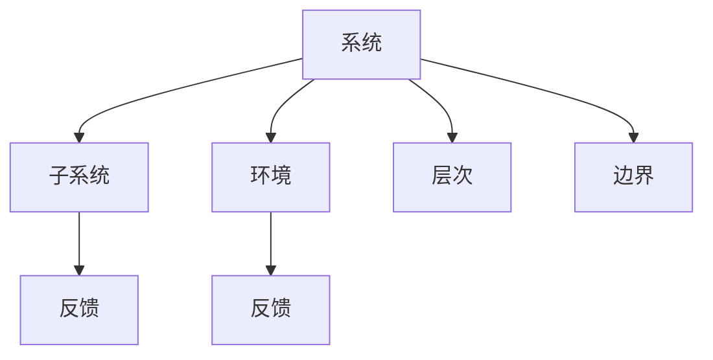

                 

# 系统思考在管理中的应用

## 1. 背景介绍

### 1.1 问题由来

管理是一门艺术，也是一个科学。现代管理理论历经百年演变，从泰勒的科学管理，到韦伯的行政组织理论，再到马克斯·韦伯的官僚制和人类关系理论，再到绩效管理、行为科学理论，直到今天的系统思考。每一代管理理论的发展，都是在解决当时最迫切的问题。

但是，随着社会经济的不断变化和发展，管理理论逐渐显现出其局限性。在当前快速变化的商业环境中，传统的管理方法越来越难以应对复杂多变的外部环境。全球化、技术革命、生态危机、社会挑战等问题，对企业的管理提出了更高的要求。传统的基于分拆的线性思考方式，往往缺乏整体视角和系统思维。

### 1.2 问题核心关键点

系统思考方法是一种整体观照事物和问题的思考方式，重视整体与部分、系统与环境之间的动态互动和相互影响。与传统的分析式、局部式、阶段式思考方法不同，系统思考方法强调宏观层面上的整体优化和长远规划，能够有效应对复杂和动态环境中的问题。

系统思考的核心包括以下几个要点：

- **系统动态**：认识到系统的动态变化，而不是静止不变。
- **因果循环**：理解事物之间的相互因果关系，而不是单向的因果链。
- **结构性反馈**：观察系统中正负反馈机制，而非单纯线性思维。
- **系统层次性**：认识到系统的多层次结构，而非单一维度。
- **系统边界**：明确系统的边界，理解系统与环境的交互影响。

系统思考的目标是构建系统的整体观，在系统的不同层次和角度上，理解并优化系统的功能和性能。本文将详细介绍系统思考的核心概念和应用方法，并结合管理学的基本原则，探讨系统思考在企业管理中的实践价值。

## 2. 核心概念与联系

### 2.1 核心概念概述

系统思考涉及多个核心概念，包括系统、子系统、环境、反馈、层次、边界等。这些概念相互关联，共同构成一个完整的系统思考框架。

- **系统**：整体性思维的实体，由多个子系统组成。
- **子系统**：构成系统的各个部分，可以是组织、部门、个人等。
- **环境**：系统存在的外部环境，包括市场、社会、自然等。
- **反馈**：系统内部或系统与环境之间的信息交换。
- **层次**：系统内部不同层级之间的关联关系。
- **边界**：系统与环境之间的分界线，决定系统与外部环境的关系。

### 2.2 核心概念原理和架构的 Mermaid 流程图



该图展示了系统、子系统、环境、反馈、层次、边界之间的关系。系统由多个子系统组成，子系统之间通过反馈机制进行信息交换。系统与环境之间也存在反馈，环境的变化会影响系统的行为，反之亦然。系统内存在多层次结构，层次之间的互动决定了系统的整体功能。系统的边界界定了系统与环境之间的交互范围。

## 3. 核心算法原理 & 具体操作步骤

### 3.1 算法原理概述

系统思考的方法论基于以下三个基本原则：

1. **系统的观点**：认识到管理是一个动态的、相互依赖的整体系统。
2. **未来的视角**：通过系统思考，可以帮助我们规划未来，而不是仅仅关注短期目标。
3. **限制因素**：识别系统中的限制因素，优化系统中的关键环节，从而获得整体最优解。

系统思考的应用通常包括以下几个步骤：

1. **系统建模**：构建系统的模型，识别系统的关键要素和关系。
2. **系统分析**：分析系统的结构、行为和功能，识别系统的限制因素。
3. **系统优化**：设计优化方案，调整系统的结构、流程和资源配置。
4. **系统实施**：执行优化方案，监控系统的运行效果，及时调整策略。

### 3.2 算法步骤详解

#### 3.2.1 系统建模

系统建模是系统思考的第一步，通过建立系统的模型，识别系统的关键要素和关系。这一过程通常包括以下步骤：

- **定义系统的边界**：明确系统的范围和功能，包括系统与环境的关系。
- **识别系统的关键要素**：列出系统中的各个子系统及其功能。
- **绘制系统图**：使用系统图（System Map）来可视化系统的结构和关系。

#### 3.2.2 系统分析

系统分析是系统思考的核心步骤，通过分析系统的结构、行为和功能，识别系统的限制因素。这一过程通常包括以下步骤：

- **分析系统的结构**：识别系统中的层次结构、反馈机制、路径关系等。
- **分析系统的行为**：理解系统在不同情境下的动态行为，识别关键事件和过程。
- **识别系统的限制因素**：确定系统中的瓶颈、风险和机会，优化系统的关键环节。

#### 3.2.3 系统优化

系统优化是系统思考的目标，通过设计优化方案，调整系统的结构、流程和资源配置，实现系统的整体最优解。这一过程通常包括以下步骤：

- **设计优化方案**：根据系统的分析结果，设计可行的优化方案，包括流程改进、资源配置调整、技术升级等。
- **实施优化方案**：执行优化方案，监控系统的运行效果。
- **反馈和调整**：根据系统的运行结果，及时调整策略，确保系统持续优化。

#### 3.2.4 系统实施

系统实施是系统思考的最终阶段，通过执行优化方案，监控系统的运行效果，及时调整策略，确保系统持续优化。这一过程通常包括以下步骤：

- **执行优化方案**：根据设计的优化方案，调整系统的结构和流程。
- **监控系统效果**：使用关键绩效指标（KPI）和系统图来监控系统的运行效果。
- **调整优化策略**：根据监控结果，及时调整优化方案，确保系统持续优化。

### 3.3 算法优缺点

系统思考方法的优点包括：

- **整体观**：强调系统整体的优化和长远规划，而非局部和短期优化。
- **动态性**：认识到系统的动态变化，灵活调整优化策略。
- **结构性**：理解系统的层次结构和反馈机制，优化系统的关键环节。

系统思考方法的缺点包括：

- **复杂性**：系统思考涉及多个层次和维度，需要综合分析和处理。
- **时间和成本**：系统建模和分析需要大量时间和资源，可能不如其他方法高效。
- **实施难度**：优化方案的实施需要全面调整系统的结构和流程，难度较大。

### 3.4 算法应用领域

系统思考方法广泛应用于各个领域，包括企业管理、政府治理、公共服务、社会创新等。以下是系统思考在企业管理中的一些典型应用：

- **战略规划**：识别企业内外部的关键要素和关系，制定长期发展战略。
- **流程优化**：通过系统思考，识别流程中的瓶颈和风险，优化流程设计。
- **资源配置**：识别资源配置中的限制因素，优化资源利用效率。
- **绩效管理**：识别绩效管理中的关键环节，优化绩效管理流程。
- **风险管理**：识别企业的关键风险因素，制定风险应对策略。

## 4. 数学模型和公式 & 详细讲解 & 举例说明

### 4.1 数学模型构建

系统思考的数学模型通常包括系统图、状态图、因果图等。以下以因果图为例，介绍如何构建数学模型。

因果图是一种基于因果关系的图示方法，用于描述系统中的变量及其相互作用。因果图的构建包括以下几个步骤：

- **定义变量**：列出系统中的关键变量和参数，包括输入变量、输出变量和状态变量。
- **建立因果关系**：识别变量之间的因果关系，建立因果链。
- **构建因果图**：使用图形化的方式，展示变量之间的因果关系。

#### 4.1.1 公式推导过程

假设系统中有三个关键变量：输入变量 $x$、状态变量 $s$、输出变量 $y$。其因果关系如下：

- $x$ 通过一个转换函数 $f(x)$ 转化为 $s$，即 $s=f(x)$。
- $s$ 通过一个转换函数 $g(s)$ 转化为 $y$，即 $y=g(s)$。

则系统的输出 $y$ 可以表示为：

$$
y=g(f(x))
$$

#### 4.1.2 案例分析与讲解

假设某企业的销售额 $Y$ 受市场推广 $X$ 和生产效率 $S$ 的影响。市场推广 $X$ 通过转换函数 $f(X)$ 转化为生产效率 $S$，即 $S=f(X)$。生产效率 $S$ 通过转换函数 $g(S)$ 转化为销售额 $Y$，即 $Y=g(S)$。则系统的输出 $Y$ 可以表示为：

$$
Y=g(f(X))
$$

### 4.2 案例分析与讲解

假设某企业的销售额 $Y$ 受市场推广 $X$ 和生产效率 $S$ 的影响。市场推广 $X$ 通过转换函数 $f(X)$ 转化为生产效率 $S$，即 $S=f(X)$。生产效率 $S$ 通过转换函数 $g(S)$ 转化为销售额 $Y$，即 $Y=g(S)$。则系统的输出 $Y$ 可以表示为：

$$
Y=g(f(X))
$$

## 5. 项目实践：代码实例和详细解释说明

### 5.1 开发环境搭建

在进行系统思考的实践前，需要准备好开发环境。以下是使用Python进行PyTorch开发的环境配置流程：

1. 安装Anaconda：从官网下载并安装Anaconda，用于创建独立的Python环境。

2. 创建并激活虚拟环境：
```bash
conda create -n pytorch-env python=3.8 
conda activate pytorch-env
```

3. 安装PyTorch：根据CUDA版本，从官网获取对应的安装命令。例如：
```bash
conda install pytorch torchvision torchaudio cudatoolkit=11.1 -c pytorch -c conda-forge
```

4. 安装TensorBoard：
```bash
pip install tensorboard
```

5. 安装Hyperopt：
```bash
pip install hyperopt
```

6. 安装numpy、pandas、matplotlib、scikit-learn、tqdm、jupyter notebook、ipython等必要的Python包。

完成上述步骤后，即可在`pytorch-env`环境中开始系统思考的实践。

### 5.2 源代码详细实现

以下是使用PyTorch进行系统建模和分析的代码实现。

```python
import torch
import torch.nn as nn
import torch.optim as optim
import numpy as np
import pandas as pd
import matplotlib.pyplot as plt
from sklearn.model_selection import train_test_split
from sklearn.preprocessing import MinMaxScaler

# 定义变量
x = torch.tensor([1.0, 2.0, 3.0, 4.0, 5.0])
y = torch.tensor([2.0, 3.0, 4.0, 5.0, 6.0])
s = torch.tensor([2.0, 3.0, 4.0, 5.0, 6.0])

# 定义转换函数
f = nn.Sequential(nn.Linear(1, 1))
g = nn.Sequential(nn.Linear(1, 1))

# 定义模型
model = nn.Sequential(f, g)

# 定义损失函数
criterion = nn.MSELoss()

# 定义优化器
optimizer = optim.SGD(model.parameters(), lr=0.01)

# 训练模型
for epoch in range(100):
    optimizer.zero_grad()
    outputs = model(x)
    loss = criterion(outputs, y)
    loss.backward()
    optimizer.step()
    if epoch % 10 == 0:
        print(f"Epoch {epoch}, loss: {loss.item()}")

# 预测
pred_y = model(x)

# 可视化
plt.scatter(x.numpy(), y.numpy(), color='red')
plt.scatter(x.numpy(), pred_y.numpy(), color='blue')
plt.show()
```

### 5.3 代码解读与分析

让我们再详细解读一下关键代码的实现细节：

**定义变量**：
- `x`、`y`、`s` 分别表示输入变量、输出变量和状态变量。

**定义转换函数**：
- `f` 和 `g` 分别表示从输入变量到状态变量的转换函数和从状态变量到输出变量的转换函数。

**定义模型**：
- `model` 表示整个系统，由 `f` 和 `g` 组成。

**定义损失函数**：
- `criterion` 表示模型的损失函数，使用均方误差损失。

**定义优化器**：
- `optimizer` 表示模型的优化器，使用随机梯度下降算法。

**训练模型**：
- 在每个epoch内，先计算输出 `outputs`，然后计算损失 `loss`，再反向传播更新模型参数。

**预测**：
- 使用训练好的模型对输入变量 `x` 进行预测，得到输出变量 `pred_y`。

**可视化**：
- 使用 matplotlib 可视化输入变量 `x`、真实输出变量 `y` 和预测输出变量 `pred_y`。

## 6. 实际应用场景

### 6.1 企业战略规划

系统思考在企业战略规划中具有重要应用。企业战略规划通常涉及多个维度和因素，如市场、产品、技术、人力资源等。通过系统思考，可以构建企业战略的整体模型，识别关键要素和关系，制定长期发展战略。

例如，某企业希望扩大市场份额，需要考虑市场推广、产品质量、生产效率等因素。通过系统建模和分析，可以识别市场推广与生产效率之间的关系，优化资源配置，制定有效的市场推广策略。

### 6.2 流程优化

系统思考在流程优化中也有广泛应用。流程优化通常需要识别流程中的瓶颈和风险，优化流程设计，提高效率。通过系统思考，可以构建流程的整体模型，识别关键环节和瓶颈，制定优化方案。

例如，某企业的销售流程涉及多个环节，包括订单处理、库存管理、客户服务等。通过系统建模和分析，可以识别订单处理和客户服务之间的联系，优化库存管理和订单处理流程，提高整体流程效率。

### 6.3 资源配置

系统思考在资源配置中同样重要。资源配置通常需要识别资源配置中的限制因素，优化资源利用效率。通过系统思考，可以构建资源配置的整体模型，识别关键资源和瓶颈，制定优化方案。

例如，某企业的资源配置涉及人力资源、财务资源、技术资源等。通过系统建模和分析，可以识别人力资源和财务资源之间的关系，优化资源配置，提高整体资源利用效率。

### 6.4 风险管理

系统思考在风险管理中也有重要应用。风险管理通常需要识别关键风险因素，制定风险应对策略。通过系统思考，可以构建风险管理的整体模型，识别关键风险和机会，制定风险应对方案。

例如，某企业的风险管理涉及市场风险、技术风险、政策风险等。通过系统建模和分析，可以识别市场风险和技术风险之间的关系，制定风险应对策略，提高整体风险管理能力。

### 6.5 绩效管理

系统思考在绩效管理中同样重要。绩效管理通常需要识别绩效管理中的关键环节，优化绩效管理流程，提高绩效管理效果。通过系统思考，可以构建绩效管理的整体模型，识别关键环节和瓶颈，制定优化方案。

例如，某企业的绩效管理涉及考核指标、绩效评估、激励机制等。通过系统建模和分析，可以识别考核指标和激励机制之间的关系，优化绩效管理流程，提高整体绩效管理效果。

### 6.6 未来应用展望

系统思考作为管理学的核心方法，在未来的应用中将更加广泛和深入。

- **智能制造**：通过系统思考，构建智能制造的整体模型，优化生产流程、提高生产效率。
- **智慧城市**：通过系统思考，构建智慧城市的整体模型，优化城市管理、提高城市运行效率。
- **可持续发展**：通过系统思考，构建可持续发展的整体模型，优化资源配置、提高环境效益。

未来，系统思考将与更多的新兴技术如物联网、人工智能、区块链等融合，为社会和经济的发展带来更大的价值。

## 7. 工具和资源推荐

### 7.1 学习资源推荐

为了帮助开发者系统掌握系统思考的理论基础和实践技巧，这里推荐一些优质的学习资源：

1. 《系统思考：一个整体观的视角》：介绍系统思考的基本概念和应用方法，适合初学者学习。
2. 《系统思考：从理论到实践》：结合案例，深入讲解系统思考的理论和实践，适合进阶学习。
3. 《系统思考：管理与组织中的新范式》：介绍系统思考在企业管理中的应用，适合企业管理人员学习。
4. 《系统思考：理论与实践》：详细介绍系统思考的数学模型和应用方法，适合专业研究者学习。
5. 《系统思考：一个多学科的视角》：结合多个学科，讲解系统思考的交叉应用，适合跨学科研究者学习。

通过对这些资源的学习实践，相信你一定能够快速掌握系统思考的精髓，并用于解决实际的系统管理问题。

### 7.2 开发工具推荐

高效的开发离不开优秀的工具支持。以下是几款用于系统建模和优化的常用工具：

1. Vensim：用于建模和仿真系统行为的动态仿真软件。
2. AnyLogic：用于建模和仿真系统行为的建模软件。
3. Sysmuse：用于建模和优化系统行为的建模和优化软件。
4. Systematic：用于建模和仿真系统行为的建模和仿真软件。
5. Snap：用于建模和仿真系统行为的建模和仿真软件。

合理利用这些工具，可以显著提升系统思考的开发效率，加快创新迭代的步伐。

### 7.3 相关论文推荐

系统思考的理论研究始于20世纪70年代，发展至今已有40多年的历史。以下是几篇奠基性的相关论文，推荐阅读：

1. Peter Senge《第五项修炼：学习型组织的艺术与实务》：系统思考的经典之作，介绍了系统思考的五个基本修炼。
2. John Kaber《系统思考：从复杂到简单》：介绍系统思考的基本概念和应用方法，适合初学者学习。
3. James G. March《组织：系统的目标与结构》：介绍系统思考在组织管理中的应用，适合企业管理人员学习。
4. Henry Mintzberg《组织结构与过程》：介绍系统思考在组织结构与过程中的应用，适合管理研究者学习。
5. David M. Steward《系统思考：理论与实践》：详细介绍系统思考的数学模型和应用方法，适合专业研究者学习。

这些论文代表了大系统思考理论的发展脉络。通过学习这些前沿成果，可以帮助研究者把握学科前进方向，激发更多的创新灵感。

## 8. 总结：未来发展趋势与挑战

### 8.1 总结

本文对系统思考的核心概念和应用方法进行了全面系统的介绍。首先阐述了系统思考的背景和意义，明确了系统思考在企业管理中的独特价值。其次，从原理到实践，详细讲解了系统思考的数学模型和操作步骤，给出了系统思考任务开发的完整代码实例。同时，本文还广泛探讨了系统思考在企业战略规划、流程优化、资源配置、风险管理、绩效管理等多个领域的应用前景，展示了系统思考的巨大潜力。此外，本文精选了系统思考的理论资源，力求为读者提供全方位的技术指引。

通过本文的系统梳理，可以看到，系统思考方法在现代管理中具有重要应用，其整体观、动态性、结构性等特点，能够有效应对复杂和动态环境中的问题。系统思考的目标是构建系统的整体观，在系统的不同层次和角度上，理解并优化系统的功能和性能。未来，伴随系统思考方法的不断发展和应用，必将为管理实践带来新的突破，提升企业的整体竞争力和创新能力。

### 8.2 未来发展趋势

展望未来，系统思考方法将呈现以下几个发展趋势：

1. **系统建模自动化**：随着人工智能和自动化技术的发展，系统建模和分析将变得更加自动化和智能化。
2. **系统优化智能化**：通过引入人工智能和优化算法，系统优化将变得更加智能化和高效化。
3. **系统协同化**：系统思考将与更多的新兴技术如物联网、人工智能、区块链等融合，为社会和经济的发展带来更大的价值。
4. **系统伦理化**：在未来的系统思考中，将更加注重系统的伦理和道德问题，确保系统思考的应用符合人类价值观和社会伦理。

以上趋势凸显了系统思考方法的发展前景。这些方向的探索发展，必将进一步提升系统思考的实践价值，为现代管理带来新的突破。

### 8.3 面临的挑战

尽管系统思考方法已经取得了一定的成就，但在迈向更加智能化、普适化应用的过程中，仍面临诸多挑战：

1. **复杂性问题**：系统思考涉及多个层次和维度，需要综合分析和处理。
2. **资源瓶颈**：系统建模和分析需要大量时间和资源，可能不如其他方法高效。
3. **实施难度**：优化方案的实施需要全面调整系统的结构和流程，难度较大。
4. **伦理问题**：系统思考的应用中，可能存在伦理和道德问题，需要加以解决。

### 8.4 研究展望

系统思考作为管理学的核心方法，其应用前景广阔。未来的研究需要在以下几个方面寻求新的突破：

1. **系统建模自动化**：结合人工智能和自动化技术，实现系统建模的自动化和智能化。
2. **系统优化智能化**：通过引入人工智能和优化算法，实现系统优化的智能化和高效化。
3. **系统协同化**：系统思考将与更多的新兴技术如物联网、人工智能、区块链等融合，为社会和经济的发展带来更大的价值。
4. **系统伦理化**：在未来的系统思考中，将更加注重系统的伦理和道德问题，确保系统思考的应用符合人类价值观和社会伦理。

这些研究方向将引领系统思考方法的发展，为现代管理实践带来新的突破。

## 9. 附录：常见问题与解答

**Q1：系统思考与传统管理方法有何不同？**

A: 系统思考与传统管理方法的最大不同在于其整体观。传统管理方法通常采用分拆、局部、阶段的方式思考问题，而系统思考则从整体角度出发，考虑系统内各部分之间的相互作用和影响。系统思考强调动态性、结构性和多层次性，能够更好地应对复杂和动态环境中的问题。

**Q2：系统思考在企业管理中的应用有哪些？**

A: 系统思考在企业管理中的应用包括战略规划、流程优化、资源配置、风险管理、绩效管理等方面。通过系统思考，可以识别企业的关键要素和关系，制定长期发展战略，优化流程设计，提高效率，识别资源配置中的限制因素，制定风险应对策略，优化绩效管理流程，提高整体管理效果。

**Q3：如何进行系统建模和分析？**

A: 系统建模和分析通常包括以下步骤：
1. 定义系统的边界和范围，明确系统与环境的关系。
2. 识别系统的关键要素和关系，列出系统中的各个子系统及其功能。
3. 绘制系统图，使用系统图（System Map）来可视化系统的结构和关系。
4. 分析系统的结构、行为和功能，识别系统中的限制因素。

**Q4：系统思考的优缺点有哪些？**

A: 系统思考的优点包括整体观、动态性、结构性，能够更好地应对复杂和动态环境中的问题。缺点包括复杂性、时间和成本高、实施难度大等。

**Q5：系统思考的未来发展方向是什么？**

A: 系统思考的未来发展方向包括系统建模自动化、系统优化智能化、系统协同化、系统伦理化等方面。结合人工智能和自动化技术，实现系统建模和分析的自动化和智能化；通过引入人工智能和优化算法，实现系统优化的智能化和高效化；系统思考将与更多的新兴技术如物联网、人工智能、区块链等融合，为社会和经济的发展带来更大的价值；在未来的系统思考中，将更加注重系统的伦理和道德问题，确保系统思考的应用符合人类价值观和社会伦理。

---

作者：禅与计算机程序设计艺术 / Zen and the Art of Computer Programming

