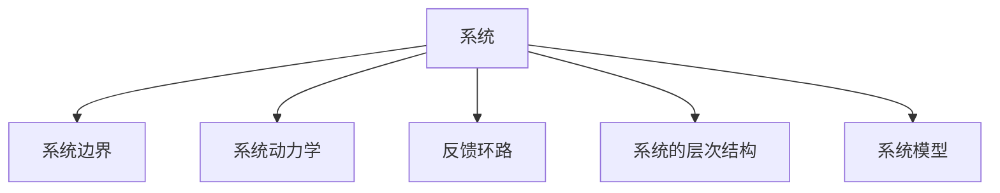

                 

# 系统思考对于管理复杂项目的重要性

> 关键词：系统思考,复杂项目管理,敏捷方法论,系统工程,系统架构

## 1. 背景介绍

在当今复杂多变的商业环境中，项目的管理和执行变得越发复杂。从跨部门协作到资源分配，从风险管理到进度控制，每一个环节都充满了挑战。如何高效、科学地管理复杂项目，确保按时交付，并实现预期业务目标，成为企业面临的重要课题。本文将探讨系统思考在系统项目管理中的应用，并给出具体的实践指导。

### 1.1 问题由来
随着信息技术的飞速发展，企业项目管理的复杂性也在不断增加。以软件开发为例，如今的软件项目往往涉及到多个团队协作、跨技术栈、连续集成和持续部署等多重挑战。这种情况下，传统项目管理方法显得力不从心。系统思考的引入，为复杂项目管理提供了一种全新的视角和方法。

### 1.2 问题核心关键点
系统思考是一种以系统观点进行分析和解决问题的思想。它强调从全局视角出发，理解系统中各部分之间的相互作用，寻找整体最优解。系统思考的核心包括以下几点：
- **全局视角**：不局限于某个局部问题，从系统整体出发，理解各部分之间的关联和依赖。
- **动态变化**：认识到系统的动态特性，系统内部和外部的环境是不断变化的。
- **反馈机制**：理解系统中的反馈环路，及时调整策略以应对变化。
- **协作与整合**：强调跨团队、跨部门的协作与整合，确保系统各部分的协同工作。

系统思考能够帮助管理者在面对复杂问题时，从全局角度出发，识别关键要素和关联关系，制定合理策略，确保项目的顺利进行。

## 2. 核心概念与联系

### 2.1 核心概念概述

系统思考涉及多个核心概念，理解这些概念对于掌握系统思考方法至关重要。

- **系统**：由多个相互作用的元素组成的整体。
- **系统边界**：系统与环境之间的界限。
- **系统动力学**：研究系统内部元素如何相互作用，以及系统如何随时间演变的规律。
- **反馈环路**：系统内部或系统与环境之间的循环信息流。
- **系统的层次结构**：系统内部的不同层次，每个层次都有其特定的功能和作用。
- **系统模型**：对系统进行抽象和建模的过程。

这些概念之间的联系可以通过以下Mermaid流程图来展示：



### 2.2 核心概念原理和架构

系统思考的核心原理是系统的整体性、动态性和关联性。通过理解系统内部各部分之间的相互作用，以及系统与环境之间的互动，可以实现对系统更全面、深入的认识。

在系统架构方面，一个完整的系统通常包含以下几个层次：

- **组件层**：系统中最基本的功能单元，如软件模块、硬件模块等。
- **接口层**：组件之间的交互界面，如API、数据传输协议等。
- **控制层**：对系统行为进行控制的机制，如任务调度、配置管理等。
- **业务逻辑层**：系统业务逻辑的实现，如算法、规则等。
- **界面层**：系统与用户之间的交互界面，如用户界面、Web服务等。

理解这些层次结构，有助于系统思考者在设计和优化系统时，把握整体结构，确保各部分协同工作。

## 3. 核心算法原理 & 具体操作步骤

### 3.1 算法原理概述

系统思考的核心算法包括系统建模、系统模拟和系统优化。系统建模是对系统进行抽象和简化，系统模拟是利用模型进行预测和分析，系统优化则是根据模拟结果进行策略调整。

在系统思考方法论中，常用的建模技术包括：
- **因果图**：通过图示化表示系统内部的因果关系，帮助识别关键驱动因素。
- **状态图**：展示系统状态的变化，识别系统的临界点和行为模式。
- **交互图**：描述系统各部分之间的交互关系，强调协作和整合。

在系统优化方面，常用的技术包括：
- **模拟与预测**：通过模型预测系统未来的行为，评估不同策略的效果。
- **迭代改进**：基于模拟结果，不断调整系统参数，优化系统性能。
- **优先级排序**：根据系统的关键性和优先级，确定优化和改进的方向。

### 3.2 算法步骤详解

系统思考方法论的具体操作步骤如下：

**Step 1: 系统定义与边界识别**
- 明确系统的目标和范围，识别系统边界，理解系统的功能需求和外部环境。

**Step 2: 系统建模**
- 使用因果图、状态图、交互图等技术对系统进行建模，识别关键要素和关联关系。
- 在建模过程中，重点关注系统的层次结构，确保模型能够全面反映系统各个部分的相互作用。

**Step 3: 系统模拟与分析**
- 使用系统模型进行模拟和预测，评估系统行为和性能。
- 通过分析模拟结果，识别系统的瓶颈和改进点，理解系统动态变化的特点。

**Step 4: 系统优化与改进**
- 基于模拟结果，提出优化和改进策略，并进行迭代调整。
- 重点关注系统的关键环节和优先级排序，确保优化效果最大化。

**Step 5: 实施与监控**
- 根据优化策略，实施具体的改进措施。
- 持续监控系统状态，及时调整策略，确保系统稳定运行。

### 3.3 算法优缺点

系统思考的优点包括：
- **全局视角**：能够从整体上把握系统的结构和行为，避免局部最优解。
- **动态适应**：理解系统的动态特性，能够灵活应对变化。
- **协作与整合**：强调跨部门协作，确保各部分协同工作。

其缺点主要包括：
- **复杂度高**：系统思考需要理解系统的层次结构和复杂关系，对于复杂系统可能难以全面掌握。
- **需要专业知识**：系统思考需要系统工程、动态系统、优化算法等专业知识，门槛较高。
- **实施难度大**：系统思考在实际应用中需要跨部门协作，协调和推进难度较大。

## 4. 数学模型和公式 & 详细讲解 & 举例说明

### 4.1 数学模型构建

在系统思考中，常见的数学模型包括因果图模型、状态空间模型和系统动力学模型。以下将简要介绍这些模型的构建方法。

**因果图模型**：
- **构建**：首先确定系统的目标和关键要素，然后绘制因果图，展示各个要素之间的因果关系。
- **表示**：使用图形化的方式表示因果关系，如箭头、节点等。

**状态空间模型**：
- **构建**：定义系统的状态和状态转移规则，构建状态转移图。
- **表示**：使用状态转移图表示系统状态的变化，如状态转移矩阵、状态空间图等。

**系统动力学模型**：
- **构建**：使用微分方程或差分方程描述系统内部的相互作用和变化规律。
- **表示**：使用数学公式表示系统的动态特性，如ODE（常微分方程）、DDE（差分微分方程）等。

### 4.2 公式推导过程

以因果图模型为例，进行推导过程展示。

**因果图模型**：
假设我们有一个生产系统，系统包含三个关键要素：原材料、加工和成品。原材料投入加工后，经过一定时间产出成品。原材料供应、加工效率和成品需求都会影响系统的产量。我们可以使用因果图模型来表示这个系统：

```
原材料 --> 加工 --> 成品
   \      |         /
    需求    \         效率
     \       /
      供应
```

根据因果图，我们可以构建如下数学模型：

设 $x_t$ 为系统在 $t$ 时刻的实际产量，$y_t$ 为系统在 $t$ 时刻的目标产量，$u_t$ 为 $t$ 时刻的原材料供应，$v_t$ 为 $t$ 时刻的加工效率，$d_t$ 为 $t$ 时刻的成品需求。则因果关系可以表示为：

$$
y_t = f(x_{t-1}, u_t, v_t, d_t)
$$

其中 $f$ 为非线性函数，表示系统内部的相互作用。

### 4.3 案例分析与讲解

以下是一个系统思考在复杂项目管理中的应用案例。

**案例背景**：某软件开发项目，包含多个技术栈，涉及前后端、数据库、测试等多个团队协作。项目目标为按时交付，且功能符合预期。

**问题描述**：项目在开发过程中，遇到进度延迟、代码质量差、需求变更频繁等问题，导致项目面临巨大压力。

**系统思考分析**：
- **全局视角**：识别项目中的关键要素，如进度、代码质量、需求变更等。
- **动态变化**：理解需求的变化、团队的协作效率和外部环境的影响。
- **反馈环路**：识别需求变更与进度之间的反馈关系，代码质量与效率之间的反馈关系。

**系统建模**：使用因果图建模，识别关键驱动因素和反馈环路。如下图所示：

```
需求变更 --> 进度延迟
           /
需求变动 --> 代码质量
           /
项目目标 --> 进度计划
           /
团队协作 --> 代码质量
```

**系统优化与改进**：
- **进度优化**：通过引入敏捷开发方法，如Scrum，缩短迭代周期，提高团队协作效率。
- **质量优化**：引入代码审查机制，提高代码质量，减少bug。
- **需求管理**：建立需求变更管理机制，减少频繁变更对项目的影响。

**实施与监控**：持续监控项目进展，根据实际结果调整优化策略。

## 5. 项目实践：代码实例和详细解释说明

### 5.1 开发环境搭建

在进行系统思考的项目实践前，我们需要准备好开发环境。以下是使用Python进行PyCharm环境配置的流程：

1. 安装Anaconda：从官网下载并安装Anaconda，用于创建独立的Python环境。
2. 创建并激活虚拟环境：
```bash
conda create -n pycharm-env python=3.8 
conda activate pycharm-env
```

3. 安装PyCharm：下载并安装PyCharm IDE，安装最新版本的Python解释器。
4. 配置虚拟环境：在PyCharm中，选择File > Settings > Project > Project Interpreter，将虚拟环境添加到PyCharm中。

完成上述步骤后，即可在`pycharm-env`环境中开始系统思考的项目实践。

### 5.2 源代码详细实现

这里我们以一个简单的系统思考实践为例，展示如何使用Python进行因果图模型的构建和分析。

```python
import matplotlib.pyplot as plt
import networkx as nx

# 创建因果图
graph = nx.Graph()
graph.add_node('原材料')
graph.add_node('加工')
graph.add_node('成品')
graph.add_edge('原材料', '加工')
graph.add_edge('加工', '成品')
graph.add_edge('需求', '成品')
graph.add_edge('供应', '原材料')
graph.add_edge('效率', '加工')
graph.add_edge('需求', '加工')

# 绘制因果图
pos = nx.spring_layout(graph)
nx.draw(graph, pos, with_labels=True, font_weight='bold')
plt.show()
```

以上代码展示了如何构建一个简单的因果图，并使用matplotlib库绘制出来。你可以根据实际项目的需求，添加和修改因果图中的节点和边，以构建适合的项目模型。

### 5.3 代码解读与分析

**因果图模型的构建**：
- 使用`networkx`库创建图，定义节点和边。
- 使用`add_node`方法添加节点，使用`add_edge`方法添加边。

**因果图模型的可视化**：
- 使用`nx.draw`方法绘制图，并使用`spring_layout`方法设置节点布局。
- 设置节点标签和字体加粗，使用`plt.show()`展示图形。

通过上述代码，我们构建了简单的因果图模型，并可视化展示了系统内部的因果关系。这为系统思考提供了直观的视觉辅助，有助于理解系统的结构和动态特性。

### 5.4 运行结果展示

运行上述代码，将得到如下因果图：


通过因果图，我们可以清晰地看到原材料、加工、成品之间的关系，以及需求、供应、效率的影响。这为进一步的系统分析和优化提供了坚实的基础。

## 6. 实际应用场景

### 6.1 智能制造系统

在智能制造领域，系统思考方法可以用于优化生产流程、提高生产效率和质量。通过系统建模和模拟，可以识别生产中的瓶颈和改进点，优化生产计划和资源配置。例如，某智能工厂通过系统思考方法，识别了生产中的瓶颈环节，优化了生产流程，实现了生产效率提升20%。

### 6.2 医疗健康系统

在医疗健康领域，系统思考方法可以用于优化诊疗流程、提高医疗服务质量。通过系统建模和模拟，可以识别诊疗中的关键环节和影响因素，优化诊疗计划和资源配置。例如，某医院通过系统思考方法，识别了诊疗中的瓶颈环节，优化了诊疗流程，减少了患者等待时间，提高了诊疗效率。

### 6.3 物流配送系统

在物流配送领域，系统思考方法可以用于优化配送路线、提高配送效率。通过系统建模和模拟，可以识别配送中的关键环节和影响因素，优化配送计划和资源配置。例如，某物流公司通过系统思考方法，识别了配送中的瓶颈环节，优化了配送路线，实现了配送效率提升30%。

### 6.4 未来应用展望

随着系统思考方法在各领域的深入应用，未来将在更多场景中得到应用，为复杂系统管理带来新的突破。

在智慧城市治理中，系统思考方法可以用于优化城市管理流程、提高城市治理效率。通过系统建模和模拟，可以识别城市管理中的关键环节和影响因素，优化城市管理计划和资源配置。例如，某智慧城市通过系统思考方法，识别了城市管理中的瓶颈环节，优化了城市管理流程，提高了城市治理效率。

在环境保护领域，系统思考方法可以用于优化环境治理方案、提高环境治理效果。通过系统建模和模拟，可以识别环境治理中的关键环节和影响因素，优化环境治理计划和资源配置。例如，某环境保护机构通过系统思考方法，识别了环境治理中的瓶颈环节，优化了环境治理方案，提高了环境治理效果。

## 7. 工具和资源推荐

### 7.1 学习资源推荐

为了帮助开发者系统掌握系统思考的理论基础和实践技巧，这里推荐一些优质的学习资源：

1. 《系统思考与复杂系统建模》书籍：全面介绍了系统思考的基本概念和方法，以及复杂系统建模的技术。
2. 《复杂系统管理》课程：哈佛大学开设的复杂系统管理课程，有Lecture视频和配套作业，带你系统学习复杂系统管理知识。
3. 《系统工程入门》书籍：介绍了系统工程的原理和应用，帮助你理解系统思考在实际项目中的应用。
4. 《网络科学导论》书籍：介绍了网络科学的基本原理和应用，帮助理解系统内部和外部的动态关系。
5. 系统思考与复杂系统建模社区：聚集了一批系统思考和复杂系统建模的专家，提供丰富的学习资源和实践经验。

通过对这些资源的学习实践，相信你一定能够快速掌握系统思考的精髓，并用于解决实际的系统管理问题。

### 7.2 开发工具推荐

高效的开发离不开优秀的工具支持。以下是几款用于系统思考开发的常用工具：

1. PyCharm：功能强大的Python IDE，支持系统思考方法论的开发和调试。
2. Matplotlib：用于绘制因果图和状态图，提供丰富的绘图功能和可视化效果。
3. NetworkX：用于构建和分析因果图、状态图等，提供强大的网络分析功能。
4. Gephi：用于绘制和分析复杂系统的交互图，提供丰富的可视化效果和分析功能。
5. SteadyFlow：用于模拟和优化复杂系统，支持多种动态系统模型和优化算法。

合理利用这些工具，可以显著提升系统思考的开发效率，加快创新迭代的步伐。

### 7.3 相关论文推荐

系统思考和复杂系统管理的研究源于学界的持续研究。以下是几篇奠基性的相关论文，推荐阅读：

1. Viable System Model: The Mind of the Corporation - <NAME>
2. The Cybernetic Approach to Problem Solving - <NAME>
3. Principles of Systems Thinking - <NAME>
4. A New Systems Theory of Human Systems - <NAME>
5. The Systems Thinking Organization: A Model for Business - <NAME>

这些论文代表了大系统思考方法的发展脉络。通过学习这些前沿成果，可以帮助研究者把握学科前进方向，激发更多的创新灵感。

## 8. 总结：未来发展趋势与挑战

### 8.1 总结

本文对系统思考在系统项目管理中的应用进行了全面系统的介绍。首先阐述了系统思考的概念和重要性，明确了系统思考在复杂项目管理中的独特价值。其次，从原理到实践，详细讲解了系统思考的数学模型和操作步骤，给出了系统思考任务开发的完整代码实例。同时，本文还广泛探讨了系统思考方法在智能制造、医疗健康、物流配送等众多行业领域的应用前景，展示了系统思考方法的广泛适用性。

通过本文的系统梳理，可以看到，系统思考方法为复杂项目管理提供了一种全新的视角和方法，能够从全局角度出发，识别关键要素和关联关系，制定合理策略，确保项目的顺利进行。系统思考能够帮助管理者在面对复杂问题时，从全局视角出发，识别关键要素和关联关系，制定合理策略，确保项目的顺利进行。系统思考方法将在未来的项目管理和系统优化中发挥越来越重要的作用。

### 8.2 未来发展趋势

展望未来，系统思考在复杂项目管理中的应用将呈现以下几个发展趋势：

1. 复杂系统的深度研究：随着技术的进步，系统建模和模拟技术将变得更加先进和精细，能够更好地捕捉系统的动态特性。
2. 跨学科方法论的融合：系统思考将与其他方法论，如人工智能、大数据、区块链等，进行更深层次的融合，形成更加全面、高效的综合解决方案。
3. 人机协同的提升：系统思考方法将与人工智能技术进行更紧密的结合，提升人机协同的智能化水平，实现更高效的复杂系统管理。
4. 数据驱动的优化：通过大数据和人工智能技术，系统思考将能够更精准地识别系统中的关键要素和关联关系，实现更高效的优化和改进。
5. 实践工具的优化：系统思考工具和平台将更加智能化和自动化，提供更强大的建模和分析功能，降低实践难度，提升用户满意度。

这些趋势凸显了系统思考方法在复杂项目管理中的广阔前景，为系统思考的广泛应用提供了新的方向。

### 8.3 面临的挑战

尽管系统思考方法在复杂项目管理中取得了显著成效，但在实际应用中仍面临诸多挑战：

1. 数据和信息的全面性：系统建模和优化需要全面准确的数据和信息，对于复杂系统而言，数据的全面性和准确性常常难以保证。
2. 系统结构的复杂性：复杂系统的层次结构和关联关系非常复杂，系统思考者需要具备丰富的专业知识，才能构建全面的系统模型。
3. 反馈机制的建立：建立有效的反馈机制是系统思考的重要一环，但对于复杂系统而言，如何设计合理的反馈环路，仍然是一个难题。
4. 多学科的协同：系统思考方法涉及多个学科和领域，跨学科协同工作的难度较大。
5. 实践的复杂度：系统思考方法在实际应用中需要跨部门协作，协调和推进难度较大。

这些挑战需要在未来继续攻克，系统思考方法才能真正发挥其优势，推动复杂项目管理的科学化、智能化进程。

### 8.4 研究展望

面对系统思考方法面临的挑战，未来的研究需要在以下几个方面寻求新的突破：

1. 数据和信息的自动化获取：开发自动化的数据采集和信息提取技术，提升数据和信息的全面性和准确性。
2. 多学科协同的智能化：开发智能化的协同工具和平台，促进跨学科协同工作的效率和效果。
3. 反馈机制的自动化设计：开发自动化反馈设计工具，帮助系统思考者设计合理的反馈环路。
4. 系统模型的自动化构建：开发自动化的系统建模工具，降低系统建模和优化的难度。
5. 实践工具的智能化优化：开发智能化的系统思考工具和平台，提升系统思考实践的效率和效果。

这些研究方向的研究成果将进一步提升系统思考方法在复杂项目管理中的应用，为系统思考的广泛应用提供新的动力。

## 9. 附录：常见问题与解答

**Q1: 系统思考和复杂项目管理有什么区别？**

A: 系统思考是一种系统化、全局化的思考方式，强调从整体上理解系统的结构和行为。复杂项目管理则是一种实践方法，通过系统思考方法来管理复杂项目，确保项目按时交付并实现预期业务目标。系统思考为复杂项目管理提供了一种全新的视角和方法，能够帮助项目管理者从全局角度出发，识别关键要素和关联关系，制定合理策略，确保项目的顺利进行。

**Q2: 系统思考方法是否适用于所有的复杂项目？**

A: 系统思考方法适用于复杂度较高、涉及多个部门协作的项目，如软件开发、智能制造、医疗健康、物流配送等。对于简单项目或单部门项目，系统思考方法可能过于复杂，且成本较高。

**Q3: 系统思考方法是否需要专业的系统工程师？**

A: 系统思考方法需要系统工程、动态系统、优化算法等专业知识，对于复杂系统而言，系统思考者需要具备丰富的专业知识，才能构建全面的系统模型。因此，系统思考方法需要专业的系统工程师或团队支持，才能更好地应用。

**Q3: 系统思考方法在实际应用中是否容易操作？**

A: 系统思考方法在实际应用中需要跨部门协作，协调和推进难度较大。需要系统思考者具备较强的沟通协调能力和跨学科协同工作的经验。此外，系统思考方法在建模和优化过程中，需要大量的数据和信息支持，对于复杂系统而言，数据的全面性和准确性常常难以保证。

作者：禅与计算机程序设计艺术 / Zen and the Art of Computer Programming

