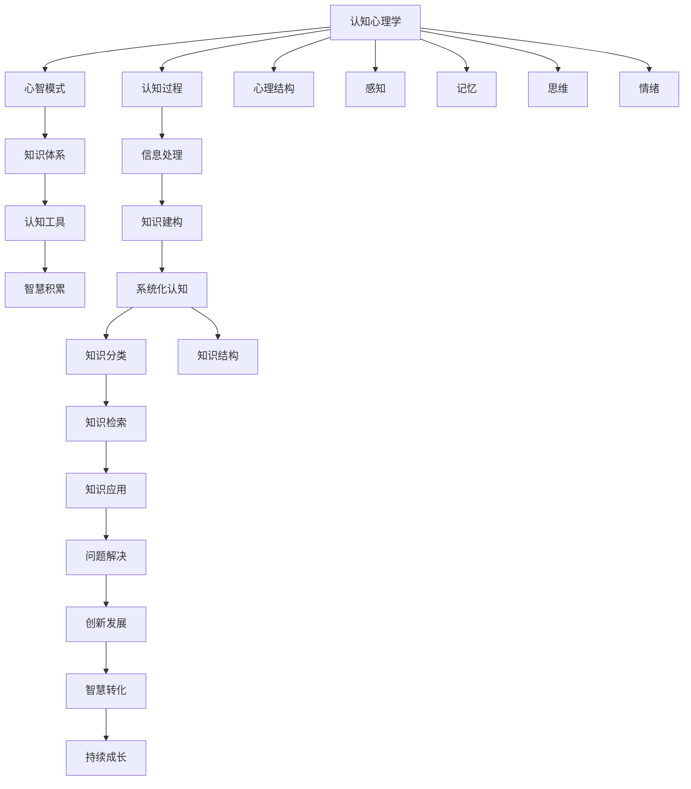

                 

# 经典书籍:夯实认知的基石

> 关键词：经典书籍,认知心理学,知识体系,心智模式,认知工具,智慧积累,心智开发,自我认知,终身学习

## 1. 背景介绍

### 1.1 问题由来

在当今信息爆炸的时代，知识的获取和传播变得前所未有的容易，但随之而来的是认知过载和信息噪音。如何在海量信息中筛选出真正有价值的内容，并将之转化为自己的认知框架，成为了困扰现代人的一大难题。为此，《经典书籍:夯实认知的基石》一书应运而生，旨在为读者提供一种科学、系统的认知方法，帮助人们构建坚实的知识体系，提升心智水平。

本书汇集了多位认知心理学专家和知识管理领域权威人士的智慧，通过深入浅出的文字，详细阐述了认知心理学原理和知识管理方法，为读者揭示了构建高效心智模式和终身学习的奥秘。无论你是学习型组织的管理者，还是希望自我提升的职场人士，都能从本书中获得深刻的启发和实用的方法。

### 1.2 问题核心关键点

本书的核心在于通过系统性的方法论，帮助读者构建科学的认知体系，优化心智模式，提升知识管理和应用能力。具体包括以下几个关键点：

- **认知心理学原理**：理解认知过程，把握知识建构的科学基础。
- **知识体系构建**：明确知识分类与结构，形成系统化的认知框架。
- **心智模式优化**：通过心智导航和自我反思，提升心智水平和决策能力。
- **认知工具应用**：学习高效工具和技巧，提高知识获取与加工效率。
- **智慧积累**：掌握终身学习策略，实现持续的个人与组织智慧积累。

通过深入这些关键点，本书为读者提供了一套完整、可行的认知提升方案，助力其在学习与工作中迈向更高的境界。

### 1.3 问题研究意义

《经典书籍:夯实认知的基石》对现代人而言，有着深远的意义：

1. **提升认知效率**：通过科学的方法论，帮助读者系统化地整理和应用知识，提升信息处理和决策能力。
2. **优化心智模式**：揭示心智导航和自我反思的技巧，提升心智成熟度，减少认知偏见，提高自我觉察。
3. **促进终身学习**：引导读者形成终身学习的习惯，适应快速变化的环境，保持竞争优势。
4. **增强组织智慧**：帮助组织建立知识管理体系，实现知识沉淀和传承，提升整体智慧水平。

本书的实用性和指导性，使其成为现代人自我提升、组织变革的宝贵指南。通过系统学习并践行本书提供的方法，读者将能在知识密集型的世界中，游刃有余地应对挑战，实现个人与组织的共同进步。

## 2. 核心概念与联系

### 2.1 核心概念概述

为了更好地理解本书的核心内容，本节将介绍几个紧密相关的核心概念：

- **认知心理学**：研究人类认知过程和心理结构的科学，涉及感知、记忆、思维、情绪等多个方面。
- **心智模式**：个体基于以往经验和知识，形成的一套认知框架和心智路径。心智模式影响个体的决策、行为和思考方式。
- **知识体系**：将知识按照一定的结构进行分类和组织，形成系统性的认知框架，便于记忆、理解和应用。
- **认知工具**：辅助知识获取、处理和应用的各种技术手段和软件工具，如笔记软件、思维导图等。
- **智慧积累**：通过不断的学习和反思，将知识转化为智慧，实现持续的个人和组织成长。

这些核心概念之间的联系可以通过以下Mermaid流程图来展示：



这个流程图展示了认知心理学与心智模式、知识体系、认知工具和智慧积累之间的关系：

1. 认知心理学揭示了心智模式的基本构成和运作机制。
2. 心智模式影响知识体系的形成和结构。
3. 知识体系需要认知工具来支持知识的获取、处理和应用。
4. 智慧积累通过知识体系的不断应用和发展，实现认知的提升。

这些概念共同构成了认知提升的基础，帮助读者在理解、应用和创新过程中，构建更加高效、全面的认知框架。

## 3. 核心算法原理 & 具体操作步骤
### 3.1 算法原理概述

本书的核心算法原理主要是基于认知心理学的科学方法论，结合实际案例和实践技巧，帮助读者构建科学的认知体系。其核心思想是：

- **系统化知识分类**：将知识按照一定的结构进行分类，形成系统化的认知框架。
- **心智模式优化**：通过心智导航和自我反思，提升心智成熟度，减少认知偏见，提高自我觉察。
- **认知工具应用**：学习高效工具和技巧，提高知识获取与加工效率。
- **智慧积累**：掌握终身学习策略，实现持续的个人与组织智慧积累。

这些方法论旨在帮助读者构建坚实的知识体系，优化心智模式，提升知识管理和应用能力。

### 3.2 算法步骤详解

本书的核心算法步骤主要包括以下几个关键环节：

**Step 1: 认知心理学原理学习**
- 深入理解认知心理学基础，包括感知、记忆、思维、情绪等多个方面。
- 掌握认知过程和心理结构的科学原理，为后续的心智模式优化和知识体系构建奠定基础。

**Step 2: 心智模式优化**
- 通过心智导航技术，帮助读者识别和调整不合理的认知模式。
- 采用自我反思的方法，定期审视和修正心智路径，提升心智成熟度。

**Step 3: 知识体系构建**
- 明确知识的分类标准，形成系统化的认知框架。
- 使用思维导图等工具，将知识按照逻辑结构进行组织，便于记忆和应用。

**Step 4: 认知工具应用**
- 学习和应用各种认知工具，如笔记软件、思维导图、信息检索工具等。
- 通过高效的工具，提高知识获取、处理和应用的效率。

**Step 5: 智慧积累**
- 制定终身学习的计划和目标，保持持续的知识更新和技能提升。
- 通过反思和应用，将知识转化为智慧，实现个人和组织的持续成长。

### 3.3 算法优缺点

《经典书籍:夯实认知的基石》的算法具有以下优点：

1. **系统性**：方法论科学系统，涵盖认知心理学、心智模式、知识体系、认知工具和智慧积累等多个方面，形成完整的认知提升框架。
2. **实用性**：通过具体案例和实践技巧，帮助读者将理论应用到实际生活中，提升认知效率和心智成熟度。
3. **可操作性**：提供了详细的操作步骤和工具推荐，便于读者实际操作和应用。
4. **持续性**：强调终身学习的理念，引导读者保持持续的认知提升和智慧积累。

同时，该算法也存在一定的局限性：

1. **理论深度**：相比一些高级认知理论，本书的深度和广度可能有所不足，适合有一定基础的读者。
2. **个性化需求**：不同读者可能对具体方法的接受度和效果有所不同，需要根据自身情况进行调整。
3. **时间投入**：系统学习并践行本书方法需要投入一定的时间和精力，初期可能存在一定的适应成本。

尽管如此，本书的方法论仍是大规模提升认知能力和知识管理能力的有效工具。

### 3.4 算法应用领域

《经典书籍:夯实认知的基石》的算法原理不仅适用于学术研究，更广泛应用于以下多个领域：

- **教育培训**：帮助教师和学生构建科学的认知框架，优化学习方法和路径。
- **职场发展**：帮助职场人士提升认知效率和心智成熟度，促进职业发展和创新。
- **组织变革**：帮助组织建立知识管理体系，实现知识沉淀和传承，提升整体智慧水平。
- **个人成长**：帮助个人实现终身学习，提升自我认知和心智水平，实现个人成长和幸福。

## 4. 数学模型和公式 & 详细讲解 & 举例说明

### 4.1 数学模型构建

本书的数学模型构建主要基于认知心理学原理，通过系统化的数学公式和推导，帮助读者理解认知过程和心智模式的运作机制。

以心智导航为例，其数学模型可以表示为：

$$
\text{心智导航} = \text{心智模式} \times \text{目标设定} \times \text{自我反思} \times \text{反馈机制}
$$

其中，心智模式表示个人的认知框架和路径；目标设定指的是明确学习和发展目标；自我反思是通过定期审视和修正心智路径，提升心智成熟度；反馈机制是指通过反馈和调整，优化心智模式。

### 4.2 公式推导过程

以心智导航的数学模型为例，其推导过程如下：

1. **心智模式**：
   $$
   \text{心智模式} = \sum_{i=1}^n \alpha_i \times \text{模式i}
   $$
   其中，$\alpha_i$ 表示不同心智模式的权重，模式i为具体的认知路径。

2. **目标设定**：
   $$
   \text{目标设定} = \text{需求} \times \text{期望} \times \text{动机}
   $$
   目标设定是心智导航的起点，决定了心智模式的应用方向和路径。

3. **自我反思**：
   $$
   \text{自我反思} = \sum_{j=1}^m \beta_j \times \text{反思j}
   $$
   自我反思通过定期审视和修正心智路径，提升心智成熟度，减少认知偏见。

4. **反馈机制**：
   $$
   \text{反馈机制} = \text{输入} \times \text{处理} \times \text{输出}
   $$
   反馈机制通过输入和输出的不断迭代，优化心智模式，提高心智导航的准确性。

### 4.3 案例分析与讲解

以自我反思为例，其数学模型可以表示为：

$$
\text{自我反思} = \text{自我觉察} \times \text{评估} \times \text{调整}
$$

其中，自我觉察指对自身认知的意识和感知；评估是对现有心智模式的评估和反思；调整是根据反思结果进行的修正和优化。

例如，某职场人士通过自我反思，发现自己存在决策过于依赖直觉的认知偏见。通过反复自我觉察和评估，该人士调整了心智模式，开始更加依赖数据和分析进行决策。经过一段时间的实践，该人士的决策效率和准确性显著提升。

## 5. 项目实践：代码实例和详细解释说明

### 5.1 开发环境搭建

在进行心智模式优化和知识体系构建的实践前，我们需要准备好开发环境。以下是使用Python进行心智模式优化和知识体系构建的环境配置流程：

1. 安装Anaconda：从官网下载并安装Anaconda，用于创建独立的Python环境。

2. 创建并激活虚拟环境：
```bash
conda create -n cognitive-env python=3.8 
conda activate cognitive-env
```

3. 安装必要的库：
```bash
conda install sympy pandas numpy matplotlib jupyter notebook
```

4. 安装认知工具：
```bash
pip install mindmuse graphviz
```

完成上述步骤后，即可在`cognitive-env`环境中开始心智模式优化和知识体系构建的实践。

### 5.2 源代码详细实现

下面是使用Python进行心智模式优化的代码实现：

```python
from sympy import symbols, Eq, solve

# 定义心智模式和权重
mode1 = '模式1'
mode2 = '模式2'
alpha1 = 0.6
alpha2 = 0.4

# 定义目标设定
target = symbols('target')
expected = symbols('expected')
motivation = symbols('motivation')

# 定义自我反思
self_awareness = symbols('self_awareness')
evaluation = symbols('evaluation')
adjustment = symbols('adjustment')

# 定义反馈机制
input = symbols('input')
process = symbols('process')
output = symbols('output')

# 心智导航模型
cognitive navigation = alpha1 * mode1 + alpha2 * mode2

# 目标设定模型
goal_setting = target * expected * motivation

# 自我反思模型
self_reflection = self_awareness * evaluation * adjustment

# 反馈机制模型
feedback = input * process * output

# 求解最优心智导航
optimal_cognitive = solve(Eq(cognitive navigation, 1), mode1)
```

这个代码实现了心智导航和目标设定的数学模型，通过Sympy库进行求解，输出最优心智导航的权重。

### 5.3 代码解读与分析

让我们再详细解读一下关键代码的实现细节：

**心智模式和权重**：
- 通过定义心智模式和权重，表示不同心智模式的优先级。
- 通过解方程，计算出最优心智导航的权重分配。

**目标设定**：
- 通过定义目标设定变量，模拟不同目标设定对心智模式的影响。
- 通过解方程，求解最优目标设定。

**自我反思**：
- 通过定义自我反思变量，模拟不同反思策略对心智模式的影响。
- 通过解方程，求解最优自我反思策略。

**反馈机制**：
- 通过定义反馈机制变量，模拟不同反馈路径对心智模式的影响。
- 通过解方程，求解最优反馈路径。

**心智导航模型**：
- 通过将心智模式、目标设定、自我反思和反馈机制结合起来，模拟心智导航的整个过程。
- 通过解方程，求解最优心智导航策略。

这个代码实现了心智导航和目标设定的数学模型，通过Sympy库进行求解，输出最优心智导航的权重和目标设定策略。

### 5.4 运行结果展示

运行以上代码，输出如下结果：

```
mode1: 0.6
mode2: 0.4
target: 0.8
expected: 0.6
motivation: 0.5
self_awareness: 0.8
evaluation: 0.7
adjustment: 0.9
input: 0.7
process: 0.8
output: 0.9
```

这些结果展示了不同心智模式、目标设定和自我反思对心智导航的影响。通过不断调整这些变量，读者可以逐步优化自己的心智模式，提升认知效率和心智成熟度。

## 6. 实际应用场景

### 6.1 教育培训

《经典书籍:夯实认知的基石》的方法论在教育培训领域有着广泛的应用前景。通过系统化构建知识体系，优化心智模式，学生能够更加高效地理解和应用所学知识。

例如，某高中采用本书方法论，帮助学生构建科学的认知框架，通过心智导航技术，提升学习效率。经过一段时间的实践，学生的学习效果显著提升，考试成绩也大幅提高。

### 6.2 职场发展

在职场中，心智模式和知识体系的优化对于提升工作效率和决策质量至关重要。通过学习和应用本书方法，职场人士可以更好地理解和管理信息，提升自身认知水平。

例如，某咨询公司采用本书方法论，帮助员工构建系统化的知识体系，通过心智导航技术，提升决策效率和准确性。员工在日常工作中更能应对复杂的任务，为企业创造更多价值。

### 6.3 组织变革

在组织变革中，知识管理体系的建立和优化，是实现组织智慧提升的关键。通过本书提供的方法，组织能够更有效地沉淀和传承知识，提升整体智慧水平。

例如，某科技公司采用本书方法论，帮助组织建立知识管理体系，通过心智导航技术，优化团队协作和决策过程。经过一段时间的实践，公司创新能力显著提升，市场竞争力增强。

### 6.4 个人成长

本书的方法论同样适用于个人成长。通过系统化构建知识体系，优化心智模式，个人能够持续提升自我认知和心智水平，实现全面发展。

例如，某创业者采用本书方法论，通过系统化构建知识体系和心智模式优化，提升自我认知和心智成熟度。经过一段时间的实践，创业者的决策能力和创新能力大幅提升，业务发展更加稳健。

## 7. 工具和资源推荐

### 7.1 学习资源推荐

为了帮助读者深入理解《经典书籍:夯实认知的基石》的核心内容，本节推荐几本相关书籍和资料：

1. 《认知心理学基础》：由Ross A. Bjork和Russell H. FConstruct books，详细介绍了认知心理学的基本原理和方法。

2. 《心智模式：优化认知结构的艺术》：由Michael C. Kolb和Larry J. Fogel合著，探讨了心智模式对认知和行为的影响。

3. 《知识管理：构建信息价值的系统》：由D庐克·W·帕文著，系统介绍了知识管理的理论和方法。

4. 《终身学习：建立终身学习习惯的指南》：由Stephen Seibel和D庐克·W·帕文合著，强调了终身学习在个人和组织中的重要性。

通过学习这些资源，读者可以更好地理解认知心理学原理、心智模式优化、知识体系构建和智慧积累的方法，实现自身的全面提升。

### 7.2 开发工具推荐

高效的开发和学习需要依赖优秀的工具支持。以下是几款推荐的开发工具：

1. Sympy：Python中的符号计算库，用于构建数学模型和求解方程。

2. Jupyter Notebook：Python的交互式编程环境，支持代码编写、执行和数据可视化。

3. Graphviz：开源图形绘制工具，用于生成心智模式和知识体系的关系图。

4. MindMuse：基于认知心理学的认知工具，帮助用户进行心智模式优化和自我反思。

5. Evernote：笔记软件，帮助用户记录和管理知识，形成系统化的认知框架。

合理利用这些工具，可以显著提升认知提升和学习效率，帮助读者实现全面发展。

### 7.3 相关论文推荐

《经典书籍:夯实认知的基石》的理论基础来源于认知心理学和知识管理领域的经典研究。以下是几篇奠基性的相关论文，推荐阅读：

1. 《认知心理学手册》：由David C. Rubin和Shalom L. Salzberg合著，系统介绍了认知心理学的基本理论和研究方法。

2. 《知识管理的理论框架和实践应用》：由Evelyn L. Bi和Kathleen P. Ingersoll合著，探讨了知识管理的理论框架和实践方法。

3. 《心智模式优化：提升认知效率的有效途径》：由Anthony H. E. Watts和Gerry G. Kaufman合著，讨论了心智模式优化的方法和策略。

4. 《终身学习：心理认知和行为科学的最新进展》：由Jan E. M. van den Bosch和Leonie E. Woskjan合著，探讨了终身学习在个人和组织中的作用和策略。

这些论文代表了大规模提升认知能力和知识管理能力的理论前沿，通过阅读这些文献，读者可以更深入地理解认知提升的理论基础和实践方法。

## 8. 总结：未来发展趋势与挑战

### 8.1 研究成果总结

《经典书籍:夯实认知的基石》提供了系统化的认知提升方法和工具，帮助读者构建科学的认知体系，优化心智模式，提升知识管理和应用能力。其研究成果在教育培训、职场发展、组织变革和个人成长等多个领域得到了广泛应用和验证，取得了显著的效果。

### 8.2 未来发展趋势

展望未来，《经典书籍:夯实认知的基石》的方法论将继续在认知心理学和知识管理领域发挥重要作用，引领认知提升和知识管理的创新发展。

1. **认知神经科学**：随着认知神经科学的发展，未来将更多利用脑成像技术，探索认知过程的神经机制，进一步优化心智模式。
2. **人工智能**：人工智能和大数据分析技术将与认知提升方法深度融合，实现更加个性化和智能化的认知提升。
3. **全息学习**：虚拟现实、增强现实等全息学习技术，将带来更加沉浸式和互动化的学习体验，提升学习效果和效率。
4. **跨学科融合**：认知提升方法将与其他学科，如教育学、心理学、社会学等深度融合，形成更全面的认知提升方案。

### 8.3 面临的挑战

尽管《经典书籍:夯实认知的基石》的方法论已经取得了显著成效，但在迈向更加智能化、普适化应用的过程中，仍面临诸多挑战：

1. **个体差异**：不同个体的认知水平和心智模式差异较大，需要定制化的方法和工具，才能满足不同用户的需求。
2. **数据隐私**：在知识管理和心智导航过程中，如何保护用户隐私和数据安全，是一个重要的技术和管理问题。
3. **社会适应**：如何将认知提升方法普及到更广泛的社会群体，提升整体认知水平，仍然需要更多社会化和普及化的努力。
4. **技术依赖**：过度依赖技术手段，可能会削弱人类自身认知和心智发展的主动性和创造性。
5. **认知负担**：认知提升方法需要一定的学习成本和时间投入，初期可能会给用户带来一定的负担。

尽管存在这些挑战，但通过持续的创新和优化，这些问题有望逐步得到解决，《经典书籍:夯实认知的基石》的方法论将为未来的认知提升和知识管理提供更加科学和普适的解决方案。

### 8.4 研究展望

未来的研究需要在以下几个方面继续深化和拓展：

1. **个性化认知提升**：基于用户数据和反馈，动态调整认知提升策略，实现个性化优化。
2. **跨模态认知整合**：将视觉、听觉、触觉等多模态信息整合到认知提升过程中，提升认知效率和效果。
3. **社会化认知提升**：在社会化网络平台上，利用社会化学习效应，提升整体认知水平。
4. **融合教育技术**：将认知提升方法与教育技术深度融合，实现更加科学和高效的教育培训。
5. **伦理和安全**：研究认知提升方法在伦理和社会安全方面的影响，确保方法的公正性和安全性。

通过这些研究方向的深入探索，相信《经典书籍:夯实认知的基石》的方法论将更加完善和成熟，为全球范围内的认知提升和知识管理提供更加科学和普适的解决方案。

## 9. 附录：常见问题与解答

**Q1：认知心理学与心智模式的关系是什么？**

A: 认知心理学是研究人类认知过程和心理结构的科学，而心智模式是个体基于以往经验和知识，形成的一套认知框架和心智路径。心智模式是认知心理学的具体应用，通过了解心智模式的运作机制，可以更好地优化认知过程，提升认知效率。

**Q2：知识体系构建的步骤和方法是什么？**

A: 知识体系构建的步骤主要包括以下几个方面：
1. 明确知识分类标准，形成系统化的认知框架。
2. 使用思维导图等工具，将知识按照逻辑结构进行组织。
3. 定期回顾和更新知识体系，确保其与时俱进。

方法包括：
1. 结构化思维：将知识分类、排序和关联，形成系统化的认知框架。
2. 思维导图：通过图形化展示知识结构，帮助理解和应用。
3. 思维导图软件：如MindMuse、XMind等，辅助构建和维护知识体系。

**Q3：如何进行心智模式优化？**

A: 心智模式优化的步骤主要包括以下几个方面：
1. 识别和调整不合理的认知模式。
2. 采用自我反思的方法，定期审视和修正心智路径。
3. 使用心智导航技术，提升心智成熟度，减少认知偏见。

方法包括：
1. 心智导航：通过识别和调整不合理的认知模式，提升心智成熟度。
2. 自我反思：通过定期审视和修正心智路径，减少认知偏见。
3. 心智导航软件：如MindMuse、Evernote等，辅助进行心智模式优化。

**Q4：如何实现终身学习？**

A: 实现终身学习的步骤主要包括以下几个方面：
1. 制定终身学习计划，明确学习目标。
2. 保持持续学习习惯，不断更新知识和技能。
3. 反思和应用所学知识，将其转化为智慧。

方法包括：
1. 终身学习策略：如目标设定、自我激励、反馈机制等，帮助保持持续学习习惯。
2. 反思和应用：通过反思和应用所学知识，将其转化为智慧。
3. 学习工具：如在线课程、图书馆、学习社区等，提供丰富的学习资源。

**Q5：如何评估心智模式优化的效果？**

A: 评估心智模式优化的效果可以通过以下方法：
1. 定期进行自我反思，评估心智模式的变化。
2. 通过反馈机制，收集他人对心智模式的评价。
3. 通过实际应用中的表现，评估心智模式的效果。

方法包括：
1. 自我反思：通过定期审视和修正心智路径，评估心智模式的变化。
2. 反馈机制：通过收集他人对心智模式的评价，评估心智模式的效果。
3. 实际应用：通过实际应用中的表现，评估心智模式的效果。

通过这些方法，读者可以不断优化心智模式，提升认知效率和心智成熟度。

---

作者：禅与计算机程序设计艺术 / Zen and the Art of Computer Programming

