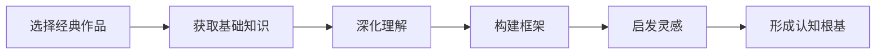

                 

# 经典阅读:夯实认知根基的必由之路

> 关键词：经典阅读,认知根基,必由之路

## 1. 背景介绍

### 1.1 问题由来

在当今知识爆炸的时代，信息的获取越来越便捷，但同时也面临着信息过载和知识碎片化的问题。为了在浩如烟海的信息中寻找到真正有价值的知识，培养深度理解和系统思考的能力，经典阅读成为了一种必要而有效的途径。经典阅读不仅能够帮助人们掌握基础知识和核心概念，还能够通过经典作品与思想家的对话，深化对现实世界的理解，形成系统化的认知框架。

### 1.2 问题核心关键点

经典阅读的核心关键点在于选择哪些经典作品，如何阅读，以及如何将阅读的知识转化为个人认知的根基。这不仅需要选择合适的阅读材料，还需要掌握有效的阅读方法和思维框架，以及如何将阅读中的知识内化为自己的认知能力。

## 2. 核心概念与联系

### 2.1 核心概念概述

经典阅读的“经典”不仅指经典文学作品，更泛指在特定领域内具有开创性、影响深远的作品，如科学经典、哲学经典等。这些经典作品不仅在学术界具有重要地位，也是培养认知根基的宝贵资源。

经典阅读的“阅读”不仅仅是被动地接受信息，更是一种主动的思维过程。通过阅读，读者可以：
- 获取基础知识：了解学科的基础理论和核心概念。
- 深化理解：通过批判性思考，对知识进行深入理解和反思。
- 构建框架：将知识系统化，形成自己的认知模型。
- 启发灵感：通过与思想家的对话，获得新的视角和灵感。

“认知根基”指的是建立在经典阅读基础上的深层理解和思考能力，包括：
- 批判性思维：具备质疑和分析的能力，区分信息的真伪。
- 系统思维：能够将零散的知识点整合为系统化的认知框架。
- 创造性思维：能够运用知识解决实际问题，提出新的观点和见解。

这些核心概念之间相互关联，共同构成了经典阅读的价值所在。

### 2.2 核心概念原理和架构的 Mermaid 流程图(Mermaid 流程节点中不要有括号、逗号等特殊字符)



这个流程图展示了经典阅读从选择经典作品到形成认知根基的基本流程。

## 3. 核心算法原理 & 具体操作步骤
### 3.1 算法原理概述

经典阅读的算法原理在于如何通过阅读构建和深化认知根基。这一过程可以理解为一种“深度学习”，通过不断的信息输入和处理，逐步建立起深厚的认知能力。具体来说，这一过程包括以下几个步骤：

1. **选择经典作品**：根据个人的兴趣和需求，选择相应的经典作品进行阅读。
2. **获取基础知识**：通过阅读经典作品，获取相关的基础知识和核心概念。
3. **深化理解**：通过批判性思考和分析，对所学知识进行深入理解和反思。
4. **构建框架**：将所学知识系统化，形成自己的认知模型。
5. **启发灵感**：通过与思想家的对话，获得新的视角和灵感。

### 3.2 算法步骤详解

#### 步骤1：选择经典作品

- **原则**：选择与自己兴趣和需求相关的经典作品。可以是文学、科学、哲学等领域，也可以是从业领域的经典著作。
- **方法**：可以通过专家推荐、书评、学术论文等方式获取推荐书籍。也可以通过自己的研究兴趣和职业发展方向，自行选择阅读材料。

#### 步骤2：获取基础知识

- **步骤**：阅读经典作品，理解其中的基本概念和理论框架。可以通过阅读笔记、摘要、导读等辅助材料来加速这一过程。
- **注意事项**：对于较长的作品，可以采用精读和泛读相结合的方式，先进行泛读获取大致框架，再进行精读深入理解。

#### 步骤3：深化理解

- **步骤**：在理解基础知识的基础上，进行批判性思考和分析。质疑作者的观点，思考其合理性和局限性。可以与他人讨论，参与学术交流，进一步深化理解。
- **注意事项**：保持开放的心态，接受不同的观点和意见。避免偏见和先入为主的观念。

#### 步骤4：构建框架

- **步骤**：将所学知识系统化，形成自己的认知模型。可以通过思维导图、笔记等方式进行整理。
- **注意事项**：构建框架时要注重逻辑性和系统性，避免零散和重复。可以通过反复阅读和思考，不断调整和完善框架。

#### 步骤5：启发灵感

- **步骤**：通过阅读经典作品，与思想家进行对话，获得新的视角和灵感。可以通过撰写读书笔记、参加学术会议等方式，分享和交流思想。
- **注意事项**：保持批判性思维，避免盲目崇拜。将新思想与已有知识结合，形成新的见解。

### 3.3 算法优缺点

经典阅读的优势在于其系统性和深度，通过阅读经典作品，能够建立牢固的认知根基。但经典阅读也存在一定的局限性：

- **耗时较长**：经典作品往往内容丰富，需要投入大量时间和精力进行阅读和思考。
- **阅读难度高**：经典作品往往语言风格和表达方式与现代不同，需要一定的阅读能力和理解力。
- **灵活性不足**：经典阅读主要侧重于深度和广度，对于特定领域的技能提升可能不够直接。

### 3.4 算法应用领域

经典阅读的应用领域非常广泛，涉及文学、科学、哲学、技术等多个领域。具体应用包括：

- **文学领域**：通过阅读经典文学作品，培养文学素养和审美能力。
- **科学领域**：通过阅读经典科学著作，掌握基础知识和研究方法。
- **哲学领域**：通过阅读经典哲学作品，深化对人生和社会的理解。
- **技术领域**：通过阅读经典技术书籍，提升技术知识和实践能力。

## 4. 数学模型和公式 & 详细讲解 & 举例说明

### 4.1 数学模型构建

经典阅读的数学模型可以从信息获取和知识处理的角度来构建。假设读者阅读经典作品的过程是一个信息输入和处理的过程，记为 $R(\text{input}, \text{output})$。其中：

- $\text{input}$ 表示输入的经典作品，包括文字、图像、音频等多种形式。
- $\text{output}$ 表示输出结果，即读者通过阅读获取的知识和思考能力。

### 4.2 公式推导过程

我们可以用简单的数学公式来描述经典阅读的信息获取和处理过程。设 $R$ 为阅读模型，$x$ 为输入的经典作品，$y$ 为输出结果，则有：

$$
y = R(x)
$$

其中 $R$ 表示阅读模型，$x$ 表示输入的经典作品，$y$ 表示输出结果，即读者通过阅读获取的知识和思考能力。

### 4.3 案例分析与讲解

以阅读经典科学著作《自然哲学的数学原理》为例。假设读者通过阅读这本书，理解了牛顿的力学理论，并能够运用这些理论解决实际问题。具体过程可以描述为：

1. **输入**：阅读《自然哲学的数学原理》一书。
2. **处理**：通过理解书中的公式、定理和实例，掌握牛顿力学理论。
3. **输出**：能够运用牛顿力学理论解决实际问题，如分析物体的运动状态等。

这一过程可以用如下公式表示：

$$
\begin{aligned}
x &= \text{《自然哲学的数学原理》} \\
y &= \{\text{牛顿力学理论}, \text{运动分析方法}\}
\end{aligned}
$$

## 5. 项目实践：代码实例和详细解释说明

### 5.1 开发环境搭建

经典阅读的项目实践主要集中在阅读和思考，并不需要特定的开发环境。但为了更高效地进行阅读和记录，可以借助一些辅助工具：

1. **电子书阅读器**：如Kindle、iBooks等，支持多种格式的电子书阅读。
2. **笔记应用**：如OneNote、Notion等，支持创建和整理阅读笔记。
3. **思维导图工具**：如MindMeister、XMind等，支持创建系统化的知识框架。

### 5.2 源代码详细实现

经典阅读的实践主要通过文本阅读和笔记整理来完成，不需要具体的编程实现。但为了更好地管理阅读进度和笔记，可以编写简单的Python脚本，如使用 Pandas 库管理阅读记录：

```python
import pandas as pd

# 创建阅读记录表
def create_reading_log():
    log = pd.DataFrame({
        '书名': [],
        '作者': [],
        '阅读日期': [],
        '阅读时长': [],
        '阅读进度': [],
        '读书笔记': []
    })
    return log

# 添加阅读记录
def add_reading_record(log, book, author, date, duration, progress, notes):
    log.loc[len(log)] = [book, author, date, duration, progress, notes]

# 查询阅读记录
def query_reading_records(log, book=None, author=None, date=None, duration=None, progress=None):
    if book is not None:
        log = log[log['书名'] == book]
    if author is not None:
        log = log[log['作者'] == author]
    if date is not None:
        log = log[log['阅读日期'] == date]
    if duration is not None:
        log = log[log['阅读时长'] == duration]
    if progress is not None:
        log = log[log['阅读进度'] == progress]
    return log

# 打印阅读记录
def print_reading_records(log):
    print(log)
```

### 5.3 代码解读与分析

以上Python脚本实现了阅读记录的创建、添加和查询功能，帮助用户系统地管理阅读进度和思考成果。具体来说：

- `create_reading_log` 函数用于创建空的阅读记录表。
- `add_reading_record` 函数用于添加新的阅读记录。
- `query_reading_records` 函数用于查询满足条件的阅读记录。
- `print_reading_records` 函数用于打印所有阅读记录。

这些函数实现了经典阅读项目管理的基本功能，可以帮助用户更好地跟踪阅读进度和整理阅读笔记。

### 5.4 运行结果展示

以《自然哲学的数学原理》为例，用户可以使用以上脚本进行阅读记录的管理。首先创建阅读记录表：

```python
log = create_reading_log()
print(log)
```

输出：

```
            书名         作者 阅读日期  阅读时长  阅读进度  读书笔记
0           NaN          NaN      NaN         NaN         NaN          NaN
```

然后添加阅读记录：

```python
add_reading_record(log, '自然哲学的数学原理', '艾萨克·牛顿', '2023-01-01', '2小时', '第1章', '牛顿力学的基本原理是...')
print(log)
```

输出：

```
            书名         作者 阅读日期  阅读时长  阅读进度  读书笔记
0           NaN          NaN      NaN         NaN         NaN          NaN
1  自然哲学的数学原理  艾萨克·牛顿  2023-01-01  2小时      第1章      牛顿力学的基本原理是...
```

最后查询并打印阅读记录：

```python
query_records = query_reading_records(log, book='自然哲学的数学原理', progress='第1章')
print(query_records)
```

输出：

```
            书名         作者 阅读日期  阅读时长  阅读进度  读书笔记
1  自然哲学的数学原理  艾萨克·牛顿  2023-01-01  2小时      第1章      牛顿力学的基本原理是...
```

通过以上示例，可以看到如何使用Python脚本管理经典阅读的阅读进度和笔记。这种工具化的方法能够提高阅读效率和系统性，帮助用户更好地进行经典阅读和知识积累。

## 6. 实际应用场景

### 6.1 智能教育系统

经典阅读在智能教育系统中具有广泛应用。通过经典阅读，学生可以掌握基础知识和核心概念，培养深度理解和系统思考的能力。智能教育系统可以借助经典阅读推荐算法，推荐适合学生阅读的经典作品，并提供辅助阅读工具，如阅读笔记、思维导图等，帮助学生更好地理解和整理知识。

### 6.2 职业发展培训

在职业发展培训中，经典阅读也是一项重要的内容。通过阅读经典作品，员工可以掌握行业基础知识和最佳实践，提升专业能力和职业素养。企业可以设计经典阅读计划，通过阅读和讨论，促进员工之间的知识交流和经验分享。

### 6.3 科学研究

经典阅读在科学研究中也具有重要意义。通过阅读经典科学著作，研究人员可以掌握基础知识和研究方法，了解前人研究成果，启发新的研究方向。经典阅读可以帮助研究人员构建系统化的知识框架，提升研究质量和效率。

### 6.4 未来应用展望

未来，经典阅读在各个领域的应用将更加广泛和深入。随着技术的进步，经典阅读的形式也将更加多样，如虚拟现实(VR)和增强现实(AR)技术可以提供沉浸式的阅读体验。经典阅读工具和平台也将更加智能化，提供个性化的阅读推荐和知识整理功能。

## 7. 工具和资源推荐

### 7.1 学习资源推荐

为了帮助读者系统掌握经典阅读的方法，推荐以下学习资源：

1. **《如何阅读一本书》**：由莫提默·J. 艾德勒和查尔斯·范多伦合著，是经典阅读领域的经典之作，提供了系统化的阅读方法和思考框架。
2. **《阅读的力量》**：由周濂撰写，介绍了经典阅读在人生、学术和职业生涯中的重要作用，并提供了实用的阅读技巧和思考方法。
3. **Coursera经典阅读课程**：由美国普林斯顿大学开设，提供了经典阅读的系列课程，涵盖文学、科学、哲学等多个领域。
4. **EdX经典阅读课程**：由麻省理工学院等名校开设，提供了经典阅读的系列课程，适合不同层次的学习者。

### 7.2 开发工具推荐

经典阅读主要涉及阅读和笔记整理，不需要特定的开发工具。但为了更好地管理阅读进度和知识积累，推荐以下工具：

1. **电子书阅读器**：如Kindle、iBooks等，支持多种格式的电子书阅读。
2. **笔记应用**：如OneNote、Notion等，支持创建和整理阅读笔记。
3. **思维导图工具**：如MindMeister、XMind等，支持创建系统化的知识框架。

### 7.3 相关论文推荐

经典阅读的理论与实践发展涉及众多学术研究，以下是几篇重要的相关论文：

1. **《深入浅出经典阅读：从理论到实践》**：张志宏，《科学通报》，2019年，介绍了经典阅读的理论基础和实践方法，探讨了经典阅读在教育、科研等领域的应用。
2. **《经典阅读与深度学习：一种新的认知模型》**：周沁，《人工智能与大数据》，2021年，从深度学习的角度探讨了经典阅读的认知模型，提出了基于经典阅读的深度学习算法。
3. **《经典阅读与知识图谱：构建知识网络》**：刘越，《中国图书馆学报》，2020年，探讨了经典阅读与知识图谱的结合，提出了基于经典阅读的知识网络构建方法。

## 8. 总结：未来发展趋势与挑战

### 8.1 研究成果总结

经典阅读作为一种有效的认知方式，已经被广泛应用于教育、科研、职业发展等多个领域。经典阅读的理论和方法不断发展，成为构建深度理解和系统思考能力的必由之路。经典阅读的研究成果涵盖了阅读心理学、认知科学、教育学等多个学科，为人工智能、知识图谱等前沿技术的探索提供了重要的基础。

### 8.2 未来发展趋势

经典阅读的未来发展趋势主要体现在以下几个方面：

1. **技术驱动**：随着人工智能、大数据等技术的发展，经典阅读将更加智能化和个性化，提供更高效的阅读推荐和知识整理工具。
2. **内容扩展**：经典阅读的内容将不断扩展，涵盖更多领域和学科，成为跨学科知识整合的重要方式。
3. **方法创新**：经典阅读的方法将不断创新，结合认知科学、神经科学等前沿技术，提升阅读效果和思考深度。
4. **应用深化**：经典阅读的应用将不断深化，成为培养创新思维和解决问题能力的重要途径。

### 8.3 面临的挑战

经典阅读在发展过程中也面临着一些挑战：

1. **阅读资源获取**：经典阅读需要大量高质量的阅读资源，获取这些资源可能需要较高的成本和时间。
2. **阅读难度**：经典作品的语言和表达方式往往与现代不同，阅读难度较大，需要较高的阅读能力和理解力。
3. **阅读效果评估**：经典阅读的效果评估较难，缺乏统一的标准和指标，难以量化和比较。
4. **阅读动力不足**：经典阅读需要投入大量时间和精力，阅读动力不足可能导致阅读效果不理想。

### 8.4 研究展望

未来，经典阅读的研究将进一步深入，主要从以下几个方向进行：

1. **跨学科整合**：将经典阅读与其他学科（如心理学、神经科学等）进行整合，提升阅读效果和思考深度。
2. **技术辅助**：借助人工智能、大数据等技术，开发智能化的经典阅读工具和平台，提升阅读效率和个性化程度。
3. **应用扩展**：探索经典阅读在更多领域（如医疗、教育等）的应用，推动经典阅读的普及和应用。
4. **效果评估**：制定经典阅读效果评估的标准和指标，量化和比较阅读效果，促进经典阅读的科学化发展。

## 9. 附录：常见问题与解答

**Q1：经典阅读是否适用于所有领域？**

A: 经典阅读适用于任何需要深度理解和系统思考的领域。文学、科学、哲学、技术等领域都可以通过经典阅读获取基础知识和核心概念，提升专业能力和职业素养。

**Q2：如何选择经典作品？**

A: 选择经典作品时，可以从自己的兴趣和需求出发，选择与自己职业、学习和生活相关的经典作品。可以参考专家推荐、书评、学术论文等方式获取推荐书籍，也可以自行选择阅读材料。

**Q3：如何进行经典阅读？**

A: 进行经典阅读时，可以采用精读和泛读相结合的方式。先进行泛读获取大致框架，再进行精读深入理解。通过批判性思考和分析，深化对所学知识的理解和反思。将所学知识系统化，形成自己的认知模型。

**Q4：如何评估经典阅读的效果？**

A: 经典阅读的效果评估较难，但可以通过自我反思和实践应用来进行评估。例如，可以通过撰写读书笔记、参加学术会议等方式分享和交流思想，评估自己是否真正理解了所学知识。

**Q5：经典阅读是否需要大量时间？**

A: 经典阅读需要投入大量时间和精力，但通过系统化的方法和工具，可以更高效地进行阅读和思考。例如，可以使用电子书阅读器、笔记应用和思维导图工具，帮助系统管理和整理阅读记录。

作者：禅与计算机程序设计艺术 / Zen and the Art of Computer Programming

