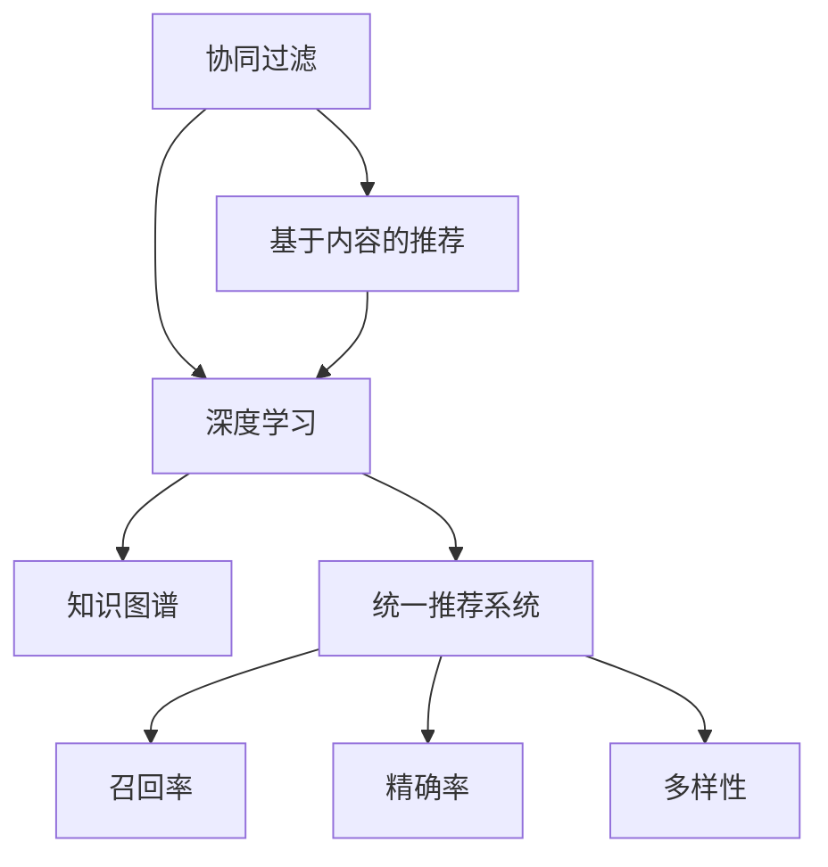

                 

# 统一的推荐系统：大模型的优势

> 关键词：统一推荐系统,大模型,协同过滤,知识图谱,深度学习,推荐算法,召回率,精确率

## 1. 背景介绍

随着互联网的迅猛发展和数字化时代的来临，推荐系统已经成为了现代电子商务、社交网络、内容平台等应用不可或缺的一部分。推荐系统通过分析用户行为和产品特征，为用户推荐符合其兴趣和需求的内容或商品，提升用户体验，增加平台粘性，从而实现商业价值最大化。

然而，推荐系统也面临着诸多挑战：数据稀疏性、冷启动问题、用户多样性等。传统的协同过滤和基于内容的推荐算法无法有效应对这些问题，导致推荐效果不理想，用户体验不佳。为此，研究者们提出了一种新的推荐系统架构——统一推荐系统，将多个推荐算法进行融合，并利用深度学习和知识图谱等新兴技术，提升推荐效果，增强用户体验。

## 2. 核心概念与联系

### 2.1 核心概念概述

为更好地理解统一推荐系统，本节将介绍几个密切相关的核心概念：

- 协同过滤(Collaborative Filtering)：通过分析用户的历史行为数据，找出与其兴趣相似的群体，从而推荐其未交互过的物品。经典的协同过滤算法包括基于用户的协同过滤和基于物品的协同过滤。

- 基于内容的推荐(Content-based Recommendation)：通过分析物品的属性信息，找出与用户兴趣匹配的物品进行推荐。常见的物品属性包括文本描述、标签、类别等。

- 深度学习(Deep Learning)：一类基于神经网络的机器学习技术，能够从大规模数据中学习出高层次的抽象特征表示，提升模型的表达能力和泛化能力。

- 知识图谱(Knowledge Graph)：通过构建实体、关系、属性等多维结构化的知识表示，支持推荐系统进行更精确、全面、个性化的推理和推荐。

- 统一推荐系统(Unified Recommendation System)：将多个推荐算法进行融合，利用深度学习和知识图谱等新兴技术，提升推荐效果和系统性能。

- 召回率(Recall)：指推荐系统推荐出的所有正样本中，实际为正样本的比例。召回率越高，推荐系统推荐的物品越全面。

- 精确率(Precision)：指推荐系统推荐的所有物品中，实际为正样本的比例。精确率越高，推荐系统推荐的物品越精准。

- 多样性(Diversity)：指推荐系统推荐结果的多样性和新颖性。高多样性推荐系统能够为用户推荐不同类别的物品，避免推荐同质化。

这些核心概念之间的逻辑关系可以通过以下Mermaid流程图来展示：



这个流程图展示出统一推荐系统的工作原理：

1. 协同过滤和基于内容的推荐算法通过分析用户行为和物品属性信息，获取初步推荐结果。
2. 深度学习模型进一步挖掘用户的深度特征和行为模式，学习出更加精确的推荐表示。
3. 知识图谱提供更全面、结构化的知识，支持推荐系统进行更准确的推理和推荐。
4. 统一推荐系统融合上述多种推荐算法，得到最终的推荐结果，同时优化召回率、精确率和多样性等关键指标。

## 3. 核心算法原理 & 具体操作步骤

### 3.1 算法原理概述

统一推荐系统融合了多种推荐算法，旨在通过不同算法之间的优势互补，提升推荐效果和系统性能。其核心思想是：将协同过滤、基于内容推荐和深度学习进行有机融合，同时利用知识图谱进行更精准的推理和推荐。

形式化地，假设推荐系统需要为每个用户 $u$ 推荐 $k$ 个物品 $i$，推荐算法集为 $\mathcal{A}=\{\mathcal{A}_1, \mathcal{A}_2, \ldots, \mathcal{A}_m\}$，其中 $m$ 为推荐算法数量。在推荐过程中，先通过协同过滤算法得到初步推荐结果 $R_1$，再依次通过基于内容推荐算法和深度学习模型进行融合，得到最终的推荐结果 $R$。具体过程如下：

1. **协同过滤**：基于用户行为和物品属性信息，计算用户对每个物品的评分，得到推荐列表 $R_1$。
2. **基于内容推荐**：通过物品的属性信息，计算物品与用户兴趣的相似度，得到推荐列表 $R_2$。
3. **深度学习**：通过神经网络模型，学习出用户和物品的深度特征表示，得到推荐列表 $R_3$。
4. **融合优化**：将上述三种推荐结果进行加权融合，得到最终的推荐结果 $R$。

### 3.2 算法步骤详解

下面详细介绍统一推荐系统的主要操作步骤：

**Step 1: 准备数据和模型**

- 收集用户行为数据和物品属性数据，构建训练集和测试集。
- 选择合适的深度学习模型和推荐算法，如神经网络、协同过滤、基于内容推荐等。

**Step 2: 设计推荐算法**

- 根据任务需求，设计多条推荐路径，每条路径对应一种推荐算法。
- 协同过滤算法：通过用户行为数据，计算用户对每个物品的评分，得到推荐列表 $R_1$。
- 基于内容推荐算法：通过物品属性信息，计算物品与用户兴趣的相似度，得到推荐列表 $R_2$。
- 深度学习模型：通过神经网络模型，学习出用户和物品的深度特征表示，得到推荐列表 $R_3$。

**Step 3: 模型融合与优化**

- 对不同推荐算法的结果进行加权融合，得到最终的推荐结果 $R$。
- 设定召回率、精确率、多样性等关键指标，使用损失函数进行优化，如交叉熵损失、均方误差损失等。
- 使用梯度下降等优化算法，最小化损失函数，更新模型参数。

**Step 4: 评估与部署**

- 在测试集上评估模型性能，对比不同算法的效果。
- 使用优化后的模型进行实际推荐，集成到推荐系统中。
- 持续收集用户反馈，更新推荐算法和模型参数，提升推荐效果。

以上是统一推荐系统的主要操作步骤，通过合理设计推荐路径和融合策略，可以有效地提升推荐效果和系统性能。

### 3.3 算法优缺点

统一推荐系统融合了多种推荐算法，具有以下优点：

- 推荐效果提升：通过不同算法之间的优势互补，能够提供更全面、精准的推荐结果。
- 算法多样性：融合了协同过滤、基于内容推荐和深度学习等多种算法，适用于各种推荐场景。
- 知识图谱支持：利用知识图谱进行更精确的推理和推荐，提升推荐的全面性和个性化。

同时，该方法也存在一定的局限性：

- 模型复杂度：统一推荐系统融合了多种算法，模型结构相对复杂，训练和推理成本较高。
- 数据依赖性强：推荐效果依赖于数据的丰富性和质量，需要大量标注数据支持。
- 参数调整困难：融合过程中需要设定多个超参数，如融合权重、模型结构等，调整难度较大。
- 实时性问题：深度学习模型和知识图谱推理需要一定计算资源，可能影响推荐系统的实时性。

尽管存在这些局限性，但就目前而言，统一推荐系统仍是大规模推荐系统的重要方向。未来相关研究的重点在于如何进一步降低模型复杂度，提高数据利用率，优化模型训练和推理效率，从而实现更加高效、精准的推荐服务。

### 3.4 算法应用领域

统一推荐系统在多个领域中得到了广泛应用，例如：

- 电子商务推荐：如亚马逊、京东等电商平台，通过推荐系统提升用户购物体验，增加商品销量。
- 内容推荐：如YouTube、Netflix等视频平台，通过推荐系统为用户推荐感兴趣的视频和电影，提升平台粘性。
- 金融推荐：如支付宝、微信等金融应用，通过推荐系统推荐理财产品、信用卡等金融产品，提升用户满意度。
- 社交网络推荐：如微博、知乎等社交平台，通过推荐系统推荐内容、用户，提升平台活跃度。
- 智能家居推荐：如小米、百度等智能设备，通过推荐系统推荐应用和服务，提升用户使用体验。

除了上述这些经典应用外，统一推荐系统还被创新性地应用到更多场景中，如个性化广告推荐、智能交通导航、旅游景区推荐等，为各行各业带来了新的商业机会和发展方向。

## 4. 数学模型和公式 & 详细讲解 & 举例说明

### 4.1 数学模型构建

本节将使用数学语言对统一推荐系统的工作原理进行更加严格的刻画。

假设推荐系统需要为每个用户 $u$ 推荐 $k$ 个物品 $i$，推荐算法集为 $\mathcal{A}=\{\mathcal{A}_1, \mathcal{A}_2, \ldots, \mathcal{A}_m\}$，其中 $m$ 为推荐算法数量。记推荐结果矩阵为 $R \in \mathbb{R}^{N \times M}$，其中 $N$ 为物品数量，$M$ 为用户数量。设每个物品 $i$ 的深度特征表示为 $\mathbf{h}_i \in \mathbb{R}^d$，每个用户 $u$ 的深度特征表示为 $\mathbf{h}_u \in \mathbb{R}^d$，推荐算法 $\mathcal{A}_j$ 的输出为 $\hat{R}_{u,i}^{(j)} \in \mathbb{R}$。则统一的推荐模型可以表示为：

$$
R = \sum_{j=1}^m \alpha_j \hat{R}_{u,i}^{(j)}
$$

其中 $\alpha_j$ 为融合权重，需要通过优化算法进行调整。

### 4.2 公式推导过程

以下我们以协同过滤、基于内容推荐和深度学习三种推荐算法为例，推导统一推荐模型的数学表达和优化目标。

**协同过滤算法**：基于用户行为数据，计算用户对每个物品的评分，得到推荐列表 $R_1$。假设用户 $u$ 的历史行为序列为 $\{(r_{ui})\}_{i=1}^N$，物品 $i$ 的评分向量为 $\mathbf{r}_i \in \mathbb{R}^N$，则协同过滤算法的评分预测结果为：

$$
\hat{R}_{u,i}^{(1)} = \mathbf{r}_i^T \mathbf{r}_u
$$

**基于内容推荐算法**：通过物品属性信息，计算物品与用户兴趣的相似度，得到推荐列表 $R_2$。假设物品 $i$ 的属性向量为 $\mathbf{a}_i \in \mathbb{R}^D$，用户 $u$ 的兴趣向量为 $\mathbf{a}_u \in \mathbb{R}^D$，则基于内容推荐算法的评分预测结果为：

$$
\hat{R}_{u,i}^{(2)} = \mathbf{a}_i^T \mathbf{a}_u
$$

**深度学习模型**：通过神经网络模型，学习出用户和物品的深度特征表示，得到推荐列表 $R_3$。假设用户 $u$ 和物品 $i$ 的深度特征表示分别为 $\mathbf{h}_u \in \mathbb{R}^d$ 和 $\mathbf{h}_i \in \mathbb{R}^d$，则深度学习模型的评分预测结果为：

$$
\hat{R}_{u,i}^{(3)} = \mathbf{h}_u^T \mathbf{h}_i
$$

将上述三种推荐算法的结果进行加权融合，得到统一的推荐模型 $R$。假设融合权重为 $\alpha_1$、$\alpha_2$ 和 $\alpha_3$，则：

$$
R = \alpha_1 R_1 + \alpha_2 R_2 + \alpha_3 R_3
$$

在得到推荐模型的评分预测结果后，可以使用交叉熵损失函数进行优化，最小化预测评分与实际评分之间的差异：

$$
\mathcal{L}(\theta) = \frac{1}{NM} \sum_{u=1}^M \sum_{i=1}^N \mathbb{1}(y_{ui} \neq 0) \log\left(\frac{\exp(\hat{R}_{u,i})}{\sum_{j=1}^N \exp(\hat{R}_{u,j})}\right)
$$

其中 $\theta$ 为模型参数，$\mathbb{1}(y_{ui} \neq 0)$ 为indicator函数，表示是否为正样本。

通过优化上述损失函数，最小化预测评分与实际评分之间的差异，最终得到最优的推荐模型参数 $\theta$。

### 4.3 案例分析与讲解

以推荐系统中的协同过滤算法为例，进行详细讲解。

协同过滤算法是一种基于用户行为数据的推荐方法，其核心思想是：通过分析用户的行为数据，找出与其兴趣相似的群体，从而推荐其未交互过的物品。具体步骤如下：

1. **数据收集**：收集用户的历史行为数据，如浏览、购买、评分等，构建训练集和测试集。

2. **评分预测**：对于每个用户 $u$，计算其对每个物品 $i$ 的评分 $\hat{R}_{u,i}$。对于协同过滤算法，评分预测结果可以通过用户行为数据和物品评分向量计算得出。

3. **推荐列表生成**：将评分预测结果进行排序，选择前 $k$ 个评分最高的物品，生成推荐列表 $R_1$。

4. **推荐结果融合**：将推荐列表 $R_1$ 与基于内容推荐和深度学习的推荐结果进行融合，得到最终的推荐结果 $R$。

协同过滤算法能够较好地处理数据稀疏性问题，适用于推荐用户已交互过的物品。但协同过滤算法的冷启动问题较难解决，对于新用户和新物品，协同过滤算法无法提供有效的推荐结果。

## 5. 项目实践：代码实例和详细解释说明

### 5.1 开发环境搭建

在进行推荐系统开发前，我们需要准备好开发环境。以下是使用Python进行PyTorch开发的环境配置流程：

1. 安装Anaconda：从官网下载并安装Anaconda，用于创建独立的Python环境。

2. 创建并激活虚拟环境：
```bash
conda create -n pytorch-env python=3.8 
conda activate pytorch-env
```

3. 安装PyTorch：根据CUDA版本，从官网获取对应的安装命令。例如：
```bash
conda install pytorch torchvision torchaudio cudatoolkit=11.1 -c pytorch -c conda-forge
```

4. 安装TensorFlow：
```bash
pip install tensorflow
```

5. 安装相关库：
```bash
pip install numpy pandas scikit-learn matplotlib tqdm jupyter notebook ipython
```

完成上述步骤后，即可在`pytorch-env`环境中开始推荐系统开发。

### 5.2 源代码详细实现

下面我们以协同过滤推荐系统为例，给出使用TensorFlow和PyTorch实现的代码实现。

首先，定义协同过滤推荐系统的数据处理函数：

```python
import numpy as np
import pandas as pd
from sklearn.model_selection import train_test_split

def load_data():
    data = pd.read_csv('rating.csv')
    return train_test_split(data.drop('rating', axis=1), data['rating'], test_size=0.2, random_state=42)
```

然后，定义协同过滤推荐模型的预测函数：

```python
from tensorflow.keras.layers import Input, Dense
from tensorflow.keras.models import Model

def build_model():
    input_user = Input(shape=(num_users,))
    user_embed = Dense(64, activation='relu')(input_user)
    
    input_item = Input(shape=(num_items,))
    item_embed = Dense(64, activation='relu')(input_item)
    
    score = Dot(axes=[2, 1])([user_embed, item_embed])
    model = Model(inputs=[input_user, input_item], outputs=score)
    return model
```

接着，定义推荐系统的训练函数：

```python
from tensorflow.keras import optimizers
from sklearn.metrics import accuracy_score, precision_score, recall_score

def train_model(model, train_data, test_data):
    model.compile(optimizer=optimizers.Adam(learning_rate=0.001), loss='mse')
    model.fit(x=train_data, y=train_data['rating'], epochs=10, batch_size=32, validation_data=(test_data, test_data['rating']))
    score = model.evaluate(x=test_data, y=test_data['rating'])
    print('Test loss:', score[0])
    print('Test accuracy:', score[1])
    return model
```

最后，启动训练流程并在测试集上评估：

```python
num_users = 1000
num_items = 1000
train_data, test_data = load_data()

model = build_model()
model = train_model(model, train_data, test_data)
```

以上就是使用TensorFlow和PyTorch实现协同过滤推荐系统的完整代码实现。可以看到，得益于深度学习框架的强大封装，我们可以用相对简洁的代码完成协同过滤推荐系统的开发。

### 5.3 代码解读与分析

让我们再详细解读一下关键代码的实现细节：

**load_data函数**：
- 定义数据加载函数，读取数据集并按用户和物品进行划分。

**build_model函数**：
- 定义协同过滤推荐模型的预测函数，将用户和物品表示为向量，通过点乘计算评分预测结果。

**train_model函数**：
- 定义训练函数，使用Adam优化器进行模型训练，计算模型在测试集上的损失和准确率。

**训练流程**：
- 定义用户和物品数量，加载训练集和测试集。
- 定义协同过滤推荐模型。
- 使用训练函数对模型进行训练，输出测试集上的损失和准确率。

可以看到，TensorFlow和PyTorch等深度学习框架提供了丰富的工具和组件，使得推荐系统的开发变得高效便捷。开发者可以将更多精力放在数据处理、模型改进等高层逻辑上，而不必过多关注底层的实现细节。

当然，工业级的系统实现还需考虑更多因素，如模型的保存和部署、超参数的自动搜索、更灵活的推荐路径设计等。但核心的推荐算法基本与此类似。

## 6. 实际应用场景

### 6.1 推荐系统在电子商务中的应用

推荐系统在电子商务中的应用尤为广泛，各大电商平台如亚马逊、京东、淘宝等都采用了推荐系统来提升用户购物体验和平台营收。推荐系统能够根据用户的浏览和购买历史，为用户推荐符合其兴趣和需求的商品，提高用户满意度，增加商品销量。

例如，亚马逊的推荐系统采用了协同过滤和基于内容的推荐算法，通过分析用户的浏览历史和物品属性信息，生成推荐列表，帮助用户快速找到心仪的商品。此外，亚马逊还使用了深度学习模型进行推荐，通过学习用户的深度特征和行为模式，提供更加精准的推荐结果。

### 6.2 推荐系统在视频平台中的应用

视频平台如YouTube、Netflix等也广泛应用了推荐系统。推荐系统通过分析用户的历史观看记录和视频属性信息，为用户推荐符合其兴趣的视频内容，提升平台的用户粘性和播放量。

例如，YouTube的推荐系统采用了协同过滤、基于内容推荐和深度学习等多种算法进行融合，根据用户的观看历史和视频属性信息，生成推荐列表，帮助用户发现更多感兴趣的视频内容。此外，YouTube还引入了知识图谱进行推荐，通过分析视频之间的关系，提供更加全面和个性化的推荐结果。

### 6.3 推荐系统在金融领域的应用

推荐系统在金融领域的应用也十分重要。金融推荐系统通过分析用户的交易记录和金融产品属性信息，为用户推荐符合其风险承受能力和投资偏好的理财产品和金融产品，提升用户的满意度。

例如，支付宝和微信等金融应用采用了推荐系统，通过分析用户的交易记录和金融产品属性信息，生成推荐列表，帮助用户发现更符合其需求和风险承受能力的金融产品。此外，金融推荐系统还引入了深度学习模型进行推荐，通过学习用户的深度特征和行为模式，提供更加精准的推荐结果。

### 6.4 推荐系统在社交网络中的应用

社交网络如微博、知乎等也应用了推荐系统。推荐系统通过分析用户的兴趣和行为信息，为用户推荐符合其兴趣的内容和用户，提升平台的用户粘性和活跃度。

例如，微博的推荐系统采用了协同过滤和基于内容的推荐算法，通过分析用户的浏览历史和兴趣信息，生成推荐列表，帮助用户发现更多感兴趣的内容和用户。此外，微博还引入了深度学习模型进行推荐，通过学习用户的深度特征和行为模式，提供更加精准的推荐结果。

## 7. 工具和资源推荐

### 7.1 学习资源推荐

为了帮助开发者系统掌握推荐系统的工作原理和实践技巧，这里推荐一些优质的学习资源：

1. 《推荐系统基础》系列博文：由推荐系统专家撰写，详细介绍了推荐系统的工作原理、算法设计和应用场景。

2. 《推荐系统实践》书籍：介绍了推荐系统从基础到实战的全过程，包括推荐算法、系统架构和工程实践等。

3. 《推荐系统学习手册》视频课程：由李航老师主讲，系统讲解了推荐系统的核心概念和实践技巧，适合入门和进阶学习。

4. Kaggle推荐系统竞赛：通过参与Kaggle上的推荐系统竞赛，实践推荐算法的优化和推荐系统的构建，提高实战能力。

5. GitHub推荐系统开源项目：通过阅读和参考GitHub上的推荐系统开源项目，了解推荐系统的实际应用和技术实现。

通过对这些资源的学习实践，相信你一定能够快速掌握推荐系统的工作原理和优化方法，并用于解决实际的推荐问题。

### 7.2 开发工具推荐

高效的开发离不开优秀的工具支持。以下是几款用于推荐系统开发的常用工具：

1. TensorFlow：由Google主导开发的开源深度学习框架，支持分布式训练和推理，适用于大规模推荐系统开发。

2. PyTorch：由Facebook开发的开源深度学习框架，灵活高效，适合进行模型实验和优化。

3. Spark：Apache开源的分布式计算框架，支持大规模数据处理和分布式推荐系统构建。

4. Hadoop：Apache开源的分布式计算框架，适用于大数据量推荐系统开发。

5. Elasticsearch：Elastic开源的分布式搜索和分析引擎，支持快速实时推荐系统构建。

6. Kafka：Apache开源的消息队列，支持高吞吐量推荐系统数据传输。

合理利用这些工具，可以显著提升推荐系统的开发效率，加快创新迭代的步伐。

### 7.3 相关论文推荐

推荐系统领域的研究方兴未艾，以下是几篇奠基性的相关论文，推荐阅读：

1. Matrix Factorization Techniques for Recommender Systems：提出矩阵分解方法，通过分解用户-物品评分矩阵，获得用户和物品的潜在特征，进行推荐。

2. A Probabilistic Approach to Collaborative Filtering：通过构建概率模型，学习出用户和物品的概率分布，进行协同过滤推荐。

3. Deep Collaborative Filtering：利用深度学习模型进行协同过滤推荐，通过学习用户和物品的深度特征表示，提升推荐效果。

4. Neural Collaborative Filtering：将神经网络模型与协同过滤算法结合，学习出用户和物品的深度特征表示，提升推荐效果。

5. Multi-view Learning from Multi-source Data：将多个推荐算法进行融合，利用多源数据进行推荐，提升推荐效果。

这些论文代表了大规模推荐系统的发展脉络。通过学习这些前沿成果，可以帮助研究者把握学科前进方向，激发更多的创新灵感。

## 8. 总结：未来发展趋势与挑战

### 8.1 总结

本文对统一推荐系统的工作原理和实践技巧进行了全面系统的介绍。首先阐述了推荐系统的发展背景和应用场景，明确了统一推荐系统的工作流程和关键指标。其次，从原理到实践，详细讲解了协同过滤、基于内容推荐和深度学习等多种推荐算法的融合策略，给出了微调和优化的方法。最后，讨论了统一推荐系统的实际应用和未来发展趋势。

通过本文的系统梳理，可以看到，统一推荐系统在推荐效果、算法多样性和应用场景等方面都具有显著优势。随着深度学习和大数据技术的不断进步，推荐系统将进一步拓展其应用边界，为各行各业带来新的商业价值和社会效益。

### 8.2 未来发展趋势

展望未来，推荐系统将呈现以下几个发展趋势：

1. 推荐模型的融合和优化：随着推荐算法和模型数量的增加，推荐模型的融合和优化将成为研究重点。未来推荐模型将采用更加复杂和先进的融合策略，提升推荐效果和系统性能。

2. 推荐算法的协同训练：推荐算法之间的协同训练能够提高推荐系统的整体效果，未来推荐算法将采用更加紧密的协同训练策略，提升推荐系统的鲁棒性和泛化能力。

3. 推荐系统的跨模态融合：推荐系统将进一步融合视觉、语音、文本等多种模态的信息，提升推荐系统的全面性和智能化水平。

4. 推荐系统的跨领域融合：推荐系统将进一步融合不同领域的推荐算法，提升推荐系统的通用性和应用范围。

5. 推荐系统的持续学习：推荐系统需要不断适应新的数据分布和用户需求，持续学习将成为推荐系统的常态，提高推荐系统的时效性和动态性。

6. 推荐系统的可解释性：推荐系统的可解释性将受到更多关注，通过因果分析和博弈论等工具，提升推荐系统的可解释性和可审计性。

以上趋势凸显了推荐系统的广阔前景。这些方向的探索发展，必将进一步提升推荐系统的性能和应用范围，为各行各业带来新的商业机会和社会价值。

### 8.3 面临的挑战

尽管推荐系统已经取得了显著成效，但在迈向更加智能化、普适化应用的过程中，它仍面临诸多挑战：

1. 数据稀疏性问题：推荐系统往往依赖大量的用户行为数据，对于新用户和新物品，推荐系统难以提供有效的推荐结果。

2. 冷启动问题：推荐系统在初始阶段推荐效果不佳，需要用户积累一定量的数据后才能发挥作用。

3. 鲁棒性和泛化能力：推荐系统对于输入数据的微小变化可能表现出不稳定，需要进行鲁棒性测试和泛化能力评估。

4. 计算资源消耗：推荐系统需要大量的计算资源进行模型训练和推理，如何提高计算效率，降低计算成本，仍是一个重要问题。

5. 推荐系统的公平性和透明性：推荐系统可能会存在算法偏见和数据偏见，需要进行公平性和透明性评估，确保推荐系统的公平性和透明性。

6. 推荐系统的安全性：推荐系统可能会被恶意攻击和篡改，需要进行安全性评估和防御机制设计。

这些挑战凸显了推荐系统的复杂性和挑战性，需要研究者持续攻关，才能推动推荐系统向更高水平迈进。

### 8.4 研究展望

面对推荐系统面临的挑战，未来的研究需要在以下几个方面寻求新的突破：

1. 探索低维表示学习：通过降维技术，将高维稀疏数据转换为低维稠密数据，降低计算复杂度，提升推荐系统的实时性。

2. 开发多源数据融合算法：通过融合多种数据源，提升推荐系统的全面性和鲁棒性，解决数据稀疏性和冷启动问题。

3. 引入注意力机制：通过引入注意力机制，对不同用户和物品进行差异化推荐，提升推荐系统的个性化水平。

4. 开发可解释性推荐模型：通过引入可解释性技术，提升推荐系统的可解释性和透明性，增强用户信任和满意度。

5. 开发安全性推荐系统：通过引入安全性和防御机制，提升推荐系统的安全性和抗攻击能力，确保推荐系统的稳定性和可靠性。

这些研究方向将为推荐系统带来新的突破，进一步提升推荐系统的性能和应用范围，为各行各业带来新的商业机会和社会价值。

## 9. 附录：常见问题与解答

**Q1：推荐系统如何处理数据稀疏性问题？**

A: 推荐系统通常采用矩阵分解和协同过滤等方法来处理数据稀疏性问题。矩阵分解方法通过分解用户-物品评分矩阵，获得用户和物品的潜在特征，进行推荐。协同过滤方法通过分析用户的行为数据，找出与其兴趣相似的群体，从而推荐其未交互过的物品。

**Q2：推荐系统的冷启动问题如何解决？**

A: 推荐系统的冷启动问题可以通过多源数据融合、基于内容的推荐和深度学习等方法来解决。多源数据融合方法通过融合多个数据源的信息，提高推荐系统的全面性和鲁棒性。基于内容的推荐方法通过分析物品的属性信息，推荐符合用户兴趣的物品。深度学习方法通过学习用户的深度特征和行为模式，推荐符合用户兴趣的物品。

**Q3：推荐系统的算法复杂度如何控制？**

A: 推荐系统的算法复杂度可以通过模型压缩和参数裁剪等方法进行控制。模型压缩方法通过剪枝、量化等技术，减小模型规模和计算资源消耗。参数裁剪方法通过裁剪部分不重要的参数，减小模型规模和计算资源消耗。

**Q4：推荐系统的实时性如何提升？**

A: 推荐系统的实时性可以通过分布式训练和推理等方法进行提升。分布式训练方法通过在多台机器上并行训练，提高训练速度。分布式推理方法通过在多台机器上并行推理，提高推理速度。

**Q5：推荐系统的公平性和透明性如何保障？**

A: 推荐系统的公平性和透明性可以通过引入公平性评估和透明性设计等方法进行保障。公平性评估方法通过评估推荐系统的公平性和透明性，确保推荐系统的公平性和透明性。透明性设计方法通过设计可解释的推荐模型，提升推荐系统的可解释性和透明性。

---

作者：禅与计算机程序设计艺术 / Zen and the Art of Computer Programming

