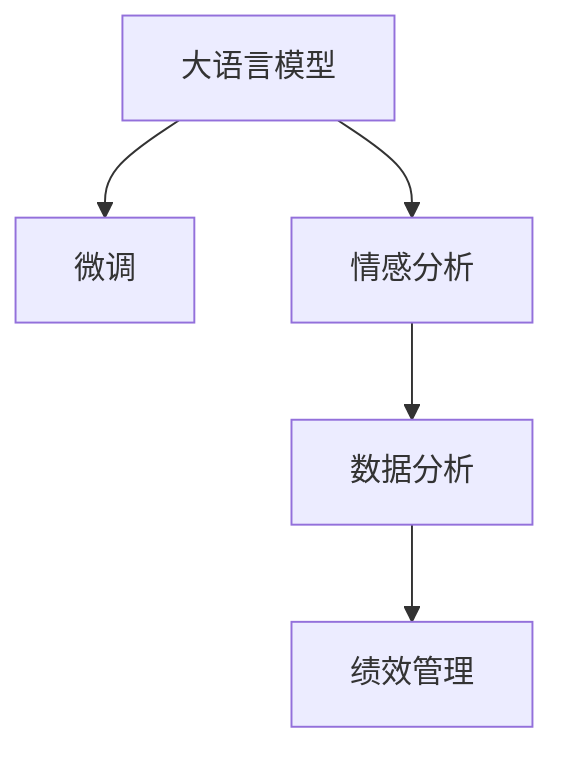

                 

# 绩效管理分析师：LLM 提升团队绩效

## 1. 背景介绍

在当今快速变化的商业环境中，企业面临着前所未有的挑战，尤其是全球疫情和远程办公的普及，使得团队绩效管理变得更为复杂。传统的绩效管理方法，如KPI（关键绩效指标）和360度反馈，已难以满足现代企业的需要。如何高效地衡量和管理团队绩效，成为了人力资源管理的一大难题。

为了解决这一问题，我们引入了一种新的方法——基于大语言模型(Large Language Model, LLM)的绩效管理分析系统。LLM是一种通过大规模无监督学习获得语言模型的神经网络模型，能够理解、生成人类语言，并从语料库中学习语言规律。本文将详细介绍如何利用LLM提升团队绩效管理的效果。

## 2. 核心概念与联系

### 2.1 核心概念概述

**大语言模型(LLM)**：通过大规模无监督学习获得的一种强大的语言模型。常用的LLM包括GPT-3、BERT等，可以用于文本生成、问答、翻译等任务。

**绩效管理**：人力资源管理的重要组成部分，通过设定绩效指标、评价绩效、反馈改进等步骤，提升团队或个人的绩效。

**数据分析**：通过收集、处理、分析数据，提取有价值的信息，支持决策。

**情感分析**：利用自然语言处理技术，分析文本中的情感倾向，判断其积极或消极情绪。

**模型微调(Fine-tuning)**：在大规模预训练模型基础上，通过添加新的任务层和损失函数，调整模型参数，使其适应新任务。

这些核心概念之间的逻辑关系可以通过以下Mermaid流程图来展示：



这个流程图展示了LLM在绩效管理中的应用路径：首先，通过微调获取适合特定任务的语言模型，然后利用情感分析对员工反馈、绩效指标等文本数据进行情感倾向分析，最后结合数据分析和绩效管理，提升团队绩效。

## 3. 核心算法原理 & 具体操作步骤

### 3.1 算法原理概述

基于LLM的绩效管理分析系统，其核心原理是利用微调获取针对特定绩效指标的预训练模型，再通过情感分析等技术，从文本数据中提取情感信息，最终结合数据分析和绩效管理，实现团队绩效的优化。

**微调**：在大规模预训练模型基础上，添加新的任务层和损失函数，调整模型参数，使其适应特定绩效指标的分析。

**情感分析**：利用自然语言处理技术，分析员工反馈、绩效指标等文本数据中的情感倾向，判断其积极或消极情绪。

**数据分析**：收集、处理、分析绩效管理相关的文本数据，提取有价值的信息，支持决策。

**绩效管理**：通过设定绩效指标、评价绩效、反馈改进等步骤，提升团队或个人的绩效。

### 3.2 算法步骤详解

#### 3.2.1 数据准备

1. **数据收集**：收集与绩效管理相关的文本数据，包括员工反馈、绩效指标、项目管理文档等。
2. **数据清洗**：去除无关信息，统一文本格式，确保数据质量。
3. **数据标注**：对文本数据进行情感标注，如积极、消极、中性等。

#### 3.2.2 模型选择与微调

1. **模型选择**：选择适合性能管理的预训练模型，如BERT、GPT-3等。
2. **任务层设计**：设计新的任务层，用于绩效指标的情感分析。
3. **微调训练**：在微调框架如TensorFlow、PyTorch等下，训练微调模型。

#### 3.2.3 情感分析与数据处理

1. **情感分析**：利用自然语言处理技术，对文本数据进行情感分析，提取情感信息。
2. **数据整合**：将情感分析结果与其他绩效管理数据整合，进行综合分析。

#### 3.2.4 绩效管理与优化

1. **绩效指标设定**：设定合理的绩效指标，如工作量、质量、客户满意度等。
2. **绩效评估**：结合情感分析结果，对绩效指标进行综合评估。
3. **反馈改进**：根据绩效评估结果，生成反馈意见，进行改进。

### 3.3 算法优缺点

**优点**：
1. **高效性**：利用预训练模型，减少了从头训练的时间成本和计算资源消耗。
2. **准确性**：微调后的模型能更准确地理解文本数据中的情感信息，提供更可靠的绩效评估。
3. **灵活性**：适用于各种类型的绩效管理数据，能根据不同需求进行调整。

**缺点**：
1. **依赖数据**：微调模型的性能依赖于数据质量和标注的准确性。
2. **模型复杂**：微调模型需要复杂的算法和大量的计算资源，对数据处理和计算能力要求较高。
3. **结果解释性差**：模型的决策过程较为复杂，难以解释其内部工作机制。

### 3.4 算法应用领域

基于LLM的绩效管理分析系统，广泛应用于以下几个领域：

1. **人力资源管理**：用于员工绩效评估、招聘、培训等。
2. **项目管理**：用于项目进展跟踪、风险评估、团队协作等。
3. **客户服务**：用于客户满意度分析、客户反馈分析等。
4. **产品开发**：用于产品功能评估、用户需求分析等。

## 4. 数学模型和公式 & 详细讲解 & 举例说明

### 4.1 数学模型构建

假设绩效管理任务为$T$，文本数据为$D=\{(x_i, y_i)\}_{i=1}^N$，其中$x_i$为文本数据，$y_i$为情感标签（积极、消极、中性）。

**微调模型的目标**：
$$
\hat{\theta} = \mathop{\arg\min}_{\theta} \mathcal{L}(M_{\theta}, D)
$$
其中$\mathcal{L}$为损失函数，$M_{\theta}$为微调后的模型，$\theta$为模型参数。

### 4.2 公式推导过程

假设选择BERT模型进行微调，模型结构为$[CLS] + [SEP]$，其中$[CLS]$为分类器，$[SEP]$为分割器。

**分类器输出**：
$$
\hat{y} = \text{softmax}(M_{\theta}(x_i)[CLS])
$$

**损失函数**：
$$
\mathcal{L} = \frac{1}{N} \sum_{i=1}^N \text{CE}(\hat{y}, y_i)
$$
其中$\text{CE}$为交叉熵损失函数。

**微调过程**：
1. **数据准备**：收集绩效管理相关的文本数据$D$，并进行预处理。
2. **模型加载**：加载预训练的BERT模型$M_{\theta}$。
3. **微调训练**：在微调框架下，添加新的任务层，调整模型参数，使其适应绩效管理任务。

### 4.3 案例分析与讲解

假设某公司希望提升其客户服务部门的绩效，可以使用基于BERT的情感分析模型。首先，收集客户服务部门的聊天记录，将其作为训练数据。然后，对聊天记录进行情感标注，生成训练集$D$。接着，在微调框架下训练BERT模型，调整任务层和损失函数，使其适应情感分析任务。最后，利用微调后的模型对新的聊天记录进行情感分析，得到客户满意度等信息，用于绩效评估和改进。

## 5. 项目实践：代码实例和详细解释说明

### 5.1 开发环境搭建

**环境要求**：
1. **Python**：3.8及以上版本。
2. **PyTorch**：1.9及以上版本。
3. **TensorFlow**：2.5及以上版本。
4. **BERT**：HuggingFace提供的预训练模型。
5. **Jupyter Notebook**：用于交互式开发和数据可视化。

**安装步骤**：
1. **创建虚拟环境**：
   ```bash
   conda create -n performance-analytics python=3.8
   conda activate performance-analytics
   ```
2. **安装依赖包**：
   ```bash
   pip install torch tensorflow transformers
   ```

### 5.2 源代码详细实现

**代码实现**：

```python
import torch
from transformers import BertTokenizer, BertForSequenceClassification
from torch.utils.data import DataLoader, Dataset
from sklearn.metrics import accuracy_score

class PerformanceDataset(Dataset):
    def __init__(self, texts, labels):
        self.tokenizer = BertTokenizer.from_pretrained('bert-base-uncased')
        self.texts = texts
        self.labels = labels
        
    def __len__(self):
        return len(self.texts)
    
    def __getitem__(self, idx):
        text = self.texts[idx]
        label = self.labels[idx]
        
        encoding = self.tokenizer(text, truncation=True, padding='max_length', max_length=128, return_tensors='pt')
        input_ids = encoding['input_ids']
        attention_mask = encoding['attention_mask']
        
        label = torch.tensor(label, dtype=torch.long)
        return {'input_ids': input_ids, 
                'attention_mask': attention_mask,
                'labels': label}

# 加载数据集
train_dataset = PerformanceDataset(train_texts, train_labels)
dev_dataset = PerformanceDataset(dev_texts, dev_labels)
test_dataset = PerformanceDataset(test_texts, test_labels)

# 设置模型和优化器
model = BertForSequenceClassification.from_pretrained('bert-base-uncased', num_labels=3)
optimizer = torch.optim.AdamW(model.parameters(), lr=1e-5)
loss_fn = torch.nn.CrossEntropyLoss()

# 训练模型
device = torch.device('cuda' if torch.cuda.is_available() else 'cpu')
model.to(device)

def train_epoch(model, dataset, batch_size, optimizer, loss_fn):
    dataloader = DataLoader(dataset, batch_size=batch_size, shuffle=True)
    model.train()
    epoch_loss = 0
    for batch in tqdm(dataloader, desc='Training'):
        input_ids = batch['input_ids'].to(device)
        attention_mask = batch['attention_mask'].to(device)
        labels = batch['labels'].to(device)
        model.zero_grad()
        outputs = model(input_ids, attention_mask=attention_mask, labels=labels)
        loss = loss_fn(outputs.logits, labels)
        epoch_loss += loss.item()
        loss.backward()
        optimizer.step()
    return epoch_loss / len(dataloader)

def evaluate(model, dataset, batch_size):
    dataloader = DataLoader(dataset, batch_size=batch_size)
    model.eval()
    preds, labels = [], []
    with torch.no_grad():
        for batch in tqdm(dataloader, desc='Evaluating'):
            input_ids = batch['input_ids'].to(device)
            attention_mask = batch['attention_mask'].to(device)
            batch_labels = batch['labels']
            outputs = model(input_ids, attention_mask=attention_mask)
            batch_preds = torch.argmax(outputs.logits, dim=1).to('cpu').tolist()
            batch_labels = batch_labels.to('cpu').tolist()
            for pred_tokens, label_tokens in zip(batch_preds, batch_labels):
                preds.append(pred_tokens[:len(label_tokens)])
                labels.append(label_tokens)
                
    print(accuracy_score(labels, preds))

# 训练模型
epochs = 5
batch_size = 32

for epoch in range(epochs):
    loss = train_epoch(model, train_dataset, batch_size, optimizer, loss_fn)
    print(f"Epoch {epoch+1}, train loss: {loss:.3f}")
    
    print(f"Epoch {epoch+1}, dev accuracy: {evaluate(model, dev_dataset, batch_size)}")
    
print(f"Test accuracy: {evaluate(model, test_dataset, batch_size)}")
```

**代码解释**：
1. **数据处理**：定义`PerformanceDataset`类，用于处理文本和标签数据。
2. **模型和优化器**：加载BERT模型和优化器，定义交叉熵损失函数。
3. **训练过程**：在训练函数`train_epoch`中，利用数据加载器`DataLoader`对数据进行批处理，前向传播计算损失，反向传播更新模型参数，最后返回平均损失。
4. **评估过程**：在评估函数`evaluate`中，利用数据加载器对数据进行批处理，计算模型预测结果和真实标签的准确率。
5. **训练流程**：设置总的epoch数和batch size，开始循环迭代。

### 5.3 代码解读与分析

**数据处理**：
1. **分词器**：使用BERT的分词器，对文本进行分词，生成input ids和attention mask。
2. **标签转换**：将标签转换为独热编码形式，用于训练和评估。

**模型训练**：
1. **模型加载**：加载预训练的BERT模型，并设置分类器输出。
2. **优化器和损失函数**：定义AdamW优化器和交叉熵损失函数。
3. **训练过程**：将模型和数据移动到GPU上，进行前向传播和反向传播，更新模型参数。

**评估过程**：
1. **模型评估**：利用模型对数据进行前向传播，计算预测结果和真实标签的准确率。
2. **评估结果**：打印出训练集和验证集的平均损失，以及测试集的准确率。

**训练流程**：
1. **设置epoch数和batch size**：循环迭代训练过程。
2. **训练和评估**：每个epoch内，先在训练集上训练，输出平均损失；在验证集上评估，输出准确率。
3. **测试**：在测试集上评估模型的最终性能。

## 6. 实际应用场景

### 6.1 智能客服系统

基于LLM的绩效管理分析系统，可以应用于智能客服系统的客户满意度分析。通过收集客服聊天记录，利用情感分析模型提取客户情感信息，结合绩效指标进行综合评估。

**应用流程**：
1. **数据收集**：收集客服聊天记录，进行预处理。
2. **情感分析**：利用BERT模型对聊天记录进行情感分析，提取客户满意度信息。
3. **绩效评估**：结合情感分析结果和绩效指标，评估客服人员的绩效。
4. **改进建议**：根据绩效评估结果，生成改进建议，进行反馈。

### 6.2 人力资源管理

在人力资源管理中，绩效管理是重要的一环。利用基于LLM的绩效管理分析系统，可以提升招聘、培训、绩效评估的效率和准确性。

**应用流程**：
1. **数据收集**：收集员工反馈、绩效指标、项目评估等文本数据。
2. **情感分析**：利用BERT模型对文本数据进行情感分析，提取员工情感信息。
3. **绩效评估**：结合情感分析结果和绩效指标，评估员工绩效。
4. **改进建议**：根据绩效评估结果，生成改进建议，进行反馈。

### 6.3 项目管理

在项目管理中，利用基于LLM的绩效管理分析系统，可以提升项目进展跟踪、风险评估、团队协作的效率和准确性。

**应用流程**：
1. **数据收集**：收集项目进展报告、团队沟通记录等文本数据。
2. **情感分析**：利用BERT模型对文本数据进行情感分析，提取项目和团队情感信息。
3. **绩效评估**：结合情感分析结果和绩效指标，评估项目和团队绩效。
4. **改进建议**：根据绩效评估结果，生成改进建议，进行反馈。

### 6.4 未来应用展望

随着LLM的不断发展和应用，基于LLM的绩效管理分析系统将在更多领域得到应用，为企业的运营管理提供强有力的支持。

1. **智能制造**：在智能制造中，利用绩效管理分析系统，可以提升生产效率、产品质量和供应链管理。
2. **智慧农业**：在智慧农业中，利用绩效管理分析系统，可以提升农产品的产量、质量和市场竞争力。
3. **智慧城市**：在智慧城市中，利用绩效管理分析系统，可以提升城市管理效率和居民满意度。

## 7. 工具和资源推荐

### 7.1 学习资源推荐

为了帮助开发者系统掌握基于LLM的绩效管理分析技术，这里推荐一些优质的学习资源：

1. **《自然语言处理入门》**：介绍自然语言处理的基本概念和常用技术。
2. **《深度学习基础》**：讲解深度学习的原理和算法，涵盖卷积神经网络、循环神经网络等内容。
3. **《自然语言处理实践》**：介绍自然语言处理在实际应用中的方法和案例。
4. **《深度学习模型与应用》**：讲解深度学习模型在实际应用中的实现和应用案例。

### 7.2 开发工具推荐

**开发工具**：
1. **Jupyter Notebook**：用于交互式开发和数据可视化。
2. **PyTorch**：用于深度学习模型的开发和训练。
3. **TensorFlow**：用于深度学习模型的开发和训练。
4. **Transformers**：用于自然语言处理模型的开发和训练。

### 7.3 相关论文推荐

**相关论文**：
1. **BERT: Pre-training of Deep Bidirectional Transformers for Language Understanding**：提出BERT模型，用于大规模预训练语言模型的构建。
2. **Attention is All You Need**：提出Transformer结构，用于大规模预训练语言模型的构建。
3. **GPT-3: Language Models are Unsupervised Multitask Learners**：提出GPT-3模型，用于大规模预训练语言模型的构建。
4. **Transformer-XL: Attentions Are All You Need**：提出Transformer-XL模型，用于大规模预训练语言模型的构建。

## 8. 总结：未来发展趋势与挑战

### 8.1 研究成果总结

本文介绍了利用大语言模型提升团队绩效管理的方法。首先，从背景介绍和核心概念出发，详细讲解了基于LLM的绩效管理分析系统的工作原理和操作步骤。然后，通过数学模型和代码实例，展示了如何利用BERT模型进行情感分析，结合绩效指标进行绩效评估。最后，通过实际应用场景和未来展望，展示了基于LLM的绩效管理分析系统在各领域的应用前景。

### 8.2 未来发展趋势

未来，基于LLM的绩效管理分析系统将在更多领域得到应用，其发展趋势如下：

1. **技术成熟化**：随着技术的不断进步，基于LLM的绩效管理分析系统将更加成熟，能够处理更复杂的数据和任务。
2. **自动化和智能化**：基于LLM的绩效管理分析系统将更加自动化和智能化，能够自动生成绩效评估报告和改进建议。
3. **跨领域应用**：基于LLM的绩效管理分析系统将在更多领域得到应用，如智能制造、智慧农业、智慧城市等。
4. **多模态融合**：基于LLM的绩效管理分析系统将融合视觉、语音等多模态数据，提升模型的表现力和泛化能力。
5. **可解释性增强**：基于LLM的绩效管理分析系统将增强模型的可解释性，使得绩效评估和改进建议更具可信度。

### 8.3 面临的挑战

尽管基于LLM的绩效管理分析系统在多个领域展示了其优越性，但在实际应用中仍面临以下挑战：

1. **数据隐私和安全性**：绩效管理涉及员工隐私数据，如何确保数据安全和隐私保护是一个重要问题。
2. **模型偏见**：基于LLM的绩效管理分析系统可能学习到偏见，如何避免和消除模型偏见是一个关键问题。
3. **计算资源消耗**：基于LLM的绩效管理分析系统需要大量的计算资源，如何优化计算资源消耗是一个重要问题。
4. **模型可解释性**：基于LLM的绩效管理分析系统存在模型复杂、决策过程不透明等问题，如何增强模型的可解释性是一个关键问题。

### 8.4 研究展望

未来，基于LLM的绩效管理分析系统需要在以下几个方面进行深入研究：

1. **数据隐私保护**：研究如何保护员工隐私数据，确保数据安全和隐私保护。
2. **模型偏见消除**：研究如何避免和消除模型偏见，提升模型的公平性和可信赖性。
3. **计算资源优化**：研究如何优化计算资源消耗，提高模型的实时性和可扩展性。
4. **模型可解释性增强**：研究如何增强模型的可解释性，使得绩效评估和改进建议更具可信度。

## 9. 附录：常见问题与解答

**Q1：基于LLM的绩效管理分析系统是否适用于所有NLP任务？**

A: 基于LLM的绩效管理分析系统适用于需要情感分析和数据分析的任务，如客户服务、人力资源管理、项目管理等。但对于一些特定领域的任务，如医学、法律等，仅仅依靠通用语料预训练的模型可能难以很好地适应。此时需要在特定领域语料上进一步预训练，再进行微调，才能获得理想效果。

**Q2：如何选择合适的学习率？**

A: 选择合适的学习率是微调成功与否的关键。学习率过小，训练速度慢；学习率过大，容易过拟合。一般建议从1e-5开始调参，逐步减小学习率，直至收敛。可以使用warmup策略，在开始阶段使用较小的学习率，再逐渐过渡到预设值。

**Q3：如何缓解微调过程中的过拟合问题？**

A: 过拟合是微调面临的主要挑战，尤其是在标注数据不足的情况下。常见的缓解策略包括：
1. 数据增强：通过回译、近义替换等方式扩充训练集
2. 正则化：使用L2正则、Dropout、Early Stopping等避免过拟合
3. 对抗训练：引入对抗样本，提高模型鲁棒性
4. 参数高效微调：只调整少量参数(如Adapter、Prefix等)，减小过拟合风险
5. 多模型集成：训练多个微调模型，取平均输出，抑制过拟合

**Q4：微调模型在落地部署时需要注意哪些问题？**

A: 将微调模型转化为实际应用，还需要考虑以下因素：
1. 模型裁剪：去除不必要的层和参数，减小模型尺寸，加快推理速度
2. 量化加速：将浮点模型转为定点模型，压缩存储空间，提高计算效率
3. 服务化封装：将模型封装为标准化服务接口，便于集成调用
4. 弹性伸缩：根据请求流量动态调整资源配置，平衡服务质量和成本
5. 监控告警：实时采集系统指标，设置异常告警阈值，确保服务稳定性
6. 安全防护：采用访问鉴权、数据脱敏等措施，保障数据和模型安全

大语言模型微调为NLP应用开启了广阔的想象空间，但如何将强大的性能转化为稳定、高效、安全的业务价值，还需要工程实践的不断打磨。唯有从数据、算法、工程、业务等多个维度协同发力，才能真正实现人工智能技术在垂直行业的规模化落地。总之，微调需要开发者根据具体任务，不断迭代和优化模型、数据和算法，方能得到理想的效果。

---

作者：禅与计算机程序设计艺术 / Zen and the Art of Computer Programming

