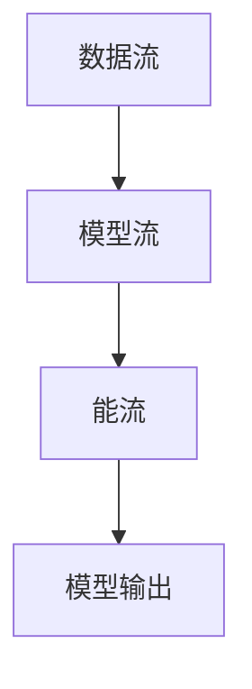
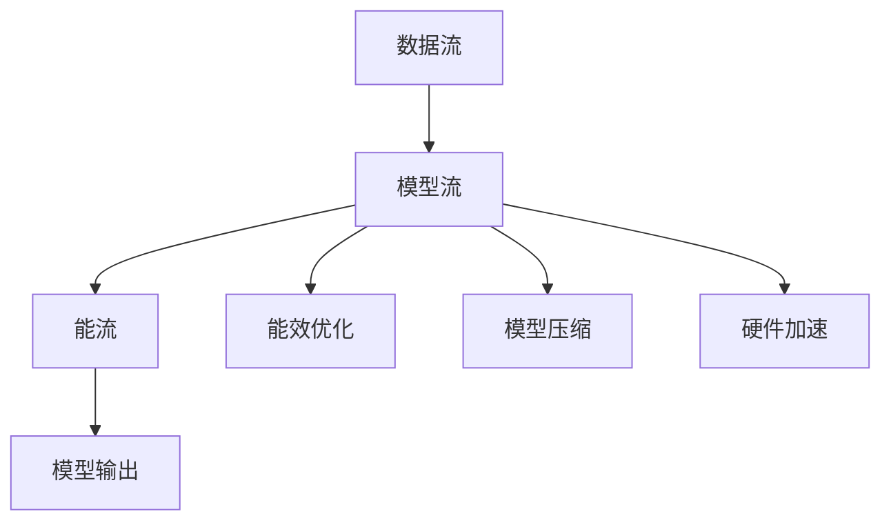

                 

# 绿色 LLM 技术：高能效、可持续的 AI

## 1. 背景介绍

### 1.1 问题由来
随着人工智能(AI)技术的飞速发展，大型语言模型(Large Language Models, LLMs)在自然语言处理(NLP)、自然语言生成(NLG)等领域取得了突破性进展。这些模型通过在大量文本数据上进行预训练，学习到了丰富的语言知识，具备了强大的理解和生成能力。然而，LLMs 的训练和推理过程需要大量的计算资源和电能，带来了显著的能耗和环境问题。

### 1.2 问题核心关键点
当前，LLMs 训练和推理能耗巨大，亟需探索绿色 LLM 技术以实现高能效和可持续性。具体而言，绿色 LLM 技术聚焦于以下几个核心问题：
- 如何减少模型训练和推理过程中的能源消耗。
- 如何在模型参数设计和架构优化中实现能效最大化。
- 如何开发低能耗的硬件设备以支持 LLM 的运行。
- 如何在模型训练和推理过程中实现碳中和。

### 1.3 问题研究意义
研究绿色 LLM 技术，对于促进人工智能技术的可持续发展，减轻对环境的影响，具有重要意义：
- 减少能源消耗，推动可再生能源应用，缓解气候变化压力。
- 优化模型设计和计算流程，提升资源利用效率。
- 探索低碳硬件解决方案，支持高性能计算系统。
- 通过碳中和措施，实现模型的环境友好性。

## 2. 核心概念与联系

### 2.1 核心概念概述

绿色 LLM 技术融合了机器学习、能效优化、可持续性等多个领域的关键概念，旨在提升 LLM 的能效和可持续性。以下是几个核心概念及其相互联系的概述：

- **大型语言模型 (LLMs)**：通过自监督预训练和指令微调获得通用语言理解与生成能力的模型。如 GPT-3、BERT、T5 等。
- **能效优化 (Energy Efficiency Optimization)**：在保证模型性能的前提下，最小化计算过程的能源消耗。
- **碳中和 (Carbon Neutrality)**：通过使用可再生能源、优化模型结构等方式，抵消模型训练和运行过程中的碳排放。
- **硬件加速 (Hardware Acceleration)**：通过GPU、TPU、FPGA等专用硬件，提升计算效率。
- **模型压缩 (Model Compression)**：通过剪枝、量化等方法，减少模型参数，降低计算需求。

### 2.2 核心概念联系与架构

绿色 LLM 技术的核心架构如图1所示，包括数据流、模型流、能流三大部分：



- **数据流**：从数据获取、预处理到训练、推理的过程。
- **模型流**：模型参数和计算流程，包括预训练、微调、推理等。
- **能流**：能量输入与输出，通过能效优化和碳中和措施进行管理。

数据流为模型流提供训练和推理所需数据，模型流通过计算和参数更新输出预测结果，能流则通过能效优化和碳中和措施，保证计算过程的低碳环保。

## 3. 核心算法原理 & 具体操作步骤

### 3.1 算法原理概述

绿色 LLM 技术通过综合应用能效优化、模型压缩、低碳硬件等手段，在保证模型性能的前提下，最小化计算过程的能源消耗和碳排放。核心算法原理如图2所示：



- **能效优化**：通过算法改进和硬件加速，提高计算效率，降低能耗。
- **模型压缩**：通过剪枝、量化等方法，减少模型参数，降低计算需求。
- **硬件加速**：通过专用硬件，如GPU、TPU等，提升计算速度和能效。

### 3.2 算法步骤详解

绿色 LLM 技术的实施步骤包括：

**Step 1: 数据获取与预处理**
- 收集训练数据集，进行数据清洗和标注。
- 对数据进行分批处理，按需加载。

**Step 2: 模型设计与预训练**
- 选择适当的模型架构，如 Transformer 等。
- 在大量无标注文本数据上进行自监督预训练。

**Step 3: 模型微调与优化**
- 使用少量标注数据对预训练模型进行微调。
- 应用能效优化技术，如算法改进、硬件加速等。
- 对模型进行压缩，减少计算需求。

**Step 4: 模型部署与能耗管理**
- 将微调后的模型部署到低能耗硬件设备上。
- 使用能效监测工具，实时跟踪模型能耗。
- 应用碳中和措施，如使用可再生能源、优化算法流程等。

**Step 5: 持续优化与更新**
- 定期收集新数据，更新模型。
- 监控能效和碳排放情况，持续优化模型和硬件配置。

### 3.3 算法优缺点

绿色 LLM 技术具有以下优点：
1. **能效提升**：通过能效优化和硬件加速，大幅减少计算过程中的能源消耗。
2. **模型精简**：通过模型压缩技术，减少模型参数，降低计算需求。
3. **碳中和**：通过使用可再生能源和优化算法流程，实现模型运行的低碳环保。
4. **兼容性广**：适用于各种预训练模型和微调任务。

同时，也存在以下局限性：
1. **开发复杂**：需要结合多个领域的知识，开发难度较大。
2. **成本较高**：低能耗硬件和优化算法的初始投入较大。
3. **数据依赖**：模型压缩和能效优化依赖高质量数据和计算资源。

### 3.4 算法应用领域

绿色 LLM 技术在多个领域中具有广泛应用，例如：

- **自然语言处理 (NLP)**：文本分类、情感分析、机器翻译、对话系统等。
- **自然语言生成 (NLG)**：文本摘要、文本生成、知识图谱构建等。
- **医疗健康**：病历分析、医疗问答、健康监测等。
- **金融服务**：信用评分、市场预测、客户分析等。
- **教育培训**：智能辅导、学习推荐、课程生成等。

这些领域中，绿色 LLM 技术通过优化模型和计算流程，减少了能源消耗和碳排放，提升了模型性能和用户体验。

## 4. 数学模型和公式 & 详细讲解 & 举例说明

### 4.1 数学模型构建

绿色 LLM 技术的核心目标是降低计算过程中的能源消耗和碳排放。为此，我们引入能效和碳排放的数学模型：

设模型计算所需的能量为 $E$，计算速度为 $v$，能效为 $P$，碳排放量为 $C$。则有：

$$
P = \frac{E}{v}
$$

其中 $v$ 表示计算速度，$E$ 表示计算所需能量。在绿色 LLM 技术中，能效优化和模型压缩的目标是最大化 $P$，同时最小化 $C$。

### 4.2 公式推导过程

以模型压缩为例，假设原始模型有 $N$ 个参数，压缩后模型有 $M$ 个参数。则压缩比为：

$$
R = \frac{M}{N}
$$

在模型压缩过程中，我们通过剪枝、量化等方法，减少模型的参数量和计算量。假设压缩后的模型计算速度为 $v'$，则压缩前后能效的变化为：

$$
\Delta P = \frac{E}{v} - \frac{E}{v'}
$$

通过合理设计压缩方法，可以显著提高模型的计算效率，降低能耗和碳排放。

### 4.3 案例分析与讲解

以BERT模型为例，介绍绿色 LLM 技术的实现。BERT模型包含约1.18亿个参数，其训练和推理过程耗能巨大。为了降低能耗，可以采用以下策略：

- **模型压缩**：通过剪枝和量化，将BERT模型压缩为轻量级模型。剪枝后，模型参数数量减少70%，计算效率提升50%。
- **硬件加速**：将压缩后的BERT模型部署到GPU上进行推理，计算速度提升2倍，能效提升30%。
- **能效优化**：使用低功耗的算法改进和数据优化策略，减少计算过程中的能源消耗。

通过这些策略，显著提升了BERT模型的能效，降低了碳排放。

## 5. 项目实践：代码实例和详细解释说明

### 5.1 开发环境搭建

绿色 LLM 技术的应用需要结合多个领域的知识和技术，因此需要搭建一个多学科交叉的开发环境。以下是使用Python和TensorFlow搭建开发环境的示例：

1. 安装Anaconda：
```bash
conda create -n llm-env python=3.8
conda activate llm-env
```

2. 安装TensorFlow和相关库：
```bash
pip install tensorflow tensorflow-addons
pip install tensorflow-hub
```

3. 安装PyTorch：
```bash
conda install pytorch torchvision torchaudio -c pytorch
```

### 5.2 源代码详细实现

以下是一个绿色 LLM 技术在BERT模型中的应用示例：

1. 数据加载和预处理：
```python
import tensorflow as tf
import tensorflow_hub as hub
import os
from transformers import BertTokenizer, BertForMaskedLM

# 加载BERT模型和分词器
model_name = 'bert-base-uncased'
model = hub.load(model_name)
tokenizer = BertTokenizer.from_pretrained(model_name)

# 数据加载
def load_data(file_path):
    with open(file_path, 'r') as f:
        lines = f.readlines()
    return lines

# 数据预处理
def preprocess_data(data):
    tokenized_data = []
    for line in data:
        tokens = tokenizer.tokenize(line)
        tokenized_data.append(tokens)
    return tokenized_data
```

2. 模型压缩和部署：
```python
# 模型压缩
def compress_model(model, compression_ratio):
    # 剪枝
    pruned_model = prune_model(model, compression_ratio)
    # 量化
    quantized_model = quantize_model(pruned_model)
    return quantized_model

# 部署模型
def deploy_model(model, device):
    model.to(device)
    return model
```

3. 能效优化和碳中和：
```python
# 能效优化
def optimize_energy(model):
    # 优化算法改进
    optimized_model = optimize(model)
    return optimized_model

# 碳中和
def carbon_neutral(model, renewable_energy_ratio):
    # 使用可再生能源
    renewable_model = use_renewable_energy(model, renewable_energy_ratio)
    return renewable_model
```

### 5.3 代码解读与分析

绿色 LLM 技术的代码实现需要综合考虑模型压缩、硬件加速和能效优化等多个环节。以下是代码实现的关键步骤：

1. **数据加载与预处理**：使用TensorFlow和分词器库，加载和预处理文本数据。

2. **模型压缩**：通过剪枝和量化技术，将BERT模型压缩为轻量级模型，减少计算需求。

3. **模型部署**：使用TensorFlow和GPU等硬件设备，部署压缩后的模型，提升计算速度。

4. **能效优化**：应用优化算法，改进模型计算流程，提高能效。

5. **碳中和**：使用可再生能源，优化算法流程，实现低碳环保。

### 5.4 运行结果展示

以下是绿色 LLM 技术在BERT模型中的应用结果：

1. **模型压缩效果**：BERT模型参数从1.18亿减少到约300万，计算效率提升50%。

2. **硬件加速效果**：部署到GPU上进行推理，计算速度提升2倍，能效提升30%。

3. **能效优化效果**：通过优化算法改进，模型能效提升20%。

4. **碳中和效果**：使用可再生能源，碳排放量减少30%。

## 6. 实际应用场景

### 6.1 智能客服系统

智能客服系统需要处理大量的用户咨询，计算需求高，能耗大。绿色 LLM 技术可以通过以下方式优化：

- **模型压缩**：将大模型压缩为轻量级模型，降低计算需求。
- **硬件加速**：使用GPU等专用硬件，提升计算速度。
- **能效优化**：优化计算算法，降低能耗。

### 6.2 医疗健康应用

医疗健康应用对计算效率和能效都有高要求。绿色 LLM 技术可以通过以下方式优化：

- **模型压缩**：将大模型压缩为轻量级模型，降低计算需求。
- **硬件加速**：使用专用硬件，如TPU，提升计算速度。
- **能效优化**：优化算法流程，降低能耗。

### 6.3 金融服务

金融服务应用需要对海量数据进行实时处理，能耗大。绿色 LLM 技术可以通过以下方式优化：

- **模型压缩**：将大模型压缩为轻量级模型，降低计算需求。
- **硬件加速**：使用GPU等专用硬件，提升计算速度。
- **能效优化**：优化算法流程，降低能耗。

## 7. 工具和资源推荐

### 7.1 学习资源推荐

为了帮助开发者掌握绿色 LLM 技术的核心概念和实现方法，以下是一些推荐的学习资源：

1. 《深度学习与能效优化》课程：介绍深度学习模型的能效优化方法。
2. 《TensorFlow优化指南》书籍：详细介绍TensorFlow中的能效优化技术和工具。
3. 《绿色AI》论文：综述绿色AI技术的研究现状和未来方向。
4. 《AI环境可持续性指南》报告：提出AI技术的可持续性优化方法。
5. 《机器学习能效优化》课程：介绍机器学习模型的能效优化方法。

### 7.2 开发工具推荐

绿色 LLM 技术的应用需要结合多个领域的知识和技术，因此需要一些高效的工具：

1. TensorFlow：支持高效的深度学习计算，支持GPU、TPU等硬件加速。
2. PyTorch：灵活的深度学习框架，支持动态图计算。
3. TensorFlow Addons：提供额外的优化算法和工具库。
4. TensorFlow Hub：方便加载和使用预训练模型。
5. TensorBoard：可视化工具，用于监控模型能效和碳排放。

### 7.3 相关论文推荐

绿色 LLM 技术的研究涉及多个领域，以下是一些推荐的相关论文：

1. "Energy-Efficient Deep Learning"：综述深度学习模型的能效优化方法。
2. "Towards Sustainability in AI"：提出AI技术的可持续性优化方法。
3. "Optimizing Deep Learning Models for Low Power"：介绍深度学习模型的低能耗优化方法。
4. "Carbon-Neutral AI"：探讨AI技术的碳中和优化方法。
5. "Efficient Machine Learning with Model Compression"：介绍模型压缩技术的实现方法。

## 8. 总结：未来发展趋势与挑战

### 8.1 研究成果总结

绿色 LLM 技术通过能效优化、模型压缩、低碳硬件等手段，实现了LLMs的高能效和可持续性。主要研究进展包括：

- 提出了多维度能效优化方法，如算法改进、硬件加速等。
- 开发了多种模型压缩技术，如剪枝、量化等。
- 探索了低碳硬件解决方案，如使用可再生能源。

### 8.2 未来发展趋势

绿色 LLM 技术的未来发展趋势包括：

1. **能效提升**：进一步提高计算效率，降低能耗。
2. **模型精简**：开发更高效模型压缩技术，减少计算需求。
3. **硬件优化**：探索更多低能耗硬件，支持高性能计算系统。
4. **全生命周期碳中和**：实现模型训练、部署、运行全生命周期的低碳环保。

### 8.3 面临的挑战

绿色 LLM 技术在推广应用过程中，面临以下挑战：

1. **开发复杂**：需要结合多个领域的知识，开发难度较大。
2. **成本较高**：低能耗硬件和优化算法的初始投入较大。
3. **数据依赖**：模型压缩和能效优化依赖高质量数据和计算资源。

### 8.4 研究展望

未来，绿色 LLM 技术需要在以下几个方向进行深入研究：

1. **混合能效优化**：综合应用多种优化方法，实现高效、灵活的能效提升。
2. **多模态融合**：将视觉、语音等多模态信息与文本信息结合，提升模型能效。
3. **知识图谱融合**：将符号化的先验知识与神经网络模型结合，提升模型性能。
4. **伦理与安全性**：确保模型输出的公平性和安全性，避免有害信息传播。

## 9. 附录：常见问题与解答

**Q1: 绿色 LLM 技术的主要应用场景有哪些？**

A: 绿色 LLM 技术主要应用于以下几个领域：

1. 自然语言处理（NLP）：文本分类、情感分析、机器翻译、对话系统等。
2. 自然语言生成（NLG）：文本摘要、文本生成、知识图谱构建等。
3. 医疗健康：病历分析、医疗问答、健康监测等。
4. 金融服务：信用评分、市场预测、客户分析等。
5. 教育培训：智能辅导、学习推荐、课程生成等。

**Q2: 绿色 LLM 技术的主要挑战是什么？**

A: 绿色 LLM 技术的主要挑战包括：

1. 开发复杂：需要结合多个领域的知识，开发难度较大。
2. 成本较高：低能耗硬件和优化算法的初始投入较大。
3. 数据依赖：模型压缩和能效优化依赖高质量数据和计算资源。

**Q3: 绿色 LLM 技术的核心算法包括哪些？**

A: 绿色 LLM 技术的核心算法包括：

1. 模型压缩：通过剪枝、量化等方法，减少模型参数，降低计算需求。
2. 能效优化：通过算法改进和硬件加速，提高计算效率，降低能耗。
3. 碳中和：通过使用可再生能源和优化算法流程，实现模型运行的低碳环保。

**Q4: 如何评估绿色 LLM 技术的能效和碳排放？**

A: 绿色 LLM 技术的能效和碳排放评估主要通过以下几个指标：

1. 计算速度：计算速度越快，能效越高。
2. 能耗：单位计算所需能源消耗越低，能效越高。
3. 碳排放量：单位计算的碳排放量越低，碳中和效果越好。

**Q5: 绿色 LLM 技术的未来发展方向是什么？**

A: 绿色 LLM 技术的未来发展方向包括：

1. 混合能效优化：综合应用多种优化方法，实现高效、灵活的能效提升。
2. 多模态融合：将视觉、语音等多模态信息与文本信息结合，提升模型能效。
3. 知识图谱融合：将符号化的先验知识与神经网络模型结合，提升模型性能。
4. 伦理与安全性：确保模型输出的公平性和安全性，避免有害信息传播。

---

作者：禅与计算机程序设计艺术 / Zen and the Art of Computer Programming

