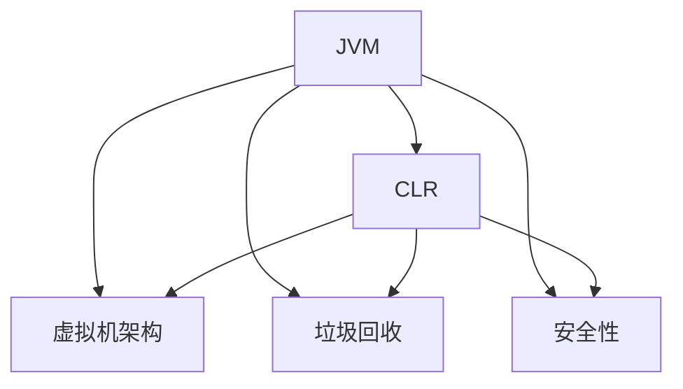

                 

# 编程语言虚拟机：JVM与CLR比较

## 1. 背景介绍

### 1.1 问题由来

在现代软件工程中，虚拟机（Virtual Machine, VM）已经成为了一种非常重要的技术。虚拟机允许不同平台上的应用程序通过模拟运行在相同的环境下，实现跨平台的功能。虚拟机技术的出现极大地提升了软件的安全性、可靠性和跨平台性。

在众多的虚拟机中，Java虚拟机（Java Virtual Machine, JVM）和微软的通用语言运行时（Common Language Runtime, CLR）是最为著名的两种。这两种虚拟机都提供了跨平台能力，并且在业界有着广泛的应用。那么，JVM与CLR之间有何区别？本文将对两者进行比较，并探讨它们在实际应用中的优势与劣势。

### 1.2 问题核心关键点

为了更好地理解JVM与CLR之间的区别，我们将重点关注以下关键点：

- **核心概念**：什么是JVM和CLR？它们是如何工作的？
- **架构比较**：JVM与CLR在架构上的不同之处是什么？
- **性能对比**：JVM和CLR在性能上的优劣？
- **应用场景**：JVM与CLR在不同场景下的适用性？
- **未来展望**：JVM和CLR的未来发展方向？

这些关键点将帮助我们全面了解JVM与CLR，并深入探讨它们的应用与未来趋势。

## 2. 核心概念与联系

### 2.1 核心概念概述

- **Java虚拟机（JVM）**：JVM是Java语言的运行环境。它将Java代码编译为字节码，并在JVM上运行。JVM提供了一系列的内存管理、垃圾回收、安全性等功能，使得Java代码能够跨平台运行。

- **通用语言运行时（CLR）**：CLR是微软开发的一种虚拟机，用于支持.NET平台的语言，如C#、VB.NET等。CLR同样支持跨平台运行，并且提供了.NET Framework中大量的库和类。

- **虚拟机架构**：虚拟机架构是一种将程序代码转换为中间代码，并在虚拟机上运行的技术。它通过模拟处理器、内存和输入输出等硬件，实现程序的可移植性和兼容性。

- **垃圾回收**：垃圾回收是虚拟机中的一个重要功能，它自动管理内存，释放不再使用的对象，避免内存泄漏。

- **安全性**：虚拟机通常提供了一系列的安全机制，如类型检查、权限控制等，保证程序的安全性和稳定性。

这些核心概念之间的联系可以通过以下Mermaid流程图来展示：



这个流程图展示了JVM与CLR的共同点和差异点。两者都采用了虚拟机架构，并且都提供了垃圾回收和安全性等重要功能，但具体实现上存在一些不同。

## 3. 核心算法原理 & 具体操作步骤
### 3.1 算法原理概述

JVM和CLR都采用了虚拟机架构，其核心原理是通过将程序代码转换为中间代码（如Java的字节码、.NET的字节码），并在虚拟机上运行。以下是JVM与CLR的算法原理概述：

- **JVM**：JVM首先将Java代码编译为字节码（.class文件），然后在JVM上运行。JVM通过解释器或即时编译器（Just-In-Time Compiler, JIT）将字节码转换为机器码。JVM还提供了内存管理、垃圾回收、安全性等功能。

- **CLR**：CLR首先将.NET代码编译为中间语言（IL），然后在CLR上运行。CLR通过即时编译器将IL转换为机器码。CLR还提供了.NET Framework中大量的库和类，支持各种.NET语言的运行。

### 3.2 算法步骤详解

JVM与CLR的运行步骤大致相同，主要包括以下几个步骤：

1. **加载和验证**：加载代码并将其验证，确保其符合JVM或CLR的要求。

2. **字节码解释或编译**：将字节码解释为机器码，或者直接编译为机器码。

3. **执行**：执行转换后的机器码，完成程序的功能。

4. **垃圾回收**：自动管理内存，释放不再使用的对象，避免内存泄漏。

5. **类型检查**：在运行时进行类型检查，确保程序的类型安全。

### 3.3 算法优缺点

JVM与CLR在算法上各有优缺点：

- **JVM的优点**：
  - **跨平台性好**：JVM的跨平台性非常好，几乎支持所有的操作系统和硬件平台。
  - **性能优秀**：JVM的JIT编译器可以在运行时优化代码，提供高性能的执行。
  - **丰富的开源生态**：JVM拥有丰富的开源库和工具，如Spring、Hibernate等。

- **JVM的缺点**：
  - **启动时间长**：由于JVM需要启动JIT编译器，因此启动时间较长。
  - **资源占用高**：JVM在内存和CPU等资源占用方面相对较高。

- **CLR的优点**：
  - **性能优秀**：CLR的JIT编译器同样可以在运行时优化代码，提供高性能的执行。
  - **开发体验好**：CLR提供了.NET Framework中大量的库和类，开发体验非常好。
  - **安全性高**：CLR提供了严格的安全性检查，避免了许多潜在的漏洞。

- **CLR的缺点**：
  - **跨平台性差**：CLR主要支持Windows平台，跨平台性较差。
  - **生态相对封闭**：CLR的生态相对封闭，不支持其他平台的开发。

### 3.4 算法应用领域

JVM与CLR在应用领域上也有所不同：

- **JVM的应用领域**：
  - **企业级应用**：JVM广泛应用于企业级应用中，如Web应用、数据库、大数据等。
  - **移动应用**：Android应用也使用了JVM。
  - **科学计算**：JVM在科学计算中也有广泛的应用。

- **CLR的应用领域**：
  - **企业级应用**：CLR主要应用于企业级应用中，如Windows Server、ASP.NET等。
  - **桌面应用**：Windows桌面应用也广泛使用CLR。
  - **游戏开发**：Xbox游戏也使用了CLR。

## 4. 数学模型和公式 & 详细讲解 & 举例说明

### 4.1 数学模型构建

JVM与CLR的数学模型构建涉及内存管理和垃圾回收等关键技术。以下是对这两个方面进行详细的数学建模：

- **内存管理**：内存管理是虚拟机中非常重要的部分。它涉及内存分配、垃圾回收等操作。JVM和CLR都使用了垃圾回收机制来管理内存。

- **垃圾回收**：垃圾回收是自动管理内存的过程，它分为标记-清除（Mark-Sweep）、引用计数（Reference Counting）和复制（Copying）等算法。

### 4.2 公式推导过程

以下是垃圾回收的Mark-Sweep算法的公式推导过程：

$$
\text{Mark-Sweep Algorithm}:
\begin{cases}
\text{标记：从根对象开始，遍历所有可达对象，标记为已使用} \\
\text{清除：遍历所有未标记的对象，释放内存}
\end{cases}
$$

### 4.3 案例分析与讲解

以JVM的垃圾回收为例，分析其工作原理和性能优化：

- **工作原理**：JVM的垃圾回收过程分为标记、清除、压缩等步骤。首先标记所有可达对象，然后将未标记的对象清除，最后对内存进行压缩，提高内存利用率。

- **性能优化**：为了提高垃圾回收的效率，JVM提供了GC（Garbage Collection）调优工具，如GC日志分析、GC监控等。

## 5. 项目实践：代码实例和详细解释说明
### 5.1 开发环境搭建

为了进行JVM与CLR的比较，我们需要搭建相应的开发环境。以下是在Linux系统上搭建JVM和CLR的开发环境的步骤：

1. **安装JDK**：
   ```
   sudo apt-get update
   sudo apt-get install default-jdk
   ```

2. **安装.NET Framework**：
   ```
   sudo apt-get install dotnet-sdk-5.0
   ```

### 5.2 源代码详细实现

JVM与CLR的实现涉及多个方面，以下给出两个简单的Java程序和.NET程序，并解释其运行原理：

- **Java程序**：
  ```java
  public class HelloWorld {
      public static void main(String[] args) {
          System.out.println("Hello, World!");
      }
  }
  ```

  **运行原理**：JVM首先将Java程序编译为字节码，然后在JVM上运行。JVM解释器将字节码转换为机器码，并执行代码。

- **.NET程序**：
  ```csharp
  using System;

  class HelloWorld {
      static void Main() {
          Console.WriteLine("Hello, World!");
      }
  }
  ```

  **运行原理**：CLR首先将.NET程序编译为中间语言（IL），然后在CLR上运行。CLR的JIT编译器将IL转换为机器码，并执行代码。

### 5.3 代码解读与分析

通过上述代码，我们可以看到JVM与CLR的运行机制大致相同。但是，JVM通过JIT编译器在运行时进行优化，CLR则是在编译时进行优化。这种差异导致了两者在性能和开发体验上的不同。

## 6. 实际应用场景

### 6.1 企业级应用

JVM与CLR在企业级应用中都有广泛的应用。JVM广泛应用于Web应用、数据库、大数据等领域，而CLR则主要应用于Windows Server、ASP.NET等企业级应用中。

### 6.2 移动应用

JVM也应用于移动应用中，如Android应用。CLR主要应用于Windows平台，因此在移动应用中的应用较少。

### 6.3 科学计算

JVM在科学计算中也有广泛的应用。CLR的性能和开发体验也很好，但在科学计算中的应用较少。

### 6.4 未来应用展望

随着技术的不断进步，JVM与CLR都在不断发展，未来将有以下趋势：

- **JVM的未来趋势**：
  - **高性能编译器**：JVM的JIT编译器将不断优化，提高性能。
  - **更好的跨平台支持**：JVM将在更多的平台上运行，如Raspberry Pi等。
  - **增强的安全性**：JVM将增强安全性，提供更强的加密和保护机制。

- **CLR的未来趋势**：
  - **性能优化**：CLR将继续优化JIT编译器，提高性能。
  - **跨平台支持**：CLR将在更多的平台上运行，如Linux等。
  - **增强的开发体验**：CLR将提供更好的开发体验和更多的库支持。

## 7. 工具和资源推荐
### 7.1 学习资源推荐

为了更好地理解JVM与CLR，以下是一些推荐的学习资源：

1. **《深入理解Java虚拟机》**：深入讲解JVM的工作原理和优化技巧。

2. **《CLR内幕》**：深入讲解CLR的内部实现和优化技巧。

3. **《Java并发编程》**：讲解Java并发编程和JVM的内存管理。

4. **《.NET高级编程》**：讲解.NET的高级编程和CLR的内部实现。

5. **《Java虚拟机性能调优》**：讲解JVM性能调优的常用技巧和方法。

### 7.2 开发工具推荐

JVM与CLR的开发工具也非常丰富，以下是一些推荐的工具：

1. **IntelliJ IDEA**：Java开发中常用的IDE，支持JVM和CLR。

2. **Visual Studio**：.NET开发中常用的IDE，支持CLR。

3. **Eclipse**：Java开发中常用的IDE，支持JVM。

4. **Visual Studio Code**：跨平台开发工具，支持Java和.NET开发。

### 7.3 相关论文推荐

为了更好地了解JVM与CLR的最新研究进展，以下是一些推荐的相关论文：

1. **《Java虚拟机性能优化》**：介绍JVM性能优化的常用方法和技巧。

2. **《.NET虚拟机性能优化》**：介绍CLR性能优化的常用方法和技巧。

3. **《JVM与CLR的对比分析》**：对JVM与CLR进行详细的对比分析。

4. **《虚拟机架构设计与实现》**：介绍虚拟机架构的设计和实现。

5. **《垃圾回收算法研究》**：介绍垃圾回收算法的原理和实现。

## 8. 总结：未来发展趋势与挑战
### 8.1 研究成果总结

本文系统介绍了JVM与CLR的工作原理、核心算法、具体操作步骤和实际应用场景。通过比较两者，我们了解了它们各自的优缺点和应用领域。未来，JVM与CLR将在各自的领域中继续发展，为软件工程和跨平台应用提供更多的选择和优化空间。

### 8.2 未来发展趋势

JVM与CLR的未来发展趋势如下：

- **JVM**：
  - **性能优化**：JVM将继续优化JIT编译器，提高性能。
  - **跨平台支持**：JVM将在更多的平台上运行，如Raspberry Pi等。
  - **安全性**：JVM将增强安全性，提供更强的加密和保护机制。

- **CLR**：
  - **性能优化**：CLR将继续优化JIT编译器，提高性能。
  - **跨平台支持**：CLR将在更多的平台上运行，如Linux等。
  - **开发体验**：CLR将提供更好的开发体验和更多的库支持。

### 8.3 面临的挑战

JVM与CLR在未来的发展中仍然面临一些挑战：

- **JVM**：
  - **性能瓶颈**：JVM的启动时间较长，需要进一步优化。
  - **内存占用**：JVM在内存和CPU等资源占用方面相对较高，需要优化。

- **CLR**：
  - **跨平台性**：CLR主要支持Windows平台，跨平台性较差。
  - **生态相对封闭**：CLR的生态相对封闭，不支持其他平台的开发。

### 8.4 研究展望

未来，JVM与CLR需要在以下方面进行深入研究：

- **性能优化**：进一步优化JIT编译器，提高性能。
- **跨平台支持**：在更多的平台上运行，如Raspberry Pi等。
- **安全性**：增强安全性，提供更强的加密和保护机制。
- **开发体验**：提供更好的开发体验和更多的库支持。

## 9. 附录：常见问题与解答

**Q1：JVM与CLR在性能上有何区别？**

A：JVM和CLR在性能上有一定的区别。JVM通过JIT编译器在运行时进行优化，性能表现较好。CLR则是在编译时进行优化，性能也非常好。但是，JVM在启动时间较长，CLR在跨平台支持方面较差。

**Q2：JVM与CLR的安全性有何不同？**

A：JVM和CLR都提供了安全性机制，如类型检查、权限控制等。但是，JVM的安全性检查更加严格，能够更好地保护程序的安全性。

**Q3：JVM与CLR在开发体验上有何不同？**

A：JVM和CLR在开发体验上有所不同。JVM拥有丰富的开源库和工具，如Spring、Hibernate等。CLR则提供了.NET Framework中大量的库和类，开发体验非常好。

**Q4：JVM与CLR在跨平台支持上有何不同？**

A：JVM的跨平台性非常好，几乎支持所有的操作系统和硬件平台。CLR主要支持Windows平台，跨平台性较差。

**Q5：JVM与CLR的未来发展趋势是什么？**

A：JVM与CLR的未来发展趋势如下：
- **JVM**：
  - **性能优化**：JVM将继续优化JIT编译器，提高性能。
  - **跨平台支持**：JVM将在更多的平台上运行，如Raspberry Pi等。
  - **安全性**：JVM将增强安全性，提供更强的加密和保护机制。
  
- **CLR**：
  - **性能优化**：CLR将继续优化JIT编译器，提高性能。
  - **跨平台支持**：CLR将在更多的平台上运行，如Linux等。
  - **开发体验**：CLR将提供更好的开发体验和更多的库支持。

总之，JVM与CLR都是优秀的虚拟机技术，它们在各自的领域中都有着广泛的应用。未来，两者将继续发展，为软件工程和跨平台应用提供更多的选择和优化空间。

