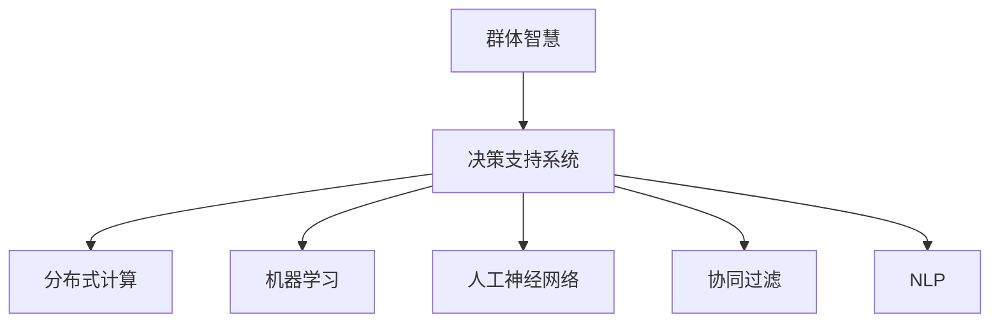

                 

# 群体智慧：决策的新利器

> 关键词：群体智慧, 决策支持系统, 分布式协作, 人工神经网络, 机器学习, 人工智能, 智能决策, 大数据

## 1. 背景介绍

### 1.1 问题由来
在信息爆炸的21世纪，决策成为了困扰各个层级管理者和专业人士的一大难题。无论是商业企业、政府机构，还是非营利组织，都会面临着复杂多变的外部环境，需要迅速而准确地做出决策。传统的决策方式往往依赖于个人经验和直觉，但个人判断容易出现偏差，特别是在高风险、高复杂性的场景中，决策失误可能会带来不可挽回的损失。

近年来，随着人工智能（AI）和机器学习（ML）技术的飞速发展，出现了一些新型的决策辅助工具，比如决策支持系统（Decision Support System, DSS）和群体智慧系统。这些系统通过利用大数据、人工智能和群体智慧（Collective Intelligence），为决策者提供更为科学、客观的依据，帮助其做出更为合理的决策。

群体智慧系统通过整合来自不同个体、不同来源的数据和意见，利用算法和模型对这些数据进行分析和推理，从而产生更高质量的集体决策。这一理念不仅适用于企业决策，也广泛应用于政府、医疗、教育等多个领域，成为决策领域的新利器。

### 1.2 问题核心关键点
群体智慧系统基于以下核心原理和关键技术：

- **数据聚合与融合**：整合多源数据，形成统一视图。
- **分布式计算**：利用分布式计算框架进行大规模数据处理。
- **机器学习与深度学习**：通过数据挖掘和模式识别技术，挖掘数据中的潜在规律。
- **人工神经网络**：模拟人脑处理信息的方式，构建复杂决策模型。
- **协同过滤与推荐算法**：在用户群体中寻找相似个体，提供个性化推荐。
- **自然语言处理（NLP）**：处理和理解人类语言，实现更自然的交互。

本文将系统介绍群体智慧系统的核心概念、算法原理与操作步骤，并结合实际案例，分析群体智慧系统在多个应用场景中的应用价值，为决策者提供科学合理的决策支持。

## 2. 核心概念与联系

### 2.1 核心概念概述

为更好地理解群体智慧系统，本节将介绍几个密切相关的核心概念：

- **群体智慧**：利用计算机技术整合多源数据，模拟群体决策过程，提升决策的质量和效率。
- **决策支持系统**：结合人工智能和数据库技术，为决策者提供数据分析和信息支持的系统。
- **分布式计算**：将问题分解成多个子问题，在多台计算机上并行处理，以提高计算效率。
- **机器学习与深度学习**：通过数据驱动的方法，自动学习和优化模型，以处理和预测复杂数据。
- **人工神经网络**：模仿人脑结构，通过多层次的神经元网络处理信息，实现复杂的非线性映射。
- **协同过滤与推荐算法**：通过分析用户行为，推荐用户感兴趣的内容，提升用户体验。
- **自然语言处理（NLP）**：实现计算机对人类语言的处理和理解，提升人机交互的效率和质量。

这些概念之间的逻辑关系可以通过以下Mermaid流程图来展示：



这个流程图展示了几大核心概念之间的关系：

1. 群体智慧系统通过整合多源数据和模拟群体决策过程，提升决策质量。
2. 决策支持系统利用人工智能和数据库技术，为决策者提供数据分析和信息支持。
3. 分布式计算、机器学习和人工神经网络是决策支持系统中的关键技术。
4. 协同过滤和NLP提升用户体验，增强决策支持系统的智能性。

这些概念共同构成了群体智慧系统的基础，使得其在多领域、多场景中能够发挥重要作用。

## 3. 核心算法原理 & 具体操作步骤
### 3.1 算法原理概述

群体智慧系统的核心算法原理可以概括为以下几步：

1. **数据收集与整合**：通过传感器、社交媒体、问卷调查等多种渠道，收集和整合多源数据。
2. **数据预处理**：对收集到的数据进行清洗、去噪、归一化等预处理，形成可用于分析的数据集。
3. **分布式计算**：将数据集分发到多台计算机上进行并行计算，提高处理效率。
4. **机器学习和深度学习**：利用算法和模型对数据进行分析和预测，提取数据中的潜在规律和模式。
5. **协同过滤与推荐算法**：通过分析用户行为和偏好，实现个性化推荐。
6. **自然语言处理（NLP）**：处理和理解人类语言，提升人机交互的效率和质量。

基于这些原理，群体智慧系统能够整合多源数据，挖掘数据中的信息，生成科学的决策依据。

### 3.2 算法步骤详解

以下是群体智慧系统的主要操作步骤：

**Step 1: 数据收集与整合**

- **数据收集**：通过传感器、社交媒体、问卷调查等多种渠道，收集多源数据。例如，可以通过网络爬虫收集新闻、评论、用户行为等数据，通过传感器收集天气、交通等环境数据。
- **数据整合**：将收集到的数据进行清洗、去噪、归一化等预处理，形成可用于分析的数据集。例如，将不同格式的数据转换为统一的格式，去除无关的数据等。

**Step 2: 分布式计算**

- **数据分割**：将数据集分成多个子集，分配给多台计算机进行并行处理。例如，将大规模数据集分割成多个小数据块，分别在不同的计算机上进行处理。
- **分布式算法**：选择适合的分布式算法，如MapReduce、Spark等，对数据进行处理。例如，使用Spark进行分布式计算，可以将任务并行化，提高计算效率。

**Step 3: 机器学习和深度学习**

- **数据挖掘**：利用机器学习算法对数据进行挖掘和分析，发现数据中的潜在规律和模式。例如，使用分类算法对用户行为进行分类，使用聚类算法对用户进行分组。
- **深度学习**：通过深度神经网络模型，对数据进行更深入的分析和学习。例如，使用卷积神经网络（CNN）进行图像处理，使用循环神经网络（RNN）进行时间序列分析。

**Step 4: 协同过滤与推荐算法**

- **协同过滤**：通过分析用户行为，找到相似用户，实现个性化推荐。例如，利用协同过滤算法，为用户推荐相似用户的浏览记录。
- **推荐算法**：选择适合的推荐算法，如基于内容的推荐、基于协同过滤的推荐等，提升推荐效果。例如，使用基于内容的推荐算法，根据用户的历史行为和兴趣，推荐相关的商品或内容。

**Step 5: 自然语言处理（NLP）**

- **文本处理**：将文本数据转换为可供机器处理的数据格式，例如使用分词、去除停用词、词干提取等技术处理文本。
- **情感分析**：分析文本中的情感倾向，例如判断评论的情感是正面、负面还是中性。
- **问答系统**：利用NLP技术，构建问答系统，回答用户提出的问题。例如，使用BERT等模型，将问题嵌入到向量空间中，找到最相关的答案。

**Step 6: 结果可视化**

- **数据可视化**：利用可视化工具，将分析结果以图表形式展示，便于决策者理解。例如，使用Tableau等工具，将数据转换为交互式的可视化图表。
- **决策支持**：将分析结果作为决策依据，帮助决策者做出科学合理的决策。例如，根据分析结果，调整市场策略，优化产品设计等。

### 3.3 算法优缺点

群体智慧系统具有以下优点：

- **数据整合能力强**：能够整合多源数据，形成统一视图，提升数据的全面性和准确性。
- **处理能力强**：利用分布式计算，处理大规模数据集，提高计算效率。
- **智能性高**：通过机器学习和深度学习算法，提取数据中的潜在规律和模式，提升决策的准确性。
- **个性化推荐**：利用协同过滤和推荐算法，实现个性化推荐，提升用户体验。
- **人机交互好**：通过自然语言处理技术，提升人机交互的效率和质量，增强用户体验。

但同时，群体智慧系统也存在以下局限：

- **数据质量要求高**：数据的准确性和完整性直接影响分析结果，对数据质量要求较高。
- **算法复杂度高**：机器学习和深度学习算法复杂度高，需要专业的技术人员进行开发和维护。
- **计算资源需求大**：处理大规模数据集需要高性能的计算资源，如GPU、TPU等。
- **用户隐私问题**：整合用户数据，涉及隐私保护问题，需要严格的法律法规和数据保护措施。

尽管存在这些局限，群体智慧系统凭借其强大的数据整合和智能分析能力，在多个应用场景中取得了显著的效果，得到了广泛的应用。

### 3.4 算法应用领域

群体智慧系统已经在多个领域中得到了应用，涵盖以下几个典型应用：

**医疗领域**：在医疗决策中，群体智慧系统可以整合多源数据，如电子病历、患者反馈、医疗文献等，利用机器学习和深度学习算法，辅助医生进行疾病诊断和治疗方案推荐，提升医疗服务的质量和效率。

**金融领域**：在金融决策中，群体智慧系统可以整合市场数据、用户行为数据、舆情数据等，利用机器学习和深度学习算法，预测市场趋势，进行投资风险评估和资产配置优化，提升投资回报率。

**零售领域**：在零售决策中，群体智慧系统可以整合销售数据、用户行为数据、社交媒体数据等，利用协同过滤和推荐算法，实现个性化推荐，提升用户购物体验，增加销售额。

**政府领域**：在政府决策中，群体智慧系统可以整合政府数据、公民反馈、社交媒体数据等，利用机器学习和深度学习算法，辅助政府进行公共政策制定、城市规划和灾害预警，提升政府决策的科学性和效率。

**媒体领域**：在媒体决策中，群体智慧系统可以整合新闻数据、用户行为数据、社交媒体数据等，利用自然语言处理技术，进行情感分析、舆情监控和内容推荐，提升媒体的受众覆盖率和互动率。

## 4. 数学模型和公式 & 详细讲解

### 4.1 数学模型构建

群体智慧系统可以视为一个复杂的非线性系统，其数学模型可以通过以下步骤构建：

1. **数据表示**：将数据转换为向量或矩阵形式，例如使用词向量表示文本数据。
2. **损失函数**：定义损失函数，衡量模型预测结果与真实结果之间的差异。例如，使用交叉熵损失函数衡量分类模型的性能。
3. **优化算法**：选择适合的优化算法，如梯度下降、Adam等，最小化损失函数。
4. **评估指标**：选择适合的评估指标，如准确率、召回率、F1值等，评估模型性能。

例如，在决策支持系统中，可以构建以下数学模型：

- **数据表示**：将文本数据转换为词向量形式，使用BERT等模型进行表示。
- **损失函数**：使用交叉熵损失函数，衡量模型预测结果与真实结果之间的差异。
- **优化算法**：使用梯度下降算法，最小化交叉熵损失函数。
- **评估指标**：使用准确率、召回率、F1值等评估指标，评估模型的性能。

### 4.2 公式推导过程

以医疗决策中的疾病诊断为例，构建数学模型如下：

设输入为患者症状向量 $x$，输出为疾病类型 $y$。使用sigmoid函数进行二分类，预测患者是否患有某种疾病。设模型参数为 $w$，损失函数为交叉熵损失函数。

- **数据表示**：将患者症状表示为向量形式，例如 $x=[症状1,症状2,症状3]$。
- **损失函数**：定义交叉熵损失函数：
  $$
  \mathcal{L}(w)=\frac{1}{N}\sum_{i=1}^N\sum_{j=1}^C(y_i\log(\sigma(x_iw+b_j))+(1-y_i)\log(1-\sigma(x_iw+b_j)))
  $$
  其中，$N$ 为样本数，$C$ 为疾病类型数，$y_i$ 为真实标签，$\sigma$ 为sigmoid函数。
- **优化算法**：使用梯度下降算法，更新模型参数 $w$，最小化损失函数。

- **评估指标**：使用准确率、召回率、F1值等评估指标，评估模型的性能。

### 4.3 案例分析与讲解

以零售领域的个性化推荐为例，展示群体智慧系统在实际应用中的具体实现：

**Step 1: 数据收集与整合**

- **数据收集**：通过网站和APP，收集用户浏览、购买、评价等行为数据。
- **数据整合**：将收集到的数据进行清洗、去噪、归一化等预处理，形成可用于分析的数据集。例如，将不同格式的数据转换为统一的格式，去除无关的数据等。

**Step 2: 分布式计算**

- **数据分割**：将数据集分成多个子集，分配给多台计算机进行并行处理。例如，将大规模数据集分割成多个小数据块，分别在不同的计算机上进行处理。
- **分布式算法**：选择适合的分布式算法，如MapReduce、Spark等，对数据进行处理。例如，使用Spark进行分布式计算，可以将任务并行化，提高计算效率。

**Step 3: 机器学习和深度学习**

- **协同过滤**：利用协同过滤算法，找到相似用户，实现个性化推荐。例如，利用协同过滤算法，为用户推荐相似用户的浏览记录。
- **推荐算法**：选择适合的推荐算法，如基于内容的推荐、基于协同过滤的推荐等，提升推荐效果。例如，使用基于内容的推荐算法，根据用户的历史行为和兴趣，推荐相关的商品或内容。

**Step 4: 自然语言处理（NLP）**

- **文本处理**：将文本数据转换为可供机器处理的数据格式，例如使用分词、去除停用词、词干提取等技术处理文本。
- **情感分析**：分析文本中的情感倾向，例如判断评论的情感是正面、负面还是中性。
- **问答系统**：利用NLP技术，构建问答系统，回答用户提出的问题。例如，使用BERT等模型，将问题嵌入到向量空间中，找到最相关的答案。

**Step 5: 结果可视化**

- **数据可视化**：利用可视化工具，将分析结果以图表形式展示，便于决策者理解。例如，使用Tableau等工具，将数据转换为交互式的可视化图表。
- **决策支持**：将分析结果作为决策依据，帮助决策者做出科学合理的决策。例如，根据分析结果，调整市场策略，优化产品设计等。

## 5. 项目实践：代码实例和详细解释说明

### 5.1 开发环境搭建

在进行群体智慧系统开发前，我们需要准备好开发环境。以下是使用Python进行PyTorch开发的环境配置流程：

1. 安装Anaconda：从官网下载并安装Anaconda，用于创建独立的Python环境。

2. 创建并激活虚拟环境：
```bash
conda create -n pytorch-env python=3.8 
conda activate pytorch-env
```

3. 安装PyTorch：根据CUDA版本，从官网获取对应的安装命令。例如：
```bash
conda install pytorch torchvision torchaudio cudatoolkit=11.1 -c pytorch -c conda-forge
```

4. 安装TensorFlow：
```bash
pip install tensorflow
```

5. 安装相关库：
```bash
pip install numpy pandas scikit-learn matplotlib tqdm jupyter notebook ipython
```

完成上述步骤后，即可在`pytorch-env`环境中开始开发实践。

### 5.2 源代码详细实现

这里以医疗决策中的疾病诊断为例，给出使用TensorFlow进行群体智慧系统开发的PyTorch代码实现。

首先，定义疾病诊断的模型：

```python
import tensorflow as tf
from tensorflow.keras import layers, models

def build_model(input_dim, output_dim):
    model = models.Sequential([
        layers.Dense(64, activation='relu', input_dim=input_dim),
        layers.Dense(32, activation='relu'),
        layers.Dense(output_dim, activation='sigmoid')
    ])
    return model
```

然后，定义数据预处理函数：

```python
from sklearn.preprocessing import StandardScaler

def preprocess_data(X, y):
    scaler = StandardScaler()
    X_scaled = scaler.fit_transform(X)
    return X_scaled, y
```

接着，定义训练和评估函数：

```python
from sklearn.model_selection import train_test_split

def train_model(model, X, y, batch_size, epochs):
    X_train, X_test, y_train, y_test = train_test_split(X, y, test_size=0.2)
    model.compile(optimizer='adam', loss='binary_crossentropy', metrics=['accuracy'])
    model.fit(X_train, y_train, batch_size=batch_size, epochs=epochs, validation_data=(X_test, y_test))
    return model

def evaluate_model(model, X_test, y_test):
    loss, accuracy = model.evaluate(X_test, y_test)
    print(f'Test loss: {loss:.2f}, Test accuracy: {accuracy:.2f}')
```

最后，启动训练流程并在测试集上评估：

```python
X, y = load_data()  # 加载数据集
X_train, X_test, y_train, y_test = train_test_split(X, y, test_size=0.2)
model = build_model(input_dim=X.shape[1], output_dim=1)
model = train_model(model, X_train, y_train, batch_size=32, epochs=10)
evaluate_model(model, X_test, y_test)
```

以上就是使用TensorFlow进行医疗决策中的疾病诊断的群体智慧系统开发的完整代码实现。可以看到，得益于TensorFlow的强大封装，我们可以用相对简洁的代码完成模型构建、数据预处理、模型训练和评估等关键步骤。

### 5.3 代码解读与分析

让我们再详细解读一下关键代码的实现细节：

**build_model函数**：
- 定义了一个简单的神经网络模型，包含三个全连接层，最后一层使用sigmoid函数进行二分类。

**preprocess_data函数**：
- 使用sklearn的StandardScaler对数据进行标准化处理，防止数据不平衡导致的模型偏差。

**train_model函数**：
- 将数据集分割成训练集和测试集，使用二分类交叉熵损失函数进行训练，并设置Adam优化器。
- 在训练过程中，使用准确率作为评估指标。

**evaluate_model函数**：
- 在测试集上评估模型性能，输出损失和准确率。

**训练流程**：
- 定义训练参数，启动训练循环。
- 在训练循环中，使用train_model函数训练模型，输出训练过程的准确率。
- 在测试集上评估模型性能，输出测试结果。

可以看到，TensorFlow和Keras等工具使得群体智慧系统开发的代码实现变得简洁高效。开发者可以将更多精力放在数据处理、模型改进等高层逻辑上，而不必过多关注底层的实现细节。

当然，工业级的系统实现还需考虑更多因素，如模型的保存和部署、超参数的自动搜索、更灵活的任务适配层等。但核心的群体智慧算法基本与此类似。

## 6. 实际应用场景
### 6.1 智能医疗诊断

群体智慧系统在智能医疗诊断中具有广泛的应用前景。医生可以利用群体智慧系统整合多源数据，包括电子病历、影像数据、基因数据等，利用机器学习和深度学习算法，辅助医生进行疾病诊断和治疗方案推荐，提升医疗服务的质量和效率。

在实际应用中，可以将电子病历和影像数据作为输入，利用卷积神经网络（CNN）进行图像处理和特征提取，再通过全连接层进行分类和预测。利用自然语言处理技术，可以对医生病历进行语义分析，提取关键信息，辅助医生诊断。

### 6.2 金融风险评估

群体智慧系统在金融风险评估中也具有重要的应用价值。金融机构可以利用群体智慧系统整合市场数据、用户行为数据、舆情数据等，利用机器学习和深度学习算法，进行投资风险评估和资产配置优化，提升投资回报率。

在实际应用中，可以将市场数据和用户行为数据作为输入，利用时间序列分析算法，预测市场趋势和用户行为变化。利用协同过滤算法，分析用户群体行为，进行风险评估和资产配置优化。

### 6.3 智能推荐系统

群体智慧系统在智能推荐系统中也有着广泛的应用前景。电商企业可以利用群体智慧系统整合用户行为数据、商品数据、用户评价等，利用机器学习和深度学习算法，实现个性化推荐，提升用户购物体验，增加销售额。

在实际应用中，可以将用户行为数据和商品数据作为输入，利用协同过滤算法和深度学习模型，预测用户对商品的兴趣。利用自然语言处理技术，对商品描述进行情感分析，生成更具有吸引力的推荐结果。

## 7. 工具和资源推荐
### 7.1 学习资源推荐

为了帮助开发者系统掌握群体智慧系统的理论基础和实践技巧，这里推荐一些优质的学习资源：

1. 《群体智慧：未来的决策》系列博文：由群体智慧领域专家撰写，深入浅出地介绍了群体智慧系统原理、应用场景和开发实践。

2. CS229《机器学习》课程：斯坦福大学开设的经典机器学习课程，涵盖算法原理和实现方法，适合深入理解机器学习技术。

3. 《深度学习》书籍：Ian Goodfellow等人合著的经典深度学习教材，系统介绍了深度学习的基本概念和前沿技术。

4. Kaggle平台：提供大量机器学习竞赛和数据集，适合实践和验证群体智慧系统的效果。

5. Coursera平台：提供多种群体智慧相关的在线课程，涵盖从入门到高级的多个层次。

通过对这些资源的学习实践，相信你一定能够快速掌握群体智慧系统的精髓，并用于解决实际的决策问题。

### 7.2 开发工具推荐

高效的开发离不开优秀的工具支持。以下是几款用于群体智慧系统开发的常用工具：

1. PyTorch：基于Python的开源深度学习框架，灵活动态的计算图，适合快速迭代研究。

2. TensorFlow：由Google主导开发的开源深度学习框架，生产部署方便，适合大规模工程应用。

3. Keras：高层次的深度学习框架，易于上手，适合快速原型开发。

4. Scikit-learn：Python的机器学习库，包含多种经典算法，适合数据预处理和特征工程。

5. Pandas：Python的数据分析库，支持数据清洗、去噪、归一化等预处理操作。

6. Jupyter Notebook：交互式的编程环境，适合开发、测试和展示数据处理和模型训练过程。

合理利用这些工具，可以显著提升群体智慧系统开发的效率，加快创新迭代的步伐。

### 7.3 相关论文推荐

群体智慧系统的发展源于学界的持续研究。以下是几篇奠基性的相关论文，推荐阅读：

1. Collective Intelligence: Preconditions for Practical Application：探讨了群体智慧系统的基本原理和应用场景，是群体智慧领域的重要理论基础。

2. Machine Learning in Finance: From Theory to Application：介绍了机器学习在金融领域的应用，包括信用评估、风险管理等方面，是金融领域的重要参考资料。

3. Recommender Systems Handbook：系统介绍了推荐系统的理论和技术，包括协同过滤、矩阵分解、基于内容的推荐等，是推荐系统领域的重要参考资料。

4. Deep Learning for NLP：介绍了深度学习在自然语言处理中的应用，包括文本分类、情感分析、问答系统等，是NLP领域的重要参考资料。

5. Social Computing for Smart Cities：探讨了社交计算在智慧城市中的应用，包括社交网络分析、城市事件监测等方面，是智慧城市领域的重要参考资料。

这些论文代表了大数据和人工智能领域的研究进展，通过学习这些前沿成果，可以帮助研究者把握学科前进方向，激发更多的创新灵感。

## 8. 总结：未来发展趋势与挑战

### 8.1 总结

本文对群体智慧系统的核心概念、算法原理与操作步骤进行了全面系统的介绍。首先阐述了群体智慧系统的研究背景和意义，明确了其在决策支持中的重要价值。其次，从原理到实践，详细讲解了群体智慧系统的数学模型和算法步骤，给出了群体智慧系统开发的完整代码实例。同时，本文还广泛探讨了群体智慧系统在多个应用场景中的应用价值，为决策者提供科学合理的决策支持。

通过本文的系统梳理，可以看到，群体智慧系统正在成为决策领域的重要范式，极大地拓展了决策系统的智能化水平，为决策者提供科学、客观的决策依据。未来，伴随数据驱动决策和智能化技术的不断演进，群体智慧系统必将在更多领域、更多场景中发挥重要作用，成为决策者的得力助手。

### 8.2 未来发展趋势

展望未来，群体智慧系统的发展趋势将包括以下几个方面：

1. **数据驱动的决策**：随着大数据技术的发展，群体智慧系统将更加依赖数据驱动决策，利用多源数据进行综合分析，提升决策的科学性和准确性。
2. **智能化的决策**：群体智慧系统将利用深度学习和自然语言处理技术，实现更加智能化的决策，模拟人类专家的决策过程，提升决策的智能性。
3. **分布式计算**：随着计算资源的丰富，群体智慧系统将更多地采用分布式计算，处理大规模数据集，提升计算效率。
4. **个性化的推荐**：利用协同过滤和推荐算法，实现更加个性化的推荐，提升用户体验，增加用户黏性。
5. **跨领域的应用**：群体智慧系统将不断拓展应用领域，如医疗、金融、教育、交通等，为各行业的决策提供支持。
6. **伦理道德的考虑**：随着数据隐私和伦理问题的凸显，群体智慧系统将更加注重数据隐私保护和伦理道德的考量，确保数据使用的合法性和安全性。

以上趋势凸显了群体智慧系统的前景和潜力，相信其在多领域、多场景中的应用将更加广泛，成为决策领域的新利器。

### 8.3 面临的挑战

尽管群体智慧系统在多个领域中取得了显著成效，但在迈向更加智能化、普适化应用的过程中，仍面临诸多挑战：

1. **数据质量问题**：数据质量和完整性直接影响群体智慧系统的性能，对数据质量要求较高。如何保证数据的准确性和全面性，是一个重要的问题。
2. **算法复杂性**：群体智慧系统的算法复杂度较高，需要专业的技术人员进行开发和维护。如何降低算法复杂度，提高系统可扩展性，是一个重要的研究方向。
3. **计算资源需求**：处理大规模数据集需要高性能的计算资源，如GPU、TPU等。如何降低计算资源需求，提高系统效率，是一个重要的研究方向。
4. **用户隐私保护**：群体智慧系统涉及用户隐私保护问题，如何保证用户数据的隐私和安全，是一个重要的问题。
5. **系统稳定性**：群体智慧系统的稳定性受到多方面因素的影响，如数据质量、算法复杂度、计算资源等。如何保证系统稳定性，提高系统可靠性，是一个重要的研究方向。

尽管存在这些挑战，群体智慧系统凭借其强大的数据整合和智能分析能力，在多个应用场景中取得了显著的效果，得到了广泛的应用。

### 8.4 研究展望

面对群体智慧系统所面临的种种挑战，未来的研究需要在以下几个方面寻求新的突破：

1. **数据预处理技术**：开发高效的数据预处理技术，提高数据的准确性和全面性，降低数据质量对系统性能的影响。
2. **高效计算框架**：开发高效计算框架，如TensorFlow、PyTorch等，提高系统可扩展性和计算效率，降低计算资源需求。
3. **跨领域应用**：拓展群体智慧系统的应用领域，如医疗、金融、教育、交通等，为各行业的决策提供支持。
4. **伦理道德考量**：在数据隐私和伦理道德方面，制定相关的法律法规和伦理规范，确保数据使用的合法性和安全性。

这些研究方向的探索，必将引领群体智慧系统迈向更高的台阶，为决策领域的智能化转型提供有力支持。面向未来，群体智慧系统还需要与其他人工智能技术进行更深入的融合，如知识表示、因果推理、强化学习等，多路径协同发力，共同推动决策系统的进步。只有勇于创新、敢于突破，才能不断拓展群体智慧系统的边界，让智能决策技术更好地造福人类社会。

## 9. 附录：常见问题与解答

**Q1：群体智慧系统如何整合多源数据？**

A: 群体智慧系统通过以下步骤整合多源数据：
1. **数据收集**：通过传感器、社交媒体、问卷调查等多种渠道，收集和整合多源数据。例如，通过网络爬虫收集新闻、评论、用户行为等数据，通过传感器收集天气、交通等环境数据。
2. **数据清洗**：对收集到的数据进行清洗、去噪、归一化等预处理，形成可用于分析的数据集。例如，将不同格式的数据转换为统一的格式，去除无关的数据等。
3. **数据融合**：将清洗后的数据进行融合，形成统一视图。例如，将不同来源的数据进行拼接，形成一个完整的数据集。

**Q2：群体智慧系统如何处理大规模数据集？**

A: 群体智慧系统处理大规模数据集主要依赖于分布式计算技术，如MapReduce、Spark等。具体步骤包括：
1. **数据分割**：将数据集分成多个子集，分配给多台计算机进行并行处理。例如，将大规模数据集分割成多个小数据块，分别在不同的计算机上进行处理。
2. **分布式算法**：选择适合的分布式算法，对数据进行处理。例如，使用Spark进行分布式计算，可以将任务并行化，提高计算效率。
3. **结果聚合**：将分布式计算的结果进行聚合，形成最终结果。例如，将分布在多台计算机上的计算结果进行合并，形成完整的分析结果。

**Q3：群体智慧系统的智能性如何体现？**

A: 群体智慧系统的智能性主要体现在以下几个方面：
1. **数据驱动决策**：利用多源数据进行综合分析，提升决策的科学性和准确性。例如，利用机器学习算法，从多源数据中提取有价值的信息，辅助决策。
2. **智能化推荐**：利用协同过滤和推荐算法，实现个性化推荐。例如，根据用户行为和兴趣，推荐相关商品或内容，提升用户体验。
3. **自然语言处理**：利用自然语言处理技术，提升人机交互的效率和质量。例如，使用NLP技术，实现智能问答和智能客服，提高服务效率和满意度。
4. **自动化决策**：通过建立决策模型，自动进行决策。例如，利用深度学习模型，自动生成决策结果，减少人为干预，提高决策效率。

**Q4：群体智慧系统的伦理道德问题如何处理？**

A: 群体智慧系统在处理伦理道德问题时，需要考虑以下几个方面：
1. **数据隐私保护**：在收集和处理数据时，需要严格保护用户隐私，避免数据泄露。例如，使用数据匿名化和加密技术，保护用户隐私。
2. **算法公平性**：在建立模型时，需要考虑算法的公平性，避免模型偏见。例如，使用公平性算法，消除模型中的偏见，提高决策的公平性。
3. **决策透明性**：在决策过程中，需要保证决策过程透明，可解释性强。例如，使用可解释的模型，解释决策过程，增强用户的信任感。
4. **伦理规范**：在设计和实施群体智慧系统时，需要制定相关的伦理规范，确保系统的合法性和安全性。例如，制定数据使用规范，保护用户权益。

---

作者：禅与计算机程序设计艺术 / Zen and the Art of Computer Programming

