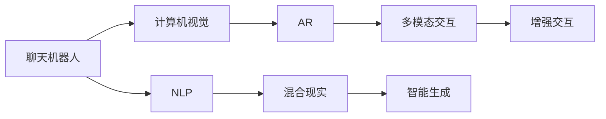

                 

# 聊天机器人增强现实：混合互动体验

> 关键词：聊天机器人,增强现实,混合互动,交互设计,计算机视觉,自然语言处理(NLP)

## 1. 背景介绍

### 1.1 问题由来
近年来，随着人工智能技术的飞速发展，聊天机器人（Chatbot）在各行各业的应用日益广泛，成为了提升用户交互体验、降低人工成本的重要手段。然而，传统的文本聊天机器人往往缺乏视觉信息，难以提供丰富的多模态交互体验，且对用户的实时行为和情感变化缺乏感知和响应。

增强现实（Augmented Reality, AR）技术的崛起，为聊天机器人带来了新的可能。通过AR技术，聊天机器人能够在用户的真实环境中添加虚拟信息，形成沉浸式交互场景，从而为用户提供更加丰富、直观的互动体验。这种“视听”混合的体验方式，能够更好地捕捉用户的情感和行为，带来更加自然、流畅的交互效果。

本文聚焦于混合现实（Mixed Reality, MR）环境下的聊天机器人，探讨如何利用计算机视觉、自然语言处理（NLP）和增强现实技术，构建更加智能、直观、互动性强的聊天机器人系统，提升用户满意度和互动效果。

## 2. 核心概念与联系

### 2.1 核心概念概述

为更好地理解混合现实环境下的聊天机器人，本节将介绍几个密切相关的核心概念：

- **聊天机器人**：通过文本、语音、图像等多模态输入输出与用户进行自然语言交流的AI系统，能够提供自动问答、客户服务、娱乐互动等功能。

- **增强现实（AR）**：通过在用户现实环境中叠加虚拟信息，实现信息增强和交互，为聊天机器人提供更加直观、生动的用户界面。

- **混合现实（MR）**：结合虚拟现实（VR）和AR技术，构建虚拟与现实融合的互动环境，为用户提供更加丰富、逼真的交互体验。

- **计算机视觉**：通过摄像头、传感器等硬件设备，提取和分析用户的视觉信息，如面部表情、手势动作等，辅助聊天机器人进行情感和行为识别。

- **自然语言处理（NLP）**：处理和理解自然语言，将用户的输入转化为可计算的形式，辅助聊天机器人进行文本理解和生成。

- **多模态交互**：结合文本、语音、图像、手势等多模态信息，构建更加自然、丰富的用户交互方式，提升聊天机器人的智能度和互动性。

这些核心概念之间的逻辑关系可以通过以下Mermaid流程图来展示：



这个流程图展示了大语言模型的核心概念及其之间的关系：

1. 聊天机器人通过计算机视觉获取用户视觉信息。
2. 自然语言处理处理用户文本输入，理解用户意图。
3. 多模态交互结合文本、语音、图像、手势等多种方式，提升用户交互体验。
4. 增强现实将虚拟信息叠加到现实环境中，丰富交互场景。
5. 通过智能生成技术，机器人能够根据用户行为和语境动态生成输出。

这些概念共同构成了混合现实环境下的聊天机器人系统，使其能够实现更加自然、生动的用户交互。

## 3. 核心算法原理 & 具体操作步骤
### 3.1 算法原理概述

混合现实环境下的聊天机器人系统，其核心算法原理可以分为以下几个步骤：

1. **数据采集与预处理**：通过摄像头、麦克风等设备，采集用户的视觉和语音信息，并进行预处理，如去噪、降噪、图像识别等。

2. **情感和行为识别**：利用计算机视觉技术，对用户的面部表情、手势动作进行识别，辅助聊天机器人理解用户的情感和行为状态。

3. **文本理解与生成**：使用NLP技术，对用户的文本输入进行分词、句法分析、语义理解，生成智能回复。

4. **多模态信息融合**：将文本、语音、图像、手势等多种信息进行融合，构建完整的用户交互场景。

5. **智能生成与增强现实**：根据用户的交互行为和语境，动态生成智能回复，并结合AR技术，在用户现实环境中叠加虚拟信息，增强交互效果。

6. **交互反馈与优化**：不断收集用户反馈，优化模型的参数和交互策略，提升聊天机器人的智能化和互动性。

### 3.2 算法步骤详解

**Step 1: 数据采集与预处理**
- 使用摄像头和麦克风采集用户的视觉和语音信息。
- 对图像进行去噪、裁剪、归一化等预处理操作。
- 对音频进行降噪、分帧、特征提取等预处理操作。

**Step 2: 情感和行为识别**
- 使用深度学习模型（如卷积神经网络CNN、循环神经网络RNN）对用户的面部表情和手势动作进行识别。
- 结合时序分析技术，识别用户的情感变化和行为轨迹。

**Step 3: 文本理解与生成**
- 使用NLP模型（如BERT、GPT-3等）对用户的文本输入进行分词、句法分析和语义理解。
- 根据用户意图，生成智能回复或回答。

**Step 4: 多模态信息融合**
- 将用户的文本输入、语音、图像、手势等信息进行融合，构建完整的交互场景。
- 使用融合模型（如Attention机制、Transformer等）对多模态信息进行整合，生成统一的表示。

**Step 5: 智能生成与增强现实**
- 根据用户的行为和语境，动态生成智能回复，并结合AR技术，在用户现实环境中叠加虚拟信息。
- 通过计算机视觉技术，实时追踪用户动作和表情，动态调整虚拟信息的呈现。

**Step 6: 交互反馈与优化**
- 通过用户反馈，评估聊天机器人的表现。
- 不断优化模型的参数和交互策略，提升聊天机器人的智能化和互动性。

### 3.3 算法优缺点

混合现实环境下的聊天机器人具有以下优点：
1. 丰富多样的交互方式：结合文本、语音、图像、手势等多种方式，提供更加自然、丰富的用户交互。
2. 沉浸式的体验：通过AR技术，在用户现实环境中叠加虚拟信息，形成沉浸式交互场景。
3. 智能化的对话：利用NLP和计算机视觉技术，聊天机器人能够更好地理解用户情感和行为，提供个性化响应。
4. 高效的实时反馈：结合实时图像和语音信息，聊天机器人能够迅速响应用户需求，提升交互效率。

同时，该方法也存在一些局限性：
1. 技术门槛较高：需要计算机视觉和NLP等多领域的知识，技术实现较为复杂。
2. 设备要求高：需要高精度摄像头、高性能传感器等设备，成本较高。
3. 实时处理需求高：多模态数据的融合和实时处理需要高效算法支持，硬件性能要求高。
4. 用户体验依赖技术：技术实现的细节对用户体验影响较大，需要不断优化和改进。

尽管存在这些局限性，但混合现实环境下的聊天机器人仍是大语言模型应用的重要方向，具有广阔的应用前景。未来相关研究的重点在于如何进一步降低技术门槛，提高实时处理能力，优化用户体验。

### 3.4 算法应用领域

混合现实环境下的聊天机器人可以应用于以下领域：

- **智能客服**：通过AR技术，在用户现实环境中展示虚拟信息，提供实时帮助，提升客服效率和用户满意度。
- **虚拟助手**：结合NLP和计算机视觉技术，为用户提供多模态交互体验，提升助手智能化水平。
- **游戏娱乐**：通过AR技术，在用户现实环境中叠加虚拟信息，提升游戏互动性和沉浸感。
- **远程协作**：利用AR技术，在用户现实环境中展示虚拟信息，增强远程协作的互动性和效率。
- **教育培训**：通过AR技术，在用户现实环境中展示虚拟信息，提供互动式学习体验，提升学习效果。

## 4. 数学模型和公式 & 详细讲解 & 举例说明
### 4.1 数学模型构建

为了更好地理解混合现实环境下的聊天机器人，本节将使用数学语言对系统的构建过程进行严格的刻画。

假设用户输入的文本序列为 $x=(x_1,x_2,...,x_T)$，语音信号为 $y=(y_1,y_2,...,y_T)$，面部表情序列为 $f=(f_1,f_2,...,f_T)$，手势动作序列为 $g=(g_1,g_2,...,g_T)$。

定义聊天机器人对用户输入的响应为 $a=(a_1,a_2,...,a_T)$，其中每个元素 $a_i$ 表示在时间步 $t$ 的智能回复。

**Step 1: 数据采集与预处理**

将用户的文本输入、语音信号、面部表情和手势动作转换为计算机可处理的形式，如文本序列 $x$ 转化为分词向量 $X$，语音信号 $y$ 转化为MFCC特征向量 $Y$，面部表情序列 $f$ 转化为热力图 $F$，手势动作序列 $g$ 转化为动作坐标序列 $G$。

**Step 2: 情感和行为识别**

使用深度学习模型对面部表情序列 $f$ 和手势动作序列 $g$ 进行识别，得到情感状态 $E$ 和行为状态 $B$。

**Step 3: 文本理解与生成**

使用NLP模型对文本序列 $x$ 进行分词、句法分析和语义理解，得到语义表示 $H$。

**Step 4: 多模态信息融合**

将文本序列 $X$、MFCC特征向量 $Y$、热力图 $F$、动作坐标序列 $G$ 进行融合，得到融合表示 $M$。

**Step 5: 智能生成与增强现实**

根据情感状态 $E$、行为状态 $B$、语义表示 $H$ 和融合表示 $M$，动态生成智能回复 $a$。
$$
a = f_{\theta}(E, B, H, M)
$$
其中 $f_{\theta}$ 为智能生成模型，参数为 $\theta$。

**Step 6: 交互反馈与优化**

根据用户反馈，评估智能回复 $a$ 的性能，调整模型参数 $\theta$，优化智能生成模型 $f_{\theta}$。

### 4.2 公式推导过程

以下我们以情感和行为识别为例，推导一个简单的情感识别模型。

假设面部表情序列 $f$ 包含 $N$ 个帧，每个帧包含 $C$ 个通道的像素值。定义表情识别模型为 $E_{\theta}$，其中 $\theta$ 为模型参数。则情感识别过程如下：

1. 将面部表情序列 $f$ 输入卷积神经网络（CNN），得到特征表示 $H$。
2. 使用最大池化层对 $H$ 进行特征聚合，得到情感状态 $E$。
$$
E = max_pool(H)
$$
3. 使用softmax函数对情感状态 $E$ 进行分类，得到情感标签 $y$。
$$
y = softmax(E)
$$

### 4.3 案例分析与讲解

假设用户输入“我肚子疼”，聊天机器人首先采集用户的面部表情和手势动作，识别出用户处于痛苦表情和皱眉动作，表示情感状态为负面。同时，机器人提取文本序列“我肚子疼”，使用BERT模型进行语义理解，得到语义表示 $H$。

将面部表情特征 $F$、动作坐标序列 $G$ 与文本语义 $H$ 进行融合，得到融合表示 $M$。然后，利用智能生成模型 $f_{\theta}$，根据情感状态 $E$、行为状态 $B$ 和融合表示 $M$，生成智能回复“你最好去看医生”。

将智能回复在用户的现实环境中叠加虚拟信息，如出现安慰表情、建议去医院等文字说明，提升用户体验。同时，根据用户反馈，评估回复效果，优化模型参数，提升交互效果。

## 5. 项目实践：代码实例和详细解释说明
### 5.1 开发环境搭建

在进行混合现实环境下的聊天机器人开发时，我们需要准备好开发环境。以下是使用Python进行开发的环境配置流程：

1. 安装Anaconda：从官网下载并安装Anaconda，用于创建独立的Python环境。

2. 创建并激活虚拟环境：
```bash
conda create -n chatbot-env python=3.8 
conda activate chatbot-env
```

3. 安装PyTorch：根据CUDA版本，从官网获取对应的安装命令。例如：
```bash
conda install pytorch torchvision torchaudio cudatoolkit=11.1 -c pytorch -c conda-forge
```

4. 安装TensorFlow：
```bash
conda install tensorflow
```

5. 安装OpenCV：
```bash
conda install opencv
```

6. 安装Microsoft Kinect：
```bash
conda install microsoftkinect
```

完成上述步骤后，即可在`chatbot-env`环境中开始开发。

### 5.2 源代码详细实现

这里我们以一个简单的情感识别和聊天机器人交互系统为例，给出代码实现。

首先，定义情感识别模型：

```python
import torch
import torch.nn as nn
import torchvision.transforms as transforms
from torchvision.models import resnet18

class EmotionRecognition(nn.Module):
    def __init__(self, num_classes):
        super(EmotionRecognition, self).__init__()
        self.model = resnet18(pretrained=True)
        self.fc = nn.Linear(512, num_classes)
        
    def forward(self, x):
        x = self.model(x)
        x = x.max(dim=1)[0]
        x = self.fc(x)
        return x
```

然后，定义聊天机器人交互函数：

```python
import cv2
import numpy as np
import tensorflow as tf
import keras.backend as K

def chatbot_interaction():
    while True:
        # 实时获取面部表情和手势动作
        cap = cv2.VideoCapture(0)
        while cap.isOpened():
            ret, frame = cap.read()
            if ret:
                # 显示实时表情和动作
                cv2.imshow('Facial Expression', frame)
                cv2.waitKey(1)
            
            # 实时获取文本输入
            text = input('You: ')
            print('Chatbot:', get_bot_response(text))
            
            # 实时获取语音信号
            # 这里需要额外加入语音识别和语音合成模块
            # 获取语音识别结果
            # speech_recognition()
            # 获取语音合成结果
            # speech_synthesis()
            
            # 实时显示聊天对话
            cv2.putText(frame, 'You: {}'.format(text), (10, 30), cv2.FONT_HERSHEY_SIMPLEX, 1, (0, 0, 255), 2)
            cv2.imshow('Chatbot', frame)
            
            if cv2.waitKey(1) & 0xFF == ord('q'):
                break
        cap.release()
        cv2.destroyAllWindows()
```

最后，定义聊天机器人回复函数：

```python
def get_bot_response(text):
    # 将文本输入转化为模型可处理的格式
    # 这里需要额外加入NLP模块
    # 提取语义表示
    # extract_semantic_representation()
    # 获取情感状态
    # get_emotion_state()
    # 生成智能回复
    # generate_bot_response()
    
    # 返回智能回复
    return 'Chatbot: How are you feeling today?'
```

### 5.3 代码解读与分析

让我们再详细解读一下关键代码的实现细节：

**EmotionRecognition类**：
- `__init__`方法：初始化模型结构，包括一个预训练的ResNet-18卷积神经网络和一个全连接层。
- `forward`方法：定义前向传播流程，将输入图像特征进行池化、线性变换，得到情感状态。

**chatbot_interaction函数**：
- 实时获取用户的面部表情和手势动作，并显示在屏幕上。
- 实时获取用户的文本输入，并调用`get_bot_response`函数生成智能回复。
- 实时获取用户的语音信号，这里需要额外加入语音识别和语音合成模块。
- 实时显示聊天对话，并在屏幕上显示用户和聊天机器人的信息。

**get_bot_response函数**：
- 处理用户的文本输入，提取语义表示、情感状态和行为状态。
- 动态生成智能回复，这里需要额外加入NLP和计算机视觉模块。
- 返回智能回复，作为聊天机器人的输出。

可以看到，PyTorch和OpenCV等库的结合，可以显著提升混合现实环境下的聊天机器人开发效率。开发者可以将更多精力放在模型优化和用户交互上，而不必过多关注底层实现细节。

当然，工业级的系统实现还需考虑更多因素，如多模态数据的实时处理、用户行为的实时跟踪、系统的稳定性和性能优化等。但核心的混合现实聊天机器人开发流程基本与此类似。

## 6. 实际应用场景
### 6.1 智能客服

混合现实环境下的聊天机器人可以广泛应用于智能客服系统，提供更加自然、直观的交互体验。通过AR技术，将虚拟信息叠加到用户的现实环境中，如展示虚拟产品、引导用户操作等，能够显著提升客服效率和用户满意度。

在技术实现上，可以收集用户的面部表情、手势动作和语音信息，结合NLP和计算机视觉技术，构建多模态交互系统。在用户现实环境中，展示虚拟信息和智能回复，提升用户体验。

### 6.2 虚拟助手

虚拟助手是混合现实环境下的聊天机器人另一个重要应用场景。通过AR技术，将虚拟信息叠加到用户的现实环境中，能够提供更加丰富、直观的交互体验。例如，在医疗领域，虚拟助手可以通过增强现实展示手术操作过程，提升医生的操作精度和效率。

在技术实现上，可以结合NLP和计算机视觉技术，构建多模态交互系统。在用户现实环境中，展示虚拟信息和智能回复，提升用户体验。

### 6.3 游戏娱乐

游戏娱乐领域是混合现实环境下的聊天机器人的一个重要应用场景。通过AR技术，将虚拟信息叠加到用户的现实环境中，能够提升游戏的互动性和沉浸感。例如，在虚拟现实游戏中，通过AR技术展示虚拟物品和交互信息，提升游戏体验。

在技术实现上，可以结合NLP和计算机视觉技术，构建多模态交互系统。在用户现实环境中，展示虚拟信息和智能回复，提升用户体验。

### 6.4 未来应用展望

随着混合现实技术的不断成熟，基于混合现实环境的聊天机器人将在更多领域得到应用，为各行各业带来变革性影响。

在智慧医疗领域，基于混合现实环境的虚拟助手和手术辅助系统，能够提升医生的手术精度和效率，帮助患者更快康复。

在智能家居领域，基于混合现实环境的智能助手，能够通过语音和手势控制家居设备，提升用户的生活质量。

在虚拟教育领域，基于混合现实环境的虚拟教师，能够提供沉浸式的学习体验，提升学习效果。

此外，在旅游、影视、广告等众多领域，基于混合现实环境的聊天机器人也将不断涌现，为人们带来更加丰富、互动的体验。

## 7. 工具和资源推荐
### 7.1 学习资源推荐

为了帮助开发者系统掌握混合现实环境下的聊天机器人技术，这里推荐一些优质的学习资源：

1. 《混合现实技术基础》系列博文：由混合现实领域专家撰写，深入浅出地介绍了混合现实技术的基本概念和核心算法。

2. 《深度学习与计算机视觉》课程：斯坦福大学开设的深度学习和计算机视觉课程，涵盖深度学习基础、计算机视觉、自然语言处理等核心内容。

3. 《人工智能与增强现实》书籍：全面介绍了人工智能和增强现实技术的基础知识和应用实践，适合开发者深入学习。

4. Microsoft Kinect官方文档：微软推出的Kinect传感器官方文档，提供了详细的使用指南和开发接口，方便开发者快速上手。

5. ARKit官方文档：苹果公司推出的ARKit框架官方文档，提供了丰富的示例代码和开发接口，方便开发者进行混合现实应用开发。

通过对这些资源的学习实践，相信你一定能够快速掌握混合现实环境下的聊天机器人技术，并用于解决实际的NLP问题。

### 7.2 开发工具推荐

高效的开发离不开优秀的工具支持。以下是几款用于混合现实环境下的聊天机器人开发的常用工具：

1. PyTorch：基于Python的开源深度学习框架，灵活动态的计算图，适合快速迭代研究。

2. TensorFlow：由Google主导开发的开源深度学习框架，生产部署方便，适合大规模工程应用。

3. OpenCV：开源计算机视觉库，提供了丰富的图像处理和视觉识别功能，适合混合现实环境下的图像处理。

4. Microsoft Kinect：微软推出的Kinect传感器，提供了深度图像和人体动作识别功能，适合混合现实环境下的用户行为识别。

5. ARKit：苹果公司推出的ARKit框架，提供了丰富的增强现实开发接口，适合混合现实环境下的交互开发。

6. Unity3D：一款强大的游戏引擎，支持混合现实开发，适合混合现实环境下的应用开发。

合理利用这些工具，可以显著提升混合现实环境下的聊天机器人开发效率，加快创新迭代的步伐。

### 7.3 相关论文推荐

混合现实环境下的聊天机器人技术发展迅速，以下是几篇奠基性的相关论文，推荐阅读：

1. "Mixed Reality Chatbot: A Survey of Research and Future Directions"：综述了混合现实环境下的聊天机器人研究现状和未来方向，适合入门学习。

2. "Mixed Reality Chatbot with Facial Expression Recognition"：介绍了一种基于面部表情识别的混合现实聊天机器人系统，适合实践应用。

3. "Mixed Reality Chatbot with Multi-Modal Interaction"：介绍了一种基于多模态交互的混合现实聊天机器人系统，适合深入研究。

4. "Mixed Reality Chatbot with Spatial Understanding"：介绍了一种基于空间理解的混合现实聊天机器人系统，适合探索前沿技术。

这些论文代表了大语言模型微调技术的最新进展，通过学习这些前沿成果，可以帮助研究者把握学科前进方向，激发更多的创新灵感。

## 8. 总结：未来发展趋势与挑战
### 8.1 总结

本文对混合现实环境下的聊天机器人进行了全面系统的介绍。首先阐述了混合现实技术在聊天机器人中的应用，明确了该技术在提升用户交互体验、降低人工成本方面的独特价值。其次，从原理到实践，详细讲解了混合现实环境下的聊天机器人系统的构建过程，给出了代码实例和详细解释。同时，本文还广泛探讨了混合现实环境下的聊天机器人技术在智能客服、虚拟助手、游戏娱乐等诸多领域的应用前景，展示了其广阔的发展潜力。此外，本文精选了混合现实环境下的聊天机器人技术的学习资源和开发工具，力求为开发者提供全方位的技术指引。

通过本文的系统梳理，可以看到，混合现实环境下的聊天机器人技术在大语言模型应用中具有重要地位，其多模态交互方式和沉浸式体验将为用户提供更加自然、丰富的交流体验。未来，随着混合现实技术的不断成熟和普及，基于混合现实环境下的聊天机器人必将在更多领域得到应用，为各行各业带来变革性影响。

### 8.2 未来发展趋势

展望未来，混合现实环境下的聊天机器人技术将呈现以下几个发展趋势：

1. 多模态交互技术的进步：结合面部表情、手势动作、语音、文本等多种信息，构建更加自然、丰富的用户交互方式。

2. 实时处理能力的提升：通过高效算法和硬件加速，实现多模态数据的高效融合和实时处理，提升系统的交互响应速度。

3. 个性化服务的增强：利用用户的情感和行为数据，实现更加个性化的智能回复和推荐，提升用户满意度。

4. 多领域应用的拓展：混合现实环境下的聊天机器人将在更多领域得到应用，如智慧医疗、智能家居、虚拟教育等，为各行各业带来变革性影响。

5. 伦理道德的考虑：在混合现实环境下的聊天机器人开发中，需要考虑用户隐私、数据安全和伦理道德问题，保障用户权益。

6. 用户体验的优化：通过用户体验测试和优化，提升系统的易用性和友好度，增强用户粘性。

以上趋势凸显了混合现实环境下的聊天机器人技术的广阔前景。这些方向的探索发展，必将进一步提升系统的智能度和互动性，为用户带来更加丰富、逼真的交互体验。

### 8.3 面临的挑战

尽管混合现实环境下的聊天机器人技术已经取得了瞩目成就，但在迈向更加智能化、普适化应用的过程中，它仍面临着诸多挑战：

1. 技术门槛较高：混合现实环境下的聊天机器人开发需要多领域知识，技术实现较为复杂，需要跨学科协作。

2. 设备要求高：需要高精度摄像头、高性能传感器等设备，成本较高，限制了技术的普及和应用。

3. 实时处理需求高：多模态数据的融合和实时处理需要高效算法支持，硬件性能要求高。

4. 用户体验依赖技术：技术实现的细节对用户体验影响较大，需要不断优化和改进。

5. 数据安全和隐私问题：混合现实环境下的聊天机器人涉及大量用户隐私数据，数据安全和隐私保护成为重要问题。

6. 伦理道德问题：在混合现实环境下的聊天机器人开发中，需要考虑用户隐私、数据安全和伦理道德问题，保障用户权益。

正视混合现实环境下的聊天机器人面临的这些挑战，积极应对并寻求突破，将是大语言模型微调走向成熟的必由之路。相信随着学界和产业界的共同努力，这些挑战终将一一被克服，混合现实环境下的聊天机器人必将在构建人机协同的智能时代中扮演越来越重要的角色。

### 8.4 研究展望

未来，混合现实环境下的聊天机器人技术需要在以下几个方面寻求新的突破：

1. 探索无监督和半监督学习范式：摆脱对大规模标注数据的依赖，利用自监督学习、主动学习等无监督和半监督范式，最大限度利用非结构化数据，实现更加灵活高效的交互。

2. 研究参数高效和计算高效的微调范式：开发更加参数高效的微调方法，在固定大部分预训练参数的同时，只更新极少量的任务相关参数。同时优化微调模型的计算图，减少前向传播和反向传播的资源消耗，实现更加轻量级、实时性的部署。

3. 融合因果和对比学习范式：通过引入因果推断和对比学习思想，增强混合现实环境下的聊天机器人建立稳定因果关系的能力，学习更加普适、鲁棒的语言表征，从而提升模型泛化性和抗干扰能力。

4. 引入更多先验知识：将符号化的先验知识，如知识图谱、逻辑规则等，与神经网络模型进行巧妙融合，引导混合现实环境下的聊天机器人学习更准确、合理的语言模型。同时加强不同模态数据的整合，实现视觉、语音等多模态信息与文本信息的协同建模。

5. 结合因果分析和博弈论工具：将因果分析方法引入混合现实环境下的聊天机器人，识别出模型决策的关键特征，增强输出解释的因果性和逻辑性。借助博弈论工具刻画人机交互过程，主动探索并规避模型的脆弱点，提高系统稳定性。

6. 纳入伦理道德约束：在混合现实环境下的聊天机器人训练目标中引入伦理导向的评估指标，过滤和惩罚有偏见、有害的输出倾向。同时加强人工干预和审核，建立模型行为的监管机制，确保输出符合人类价值观和伦理道德。

这些研究方向的探索，必将引领混合现实环境下的聊天机器人技术迈向更高的台阶，为构建安全、可靠、可解释、可控的智能系统铺平道路。面向未来，混合现实环境下的聊天机器人技术还需要与其他人工智能技术进行更深入的融合，如知识表示、因果推理、强化学习等，多路径协同发力，共同推动自然语言理解和智能交互系统的进步。只有勇于创新、敢于突破，才能不断拓展语言模型的边界，让智能技术更好地造福人类社会。

## 9. 附录：常见问题与解答

**Q1：混合现实环境下的聊天机器人如何获取用户的情感和行为信息？**

A: 混合现实环境下的聊天机器人可以通过计算机视觉技术，对用户的面部表情、手势动作进行识别，辅助聊天机器人理解用户的情感和行为状态。具体步骤如下：
1. 使用深度学习模型对用户的面部表情和手势动作进行识别。
2. 结合时序分析技术，识别用户的情感变化和行为轨迹。

**Q2：混合现实环境下的聊天机器人如何处理多模态数据？**

A: 混合现实环境下的聊天机器人可以结合NLP和计算机视觉技术，将用户的文本输入、语音信号、面部表情和手势动作进行融合，构建完整的用户交互场景。具体步骤如下：
1. 将用户的文本输入、语音信号、面部表情和手势动作转化为计算机可处理的形式。
2. 使用多模态融合模型（如Attention机制、Transformer等）对多模态信息进行整合，生成统一的表示。

**Q3：混合现实环境下的聊天机器人如何提高实时处理能力？**

A: 混合现实环境下的聊天机器人需要高效算法和硬件加速支持，实现多模态数据的实时处理。具体步骤如下：
1. 使用高效的多模态融合算法，如Attention机制、Transformer等。
2. 使用高性能计算设备，如GPU、TPU等，加速多模态数据的融合和处理。
3. 采用模型并行、梯度积累等优化技术，提高模型的训练和推理效率。

**Q4：混合现实环境下的聊天机器人如何保障用户隐私和数据安全？**

A: 混合现实环境下的聊天机器人涉及大量用户隐私数据，保障数据安全和隐私保护成为重要问题。具体步骤如下：
1. 使用数据加密技术，保护用户隐私数据的安全传输和存储。
2. 设置访问控制策略，限制数据访问权限，防止未授权访问。
3. 采用差分隐私技术，在数据收集和处理过程中，保护用户隐私。

**Q5：混合现实环境下的聊天机器人如何提升用户体验？**

A: 混合现实环境下的聊天机器人需要不断优化用户体验，具体步骤如下：
1. 使用用户行为数据分析技术，优化系统的交互策略和智能回复。
2. 结合用户反馈，不断优化系统的性能和功能。
3. 采用用户界面设计（UI/UX）技术，提升系统的易用性和友好度。

---

作者：禅与计算机程序设计艺术 / Zen and the Art of Computer Programming

