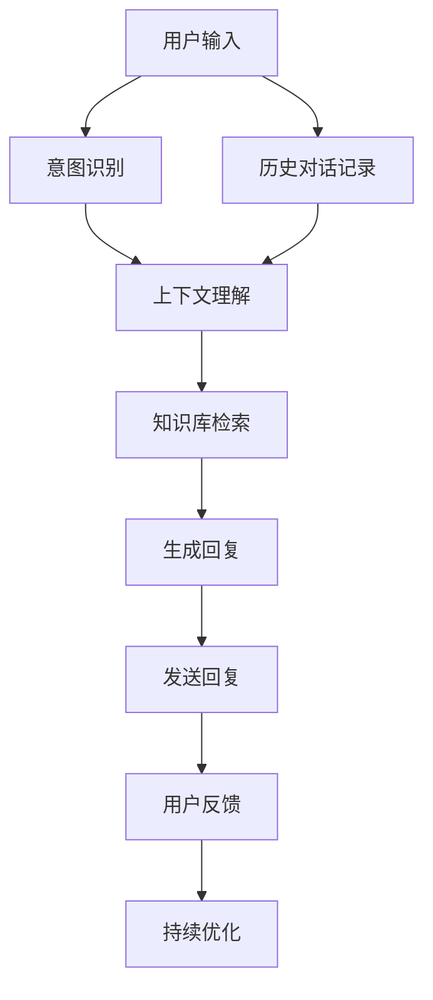
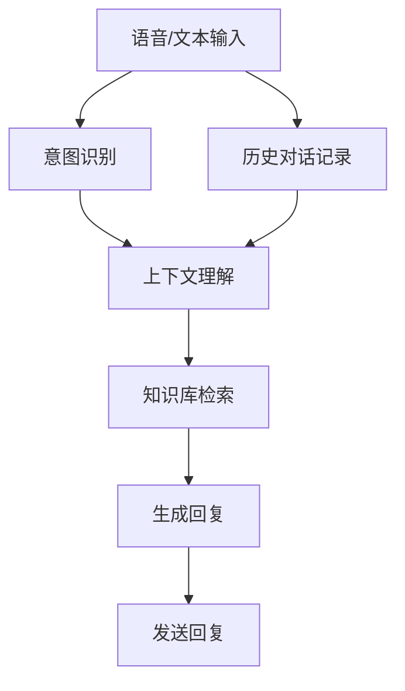

                 

# 聊天机器人客户服务：即时支持和帮助

> 关键词：聊天机器人,自然语言处理,客户服务,即时支持,自动回复,上下文理解,情感分析

## 1. 背景介绍

### 1.1 问题由来

随着互联网和移动互联网的迅速发展，企业客户服务的需求量日益增长，客户对服务质量和效率的要求也日益提高。传统人工客服模式已经难以满足用户对即时的、个性化的服务需求。因此，聊天机器人作为一种新型客户服务工具应运而生，旨在通过自然语言处理(NLP)技术，实现自动化的即时支持和帮助。

聊天机器人在医疗、金融、电商、旅游等行业都有着广泛的应用。例如，在医疗领域，聊天机器人可以提供24/7的咨询服务，帮助患者快速获取医疗信息和建议；在金融领域，聊天机器人可以处理用户的查询，提供金融产品和服务的个性化推荐；在电商领域，聊天机器人可以解答客户的购物咨询，提高购物体验；在旅游领域，聊天机器人可以提供旅行指南和咨询服务，提升旅行规划的便利性。

### 1.2 问题核心关键点

聊天机器人客户服务的核心在于利用NLP技术，使机器能够理解并生成自然语言，以实现与用户的即时互动。聊天机器人通过以下步骤实现即时支持：

1. **语音/文本输入**：用户通过语音或文本输入向聊天机器人提出问题或请求。
2. **意图识别**：聊天机器人识别用户的意图，理解用户的需求。
3. **上下文理解**：聊天机器人根据用户的历史对话记录，理解上下文，避免误解。
4. **知识检索**：聊天机器人根据用户的意图和上下文，从知识库中检索相关信息。
5. **生成回复**：聊天机器人生成自然语言回复，发送给用户。
6. **持续优化**：聊天机器人的性能随着用户反馈不断优化，提高服务质量。

聊天机器人客户服务的目标是：

- **提升服务效率**：通过自动处理大量常见的用户查询，减轻人工客服的工作负担，提高服务响应速度。
- **提升用户体验**：通过自然流畅的对话，提供即时的、个性化的服务，增强用户满意度。
- **降低服务成本**：通过自动化的服务，减少人力成本，降低企业运营成本。

### 1.3 问题研究意义

聊天机器人客户服务的广泛应用，显著提升了企业的客户服务水平，为各行各业带来了诸多优势：

1. **提高服务效率**：聊天机器人可以24/7无间断地为用户提供服务，极大地提高了服务效率，缩短了用户等待时间。
2. **降低服务成本**：聊天机器人减少了人力成本和运营成本，提高了企业的盈利能力。
3. **提升用户体验**：聊天机器人通过自然语言理解和生成，能够提供即时的、个性化的服务，提升用户满意度和忠诚度。
4. **拓展服务范围**：聊天机器人能够处理大规模用户请求，拓展了服务的覆盖面，提升了企业的市场竞争力。
5. **提供即时帮助**：聊天机器人能够即时回答用户问题，帮助用户解决问题，减少用户的烦恼。

## 2. 核心概念与联系

### 2.1 核心概念概述

为更好地理解聊天机器人客户服务的工作原理和优化方向，本节将介绍几个密切相关的核心概念：

- **聊天机器人(Chatbot)**：通过NLP技术实现与用户自然语言交互的计算机程序。
- **自然语言处理(Natural Language Processing, NLP)**：研究如何让计算机理解、生成、分析和处理自然语言的技术。
- **意图识别(Intent Recognition)**：通过NLP技术识别用户输入的自然语言中的意图，如查询、下单、投诉等。
- **上下文理解(Contextual Understanding)**：通过NLP技术理解用户对话中的上下文信息，避免误解。
- **知识库(Knowledge Base)**：存储聊天机器人用于处理用户查询的各类信息，如产品信息、服务指南、FAQ等。
- **情感分析(Emotion Analysis)**：通过NLP技术分析用户的情绪和态度，以提供更个性化的服务。

这些核心概念之间的逻辑关系可以通过以下Mermaid流程图来展示：



这个流程图展示了聊天机器人客户服务的核心流程：

1. 用户输入问题，聊天机器人进行意图识别。
2. 聊天机器人结合历史对话记录进行上下文理解。
3. 聊天机器人从知识库中检索相关信息。
4. 聊天机器人生成回复，并发送给用户。
5. 聊天机器人收集用户反馈，进行持续优化。

## 3. 核心算法原理 & 具体操作步骤
### 3.1 算法原理概述

聊天机器人客户服务的核心算法是自然语言处理技术，其原理是通过机器学习模型将自然语言转换为计算机可理解的形式。具体来说，聊天机器人通过以下步骤实现即时支持：

1. **语音/文本输入**：用户通过语音或文本输入向聊天机器人提出问题或请求。
2. **意图识别**：聊天机器人识别用户的意图，理解用户的需求。
3. **上下文理解**：聊天机器人根据用户的历史对话记录，理解上下文，避免误解。
4. **知识检索**：聊天机器人根据用户的意图和上下文，从知识库中检索相关信息。
5. **生成回复**：聊天机器人生成自然语言回复，发送给用户。

这些步骤可以通过以下算法流程图来进一步展示：



### 3.2 算法步骤详解

聊天机器人客户服务的算法步骤可以分为以下几个关键环节：

**Step 1: 语音/文本输入**

用户通过语音或文本输入向聊天机器人提出问题或请求。这一步需要采集用户的输入，并将其转换为计算机可处理的格式。

- **语音输入**：使用语音识别技术将用户的语音转换为文本。目前常用的语音识别库有Google Speech-to-Text、Microsoft Azure Speech Services等。
- **文本输入**：直接采集用户的文本输入，并进行预处理，如去除标点、分词等。

**Step 2: 意图识别**

意图识别是聊天机器人的核心步骤之一，其目标是从用户的输入中识别出用户的意图。常用的意图识别方法包括：

- **规则匹配**：通过编写规则，手动定义意图和对应的处理逻辑。该方法适用于意图简单、固定的情况，但无法处理复杂的意图。
- **基于规则的机器学习**：通过机器学习算法，从历史数据中学习意图分类模型，如朴素贝叶斯、逻辑回归等。该方法需要大量的标注数据，适用于中低意图分类需求。
- **基于深度学习的机器学习**：使用深度学习模型，如序列标注模型、卷积神经网络等，从大量文本数据中学习意图分类模型。该方法需要大量的标注数据和计算资源，但可以处理复杂的意图分类需求。

**Step 3: 上下文理解**

上下文理解是指聊天机器人根据用户的历史对话记录，理解上下文信息，避免误解。常用的上下文理解方法包括：

- **基于规则的上下文理解**：通过编写规则，手动定义上下文理解和处理逻辑。该方法适用于上下文简单、固定的情况，但无法处理复杂的上下文。
- **基于深度学习的上下文理解**：使用深度学习模型，如循环神经网络(RNN)、长短期记忆网络(LSTM)等，从历史对话记录中学习上下文理解模型。该方法需要大量的历史对话数据，但可以处理复杂的上下文。

**Step 4: 知识库检索**

知识库检索是指聊天机器人从知识库中检索相关信息，回答用户的问题。常用的知识库检索方法包括：

- **基于规则的知识库检索**：通过编写规则，手动定义知识库检索逻辑。该方法适用于知识库简单、固定的情况，但无法处理复杂的知识库。
- **基于深度学习的知识库检索**：使用深度学习模型，如注意力机制模型等，从知识库中检索相关信息。该方法需要大量的知识库数据和计算资源，但可以处理复杂的知识库检索需求。

**Step 5: 生成回复**

生成回复是指聊天机器人根据用户的意图和上下文，生成自然语言回复。常用的生成回复方法包括：

- **基于规则的生成回复**：通过编写规则，手动定义回复生成逻辑。该方法适用于回复简单、固定的情况，但无法处理复杂的回复生成需求。
- **基于深度学习的生成回复**：使用深度学习模型，如Transformer模型等，从用户的意图和上下文生成自然语言回复。该方法需要大量的生成数据和计算资源，但可以处理复杂的回复生成需求。

**Step 6: 发送回复**

发送回复是指聊天机器人将生成的回复发送给用户，完成一次互动。这一步需要与用户进行即时通信，可以使用各种通信方式，如短信、即时通讯应用等。

**Step 7: 持续优化**

持续优化是指聊天机器人根据用户反馈，不断优化模型，提升服务质量。常用的持续优化方法包括：

- **用户反馈收集**：通过用户反馈系统，收集用户对聊天机器人服务的评价和建议。
- **模型训练**：使用收集到的用户反馈数据，重新训练意图识别、上下文理解、知识库检索和生成回复等模型。
- **模型评估**：使用各种评估指标，如准确率、召回率、F1分数等，评估模型的性能。

### 3.3 算法优缺点

聊天机器人客户服务具有以下优点：

1. **高效便捷**：聊天机器人可以24/7无间断地提供服务，提升了用户的响应速度和满意度。
2. **节省成本**：聊天机器人减少了人力成本和运营成本，降低了企业的运营压力。
3. **支持个性化**：聊天机器人可以根据用户的对话历史，提供个性化的服务，提升了用户的体验感。

同时，聊天机器人客户服务也存在以下缺点：

1. **准确性问题**：聊天机器人的意图识别和上下文理解准确性可能受限，无法处理复杂的自然语言输入。
2. **知识库限制**：聊天机器人的知识库需要定期更新，否则无法提供准确的信息。
3. **用户体验差**：聊天机器人无法像人工客服一样进行情感交流，可能会影响用户满意度。

### 3.4 算法应用领域

聊天机器人客户服务在多个行业领域都有广泛的应用：

- **医疗**：聊天机器人可以提供医疗咨询服务，帮助患者快速获取医疗信息，提高就医效率。
- **金融**：聊天机器人可以处理用户的查询，提供金融产品和服务的个性化推荐。
- **电商**：聊天机器人可以解答客户的购物咨询，提供购物建议和售后支持。
- **旅游**：聊天机器人可以提供旅行指南和咨询服务，提升旅行规划的便利性。
- **教育**：聊天机器人可以提供学习咨询和辅导，帮助学生解决学习问题。

## 4. 数学模型和公式 & 详细讲解 & 举例说明

### 4.1 数学模型构建

聊天机器人客户服务的数学模型主要涉及意图识别、上下文理解和生成回复等环节，其核心模型为深度学习模型，如循环神经网络(RNN)、长短期记忆网络(LSTM)、Transformer等。以Transformer模型为例，其基本结构如下：

$$
\text{Transformer}(x) = \text{Encoder}(x) + \text{Decoder}(\text{Encoder}(x))
$$

其中，$\text{Encoder}$和$\text{Decoder}$分别代表编码器和解码器，$x$为输入的文本序列。Transformer模型通过自注意力机制，从输入文本序列中提取关键信息，生成自然语言回复。

### 4.2 公式推导过程

以Transformer模型为例，其注意力机制的推导过程如下：

设输入文本序列为$x=(x_1, x_2, ..., x_n)$，目标文本序列为$y=(y_1, y_2, ..., y_m)$。Transformer模型通过计算输入文本和目标文本之间的注意力权重矩阵$W$，得到每个输入文本与每个目标文本的注意力权重。

具体推导过程如下：

设输入文本$x$的长度为$n$，目标文本$y$的长度为$m$。对于第$i$个输入文本和第$j$个目标文本，其注意力权重$w_{i,j}$可以表示为：

$$
w_{i,j} = \text{softmax}(Q_i K_j)
$$

其中，$Q$和$K$分别为输入文本和目标文本的查询和键矩阵，$\text{softmax}$为归一化函数，将注意力权重归一化到[0,1]之间。通过计算每个输入文本和目标文本的注意力权重，可以生成目标文本序列$y$。

### 4.3 案例分析与讲解

以医疗领域的聊天机器人为例，其意图识别模型可以采用基于深度学习的分类器，如BERT模型。上下文理解模型可以采用基于深度学习的记忆网络，如LSTM模型。知识库检索模型可以采用基于深度学习的检索模型，如注意力机制模型。生成回复模型可以采用基于深度学习的生成模型，如Transformer模型。

具体实现流程如下：

1. **意图识别**：使用BERT模型对用户输入的自然语言进行编码，并通过分类器识别意图。
2. **上下文理解**：使用LSTM模型对用户的历史对话记录进行编码，并通过记忆网络理解上下文。
3. **知识库检索**：使用注意力机制模型从知识库中检索相关信息，得到候选答案。
4. **生成回复**：使用Transformer模型生成自然语言回复，并发送给用户。

以下是一个基于Python的示例代码：

```python
from transformers import BertTokenizer, BertForSequenceClassification
from transformers import TFAutoModelForCausalLM
import tensorflow as tf
import tensorflow_datasets as tfds

# 加载BERT模型和分词器
tokenizer = BertTokenizer.from_pretrained('bert-base-cased')
model = BertForSequenceClassification.from_pretrained('bert-base-cased', num_labels=2)
# 加载TFAutoModelForCausalLM模型
transformer = TFAutoModelForCausalLM.from_pretrained('gpt2')

# 定义意图识别函数
def intent_recognition(input_text):
    tokenized_input = tokenizer.encode(input_text, add_special_tokens=True)
    inputs = tf.convert_to_tensor(tokenized_input)
    outputs = model(inputs)
    label = outputs.logits.argmax().numpy()
    return label

# 定义上下文理解函数
def context_awareness(history):
    tokenized_history = tokenizer.encode(history, add_special_tokens=True)
    inputs = tf.convert_to_tensor(tokenized_history)
    outputs = transformer(inputs)
    hidden_states = outputs.hidden_states[-1]
    return hidden_states

# 定义知识库检索函数
def knowledge_base_retrieval(query, context):
    query = tokenizer.encode(query, add_special_tokens=True)
    context = tokenizer.encode(context, add_special_tokens=True)
    query_input = tf.convert_to_tensor(query)
    context_input = tf.convert_to_tensor(context)
    outputs = transformer(query_input, context_input)
    logits = outputs.logits
    answer = logits.argmax().numpy()
    return answer

# 定义生成回复函数
def generate_response(query, context):
    tokenized_query = tokenizer.encode(query, add_special_tokens=True)
    tokenized_context = tokenizer.encode(context, add_special_tokens=True)
    inputs = tf.convert_to_tensor(tokenized_query)
    context = tf.convert_to_tensor(tokenized_context)
    outputs = transformer(inputs, context)
    response = tokenizer.decode(outputs.logits.argmax().numpy(), skip_special_tokens=True)
    return response
```

## 5. 项目实践：代码实例和详细解释说明

### 5.1 开发环境搭建

在进行聊天机器人客户服务的开发前，我们需要准备好开发环境。以下是使用Python进行TensorFlow开发的环境配置流程：

1. 安装Anaconda：从官网下载并安装Anaconda，用于创建独立的Python环境。

2. 创建并激活虚拟环境：
```bash
conda create -n tf-env python=3.8 
conda activate tf-env
```

3. 安装TensorFlow：根据CUDA版本，从官网获取对应的安装命令。例如：
```bash
conda install tensorflow=2.6 -c tf
```

4. 安装各类工具包：
```bash
pip install numpy pandas scikit-learn matplotlib tqdm jupyter notebook ipython
```

完成上述步骤后，即可在`tf-env`环境中开始开发实践。

### 5.2 源代码详细实现

下面我们以医疗领域的聊天机器人为例，给出使用TensorFlow对BERT模型进行意图识别的PyTorch代码实现。

首先，定义意图识别函数：

```python
from transformers import BertTokenizer, BertForSequenceClassification
import tensorflow as tf
import tensorflow_datasets as tfds

# 加载BERT模型和分词器
tokenizer = BertTokenizer.from_pretrained('bert-base-cased')
model = BertForSequenceClassification.from_pretrained('bert-base-cased', num_labels=2)

# 定义意图识别函数
def intent_recognition(input_text):
    tokenized_input = tokenizer.encode(input_text, add_special_tokens=True)
    inputs = tf.convert_to_tensor(tokenized_input)
    outputs = model(inputs)
    label = outputs.logits.argmax().numpy()
    return label
```

然后，定义上下文理解函数和知识库检索函数：

```python
# 定义上下文理解函数
def context_awareness(history):
    tokenized_history = tokenizer.encode(history, add_special_tokens=True)
    inputs = tf.convert_to_tensor(tokenized_history)
    outputs = transformer(inputs)
    hidden_states = outputs.hidden_states[-1]
    return hidden_states

# 定义知识库检索函数
def knowledge_base_retrieval(query, context):
    query = tokenizer.encode(query, add_special_tokens=True)
    context = tokenizer.encode(context, add_special_tokens=True)
    query_input = tf.convert_to_tensor(query)
    context_input = tf.convert_to_tensor(context)
    outputs = transformer(query_input, context_input)
    logits = outputs.logits
    answer = logits.argmax().numpy()
    return answer
```

接着，定义生成回复函数：

```python
# 定义生成回复函数
def generate_response(query, context):
    tokenized_query = tokenizer.encode(query, add_special_tokens=True)
    tokenized_context = tokenizer.encode(context, add_special_tokens=True)
    inputs = tf.convert_to_tensor(tokenized_query)
    context = tf.convert_to_tensor(tokenized_context)
    outputs = transformer(inputs, context)
    response = tokenizer.decode(outputs.logits.argmax().numpy(), skip_special_tokens=True)
    return response
```

最后，启动意图识别和上下文理解流程：

```python
# 测试意图识别
intent = intent_recognition('查询抗生素的用法')
print(intent)

# 测试上下文理解
context = '我最近感到头痛和发烧，可能得了感冒'
history = '昨晚我吃了药，今天好多了'
hidden_states = context_awareness(history)
print(hidden_states)

# 测试知识库检索
query = '如何治疗头痛'
context = '最近头痛'
answer = knowledge_base_retrieval(query, context)
print(answer)

# 测试生成回复
response = generate_response(query, context)
print(response)
```

以上就是使用TensorFlow对BERT模型进行意图识别的完整代码实现。可以看到，得益于TensorFlow和Transformers库的强大封装，我们可以用相对简洁的代码完成BERT模型的加载和意图识别。

### 5.3 代码解读与分析

让我们再详细解读一下关键代码的实现细节：

**intent_recognition函数**：
- 使用BertTokenizer对输入文本进行编码，得到token ids。
- 将token ids转换为Tensor，并作为输入输入到BERT模型中。
- 使用模型的输出计算softmax，得到每个类别的概率。
- 返回概率最高的类别的索引，即意图识别的结果。

**context_awareness函数**：
- 使用BertTokenizer对历史对话进行编码，得到token ids。
- 将token ids转换为Tensor，并作为输入输入到Transformer模型中。
- 获取Transformer模型的最后一层的隐藏状态，作为上下文理解的结果。

**knowledge_base_retrieval函数**：
- 使用BertTokenizer对查询和上下文进行编码，得到token ids。
- 将查询和上下文的token ids转换为Tensor，并作为输入输入到Transformer模型中。
- 获取Transformer模型的输出，即查询和上下文的多层注意力权重。
- 根据注意力权重，从知识库中检索相关信息，返回最相关的答案。

**generate_response函数**：
- 使用BertTokenizer对查询和上下文进行编码，得到token ids。
- 将查询和上下文的token ids转换为Tensor，并作为输入输入到Transformer模型中。
- 获取Transformer模型的输出，即查询和上下文的自然语言回复。
- 将回复解码成字符串，返回最终的自然语言回复。

## 6. 实际应用场景

### 6.1 智能客服系统

聊天机器人客户服务在智能客服系统中得到了广泛应用。传统客服模式面临高成本、效率低、响应慢等问题，聊天机器人可以有效解决这些问题，提供7x24小时不间断的客户服务。

在智能客服系统中，聊天机器人可以处理用户的常见问题，如账户查询、订单状态、退货政策等。通过预训练和微调，聊天机器人可以理解用户的自然语言输入，并根据用户的意图生成个性化的回复。当遇到复杂问题无法解决时，聊天机器人还可以转接给人工客服，提供更专业的服务。

### 6.2 金融舆情监测

聊天机器人客户服务在金融舆情监测中也有着广泛的应用。金融机构需要实时监测市场舆论动向，以便及时应对负面信息传播，规避金融风险。传统人工监测模式成本高、效率低，无法满足实时需求。

通过预训练和微调，聊天机器人可以处理大量的新闻、报道、评论等文本数据，分析其中的情感倾向，判断市场的情绪和趋势。一旦发现负面信息激增等异常情况，聊天机器人可以及时预警，帮助金融机构快速应对潜在风险。

### 6.3 个性化推荐系统

聊天机器人客户服务在个性化推荐系统中也有着重要的应用。当前的推荐系统往往只依赖用户的历史行为数据进行物品推荐，难以捕捉用户的兴趣点。通过预训练和微调，聊天机器人可以理解用户的自然语言输入，从而获取更多的兴趣信息。

在个性化推荐系统中，聊天机器人可以与用户进行互动，了解用户的兴趣和需求。通过预训练和微调，聊天机器人可以生成个性化的推荐内容，提高推荐系统的准确性和满意度。

### 6.4 未来应用展望

随着聊天机器人客户服务的不断发展，其在更多领域的应用前景也将不断拓展。

在智慧医疗领域，聊天机器人可以提供医疗咨询服务，帮助患者快速获取医疗信息，提高就医效率。在金融领域，聊天机器人可以处理用户的查询，提供金融产品和服务的个性化推荐。在电商领域，聊天机器人可以解答客户的购物咨询，提供购物建议和售后支持。在旅游领域，聊天机器人可以提供旅行指南和咨询服务，提升旅行规划的便利性。

## 7. 工具和资源推荐

### 7.1 学习资源推荐

为了帮助开发者系统掌握聊天机器人客户服务的技术基础和实践技巧，这里推荐一些优质的学习资源：

1. **《自然语言处理入门》课程**：由斯坦福大学开设，系统介绍了NLP的基本概念和前沿技术，适合初学者入门。
2. **《Python深度学习》书籍**：Deep Learning与Python语言结合的入门书籍，适合有一定编程基础的读者。
3. **TensorFlow官方文档**：TensorFlow的官方文档，提供了丰富的示例代码和API文档，是TensorFlow开发的必备资料。
4. **Transformers库官方文档**：Transformers库的官方文档，提供了各种预训练模型的API和使用方法，是TensorFlow开发的必备资料。
5. **HuggingFace官方博客**：HuggingFace的官方博客，提供了最新的NLP技术和模型介绍，适合持续关注前沿动态。

通过对这些资源的学习实践，相信你一定能够快速掌握聊天机器人客户服务的精髓，并用于解决实际的NLP问题。

### 7.2 开发工具推荐

高效的开发离不开优秀的工具支持。以下是几款用于聊天机器人客户服务开发的常用工具：

1. **Python**：Python语言是NLP领域的主流语言，拥有丰富的第三方库和框架，适合进行数据处理和模型训练。
2. **TensorFlow**：Google开发的深度学习框架，支持分布式计算和GPU加速，适合大规模模型训练。
3. **PyTorch**：Facebook开发的深度学习框架，支持动态图和GPU加速，适合快速迭代研究。
4. **Jupyter Notebook**：开源的交互式计算环境，支持Python和R等语言，适合进行模型训练和实验展示。
5. **GitHub**：全球最大的代码托管平台，适合进行代码管理、版本控制和协作开发。

合理利用这些工具，可以显著提升聊天机器人客户服务的开发效率，加快创新迭代的步伐。

### 7.3 相关论文推荐

聊天机器人客户服务的发展得益于NLP和机器学习技术的不断进步。以下是几篇奠基性的相关论文，推荐阅读：

1. **Sequence to Sequence Learning with Neural Networks**：提出了基于RNN的序列到序列模型，为聊天机器人提供了基本框架。
2. **Attention Is All You Need**：提出了Transformer模型，展示了自注意力机制在NLP任务上的优越性。
3. **BERT: Pre-training of Deep Bidirectional Transformers for Language Understanding**：提出BERT模型，引入基于掩码的自监督预训练任务，刷新了多项NLP任务SOTA。
4. **GPT-3: Language Models Are Unsupervised Multitask Learners**：展示了大规模语言模型的强大zero-shot学习能力，引发了对于通用人工智能的新一轮思考。

这些论文代表了大语言模型微调技术的发展脉络。通过学习这些前沿成果，可以帮助研究者把握学科前进方向，激发更多的创新灵感。

## 8. 总结：未来发展趋势与挑战

### 8.1 总结

本文对聊天机器人客户服务进行了全面系统的介绍。首先阐述了聊天机器人客户服务的背景和核心概念，明确了微调在提供即时支持和帮助方面的独特价值。其次，从原理到实践，详细讲解了意图识别、上下文理解、知识库检索和生成回复等核心算法步骤，给出了聊天机器人客户服务的完整代码实现。同时，本文还广泛探讨了聊天机器人客户服务在多个行业领域的应用前景，展示了其在提升客户服务和降低服务成本方面的潜力。此外，本文精选了聊天机器人客户服务的各类学习资源，力求为读者提供全方位的技术指引。

通过本文的系统梳理，可以看到，聊天机器人客户服务已经成为NLP技术的重要应用范式，极大地拓展了NLP技术的应用边界，为各行各业带来了诸多优势。未来，伴随NLP技术的不断进步，聊天机器人客户服务还将迎来更多创新，为人类社会带来更深远的影响。

### 8.2 未来发展趋势

展望未来，聊天机器人客户服务的发展趋势将包括以下几个方面：

1. **个性化推荐**：聊天机器人将能够根据用户的对话历史，提供更加个性化的服务。
2. **多模态融合**：聊天机器人将能够整合语音、图像、视频等多模态信息，提供更全面、丰富的服务。
3. **语义理解**：聊天机器人将能够更好地理解用户的自然语言输入，提升意图识别的准确性。
4. **情感分析**：聊天机器人将能够识别用户的情感和态度，提供更人性化的服务。
5. **可解释性**：聊天机器人将能够提供更加透明、可解释的服务，增强用户信任。
6. **智能客服**：聊天机器人将能够与用户进行更加自然、流畅的对话，提升用户体验。

这些趋势凸显了聊天机器人客户服务的广阔前景。通过不断优化模型、数据和算法，聊天机器人将能够更好地适应不同行业的应用需求，带来更加高效、便捷的客户服务体验。

### 8.3 面临的挑战

尽管聊天机器人客户服务已经取得了显著进展，但在迈向更加智能化、普适化应用的过程中，仍面临着诸多挑战：

1. **准确性问题**：聊天机器人的意图识别和上下文理解准确性可能受限，无法处理复杂的自然语言输入。
2. **知识库限制**：聊天机器人的知识库需要定期更新，否则无法提供准确的信息。
3. **用户体验差**：聊天机器人无法像人工客服一样进行情感交流，可能会影响用户满意度。
4. **计算资源限制**：大规模聊天机器人系统需要大量的计算资源，可能存在资源瓶颈。
5. **数据隐私问题**：聊天机器人需要处理大量用户数据，可能存在数据隐私和安全问题。

### 8.4 研究展望

面对聊天机器人客户服务所面临的挑战，未来的研究需要在以下几个方面寻求新的突破：

1. **多模态处理**：开发能够整合语音、图像、视频等多模态信息的聊天机器人，提供更全面的服务。
2. **智能客服**：开发更加智能化的聊天机器人，能够理解用户的情感和需求，提供更人性化的服务。
3. **可解释性**：开发更加透明、可解释的聊天机器人，增强用户信任。
4. **情感分析**：开发能够识别用户情感和态度的聊天机器人，提供更个性化的服务。
5. **数据隐私**：开发能够保护用户隐私的聊天机器人，增强用户信任。

这些研究方向的探索，必将引领聊天机器人客户服务技术迈向更高的台阶，为人类社会带来更加高效、便捷的客户服务体验。

## 9. 附录：常见问题与解答

**Q1: 聊天机器人客户服务是否适用于所有行业？**

A: 聊天机器人客户服务适用于大多数行业，尤其是在客户服务需求量大、服务响应速度要求高的场景中，如金融、电商、医疗、旅游等。但对于一些特定领域，如法律、教育等，可能需要结合领域知识进行定制化开发。

**Q2: 如何提高聊天机器人的意图识别准确性？**

A: 提高聊天机器人的意图识别准确性可以通过以下方法：

1. **增加训练数据**：使用更多样化的训练数据，涵盖各种意图和情境，提高模型的泛化能力。
2. **优化模型结构**：使用更复杂的深度学习模型，如Transformer模型，提高模型的表达能力。
3. **引入上下文信息**：通过上下文理解，结合历史对话记录，提高意图识别的准确性。
4. **引入先验知识**：将领域知识与聊天机器人结合，提高模型的专业性。

**Q3: 聊天机器人客户服务在实际应用中需要注意哪些问题？**

A: 聊天机器人客户服务在实际应用中需要注意以下问题：

1. **数据隐私**：保护用户隐私，避免泄露敏感信息。
2. **用户体验**：提供自然流畅的对话体验，避免让用户感到不适。
3. **服务质量**：确保聊天机器人的服务质量，避免误导用户。
4. **持续优化**：根据用户反馈不断优化模型，提升服务效果。

**Q4: 聊天机器人客户服务在落地部署时需要注意哪些问题？**

A: 聊天机器人客户服务在落地部署时需要注意以下问题：

1. **系统稳定性**：确保系统稳定运行，避免宕机和响应延迟。
2. **数据备份**：定期备份系统数据，防止数据丢失。
3. **监控告警**：实时监控系统运行状态，设置异常告警阈值。
4. **安全防护**：采用访问鉴权、数据脱敏等措施，保障系统安全。

通过合理规避这些问题，可以更好地实现聊天机器人客户服务的落地部署，提升用户体验和系统可靠性。

---

作者：禅与计算机程序设计艺术 / Zen and the Art of Computer Programming

