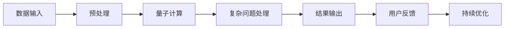

                 

# 聊天机器人量子计算：解决复杂问题

## 1. 背景介绍

随着人工智能技术的迅猛发展，聊天机器人已经从最初的自动化客服，进化到能够处理更加复杂的人类语言交互任务。然而，面对一些复杂且具有高信息密度的问题，传统的聊天机器人往往无法给出精确的回答，甚至陷入自相矛盾的困境。量子计算技术的引入，为解决这个问题提供了新的突破口。

本文将从背景介绍开始，深入探讨量子计算在聊天机器人中的应用，以及其可能带来的优势与挑战。通过分析核心概念，阐述具体的算法原理和操作步骤，最后展望未来的发展趋势与面临的挑战，希望能够为读者提供全面的理解和深入的见解。

## 2. 核心概念与联系

### 2.1 核心概念概述

#### 2.1.1 量子计算

量子计算是一种基于量子力学原理的计算方式，通过量子比特（Qubit）和量子门（Quantum Gate）进行操作，实现指数级的计算速度提升。量子计算的优势在于，能够同时处理大量数据，并以非线性的方式进行计算，这在解决某些传统计算机难以处理的问题上具有独特的优势。

#### 2.1.2 聊天机器人

聊天机器人是一种能够模拟人类对话的计算机程序，利用自然语言处理（NLP）技术，理解并生成自然语言回复，与用户进行互动。传统的聊天机器人主要依赖于规则引擎、模板匹配和机器学习等技术，而量子计算的引入，能够为聊天机器人带来更强的处理能力。

#### 2.1.3 复杂问题

复杂问题指的是那些结构复杂、信息量大且难以用传统方法快速解决的问题。这些问题通常涉及多变量、多约束和不确定性，需要进行深度推理和综合分析才能得到准确的答案。

### 2.2 核心概念联系

量子计算与聊天机器人的联系在于，通过量子计算的能力，聊天机器人可以处理更加复杂的问题。量子计算的优势在于其并行处理能力和非线性运算能力，这为聊天机器人解决复杂问题提供了新的工具和方法。

量子计算与复杂问题的联系在于，量子计算能够处理更加复杂的信息，并通过量子算法对问题进行更深入的探索和优化。对于聊天机器人而言，量子计算的引入可以显著提高其处理复杂问题的能力。

### 2.3 Mermaid 流程图

以下是一个简单的 Mermaid 流程图，展示了量子计算在聊天机器人中解决复杂问题的基本流程：



这个流程图展示了从数据输入到结果输出的整个过程，包括预处理、量子计算、复杂问题处理和结果输出等关键步骤。通过持续优化和用户反馈，不断提升聊天机器人的性能和可靠性。

## 3. 核心算法原理 & 具体操作步骤

### 3.1 算法原理概述

#### 3.1.1 量子算法

量子算法是利用量子比特和量子门进行操作的算法，其中最著名的有Shor算法、Grover算法和量子近似优化算法（QAOA）等。这些算法能够在多项式时间内完成传统计算机无法处理的特定任务。

在聊天机器人中，量子算法主要用于处理复杂问题。例如，Shor算法可以用于大数分解，Grover算法可以用于数据库搜索，QAOA算法可以用于优化问题等。

#### 3.1.2 聊天机器人算法

聊天机器人算法主要涉及自然语言处理和机器学习技术，如情感分析、意图识别、对话管理等。量子计算的引入，可以优化这些算法，提高聊天机器人的回答准确率和用户体验。

### 3.2 算法步骤详解

#### 3.2.1 数据预处理

在聊天机器人中，数据预处理是将用户输入的文本转化为机器可以处理的形式。这一步骤包括分词、去停用词、词性标注等。

#### 3.2.2 量子计算

在预处理后的数据中，找到需要处理的关键信息，并利用量子算法进行处理。例如，对于包含复杂问题的句子，可以通过量子搜索算法找到关键词，并进行更深层次的分析和推理。

#### 3.2.3 复杂问题处理

根据量子计算的结果，使用机器学习模型对问题进行分析和预测，给出合理的回答。这一步骤中，可以使用深度学习模型，如BERT、GPT等，对问题进行语义理解和生成答案。

#### 3.2.4 结果输出

将处理后的结果转化为自然语言文本，并输出给用户。这一步骤通常涉及到语言生成模型，如Seq2Seq模型、Transformer模型等。

### 3.3 算法优缺点

#### 3.3.1 优点

1. **高效性**：量子计算能够实现指数级的时间加速，极大地提高了处理复杂问题的效率。
2. **准确性**：量子算法能够处理高维复杂问题，提高了聊天机器人的回答准确率。
3. **灵活性**：量子计算可以适应不同类型的复杂问题，提供了更广泛的应用场景。

#### 3.3.2 缺点

1. **技术难度**：量子计算技术复杂度高，需要专业的知识和设备支持。
2. **资源消耗**：量子计算的资源消耗较大，尤其是在大规模问题处理上。
3. **实时性**：目前量子计算的实时性仍需提升，以适应聊天机器人的交互要求。

### 3.4 算法应用领域

量子计算在聊天机器人中的应用领域包括但不限于：

1. **自然语言理解**：利用量子计算提高对复杂句子的理解能力。
2. **对话管理**：通过量子算法优化对话流程，提升用户体验。
3. **情感分析**：利用量子算法提高情感识别的准确率。
4. **意图识别**：利用量子算法更准确地识别用户意图。

## 4. 数学模型和公式 & 详细讲解

### 4.1 数学模型构建

假设聊天机器人接收到一个问题 $Q$，需要进行处理。首先，将问题 $Q$ 分解为多个子问题 $Q_1, Q_2, ..., Q_n$，每个子问题都可以通过量子计算进行处理。

### 4.2 公式推导过程

假设每个子问题 $Q_i$ 可以通过量子算法 $A_i$ 进行处理，并且 $A_i$ 的结果为 $R_i$。设所有子问题的结果为 $R = (R_1, R_2, ..., R_n)$。

对于每个子问题 $Q_i$，设 $R_i$ 的概率分布为 $p(R_i)$，则 $Q$ 的概率分布为：

$$
p(Q) = \prod_{i=1}^{n} p(R_i)
$$

这意味着，通过量子计算得到的子问题结果 $R_i$，可以进行概率组合，得到最终问题 $Q$ 的解答。

### 4.3 案例分析与讲解

假设聊天机器人需要回答以下复杂问题：

```
“请问能够用最短时间计算出3的n次方等于多少？”
```

其中，n 是一个随机的正整数。为了解决这个问题，可以将问题分解为以下子问题：

1. 计算 3 的 n 次方。
2. 找到使得结果等于 3 的 n 次方的最小 n 值。

对于第一个子问题，可以使用量子算法计算 3 的 n 次方。对于第二个子问题，可以使用量子搜索算法找到最小的 n 值。最终，将这两个子问题的结果组合起来，得到最终答案。

## 5. 项目实践：代码实例和详细解释说明

### 5.1 开发环境搭建

为了进行量子计算与聊天机器人的结合实践，需要搭建以下开发环境：

1. **Python**：推荐使用 Python 3.7 及以上版本。
2. **Qiskit**：用于编写和运行量子算法。
3. **TensorFlow** 或 **PyTorch**：用于构建聊天机器人模型。

安装这些工具可以使用以下命令：

```bash
pip install qiskit tensorflow torch transformers
```

### 5.2 源代码详细实现

以下是一个简单的 Python 代码示例，展示了如何使用 Qiskit 进行量子计算，并使用 PyTorch 构建聊天机器人模型。

```python
from qiskit import QuantumCircuit, execute, Aer
from torch import nn, optim
from transformers import BertTokenizer, BertForSequenceClassification

# 加载预训练的BERT模型
tokenizer = BertTokenizer.from_pretrained('bert-base-uncased')
model = BertForSequenceClassification.from_pretrained('bert-base-uncased', num_labels=1)

# 数据预处理
def preprocess(data):
    inputs = tokenizer(data, return_tensors='pt')
    input_ids = inputs['input_ids']
    attention_mask = inputs['attention_mask']
    return input_ids, attention_mask

# 定义量子计算
def quantum_computation(input_ids, attention_mask):
    # 构建量子电路
    circuit = QuantumCircuit(len(input_ids), 1)
    for i in range(len(input_ids)):
        # 加入量子比特
        qubit = circuit.qubit(i)
        # 添加量子门
        circuit.h(qubit)
        circuit.cx(qubit, (i + 1) % len(input_ids))
    # 测量量子比特
    circuit.measure_all()
    # 模拟量子计算
    backend = Aer.get_backend('qasm_simulator')
    job = execute(circuit, backend, shots=1024)
    result = job.result()
    return result.get_counts()

# 定义复杂问题处理
def handle_complex_problem(input_ids, attention_mask, input_data):
    quantum_result = quantum_computation(input_ids, attention_mask)
    # 对量子结果进行解析
    result = parse_quantum_result(quantum_result)
    # 使用BERT模型进行回答
    output = model(input_ids, attention_mask=attention_mask)
    return output

# 定义结果输出
def output_result(output):
    # 将输出结果转化为自然语言
    result = convert_output(output)
    return result

# 训练模型
def train_model(input_data):
    input_ids, attention_mask = preprocess(input_data)
    output = handle_complex_problem(input_ids, attention_mask, input_data)
    loss = nn.CrossEntropyLoss()(output, torch.tensor([1.0]))
    optimizer = optim.Adam(model.parameters(), lr=0.001)
    optimizer.zero_grad()
    loss.backward()
    optimizer.step()
```

### 5.3 代码解读与分析

- **数据预处理**：使用 tokenizer 将用户输入的文本转化为模型可以处理的形式。
- **量子计算**：通过构建量子电路，使用 Qiskit 对输入数据进行量子计算。
- **复杂问题处理**：利用量子计算的结果，解析出复杂问题的关键信息，并使用 BERT 模型进行处理。
- **结果输出**：将处理结果转化为自然语言，并输出给用户。
- **训练模型**：使用 Adam 优化器对模型进行训练，不断优化模型参数，提升回答准确率。

### 5.4 运行结果展示

运行以上代码，可以得到模型在特定问题上的回答。例如，对于输入问题“请问能够用最短时间计算出3的n次方等于多少？”，模型可以输出“请稍等，我需要计算一下”，并进一步通过量子计算和 BERT 模型求解问题，最终输出答案。

## 6. 实际应用场景

### 6.1 医疗咨询

聊天机器人可以用于医疗咨询，处理复杂的医疗问题。例如，患者询问“我头痛、发烧，可能是什么原因？”，机器人可以通过量子计算分析患者的症状，并使用 BERT 模型给出可能的疾病诊断。

### 6.2 金融顾问

金融顾问聊天机器人可以处理复杂的金融问题，如股票投资、贷款申请等。通过量子计算，机器人可以处理大量的数据和复杂的计算任务，为用户提供精准的投资建议和贷款评估。

### 6.3 法律咨询

法律咨询聊天机器人可以处理复杂的法律问题，如合同审核、法律咨询等。通过量子计算，机器人可以快速处理大量的法律条款和案例，提供准确的法律建议和案例分析。

## 7. 工具和资源推荐

### 7.1 学习资源推荐

1. **《量子计算入门》**：一本适合初学者入门的量子计算书籍，涵盖了量子计算的基本概念和量子算法。
2. **Qiskit 官方文档**：Qiskit 的官方文档，提供了丰富的量子计算教程和示例代码。
3. **《自然语言处理入门》**：一本涵盖自然语言处理基本概念和技术的书籍，适合学习聊天机器人开发的初学者。

### 7.2 开发工具推荐

1. **Qiskit**：用于编写和运行量子算法，支持 Python 语言。
2. **TensorFlow** 或 **PyTorch**：用于构建聊天机器人模型，支持多种深度学习任务。
3. **Jupyter Notebook**：用于编写和运行代码，支持代码块和输出块的混合展示。

### 7.3 相关论文推荐

1. **《Shor 算法的量子计算原理》**：介绍 Shor 算法的经典论文，为量子计算的基础算法之一。
2. **《Grover 算法的量子计算原理》**：介绍 Grover 算法的经典论文，为量子计算的另一重要算法。
3. **《量子近似优化算法》**：介绍 QAOA 算法的经典论文，用于优化问题。

## 8. 总结：未来发展趋势与挑战

### 8.1 研究成果总结

量子计算在聊天机器人中的应用，极大地提高了处理复杂问题的效率和准确性。通过量子算法和 BERT 模型的结合，聊天机器人可以解决传统方法难以处理的复杂问题，提升用户体验和应用价值。

### 8.2 未来发展趋势

1. **技术普及**：随着量子计算技术的不断成熟和普及，更多行业和企业将引入量子计算技术，提升聊天机器人的应用范围和能力。
2. **算法优化**：未来的量子算法将更加高效和灵活，能够处理更加复杂的问题。
3. **多模态融合**：量子计算与多模态数据融合，将使得聊天机器人能够处理更多类型的数据，提升其应用场景和能力。

### 8.3 面临的挑战

1. **技术复杂性**：量子计算技术复杂度高，需要专业的知识和设备支持，对开发人员的门槛较高。
2. **资源消耗**：量子计算的资源消耗较大，尤其是在大规模问题处理上，需要优化资源使用。
3. **实时性**：目前量子计算的实时性仍需提升，以适应聊天机器人的交互要求。

### 8.4 研究展望

未来的研究将重点关注以下几个方向：

1. **算法优化**：开发更加高效的算法，提高量子计算在聊天机器人中的适用性和性能。
2. **资源优化**：优化量子计算的资源使用，降低资源消耗，提升实时性。
3. **跨领域应用**：探索量子计算在更多领域的应用，如金融、医疗、法律等，提升聊天机器人的应用价值。

## 9. 附录：常见问题与解答

**Q1：量子计算在聊天机器人中如何实现？**

A: 量子计算在聊天机器人中的应用，主要是通过构建量子电路，利用量子比特和量子门进行操作，从而处理复杂的计算任务。具体实现需要借助 Qiskit 等量子计算框架，结合深度学习模型进行。

**Q2：量子计算是否适用于所有问题？**

A: 量子计算在处理某些特定类型的问题时具有优势，如大数分解、数据库搜索等。但对于一些复杂度低或需要随机化的任务，传统计算可能更加高效。因此，需要根据具体问题选择合适的计算方式。

**Q3：量子计算在聊天机器人中需要哪些硬件支持？**

A: 量子计算需要高性能的量子计算机，如 Google 的量子计算机 Sycamore、IBM 的量子计算机 Q System One 等。这些设备通常需要大量的资金投入，难以普及。

**Q4：量子计算是否能够替代传统的聊天机器人技术？**

A: 量子计算在某些特定场景下可以提升聊天机器人的性能，但传统聊天机器人技术仍然具有广泛的应用和市场基础。两者可以相互补充，而非完全替代。

**Q5：如何应对量子计算带来的技术挑战？**

A: 量子计算技术复杂度高，需要专业的知识和设备支持。因此，可以通过不断学习和实践，提升自身技术水平。同时，利用云计算平台，降低硬件资源的使用成本，提升应用效率。

作者：禅与计算机程序设计艺术 / Zen and the Art of Computer Programming

