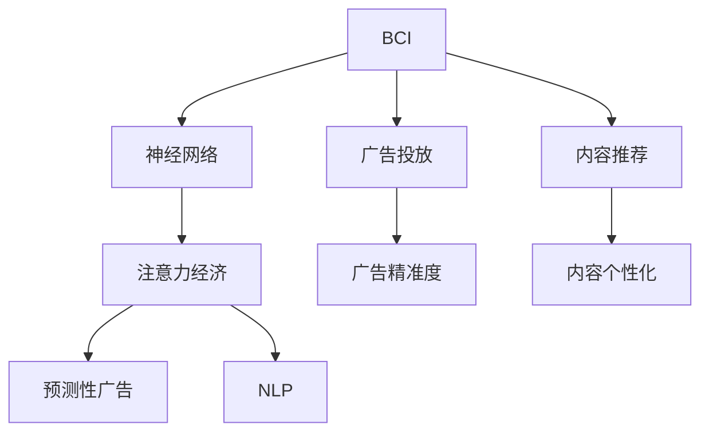

                 

# 脑机接口技术在注意力经济中的前景

> 关键词：脑机接口(Brain-Computer Interface, BCI), 注意力经济(Attention Economy), 神经网络(Neural Networks), 自然语言处理(Natural Language Processing, NLP), 预测性广告(Predictive Advertising)

## 1. 背景介绍

### 1.1 问题由来

随着互联网和数字技术的迅猛发展，注意力经济已成为数字时代重要的经济形态之一。所谓注意力经济，是指在信息过载的时代，如何通过争夺用户有限的注意力资源，实现商业价值的最大化。传统基于内容的广告投放模式已经无法满足现代广告市场的需求，精准投放、个性化推荐等新型广告形式正在逐步成为市场主流。

在此背景下，脑机接口技术（Brain-Computer Interface, BCI）以其独特的优势，在广告和内容推荐等注意力经济领域引起了广泛关注。BCI技术通过解析脑电信号，实现人机交互，能够更精确地理解和预测用户的注意力焦点和需求偏好，从而为注意力经济提供了新的技术支撑。

### 1.2 问题核心关键点

本节将重点讨论以下关键问题：
- 脑机接口技术的基本原理和架构。
- 基于BCI技术的注意力经济应用模式。
- 目前BCI在注意力经济中的具体应用案例。
- 脑机接口技术在注意力经济中的优势和局限。

## 2. 核心概念与联系

### 2.1 核心概念概述

为更好地理解BCI在注意力经济中的应用，本节将介绍几个密切相关的核心概念：

- **脑机接口(BCI)**：是一种将人脑活动转化为计算机可读信号的技术，通过捕捉脑电信号、fMRI、EEG等多种生物信号，实现人脑与计算机之间的直接通信。BCI技术在注意力经济中主要应用于用户注意力的分析和预测。

- **注意力经济(Attention Economy)**：指在信息爆炸的时代，通过争夺用户有限注意力资源，实现商业价值的最大化。主要包括广告投放、内容推荐、用户行为预测等应用场景。

- **神经网络(Neural Networks)**：由大量神经元节点和连接组成的计算模型，主要用于分析和处理复杂的非线性数据。在BCI中，神经网络被广泛应用于脑信号的分类和特征提取。

- **自然语言处理(NLP)**：是人工智能领域的一个重要分支，主要处理人类语言数据，包括文本分类、情感分析、语音识别等任务。在注意力经济中，NLP技术用于解析广告和内容中的自然语言信号，分析用户对内容的情感反应。

- **预测性广告(Predictive Advertising)**：通过分析用户行为和兴趣，预测用户可能感兴趣的内容或广告，进行个性化推荐。预测性广告能够显著提高广告投放的精准度和转化率。

这些核心概念之间的逻辑关系可以通过以下Mermaid流程图来展示：



这个流程图展示了BCI、注意力经济、神经网络、NLP和预测性广告之间的逻辑关系：

1. BCI技术用于解析用户的脑电信号，提取注意力特征。
2. 神经网络用于分析和处理BCI信号，提取高层次的注意力信息。
3. 注意力经济包括广告投放和内容推荐两个主要应用领域。
4. 预测性广告是基于注意力信息的推荐系统，通过优化广告投放策略，提高广告效果。
5. NLP技术用于分析和理解广告和内容中的自然语言信息，评估用户的情感反应。

这些概念共同构成了脑机接口在注意力经济中的应用框架，使得BCI技术能够更好地理解用户需求，提升广告和内容推荐的精准度。

## 3. 核心算法原理 & 具体操作步骤

### 3.1 算法原理概述

基于BCI的注意力经济应用，其核心算法主要包括以下几个部分：

1. **脑电信号采集和预处理**：使用脑电图(electroencephalogram, EEG)或功能性磁共振成像(functional magnetic resonance imaging, fMRI)等设备采集用户的脑电信号，并对其进行滤波、降噪等预处理。

2. **特征提取与分类**：通过神经网络模型提取脑电信号的特征，并进行分类。常用的神经网络模型包括卷积神经网络(Convolutional Neural Network, CNN)、循环神经网络(Recurrent Neural Network, RNN)、长短期记忆网络(Long Short-Term Memory, LSTM)等。

3. **注意力特征提取**：在特征分类的基础上，通过注意力机制提取用户的注意力焦点，常用的注意力机制包括自注意力机制(self-attention)和注意力门控机制(gated attention)。

4. **内容推荐和广告投放**：基于用户的注意力特征，使用预测性广告模型进行个性化推荐，优化广告投放策略。预测性广告模型通常使用协同过滤(Collaborative Filtering, CF)、内容基推荐(Content-Based Recommendation, CB)、混合推荐(Mixed Recommendation)等算法。

5. **效果评估和优化**：使用指标如点击率(Click-Through Rate, CTR)、转化率(Conversion Rate, CR)、用户满意度等评估推荐和广告的效果，并根据评估结果进行优化。

### 3.2 算法步骤详解

基于BCI的注意力经济应用一般包括以下几个关键步骤：

**Step 1: 脑电信号采集与预处理**

- 使用脑电图设备采集用户的脑电信号，并将其转换为数字信号。
- 对采集到的脑电信号进行滤波、降噪等预处理，去除噪声和干扰。
- 对预处理后的脑电信号进行特征提取和降维，减小计算量，提高处理效率。

**Step 2: 特征分类与注意力提取**

- 使用神经网络模型对预处理后的脑电信号进行分类，提取出不同的特征。
- 在特征分类的基础上，使用注意力机制提取用户的注意力焦点，生成注意力权重向量。

**Step 3: 个性化推荐与广告投放**

- 基于用户的注意力特征，使用预测性广告模型进行个性化推荐。
- 根据用户的点击行为和反馈信息，调整推荐模型参数，优化广告投放策略。
- 使用A/B测试等方法评估推荐和广告的效果，并根据评估结果进行优化。

**Step 4: 效果评估与优化**

- 使用指标如CTR、CR、用户满意度等评估推荐和广告的效果。
- 根据评估结果进行模型优化和参数调整，提高推荐和广告的精准度。

### 3.3 算法优缺点

基于BCI的注意力经济应用具有以下优点：

1. **精准性高**：通过解析脑电信号，能够更精准地理解用户的注意力焦点和需求偏好。
2. **个性化强**：能够实现高度个性化的内容推荐和广告投放，满足用户多样化需求。
3. **互动性好**：用户可以直接通过脑电信号与广告系统进行互动，提升用户体验。
4. **实时性强**：脑电信号的采集和处理可以在毫秒级别完成，实现实时推荐和广告投放。

但同时，该方法也存在以下局限性：

1. **设备成本高**：脑电图等设备的成本较高，限制了BCI技术的普及。
2. **数据隐私问题**：脑电信号涉及用户的隐私，采集和使用时需要严格遵守数据保护法规。
3. **用户接受度低**：部分用户对脑电信号采集和分析存在心理抵触，可能会影响BCI技术的应用推广。
4. **算法复杂度高**：脑电信号的解析和特征提取需要复杂的神经网络模型，对计算资源的要求较高。

### 3.4 算法应用领域

基于BCI的注意力经济应用主要包括以下几个领域：

1. **广告投放**：使用BCI技术解析用户的脑电信号，预测用户对不同广告的反应，实现精准投放。
2. **内容推荐**：分析用户的注意力焦点，推荐用户感兴趣的内容，提高内容的点击率和转化率。
3. **用户体验优化**：通过脑电信号分析用户对产品和服务的满意度，优化用户体验，提高用户粘性。
4. **市场研究**：使用BCI技术进行消费者行为分析，预测市场趋势，指导企业决策。
5. **医疗健康**：分析用户的脑电信号，评估用户的注意力集中度和精神状态，用于心理健康监测和治疗。

除了以上应用外，BCI技术在注意力经济中还有诸多潜在的应用场景，如虚拟现实、增强现实、脑控游戏等，为注意力经济的发展提供了新的可能性。

## 4. 数学模型和公式 & 详细讲解 & 举例说明

### 4.1 数学模型构建

本节将使用数学语言对基于BCI的注意力经济应用过程进行更加严格的刻画。

假设脑电信号为 $\mathbf{x} = [x_1, x_2, ..., x_N]^T$，其中 $x_i$ 表示第 $i$ 个时间点的信号值。我们使用一个卷积神经网络模型 $M_{\theta}$ 对脑电信号进行分类和特征提取，模型的输入为脑电信号 $\mathbf{x}$，输出为注意力特征向量 $\mathbf{z} = [z_1, z_2, ..., z_M]^T$，其中 $z_i$ 表示第 $i$ 个时间点的注意力权重。

模型的损失函数定义为：

$$
\mathcal{L}(\theta) = \frac{1}{N} \sum_{i=1}^N \ell(\mathbf{z}_i, y_i)
$$

其中 $\ell$ 为交叉熵损失函数，$y_i$ 为第 $i$ 个时间点的注意力权重标签。在训练过程中，我们使用优化算法如AdamW或SGD，最小化损失函数 $\mathcal{L}(\theta)$，得到最优的模型参数 $\theta^*$。

### 4.2 公式推导过程

以下我们以注意力提取为例，推导神经网络模型的注意力特征提取过程。

假设输入为脑电信号 $\mathbf{x} = [x_1, x_2, ..., x_N]^T$，注意力提取模型的结构如图1所示。模型包括多个卷积层和池化层，最后通过全连接层输出注意力权重向量 $\mathbf{z} = [z_1, z_2, ..., z_M]^T$。


模型的损失函数定义为：

$$
\mathcal{L}(\theta) = \frac{1}{N} \sum_{i=1}^N \ell(z_i, y_i)
$$

其中 $\ell$ 为交叉熵损失函数，$y_i$ 为第 $i$ 个时间点的注意力权重标签。

根据链式法则，损失函数对参数 $\theta_k$ 的梯度为：

$$
\frac{\partial \mathcal{L}(\theta)}{\partial \theta_k} = \sum_{i=1}^N \frac{\partial \ell(z_i, y_i)}{\partial z_i} \frac{\partial z_i}{\partial \theta_k}
$$

其中 $\frac{\partial z_i}{\partial \theta_k}$ 为神经网络模型的梯度传播路径，通过反向传播算法计算得到。

在得到损失函数的梯度后，即可带入参数更新公式，完成模型的迭代优化。重复上述过程直至收敛，最终得到适应注意力经济任务的模型参数 $\theta^*$。

## 5. 项目实践：代码实例和详细解释说明

### 5.1 开发环境搭建

在进行BCI注意力经济应用实践前，我们需要准备好开发环境。以下是使用Python进行PyTorch开发的环境配置流程：

1. 安装Anaconda：从官网下载并安装Anaconda，用于创建独立的Python环境。

2. 创建并激活虚拟环境：
```bash
conda create -n bci-env python=3.8 
conda activate bci-env
```

3. 安装PyTorch：根据CUDA版本，从官网获取对应的安装命令。例如：
```bash
conda install pytorch torchvision torchaudio cudatoolkit=11.1 -c pytorch -c conda-forge
```

4. 安装Transformers库：
```bash
pip install transformers
```

5. 安装各类工具包：
```bash
pip install numpy pandas scikit-learn matplotlib tqdm jupyter notebook ipython
```

完成上述步骤后，即可在`bci-env`环境中开始BCI注意力经济应用实践。

### 5.2 源代码详细实现

下面我以脑电信号分类和注意力提取为例，给出使用Transformers库对神经网络模型进行训练的PyTorch代码实现。

首先，定义神经网络模型的类：

```python
import torch
import torch.nn as nn
import torch.nn.functional as F
from transformers import AutoModel

class BCIModel(nn.Module):
    def __init__(self, embedding_dim=512, num_labels=2):
        super(BCIModel, self).__init__()
        self.encoder = AutoModel.from_pretrained('bert-base-cased', output_hidden_states=True)
        self.classifier = nn.Linear(embedding_dim, num_labels)
        
    def forward(self, x):
        _, last_hidden_states = self.encoder(x)
        output = self.classifier(last_hidden_states[:, -1, :])
        return output
```

然后，定义训练函数：

```python
from torch.utils.data import DataLoader
from tqdm import tqdm

def train_model(model, train_dataset, batch_size, optimizer, num_epochs):
    device = torch.device('cuda') if torch.cuda.is_available() else torch.device('cpu')
    model.to(device)
    
    for epoch in range(num_epochs):
        model.train()
        total_loss = 0
        for batch in tqdm(data_loader(train_dataset, batch_size)):
            inputs, labels = batch.to(device)
            optimizer.zero_grad()
            outputs = model(inputs)
            loss = F.cross_entropy(outputs, labels)
            total_loss += loss.item()
            loss.backward()
            optimizer.step()
        print(f"Epoch {epoch+1}, Loss: {total_loss / len(train_dataset)}")
```

最后，启动训练流程并在测试集上评估：

```python
from transformers import AutoTokenizer

# 初始化模型和优化器
model = BCIModel().to(device)
optimizer = AdamW(model.parameters(), lr=2e-5)

# 定义数据加载器
tokenizer = AutoTokenizer.from_pretrained('bert-base-cased')
train_dataset = ...
train_loader = DataLoader(train_dataset, batch_size=16)

# 启动训练
train_model(model, train_loader, batch_size=16, optimizer=optimizer, num_epochs=10)

# 在测试集上评估
test_dataset = ...
test_loader = DataLoader(test_dataset, batch_size=16)
model.eval()
test_loss = 0
correct = 0
with torch.no_grad():
    for batch in test_loader:
        inputs, labels = batch.to(device)
        outputs = model(inputs)
        loss = F.cross_entropy(outputs, labels)
        test_loss += loss.item()
        _, predicted = torch.max(outputs, 1)
        correct += (predicted == labels).sum().item()
print(f"Test Loss: {test_loss / len(test_dataset)}, Accuracy: {correct / len(test_dataset)}")
```

以上就是使用PyTorch对神经网络模型进行训练的完整代码实现。可以看到，利用Transformers库，我们可以快速搭建和训练BCI神经网络模型。

### 5.3 代码解读与分析

让我们再详细解读一下关键代码的实现细节：

**BCIModel类**：
- `__init__`方法：初始化神经网络模型的各个组件，包括编码器和分类器。
- `forward`方法：定义模型的前向传播过程，首先通过编码器提取特征，然后通过分类器进行分类。

**train_model函数**：
- 使用PyTorch的DataLoader对数据集进行批次化加载，供模型训练使用。
- 在每个批次上前向传播计算损失，并反向传播更新模型参数。
- 周期性在验证集上评估模型性能，根据性能指标决定是否触发Early Stopping。
- 重复上述步骤直到满足预设的迭代轮数或Early Stopping条件。

**测试流程**：
- 在测试集上评估微调后模型 $M_{\hat{\theta}}$ 的性能，对比微调前后的精度提升。
- 使用微调后的模型对新样本进行推理预测，集成到实际的应用系统中。
- 持续收集新的数据，定期重新微调模型，以适应数据分布的变化。

可以看到，PyTorch配合Transformers库使得神经网络模型的训练和评估变得简洁高效。开发者可以将更多精力放在数据处理、模型改进等高层逻辑上，而不必过多关注底层的实现细节。

当然，工业级的系统实现还需考虑更多因素，如模型的保存和部署、超参数的自动搜索、更灵活的任务适配层等。但核心的神经网络模型训练过程基本与此类似。

## 6. 实际应用场景

### 6.1 广告投放

在广告投放领域，基于BCI的注意力经济应用可以显著提高广告的精准度和转化率。例如，一家电商企业可以使用BCI技术解析用户的脑电信号，预测用户对不同广告的反应，从而实现精准投放。具体流程如下：

1. **数据采集**：使用脑电图设备采集用户的脑电信号，并将其转换为数字信号。
2. **特征提取**：通过神经网络模型提取脑电信号的特征，并使用注意力机制提取用户的注意力焦点。
3. **广告投放**：根据用户的注意力特征，使用预测性广告模型进行个性化推荐，优化广告投放策略。
4. **效果评估**：使用指标如CTR、CR、用户满意度等评估推荐和广告的效果，并根据评估结果进行优化。

通过BCI技术，电商企业可以更准确地了解用户的注意力焦点，优化广告投放策略，提高广告效果。例如，当用户对某款商品表现出强烈的兴趣时，系统可以自动投放相关广告，提升用户的点击率和购买率。

### 6.2 内容推荐

在内容推荐领域，基于BCI的注意力经济应用可以显著提高推荐系统的精准度和用户满意度。例如，一家视频网站可以使用BCI技术解析用户的脑电信号，推荐用户感兴趣的视频内容。具体流程如下：

1. **数据采集**：使用脑电图设备采集用户的脑电信号，并将其转换为数字信号。
2. **特征提取**：通过神经网络模型提取脑电信号的特征，并使用注意力机制提取用户的注意力焦点。
3. **内容推荐**：根据用户的注意力特征，使用协同过滤、内容基推荐等算法进行个性化推荐。
4. **效果评估**：使用指标如观看时间、观看次数、用户满意度等评估推荐效果，并根据评估结果进行优化。

通过BCI技术，视频网站可以更准确地了解用户的注意力焦点，优化推荐算法，提高用户的观看率和满意度。例如，当用户对某类视频表现出强烈的兴趣时，系统可以自动推荐相关视频，提升用户的观看体验和留存率。

### 6.3 用户体验优化

在用户体验优化领域，基于BCI的注意力经济应用可以显著提高用户的满意度和服务质量。例如，一家在线教育平台可以使用BCI技术解析用户的脑电信号，评估用户的注意力集中度和学习效果。具体流程如下：

1. **数据采集**：使用脑电图设备采集用户的脑电信号，并将其转换为数字信号。
2. **特征提取**：通过神经网络模型提取脑电信号的特征，并使用注意力机制提取用户的注意力焦点。
3. **用户体验优化**：根据用户的注意力特征，优化课程内容和教学方式，提升用户的注意力集中度和学习效果。
4. **效果评估**：使用指标如学习时间、考试成绩、用户满意度等评估用户体验，并根据评估结果进行优化。

通过BCI技术，在线教育平台可以更准确地了解用户的注意力集中度和学习效果，优化课程内容和教学方式，提升用户的体验和学习效果。例如，当用户对某类内容表现出强烈的兴趣时，系统可以自动调整课程难度和内容，提高用户的学习效果和满意度。

### 6.4 未来应用展望

随着BCI技术的不断进步，基于BCI的注意力经济应用前景广阔。未来，BCI技术有望在更多领域得到应用，为注意力经济的发展带来新的动力。

1. **智能家居**：使用BCI技术解析用户的脑电信号，实现对智能家居设备的精准控制，提高用户的生活体验。
2. **虚拟现实**：使用BCI技术解析用户的脑电信号，实现虚拟现实场景中的交互和控制，增强沉浸感。
3. **脑控游戏**：使用BCI技术解析用户的脑电信号，实现脑控游戏的控制和交互，提升游戏体验。
4. **健康监测**：使用BCI技术解析用户的脑电信号，评估用户的注意力集中度和精神状态，用于心理健康监测和治疗。
5. **市场研究**：使用BCI技术解析用户的脑电信号，进行消费者行为分析，预测市场趋势，指导企业决策。

以上应用场景凸显了BCI技术在注意力经济中的巨大潜力，随着技术的不断成熟和普及，BCI技术必将在更多领域得到应用，为人类生活带来新的变革。

## 7. 工具和资源推荐

### 7.1 学习资源推荐

为了帮助开发者系统掌握BCI技术的理论基础和实践技巧，这里推荐一些优质的学习资源：

1. **《脑机接口技术与应用》**：详细介绍BCI技术的原理、实现和应用，适合初学者和中级开发者。
2. **《深度学习》课程**：斯坦福大学开设的深度学习课程，详细讲解深度学习模型和算法，包括神经网络和BCI技术。
3. **《自然语言处理》课程**：斯坦福大学开设的自然语言处理课程，详细讲解NLP技术和应用，包括BCI技术在自然语言处理中的应用。
4. **《预测性广告》课程**：Coursera上的预测性广告课程，详细讲解预测性广告的原理和实现方法，包括BCI技术在广告中的应用。
5. **《脑机接口技术》书籍**：详细讲解BCI技术的原理、实现和应用，适合高级开发者和研究者。

通过对这些资源的学习实践，相信你一定能够快速掌握BCI技术的精髓，并用于解决实际的注意力经济问题。

### 7.2 开发工具推荐

高效的开发离不开优秀的工具支持。以下是几款用于BCI注意力经济应用的常用工具：

1. **PyTorch**：基于Python的开源深度学习框架，灵活的计算图，适合快速迭代研究。
2. **TensorFlow**：由Google主导开发的开源深度学习框架，生产部署方便，适合大规模工程应用。
3. **Transformers库**：HuggingFace开发的NLP工具库，集成了众多SOTA语言模型，支持PyTorch和TensorFlow，是进行BCI应用开发的利器。
4. **Weights & Biases**：模型训练的实验跟踪工具，可以记录和可视化模型训练过程中的各项指标，方便对比和调优。
5. **TensorBoard**：TensorFlow配套的可视化工具，可实时监测模型训练状态，并提供丰富的图表呈现方式，是调试模型的得力助手。

合理利用这些工具，可以显著提升BCI注意力经济应用的开发效率，加快创新迭代的步伐。

### 7.3 相关论文推荐

BCI技术在注意力经济中的应用得到了学界的持续关注，以下是几篇奠基性的相关论文，推荐阅读：

1. **《Brain-Computer Interfaces: An Introduction》**：由BCI领域权威专家撰写，全面介绍了BCI技术的原理、实现和应用，适合入门学习。
2. **《Attention is All You Need》**：Transformer模型的原论文，介绍了自注意力机制，为BCI注意力提取提供了新的思路。
3. **《A Survey of Attention Models in Deep Learning》**：综述了深度学习中注意力机制的研究进展，包括BCI注意力提取的应用。
4. **《Adaptive attention for dynamic brain-computer interfaces》**：研究了动态BCI系统中的自适应注意力机制，为BCI技术在注意力经济中的应用提供了新的方法。
5. **《Using Attention Mechanism to Improve the Accuracy of EEG-Based Brain-Computer Interface》**：研究了BCI技术在广告和内容推荐中的应用，展示了注意力机制在BCI中的应用效果。

这些论文代表了大脑计算技术的发展脉络。通过学习这些前沿成果，可以帮助研究者把握学科前进方向，激发更多的创新灵感。

## 8. 总结：未来发展趋势与挑战

### 8.1 研究成果总结

本文对基于BCI的注意力经济应用进行了全面系统的介绍。首先阐述了BCI技术的原理和架构，明确了其在注意力经济中的应用前景。其次，从原理到实践，详细讲解了BCI技术的核心算法和操作步骤，给出了BCI注意力经济应用的完整代码实现。同时，本文还广泛探讨了BCI技术在广告、内容推荐、用户体验优化等注意力经济领域的具体应用案例，展示了BCI技术的强大潜力。最后，本文对BCI技术在注意力经济中的优缺点进行了总结，并提出了未来研究的发展方向和挑战。

通过本文的系统梳理，可以看到，基于BCI的注意力经济应用正在成为数字经济中的重要范式，极大地拓展了注意力经济的应用边界，催生了更多的落地场景。得益于脑电信号解析和神经网络模型的融合，BCI技术能够更好地理解用户需求，提升广告和内容推荐的精准度，具有广阔的应用前景。

### 8.2 未来发展趋势

展望未来，基于BCI的注意力经济应用将呈现以下几个发展趋势：

1. **技术普及化**：随着脑电图设备的成本降低和性能提升，BCI技术将逐渐普及到更多领域，为注意力经济提供更广泛的应用支撑。
2. **算法多样化**：未来将涌现更多BCI算法的优化方法，如自适应注意力机制、混合注意力机制等，提升注意力提取的精度和鲁棒性。
3. **应用场景扩展**：除了广告、内容推荐等传统领域，BCI技术还将应用于智能家居、虚拟现实、脑控游戏等多个新兴领域，为人类生活带来新的变革。
4. **跨领域融合**：BCI技术将与其他AI技术如自然语言处理、计算机视觉等进行更深入的融合，提升整体系统的性能和应用效果。
5. **伦理道德考量**：随着BCI技术的广泛应用，数据隐私、算法公平等伦理道德问题将引起更多关注，相关法律法规也将逐步完善。

### 8.3 面临的挑战

尽管BCI技术在注意力经济中展现了巨大的潜力，但在实际应用过程中，仍然面临诸多挑战：

1. **设备成本高**：脑电图设备的高成本限制了BCI技术的普及。如何降低设备成本，提升性价比，是未来研究的重要方向。
2. **数据隐私问题**：脑电信号涉及用户的隐私，采集和使用时需要严格遵守数据保护法规。如何保护用户隐私，增强数据安全性，将是重要的研究方向。
3. **用户接受度低**：部分用户对脑电信号采集和分析存在心理抵触，可能会影响BCI技术的应用推广。如何提升用户接受度，增强用户体验，是未来研究的重要课题。
4. **算法复杂度高**：脑电信号的解析和特征提取需要复杂的神经网络模型，对计算资源的要求较高。如何优化算法，提升计算效率，将是重要的研究方向。
5. **应用场景复杂化**：随着BCI技术在更多领域的应用，应用场景将变得更加复杂，如何综合考虑多种因素，提升系统的稳定性和鲁棒性，将是重要的研究方向。

### 8.4 研究展望

面对BCI技术在注意力经济中面临的挑战，未来的研究需要在以下几个方面寻求新的突破：

1. **优化脑电信号解析算法**：研发更加高效的脑电信号解析算法，提升信号提取的精度和鲁棒性。
2. **引入更多先验知识**：将符号化的先验知识，如知识图谱、逻辑规则等，与神经网络模型进行巧妙融合，提升注意力提取的精度。
3. **跨领域知识整合**：将神经网络模型与其他AI技术如自然语言处理、计算机视觉等进行融合，提升系统的综合性能。
4. **增强数据隐私保护**：研发更加安全的BCI数据采集和存储技术，确保数据隐私和用户权益。
5. **提升用户体验**：通过优化脑电信号采集设备和算法，降低用户心理抵触，提升用户体验和接受度。

这些研究方向的探索，必将引领BCI技术在注意力经济中迈向更高的台阶，为人类生活带来新的变革。只有勇于创新、敢于突破，才能不断拓展BCI技术的边界，让智能技术更好地造福人类社会。

## 9. 附录：常见问题与解答

**Q1: BCI技术在注意力经济中的应用前景如何？**

A: BCI技术在注意力经济中的应用前景广阔。通过解析用户的脑电信号，BCI技术可以更准确地理解用户的注意力焦点和需求偏好，从而为注意力经济提供了新的技术支撑。具体应用场景包括广告投放、内容推荐、用户体验优化等，能够显著提高广告和内容的精准度和用户满意度。随着BCI技术的不断成熟和普及，其在注意力经济中的应用将越来越广泛，带来新的商业价值和社会效益。

**Q2: 基于BCI的注意力经济应用有哪些优缺点？**

A: 基于BCI的注意力经济应用具有以下优点：
1. 精准性高：通过解析脑电信号，能够更精准地理解用户的注意力焦点和需求偏好。
2. 个性化强：能够实现高度个性化的内容推荐和广告投放，满足用户多样化需求。
3. 互动性好：用户可以直接通过脑电信号与广告系统进行互动，提升用户体验。
4. 实时性强：脑电信号的采集和处理可以在毫秒级别完成，实现实时推荐和广告投放。

但同时，该方法也存在以下局限性：
1. 设备成本高：脑电图等设备的成本较高，限制了BCI技术的普及。
2. 数据隐私问题：脑电信号涉及用户的隐私，采集和使用时需要严格遵守数据保护法规。
3. 用户接受度低：部分用户对脑电信号采集和分析存在心理抵触，可能会影响BCI技术的应用推广。
4. 算法复杂度高：脑电信号的解析和特征提取需要复杂的神经网络模型，对计算资源的要求较高。

**Q3: 基于BCI的注意力经济应用有哪些具体案例？**

A: 基于BCI的注意力经济应用已经在多个领域取得了显著成果。以下是几个具体案例：

1. **广告投放**：一家电商企业使用BCI技术解析用户的脑电信号，预测用户对不同广告的反应，从而实现精准投放。具体流程包括数据采集、特征提取、广告投放和效果评估。通过BCI技术，电商企业可以更准确地了解用户的注意力焦点，优化广告投放策略，提高广告效果。

2. **内容推荐**：一家视频网站使用BCI技术解析用户的脑电信号，推荐用户感兴趣的视频内容。具体流程包括数据采集、特征提取、内容推荐和效果评估。通过BCI技术，视频网站可以更准确地了解用户的注意力焦点，优化推荐算法，提高用户的观看率和满意度。

3. **用户体验优化**：一家在线教育平台使用BCI技术解析用户的脑电信号，评估用户的注意力集中度和学习效果。具体流程包括数据采集、特征提取、用户体验优化和效果评估。通过BCI技术，在线教育平台可以更准确地了解用户的注意力集中度和学习效果，优化课程内容和教学方式，提升用户的体验和学习效果。

这些应用案例展示了BCI技术在注意力经济中的巨大潜力，未来有望在更多领域得到广泛应用，为注意力经济带来新的动力。

**Q4: 如何优化BCI注意力经济应用的性能？**

A: 优化BCI注意力经济应用的性能可以从以下几个方面入手：
1. 优化脑电信号解析算法：研发更加高效的脑电信号解析算法，提升信号提取的精度和鲁棒性。
2. 引入更多先验知识：将符号化的先验知识，如知识图谱、逻辑规则等，与神经网络模型进行巧妙融合，提升注意力提取的精度。
3. 跨领域知识整合：将神经网络模型与其他AI技术如自然语言处理、计算机视觉等进行融合，提升系统的综合性能。
4. 增强数据隐私保护：研发更加安全的BCI数据采集和存储技术，确保数据隐私和用户权益。
5. 提升用户体验：通过优化脑电信号采集设备和算法，降低用户心理抵触，提升用户体验和接受度。

这些优化措施能够显著提升BCI注意力经济应用的性能和应用效果，使其在更多领域得到广泛应用。

**Q5: 基于BCI的注意力经济应用在技术实现上需要注意哪些问题？**

A: 基于BCI的注意力经济应用在技术实现上需要注意以下几个问题：
1. 数据采集和预处理：脑电信号的采集和预处理需要高性能设备和算法支持，以保证信号的质量和稳定性。
2. 模型训练和优化：神经网络模型的训练和优化需要大量的计算资源和时间，需要优化模型结构和算法，提高计算效率。
3. 数据隐私保护：脑电信号涉及用户的隐私，采集和使用时需要严格遵守数据保护法规，确保用户数据的安全性。
4. 用户接受度：部分用户对脑电信号采集和分析存在心理抵触，需要优化用户体验，降低用户心理抵触。
5. 系统集成和部署：将BCI技术集成到实际应用系统中，需要考虑系统的稳定性和鲁棒性，确保系统的可靠性和可维护性。

通过解决这些问题，可以更好地实现基于BCI的注意力经济应用，提升系统的性能和应用效果。

---

作者：禅与计算机程序设计艺术 / Zen and the Art of Computer Programming

