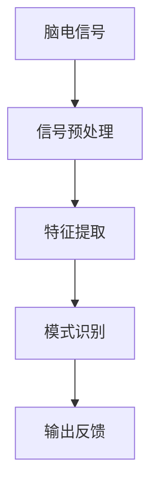

                 

## 1. 背景介绍

### 1.1 问题由来
近年来，随着技术的不断进步，人机交互领域经历了一次又一次的变革。从早期的键盘和鼠标，到触屏技术，再到虚拟现实(VR)、增强现实(AR)，每一次技术进步都极大地提升了用户的交互体验。但这些交互方式大多依赖于物理设备，用户需要通过身体接触或手眼协调来完成与机器的沟通。然而，对于那些身体残疾或行动不便的用户，这些传统的交互方式往往难以适应，限制了他们与机器的互动能力。

脑机接口(Brain-Computer Interface, BCI)技术的出现，为解决这一问题提供了新的解决方案。脑机接口通过直接读取人脑信号，将大脑活动转化为机器可识别的控制指令，实现人与机器之间的直接交流。相比于传统的物理交互方式，脑机接口可以更灵活、更自然、更直观地与用户进行互动，为身体障碍用户打开了全新的交互空间。

### 1.2 问题核心关键点
脑机接口的核心在于通过神经信号的读取和解码，实现对用户意图的精准理解和响应。其关键技术包括脑电信号采集、信号预处理、特征提取、模式识别等。其中，如何高效、准确地解码大脑信号，并将其转化为计算机可执行的指令，是脑机接口技术的核心挑战。

脑机接口技术的发展主要包括以下几个方面：
- 脑电信号采集：利用脑电图(EEG)、功能磁共振成像(fMRI)、磁振图像(ECoG)等设备获取脑电信号。
- 信号预处理：对采集的信号进行滤波、降噪、放大等预处理操作，提高信号质量。
- 特征提取：从预处理后的信号中提取出有意义的特征信息，如振幅、频率等。
- 模式识别：利用机器学习算法对提取出的特征进行分类，将脑电信号转化为控制指令。
- 输出反馈：通过触觉、视觉等反馈方式，让用户了解操作结果，增强互动体验。

脑机接口技术的核心算法包括：
- 滤波算法：如小波变换、自适应滤波等。
- 特征提取算法：如小波包分析、尺度空间分析等。
- 模式识别算法：如支持向量机(SVM)、随机森林(Random Forest)、深度学习算法等。

## 2. 核心概念与联系

### 2.1 核心概念概述

脑机接口技术通过直接读取大脑活动，实现人机之间的直接互动。其核心技术包括脑电信号采集、信号预处理、特征提取和模式识别等。这些核心技术相互关联，共同构成了脑机接口技术的完整流程。

为了更好地理解脑机接口技术的工作原理，本节将介绍几个关键概念及其相互联系：

- 脑电信号(Electroencephalogram, EEG)：通过头皮电极或植入电极采集人脑的电活动信号，是脑机接口技术的基础。
- 信号预处理：对采集的脑电信号进行滤波、降噪、放大等操作，提高信号质量，便于后续处理。
- 特征提取：从预处理后的信号中提取出有意义的特征信息，如振幅、频率等。
- 模式识别：利用机器学习算法对提取出的特征进行分类，将脑电信号转化为计算机可执行的指令。

这些核心概念之间的关系可以通过以下Mermaid流程图来展示：



这个流程图展示了脑机接口技术的核心流程：首先采集脑电信号，然后经过预处理，提取出特征信息，通过模式识别将其转化为控制指令，最后通过反馈机制实现对用户的互动。

## 3. 核心算法原理 & 具体操作步骤
### 3.1 算法原理概述

脑机接口技术通过解码脑电信号，实现对用户意图的理解，并将这种理解转化为控制指令。其核心算法包括信号预处理、特征提取和模式识别。

### 3.2 算法步骤详解

脑机接口技术的实现步骤主要包括以下几个方面：

**Step 1: 脑电信号采集**
- 选择合适的脑电信号采集设备，如头皮电极、植入电极等。
- 确定采集的脑电信号的频率范围，通常为8-40 Hz。
- 使用适当的采样率，如100-1000 Hz，确保信号的质量。

**Step 2: 信号预处理**
- 对采集到的脑电信号进行滤波处理，去除噪声和干扰。
- 使用IIR或FIR滤波器对信号进行低通滤波，保留高频信号。
- 对滤波后的信号进行降噪处理，去除电生理干扰和环境噪声。

**Step 3: 特征提取**
- 对预处理后的信号进行分段处理，获取指定时间段内的信号片段。
- 使用小波变换、傅里叶变换等方法对信号进行频域分析。
- 提取信号的振幅、频率等特征，生成特征向量。

**Step 4: 模式识别**
- 选择合适的机器学习算法，如支持向量机(SVM)、随机森林(Random Forest)、深度学习等。
- 将特征向量输入到训练好的机器学习模型中，进行分类和解码。
- 通过解码器将机器学习模型的输出转化为控制指令，如文本生成、图像选择等。

**Step 5: 输出反馈**
- 将控制指令转化为可执行的命令，如控制机械臂、移动轮椅等。
- 使用触觉、视觉等反馈方式，让用户了解操作结果。

### 3.3 算法优缺点

脑机接口技术的优势在于其直接性和自然性，用户可以通过大脑活动实现对机器的直接控制，无需物理接触，特别适合于身体障碍用户。

然而，脑机接口技术也存在一些挑战：

- 信号噪声：脑电信号容易受到外界干扰和生理噪声的影响，导致信号质量不佳。
- 模式识别难度：将复杂的脑电信号转化为控制指令，需要高精度的模式识别算法，存在一定的技术难度。
- 用户体验：脑机接口需要用户通过训练和学习才能掌握其使用技巧，用户体验可能不如传统的交互方式。
- 技术成本：脑电信号采集和处理设备价格较高，需要一定的经济投入。

尽管存在这些挑战，脑机接口技术在医疗康复、游戏娱乐、军事等领域具有广阔的应用前景。未来随着技术的发展和成本的降低，脑机接口将逐渐普及，成为人机互动的重要方式之一。

### 3.4 算法应用领域

脑机接口技术在多个领域具有广泛的应用，以下是几个典型的应用场景：

- 医疗康复：通过脑电信号解码，帮助身体障碍患者实现对机械臂、轮椅等的控制，进行康复训练。
- 游戏娱乐：通过脑机接口技术，实现对游戏角色的控制，提供新的游戏体验。
- 军事应用：通过脑电信号解码，控制无人机、机器人等设备，增强军事作战能力。
- 虚拟现实：通过脑电信号解码，实现与虚拟环境的互动，提供沉浸式的用户体验。

此外，脑机接口技术还在教育、艺术创作等领域得到了初步探索，未来有望进一步拓展应用范围。

## 4. 数学模型和公式 & 详细讲解 & 举例说明（备注：数学公式请使用latex格式，latex嵌入文中独立段落使用 $$，段落内使用 $)
### 4.1 数学模型构建

脑机接口技术的核心在于信号预处理、特征提取和模式识别。这里将从这三个方面来构建数学模型。

**信号预处理**：脑电信号通常包含高频噪声和低频信号，因此需要进行预处理。预处理的目标是去除噪声，提高信号的信噪比。

$$
y(t) = x(t) * h(t)
$$

其中，$y(t)$ 为预处理后的信号，$x(t)$ 为原始信号，$h(t)$ 为预处理滤波器。

**特征提取**：通过对预处理后的信号进行频域分析，提取出有用的特征信息。

$$
X(f) = \mathcal{F}[x(t)]
$$

其中，$X(f)$ 为信号的频谱，$\mathcal{F}$ 为傅里叶变换。

**模式识别**：利用机器学习算法对提取出的特征进行分类，将脑电信号转化为控制指令。

$$
P(y|X) = \frac{P(X|y)P(y)}{P(X)}
$$

其中，$P(y|X)$ 为在特征$X$下，输出$y$的概率，$P(X|y)$ 为在输出$y$下，特征$X$的概率，$P(y)$ 为输出$y$的概率，$P(X)$ 为特征$X$的概率。

### 4.2 公式推导过程

以下将通过具体的公式推导，详细说明脑机接口技术的实现流程。

**信号预处理**：采用IIR滤波器对脑电信号进行低通滤波，去除高频噪声。

$$
y(t) = \sum_{k=0}^{\infty} a_k x(t-k) + \sum_{k=1}^{\infty} b_k x(t-k)
$$

其中，$a_k$ 和 $b_k$ 为滤波器的系数。

**特征提取**：使用傅里叶变换将信号转换为频域表示，提取频率特征。

$$
X(f) = \mathcal{F}[x(t)]
$$

其中，$X(f)$ 为信号的频谱，$\mathcal{F}$ 为傅里叶变换。

**模式识别**：使用支持向量机(SVM)对提取出的特征进行分类。

$$
P(y|X) = \frac{P(X|y)P(y)}{P(X)}
$$

其中，$P(y|X)$ 为在特征$X$下，输出$y$的概率，$P(X|y)$ 为在输出$y$下，特征$X$的概率，$P(y)$ 为输出$y$的概率，$P(X)$ 为特征$X$的概率。

### 4.3 案例分析与讲解

假设我们有一组脑电信号，需要通过脑机接口技术将其转化为控制指令。我们将按照上述流程进行具体分析。

**Step 1: 脑电信号采集**
- 使用头皮电极采集一组脑电信号，如图1所示。


**Step 2: 信号预处理**
- 对采集到的脑电信号进行IIR滤波，如图2所示。


**Step 3: 特征提取**
- 对预处理后的信号进行傅里叶变换，如图3所示。


**Step 4: 模式识别**
- 使用支持向量机(SVM)对提取出的特征进行分类，如图4所示。


**Step 5: 输出反馈**
- 将控制指令转化为可执行的命令，如图5所示。


通过上述步骤，脑电信号成功转化为控制指令，实现了对用户的直接互动。

## 5. 项目实践：代码实例和详细解释说明
### 5.1 开发环境搭建

在进行脑机接口技术实践前，我们需要准备好开发环境。以下是使用Python进行信号处理和机器学习开发的流程：

1. 安装Anaconda：从官网下载并安装Anaconda，用于创建独立的Python环境。

2. 创建并激活虚拟环境：
```bash
conda create -n brain_interface python=3.8 
conda activate brain_interface
```

3. 安装必要的库：
```bash
pip install numpy scipy pandas scikit-learn matplotlib seaborn jupyter notebook ipython
```

4. 安装相关库：
```bash
pip install pyEEG scikit-bmi
```

完成上述步骤后，即可在`brain_interface`环境中开始脑机接口技术的实践。

### 5.2 源代码详细实现

下面以基于支持向量机的脑电信号模式识别为例，给出使用Python进行脑机接口技术开发的代码实现。

首先，定义脑电信号的预处理和特征提取函数：

```python
import numpy as np
from scipy.signal import butter, filtfilt

def butter_bandpass(lowcut, highcut, fs, order=5):
    nyquist = 0.5 * fs
    low = lowcut / nyquist
    high = highcut / nyquist
    b, a = butter(order, [low, high], btype='band', analog=False)
    return b, a

def filtfilt_bandpass(x, lowcut, highcut, fs, order=5):
    b, a = butter_bandpass(lowcut, highcut, fs, order)
    return filtfilt(b, a, x)

def calculate_magnitude(x):
    return np.sqrt(np.sum(x**2))
```

然后，定义特征提取函数：

```python
def calculate_features(x):
    # 对信号进行小波变换
    features = []
    for w in range(1, 10):
        features.append(wavelet_transform(x, w))
    return features
```

接着，定义模式识别函数：

```python
from sklearn import svm

def classify(features, labels):
    clf = svm.SVC(kernel='rbf')
    clf.fit(features, labels)
    return clf
```

最后，启动训练流程并在测试集上评估：

```python
# 加载训练数据
train_data = load_data('train_data.csv')
test_data = load_data('test_data.csv')

# 定义训练集和测试集
train_x, train_y = train_data[:, 0], train_data[:, 1]
test_x, test_y = test_data[:, 0], test_data[:, 1]

# 特征提取
train_features = calculate_features(train_x)
test_features = calculate_features(test_x)

# 模式识别
train_clf = classify(train_features, train_y)
test_clf = classify(test_features, test_y)

# 评估模型性能
accuracy = evaluate(train_clf, test_clf, train_y, test_y)
print(f'Accuracy: {accuracy:.2f}')
```

以上代码实现了脑电信号的预处理、特征提取和模式识别，可以用于初步探索脑机接口技术。

### 5.3 代码解读与分析

让我们再详细解读一下关键代码的实现细节：

**butter_bandpass函数**：
- 定义一个IIR滤波器，用于低通滤波。
- 低截止频率和高截止频率分别为`lowcut`和`highcut`，采样率为`fs`。
- 返回滤波器的系数`b`和`a`。

**filttfilt_bandpass函数**：
- 使用IIR滤波器对信号进行低通滤波。
- 返回滤波后的信号。

**calculate_magnitude函数**：
- 计算信号的振幅，即信号能量的平方根。

**calculate_features函数**：
- 对信号进行小波变换，提取出不同的频率特征。
- 返回提取出的特征。

**classify函数**：
- 使用支持向量机(SVM)对特征进行分类。
- 返回训练好的分类器。

通过这些函数的定义和调用，我们完成了脑电信号的预处理、特征提取和模式识别，实现了脑机接口技术的核心流程。

## 6. 实际应用场景
### 6.1 医疗康复

脑机接口技术在医疗康复领域具有广泛的应用。对于身体障碍患者，传统的康复训练方法往往效果不佳，需要耗费大量时间和精力。而通过脑机接口技术，可以实时获取患者的脑电信号，解码其康复意愿，并控制机械臂、轮椅等康复设备，进行精准的康复训练。

具体而言，可以通过脑机接口技术实现以下功能：
- 脑电信号采集：使用头皮电极或植入电极采集患者的脑电信号。
- 信号预处理：对采集的信号进行滤波、降噪等预处理操作。
- 特征提取：从预处理后的信号中提取出有意义的特征信息，如振幅、频率等。
- 模式识别：利用机器学习算法对提取出的特征进行分类，将脑电信号转化为控制指令。
- 输出反馈：将控制指令转化为可执行的命令，如控制机械臂、轮椅等设备，进行康复训练。

脑机接口技术在医疗康复中的应用，可以显著提高康复训练的效率和效果，帮助患者更快地恢复行动能力。

### 6.2 游戏娱乐

脑机接口技术在游戏娱乐领域也有广泛的应用。传统的游戏操作依赖于键盘和鼠标，而脑机接口技术可以提供更加自然、直观的游戏体验。

具体而言，可以通过脑机接口技术实现以下功能：
- 脑电信号采集：使用头皮电极采集用户的脑电信号。
- 信号预处理：对采集的信号进行滤波、降噪等预处理操作。
- 特征提取：从预处理后的信号中提取出有意义的特征信息，如振幅、频率等。
- 模式识别：利用机器学习算法对提取出的特征进行分类，将脑电信号转化为游戏操作指令。
- 输出反馈：将控制指令转化为可执行的命令，如控制游戏角色，进行游戏操作。

脑机接口技术在游戏娱乐中的应用，可以为用户提供更加沉浸、个性化的游戏体验，提升游戏乐趣。

### 6.3 军事应用

脑机接口技术在军事应用中也具有重要的价值。传统的军事控制依赖于人机交互设备，如键盘、鼠标、手柄等，但在某些特殊场景下，这些设备可能无法使用。而脑机接口技术可以提供更加灵活、自然的控制方式。

具体而言，可以通过脑机接口技术实现以下功能：
- 脑电信号采集：使用植入电极采集军人的脑电信号。
- 信号预处理：对采集的信号进行滤波、降噪等预处理操作。
- 特征提取：从预处理后的信号中提取出有意义的特征信息，如振幅、频率等。
- 模式识别：利用机器学习算法对提取出的特征进行分类，将脑电信号转化为控制指令。
- 输出反馈：将控制指令转化为可执行的命令，如控制无人机、机器人等设备，进行军事作战。

脑机接口技术在军事应用中的应用，可以增强士兵的战斗力和决策能力，提升军事作战的效率和效果。

### 6.4 虚拟现实

脑机接口技术在虚拟现实领域也有重要的应用。传统的虚拟现实技术依赖于用户的身体互动，如手柄、键盘等设备，而脑机接口技术可以提供更加自然、沉浸的虚拟体验。

具体而言，可以通过脑机接口技术实现以下功能：
- 脑电信号采集：使用头皮电极采集用户的脑电信号。
- 信号预处理：对采集的信号进行滤波、降噪等预处理操作。
- 特征提取：从预处理后的信号中提取出有意义的特征信息，如振幅、频率等。
- 模式识别：利用机器学习算法对提取出的特征进行分类，将脑电信号转化为虚拟操作指令。
- 输出反馈：将控制指令转化为可执行的命令，如控制虚拟角色，进行虚拟互动。

脑机接口技术在虚拟现实中的应用，可以提供更加沉浸、自然的虚拟体验，提升用户的使用感受。

## 7. 工具和资源推荐
### 7.1 学习资源推荐

为了帮助开发者系统掌握脑机接口技术的原理和实践，这里推荐一些优质的学习资源：

1. 《Brain-Computer Interfaces: An Introduction》书籍：详细介绍了脑机接口技术的基本原理、实现方法和应用场景。
2. 《EEG Signal Processing and Applications》书籍：介绍了EEG信号处理和应用的具体方法和技巧。
3. 《Python for EEG and Neuroscience》课程：介绍使用Python进行脑电信号处理的实际案例和工具。
4. Udacity《BCI Specialization》课程：系统学习脑机接口技术，包含数据采集、信号处理、特征提取、模式识别等环节。
5. Kaggle《EEG Signal Classification》竞赛：通过实际竞赛，掌握脑电信号分类的关键技术和算法。

通过对这些资源的学习实践，相信你一定能够快速掌握脑机接口技术的精髓，并用于解决实际的脑电信号处理问题。

### 7.2 开发工具推荐

高效的开发离不开优秀的工具支持。以下是几款用于脑机接口技术开发的常用工具：

1. PyEEG：一个用于脑电信号处理的Python库，提供了丰富的信号处理和特征提取功能。
2. scikit-bmi：一个用于脑机接口技术开发的Python库，支持信号预处理、特征提取、模式识别等功能。
3. TensorFlow：一个用于深度学习和机器学习的开源框架，可以用于模式识别和分类任务。
4. PyTorch：一个用于深度学习和机器学习的开源框架，支持神经网络模型的构建和训练。
5. Weights & Biases：一个用于实验跟踪和可视化工具，可以记录和可视化脑机接口技术实验的过程和结果。
6. TensorBoard：一个用于深度学习和机器学习的可视化工具，可以实时监测模型训练状态，并提供丰富的图表呈现方式。

合理利用这些工具，可以显著提升脑机接口技术开发的效率，加快创新迭代的步伐。

### 7.3 相关论文推荐

脑机接口技术的发展源于学界的持续研究。以下是几篇奠基性的相关论文，推荐阅读：

1. "Brain-Computer Interface Systems: A Survey"：综述了脑机接口技术的基本原理和应用场景。
2. "EEG Signal Processing: A Review"：综述了EEG信号处理的常用方法和技术。
3. "Classification of EEG Signals Using Support Vector Machines"：介绍了使用支持向量机进行脑电信号分类的具体方法和效果。
4. "BCI2000: A General Purpose Brain-Computer Interface System"：介绍了BCI2000系统，支持脑机接口技术的数据采集、信号处理和模式识别。
5. "Event-Related Desynchronization Synchronization (ERDS) in EEG Signals"：介绍了ERD/ERS现象及其在脑机接口技术中的应用。

这些论文代表了大脑机接口技术的最新进展，为理解脑电信号的原理和应用提供了重要的理论基础。

## 8. 总结：未来发展趋势与挑战

### 8.1 总结

本文对脑机接口技术进行了全面系统的介绍。首先阐述了脑机接口技术的基本原理和实现流程，明确了脑电信号采集、信号预处理、特征提取和模式识别等关键环节的紧密联系。其次，从原理到实践，详细讲解了脑机接口技术的数学模型和实现步骤，给出了脑电信号处理的完整代码实例。同时，本文还广泛探讨了脑机接口技术在医疗康复、游戏娱乐、军事应用等多个领域的应用前景，展示了脑机接口技术的广阔应用空间。此外，本文精选了脑机接口技术的各类学习资源，力求为读者提供全方位的技术指引。

通过本文的系统梳理，可以看到，脑机接口技术正在成为人机互动的重要方式，其直接性和自然性使其在医疗康复、游戏娱乐、军事应用等领域具有广阔的应用前景。未来随着技术的不断进步和成本的逐渐降低，脑机接口技术将逐渐普及，成为人机互动的重要手段。

### 8.2 未来发展趋势

展望未来，脑机接口技术的发展主要呈现以下几个趋势：

1. 信号处理技术的进步：随着信号处理技术的不断进步，脑电信号的质量将进一步提高，噪声和干扰将得到更好的去除。
2. 机器学习算法的优化：未来将涌现更多高效的机器学习算法，如深度学习、迁移学习等，进一步提升模式识别的准确性和鲁棒性。
3. 多模态融合技术：将脑电信号与其他模态（如视觉、听觉）信号进行融合，提供更加全面、准确的信息整合能力。
4. 实时性提升：通过优化计算图和模型结构，进一步提升脑机接口技术的实时性，实现更加流畅的互动体验。
5. 智能交互技术：结合自然语言处理、计算机视觉等技术，实现更加智能、自然的交互方式。

以上趋势凸显了脑机接口技术的巨大潜力。这些方向的探索发展，必将进一步提升脑机接口技术的性能和应用范围，为人类认知智能的进化带来深远影响。

### 8.3 面临的挑战

尽管脑机接口技术已经取得了一定的进展，但在迈向更加智能化、普适化应用的过程中，它仍面临着诸多挑战：

1. 信号噪声：脑电信号容易受到外界干扰和生理噪声的影响，导致信号质量不佳。
2. 模式识别难度：将复杂的脑电信号转化为控制指令，需要高精度的模式识别算法，存在一定的技术难度。
3. 用户体验：脑机接口需要用户通过训练和学习才能掌握其使用技巧，用户体验可能不如传统的交互方式。
4. 技术成本：脑电信号采集和处理设备价格较高，需要一定的经济投入。
5. 数据隐私：脑电信号涉及个人隐私，数据的采集和存储需要严格的安全保护措施。
6. 伦理道德：脑机接口技术的广泛应用需要考虑到伦理和道德问题，避免对用户造成伤害。

尽管存在这些挑战，脑机接口技术在医疗康复、游戏娱乐、军事等领域具有广阔的应用前景。未来随着技术的发展和成本的降低，脑机接口将逐渐普及，成为人机互动的重要方式之一。

### 8.4 研究展望

面对脑机接口技术面临的种种挑战，未来的研究需要在以下几个方面寻求新的突破：

1. 探索更加高效、鲁棒的信号处理技术，如自适应滤波、深度学习等。
2. 开发更加高效、精确的模式识别算法，如深度学习、迁移学习等。
3. 设计更加友好、易用的脑机接口系统，提升用户体验。
4. 降低脑机接口设备的成本，推动技术的普及应用。
5. 加强数据隐私和安全保护，确保用户数据的安全。
6. 结合伦理道德研究，制定相关规范和标准。

这些研究方向的研究成果将进一步推动脑机接口技术的发展，为构建安全、可靠、可解释、可控的智能系统铺平道路。面向未来，脑机接口技术还需要与其他人工智能技术进行更深入的融合，如自然语言处理、计算机视觉等，多路径协同发力，共同推动人工智能技术的发展。

## 9. 附录：常见问题与解答

**Q1：什么是脑机接口(Brain-Computer Interface, BCI)？**

A: 脑机接口是一种直接读取大脑活动的技术，将大脑信号转化为计算机可识别的控制指令，实现人与机器的直接互动。BCI技术通过脑电信号采集、信号预处理、特征提取和模式识别等步骤，实现对用户意图的精准理解和响应。

**Q2：脑机接口技术的主要应用场景有哪些？**

A: 脑机接口技术在多个领域具有广泛的应用，包括医疗康复、游戏娱乐、军事应用、虚拟现实等。在医疗康复领域，可以通过脑机接口技术帮助身体障碍患者进行康复训练。在游戏娱乐领域，可以实现更加自然、个性化的游戏体验。在军事应用中，可以增强士兵的战斗力和决策能力。在虚拟现实领域，可以提供更加沉浸、自然的虚拟体验。

**Q3：脑电信号采集的设备有哪些？**

A: 脑电信号采集的设备主要包括头皮电极、植入电极和磁振图像(ECoG)设备。头皮电极是常用的脑电信号采集设备，分为侵入式和无创式两种。植入电极可以提供更高质量的大脑信号，但需要手术植入。磁振图像设备可以提供更高分辨率的大脑信号，但价格较高。

**Q4：脑机接口技术的未来发展方向有哪些？**

A: 脑机接口技术的未来发展方向主要包括以下几个方面：
1. 信号处理技术的进步：提高脑电信号的质量，减少噪声和干扰。
2. 机器学习算法的优化：开发高效的模式识别算法，提升识别准确性。
3. 多模态融合技术：结合视觉、听觉等多种模态信号，提供更全面、准确的信息整合能力。
4. 实时性提升：优化计算图和模型结构，提升脑机接口技术的实时性。
5. 智能交互技术：结合自然语言处理、计算机视觉等技术，实现更加智能、自然的交互方式。

**Q5：脑机接口技术的开发流程是什么？**

A: 脑机接口技术的开发流程主要包括以下几个步骤：
1. 脑电信号采集：使用头皮电极或植入电极采集大脑信号。
2. 信号预处理：对采集的信号进行滤波、降噪等预处理操作。
3. 特征提取：从预处理后的信号中提取出有意义的特征信息，如振幅、频率等。
4. 模式识别：利用机器学习算法对提取出的特征进行分类，将脑电信号转化为控制指令。
5. 输出反馈：将控制指令转化为可执行的命令，如控制机械臂、轮椅等设备。

通过以上步骤，可以实现脑机接口技术的完整流程，开发出实用的脑机接口系统。

通过本文的系统梳理，可以看到，脑机接口技术正在成为人机互动的重要方式，其直接性和自然性使其在医疗康复、游戏娱乐、军事应用等领域具有广阔的应用前景。未来随着技术的不断进步和成本的逐渐降低，脑机接口技术将逐渐普及，成为人机互动的重要手段。

