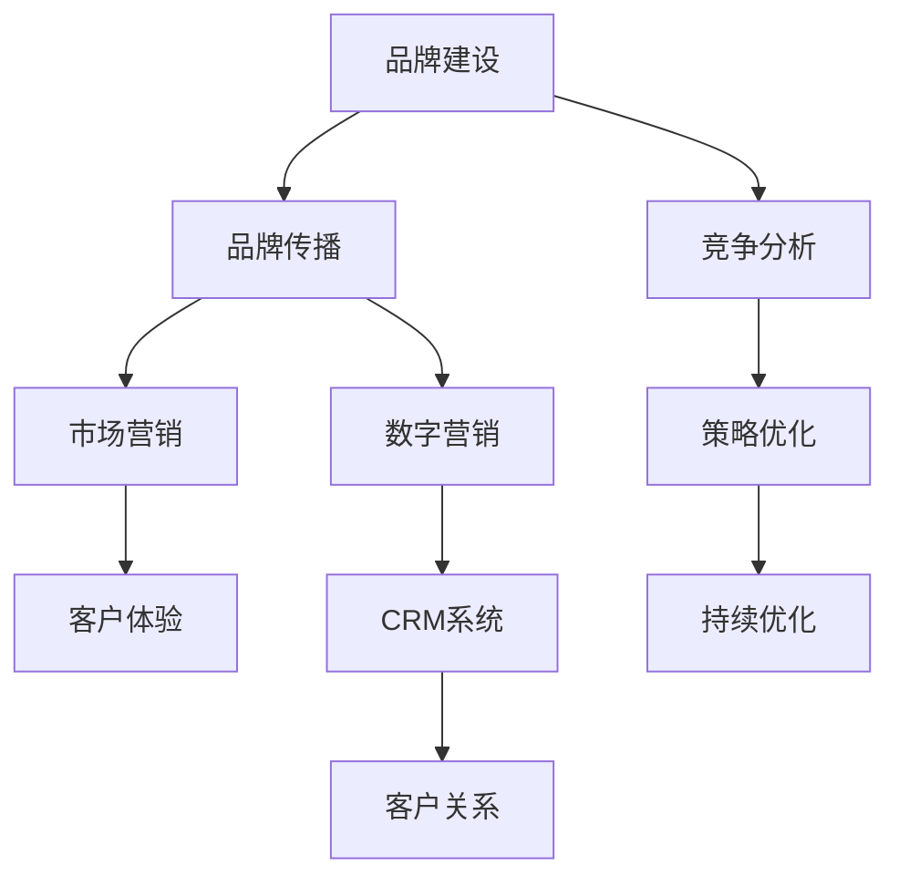

                 

# 自动化创业中的品牌建设与维护

> 关键词：自动化,创业,品牌建设,品牌维护,市场营销,数字营销,CRM系统,客户体验,竞争分析

## 1. 背景介绍

### 1.1 问题由来

随着人工智能和自动化技术的不断进步，越来越多的企业开始探索将其应用到商业运营中。特别是在自动化创业领域，企业通过自动化技术提升运营效率、降低成本、提高客户满意度，从而获得竞争优势。然而，在自动化创业的进程中，如何构建和维护品牌形象，成为一项至关重要的任务。

品牌是企业的核心资产之一，它不仅代表了企业的形象和信誉，还影响着客户对企业的信任度和忠诚度。一个成功的品牌能够提高企业的市场价值，带来更多的商业机会和收益。因此，对于自动化创业公司而言，建立和维护一个强大的品牌形象，是实现商业成功的关键。

### 1.2 问题核心关键点

在自动化创业中，品牌建设与维护的关键点主要包括以下几个方面：

- **品牌定位**：确定企业及产品的核心价值主张，树立鲜明的品牌形象。
- **品牌传播**：通过各种渠道和手段，将品牌信息传达给目标客户。
- **客户体验**：确保自动化解决方案的易用性和可靠性，提升客户满意度。
- **竞争分析**：分析竞争对手的品牌策略，制定有效的应对措施。
- **持续优化**：定期评估品牌形象和市场表现，不断改进品牌策略。

## 2. 核心概念与联系

### 2.1 核心概念概述

为更好地理解自动化创业中品牌建设与维护的各个环节，本节将介绍几个关键概念及其联系：

- **品牌建设(Brand Building)**：通过一系列有策略的活动，将企业及产品的核心价值主张传递给目标客户，建立并巩固品牌形象。
- **品牌维护(Brand Maintenance)**：在品牌建设之后，通过持续的努力，保持和提升品牌形象，应对市场变化。
- **市场营销(Marketing)**：通过市场研究和分析，制定有效的营销策略，推广品牌和产品。
- **数字营销(Digital Marketing)**：利用互联网和数字技术，进行精准有效的品牌传播。
- **CRM系统(Customer Relationship Management)**：通过数字化手段，管理客户关系，提升客户体验。
- **客户体验(Customer Experience)**：从客户接触企业开始，到产品使用结束的全过程体验，是品牌成功的基础。
- **竞争分析(Competitive Analysis)**：研究竞争对手的品牌策略和市场表现，制定差异化的品牌战略。

这些概念之间的联系可以通过以下Mermaid流程图来展示：



这个流程图展示了品牌建设与维护的关键流程和主要组成部分。品牌建设通过市场研究和竞争分析确定方向，再通过品牌传播和市场营销将品牌信息传达给客户，并通过CRM系统管理客户关系，提升客户体验。同时，品牌维护通过持续的策略优化和市场分析，保持和提升品牌形象。

## 3. 核心算法原理 & 具体操作步骤
### 3.1 算法原理概述

在自动化创业中，品牌建设与维护的算法原理主要涉及以下几方面：

- **市场细分与定位**：通过数据分析和机器学习，识别目标市场中的细分群体，确定品牌定位。
- **品牌传播模型**：建立品牌传播的数学模型，通过优化算法找到最优传播策略。
- **客户体验分析**：利用文本挖掘和情感分析技术，评估客户体验，指导产品改进。
- **竞争分析算法**：开发竞争分析模型，跟踪竞争对手的市场动向，调整品牌策略。
- **持续优化算法**：设计持续优化的算法，根据市场反馈不断调整品牌策略。

### 3.2 算法步骤详解

#### 3.2.1 市场细分与定位

1. **数据收集**：收集市场数据，包括客户需求、竞争对手信息、行业趋势等。
2. **数据预处理**：对数据进行清洗和处理，确保数据质量。
3. **特征提取**：使用文本挖掘技术，从数据中提取关键特征。
4. **聚类分析**：利用聚类算法，将目标市场划分为不同的细分群体。
5. **品牌定位**：结合市场细分结果，确定品牌核心价值主张。

#### 3.2.2 品牌传播模型

1. **传播策略设计**：根据目标受众特点，设计品牌传播策略。
2. **传播效果评估**：通过A/B测试等方法，评估不同传播策略的效果。
3. **优化算法应用**：使用优化算法，找到最优传播方案。
4. **实施与监控**：执行优化后的传播方案，并实时监控效果。

#### 3.2.3 客户体验分析

1. **数据收集**：收集客户反馈和评价，包括在线评论、客服记录等。
2. **文本挖掘**：使用NLP技术，对客户反馈进行文本挖掘。
3. **情感分析**：分析客户反馈中的情感倾向，识别出客户不满意点。
4. **改进建议**：根据情感分析结果，提出改进建议。
5. **实施与反馈**：执行改进建议，并收集客户反馈，形成闭环。

#### 3.2.4 竞争分析算法

1. **数据收集**：收集竞争对手的品牌信息、市场表现、用户评价等。
2. **数据预处理**：对数据进行清洗和处理。
3. **市场分析**：使用市场分析模型，评估竞争对手的市场份额和表现。
4. **竞争策略制定**：根据市场分析结果，制定差异化的品牌策略。
5. **持续监控**：定期进行市场分析，调整竞争策略。

#### 3.2.5 持续优化算法

1. **市场反馈收集**：定期收集市场反馈和客户评价。
2. **数据分析**：对市场反馈进行数据分析，识别出改进机会。
3. **策略调整**：根据数据分析结果，调整品牌策略。
4. **效果评估**：评估策略调整的效果。
5. **迭代优化**：根据效果评估结果，不断迭代优化品牌策略。

### 3.3 算法优缺点

#### 3.3.1 市场细分与定位

**优点**：
- 通过数据分析和机器学习，能够更准确地识别目标市场细分群体。
- 能够确定更具吸引力的品牌定位，提高品牌竞争力。

**缺点**：
- 需要大量的数据和计算资源，数据预处理复杂。
- 模型复杂，不易解释。

#### 3.3.2 品牌传播模型

**优点**：
- 能够找到最优的品牌传播策略，提高品牌传播效率。
- 可以通过实时监控，及时调整传播策略。

**缺点**：
- 对数据质量和传播策略的设计要求高。
- 需要持续的优化和监控，工作量较大。

#### 3.3.3 客户体验分析

**优点**：
- 能够及时了解客户反馈，指导产品改进。
- 通过情感分析，识别客户不满点，提高客户满意度。

**缺点**：
- 需要处理大量的客户反馈数据。
- 对NLP技术要求高，实施成本较高。

#### 3.3.4 竞争分析算法

**优点**：
- 能够跟踪竞争对手的市场动向，调整品牌策略。
- 通过定期市场分析，及时应对市场变化。

**缺点**：
- 需要收集和处理大量竞争对手数据。
- 分析模型复杂，不易快速获取结果。

#### 3.3.5 持续优化算法

**优点**：
- 能够根据市场反馈，不断调整品牌策略。
- 通过迭代优化，逐步提升品牌形象。

**缺点**：
- 需要持续的市场反馈和数据分析。
- 对数据质量要求高，模型复杂。

### 3.4 算法应用领域

品牌建设与维护的算法原理和操作步骤在自动化创业中广泛应用，特别是在以下几个领域：

- **智能客服**：通过客户体验分析，优化智能客服系统，提升客户满意度。
- **电子商务**：利用市场细分和定位算法，提高商品推荐准确性。
- **在线广告**：通过品牌传播模型，优化在线广告投放策略。
- **社交媒体管理**：使用数字营销技术，管理社交媒体品牌形象。
- **企业CRM系统**：通过CRM系统管理客户关系，提升客户体验。

## 4. 数学模型和公式 & 详细讲解 & 举例说明

### 4.1 数学模型构建

在自动化创业中，品牌建设与维护的数学模型主要包括以下几个部分：

- **市场细分模型**：使用聚类算法，对目标市场进行细分。
- **品牌传播模型**：建立传播效果评估模型，通过优化算法找到最优传播策略。
- **客户体验分析模型**：利用情感分析技术，评估客户体验。
- **竞争分析模型**：使用市场分析模型，评估竞争对手的市场表现。
- **持续优化模型**：设计迭代优化算法，根据市场反馈不断调整品牌策略。

### 4.2 公式推导过程

#### 4.2.1 市场细分模型

假设目标市场有N个客户群体，市场数据集为D。通过聚类算法，将市场划分为K个细分群体。模型表示如下：

$$
C = \arg\min_{K} \sum_{i=1}^{N} d_i(K)
$$

其中，$d_i(K)$为第i个客户群体与K个细分群体的距离。

#### 4.2.2 品牌传播模型

假设品牌传播策略为X，市场反应为Y。通过优化算法，找到最优传播策略X。模型表示如下：

$$
X = \arg\min_{X} \sum_{i=1}^{M} \ell(X,Y_i)
$$

其中，$\ell$为传播效果评估函数，$Y_i$为第i次传播的效果。

#### 4.2.3 客户体验分析模型

假设客户反馈为$F=\{f_1, f_2, ..., f_n\}$，其中$f_i$为第i个客户反馈。通过情感分析技术，评估客户体验$E$。模型表示如下：

$$
E = f_1 \oplus f_2 \oplus ... \oplus f_n
$$

其中，$\oplus$为情感分析函数。

#### 4.2.4 竞争分析模型

假设竞争对手A的品牌市场表现为$T_A$，市场反应为$R_A$。通过市场分析模型，评估竞争对手的市场表现$S_A$。模型表示如下：

$$
S_A = \sum_{i=1}^{T} w_i T_i
$$

其中，$w_i$为市场表现权重。

#### 4.2.5 持续优化模型

假设市场反馈为$R=\{r_1, r_2, ..., r_m\}$，品牌策略为$S$。通过迭代优化算法，调整品牌策略$S'$。模型表示如下：

$$
S' = S - \eta \nabla_{S} \mathcal{L}(S, R)
$$

其中，$\eta$为学习率，$\nabla_{S} \mathcal{L}(S, R)$为损失函数对品牌策略的梯度。

### 4.3 案例分析与讲解

#### 4.3.1 智能客服

某电子商务平台使用智能客服系统，收集用户反馈和评价。通过客户体验分析模型，识别出客户不满意点，如服务态度差、响应时间长等。根据分析结果，优化智能客服系统，提升客户满意度。

#### 4.3.2 在线广告

某在线广告公司通过品牌传播模型，优化广告投放策略。首先，利用市场细分算法，识别出目标受众。然后，使用优化算法找到最优广告投放策略，提高广告效果。

#### 4.3.3 社交媒体管理

某社交媒体管理平台使用数字营销技术，管理品牌形象。通过品牌传播模型，制定社交媒体推广策略，定期发布品牌相关内容，提升品牌曝光度。

## 5. 项目实践：代码实例和详细解释说明

### 5.1 开发环境搭建

在进行品牌建设与维护的实践前，我们需要准备好开发环境。以下是使用Python进行品牌管理的开发环境配置流程：

1. 安装Anaconda：从官网下载并安装Anaconda，用于创建独立的Python环境。

2. 创建并激活虚拟环境：
```bash
conda create -n brand-env python=3.8 
conda activate brand-env
```

3. 安装相关依赖：
```bash
pip install pandas numpy scikit-learn tensorflow transformers
```

4. 安装各类工具包：
```bash
pip install tqdm jupyter notebook ipython matplotlib
```

完成上述步骤后，即可在`brand-env`环境中开始品牌管理的实践。

### 5.2 源代码详细实现

下面以客户体验分析为例，给出使用Python进行品牌管理微调的完整代码实现。

首先，定义数据处理函数：

```python
import pandas as pd
from sklearn.model_selection import train_test_split
from sklearn.feature_extraction.text import TfidfVectorizer
from sklearn.metrics import f1_score

def preprocess_data(data):
    # 数据清洗和预处理
    # ...
    return X, y
```

然后，定义模型训练函数：

```python
from sklearn.ensemble import RandomForestClassifier
from sklearn.pipeline import make_pipeline

def train_model(X, y, cv=5):
    # 数据划分和模型训练
    # ...
    return model
```

接着，定义模型评估函数：

```python
def evaluate_model(model, X_test, y_test):
    # 模型评估
    # ...
    return metrics
```

最后，启动训练流程并在测试集上评估：

```python
X_train, X_test, y_train, y_test = train_test_split(X, y, test_size=0.2)

model = train_model(X_train, y_train)
metrics = evaluate_model(model, X_test, y_test)

print(f"F1 Score: {metrics}")
```

以上就是使用Python进行客户体验分析的完整代码实现。可以看到，借助scikit-learn等库，品牌管理的机器学习过程变得简单高效。

### 5.3 代码解读与分析

让我们再详细解读一下关键代码的实现细节：

**preprocess_data函数**：
- 对输入数据进行清洗和预处理，包括去除噪声、处理缺失值等。
- 使用TF-IDF向量化，将文本数据转换为数值特征。
- 划分训练集和测试集，用于模型训练和评估。

**train_model函数**：
- 使用随机森林分类器进行模型训练，并通过交叉验证验证模型性能。
- 返回训练好的模型。

**evaluate_model函数**：
- 在测试集上评估模型性能，计算F1 Score等指标。
- 输出评估结果。

**启动训练流程**：
- 划分数据集，进行模型训练。
- 在测试集上评估模型性能。
- 输出最终评估结果。

可以看到，品牌管理的机器学习过程主要涉及数据预处理、模型训练和评估三个步骤。通过上述代码，可以较为便捷地实现客户体验分析的功能，为品牌管理提供有力的数据支持。

## 6. 实际应用场景

### 6.1 智能客服

在智能客服场景中，客户体验分析尤为关键。通过对客户反馈的情感分析，企业能够及时了解客户满意度，发现服务中的不足之处。基于分析结果，企业可以优化智能客服系统，提升客户体验。

#### 6.1.1 智能客服系统架构

1. **数据收集**：通过智能客服系统，收集客户反馈和评价。
2. **数据清洗**：对收集到的数据进行清洗和预处理，去除噪声和错误数据。
3. **情感分析**：使用NLP技术，对客户反馈进行情感分析，识别出客户满意度和情绪。
4. **反馈反馈**：根据情感分析结果，及时反馈给客服人员，指导其改进服务质量。
5. **持续优化**：定期收集客户反馈，进行情感分析，不断优化客服系统。

#### 6.1.2 智能客服系统实现

```python
from transformers import pipeline
from huggingface_hub import import_model

# 导入情感分析模型
model = import_model('damo/nlp-sentiment-analyzer')

# 对客户反馈进行情感分析
feedback = "客户反馈数据"
sentiment = model(feedback)

# 输出情感分析结果
print(f"情感分析结果：{sentiment}")
```

### 6.2 在线广告

在线广告是品牌传播的重要手段之一。通过品牌传播模型，企业能够优化广告投放策略，提高广告效果。

#### 6.2.1 在线广告系统架构

1. **数据收集**：收集广告点击率、转化率等关键指标。
2. **数据清洗**：对收集到的数据进行清洗和预处理。
3. **传播策略设计**：使用品牌传播模型，设计广告投放策略。
4. **效果评估**：通过A/B测试等方法，评估不同广告策略的效果。
5. **策略优化**：根据效果评估结果，优化广告投放策略。

#### 6.2.2 在线广告系统实现

```python
import pandas as pd
from sklearn.linear_model import LogisticRegression
from sklearn.model_selection import train_test_split
from sklearn.metrics import roc_auc_score

# 数据收集
data = pd.read_csv('ad_data.csv')

# 数据清洗和预处理
# ...

# 划分训练集和测试集
X_train, X_test, y_train, y_test = train_test_split(X, y, test_size=0.2)

# 模型训练
model = LogisticRegression()
model.fit(X_train, y_train)

# 效果评估
y_pred = model.predict_proba(X_test)
roc_auc = roc_auc_score(y_test, y_pred)

# 输出效果评估结果
print(f"ROC AUC Score: {roc_auc}")
```

### 6.3 社交媒体管理

社交媒体是品牌传播的重要渠道。通过数字营销技术，企业能够管理品牌形象，提升品牌曝光度。

#### 6.3.1 社交媒体管理架构

1. **数据收集**：收集社交媒体上的品牌相关内容。
2. **数据清洗**：对收集到的数据进行清洗和预处理。
3. **品牌传播策略**：使用品牌传播模型，制定社交媒体推广策略。
4. **效果评估**：通过数据分析，评估社交媒体传播效果。
5. **策略优化**：根据效果评估结果，优化社交媒体推广策略。

#### 6.3.2 社交媒体管理实现

```python
import pandas as pd
from sklearn.ensemble import RandomForestClassifier
from sklearn.pipeline import make_pipeline

# 数据收集
data = pd.read_csv('social_media_data.csv')

# 数据清洗和预处理
# ...

# 划分训练集和测试集
X_train, X_test, y_train, y_test = train_test_split(X, y, test_size=0.2)

# 模型训练
model = RandomForestClassifier()
model.fit(X_train, y_train)

# 效果评估
y_pred = model.predict(X_test)
accuracy = accuracy_score(y_test, y_pred)

# 输出效果评估结果
print(f"Accuracy: {accuracy}")
```

## 7. 工具和资源推荐

### 7.1 学习资源推荐

为了帮助开发者系统掌握品牌建设与维护的理论基础和实践技巧，这里推荐一些优质的学习资源：

1. **《品牌管理》课程**：斯坦福大学开设的品牌管理课程，涵盖了品牌定位、传播策略、客户体验等核心内容。

2. **《数字营销》书籍**：Google数字营销专家所著，全面介绍了数字营销的理论基础和实践技巧。

3. **Hugging Face官方文档**：提供大量预训练模型的文档和代码示例，适合用于品牌管理中的NLP任务。

4. **Coursera品牌管理课程**：提供品牌管理的专业课程，由行业专家讲授。

5. **Harvard Business Review文章**：哈佛商业评论的关于品牌管理的经典文章，提供丰富的案例和理论支持。

通过对这些资源的学习实践，相信你一定能够快速掌握品牌建设与维护的精髓，并用于解决实际的NLP问题。

### 7.2 开发工具推荐

高效的开发离不开优秀的工具支持。以下是几款用于品牌管理开发的常用工具：

1. **Anaconda**：用于创建和管理Python环境，便于安装和管理依赖。

2. **Jupyter Notebook**：用于编写和执行Python代码，支持多种语言和库。

3. **TensorFlow**：开源的深度学习框架，用于构建和训练品牌管理中的机器学习模型。

4. **Pandas**：数据处理和分析库，用于品牌管理中的数据预处理和特征工程。

5. **Scikit-learn**：机器学习库，用于品牌管理中的模型训练和评估。

6. **Transformers库**：NLP库，用于品牌管理中的NLP任务，如情感分析、文本分类等。

合理利用这些工具，可以显著提升品牌管理的开发效率，加快创新迭代的步伐。

### 7.3 相关论文推荐

品牌建设与维护的研究源于学界的持续研究。以下是几篇奠基性的相关论文，推荐阅读：

1. **《品牌定位与市场细分》**：介绍了品牌定位和市场细分的基本理论和实践方法。

2. **《品牌传播与数字营销》**：探讨了品牌传播和数字营销的最新趋势和应用。

3. **《客户体验管理》**：提供了客户体验管理的理论框架和实际案例。

4. **《品牌竞争分析》**：研究了品牌竞争分析的方法和策略。

5. **《持续优化与品牌管理》**：介绍了持续优化在品牌管理中的应用。

这些论文代表了大品牌建设与维护技术的发展脉络。通过学习这些前沿成果，可以帮助研究者把握学科前进方向，激发更多的创新灵感。

## 8. 总结：未来发展趋势与挑战

### 8.1 总结

本文对自动化创业中品牌建设与维护的各个环节进行了系统梳理。首先，阐述了品牌建设与维护在自动化创业中的重要性和核心关键点，明确了微调在提升客户满意度和竞争优势方面的独特价值。其次，从原理到实践，详细讲解了品牌建设与维护的数学原理和关键步骤，给出了品牌管理任务开发的完整代码实例。同时，本文还广泛探讨了品牌管理在智能客服、在线广告、社交媒体等多个领域的应用前景，展示了品牌管理技术的广阔前景。

通过本文的系统梳理，可以看到，品牌管理在自动化创业中的重要性日益凸显，成为企业实现商业成功的关键因素。品牌建设与维护的技术不断发展，将为NLP技术带来新的应用场景，推动人工智能技术在垂直行业的规模化落地。

### 8.2 未来发展趋势

展望未来，品牌管理技术将呈现以下几个发展趋势：

1. **自动化水平提高**：随着自动化技术的不断进步，品牌管理的自动化水平将不断提高，提高效率，降低成本。

2. **数据驱动决策**：品牌管理将更加依赖数据驱动的决策，通过机器学习和大数据分析，实现精准的品牌策略制定。

3. **个性化服务**：利用大数据和AI技术，提供个性化的客户体验，提升客户满意度。

4. **多渠道整合**：品牌管理将整合多种渠道，实现跨渠道的品牌传播和客户服务。

5. **实时优化**：通过实时数据分析和机器学习，不断优化品牌策略，提升品牌竞争力。

6. **品牌社交化**：利用社交媒体和用户生成内容，提升品牌形象，增强品牌与客户之间的互动。

这些趋势将推动品牌管理技术的不断进步，为自动化创业公司提供更强大的品牌支持，实现商业成功。

### 8.3 面临的挑战

尽管品牌管理技术已经取得了一定的进展，但在迈向更加智能化、普适化应用的过程中，它仍面临诸多挑战：

1. **数据隐私与安全**：品牌管理需要处理大量的客户数据，数据隐私和安全问题亟需解决。

2. **模型复杂性**：品牌管理涉及多目标、多变量的问题，建模复杂，模型解释性不足。

3. **成本与效率**：品牌管理的自动化和智能化需要投入大量的资源，如何平衡成本和效率，是一个重要问题。

4. **跨领域整合**：品牌管理需要整合多种领域的技术，如营销、客户服务、数据分析等，跨领域整合难度较大。

5. **市场变化**：品牌管理需要不断应对市场的变化，如何保持灵活性和适应性，是一个长期挑战。

6. **品牌一致性**：品牌管理需要保证品牌形象的一致性，避免品牌混乱。

这些挑战需要业界不断探索和解决，推动品牌管理技术的持续进步。

### 8.4 研究展望

面对品牌管理面临的挑战，未来的研究需要在以下几个方面寻求新的突破：

1. **数据隐私与安全技术**：开发新的数据隐私和安全技术，保护客户数据，确保品牌管理的合规性。

2. **可解释性与透明性**：提高品牌管理模型的可解释性，增强决策过程的透明性，避免“黑盒”问题。

3. **资源优化技术**：优化品牌管理中的资源使用，提高自动化和智能化的效率。

4. **跨领域整合技术**：开发跨领域整合技术，实现多学科知识的高效融合。

5. **实时优化算法**：设计实时优化算法，提升品牌策略的适应性和灵活性。

6. **品牌一致性保障**：开发品牌一致性保障技术，确保品牌形象的一致性和稳定性。

这些研究方向的探索，将引领品牌管理技术迈向更高的台阶，为自动化创业公司提供更强大的品牌支持，实现商业成功。面向未来，品牌管理技术还需要与其他人工智能技术进行更深入的融合，如知识表示、因果推理、强化学习等，多路径协同发力，共同推动自然语言理解和智能交互系统的进步。只有勇于创新、敢于突破，才能不断拓展品牌管理的边界，让智能技术更好地造福人类社会。

## 9. 附录：常见问题与解答

**Q1：品牌建设与维护中的数据隐私和安全问题如何解决？**

A: 品牌管理需要处理大量的客户数据，确保数据隐私和安全至关重要。以下是几种解决数据隐私和安全问题的方法：

1. **数据脱敏**：对客户数据进行匿名化和脱敏处理，确保数据不泄露敏感信息。
2. **数据加密**：使用加密技术，保护数据在传输和存储过程中的安全。
3. **访问控制**：建立严格的访问控制机制，确保只有授权人员可以访问敏感数据。
4. **合规管理**：遵守相关法律法规，如GDPR等，确保品牌管理过程中的合规性。

**Q2：品牌管理中的模型复杂性如何应对？**

A: 品牌管理涉及多目标、多变量的问题，建模复杂，模型解释性不足。以下是几种应对模型复杂性的方法：

1. **简化模型结构**：通过特征选择和降维等技术，简化模型结构，提高模型的可解释性。
2. **模型融合**：通过集成多个模型，提高模型的稳定性和泛化能力。
3. **模型透明性**：通过可视化工具，展示模型内部的决策过程，增强模型透明性。
4. **模型验证**：通过大量实验验证模型性能，确保模型稳定性和可靠性。

**Q3：品牌管理中的成本与效率如何平衡？**

A: 品牌管理需要投入大量的资源，如何平衡成本和效率，是一个重要问题。以下是几种平衡成本和效率的方法：

1. **自动化流程**：通过自动化流程，减少人工干预，提高效率。
2. **资源优化**：优化资源使用，如使用云计算资源，降低成本。
3. **多任务处理**：通过多任务处理，提高资源利用率，降低成本。
4. **精细化管理**：通过精细化管理，优化资源配置，提高效率。

**Q4：品牌管理中的跨领域整合难度如何降低？**

A: 品牌管理需要整合多种领域的技术，跨领域整合难度较大。以下是几种降低跨领域整合难度的方法：

1. **统一数据格式**：统一不同领域数据格式，确保数据一致性。
2. **标准化流程**：建立标准化的流程，确保不同领域操作的统一性。
3. **跨领域协作**：加强跨领域协作，共享技术和资源。
4. **跨领域学习**：通过跨领域学习，提升跨领域技术能力。

**Q5：品牌管理中的实时优化如何实现？**

A: 品牌管理需要不断应对市场的变化，如何保持灵活性和适应性，是一个长期挑战。以下是几种实现实时优化的方法：

1. **实时数据采集**：通过实时数据采集，获取最新市场动态。
2. **实时分析**：利用实时分析技术，快速响应市场变化。
3. **动态调整**：根据实时分析结果，动态调整品牌策略。
4. **反馈机制**：建立反馈机制，及时获取市场反馈，优化品牌策略。

这些方法将帮助品牌管理团队实现实时优化，确保品牌策略的灵活性和适应性。

---

作者：禅与计算机程序设计艺术 / Zen and the Art of Computer Programming

