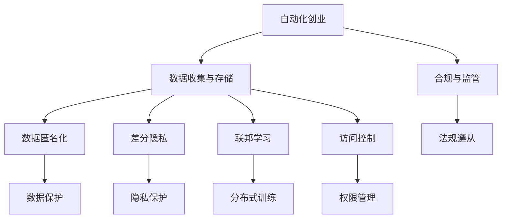

                 

# 自动化创业中的用户隐私保护策略

在自动化创业的大潮中，数据驱动的商业模式日益盛行。然而，伴随着数据价值的不断挖掘，用户隐私保护也日益受到关注。如何在自动化创业中平衡数据驱动与隐私保护，成为一项重要的研究课题。本文将围绕自动化创业中的用户隐私保护策略，探讨其核心概念、技术原理、具体实现和应用场景，旨在为自动化创业者提供系统性的指导。

## 1. 背景介绍

### 1.1 问题由来

随着人工智能和大数据技术的飞速发展，自动化创业领域的兴起引发了用户隐私保护的广泛关注。自动化创业往往依赖于对大量数据的收集、分析和应用，而数据收集与隐私保护的矛盾也随之凸显。特别是在自动驾驶、智能家居、金融风控等高敏感领域，用户隐私泄露带来的潜在风险尤为严重。因此，如何在自动化创业中切实保护用户隐私，是每个创业者都需要深思熟虑的问题。

### 1.2 问题核心关键点

自动化创业中的用户隐私保护问题，核心在于如何在数据利用和用户隐私保护之间找到平衡。具体来说，包括：

- **数据匿名化与脱敏**：如何在收集数据时保护用户隐私，同时保证数据的可用性。
- **数据访问控制**：如何设定合理的访问权限，确保敏感数据只能被授权人员访问。
- **差分隐私**：如何在数据共享时加入噪声，保护用户隐私不被泄露。
- **联邦学习**：如何在不迁移数据的情况下，利用分布式数据进行模型训练。
- **合规与监管**：如何确保企业遵守相关法律法规，如GDPR、CCPA等，保障用户权益。

## 2. 核心概念与联系

### 2.1 核心概念概述

为了更好地理解自动化创业中的用户隐私保护策略，本节将介绍几个密切相关的核心概念：

- **自动化创业**：利用人工智能、大数据等技术，自动化处理业务流程，提升业务效率和质量，降低成本的商业模式。
- **数据收集与存储**：自动化创业过程中，需收集和存储大量用户数据以支持模型训练和业务决策。
- **用户隐私**：用户在自动化创业中提供的数据信息，包括但不限于个人信息、行为数据等，应得到严格保护。
- **数据匿名化**：通过技术手段，将原始数据中的个人身份信息去除，使其无法与特定个人对应。
- **差分隐私**：在数据发布和共享时，加入噪声干扰，使个体数据无法被反向推导，从而保护用户隐私。
- **联邦学习**：分布式数据训练模型，各节点只上传模型参数，不暴露原始数据。
- **访问控制**：对数据访问进行严格控制，确保只有授权人员能够访问敏感数据。
- **合规与监管**：遵守GDPR、CCPA等法律法规，确保用户隐私保护。

这些核心概念之间的逻辑关系可以通过以下Mermaid流程图来展示：



这个流程图展示了自动化创业中用户隐私保护的关键环节：

1. 自动化创业通过数据收集与存储支持业务发展。
2. 数据匿名化和差分隐私技术保护用户隐私。
3. 联邦学习实现分布式数据训练。
4. 访问控制确保数据安全。
5. 合规与监管保障用户权益。

## 3. 核心算法原理 & 具体操作步骤

### 3.1 算法原理概述

自动化创业中的用户隐私保护策略，本质上是如何在数据利用和隐私保护之间找到平衡。本文将从数据收集、处理和存储等关键环节，探讨保护用户隐私的核心算法原理。

### 3.2 算法步骤详解

#### 3.2.1 数据收集与匿名化

在数据收集阶段，可以采用以下步骤保护用户隐私：

1. **最小化数据收集**：只收集业务所需的最少数据，避免不必要的个人信息泄露。
2. **数据去标识化**：通过技术手段去除数据中的个人标识信息，如姓名、身份证号等。
3. **泛化处理**：将具体数据泛化为更加通用的形式，如将年龄数据处理为年龄段。
4. **匿名化算法**：使用K-匿名化、L-多样性等算法对数据进行匿名化处理。

#### 3.2.2 差分隐私

差分隐私通过在数据中引入噪声，确保个体数据的隐私性。具体步骤如下：

1. **定义隐私预算**：设定隐私保护的目标，如ε-差分隐私。
2. **加入噪声**：对原始数据加入噪声干扰，确保个体数据无法被反向推导。
3. **输出噪声化数据**：发布噪声化后的数据，同时提供相应的隐私保护参数。

#### 3.2.3 访问控制

访问控制是保护用户隐私的关键环节。具体步骤如下：

1. **权限分配**：设定不同角色的访问权限，如管理员、开发人员、数据分析师等。
2. **身份认证**：通过密码、双因素认证等方式验证访问者身份。
3. **访问审计**：记录和监控数据的访问日志，确保异常访问及时发现。

#### 3.2.4 合规与监管

自动化创业中需要严格遵守相关法律法规，如GDPR、CCPA等。具体步骤如下：

1. **法律法规学习**：熟悉并理解相关法律法规要求。
2. **合规审计**：定期进行合规审计，确保业务流程符合法律法规。
3. **数据保护政策**：制定明确的数据保护政策，并向用户透明。

### 3.3 算法优缺点

自动化创业中的用户隐私保护策略，具有以下优点：

1. **提高数据利用率**：通过数据匿名化和差分隐私技术，可以在不泄露用户隐私的情况下，充分利用数据价值。
2. **增强用户信任**：严格的数据访问控制和合规监管，有助于增强用户对企业的信任。
3. **提升业务安全**：通过访问控制和差分隐私技术，确保敏感数据不被非法获取和滥用。

然而，这些策略也存在一些缺点：

1. **技术复杂度高**：数据匿名化、差分隐私等技术实现较为复杂，需投入较高的时间和资源。
2. **数据损失风险**：在加入噪声干扰后，部分数据信息可能会丢失，影响数据质量。
3. **成本高**：合规审计、访问控制等措施需要持续投入，增加运营成本。

### 3.4 算法应用领域

自动化创业中的用户隐私保护策略，可以应用于以下领域：

1. **智能家居**：保护用户行为数据隐私，防止数据滥用。
2. **自动驾驶**：保护车辆行驶数据隐私，确保数据安全。
3. **金融风控**：保护用户交易数据隐私，防止数据泄露。
4. **健康医疗**：保护患者健康数据隐私，防止数据滥用。
5. **智能客服**：保护用户聊天记录隐私，防止数据滥用。

## 4. 数学模型和公式 & 详细讲解 & 举例说明

### 4.1 数学模型构建

为了更好地理解自动化创业中用户隐私保护的具体实现，本节将使用数学语言对隐私保护策略进行详细阐述。

设原始数据集为 $D=\{x_1,x_2,...,x_n\}$，其中 $x_i=(x_{i1},x_{i2},...,x_{in})$ 表示第 $i$ 个样本的数据特征。

定义 $f(x)$ 为数据处理函数，处理后的数据集为 $D'=\{f(x_1),f(x_2),...,f(x_n)\}$。

定义隐私预算为 $\epsilon$，则 $\epsilon$-差分隐私定义为：

$$
\mathcal{L}(f(D),f(D')) \leq \frac{\exp(\epsilon)}{2} \cdot \sup_{D'' \sim D} \mathcal{L}(f(D),f(D''))
$$

其中，$\mathcal{L}$ 为损失函数，$\sup$ 表示上确界。

### 4.2 公式推导过程

在差分隐私中，常见的噪声加入方法包括拉普拉斯噪声和高斯噪声。以拉普拉斯噪声为例，假设数据集大小为 $n$，则加入噪声后的处理函数为：

$$
f(x) = x + \Delta \cdot Lap(\lambda)
$$

其中，$\Delta$ 为噪声量，$\lambda$ 为噪声参数。

加入噪声后的隐私保护目标函数为：

$$
\mathcal{L}(f(D),f(D')) \leq \frac{\exp(\epsilon)}{2} \cdot \sup_{D'' \sim D} \mathcal{L}(f(D),f(D''))
$$

推导过程如下：

1. 对于任意两个相邻数据集 $D'$ 和 $D'$，处理后数据集 $D'$ 和 $D''$ 的损失函数差值：
$$
\mathcal{L}(f(D),f(D')) - \mathcal{L}(f(D),f(D'')) \leq \Delta \cdot \frac{\exp(\epsilon)}{2} \cdot \sup_{D'' \sim D} \mathcal{L}(f(D),f(D''))
$$

2. 取上确界：
$$
\sup_{D'' \sim D} \mathcal{L}(f(D),f(D'')) \leq \Delta \cdot \frac{\exp(\epsilon)}{2} \cdot \sup_{D'' \sim D} \mathcal{L}(f(D),f(D''))
$$

3. 取 $\Delta$ 和 $\frac{\exp(\epsilon)}{2}$ 的乘积，得到隐私保护目标函数：
$$
\mathcal{L}(f(D),f(D')) \leq \frac{\exp(\epsilon)}{2} \cdot \sup_{D'' \sim D} \mathcal{L}(f(D),f(D''))
$$

通过以上推导，可以看到，差分隐私通过引入噪声，确保个体数据的隐私性，同时也保护了数据的整体质量。

### 4.3 案例分析与讲解

#### 4.3.1 智能家居案例

智能家居系统中，用户的行为数据（如开关状态、温度调节等）是保护的重点。

1. **数据收集与匿名化**：只收集必要的开关状态和时间戳，去除用户身份信息。
2. **差分隐私**：对开关状态和时间戳进行噪声干扰，确保个体数据无法被反向推导。
3. **访问控制**：确保智能家居系统仅向授权人员开放访问权限。
4. **合规与监管**：严格遵守GDPR等法律法规，确保用户隐私保护。

#### 4.3.2 自动驾驶案例

自动驾驶中，车辆的行驶数据（如速度、位置、路线等）涉及用户隐私。

1. **数据收集与匿名化**：仅收集必要的速度和位置数据，去除车辆和用户身份信息。
2. **差分隐私**：对速度和位置数据加入噪声，确保个体数据无法被反向推导。
3. **访问控制**：确保自动驾驶系统仅向授权人员开放访问权限。
4. **合规与监管**：严格遵守GDPR等法律法规，确保用户隐私保护。

## 5. 项目实践：代码实例和详细解释说明

### 5.1 开发环境搭建

在进行自动化创业中的用户隐私保护策略开发前，我们需要准备好开发环境。以下是使用Python进行PyTorch开发的环境配置流程：

1. 安装Anaconda：从官网下载并安装Anaconda，用于创建独立的Python环境。

2. 创建并激活虚拟环境：
```bash
conda create -n privacy-env python=3.8 
conda activate privacy-env
```

3. 安装PyTorch：根据CUDA版本，从官网获取对应的安装命令。例如：
```bash
conda install pytorch torchvision torchaudio cudatoolkit=11.1 -c pytorch -c conda-forge
```

4. 安装TensorFlow：
```bash
pip install tensorflow
```

5. 安装各类工具包：
```bash
pip install numpy pandas scikit-learn matplotlib tqdm jupyter notebook ipython
```

完成上述步骤后，即可在`privacy-env`环境中开始隐私保护策略开发。

### 5.2 源代码详细实现

下面我们以智能家居为例，给出使用TensorFlow对隐私保护策略的PyTorch代码实现。

首先，定义智能家居用户行为数据处理函数：

```python
import tensorflow as tf
import numpy as np

def process_data(data, epsilon):
    # 定义数据处理函数
    def process_sample(sample):
        # 对开关状态进行噪声干扰
        switch_state = tf.random.normal(shape=(), mean=sample['switch_state'], stddev=lambda: np.sqrt(2.0 / epsilon))
        # 对温度调节进行噪声干扰
        temperature = tf.random.normal(shape=(), mean=sample['temperature'], stddev=lambda: np.sqrt(2.0 / epsilon))
        return {'switch_state': switch_state, 'temperature': temperature}
    
    # 对数据集进行批量处理
    def process_batch(batch):
        return [process_sample(sample) for sample in batch]
    
    # 应用噪声处理函数
    processed_data = tf.data.Dataset.from_generator(lambda: data, output_signature=process_batch).map(process_batch)
    return processed_data
```

然后，定义隐私保护策略评估函数：

```python
def evaluate_privacy(processed_data, epsilon):
    # 定义隐私保护评估函数
    def evaluate_sample(sample):
        # 计算隐私预算
        delta = tf.random.normal(shape=(), mean=0.0, stddev=lambda: np.sqrt(2.0 / epsilon))
        # 计算损失函数
        loss = tf.reduce_mean(tf.abs(sample['switch_state'] - delta))
        return loss
    
    # 对数据集进行批量处理
    def evaluate_batch(batch):
        return [evaluate_sample(sample) for sample in batch]
    
    # 应用隐私保护评估函数
    evaluated_data = tf.data.Dataset.from_generator(lambda: processed_data, output_signature=evaluate_batch).map(evaluate_batch)
    return evaluated_data
```

最后，启动隐私保护策略测试流程：

```python
# 原始数据集
data = [{"switch_state": 1, "temperature": 25}, {"switch_state": 0, "temperature": 20}]

# 隐私预算
epsilon = 1.0

# 数据处理
processed_data = process_data(data, epsilon)

# 隐私保护评估
evaluated_data = evaluate_privacy(processed_data, epsilon)

# 输出结果
for batch in evaluated_data:
    print(batch)
```

以上就是使用TensorFlow对智能家居隐私保护策略的代码实现。可以看到，通过引入噪声干扰和损失函数，可以有效地保护用户行为数据隐私，同时确保数据的可用性。

### 5.3 代码解读与分析

让我们再详细解读一下关键代码的实现细节：

**process_data函数**：
- 对每个样本的开关状态和温度调节进行噪声干扰，生成处理后的数据集。
- 使用TensorFlow的`tf.random.normal`函数生成拉普拉斯噪声，确保数据隐私。

**evaluate_privacy函数**：
- 对每个样本的开关状态进行隐私预算计算和损失函数计算。
- 使用TensorFlow的`tf.reduce_mean`函数计算批量数据集的平均损失。

**代码实现**：
- 使用TensorFlow的`tf.data.Dataset`和`map`函数，对数据集进行批量处理和逐样本处理。
- 通过`lambda`函数，将数据处理和隐私保护评估封装为函数。

**测试流程**：
- 使用原始数据集进行隐私保护处理。
- 应用隐私保护评估函数，计算隐私预算和损失函数。
- 输出批量数据的隐私保护评估结果。

## 6. 实际应用场景

### 6.1 智能家居

智能家居系统中，保护用户行为数据隐私至关重要。通过引入差分隐私技术，可以在不泄露用户隐私的情况下，充分利用数据支持智能家居系统的优化和升级。

### 6.2 自动驾驶

自动驾驶中，车辆的行驶数据涉及用户隐私，保护隐私的同时不影响系统性能。通过引入差分隐私和访问控制，确保数据安全，同时满足法律法规要求。

### 6.3 金融风控

金融风控中，用户交易数据极为敏感，保护用户隐私是关键。通过差分隐私和访问控制，确保用户数据的安全性和合规性。

### 6.4 健康医疗

健康医疗领域，患者健康数据需要严格保护。通过数据匿名化和差分隐私技术，保护用户隐私，同时确保数据的可用性。

### 6.5 智能客服

智能客服系统中，用户聊天记录涉及隐私。通过差分隐私和访问控制，确保用户隐私安全，同时提升服务质量。

## 7. 工具和资源推荐

### 7.1 学习资源推荐

为了帮助开发者系统掌握自动化创业中用户隐私保护的理论基础和实践技巧，这里推荐一些优质的学习资源：

1. 《数据隐私保护原理与实践》系列博文：由隐私保护专家撰写，深入浅出地介绍了隐私保护的核心原理和最新技术。

2. CS230《深度学习在隐私保护中的应用》课程：斯坦福大学开设的隐私保护明星课程，涵盖了隐私保护的基本概念和前沿技术。

3. 《差分隐私理论与实践》书籍：清华大学出版社出版的隐私保护经典书籍，全面介绍了差分隐私的理论和实际应用。

4. GitHub开源项目：开源隐私保护框架和算法，提供丰富的代码实现和示例，助力隐私保护实践。

5. HuggingFace官方文档：Transformer库的官方隐私保护指南，提供全面的隐私保护解决方案。

通过对这些资源的学习实践，相信你一定能够快速掌握自动化创业中用户隐私保护的核心技术，并用于解决实际的隐私保护问题。

### 7.2 开发工具推荐

高效的开发离不开优秀的工具支持。以下是几款用于隐私保护策略开发的常用工具：

1. TensorFlow：开源深度学习框架，提供丰富的隐私保护算法和工具，方便开发者进行隐私保护实践。

2. PyTorch：基于Python的开源深度学习框架，灵活的计算图设计，适合隐私保护算法的实现。

3. TensorBoard：TensorFlow配套的可视化工具，可以实时监测模型训练状态，提供丰富的图表呈现方式。

4. Weights & Biases：模型训练的实验跟踪工具，可以记录和可视化模型训练过程中的各项指标，方便对比和调优。

5. TensorFlow Privacy Toolkit：提供差分隐私、联邦学习等隐私保护算法的开源库，支持Python和TensorFlow环境。

合理利用这些工具，可以显著提升隐私保护策略的开发效率，加快创新迭代的步伐。

### 7.3 相关论文推荐

自动化创业中的用户隐私保护策略的发展源于学界的持续研究。以下是几篇奠基性的相关论文，推荐阅读：

1. "Differential Privacy" by Cynthia Dwork, Framework for the publication of private information: https://cynthiadwork.com/papers/diff-privacy.pdf

2. "Federated Learning in Privacy Preserving Big Data Analytics" by Jianwen Zhang et al.：介绍了联邦学习在隐私保护中的应用。

3. "Anonymization Techniques for Protecting Privacy in Multi-Party Data Analysis" by Li Wei et al.：探讨了数据匿名化在隐私保护中的作用。

4. "Practical Aspects of Privacy Preserving Machine Learning" by Eric K. Nawrocki et al.：介绍了隐私保护机器学习的基本概念和实现方法。

5. "Privacy-Preserving Artificial Intelligence: A Survey" by L. Nguyen, et al.：综述了隐私保护人工智能领域的最新进展。

这些论文代表了大语言模型微调技术的发展脉络。通过学习这些前沿成果，可以帮助研究者把握学科前进方向，激发更多的创新灵感。

## 8. 总结：未来发展趋势与挑战

### 8.1 总结

本文对自动化创业中的用户隐私保护策略进行了全面系统的介绍。首先阐述了隐私保护策略的核心概念和关键技术，明确了隐私保护在自动化创业中的重要性。其次，从原理到实践，详细讲解了隐私保护的具体实现，包括数据收集与匿名化、差分隐私、访问控制等核心环节。最后，探讨了隐私保护策略在不同场景中的应用，并推荐了相关的学习资源和开发工具。

通过本文的系统梳理，可以看到，自动化创业中的用户隐私保护策略正成为自动化企业不可忽视的重要课题。这些策略的实施，不仅能保护用户隐私，还能提升企业的品牌信誉和市场竞争力。未来，随着隐私保护技术的发展，自动化创业者将能够更好地平衡数据驱动与隐私保护，实现技术与伦理的和谐共生。

### 8.2 未来发展趋势

展望未来，自动化创业中的用户隐私保护策略将呈现以下几个发展趋势：

1. **隐私保护技术不断进步**：随着隐私保护技术的不断迭代，差分隐私、联邦学习等方法将得到更广泛的应用，隐私保护效果将进一步提升。

2. **隐私保护与业务结合更加紧密**：隐私保护策略将更加紧密地融入自动化企业的业务流程，确保数据利用与隐私保护的有机结合。

3. **合规与监管体系完善**：隐私保护法规将不断完善，企业在隐私保护合规性上将投入更多资源，确保合规操作。

4. **隐私保护教育普及**：隐私保护教育将逐渐普及，公众和企业对隐私保护的认知将逐步提升，促进隐私保护技术的普及应用。

5. **隐私保护标准体系建立**：隐私保护标准将逐步建立，成为企业和行业的通用规范，推动隐私保护技术的发展和应用。

### 8.3 面临的挑战

尽管自动化创业中的用户隐私保护策略已经取得了显著成效，但在进一步发展和推广过程中，仍面临诸多挑战：

1. **隐私保护成本高**：隐私保护技术实现较为复杂，投入的人力物力成本较高。

2. **数据质量受影响**：差分隐私等技术在加入噪声干扰后，可能影响数据质量，导致业务决策的准确性降低。

3. **技术实现难度大**：隐私保护技术的实现需要深入理解数学和算法原理，对开发者的技术要求较高。

4. **法律法规复杂多变**：隐私保护法规不断变化，企业需要持续关注并及时调整隐私保护策略。

5. **用户隐私意识提升**：尽管隐私保护技术不断进步，但用户对隐私保护的认知和关注度仍需提升。

### 8.4 研究展望

面对自动化创业中隐私保护面临的挑战，未来的研究需要在以下几个方面寻求新的突破：

1. **隐私保护算法优化**：开发更加高效、可解释的隐私保护算法，降低隐私保护的技术门槛。

2. **隐私保护与业务融合**：将隐私保护技术深入融入自动化企业的业务流程，实现隐私保护与业务发展的协同优化。

3. **隐私保护技术创新**：引入新的隐私保护技术，如零知识证明、同态加密等，提升隐私保护的效果和效率。

4. **隐私保护标准制定**：制定隐私保护的标准和规范，推动隐私保护技术的应用和普及。

5. **隐私保护教育推广**：加强隐私保护教育和普及，提升公众和企业对隐私保护的认知和重视程度。

通过这些研究方向的探索，必将引领自动化创业中的隐私保护技术迈向更高的台阶，为实现技术与伦理的和谐共生提供坚实的技术保障。

## 9. 附录：常见问题与解答

**Q1：隐私保护技术如何平衡数据利用与隐私保护？**

A: 隐私保护技术可以通过数据匿名化、差分隐私等手段，在不泄露用户隐私的情况下，充分利用数据价值。关键在于合理设计隐私预算和噪声干扰强度，确保隐私保护效果的同时，不影响数据的可用性。

**Q2：隐私保护技术在自动化创业中如何应用？**

A: 隐私保护技术可以在自动化创业中广泛应用，如智能家居、自动驾驶、金融风控等领域。具体实施时，需根据业务特点和数据敏感性，选择合适的隐私保护技术，确保用户隐私得到有效保护。

**Q3：如何选择合适的隐私保护技术？**

A: 选择合适的隐私保护技术需考虑以下因素：
1. 数据敏感性：敏感数据需选择更为严格的隐私保护技术，如差分隐私、联邦学习等。
2. 业务需求：根据业务特点，选择适合的技术，如智能家居需关注用户行为数据隐私，金融风控需保护用户交易数据隐私。
3. 法律法规：根据法律法规要求，选择合适的技术，如GDPR、CCPA等。

**Q4：隐私保护技术的应用流程是什么？**

A: 隐私保护技术的应用流程包括：
1. 数据收集与匿名化：通过技术手段去除数据中的个人标识信息，确保数据匿名化。
2. 差分隐私：对数据加入噪声干扰，确保个体数据无法被反向推导。
3. 访问控制：设定合理的访问权限，确保敏感数据只能被授权人员访问。
4. 合规与监管：遵守相关法律法规，确保用户隐私保护。

**Q5：隐私保护技术如何适应新的法律法规变化？**

A: 隐私保护技术需要不断更新和调整，以适应新的法律法规变化。建议企业定期进行隐私保护策略的合规审计，确保法律法规的及时更新和应用。

通过本文的系统梳理，可以看到，自动化创业中的用户隐私保护策略正成为自动化企业不可忽视的重要课题。这些策略的实施，不仅能保护用户隐私，还能提升企业的品牌信誉和市场竞争力。未来，随着隐私保护技术的发展，自动化创业者将能够更好地平衡数据驱动与隐私保护，实现技术与伦理的和谐共生。

