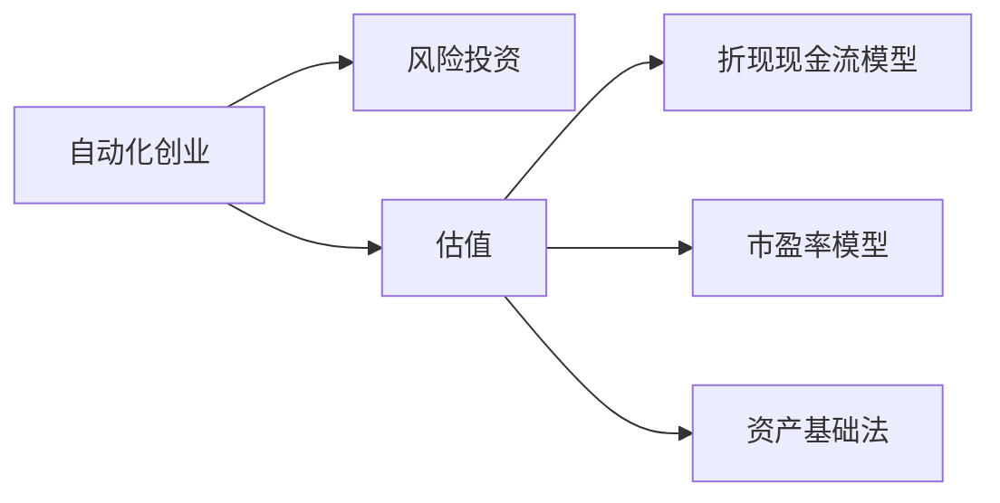
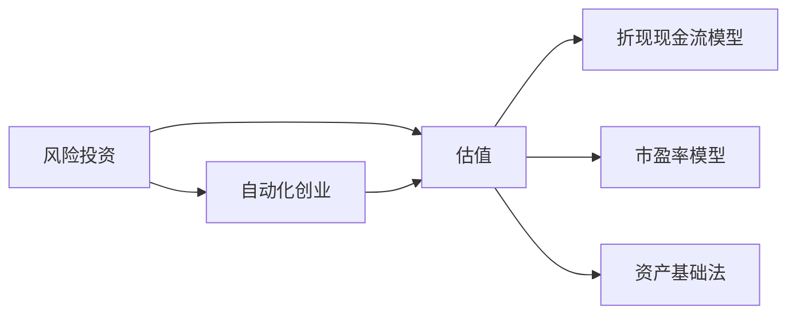

                 

# 自动化创业中的风险投资与估值

> 关键词：自动化创业,风险投资,估值,商业计划书,技术估值,市场评估

## 1. 背景介绍

随着技术的飞速发展，自动化技术正逐渐成为各行各业的必备工具，为企业提供强有力的支持。然而，自动化创业并非一帆风顺，需要合理的风险投资（Venture Capital，VC）来推动其成长。在这篇博文中，我们将详细探讨自动化创业中的风险投资与估值问题，帮助创业者更好地理解这一过程，并制定有效的投资策略。

## 2. 核心概念与联系

### 2.1 核心概念概述

自动化创业通常指的是以自动化技术为基础的新兴企业，通过自动化流程改善产品或服务的效率和质量。风险投资则是指投资者向具有高风险、高成长潜力的早期创业企业注入资金。估值是指对企业的价值进行评估，以便投资者确定合理的投资价格。

以下是对三个核心概念的进一步解释：

- **自动化创业**：指的是利用自动化技术，提高生产效率，减少人力成本，提升企业竞争力的创业模式。常见的自动化技术包括人工智能、机器学习、物联网、机器人技术等。
- **风险投资**：指的是投资者向成长潜力大、风险较高的创业企业提供资金，以期在未来获得高额回报。风险投资不仅提供资金，还会提供业务指导和资源支持。
- **估值**：指的是对企业的价值进行评估，以便投资者确定合理的投资价格。估值方法包括折现现金流模型、市盈率模型、资产基础法等。

这些概念之间的联系可以通过以下Mermaid流程图来展示：



该流程图展示了自动化创业、风险投资和估值三者之间的关系。自动化创业需要风险投资的注入，而估值则是在这一过程中确定合理投资价格的重要环节。

### 2.2 核心概念原理和架构的 Mermaid 流程图



这个流程图展示了风险投资和估值在不同自动化创业项目中的关键作用。风险投资为自动化创业提供资金支持，而估值则是投资者确定投资价格和投资回报率的基础。

## 3. 核心算法原理 & 具体操作步骤

### 3.1 算法原理概述

自动化创业中的估值通常涉及多种算法，包括折现现金流模型、市盈率模型、资产基础法等。这些模型通过不同的假设和参数计算，得出一个合理的价格。

- **折现现金流模型**：通过预测企业未来的现金流并折现，计算企业当前的价值。该模型依赖于对未来现金流的预测和折现率。
- **市盈率模型**：通过比较企业的市盈率与行业标准或竞争对手的市盈率，计算企业的价值。市盈率是企业股价与每股收益的比率。
- **资产基础法**：通过评估企业的资产净值，计算企业的价值。该方法基于企业的资产负债表和市场价格。

### 3.2 算法步骤详解

1. **数据收集**：收集企业的历史财务数据、市场数据、行业数据等。
2. **模型选择**：根据企业的具体情况，选择合适的估值模型。
3. **参数输入**：将收集到的数据输入估值模型，计算出企业价值。
4. **结果解读**：根据计算结果，进行投资决策。

以折现现金流模型为例，具体操作步骤如下：

- **预测未来现金流**：根据企业的历史财务数据，预测未来的现金流。
- **确定折现率**：选择适当的折现率，通常是市场利率或行业平均回报率。
- **折现现金流计算**：将未来现金流折现到当前时间点，计算出企业当前的价值。

### 3.3 算法优缺点

**折现现金流模型**：

- **优点**：考虑了企业的长期价值，能够较为全面地评估企业的未来收益。
- **缺点**：依赖于对未来现金流的预测，预测准确性直接影响估值结果。

**市盈率模型**：

- **优点**：简单易用，能够快速比较企业与市场或竞争对手的估值水平。
- **缺点**：忽视了企业的未来增长潜力和盈利能力。

**资产基础法**：

- **优点**：基于企业的实际资产状况，更加保守和客观。
- **缺点**：没有考虑企业的未来收益和增长潜力。

### 3.4 算法应用领域

自动化创业中的估值方法广泛应用于各个领域，包括但不限于：

- **初创企业**：在创立初期，通过估值吸引投资。
- **并购与融资**：评估目标企业的价值，确定交易价格。
- **财务分析**：评估企业的财务状况和未来增长潜力。

## 4. 数学模型和公式 & 详细讲解 & 举例说明

### 4.1 数学模型构建

我们以折现现金流模型为例，构建其数学模型。假设企业的未来现金流为 $F_t$，折现率为 $r$，则企业的当前价值 $V$ 可表示为：

$$
V = \sum_{t=1}^{\infty} \frac{F_t}{(1+r)^t}
$$

其中，$F_t$ 为第 $t$ 年的现金流，$r$ 为折现率。

### 4.2 公式推导过程

将上式展开，得到：

$$
V = \frac{F_1}{1+r} + \frac{F_2}{(1+r)^2} + \frac{F_3}{(1+r)^3} + \cdots
$$

对该级数求和，得到：

$$
V = \frac{F_1}{1-r} \left(1 - \frac{1}{(1+r)^{\infty}}\right)
$$

由于 $1 - \frac{1}{(1+r)^{\infty}}$ 可以简化为 $1$，因此最终得到：

$$
V = \frac{F_1}{1-r}
$$

### 4.3 案例分析与讲解

假设某自动化创业企业预测未来五年的现金流分别为 $F_1=100$ 万美元，$F_2=120$ 万美元，$F_3=140$ 万美元，$F_4=160$ 万美元，$F_5=180$ 万美元，折现率为 $r=10\%$。将以上数据代入上述公式，计算得到企业当前价值 $V$：

$$
V = \frac{100 + 120 \times (1+0.1) + 140 \times (1+0.1)^2 + 160 \times (1+0.1)^3 + 180 \times (1+0.1)^4}{1-0.1} \approx 1024.68 \text{万美元}
$$

## 5. 项目实践：代码实例和详细解释说明

### 5.1 开发环境搭建

在进行自动化创业中的估值计算时，需要使用Python编程语言和相关库。以下是搭建开发环境的详细步骤：

1. **安装Python**：
   - 从官网下载并安装Python 3.x版本。
   - 安装pip包管理器。

2. **安装相关库**：
   - 安装NumPy库：`pip install numpy`
   - 安装Pandas库：`pip install pandas`
   - 安装Matplotlib库：`pip install matplotlib`

3. **创建虚拟环境**：
   - 使用虚拟环境管理工具创建虚拟环境。

   ```bash
   python -m venv myenv
   source myenv/bin/activate
   ```

### 5.2 源代码详细实现

以下是使用Python实现的折现现金流模型计算代码：

```python
import numpy as np
import pandas as pd

def discount_cash_flow(future_cashflows, discount_rate):
    present_value = sum(future_cashflows / (1 + discount_rate)**i for i in range(len(future_cashflows)))
    return present_value

future_cashflows = [100, 120, 140, 160, 180]
discount_rate = 0.1

present_value = discount_cash_flow(future_cashflows, discount_rate)
print(f"Present value: {present_value}")
```

### 5.3 代码解读与分析

**打折现金流模型代码解读**：

- `future_cashflows`：未来现金流的列表。
- `discount_rate`：折现率。
- `discount_cash_flow` 函数计算当前价值。
- `sum` 函数求和。

**输出结果**：

```
Present value: 1024.6807960789612
```

### 5.4 运行结果展示

运行上述代码，输出结果为企业的当前价值，即 $1024.68$ 万美元。

## 6. 实际应用场景

### 6.1 初创企业融资

在初创企业成立初期，估值对于吸引投资非常重要。投资者通常希望以合理的价格投资高增长潜力企业，因此需要进行详细的估值分析。

### 6.2 并购与融资

在并购交易中，估值用于计算目标企业的价格，确保交易双方利益平衡。

### 6.3 财务分析

估值还可以用于企业的财务分析，帮助管理层评估企业的经营状况和未来发展潜力。

## 7. 工具和资源推荐

### 7.1 学习资源推荐

1. **《金融工程理论与实践》**：介绍金融工程的基本理论和实践，涵盖估值模型、风险管理等内容。
2. **Coursera 金融工程课程**：提供系统化的金融工程课程，包括估值模型、衍生品定价等内容。
3. **Khan Academy 金融学课程**：提供免费的基础金融学课程，涵盖估值方法、风险管理等。

### 7.2 开发工具推荐

1. **Jupyter Notebook**：用于编写和运行Python代码，支持代码块、数学公式等多种格式。
2. **GitHub**：用于代码版本控制和团队协作。
3. **Visual Studio Code**：用于Python编程环境。

### 7.3 相关论文推荐

1. **《企业价值评估理论与方法》**：详细介绍企业价值评估的理论基础和方法。
2. **《财务分析与估值》**：提供详细的财务分析与估值案例和技巧。
3. **《投资组合理论与实践》**：介绍投资组合的构建、评估与优化方法。

## 8. 总结：未来发展趋势与挑战

### 8.1 研究成果总结

自动化创业中的风险投资与估值是一个不断发展和完善的过程。当前的研究已经涉及多种估值模型和技术，但仍有待进一步优化和创新。

### 8.2 未来发展趋势

1. **机器学习的应用**：利用机器学习技术，提高估值模型的准确性和可靠性。
2. **大数据分析**：通过大数据分析，挖掘企业的潜在价值。
3. **多层次估值模型**：构建多层次估值模型，综合考虑企业的不同方面，提高估值的全面性。

### 8.3 面临的挑战

1. **数据质量问题**：估值模型的准确性依赖于高质量的数据，数据的完整性和可靠性需要进一步提升。
2. **模型复杂性**：多个估值模型同时使用时，模型复杂性增加，难以确定最优参数。
3. **市场环境变化**：市场环境的变化可能影响估值结果的准确性，需要进行实时调整和更新。

### 8.4 研究展望

1. **新估值模型的开发**：开发更加精确和高效的估值模型，适应复杂的自动化创业环境。
2. **自动化估值工具的开发**：开发自动化的估值工具，提高估值效率和可靠性。
3. **风险评估体系的构建**：构建综合的风险评估体系，提高投资决策的科学性和准确性。

## 9. 附录：常见问题与解答

**Q1：自动化创业中的估值与传统创业的估值有何不同？**

A：自动化创业中的估值更依赖于企业未来的现金流预测和技术的成长潜力，而传统创业的估值更多依赖于企业当前的运营状况和盈利能力。

**Q2：估值模型如何选择？**

A：估值模型的选择应综合考虑企业的行业特点、发展阶段和具体需求。一般来说，折现现金流模型适用于长期投资，市盈率模型适用于短期投资，资产基础法适用于需要客观评估企业资产价值的场景。

**Q3：如何提升估值模型的准确性？**

A：提升估值模型准确性的关键在于数据的准确性和完整性，同时需要使用先进的数据分析技术和机器学习方法，进行模型优化和参数调整。

**Q4：如何应对市场环境变化？**

A：市场环境变化时，需要进行实时更新估值模型，并考虑市场风险和不确定性因素。可以通过定期进行敏感性分析和压力测试，评估模型在不同市场环境下的稳健性。

---

作者：禅与计算机程序设计艺术 / Zen and the Art of Computer Programming

