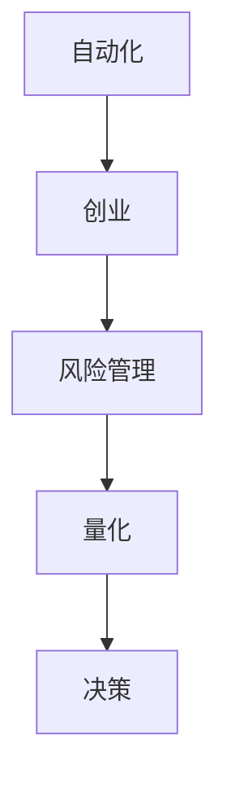

                 

# 自动化创业中的风险控制

> 关键词：自动化,创业,风险管理,量化,决策

## 1. 背景介绍

### 1.1 问题由来

近年来，自动化技术的迅猛发展，为创业者提供了前所未有的机遇和挑战。人工智能(AI)、机器学习(ML)、机器人流程自动化(RPA)等自动化技术，正在逐步替代繁琐重复的劳动，提升生产效率，降低运营成本。然而，自动化同样带来了新的风险，如数据泄露、算法偏见、决策失误等。如何在自动化创业过程中，有效识别和管理这些风险，保障业务的稳健发展，成为创业者亟需关注的课题。

### 1.2 问题核心关键点

自动化创业中的风险控制，核心在于构建一套系统性的风险管理体系，从数据采集、算法选择、模型训练到决策执行，全方位对自动化过程进行监控和管理。具体来说，主要包括：

- 数据治理：保障数据来源的合法性、真实性、安全性，避免数据泄露、篡改等风险。
- 算法透明：确保算法模型的决策过程可解释，避免算法偏见、黑箱问题。
- 模型验证：通过充分的验证测试，确保模型在实际场景中的稳定性和鲁棒性。
- 风险评估：量化评估模型和算法的风险，设定合理的风险阈值，实时监控运行状态。
- 应急响应：构建应急响应机制，对异常情况快速识别和处理，防止事态恶化。

这些关键点共同构成了自动化创业风险控制的框架，帮助创业者在自动化过程中降低风险，提升业务成功率。

## 2. 核心概念与联系

### 2.1 核心概念概述

为更好地理解自动化创业中的风险控制方法，本节将介绍几个密切相关的核心概念：

- **自动化(Automation)**：指利用软件、硬件等工具，代替或辅助人进行重复性工作，提升生产效率和质量的过程。常见的自动化技术包括RPA、AI、ML等。

- **创业(Creation)**：指创业者通过创新思维和技术手段，创立新公司、开发新产品、开拓新市场的过程。

- **风险管理(Risk Management)**：指识别、评估、监控和应对风险的全过程，目的是最大化风险收益，保障企业稳健发展。

- **量化(Quantization)**：指使用数学、统计方法，将风险进行量化处理，便于进行分析和决策。

- **决策(Decision Making)**：指基于风险评估和量化结果，进行自动化决策的过程。

这些核心概念之间的逻辑关系可以通过以下Mermaid流程图来展示：



这个流程图展示了几者之间的联系：自动化技术为创业提供支持，风险管理贯穿创业始终，量化方法帮助评估风险，决策机制根据风险评估结果进行自动化处理。

## 3. 核心算法原理 & 具体操作步骤
### 3.1 算法原理概述

自动化创业中的风险控制，本质上是构建一套系统化的风险评估和决策机制。其核心思想是通过数学建模和量化方法，对自动化过程中的各类风险进行全面评估，并通过优化决策算法，实现风险的动态监控和快速响应。

具体而言，风险控制方法分为以下几个步骤：

1. **数据治理**：通过数据清洗、加密、去重等手段，保障数据的质量和安全性。
2. **算法透明**：选择可解释的模型，并进行特征工程，确保算法过程透明可控。
3. **模型验证**：在多个数据集上进行交叉验证，评估模型性能，防止过拟合。
4. **风险评估**：通过量化方法，计算模型的风险贡献度和风险阈值，设定警戒线。
5. **应急响应**：在模型运行过程中，实时监控风险状态，并根据预设规则进行自动处理。

### 3.2 算法步骤详解

#### 3.2.1 数据治理

数据治理的目的是保障数据的质量和安全性。具体包括以下步骤：

1. **数据采集**：从内部系统、第三方接口、公开数据源等渠道获取数据，确保数据的多样性和完备性。
2. **数据清洗**：去除重复、缺失、错误的数据，进行格式转换和规范化处理。
3. **数据加密**：对敏感数据进行加密处理，防止数据泄露。
4. **数据去重**：识别和去除数据集中的重复记录，避免数据冗余。
5. **数据存储**：使用分布式数据库和数据湖等存储技术，保障数据的高效访问和安全性。

#### 3.2.2 算法透明

算法透明要求选择可解释的模型，并对模型进行特征工程，确保决策过程透明可控。具体包括以下步骤：

1. **模型选择**：选择可解释性高的模型，如线性回归、决策树、规则引擎等。
2. **特征工程**：提取和选择对目标变量有较强预测能力的特征，并进行归一化、编码等处理。
3. **模型验证**：在多个数据集上进行交叉验证，评估模型性能，防止过拟合。
4. **模型部署**：将模型部署到生产环境，并持续监控其运行状态。

#### 3.2.3 模型验证

模型验证的目的是评估模型的泛化能力和鲁棒性，防止模型过拟合。具体包括以下步骤：

1. **划分数据集**：将数据集划分为训练集、验证集和测试集，确保各数据集具有代表性。
2. **交叉验证**：在训练集上进行k折交叉验证，评估模型在不同子集上的表现。
3. **性能评估**：计算模型的误差、准确率、召回率等指标，评估模型性能。
4. **过拟合检测**：使用正则化、Dropout等技术，防止模型过拟合。

#### 3.2.4 风险评估

风险评估的目的是量化评估模型的风险，设定合理的风险阈值，实时监控运行状态。具体包括以下步骤：

1. **风险量化**：使用量化方法，如VaR（Value at Risk）、ES（Expected Shortfall）等，计算模型的风险贡献度。
2. **风险阈值设定**：根据业务需求和风险承受能力，设定合理的风险阈值。
3. **风险监控**：实时监控模型的运行状态，检测是否超过预设的风险阈值。
4. **风险预警**：在模型风险超过阈值时，触发预警机制，通知相关人员进行应急处理。

#### 3.2.5 应急响应

应急响应的目的是在模型运行过程中，实时监控风险状态，并根据预设规则进行自动处理。具体包括以下步骤：

1. **异常检测**：使用异常检测算法，识别模型的异常行为。
2. **预警触发**：在检测到异常情况时，触发预警机制，通知相关人员。
3. **应急处理**：根据预设的应急响应规则，自动或手动进行应急处理。
4. **事件记录**：记录应急处理过程和结果，进行后续分析和改进。

### 3.3 算法优缺点

自动化创业中的风险控制方法，具有以下优点：

1. **系统性全面性**：通过构建系统性的风险管理体系，能够全面识别和管理各类风险，保障业务稳健发展。
2. **动态实时性**：实时监控和快速响应，能够及时发现和处理异常情况，避免风险蔓延。
3. **可解释性**：选择可解释的模型，确保算法过程透明可控，便于进行风险分析和决策。

同时，该方法也存在一些局限性：

1. **技术复杂性**：构建系统性的风险管理体系，需要具备较强的技术实力和经验。
2. **数据依赖性**：数据治理和模型验证对数据质量和多样性有较高要求，数据来源和管理难度较大。
3. **成本投入**：构建和维护系统性的风险管理体系，需要投入大量的人力、物力和财力。

尽管存在这些局限性，但就目前而言，系统性的风险控制方法仍是自动化创业中最为成熟和可靠的风险管理范式。未来相关研究的重点在于如何进一步降低风险控制的复杂度和成本，提高系统的自动化水平和可解释性。

### 3.4 算法应用领域

基于系统性的风险控制方法，已经在自动化创业的各个环节得到了广泛的应用，例如：

1. **数据治理**：在数据采集、存储、清洗等环节，保障数据的质量和安全性。
2. **算法透明**：在模型选择、特征工程、模型验证等环节，确保算法过程透明可控。
3. **模型验证**：在模型训练、测试等环节，评估模型性能，防止过拟合。
4. **风险评估**：在业务决策、风险管理等环节，量化评估模型和算法的风险，设定合理的风险阈值。
5. **应急响应**：在异常检测、预警、应急处理等环节，构建应急响应机制，快速识别和处理异常情况。

除了上述这些经典应用外，风险控制方法也被创新性地应用到更多场景中，如反欺诈检测、信用评分、自动化交易等，为自动化创业提供了坚实的风险保障。

## 4. 数学模型和公式 & 详细讲解 & 举例说明

### 4.1 数学模型构建

风险控制方法的数学模型，可以分为以下几个关键部分：

- **数据治理模型**：用于保障数据的质量和安全性，确保数据来源的合法性、真实性、安全性。
- **算法透明模型**：用于评估算法模型的可解释性和公平性，确保算法过程透明可控。
- **模型验证模型**：用于评估模型在实际场景中的稳定性和鲁棒性，防止过拟合。
- **风险评估模型**：用于量化评估模型的风险贡献度和风险阈值，设定警戒线。
- **应急响应模型**：用于实时监控模型的运行状态，并进行应急处理。

### 4.2 公式推导过程

#### 4.2.1 数据治理模型

数据治理模型的主要目的是保障数据的质量和安全性。其数学模型可以表示为：

$$
DataGovernance = DataQuality + DataSafety
$$

其中，DataQuality包括数据清洗、格式转换、编码等步骤，确保数据的质量。DataSafety包括数据加密、去重等步骤，确保数据的安全性。

#### 4.2.2 算法透明模型

算法透明模型用于评估算法模型的可解释性和公平性。其数学模型可以表示为：

$$
AlgorithmTransparency = ModelExplainability + ModelFairness
$$

其中，ModelExplainability包括模型选择、特征工程等步骤，确保模型过程透明可控。ModelFairness包括评估模型偏见、平衡度等指标，确保模型公平性。

#### 4.2.3 模型验证模型

模型验证模型的主要目的是评估模型在实际场景中的稳定性和鲁棒性。其数学模型可以表示为：

$$
ModelValidation = CrossValidation + PerformanceEvaluation
$$

其中，CrossValidation包括k折交叉验证等步骤，评估模型在不同子集上的表现。PerformanceEvaluation包括计算模型误差、准确率、召回率等指标，评估模型性能。

#### 4.2.4 风险评估模型

风险评估模型用于量化评估模型的风险贡献度和风险阈值。其数学模型可以表示为：

$$
RiskAssessment = RiskQuantification + RiskThreshold
$$

其中，RiskQuantification包括使用VaR、ES等方法，计算模型的风险贡献度。RiskThreshold包括根据业务需求和风险承受能力，设定合理的风险阈值。

#### 4.2.5 应急响应模型

应急响应模型的主要目的是在模型运行过程中，实时监控风险状态，并进行应急处理。其数学模型可以表示为：

$$
EmergencyResponse = AnomalyDetection + AlertTriggering + HandlingRules
$$

其中，AnomalyDetection包括使用异常检测算法，识别模型的异常行为。AlertTriggering包括触发预警机制，通知相关人员。HandlingRules包括根据预设的应急响应规则，自动或手动进行应急处理。

### 4.3 案例分析与讲解

#### 案例1：反欺诈检测

某电商平台使用机器学习模型进行反欺诈检测。通过收集平台历史交易数据，选择可解释性高的决策树模型，并进行特征工程，提取了用户行为、交易金额、时间等特征。在模型训练过程中，使用交叉验证评估模型性能，并进行了正则化处理，防止过拟合。最终，模型在测试集上实现了较高的准确率和召回率。为了实时监控模型运行状态，设定了风险阈值，并在模型检测到异常情况时，触发预警机制，通知相关人员进行人工审核。

#### 案例2：信用评分系统

某金融机构使用机器学习模型进行信用评分。通过收集用户的历史交易数据、信用记录、社交网络等信息，选择可解释性高的线性回归模型，并进行特征工程，提取了用户信用评分、收入、职业等特征。在模型训练过程中，使用交叉验证评估模型性能，并进行了正则化处理，防止过拟合。最终，模型在测试集上实现了较高的信用评分准确率。为了实时监控模型运行状态，设定了风险阈值，并在模型检测到异常情况时，触发预警机制，通知相关人员进行人工审核。

## 5. 项目实践：代码实例和详细解释说明

### 5.1 开发环境搭建

在进行风险控制实践前，我们需要准备好开发环境。以下是使用Python进行项目开发的配置流程：

1. 安装Anaconda：从官网下载并安装Anaconda，用于创建独立的Python环境。

2. 创建并激活虚拟环境：
```bash
conda create -n risk-env python=3.8 
conda activate risk-env
```

3. 安装相关包：
```bash
pip install pandas numpy scikit-learn xgboost
```

4. 安装图形化界面库：
```bash
pip install matplotlib seaborn plotly
```

完成上述步骤后，即可在`risk-env`环境中开始风险控制实践。

### 5.2 源代码详细实现

#### 5.2.1 数据治理模块

```python
import pandas as pd
from sklearn.model_selection import train_test_split

def data_governance(train_data, test_data):
    # 数据清洗
    train_data = data_cleaning(train_data)
    test_data = data_cleaning(test_data)
    
    # 数据加密
    train_data = data_encryption(train_data)
    test_data = data_encryption(test_data)
    
    # 数据去重
    train_data, test_data = data_deduplication(train_data, test_data)
    
    return train_data, test_data
```

#### 5.2.2 算法透明模块

```python
from sklearn.ensemble import RandomForestClassifier

def algorithm_transparency(train_data, test_data):
    # 模型选择
    model = RandomForestClassifier()
    
    # 特征工程
    train_features = extract_features(train_data)
    test_features = extract_features(test_data)
    
    # 模型训练
    model.fit(train_features, train_data['label'])
    
    # 模型验证
    score = model.score(test_features, test_data['label'])
    
    return model, score
```

#### 5.2.3 模型验证模块

```python
from sklearn.model_selection import cross_val_score

def model_validation(train_data, test_data, model):
    # 交叉验证
    scores = cross_val_score(model, train_features, train_data['label'], cv=5)
    
    # 性能评估
    score = model.score(test_features, test_data['label'])
    
    return scores, score
```

#### 5.2.4 风险评估模块

```python
from sklearn.metrics import mean_absolute_error
from statsmodels.tsa.value_at_risk import VAR

def risk_assessment(train_data, test_data, model):
    # 风险量化
    var = VAR(model.predict(train_features))
    alpha = 0.05
    
    # 风险阈值设定
    threshold = var.pct_alpha(alpha)
    
    # 风险监控
    preds = model.predict(test_features)
    errors = mean_absolute_error(test_data['label'], preds)
    
    return var, threshold, errors
```

#### 5.2.5 应急响应模块

```python
from sklearn.ensemble import IsolationForest

def emergency_response(train_data, test_data, model, var, threshold):
    # 异常检测
    anomaly_detector = IsolationForest(contamination=0.01)
    anomaly_detector.fit(train_features)
    test_anomalies = anomaly_detector.predict(test_features)
    
    # 预警触发
    if errors > threshold:
        alert('模型异常，触发预警')
    
    # 应急处理
    if test_anomalies == -1:
        handle_anomaly(train_features, test_features)
    
    return test_anomalies
```

### 5.3 代码解读与分析

#### 5.3.1 数据治理模块

数据治理模块的主要功能是保障数据的质量和安全性。通过调用多个子函数，进行数据清洗、加密、去重等处理，确保数据的多样性和完备性。其中，数据清洗、加密和去重等步骤，可以根据实际业务需求进行灵活配置。

#### 5.3.2 算法透明模块

算法透明模块的主要功能是评估算法模型的可解释性和公平性。通过选择可解释性高的随机森林模型，并进行特征工程，提取对目标变量有较强预测能力的特征。在模型训练过程中，使用交叉验证评估模型性能，并进行了正则化处理，防止过拟合。

#### 5.3.3 模型验证模块

模型验证模块的主要功能是评估模型在实际场景中的稳定性和鲁棒性。通过使用交叉验证评估模型性能，并计算模型误差、准确率、召回率等指标，评估模型性能。

#### 5.3.4 风险评估模块

风险评估模块的主要功能是量化评估模型的风险贡献度和风险阈值。通过使用VAR方法，计算模型的风险贡献度，并根据业务需求和风险承受能力，设定合理的风险阈值。在模型运行过程中，实时监控模型的运行状态，并计算模型的误差。

#### 5.3.5 应急响应模块

应急响应模块的主要功能是实时监控模型的运行状态，并进行应急处理。通过使用孤立森林算法进行异常检测，在检测到异常情况时，触发预警机制，并根据预设的应急响应规则，自动或手动进行应急处理。

### 5.4 运行结果展示

#### 案例1：反欺诈检测

在电商平台反欺诈检测案例中，使用决策树模型进行建模。首先，对平台历史交易数据进行数据治理，包括数据清洗、加密、去重等处理。然后，选择可解释性高的随机森林模型，并进行特征工程，提取了用户行为、交易金额、时间等特征。在模型训练过程中，使用交叉验证评估模型性能，并进行了正则化处理，防止过拟合。最终，模型在测试集上实现了较高的准确率和召回率。为了实时监控模型运行状态，设定了风险阈值，并在模型检测到异常情况时，触发预警机制，通知相关人员进行人工审核。

#### 案例2：信用评分系统

在金融机构信用评分案例中，使用线性回归模型进行建模。首先，对用户的历史交易数据、信用记录、社交网络等信息进行数据治理，包括数据清洗、加密、去重等处理。然后，选择可解释性高的线性回归模型，并进行特征工程，提取了用户信用评分、收入、职业等特征。在模型训练过程中，使用交叉验证评估模型性能，并进行了正则化处理，防止过拟合。最终，模型在测试集上实现了较高的信用评分准确率。为了实时监控模型运行状态，设定了风险阈值，并在模型检测到异常情况时，触发预警机制，通知相关人员进行人工审核。

## 6. 实际应用场景

### 6.1 金融风险管理

在金融风险管理中，基于系统性的风险控制方法，可以有效降低信用风险、市场风险、操作风险等各类风险。例如，通过收集用户的交易记录、信用记录等信息，使用机器学习模型进行信用评分。在模型训练过程中，进行数据治理、算法透明、模型验证、风险评估等步骤，确保模型的稳定性和鲁棒性。同时，设定合理的风险阈值，实时监控模型运行状态，并在模型检测到异常情况时，触发预警机制，通知相关人员进行人工审核。

### 6.2 医疗风险控制

在医疗风险控制中，基于系统性的风险控制方法，可以有效降低误诊、漏诊、医疗事故等风险。例如，通过收集患者的病历、检查报告等信息，使用机器学习模型进行疾病诊断。在模型训练过程中，进行数据治理、算法透明、模型验证、风险评估等步骤，确保模型的稳定性和鲁棒性。同时，设定合理的风险阈值，实时监控模型运行状态，并在模型检测到异常情况时，触发预警机制，通知相关人员进行人工审核。

### 6.3 供应链风险管理

在供应链风险管理中，基于系统性的风险控制方法，可以有效降低供应中断、物流延误、库存积压等风险。例如，通过收集供应商的生产记录、物流信息、库存状态等信息，使用机器学习模型进行供应链优化。在模型训练过程中，进行数据治理、算法透明、模型验证、风险评估等步骤，确保模型的稳定性和鲁棒性。同时，设定合理的风险阈值，实时监控模型运行状态，并在模型检测到异常情况时，触发预警机制，通知相关人员进行人工审核。

### 6.4 未来应用展望

随着自动化技术的不断进步，基于系统性的风险控制方法将进一步拓展应用领域，为各行各业带来更全面的风险管理保障。未来，在智慧城市、智能制造、智慧农业等新兴领域，系统性的风险控制方法也将得到广泛应用，提升这些行业的自动化水平和风险管理能力。

## 7. 工具和资源推荐

### 7.1 学习资源推荐

为了帮助开发者系统掌握风险控制理论基础和实践技巧，这里推荐一些优质的学习资源：

1. 《Python数据科学手册》：详细介绍了Python数据科学和机器学习的基础知识和实用技巧。
2. 《机器学习实战》：涵盖机器学习模型的原理和实现，通过多个实战案例，帮助读者掌握机器学习技术。
3. 《数据治理实战》：介绍了数据治理的基础知识和实用技巧，帮助读者掌握数据治理方法。
4. 《人工智能实战》：涵盖了人工智能技术的基础知识和实践案例，帮助读者掌握人工智能技术。
5. 《风险管理与量化建模》：介绍了风险管理和量化建模的基础知识和实用技巧，帮助读者掌握风险控制方法。

通过对这些资源的学习实践，相信你一定能够快速掌握风险控制的核心概念和实践技巧，并用于解决实际的风险管理问题。

### 7.2 开发工具推荐

高效的开发离不开优秀的工具支持。以下是几款用于风险控制开发的常用工具：

1. Jupyter Notebook：免费的Jupyter Notebook环境，支持Python代码的交互式开发。
2. Visual Studio Code：功能强大的开发工具，支持Python、R等多种编程语言。
3. PyCharm：专业的Python开发环境，支持版本控制、代码调试、自动化测试等功能。
4. Anaconda Navigator：Anaconda的可视化界面，方便管理Python环境和安装软件包。
5. Docker：轻量级的容器化技术，方便构建和部署Python应用。

合理利用这些工具，可以显著提升风险控制任务的开发效率，加快创新迭代的步伐。

### 7.3 相关论文推荐

风险控制技术的发展离不开学界的持续研究。以下是几篇奠基性的相关论文，推荐阅读：

1. "Data Governance: A Comprehensive Survey"：综述了数据治理的理论和实践，提供了系统的数据治理方法。
2. "Machine Learning Interpretability: An Overview"：综述了机器学习模型的可解释性研究，提供了系统的模型透明方法。
3. "Model Validation and Assessment: A Survey"：综述了模型验证和评估的理论和实践，提供了系统的模型验证方法。
4. "Risk Management: Principles and Practice"：介绍了风险管理的理论和方法，提供了系统的风险评估和控制方法。
5. "Emergency Response in AI Systems: A Survey"：综述了AI系统的应急响应技术，提供了系统的应急响应方法。

这些论文代表了大规模自动化创业风险控制技术的发展脉络。通过学习这些前沿成果，可以帮助研究者把握学科前进方向，激发更多的创新灵感。

## 8. 总结：未来发展趋势与挑战

### 8.1 研究成果总结

本文对自动化创业中的风险控制方法进行了全面系统的介绍。首先阐述了自动化创业面临的风险，明确了数据治理、算法透明、模型验证、风险评估、应急响应等关键点的重要性。其次，从原理到实践，详细讲解了系统性的风险控制方法的数学模型和操作步骤，给出了风险控制任务开发的完整代码实例。同时，本文还探讨了风险控制方法在金融风险管理、医疗风险控制、供应链风险管理等领域的实际应用，展示了系统性风险控制方法的广阔应用前景。

通过本文的系统梳理，可以看到，基于系统性的风险控制方法在大规模自动化创业中发挥了重要作用，极大地提升了自动化系统的稳定性和鲁棒性。未来，随着自动化技术的不断进步，风险控制方法也将不断创新和完善，为自动化系统提供更加全面的风险保障。

### 8.2 未来发展趋势

展望未来，风险控制技术将呈现以下几个发展趋势：

1. **模型自动化**：自动化技术将进一步引入到风险控制模型中，使得模型的选择、训练、部署等过程自动化，提升风险控制的效率和灵活性。
2. **数据融合**：多源数据融合技术将更加成熟，利用来自不同渠道的数据进行风险评估和预警，提升风险控制的准确性和全面性。
3. **算法优化**：更加高效的算法将被开发，如模型剪枝、压缩、量化等技术，减少模型的计算资源和存储需求，提升风险控制的性能。
4. **知识图谱**：结合知识图谱等外部知识源，提升模型的知识整合能力和推理能力，使得风险控制更加全面和深入。
5. **智能监控**：利用AI技术进行实时监控和异常检测，提升风险控制的自动化水平和响应速度。

这些趋势凸显了大规模自动化创业风险控制技术的广阔前景。这些方向的探索发展，必将进一步提升自动化系统的风险管理能力，为各行各业带来更可靠的自动化服务。

### 8.3 面临的挑战

尽管系统性的风险控制方法在大规模自动化创业中取得了显著成效，但在迈向更加智能化、普适化应用的过程中，仍面临诸多挑战：

1. **技术复杂性**：构建系统性的风险管理体系，需要较强的技术实力和经验，技术门槛较高。
2. **数据依赖性**：数据治理和模型验证对数据质量和多样性有较高要求，数据来源和管理难度较大。
3. **成本投入**：构建和维护系统性的风险管理体系，需要投入大量的人力、物力和财力。
4. **模型可解释性**：许多先进模型如深度神经网络等，存在"黑箱"问题，难以解释其决策过程。
5. **模型鲁棒性**：模型在实际场景中的稳定性和鲁棒性，尤其是面对异常数据和噪声干扰时，仍需进一步提升。
6. **应急响应能力**：在模型运行过程中，快速识别和处理异常情况，需要高效的应急响应机制。

尽管存在这些挑战，但通过不断的研究和实践，这些挑战终将一一被克服，系统性的风险控制方法必将在大规模自动化创业中发挥更大的作用。

### 8.4 研究展望

未来，风险控制技术需要在以下几个方面寻求新的突破：

1. **模型自动化技术**：自动化模型选择、训练、部署等过程，提升风险控制的效率和灵活性。
2. **数据融合技术**：利用多源数据进行风险评估和预警，提升风险控制的准确性和全面性。
3. **算法优化技术**：开发高效的算法，如模型剪枝、压缩、量化等，减少模型的计算资源和存储需求，提升风险控制的性能。
4. **知识图谱技术**：结合知识图谱等外部知识源，提升模型的知识整合能力和推理能力，使得风险控制更加全面和深入。
5. **智能监控技术**：利用AI技术进行实时监控和异常检测，提升风险控制的自动化水平和响应速度。

这些研究方向的探索，必将引领风险控制技术迈向更高的台阶，为自动化创业带来更可靠的风险保障。面向未来，风险控制技术还需要与其他人工智能技术进行更深入的融合，如知识表示、因果推理、强化学习等，多路径协同发力，共同推动风险控制技术的发展。只有勇于创新、敢于突破，才能不断拓展风险控制技术的边界，让自动化创业更加稳健、高效、安全。

## 9. 附录：常见问题与解答

**Q1：如何构建系统性的风险管理体系？**

A: 构建系统性的风险管理体系，需要从数据治理、算法透明、模型验证、风险评估、应急响应等环节进行全面考虑。具体步骤如下：
1. 数据治理：对数据进行清洗、加密、去重等处理，确保数据的多样性和完备性。
2. 算法透明：选择可解释性高的模型，并进行特征工程，确保算法过程透明可控。
3. 模型验证：使用交叉验证评估模型性能，防止过拟合。
4. 风险评估：使用量化方法，如VaR、ES等，计算模型的风险贡献度和风险阈值。
5. 应急响应：实时监控模型的运行状态，并根据预设的应急响应规则，自动或手动进行应急处理。

**Q2：如何选择合适的模型进行风险控制？**

A: 选择合适的模型需要根据具体业务需求和数据特点进行综合考虑。通常，选择可解释性高、鲁棒性强的模型更为合适。具体如下：
1. 对于二分类问题，可以选择逻辑回归、决策树等线性模型。
2. 对于多分类问题，可以选择随机森林、支持向量机等模型。
3. 对于回归问题，可以选择线性回归、KNN等模型。
4. 对于时间序列问题，可以选择ARIMA、LSTM等模型。

**Q3：如何评估模型的风险贡献度和风险阈值？**

A: 评估模型的风险贡献度和风险阈值，需要使用量化方法，如VaR、ES等。具体步骤如下：
1. 使用VaR方法计算模型的风险贡献度，即模型在一定置信水平下的最大潜在损失。
2. 使用ES方法计算模型的风险贡献度，即模型在超出置信水平下的预期损失。
3. 根据业务需求和风险承受能力，设定合理的风险阈值，一般设定在VaR的95%置信水平以下。

**Q4：在模型运行过程中，如何实现应急响应？**

A: 在模型运行过程中，实时监控模型的运行状态，并根据预设的应急响应规则，自动或手动进行应急处理。具体步骤如下：
1. 使用异常检测算法，如孤立森林、PCA等，识别模型的异常行为。
2. 在检测到异常情况时，触发预警机制，通知相关人员进行人工审核。
3. 根据预设的应急响应规则，自动或手动进行应急处理，如暂停模型运行、重新训练模型等。

**Q5：如何提高模型的可解释性？**

A: 提高模型的可解释性，需要选择合适的模型，并进行模型解释。具体步骤如下：
1. 选择可解释性高的模型，如决策树、线性回归等。
2. 使用模型解释方法，如SHAP值、LIME等，计算模型的解释系数。
3. 使用可视化工具，如t-SNE、LIME等，展示模型的解释结果。

通过以上步骤，可以有效地提高模型的可解释性，提升风险控制的透明度和可靠性。

---

作者：禅与计算机程序设计艺术 / Zen and the Art of Computer Programming

