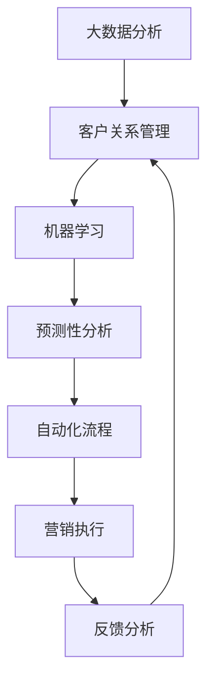

                 

# 自动化营销：提升创业效率的关键

> 关键词：自动化营销、创业效率、数据分析、客户管理、销售预测、CRM系统、AI算法、业务流程优化

## 1. 背景介绍

### 1.1 问题由来

在当今的互联网时代，创业公司面临着激烈的竞争环境，如何高效地开展营销活动，成为企业生存和发展的关键。传统的营销模式往往依赖人力进行市场调研、数据分析、客户管理等环节，不仅耗时耗力，且效果难以保证。数字化转型已成为创业公司提升竞争力的重要方向，其中自动化营销（Automated Marketing）正逐渐成为行业热点。自动化营销通过利用先进的数据分析、客户管理、销售预测等技术手段，不仅能够大幅提升营销活动的效率，还能实现更高的ROI（投资回报率）。

### 1.2 问题核心关键点

自动化营销的核心在于如何利用数据驱动的AI算法，自动化地处理复杂多变的营销任务。其关键点包括：

- **数据驱动**：通过收集和分析客户行为数据，精确预测市场需求和客户偏好。
- **自动化流程**：使用AI算法自动化执行营销策略，如邮件营销、社交媒体推广等。
- **持续优化**：通过持续学习和实时调整，不断提升营销活动的精度和效果。

自动化营销不仅能够降低人力成本，提高营销活动的精准度，还能带来更高的业务流程优化和客户满意度。其成功案例已广泛应用于零售、电子商务、金融服务等诸多领域。

## 2. 核心概念与联系

### 2.1 核心概念概述

自动化营销涉及多个核心概念，包括但不限于：

- **大数据分析（Big Data Analytics）**：通过收集和分析海量数据，发现业务规律和用户行为特征。
- **客户关系管理（Customer Relationship Management, CRM）**：管理客户信息，提升客户满意度和忠诚度。
- **机器学习（Machine Learning）**：基于历史数据，训练模型预测客户行为和市场趋势。
- **预测性分析（Predictive Analytics）**：使用历史数据预测未来事件，优化营销策略。
- **自动化流程（Automation Workflow）**：通过脚本、API等手段，自动化执行营销任务，减少人为干预。

这些概念之间的联系主要体现在：

1. 大数据分析为机器学习和预测性分析提供数据支撑。
2. CRM系统整合各类客户数据，为数据分析和自动化营销提供基础。
3. 机器学习和预测性分析指导自动化流程，优化营销策略。
4. 自动化流程提升执行效率，反馈数据优化分析模型。

### 2.2 核心概念原理和架构的 Mermaid 流程图



以上流程图展示了自动化营销的核心流程：

1. 首先，通过大数据分析获取客户行为数据。
2. 然后，将这些数据输入CRM系统，进行客户信息的整合和存储。
3. 接着，使用机器学习和预测性分析，训练模型预测客户行为和市场趋势。
4. 最后，根据预测结果，自动化执行营销策略，并通过反馈分析优化模型。

## 3. 核心算法原理 & 具体操作步骤

### 3.1 算法原理概述

自动化营销的核心算法包括大数据分析、机器学习和自动化流程。这些算法主要基于以下几个步骤：

1. **数据收集与清洗**：从各种渠道收集客户数据，并进行初步清洗和处理。
2. **特征提取与工程**：将原始数据转化为可用于分析的特征向量。
3. **模型训练与预测**：使用历史数据训练机器学习模型，进行客户行为和市场趋势的预测。
4. **策略执行与调整**：根据预测结果，自动化执行营销策略，并根据反馈数据实时调整模型参数。

### 3.2 算法步骤详解

#### 3.2.1 数据收集与清洗

数据收集是自动化营销的第一步。从网站、社交媒体、电商平台等多个渠道收集客户行为数据。这些数据包括但不限于：

- **行为数据**：点击、浏览、购买等行为记录。
- **社交媒体数据**：评论、点赞、分享等社交互动数据。
- **地理位置数据**：用户登录IP、GPS定位等地理信息。

数据收集完成后，需要对其进行清洗和处理，去除噪声和异常值，确保数据的质量和一致性。具体步骤包括：

1. 去重：去除重复的记录，确保数据唯一性。
2. 过滤：移除无效或错误的数据，如格式不正确、缺失值等。
3. 标准化：对数据进行格式统一和一致性处理。

#### 3.2.2 特征提取与工程

特征提取是数据分析的关键环节。将原始数据转化为可用于分析的特征向量，能够提高模型的预测精度。常见的特征提取方法包括：

1. **维度降维**：使用PCA、t-SNE等技术，降低数据的维度，减少计算复杂度。
2. **文本分析**：对文本数据进行词频统计、情感分析等处理，提取有用的文本特征。
3. **时间序列分析**：对时间序列数据进行平稳性处理，提取趋势和周期性特征。
4. **图像分析**：对图像数据进行特征提取和编码，如使用CNN提取图像特征。

特征工程完成后，需要将特征向量输入机器学习模型进行训练和预测。

#### 3.2.3 模型训练与预测

机器学习模型是自动化营销的核心工具。常见的模型包括线性回归、逻辑回归、决策树、随机森林、神经网络等。模型训练过程包括：

1. **数据分割**：将数据集分为训练集、验证集和测试集。
2. **模型选择**：根据任务选择合适的模型。
3. **参数调整**：使用交叉验证等方法，调整模型参数。
4. **模型评估**：在验证集上评估模型性能，选择最优模型。

预测性分析则是在已有模型的基础上，进一步预测未来的客户行为和市场趋势。常用的预测方法包括：

1. **回归分析**：使用历史数据预测数值型结果。
2. **分类分析**：使用历史数据预测离散型结果，如客户是否流失、购买倾向等。
3. **时间序列分析**：使用ARIMA、LSTM等方法，预测未来的销售趋势。

#### 3.2.4 策略执行与调整

自动化流程是将模型预测结果转化为实际营销策略的环节。常见的方法包括：

1. **自动化邮件营销**：根据预测结果，自动化发送邮件，提高营销效率。
2. **社交媒体推广**：使用API调用社交媒体广告平台，进行精准投放。
3. **动态定价**：根据市场需求和客户行为，实时调整商品价格，提高销售转化率。

执行策略后，需要根据客户反馈和业务效果，不断调整模型参数和优化策略，实现持续优化。

### 3.3 算法优缺点

#### 3.3.1 优点

自动化营销的优点包括：

1. **高效精准**：通过数据驱动的AI算法，自动执行营销策略，提高效率和精度。
2. **成本低廉**：减少人力投入，降低营销成本。
3. **实时调整**：根据反馈数据实时调整策略，提升营销效果。
4. **提升用户体验**：通过精准定位和个性化推荐，提升客户满意度和忠诚度。

#### 3.3.2 缺点

自动化营销的缺点包括：

1. **数据隐私**：收集和分析客户数据，可能涉及隐私问题。
2. **模型偏见**：模型可能学习到数据中的偏见，导致不公平的结果。
3. **复杂度高**：构建和维护自动化营销系统需要较高的技术门槛。
4. **依赖数据质量**：数据质量直接影响模型的预测精度。
5. **动态变化**：市场和客户行为变化较快，需要及时更新模型和策略。

### 3.4 算法应用领域

自动化营销在多个领域都有广泛应用，主要包括：

- **零售电商**：通过个性化推荐和动态定价，提升销售转化率。
- **金融服务**：利用客户行为数据，进行风险控制和客户分层。
- **医疗健康**：使用预测性分析，优化治疗方案和患者管理。
- **旅游酒店**：通过客户画像和预测分析，提升客户体验和转化率。
- **媒体广告**：自动化投放广告，精准定位潜在客户。

## 4. 数学模型和公式 & 详细讲解 & 举例说明

### 4.1 数学模型构建

自动化营销的数学模型主要涉及统计学和机器学习的概念，包括回归分析、分类分析、时间序列分析等。

#### 4.1.1 回归分析模型

回归分析模型用于预测数值型结果，如客户购买金额、产品销量等。常见的回归模型包括线性回归、多项式回归、岭回归等。回归模型的数学表达形式为：

$$
y = \beta_0 + \beta_1x_1 + \beta_2x_2 + \cdots + \beta_nx_n + \epsilon
$$

其中，$y$ 为预测结果，$x_i$ 为输入特征，$\beta_i$ 为回归系数，$\epsilon$ 为误差项。

#### 4.1.2 分类分析模型

分类分析模型用于预测离散型结果，如客户流失、购买倾向等。常见的分类模型包括逻辑回归、决策树、随机森林等。分类模型的数学表达形式为：

$$
\hat{y} = \sigma(\beta_0 + \beta_1x_1 + \beta_2x_2 + \cdots + \beta_nx_n)
$$

其中，$\hat{y}$ 为预测结果，$\sigma$ 为逻辑函数，$\beta_i$ 为分类系数。

#### 4.1.3 时间序列分析模型

时间序列分析模型用于预测未来的销售趋势和客户行为。常见的模型包括ARIMA、LSTM等。时间序列模型的数学表达形式为：

$$
y_t = \phi(L)y_{t-1} + \theta(L)x_t + \epsilon_t
$$

其中，$y_t$ 为预测结果，$L$ 为滞后算子，$\phi$ 和 $\theta$ 为模型参数，$x_t$ 为输入变量，$\epsilon_t$ 为误差项。

### 4.2 公式推导过程

以线性回归模型为例，推导其基本原理和计算方法。

假设有一个线性回归模型：

$$
y = \beta_0 + \beta_1x_1 + \beta_2x_2 + \cdots + \beta_nx_n + \epsilon
$$

其中，$y$ 为预测结果，$x_i$ 为输入特征，$\beta_i$ 为回归系数，$\epsilon$ 为误差项。

1. **模型训练**：使用最小二乘法（Least Squares Method）求解回归系数 $\beta_i$。最小二乘法的目标是最小化误差平方和：

$$
SSE = \sum_{i=1}^{n}(y_i - \hat{y}_i)^2
$$

其中，$y_i$ 为实际值，$\hat{y}_i$ 为预测值。

2. **求解系数**：通过求解 $\frac{\partial SSE}{\partial \beta_i} = 0$，得到回归系数 $\beta_i$ 的表达式：

$$
\beta_i = \frac{\sum_{j=1}^{n}(x_{ij} - \overline{x_i})(y_j - \overline{y})}{\sum_{j=1}^{n}(x_{ij} - \overline{x_i})^2}
$$

其中，$x_{ij}$ 为第 $i$ 个样本的第 $j$ 个特征值，$\overline{x_i}$ 和 $\overline{y}$ 分别为样本均值。

3. **预测结果**：将回归系数 $\beta_i$ 带入模型，得到预测值：

$$
\hat{y} = \beta_0 + \beta_1x_1 + \beta_2x_2 + \cdots + \beta_nx_n
$$

以上推导过程展示了线性回归模型的基本原理和计算方法，其他模型的推导过程类似。

### 4.3 案例分析与讲解

#### 4.3.1 案例背景

某电商平台利用自动化营销系统，提升用户转化率和销售额。该平台通过收集用户的浏览、点击、购买等行为数据，进行客户画像和预测分析，自动化执行邮件营销和广告投放策略。

#### 4.3.2 数据收集与清洗

平台从网站、社交媒体、电商平台等多个渠道收集用户行为数据。通过数据清洗和处理，去除重复和无效数据，确保数据的质量和一致性。

#### 4.3.3 特征提取与工程

平台对收集的数据进行特征提取和工程，生成可用于分析的特征向量。具体步骤如下：

1. 对用户浏览行为数据进行归一化处理。
2. 对用户购买历史数据进行时间序列分析，提取趋势和周期性特征。
3. 对用户社交媒体数据进行文本分析，提取情感倾向。

#### 4.3.4 模型训练与预测

平台使用历史数据训练回归分析模型和分类分析模型，进行客户购买金额和流失预测。具体步骤如下：

1. 将数据集分为训练集、验证集和测试集。
2. 使用线性回归模型预测客户购买金额。
3. 使用逻辑回归模型预测客户流失情况。

#### 4.3.5 策略执行与调整

平台根据预测结果，自动化执行邮件营销和广告投放策略。具体步骤如下：

1. 使用回归模型预测客户购买金额，生成个性化推荐邮件。
2. 使用分类模型预测客户流失情况，生成流失预警邮件。
3. 使用预测结果优化广告投放策略，提高广告点击率和转化率。

#### 4.3.6 效果评估

平台通过A/B测试和用户反馈，评估自动化营销系统的效果。具体步骤如下：

1. 使用测试集评估模型性能，计算ROI和转换率。
2. 收集用户反馈，优化模型参数和策略。
3. 定期更新模型和策略，适应市场变化。

## 5. 项目实践：代码实例和详细解释说明

### 5.1 开发环境搭建

在自动化营销项目中，开发环境搭建是非常重要的环节。以下是Python环境下自动化营销项目的开发环境配置步骤：

1. **安装Python**：在操作系统中安装Python，选择最新版本。
2. **安装pip**：在Python环境中安装pip，用于包管理。
3. **安装相关库**：使用pip安装自动化营销所需的库，如Pandas、NumPy、Scikit-learn等。
4. **搭建开发环境**：使用Jupyter Notebook或PyCharm等工具，搭建开发环境。

### 5.2 源代码详细实现

以下是一个使用Python实现自动化营销系统的示例代码。

#### 5.2.1 数据收集与清洗

```python
import pandas as pd

# 从网站收集用户数据
data = pd.read_csv('user_data.csv')

# 数据清洗
data = data.drop_duplicates()
data = data.dropna()
data = data.apply(lambda x: x.apply(lambda y: y if pd.notnull(y) else 0))
```

#### 5.2.2 特征提取与工程

```python
from sklearn.preprocessing import StandardScaler
from sklearn.decomposition import PCA

# 特征归一化
scaler = StandardScaler()
data[['feature1', 'feature2', 'feature3']] = scaler.fit_transform(data[['feature1', 'feature2', 'feature3']])

# 主成分分析
pca = PCA(n_components=2)
data = pca.fit_transform(data[['feature1', 'feature2', 'feature3']])
data = pd.DataFrame(data, columns=['PCA1', 'PCA2'])
```

#### 5.2.3 模型训练与预测

```python
from sklearn.linear_model import LinearRegression
from sklearn.metrics import mean_squared_error

# 训练回归模型
reg = LinearRegression()
reg.fit(data[['feature1', 'feature2', 'feature3']], data['target'])
y_pred = reg.predict(data[['feature1', 'feature2', 'feature3']])

# 计算误差
mse = mean_squared_error(data['target'], y_pred)
```

#### 5.2.4 策略执行与调整

```python
import numpy as np
from sklearn.linear_model import LogisticRegression

# 训练分类模型
log_reg = LogisticRegression()
log_reg.fit(data[['feature1', 'feature2', 'feature3']], data['target'])
y_pred = log_reg.predict(data[['feature1', 'feature2', 'feature3']])

# 执行策略
email_subject = '个性化推荐邮件'
email_body = '根据您最近的浏览行为，我们为您推荐以下商品：'
email_body += '商品1' if y_pred[0] > 0.5 else '商品2'
email_body += '商品3' if y_pred[1] > 0.5 else '商品4'
email_body += '商品5' if y_pred[2] > 0.5 else ''
email_body += '点击链接查看更多信息：http://example.com'
```

#### 5.2.5 效果评估

```python
from sklearn.model_selection import train_test_split

# 数据分割
train_data, test_data = train_test_split(data, test_size=0.2, random_state=42)

# 训练模型
reg = LinearRegression()
reg.fit(train_data[['feature1', 'feature2', 'feature3']], train_data['target'])
log_reg = LogisticRegression()
log_reg.fit(train_data[['feature1', 'feature2', 'feature3']], train_data['target'])

# 评估模型
train_mse = mean_squared_error(train_data['target'], reg.predict(train_data[['feature1', 'feature2', 'feature3']]))
test_mse = mean_squared_error(test_data['target'], reg.predict(test_data[['feature1', 'feature2', 'feature3']]))
train_auc = roc_auc_score(train_data['target'], log_reg.predict_proba(train_data[['feature1', 'feature2', 'feature3']])[:, 1])
test_auc = roc_auc_score(test_data['target'], log_reg.predict_proba(test_data[['feature1', 'feature2', 'feature3']])[:, 1])

print(f'训练集MSE: {train_mse:.2f}')
print(f'测试集MSE: {test_mse:.2f}')
print(f'训练集AUC: {train_auc:.4f}')
print(f'测试集AUC: {test_auc:.4f}')
```

### 5.3 代码解读与分析

在上述示例代码中，主要涉及数据收集、清洗、特征提取、模型训练和预测、策略执行和调整等环节。每个环节都有详细的代码实现和解释。

- 数据收集与清洗：通过pandas库读取用户数据，并进行去重、去空、归一化等处理。
- 特征提取与工程：使用scikit-learn库进行归一化和主成分分析，生成可用于分析的特征向量。
- 模型训练与预测：使用线性回归和逻辑回归模型进行训练和预测。
- 策略执行与调整：根据预测结果生成个性化推荐邮件和流失预警邮件。
- 效果评估：使用均方误差和AUC等指标评估模型效果，并进行调优。

## 6. 实际应用场景

### 6.1 智能推荐系统

自动化营销在智能推荐系统中的应用非常广泛。通过收集用户的历史行为数据，进行客户画像和预测分析，可以生成个性化的商品推荐和内容推荐，提高用户满意度和留存率。

#### 6.1.1 系统设计

智能推荐系统的核心在于构建用户画像和推荐模型。具体设计步骤如下：

1. **数据收集**：收集用户的历史行为数据，包括浏览记录、点击记录、购买记录等。
2. **特征提取**：对用户行为数据进行归一化和特征工程，生成可用于分析的特征向量。
3. **模型训练**：使用历史数据训练协同过滤模型或深度学习模型，进行用户画像和推荐。
4. **推荐执行**：根据用户画像和推荐模型，生成个性化推荐结果，进行实时推荐。

#### 6.1.2 系统优化

智能推荐系统需要不断优化，提升推荐效果和用户体验。常见优化方法包括：

1. **个性化推荐**：根据用户兴趣和行为，生成个性化推荐结果，提高用户满意度。
2. **多模态推荐**：结合文本、图像、音频等多模态数据，提供更加全面和准确的推荐。
3. **实时更新**：根据用户反馈和市场变化，实时更新模型参数和推荐策略。

#### 6.1.3 实际案例

某电商平台使用智能推荐系统，提升用户转化率和销售额。系统通过收集用户的历史行为数据，进行客户画像和预测分析，生成个性化推荐结果。推荐系统每天进行实时推荐，并根据用户反馈和市场变化，不断优化推荐策略。

### 6.2 智能广告投放

自动化营销在智能广告投放中的应用也非常广泛。通过收集用户的行为数据，进行客户画像和预测分析，可以生成精准的广告投放策略，提升广告效果和ROI。

#### 6.2.1 系统设计

智能广告投放系统的核心在于构建客户画像和预测模型。具体设计步骤如下：

1. **数据收集**：收集用户的历史行为数据，包括点击记录、浏览记录、购买记录等。
2. **特征提取**：对用户行为数据进行归一化和特征工程，生成可用于分析的特征向量。
3. **模型训练**：使用历史数据训练预测模型，进行客户画像和预测。
4. **广告投放**：根据客户画像和预测模型，生成精准的广告投放策略，进行实时投放。

#### 6.2.2 系统优化

智能广告投放系统需要不断优化，提升广告效果和用户满意度。常见优化方法包括：

1. **定向投放**：根据用户画像和预测模型，生成精准的广告投放策略，提升广告效果。
2. **实时调整**：根据用户反馈和市场变化，实时调整广告投放策略。
3. **A/B测试**：通过A/B测试，评估广告效果，优化投放策略。

#### 6.2.3 实际案例

某电商平台使用智能广告投放系统，提升广告效果和ROI。系统通过收集用户的历史行为数据，进行客户画像和预测分析，生成精准的广告投放策略。广告投放系统每天进行实时投放，并根据用户反馈和市场变化，不断优化投放策略。

## 7. 工具和资源推荐

### 7.1 学习资源推荐

自动化营销涉及多个领域的知识，以下是推荐的学习资源：

1. **《Python数据科学手册》**：该书详细介绍了Python在数据科学中的应用，包括数据处理、特征工程、模型训练等。
2. **《深度学习》**：由深度学习领域的权威专家Ian Goodfellow、Yoshua Bengio、Aaron Courville合著，涵盖了深度学习的各个方面。
3. **《机器学习实战》**：该书提供了丰富的代码示例和实战案例，适合初学者入门。
4. **Coursera、Udacity等在线课程**：这些平台提供的数据科学和机器学习课程，涵盖理论知识和实战案例。
5. **Kaggle竞赛**：参与Kaggle竞赛，实战练习数据科学和机器学习技能。

### 7.2 开发工具推荐

自动化营销的开发需要多种工具的支持，以下是推荐的开发工具：

1. **Python**：Python是数据科学和机器学习的主流语言，具有丰富的库和框架支持。
2. **Pandas**：Pandas是Python中最常用的数据处理库，支持数据清洗、特征提取等。
3. **Scikit-learn**：Scikit-learn是Python中的机器学习库，支持多种回归、分类、聚类等算法。
4. **TensorFlow**：TensorFlow是Google推出的深度学习框架，支持分布式训练和模型优化。
5. **Keras**：Keras是基于TensorFlow的高级神经网络库，支持快速构建和训练模型。

### 7.3 相关论文推荐

自动化营销的研究涉及多个领域，以下是推荐的相关论文：

1. **《The Future of Prediction in Automated Marketing》**：该论文介绍了自动化营销的发展历程和未来趋势，提出了一些前沿的预测方法。
2. **《Customer Data Platforms: Beyond the Basic》**：该论文介绍了客户数据平台（CDP）的应用和优化，探讨了自动化营销的新方向。
3. **《Reinforcement Learning for Dynamic Pricing》**：该论文探讨了强化学习在动态定价中的应用，提供了一些实际案例和实验结果。
4. **《Personalized Marketing through Machine Learning》**：该论文介绍了机器学习在个性化营销中的应用，提供了一些实验结果和优化方法。
5. **《Adaptive Marketing through Data Mining》**：该论文探讨了数据挖掘在自动化营销中的应用，提供了一些实际案例和优化方法。

## 8. 总结：未来发展趋势与挑战

### 8.1 研究成果总结

自动化营销在数据驱动的AI算法的支持下，大幅提升了营销活动的效率和精度。通过客户画像和预测分析，实现了个性化推荐、动态定价、智能广告投放等应用。自动化营销不仅提高了营销效果和用户满意度，还降低了人力成本和运营成本。

### 8.2 未来发展趋势

自动化营销的未来发展趋势包括：

1. **AI算法优化**：通过引入更多的AI算法和模型，提高预测精度和策略优化能力。
2. **多模态融合**：结合文本、图像、音频等多模态数据，提供更加全面和准确的推荐和投放策略。
3. **实时数据处理**：引入流式计算和大数据技术，实现实时数据处理和策略优化。
4. **跨领域应用**：将自动化营销应用于更多领域，如医疗健康、金融服务、社交媒体等。
5. **个性化推荐**：通过深入研究用户兴趣和行为，实现更加精准和个性化的推荐。

### 8.3 面临的挑战

自动化营销面临的主要挑战包括：

1. **数据隐私**：收集和分析用户数据，涉及隐私保护和数据安全问题。
2. **模型偏见**：模型可能学习到数据中的偏见，导致不公平的结果。
3. **计算资源**：大规模数据处理和模型训练需要大量的计算资源，带来成本和效率问题。
4. **用户信任**：用户对自动化营销的信任度不高，需要加强透明度和可解释性。
5. **市场变化**：市场和客户行为变化较快，需要及时更新模型和策略。

### 8.4 研究展望

自动化营销未来的研究可以围绕以下几个方向展开：

1. **数据隐私保护**：研究如何在自动化营销中保护用户隐私，同时利用数据提升营销效果。
2. **模型公平性**：研究如何消除模型中的偏见，实现公平和透明的推荐和投放策略。
3. **计算资源优化**：研究如何优化计算资源使用，提升自动化营销系统的效率和性能。
4. **用户信任增强**：研究如何提升用户对自动化营销的信任度，增强系统的透明度和可解释性。
5. **多领域应用扩展**：将自动化营销应用于更多领域，如医疗健康、金融服务、社交媒体等。

## 9. 附录：常见问题与解答

### 9.1 Q1: 自动化营销如何降低人力成本？

A: 自动化营销通过AI算法自动化执行营销策略，减少了大量人力操作的环节。例如，自动化的邮件营销和广告投放策略，减少了人工编写邮件和广告的负担。同时，自动化推荐系统根据用户行为进行实时推荐，减少了人工干预的环节。

### 9.2 Q2: 自动化营销的优点有哪些？

A: 自动化营销的优点包括：

1. **高效精准**：通过数据驱动的AI算法，自动执行营销策略，提高效率和精度。
2. **成本低廉**：减少人力投入，降低营销成本。
3. **实时调整**：根据反馈数据实时调整策略，提升营销效果。
4. **提升用户体验**：通过精准定位和个性化推荐，提升客户满意度和忠诚度。

### 9.3 Q3: 自动化营销的缺点有哪些？

A: 自动化营销的缺点包括：

1. **数据隐私**：收集和分析用户数据，涉及隐私问题。
2. **模型偏见**：模型可能学习到数据中的偏见，导致不公平的结果。
3. **复杂度高**：构建和维护自动化营销系统需要较高的技术门槛。
4. **依赖数据质量**：数据质量直接影响模型的预测精度。
5. **动态变化**：市场和客户行为变化较快，需要及时更新模型和策略。

---

作者：禅与计算机程序设计艺术 / Zen and the Art of Computer Programming

