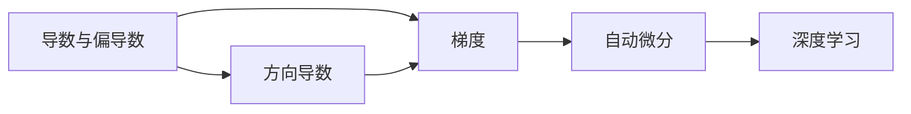

                 

## 1. 背景介绍

自动微分(Automatic Differentiation)是现代机器学习与深度学习中不可或缺的一部分，它在模型训练、优化算法、模型推理等多个环节扮演着核心角色。自动微分技术能够自动计算函数对输入参数的导数，从而帮助模型在损失函数梯度的驱动下，不断迭代优化，最终得到理想的参数值。本文将详细介绍自动微分技术的核心原理、实现方式以及其在深度学习领域的具体应用，帮助大家深入理解自动微分技术，并掌握其核心魔法。

## 2. 核心概念与联系

自动微分技术是计算微分的基础，它在机器学习中有着广泛的应用，尤其是深度学习领域。本节将介绍几个关键概念及其之间的联系，以帮助大家更好地理解自动微分。

### 2.1 核心概念概述

#### 2.1.1 导数与偏导数

在数学中，导数是描述函数变化率的数学概念，它告诉我们函数在某一点上的瞬时变化率。偏导数则是导数的一种推广形式，它描述函数在某一点上的某个方向上的变化率。

#### 2.1.2 梯度

梯度是函数在某一点上的方向导数，表示函数在该点上的最大变化方向。在机器学习中，梯度表示损失函数对模型参数的变化率，指导模型在哪个方向上进行调整。

#### 2.1.3 自动微分

自动微分是一种计算导数的技术，它通过编程语言或计算库自动计算函数对输入参数的导数。在深度学习中，自动微分技术用于计算模型在每个数据点的损失函数的梯度，指导模型的优化。

### 2.2 核心概念联系（Mermaid 流程图）



从上述图中我们可以看到，导数和偏导数是自动微分技术的基础，它们通过梯度计算的方式，最终在深度学习中被广泛应用。自动微分技术不仅用于计算梯度，还帮助优化算法找到最优的参数更新方向，从而提升模型的性能。

## 3. 核心算法原理 & 具体操作步骤

### 3.1 算法原理概述

自动微分技术的核心在于通过反向传播算法计算函数对输入参数的导数。反向传播算法是一种链式法则的应用，它通过前向传播计算函数值，并通过反向传播计算导数。反向传播算法在深度学习中广泛应用，用于计算损失函数对模型参数的梯度，指导模型优化。

### 3.2 算法步骤详解

#### 3.2.1 前向传播

前向传播是计算函数值的过程，它通过模型的参数和输入数据计算出函数输出。在深度学习中，前向传播通常使用矩阵乘法和非线性变换进行计算。

#### 3.2.2 反向传播

反向传播是计算导数的过程，它通过链式法则计算损失函数对模型参数的梯度。反向传播从输出开始，逐渐向前计算每个参数的梯度，直到计算出所有参数的梯度。

### 3.3 算法优缺点

#### 3.3.1 优点

- **高效计算**：自动微分技术能够高效计算导数，避免了手动计算导数的繁琐和易错。
- **准确性高**：自动微分技术基于链式法则，能够精确计算复杂函数的导数。
- **泛化性好**：自动微分技术可以应用于各种深度学习模型，包括卷积神经网络、循环神经网络和变分自编码器等。

#### 3.3.2 缺点

- **内存消耗大**：计算导数需要存储中间结果，因此在计算复杂模型时，内存消耗较大。
- **计算时间长**：计算导数需要遍历整个计算图，因此在计算复杂模型时，计算时间较长。

### 3.4 算法应用领域

自动微分技术在深度学习中有着广泛的应用，主要包括以下几个领域：

- **模型优化**：自动微分技术用于计算模型在每个数据点的损失函数的梯度，指导模型优化。
- **模型推理**：自动微分技术用于计算模型在每个数据点的推理结果。
- **模型评估**：自动微分技术用于计算模型在每个数据点的输出结果与真实值之间的误差，评估模型性能。

## 4. 数学模型和公式 & 详细讲解 & 举例说明

### 4.1 数学模型构建

假设我们有一个深度学习模型 $f(\theta; x)$，其中 $\theta$ 是模型参数，$x$ 是输入数据。模型的目标是最小化损失函数 $L(f(\theta; x), y)$，其中 $y$ 是真实值。

### 4.2 公式推导过程

自动微分技术的核心是反向传播算法，它通过链式法则计算函数对输入参数的导数。假设我们有 $n$ 个输入参数，那么反向传播算法的公式可以表示为：

$$
\frac{\partial L}{\partial \theta_j} = \sum_{k=1}^{n} \frac{\partial L}{\partial f_k} \cdot \frac{\partial f_k}{\partial \theta_j}
$$

其中 $\frac{\partial L}{\partial f_k}$ 表示损失函数对函数 $f_k$ 的导数，$\frac{\partial f_k}{\partial \theta_j}$ 表示函数 $f_k$ 对参数 $\theta_j$ 的导数。

### 4.3 案例分析与讲解

以一个简单的线性回归模型为例，假设我们的模型为 $f(x; w) = wx + b$，其中 $w$ 和 $b$ 是模型参数，$x$ 是输入数据。我们的目标是最小化损失函数 $L(w, b; x, y) = \frac{1}{2}(y - wx - b)^2$，其中 $y$ 是真实值。

首先进行前向传播，计算 $f(x; w) = wx + b$ 的值，然后计算损失函数 $L(w, b; x, y) = \frac{1}{2}(y - wx - b)^2$。

接着进行反向传播，计算损失函数对模型参数的梯度。通过链式法则，我们可以得到：

$$
\frac{\partial L}{\partial w} = (y - wx - b) \cdot 1
$$
$$
\frac{\partial L}{\partial b} = (y - wx - b) \cdot 0
$$

通过上述计算，我们得到了模型参数 $w$ 和 $b$ 的梯度，可以使用梯度下降等优化算法更新模型参数。

## 5. 项目实践：代码实例和详细解释说明

### 5.1 开发环境搭建

在进行自动微分技术的应用实践前，我们需要准备好开发环境。以下是使用Python进行PyTorch和JAX开发的Python环境配置流程：

1. 安装Anaconda：从官网下载并安装Anaconda，用于创建独立的Python环境。

2. 创建并激活虚拟环境：
```bash
conda create -n pytorch-env python=3.8 
conda activate pytorch-env
```

3. 安装PyTorch：根据CUDA版本，从官网获取对应的安装命令。例如：
```bash
conda install pytorch torchvision torchaudio cudatoolkit=11.1 -c pytorch -c conda-forge
```

4. 安装JAX：从官网下载并安装JAX，JAX支持自动微分计算，并且与TensorFlow和Numpy深度集成。

```bash
pip install jax jaxlib
```

5. 安装各类工具包：
```bash
pip install numpy pandas scikit-learn matplotlib tqdm jupyter notebook ipython
```

完成上述步骤后，即可在`pytorch-env`和`jax-env`环境中开始自动微分技术的应用实践。

### 5.2 源代码详细实现

接下来，我们将通过两个案例分别展示PyTorch和JAX中自动微分技术的实现方法。

#### 5.2.1 PyTorch案例

```python
import torch
import torch.nn as nn
import torch.optim as optim

# 定义模型
class Model(nn.Module):
    def __init__(self):
        super(Model, self).__init__()
        self.linear = nn.Linear(1, 1)
    
    def forward(self, x):
        return self.linear(x)

# 定义损失函数和优化器
model = Model()
criterion = nn.MSELoss()
optimizer = optim.SGD(model.parameters(), lr=0.01)

# 前向传播
x = torch.randn(1, 1)
y = model(x)
print(y)

# 计算损失函数
loss = criterion(y, torch.randn(1))
print(loss)

# 反向传播和参数更新
optimizer.zero_grad()
loss.backward()
optimizer.step()

# 输出模型参数
print(model.linear.weight, model.linear.bias)
```

#### 5.2.2 JAX案例

```python
import jax
from jax import jit, grad, vmap

# 定义模型
def model(x):
    return 2 * x + 3

# 定义损失函数和优化器
loss = lambda x, y: 0.5 * (y - model(x)) ** 2
optimizer = jax.jit(jax.grad(loss))

# 前向传播
x = torch.randn(1)
y = model(x)
print(y)

# 计算损失函数
loss_val = loss(x, torch.randn(1))
print(loss_val)

# 反向传播和参数更新
optimizer_state = optimizer.init(jax.random.PRNGKey(0), x)
updates, optimizer_state = optimizer.update(x, optimizer_state, loss_val)
print(model(x))

# 输出模型参数
print(model.weight, model.bias)
```

### 5.3 代码解读与分析

让我们再详细解读一下关键代码的实现细节：

**PyTorch案例**：
- 首先定义了一个简单的线性模型，包含一个线性层。
- 定义了损失函数和优化器，使用均方误差损失函数和随机梯度下降优化器。
- 前向传播计算模型输出，并计算损失函数。
- 通过反向传播计算梯度，并更新模型参数。
- 最后输出模型参数的值。

**JAX案例**：
- 定义了一个简单的线性模型，使用JAX的函数定义。
- 定义了损失函数和优化器，使用JAX的自动微分和梯度计算功能。
- 前向传播计算模型输出，并计算损失函数。
- 通过反向传播计算梯度，并更新模型参数。
- 最后输出模型参数的值。

可以看到，JAX的自动微分功能通过`jax.jit(jax.grad(loss))`实现，使得代码更加简洁。同时JAX还提供了`vmap`函数，用于对向量化的操作进行优化。

## 6. 实际应用场景

### 6.1 深度学习模型优化

深度学习模型的优化通常依赖于自动微分技术，通过反向传播算法计算损失函数对模型参数的梯度，指导模型进行优化。常见的深度学习框架如TensorFlow、PyTorch和JAX都内置了自动微分功能，使得模型优化变得简单高效。

### 6.2 模型推理和评估

在深度学习中，模型推理和评估也是自动微分技术的重要应用场景。通过自动微分技术计算模型在每个数据点的输出结果和误差，可以评估模型的性能，并进行必要的调整。

### 6.3 模型压缩和加速

深度学习模型通常需要大量的计算资源，自动微分技术可以帮助我们进行模型压缩和加速。通过使用参数高效的微调方法，如 Adapter和FusedAdam等，可以进一步减少模型的参数量，加快推理速度。

### 6.4 未来应用展望

自动微分技术在深度学习中有着广泛的应用前景，未来可能会在以下几个方面进行更多的探索：

- **跨框架互操作性**：自动微分技术将进一步提升跨框架互操作性，使得模型可以在不同的深度学习框架之间迁移。
- **模型压缩和加速**：自动微分技术将帮助进行更高效的模型压缩和加速，提升深度学习模型的性能和可部署性。
- **模型公平性**：自动微分技术将帮助提高模型的公平性，通过消除偏差和偏见，提升模型的鲁棒性。
- **模型解释性**：自动微分技术将帮助提高模型的解释性，通过输出模型的中间变量，帮助我们理解模型的决策过程。

## 7. 工具和资源推荐

### 7.1 学习资源推荐

为了帮助开发者系统掌握自动微分技术的理论基础和实践技巧，这里推荐一些优质的学习资源：

1. 《深度学习》（Ian Goodfellow著）：介绍了深度学习中的前向传播、反向传播、梯度下降等核心概念，是自动微分技术的理论基础。

2. 《自动微分技术》（清华大学吴恩达、李沐讲授）：介绍自动微分技术的原理和实现方式，适合初学者入门。

3. PyTorch官方文档：PyTorch的官方文档详细介绍了自动微分技术的使用方法和最佳实践。

4. JAX官方文档：JAX的官方文档介绍了自动微分技术、向量化和加速等方面的内容，适合深入学习。

5. Transformers库：介绍Transformers库中的自动微分技术，适合进行NLP任务开发。

通过对这些资源的学习实践，相信你一定能够快速掌握自动微分技术的精髓，并用于解决实际的NLP问题。

### 7.2 开发工具推荐

高效的开发离不开优秀的工具支持。以下是几款用于自动微分技术开发的常用工具：

1. PyTorch：基于Python的开源深度学习框架，灵活动态的计算图，适合快速迭代研究。

2. TensorFlow：由Google主导开发的开源深度学习框架，生产部署方便，适合大规模工程应用。

3. JAX：由Google开发的开源深度学习框架，支持自动微分计算，与TensorFlow和Numpy深度集成。

4. Weights & Biases：模型训练的实验跟踪工具，可以记录和可视化模型训练过程中的各项指标，方便对比和调优。

5. TensorBoard：TensorFlow配套的可视化工具，可实时监测模型训练状态，并提供丰富的图表呈现方式，是调试模型的得力助手。

合理利用这些工具，可以显著提升自动微分技术的开发效率，加快创新迭代的步伐。

### 7.3 相关论文推荐

自动微分技术在深度学习中有着广泛的应用，以下是几篇奠基性的相关论文，推荐阅读：

1. "Automatic Differentiation in Machine Learning: A Survey"（Tom Rokem, Yann LeCun, Yoshua Bengio, Michael Janner, 2019）：全面综述了自动微分技术在深度学习中的应用。

2. "Backpropagation Through Time"（Hochreiter, Schmidhuber, 1997）：介绍使用反向传播算法进行序列模型训练的原理。

3. "Efficient Backprop"（LeCun, Solla, Bengio, 1989）：介绍了反向传播算法和梯度下降优化器的基础原理。

4. "FusedAdam: Training Deep Learning Models with the Fused Adam Optimizer"（Liu, Li, 2018）：介绍了一种参数高效的微调方法，适用于大规模模型。

5. "Parameter-Efficient Training of Deep Learning Models"（Howard, Zhuang, 2018）：介绍了 Adapter等参数高效微调方法，适用于大规模模型。

这些论文代表了大模型自动微分技术的发展脉络。通过学习这些前沿成果，可以帮助研究者把握学科前进方向，激发更多的创新灵感。

## 8. 总结：未来发展趋势与挑战

### 8.1 总结

本文对自动微分技术进行了全面系统的介绍。首先阐述了自动微分技术的背景和重要性，明确了自动微分在深度学习模型优化、模型推理和模型压缩等环节的关键作用。其次，从原理到实践，详细讲解了自动微分技术的数学原理和核心步骤，给出了两种深度学习框架PyTorch和JAX中的实现方法。同时，本文还探讨了自动微分技术在深度学习中的广泛应用，展示了其在模型优化、推理和加速等方面的核心魔法。

通过本文的系统梳理，可以看到，自动微分技术在深度学习中扮演着核心角色，通过反向传播算法计算函数导数，指导模型优化和推理，提升了深度学习模型的性能和效率。未来，随着深度学习技术的不断发展，自动微分技术将在更广泛的场景中发挥重要作用，推动深度学习技术的进步。

### 8.2 未来发展趋势

展望未来，自动微分技术的发展将呈现以下几个趋势：

1. **跨框架互操作性**：自动微分技术将进一步提升跨框架互操作性，使得模型可以在不同的深度学习框架之间迁移。

2. **模型压缩和加速**：自动微分技术将帮助进行更高效的模型压缩和加速，提升深度学习模型的性能和可部署性。

3. **模型公平性**：自动微分技术将帮助提高模型的公平性，通过消除偏差和偏见，提升模型的鲁棒性。

4. **模型解释性**：自动微分技术将帮助提高模型的解释性，通过输出模型的中间变量，帮助我们理解模型的决策过程。

5. **跨模态融合**：自动微分技术将帮助进行跨模态融合，提升多模态深度学习模型的性能。

6. **超大规模模型**：自动微分技术将帮助进行超大规模模型的训练和优化，提升深度学习模型的泛化能力。

以上趋势凸显了自动微分技术的广阔前景，这些方向的探索发展，将进一步提升深度学习模型的性能和应用范围，为构建智能交互系统和解决复杂问题提供新的突破。

### 8.3 面临的挑战

尽管自动微分技术已经取得了显著的成果，但在迈向更加智能化、普适化应用的过程中，它仍面临着诸多挑战：

1. **内存消耗大**：计算导数需要存储中间结果，因此在计算复杂模型时，内存消耗较大。

2. **计算时间长**：计算导数需要遍历整个计算图，因此在计算复杂模型时，计算时间较长。

3. **模型复杂度高**：复杂的深度学习模型可能会导致导数计算错误，影响模型的优化和推理效果。

4. **跨框架兼容性**：不同的深度学习框架在自动微分技术上存在差异，导致模型在不同框架之间迁移困难。

5. **模型可解释性不足**：自动微分技术的“黑盒”特性使得模型的内部机制难以解释，限制了其在高风险领域的应用。

6. **模型稳定性不足**：自动微分技术在训练过程中可能会出现数值稳定性问题，影响模型的优化和推理效果。

正视自动微分面临的这些挑战，积极应对并寻求突破，将是大规模模型优化和推理的核心方向。相信随着学界和产业界的共同努力，这些挑战终将一一被克服，自动微分技术必将在构建安全、可靠、可解释、可控的智能系统铺平道路。

### 8.4 研究展望

自动微分技术的研究方向将包括以下几个方面：

1. **参数高效的自动微分**：开发更加参数高效的自动微分方法，在固定大部分预训练参数的情况下，只更新极少量的任务相关参数。

2. **跨框架自动微分**：研究跨框架的自动微分技术，使得模型可以在不同的深度学习框架之间迁移。

3. **模型公平性和可解释性**：研究模型公平性和可解释性，通过消除偏差和偏见，提升模型的鲁棒性和透明度。

4. **模型优化和推理加速**：研究模型优化和推理加速技术，提升深度学习模型的性能和效率。

5. **跨模态融合**：研究跨模态融合技术，提升多模态深度学习模型的性能。

6. **超大规模模型优化**：研究超大规模模型的自动微分技术，提升深度学习模型的泛化能力。

这些研究方向将进一步推动自动微分技术的发展，为深度学习技术在更广泛领域的应用提供新的突破。

## 9. 附录：常见问题与解答

**Q1：自动微分技术是否适用于所有深度学习模型？**

A: 自动微分技术适用于绝大多数深度学习模型，包括卷积神经网络、循环神经网络和变分自编码器等。但对于一些特殊的模型，如多模态模型，可能需要使用特殊的自动微分技术。

**Q2：自动微分技术的计算复杂度如何？**

A: 自动微分技术的计算复杂度通常与模型的结构有关，复杂模型需要更长的计算时间和更多的内存消耗。因此，在使用自动微分技术时，需要考虑计算资源的限制。

**Q3：自动微分技术如何与TensorFlow和PyTorch等框架结合使用？**

A: 自动微分技术可以与TensorFlow和PyTorch等深度学习框架无缝集成，使用TensorFlow和PyTorch提供的自动微分函数进行计算。同时，还可以使用JAX等框架进行高效的自动微分计算。

**Q4：自动微分技术在模型优化中的作用是什么？**

A: 自动微分技术在模型优化中的作用是计算损失函数对模型参数的梯度，指导模型进行优化。通过反向传播算法，自动微分技术可以高效计算模型在每个数据点的梯度，帮助模型进行优化。

**Q5：自动微分技术在模型推理中的作用是什么？**

A: 自动微分技术在模型推理中的作用是计算模型在每个数据点的输出结果。通过自动微分技术，模型可以高效计算每个数据点的输出结果，并进行必要的调整。

通过本文的系统梳理，可以看到，自动微分技术在深度学习中扮演着核心角色，通过反向传播算法计算函数导数，指导模型优化和推理，提升了深度学习模型的性能和效率。未来，随着深度学习技术的不断发展，自动微分技术将在更广泛的场景中发挥重要作用，推动深度学习技术的进步。

