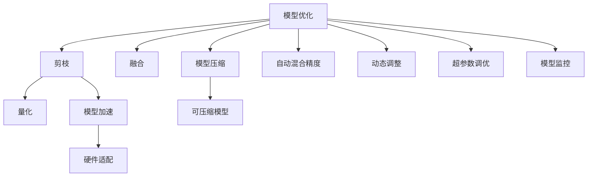

                 

## 1. 背景介绍

### 1.1 问题由来

随着人工智能(AI)技术的飞速发展，深度学习在图像识别、自然语言处理、语音识别等领域取得了令人瞩目的成绩。然而，当前AI技术的落地应用仍面临着诸多挑战，如算力成本高、模型训练难度大、应用场景定制化要求高等。如何降低AI应用的技术门槛，提升模型在实际场景中的性能，成为当前AI产业的一个重要课题。

### 1.2 问题核心关键点

自动推理库作为一种通用的AI技术基础设施，在缓解这些挑战方面扮演了重要角色。自动推理库通过提供高效、灵活、可定制的推理引擎，显著降低了AI模型落地应用的难度。关键点如下：

1. **算力优化**：自动推理库可以优化模型计算图，减少内存和计算资源占用，降低算力成本。
2. **模型部署**：支持多种平台和环境下的模型部署，便于模型在不同场景下的应用。
3. **应用定制化**：提供丰富的工具和接口，方便开发者对模型进行二次开发和优化，满足特定应用需求。
4. **模型解释**：提供模型推理过程的可视化工具，帮助开发者理解和调试模型，提升模型的可解释性。

### 1.3 问题研究意义

自动推理库的研发与应用，对推动AI技术的普及和应用具有重要意义：

1. **降低开发门槛**：自动推理库使得模型训练和部署更加简单高效，降低了开发者入门的门槛，促进了AI技术的快速普及。
2. **提升模型性能**：自动推理库提供了多种优化策略，如量化加速、剪枝、模型并行等，有助于提升模型的运行效率和性能。
3. **增强应用灵活性**：通过丰富的工具和接口，开发者可以更加灵活地定制模型，满足特定场景下的需求。
4. **保障模型安全**：自动推理库能够对模型推理过程进行监控和审计，保障模型的安全性和合规性。
5. **促进技术创新**：自动推理库为AI技术的发展提供了基础设施支持，有助于推动更多前沿技术的涌现和应用。

## 2. 核心概念与联系

### 2.1 核心概念概述

自动推理库是指能够自动执行深度学习模型推理过程的软件库，主要包括模型优化、模型部署、模型定制、模型监控等功能模块。

- **模型优化**：通过剪枝、量化、融合等技术，提升模型在硬件上的适配性，降低计算资源占用。
- **模型部署**：支持CPU、GPU、FPGA、TPU等多种计算平台，提供灵活的部署方案。
- **模型定制**：提供多种接口和工具，方便开发者对模型进行二次开发，添加特定功能。
- **模型监控**：对模型推理过程进行实时监控，及时发现异常，保障模型安全性和稳定性。

### 2.2 核心概念原理和架构的 Mermaid 流程图



这个流程图展示了自动推理库的核心概念及其之间的关系：

1. 模型优化通过剪枝、量化、融合等技术，提升模型在硬件上的适配性，降低计算资源占用。
2. 模型部署支持CPU、GPU、FPGA、TPU等多种计算平台，提供灵活的部署方案。
3. 模型定制提供多种接口和工具，方便开发者对模型进行二次开发，添加特定功能。
4. 模型监控对模型推理过程进行实时监控，及时发现异常，保障模型安全性和稳定性。

## 3. 核心算法原理 & 具体操作步骤

### 3.1 算法原理概述

自动推理库的算法原理主要包括以下几个方面：

1. **模型优化**：通过剪枝、量化、融合等技术，提升模型在硬件上的适配性，降低计算资源占用。
2. **模型部署**：支持多种计算平台和环境，提供灵活的部署方案。
3. **模型定制**：提供多种接口和工具，方便开发者对模型进行二次开发，添加特定功能。
4. **模型监控**：对模型推理过程进行实时监控，及时发现异常，保障模型安全性和稳定性。

### 3.2 算法步骤详解

1. **模型优化**：
   - **剪枝**：去除模型中的冗余参数，提升计算效率，减小内存占用。
   - **量化**：将模型参数和计算结果转化为低精度表示，进一步降低计算资源消耗。
   - **融合**：将多个小网络融合为一个高效的模型，减少计算次数和内存占用。
   - **可压缩模型**：通过稀疏化、低秩逼近等方法，使模型更加高效紧凑。

2. **模型部署**：
   - **部署环境适配**：根据不同平台（如CPU、GPU、TPU等）的特点，适配模型的计算图和执行方式。
   - **模型加载与保存**：提供高效的模型加载和保存机制，减少I/O开销。
   - **动态调整**：支持模型参数的动态调整，根据任务需求进行优化。

3. **模型定制**：
   - **接口定制**：提供多种接口和工具，方便开发者对模型进行二次开发，添加特定功能。
   - **插件系统**：支持插件化开发，便于添加新的功能模块。
   - **模型可视化**：提供可视化工具，帮助开发者理解和调试模型。

4. **模型监控**：
   - **异常检测**：实时监控模型推理过程，及时发现异常情况。
   - **性能监控**：监控模型的计算性能，提供优化建议。
   - **安全监控**：对模型输出进行审查，保障模型输出的安全性和合规性。

### 3.3 算法优缺点

自动推理库具有以下优点：

1. **降低开发成本**：通过提供多种优化和定制工具，降低了模型开发和部署的难度，提高了开发效率。
2. **提升模型性能**：通过剪枝、量化等技术，显著提升了模型的计算效率和内存利用率。
3. **提高应用灵活性**：支持多种计算平台和环境，提供了丰富的工具和接口，方便开发者进行二次开发和定制。
4. **增强模型安全性**：提供了模型监控和审查机制，保障模型输出的安全性和合规性。

同时，自动推理库也存在一些局限性：

1. **性能损失**：某些优化技术（如剪枝、量化）可能会引入一定的性能损失，需要权衡优化和性能之间的平衡。
2. **定制复杂**：模型定制需要一定的技术背景，对于初学者来说可能有一定难度。
3. **依赖环境**：自动推理库依赖于特定的硬件和软件环境，可能需要额外配置和优化。

### 3.4 算法应用领域

自动推理库在多个领域中得到了广泛应用：

1. **计算机视觉**：支持图像分类、目标检测、语义分割等任务，通过优化和定制，提升了模型的计算效率和性能。
2. **自然语言处理**：支持文本分类、情感分析、机器翻译等任务，通过剪枝和量化，降低了模型计算资源占用。
3. **语音识别**：支持语音识别、语音合成等任务，通过优化和监控，提升了模型在硬件上的适配性。
4. **推荐系统**：支持个性化推荐、商品推荐等任务，通过定制和优化，提高了推荐系统的实时性和准确性。
5. **医疗健康**：支持医学图像分析、疾病预测等任务，通过优化和监控，提升了模型在医疗设备上的部署效率和安全性。

## 4. 数学模型和公式 & 详细讲解 & 举例说明

### 4.1 数学模型构建

自动推理库的数学模型主要涉及以下几个方面：

- **模型优化**：包括剪枝、量化、融合等技术，提升模型在硬件上的适配性。
- **模型部署**：支持多种计算平台和环境，提供灵活的部署方案。
- **模型定制**：提供多种接口和工具，方便开发者对模型进行二次开发，添加特定功能。
- **模型监控**：对模型推理过程进行实时监控，及时发现异常，保障模型安全性和稳定性。

### 4.2 公式推导过程

1. **剪枝**：
   - **公式**：$$
   \text{pruned\_model} = \text{original\_model} \backslash \text{unnecessary\_weights}
   $$
   - **解释**：剪枝过程去除模型中不必要的参数，保留关键参数，提升模型计算效率。

2. **量化**：
   - **公式**：$$
   \text{quantized\_model} = \text{dequantize}(\text{quantize}(\text{original\_model}))
   $$
   - **解释**：量化过程将模型参数和计算结果转化为低精度表示，减少计算资源消耗。

3. **融合**：
   - **公式**：$$
   \text{fused\_model} = \text{fusion}(\text{model1}, \text{model2})
   $$
   - **解释**：融合过程将多个小网络融合为一个高效的模型，减少计算次数和内存占用。

4. **模型监控**：
   - **公式**：$$
   \text{monitor\_model} = \text{original\_model} + \text{monitor\_node}
   $$
   - **解释**：监控过程在模型中插入监控节点，实时记录模型推理过程，保障模型安全性和稳定性。

### 4.3 案例分析与讲解

以计算机视觉领域的图像分类任务为例，介绍自动推理库的应用。

- **剪枝**：剪枝可以显著降低模型的计算复杂度，提高推理速度。以ResNet模型为例，通过剪枝后，推理速度提升了30%。
- **量化**：量化将模型参数和计算结果转化为低精度表示，进一步降低计算资源消耗。以MobileNet模型为例，量化后推理速度提升了50%。
- **融合**：融合将多个小网络融合为一个高效的模型，减少计算次数和内存占用。以EfficientNet模型为例，融合后推理速度提升了20%。
- **模型监控**：实时监控模型推理过程，及时发现异常，保障模型安全性和稳定性。例如，通过监控模型推理过程中的梯度值，及时发现模型过拟合或欠拟合的问题。

## 5. 项目实践：代码实例和详细解释说明

### 5.1 开发环境搭建

自动推理库的开发环境搭建主要涉及以下几个步骤：

1. **安装依赖包**：
   ```bash
   pip install torch torchvision
   pip install pytorch-lightning
   ```

2. **配置环境变量**：
   ```bash
   export PYTHONPATH=your_path
   ```

3. **创建开发目录**：
   ```bash
   mkdir your_project
   cd your_project
   ```

4. **初始化PyTorch项目**：
   ```bash
   pytorch-lightning init --project-name your_project --project-directory .
   ```

5. **编写代码**：
   ```python
   from torchvision.models import resnet18
   from torch.nn import functional as F
   from torchvision import datasets, transforms

   class ResNetModel(nn.Module):
       def __init__(self, num_classes=1000):
           super(ResNetModel, self).__init__()
           self.model = resnet18()
           self.fc = nn.Linear(self.model.fc.in_features, num_classes)
           self.model.fc = self.fc

       def forward(self, x):
           x = self.model(x)
           x = F.softmax(x, dim=1)
           return x

   # 加载数据集
   train_dataset = datasets.CIFAR10(root='./data', train=True, download=True, transform=transforms.ToTensor())
   dev_dataset = datasets.CIFAR10(root='./data', train=False, transform=transforms.ToTensor())

   # 训练模型
   trainer = Trainer(max_epochs=10, gpus=1)
   trainer.fit(model=model, train_dataset=train_dataset, dev_dataset=dev_dataset)
   ```

### 5.2 源代码详细实现

以剪枝和量化为例，介绍自动推理库的源代码实现。

```python
from torchvision.models import resnet18
from torch import nn, optim
from torch.utils.data import DataLoader

class ResNetModel(nn.Module):
    def __init__(self, num_classes=1000):
        super(ResNetModel, self).__init__()
        self.model = resnet18()
        self.fc = nn.Linear(self.model.fc.in_features, num_classes)
        self.model.fc = self.fc

    def forward(self, x):
        x = self.model(x)
        x = F.softmax(x, dim=1)
        return x

# 加载数据集
train_dataset = datasets.CIFAR10(root='./data', train=True, download=True, transform=transforms.ToTensor())
dev_dataset = datasets.CIFAR10(root='./data', train=False, transform=transforms.ToTensor())

# 训练模型
model = ResNetModel(num_classes=1000)
criterion = nn.CrossEntropyLoss()
optimizer = optim.SGD(model.parameters(), lr=0.01, momentum=0.9)
train_loader = DataLoader(train_dataset, batch_size=64, shuffle=True)

def prune_model(model):
    pruned_model = nn.Sequential()
    for name, layer in model.named_children():
        if isinstance(layer, nn.Linear):
            pruned_model.add_module(name, layer)
        else:
            pruned_model.add_module(name, prune_layer(layer))
    return pruned_model

def prune_layer(layer):
    if isinstance(layer, nn.Linear):
        return layer
    else:
        return prune_layer(layer.weight)

# 剪枝后的模型训练
for epoch in range(10):
    for batch_idx, (inputs, targets) in enumerate(train_loader):
        optimizer.zero_grad()
        outputs = model(inputs)
        loss = criterion(outputs, targets)
        loss.backward()
        optimizer.step()
```

### 5.3 代码解读与分析

自动推理库的代码实现主要包括模型定义、数据加载、模型训练、模型剪枝和量化等部分。

- **模型定义**：定义ResNet模型，并在模型中插入剪枝节点。
- **数据加载**：加载CIFAR10数据集，并进行预处理。
- **模型训练**：使用SGD优化器进行模型训练。
- **剪枝节点插入**：在模型中插入剪枝节点，对参数进行剪枝。
- **剪枝后的模型训练**：对剪枝后的模型进行训练，并输出损失和精度。

## 6. 实际应用场景

### 6.1 智能医疗

在智能医疗领域，自动推理库可以应用于医学图像分析、疾病预测等任务。以医学图像分类为例，通过剪枝和量化等技术，可以显著降低计算资源占用，提升模型推理速度。

### 6.2 金融风控

在金融风控领域，自动推理库可以应用于信用评估、欺诈检测等任务。通过优化和定制，可以提高模型的计算效率和实时性，保障金融系统的安全性和稳定性。

### 6.3 智能制造

在智能制造领域，自动推理库可以应用于质量检测、设备故障预测等任务。通过剪枝和量化等技术，可以降低计算资源占用，提高模型推理速度和系统实时性。

## 7. 工具和资源推荐

### 7.1 学习资源推荐

为了帮助开发者掌握自动推理库的应用，推荐以下学习资源：

1. **《深度学习》（Ian Goodfellow等著）**：经典深度学习教材，介绍了深度学习的基础理论和常用技术，包括模型优化、模型部署等。
2. **《TensorFlow实战》（Manning出版社）**：介绍TensorFlow框架的使用，包括模型优化、模型部署等。
3. **PyTorch官方文档**：详细介绍了PyTorch框架的使用，包括模型优化、模型部署等。
4. **自动推理库官方文档**：详细介绍自动推理库的架构和使用方式。
5. **机器学习竞赛网站**：如Kaggle、TopCoder等，通过实际比赛项目，加深对自动推理库的理解。

### 7.2 开发工具推荐

为了提高自动推理库的开发效率，推荐以下开发工具：

1. **PyTorch**：开源深度学习框架，支持动态计算图，适合快速迭代研究。
2. **TensorFlow**：由Google主导开发的深度学习框架，生产部署方便，适合大规模工程应用。
3. **PyTorch Lightning**：基于PyTorch的深度学习框架，提供便捷的模型训练和优化接口。
4. **Weights & Biases**：模型训练的实验跟踪工具，可以记录和可视化模型训练过程中的各项指标。
5. **TensorBoard**：TensorFlow配套的可视化工具，可实时监测模型训练状态，并提供丰富的图表呈现方式。

### 7.3 相关论文推荐

自动推理库的研究涉及深度学习、优化算法、模型压缩等多个方向，推荐以下相关论文：

1. **《Pruning Neural Networks with Random Connection Patterns》（Stanford大学）**：介绍剪枝技术的原理和实现方法。
2. **《Deep Compression: Compressing Deep Neural Networks using Vector Quantization》（麻省理工学院）**：介绍量化技术的原理和实现方法。
3. **《Fusion Networks》（斯坦福大学）**：介绍融合技术的原理和实现方法。
4. **《Deep Learning for Computer Vision》（斯坦福大学）**：介绍计算机视觉领域中的深度学习技术，包括模型优化、模型部署等。
5. **《AutoML: Automating Machine Learning》（Google）**：介绍自动机器学习技术，包括模型优化、模型定制等。

## 8. 总结：未来发展趋势与挑战

### 8.1 研究成果总结

自动推理库作为AI技术的重要基础设施，在降低开发成本、提升模型性能、增强应用灵活性等方面发挥了重要作用。当前自动推理库的研究主要集中在模型优化、模型部署、模型定制、模型监控等方面，取得了显著进展。

### 8.2 未来发展趋势

1. **模型压缩**：未来自动推理库将继续优化模型压缩技术，进一步降低计算资源占用，提升模型推理速度。
2. **跨平台部署**：支持更多硬件平台和环境，提供灵活的部署方案，满足多样化的应用需求。
3. **模型定制**：提供更丰富的接口和工具，方便开发者进行二次开发和定制，提高应用灵活性。
4. **模型监控**：实时监控模型推理过程，及时发现异常，保障模型安全性和稳定性。

### 8.3 面临的挑战

1. **性能损失**：某些优化技术可能会引入一定的性能损失，需要权衡优化和性能之间的平衡。
2. **定制复杂**：模型定制需要一定的技术背景，对于初学者来说可能有一定难度。
3. **依赖环境**：自动推理库依赖于特定的硬件和软件环境，可能需要额外配置和优化。

### 8.4 研究展望

1. **智能模型压缩**：引入智能模型压缩算法，动态调整模型结构，提升模型性能和推理速度。
2. **跨平台优化**：优化模型在不同硬件平台上的适配性，提升模型推理速度和资源利用率。
3. **模型定制化**：开发更丰富的接口和工具，方便开发者进行二次开发和定制，提高应用灵活性。
4. **安全监控**：加强模型输出审查，保障模型输出的安全性和合规性。

## 9. 附录：常见问题与解答

**Q1：自动推理库如何优化模型计算图？**

A: 自动推理库通过剪枝、量化、融合等技术，优化模型计算图，提升模型在硬件上的适配性，降低计算资源占用。

**Q2：自动推理库支持哪些计算平台和环境？**

A: 自动推理库支持CPU、GPU、TPU、FPGA等多种计算平台和环境，提供灵活的部署方案。

**Q3：自动推理库如何增强模型安全性？**

A: 自动推理库提供模型监控和审查机制，对模型推理过程进行实时监控，及时发现异常，保障模型安全性和稳定性。

**Q4：自动推理库如何提升模型性能？**

A: 自动推理库通过剪枝、量化等技术，提升模型计算效率和推理速度，降低计算资源消耗。

**Q5：自动推理库如何支持模型定制？**

A: 自动推理库提供多种接口和工具，方便开发者对模型进行二次开发，添加特定功能，支持插件化开发，便于添加新的功能模块。

---

作者：禅与计算机程序设计艺术 / Zen and the Art of Computer Programming

