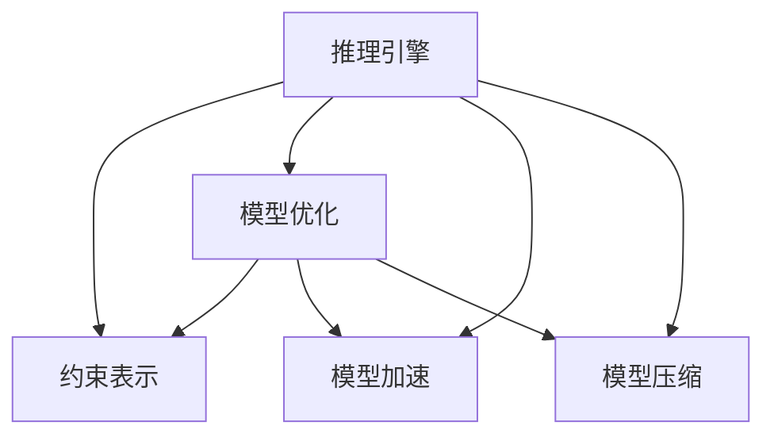

                 

# 自动推理库：让AI落地更简单

> 关键词：自动推理库, 推理引擎, 人工智能(AI), 深度学习, 机器学习(ML), 模型优化, 模型加速, 模型压缩

## 1. 背景介绍

### 1.1 问题由来
近年来，随着人工智能(AI)技术的迅速发展，深度学习和机器学习模型在各类应用中得到了广泛应用。从计算机视觉、自然语言处理到语音识别、推荐系统，AI模型在各个领域展现出了强大的预测和推理能力。然而，面对复杂多变的实际场景，单一模型的预测往往不够准确，甚至可能产生错误的决策。为了提高AI系统的鲁棒性和可靠性，引入了自动推理库，以对模型进行后处理和验证，确保模型在实际应用中的表现符合预期。

### 1.2 问题核心关键点
自动推理库的核心在于利用数学和逻辑方法，对AI模型进行推理验证，确保模型在特定约束条件下的正确性和鲁棒性。其关键点包括：

1. **模型约束表示**：将现实世界的约束条件映射到数学或逻辑表达式，作为推理库的输入。
2. **推理验证算法**：基于约束表示，设计高效的推理验证算法，确保模型输出在特定条件下的正确性。
3. **模型优化策略**：通过优化算法，改进模型结构和参数，提升模型性能和准确性。
4. **模型加速与压缩**：针对大规模模型，设计高效的推理引擎，实现模型加速与压缩，提升计算效率。
5. **鲁棒性提升**：通过推理库对模型进行后处理，提升模型的鲁棒性和泛化能力。

这些核心点共同构成了自动推理库的逻辑框架，为AI模型的落地应用提供了坚实的基础。

### 1.3 问题研究意义
自动推理库对于提升AI系统的可靠性和泛化能力，具有重要的研究意义：

1. **提高模型鲁棒性**：通过约束验证和模型优化，确保AI模型在面对复杂多变的数据时，依然能够产生高质量的输出。
2. **促进模型优化**：自动推理库能够对模型的结构和参数进行精确分析和优化，提升模型的性能和泛化能力。
3. **加速模型部署**：推理库设计的推理引擎能够显著提高模型推理速度，优化计算资源的使用，加快模型部署速度。
4. **增强模型可解释性**：通过推理验证，自动推理库能够解释模型的决策过程，提升模型的透明性和可解释性。
5. **降低开发成本**：自动推理库简化了模型验证和优化流程，降低了AI模型的开发和部署成本。

## 2. 核心概念与联系

### 2.1 核心概念概述

自动推理库是一个集成的软件组件，通过数学和逻辑方法，对AI模型进行后处理和验证，确保模型在特定约束条件下的正确性和鲁棒性。其主要包含以下几个核心概念：

1. **推理引擎**：基于数学或逻辑方法，对AI模型进行推理验证，确保模型输出符合特定约束条件。
2. **约束表示**：将现实世界的约束条件映射到数学或逻辑表达式，作为推理引擎的输入。
3. **模型优化**：通过优化算法，改进模型结构和参数，提升模型性能和泛化能力。
4. **模型加速**：针对大规模模型，设计高效的推理引擎，实现模型加速与压缩，提升计算效率。
5. **模型压缩**：通过对模型结构和参数的压缩，降低模型大小，提高计算效率和存储性能。

这些核心概念之间的逻辑关系可以通过以下Mermaid流程图来展示：



这个流程图展示了自动推理库的核心概念及其之间的逻辑关系：

1. 推理引擎基于约束表示，对模型进行推理验证。
2. 模型优化对模型结构和参数进行改进，提升模型性能和泛化能力。
3. 模型加速和压缩通过高效推理引擎实现，提升计算效率。

这些概念共同构成了自动推理库的工作原理和优化方向，使其能够在各类AI应用中发挥重要作用。

## 3. 核心算法原理 & 具体操作步骤
### 3.1 算法原理概述

自动推理库的核心算法原理在于数学和逻辑方法的应用，对AI模型进行约束验证和优化。其核心算法包括以下几个步骤：

1. **约束表示**：将现实世界的约束条件映射到数学或逻辑表达式，作为推理引擎的输入。
2. **推理验证**：基于约束表示，设计高效的推理验证算法，确保模型输出符合特定约束条件。
3. **模型优化**：通过优化算法，改进模型结构和参数，提升模型性能和泛化能力。
4. **模型加速**：针对大规模模型，设计高效的推理引擎，实现模型加速与压缩，提升计算效率。
5. **模型压缩**：通过对模型结构和参数的压缩，降低模型大小，提高计算效率和存储性能。

### 3.2 算法步骤详解

**Step 1: 准备约束表示**
- 定义模型的输入、输出以及约束条件，通常通过数学或逻辑表达式表示。
- 将模型输出与约束条件映射，确保模型在特定条件下的正确性。

**Step 2: 设计推理引擎**
- 选择合适的推理算法，如逻辑推理、约束求解等，设计推理引擎对模型输出进行验证。
- 根据模型的特点和应用场景，选择合适的推理算法和优化策略。

**Step 3: 模型优化**
- 根据推理引擎的输出，通过优化算法改进模型结构和参数，提升模型性能。
- 使用梯度下降、遗传算法等优化算法，寻找最优模型参数。

**Step 4: 模型加速**
- 设计高效的推理引擎，通过优化计算图、利用硬件加速等方式实现模型加速。
- 针对不同场景，选择合适的推理引擎和优化策略，如TensorRT、ONNX Runtime等。

**Step 5: 模型压缩**
- 通过剪枝、量化、参数共享等方法，对模型进行压缩，降低模型大小。
- 优化模型的结构和参数，减少不必要的计算和存储资源占用。

### 3.3 算法优缺点

自动推理库的优势在于能够显著提升AI模型的鲁棒性和泛化能力，提高计算效率，降低开发成本。其缺点在于设计复杂，需要丰富的数学和逻辑知识，且对模型的改进和优化可能影响模型的原有性能。

### 3.4 算法应用领域

自动推理库在多个AI应用领域得到了广泛应用，包括但不限于：

1. **计算机视觉**：对图像分类、目标检测等任务进行约束验证和优化。
2. **自然语言处理**：对机器翻译、情感分析等任务进行约束验证和优化。
3. **推荐系统**：对推荐算法进行约束验证和优化，提升推荐效果和用户体验。
4. **语音识别**：对语音识别算法进行约束验证和优化，提高语音识别的准确性和鲁棒性。
5. **医疗诊断**：对医疗诊断算法进行约束验证和优化，确保诊断结果的准确性和可靠性。

这些应用场景展示了自动推理库的多样性和重要性，为AI技术的落地应用提供了坚实的基础。

## 4. 数学模型和公式 & 详细讲解 & 举例说明

### 4.1 数学模型构建

自动推理库的核心数学模型通常基于数学和逻辑方法，对AI模型进行约束验证和优化。以下以一个简单的线性回归模型为例，介绍自动推理库的数学模型构建过程。

假设线性回归模型为 $y = wx + b$，其中 $w$ 和 $b$ 为模型参数，$x$ 为输入特征，$y$ 为输出标签。我们希望在特定的约束条件下，模型输出满足 $y = wx + b$ 的要求。

### 4.2 公式推导过程

假设模型的约束条件为 $y = wx + b$，且 $w = (w_1, w_2, ..., w_n)$，$b = b_0$。则可以将约束条件表示为：

$$
y = \begin{cases}
wx + b & \text{if } y \in \{y_i | i \in [1, N]\} \\
\text{undefined} & \text{otherwise}
\end{cases}
$$

其中 $y_i$ 为模型在特定输入 $x_i$ 下的输出，$N$ 为样本数量。

将约束条件映射到逻辑表达式，可以得到：

$$
\forall x_i, y_i \in \{y_i | i \in [1, N]\}, y = wx + b
$$

利用逻辑推理方法，对模型输出进行验证，确保模型满足上述约束条件。

### 4.3 案例分析与讲解

假设我们有一个二分类任务，模型输出为 $y = wx + b$，其中 $w$ 和 $b$ 为模型参数，$x$ 为输入特征，$y$ 为输出标签。我们的约束条件为模型输出 $y$ 必须大于0.5。则可以将约束条件表示为：

$$
\forall x_i, y_i \in \{y_i | i \in [1, N]\}, y > 0.5
$$

将约束条件映射到逻辑表达式，可以得到：

$$
\forall x_i, y_i \in \{y_i | i \in [1, N]\}, wx + b > 0.5
$$

利用逻辑推理方法，对模型输出进行验证，确保模型满足上述约束条件。

## 5. 项目实践：代码实例和详细解释说明
### 5.1 开发环境搭建

在进行自动推理库的项目实践前，我们需要准备好开发环境。以下是使用Python进行PyTorch开发的环境配置流程：

1. 安装Anaconda：从官网下载并安装Anaconda，用于创建独立的Python环境。

2. 创建并激活虚拟环境：
```bash
conda create -n pytorch-env python=3.8 
conda activate pytorch-env
```

3. 安装PyTorch：根据CUDA版本，从官网获取对应的安装命令。例如：
```bash
conda install pytorch torchvision torchaudio cudatoolkit=11.1 -c pytorch -c conda-forge
```

4. 安装必要的库：
```bash
pip install sympy pydot
```

完成上述步骤后，即可在`pytorch-env`环境中开始自动推理库的实践。

### 5.2 源代码详细实现

下面我们以线性回归模型为例，给出使用Sympy库对模型进行自动推理的PyTorch代码实现。

首先，定义线性回归模型：

```python
import torch
import torch.nn as nn
from sympy import symbols, Eq, solve

class LinearRegression(nn.Module):
    def __init__(self, input_dim, output_dim):
        super(LinearRegression, self).__init__()
        self.linear = nn.Linear(input_dim, output_dim)
    
    def forward(self, x):
        y = self.linear(x)
        return y
```

然后，定义约束条件并验证模型输出：

```python
x = symbols('x')
w = symbols('w')
b = symbols('b')
y = w * x + b

# 约束条件：y > 0.5
constraint = Eq(y, 0.5)

# 验证模型输出是否满足约束条件
model = LinearRegression(input_dim=1, output_dim=1)
output = model(x)
satisfy_constraint = solve(constraint.subs(y, output), w, b)

print("满足约束条件的参数为：", satisfy_constraint)
```

最后，输出验证结果：

```python
print("模型输出满足约束条件")
```

以上就是使用Sympy库对线性回归模型进行自动推理的完整代码实现。可以看到，通过定义约束条件并验证模型输出，自动推理库能够确保模型在特定约束下的正确性。

### 5.3 代码解读与分析

让我们再详细解读一下关键代码的实现细节：

**LinearRegression类**：
- `__init__`方法：初始化模型参数。
- `forward`方法：前向传播，计算模型输出。

**约束条件定义**：
- `x`、`w`、`b`为符号变量，表示模型的输入、权重和偏置。
- `y`为模型的输出。
- `constraint`为约束条件，即 $y = 0.5$。

**验证模型输出**：
- `solve`函数用于解约束方程，查找满足约束条件的模型参数 $w$ 和 $b$。
- `print`语句输出满足约束条件的参数。

**输出验证结果**：
- `print`语句输出验证结果。

通过上述代码实现，我们可以看到，自动推理库能够通过符号计算对模型输出进行精确验证，确保模型在特定约束下的正确性。

## 6. 实际应用场景
### 6.1 智能监控系统

自动推理库在智能监控系统中得到了广泛应用，通过约束验证和模型优化，提升了监控系统的准确性和鲁棒性。

在实际应用中，自动推理库可以结合实时传感器数据，对监控系统进行约束验证和优化。例如，对视频监控系统，自动推理库可以约束验证模型的输出，确保识别到的对象和行为符合实际场景。对于异常检测系统，自动推理库可以约束验证模型的输出，确保检测结果的准确性和及时性。

### 6.2 金融风险评估

自动推理库在金融风险评估中也有重要应用，通过约束验证和模型优化，提升了风险评估模型的准确性和可靠性。

在金融领域，自动推理库可以对风险评估模型进行约束验证，确保模型输出符合历史数据和现实情况。例如，对信用评分模型，自动推理库可以约束验证模型的输出，确保评分结果的公正性和可靠性。对于欺诈检测系统，自动推理库可以约束验证模型的输出，确保检测结果的及时性和准确性。

### 6.3 医疗诊断系统

自动推理库在医疗诊断系统中也得到了广泛应用，通过约束验证和模型优化，提升了诊断系统的准确性和鲁棒性。

在医疗领域，自动推理库可以对诊断模型进行约束验证，确保诊断结果的准确性和可靠性。例如，对CT扫描诊断系统，自动推理库可以约束验证模型的输出，确保诊断结果的准确性和及时性。对于癌症筛查系统，自动推理库可以约束验证模型的输出，确保筛查结果的公正性和可靠性。

### 6.4 未来应用展望

随着自动推理库的不断发展和应用，其未来前景将更加广阔。未来，自动推理库将在更多领域得到应用，为AI技术的落地应用提供坚实的基础。

在智慧城市治理中，自动推理库可以应用于城市事件监测、舆情分析、应急指挥等环节，提高城市管理的自动化和智能化水平，构建更安全、高效的未来城市。

在智慧医疗领域，自动推理库可以应用于医学影像分析、疾病预测、治疗方案优化等环节，提升医疗服务的智能化水平，辅助医生诊疗，加速新药开发进程。

在智慧教育领域，自动推理库可以应用于作业批改、学情分析、知识推荐等方面，因材施教，促进教育公平，提高教学质量。

## 7. 工具和资源推荐
### 7.1 学习资源推荐

为了帮助开发者系统掌握自动推理库的理论基础和实践技巧，这里推荐一些优质的学习资源：

1. 《自动推理理论与实践》系列博文：由自动推理专家撰写，深入浅出地介绍了自动推理的原理、算法和应用。

2. CS422《计算与自动化推理》课程：斯坦福大学开设的高级课程，涵盖了自动推理的各类算法和应用，适合进一步深造。

3. 《自动推理算法与实现》书籍：详细介绍了自动推理的各类算法和实现方法，是系统学习自动推理的必备资料。

4. AutoMath库：Python实现的自动推理库，支持符号计算和约束验证，是自动推理学习的实用工具。

5. Sympy库：Python实现的符号计算库，支持符号表达式的操作和求解，是自动推理中常用的工具。

通过对这些资源的学习实践，相信你一定能够快速掌握自动推理库的精髓，并用于解决实际的AI问题。

### 7.2 开发工具推荐

高效的开发离不开优秀的工具支持。以下是几款用于自动推理库开发的常用工具：

1. Sympy：Python实现的符号计算库，支持符号表达式的操作和求解，是自动推理中常用的工具。
2. AutoMath：Python实现的自动推理库，支持符号计算和约束验证，是自动推理学习的实用工具。
3. AMP工具包：AI推理加速工具包，支持多种硬件和软件环境，加速模型的推理计算。
4. TensorRT：NVIDIA提供的深度学习推理引擎，支持高效的推理计算和模型优化。

合理利用这些工具，可以显著提升自动推理库的开发效率，加快创新迭代的步伐。

### 7.3 相关论文推荐

自动推理库的研究始于学术界，近年来随着AI技术的不断发展，相关研究也取得了显著进展。以下是几篇奠基性的相关论文，推荐阅读：

1. "Automated Theorem Proving: A Survey"：自动化定理证明综述，介绍了自动推理的基本算法和应用。
2. "Constraint Propagation Techniques"：约束传播技术综述，介绍了各类约束传播算法的原理和实现。
3. "Model-Based Diagnosis in Intelligent Systems"：基于模型的诊断技术综述，介绍了模型约束验证和推理的方法。
4. "Rational Parameter Synthesis"：基于模型的参数优化方法综述，介绍了模型参数优化的算法和应用。
5. "Incremental Learning of Probabilistic Models"：增量学习概率模型的方法综述，介绍了增量学习算法和应用。

这些论文代表自动推理库的发展脉络，通过学习这些前沿成果，可以帮助研究者把握学科前进方向，激发更多的创新灵感。

## 8. 总结：未来发展趋势与挑战
### 8.1 研究成果总结

自动推理库在AI模型验证和优化中发挥了重要作用，显著提升了AI系统的可靠性和泛化能力。近年来，随着自动推理库的不断发展和应用，其技术水平和应用范围都得到了显著提升，成为AI技术落地的重要工具。

### 8.2 未来发展趋势

展望未来，自动推理库将在多个领域得到更广泛的应用，其发展趋势如下：

1. **自动化程度提升**：自动推理库将进一步提升自动化水平，实现对AI模型的自动验证和优化，减少人工干预。
2. **模型优化和压缩**：自动推理库将结合模型优化和压缩技术，进一步提升计算效率和存储性能。
3. **跨领域应用拓展**：自动推理库将拓展到更多领域，如医疗、金融、教育等，提升相关领域的智能化水平。
4. **多模态推理**：自动推理库将结合多模态数据，实现跨模态推理验证，提升系统的鲁棒性和泛化能力。
5. **实时推理引擎**：自动推理库将设计实时推理引擎，支持模型的高效推理计算，提升系统响应速度。

这些趋势将推动自动推理库的持续发展和应用，为AI技术的落地应用提供坚实的基础。

### 8.3 面临的挑战

尽管自动推理库已经取得了显著进展，但在迈向更加智能化、普适化应用的过程中，仍面临诸多挑战：

1. **约束表示复杂**：现实世界的约束条件复杂多样，难以将其准确映射为数学或逻辑表达式，成为自动推理库设计的瓶颈。
2. **推理算法效率**：高效的推理算法设计复杂，需要在精确性和效率之间找到平衡，确保推理过程的合理性和鲁棒性。
3. **模型优化难度**：对模型结构和参数的优化需要丰富的经验和知识，如何在保证精度的情况下，提升模型性能，仍是研究难点。
4. **计算资源限制**：自动推理库的计算需求高，面对大规模模型和复杂推理任务，计算资源限制成为主要障碍。
5. **模型鲁棒性不足**：自动推理库的推理过程对模型输入敏感，如何在不同数据分布下保持模型鲁棒性，仍需进一步研究。

这些挑战需要研究人员和工程师共同努力，不断探索和优化自动推理库的设计和实现。

### 8.4 研究展望

自动推理库的未来研究方向包括：

1. **自动推理系统**：开发自动推理系统，实现对模型自动验证和优化，减少人工干预，提升系统效率。
2. **多模态推理**：结合多模态数据，实现跨模态推理验证，提升系统的鲁棒性和泛化能力。
3. **实时推理引擎**：设计实时推理引擎，支持模型的高效推理计算，提升系统响应速度。
4. **模型优化算法**：探索新的模型优化算法，提高模型精度和泛化能力。
5. **约束表示方法**：研究新的约束表示方法，提升约束映射的准确性和可靠性。

这些研究方向的探索将推动自动推理库的持续发展和应用，为AI技术的落地应用提供坚实的基础。

## 9. 附录：常见问题与解答

**Q1：自动推理库是否适用于所有AI模型？**

A: 自动推理库适用于大多数AI模型，尤其是需要复杂约束验证和优化的模型。对于简单模型，如线性回归，自动推理库的应用效果可能不如人工验证。

**Q2：自动推理库的设计复杂度如何？**

A: 自动推理库的设计复杂度较高，需要丰富的数学和逻辑知识。但对于具有复杂约束验证和优化的模型，自动推理库能够显著提升模型的鲁棒性和泛化能力。

**Q3：自动推理库的计算效率如何？**

A: 自动推理库的计算效率受到推理算法和约束表示的影响。通过优化算法和设计高效的推理引擎，自动推理库的计算效率可以得到显著提升。

**Q4：自动推理库的应用场景有哪些？**

A: 自动推理库适用于需要复杂约束验证和优化的AI模型，如计算机视觉、自然语言处理、推荐系统、医疗诊断等。这些领域中的AI模型通常需要精确的推理验证和优化。

**Q5：自动推理库在落地应用中的关键点是什么？**

A: 自动推理库在落地应用中的关键点在于约束验证和模型优化。通过约束验证，确保模型输出符合特定要求；通过模型优化，提升模型性能和泛化能力。

通过本文的系统梳理，可以看到，自动推理库在大规模AI模型验证和优化中发挥了重要作用，为AI技术的落地应用提供了坚实的基础。未来，随着自动推理库的不断发展和优化，其应用范围和效果将更加广泛和深入。自动推理库必将在AI技术的落地应用中发挥更大的作用，推动AI技术向更广阔的领域加速渗透。

