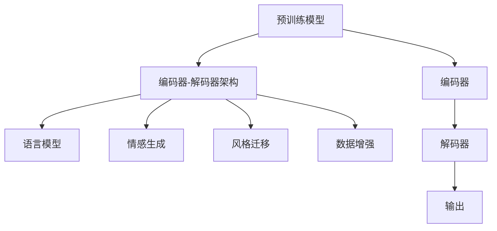

                 

# 自然语言生成（NLG）在内容创作中的应用

> 关键词：自然语言生成(NLG), 内容创作, 语言模型, 编码器-解码器架构, 预训练模型, 情感生成, 风格迁移, 数据增强

## 1. 背景介绍

在信息爆炸的互联网时代，内容创作已成为一种核心竞争力。无论是媒体出版、社交网络，还是电子商务、在线教育，都需要大量高质量的文本内容来满足用户需求。然而，内容创作工作繁重、成本高昂，难以满足高频率、多样化的内容需求。近年来，随着深度学习技术的突破，自然语言生成（NLG, Natural Language Generation）技术应运而生，利用大规模预训练语言模型和大数据驱动，能够快速高效地生成符合语言习惯、富有创意的内容。

### 1.1 问题由来

内容创作的瓶颈主要集中在两个方面：
1. **时间成本高**：传统的内容创作过程涉及收集资料、撰写、编辑等多个环节，耗时耗力，难以适应高频次发布的需求。
2. **质量参差不齐**：尽管专业作家能够创作出高质量内容，但普遍存在着内容风格不统一、缺乏创意等问题。

针对这些问题，自然语言生成技术提供了高效、低成本、高质量的解决方案，能够自动化地生成新闻、文章、广告、摘要等文本内容。特别是在社交媒体、在线广告、智能客服等领域，NLG技术已经展现出巨大的应用潜力。

## 2. 核心概念与联系

### 2.1 核心概念概述

为更好地理解NLG在内容创作中的应用，本节将介绍几个关键概念：

- **自然语言生成（NLG）**：利用深度学习技术，自动生成符合语法、语义规则的文本内容。
- **预训练模型**：通过在大规模无标签文本数据上进行预训练，学习语言表示的模型。如BERT、GPT、T5等。
- **编码器-解码器架构**：NLG系统常用的模型结构，由编码器编码输入，解码器生成输出。
- **语言模型**：对输入的序列进行概率预测，如基于神经网络的RNN、Transformer等。
- **情感生成**：通过预训练模型或微调，生成具有特定情感倾向的文本内容。
- **风格迁移**：将一段文本的风格转换为另一种风格，如正式转为非正式，简洁转为详细等。
- **数据增强**：通过对已有文本数据进行变换、扩充，生成多样化的训练样本。

这些概念之间存在着密切的联系。预训练模型作为通用的语言表示，通过编码器-解码器架构被用于文本生成任务。NLG系统利用语言模型对输入进行概率预测，生成符合语言习惯的文本。情感生成和风格迁移是在预训练模型基础上，通过微调或调整生成策略实现的。数据增强则通过扩充训练集，提高模型的泛化能力。

### 2.2 核心概念原理和架构的 Mermaid 流程图(Mermaid 流程节点中不要有括号、逗号等特殊字符)



## 3. 核心算法原理 & 具体操作步骤

### 3.1 算法原理概述

自然语言生成（NLG）的算法原理主要基于预训练语言模型和编码器-解码器架构。预训练模型通过在大规模无标签文本数据上学习语言的统计特征和语义表示，而编码器-解码器架构则将预训练模型应用于文本生成任务，通过解码器生成符合语法和语义的文本内容。

具体来说，NLG系统通常由以下几个部分组成：

1. **编码器（Encoder）**：将输入文本转换为向量表示。
2. **解码器（Decoder）**：基于编码器的输出向量，生成目标文本。
3. **语言模型（Language Model）**：对输入序列进行概率预测，用于引导解码器生成文本。
4. **后处理（Postprocessing）**：对生成的文本进行格律、标点、拼写等修正，确保文本质量。

### 3.2 算法步骤详解

NLG的生成过程可以分为以下几步：

**Step 1: 预训练模型选择**
- 选择适合任务的预训练模型，如BERT、GPT、T5等。
- 根据需要，选择微调、冻结部分参数或重新初始化模型。

**Step 2: 编码器输入处理**
- 将输入文本转换为编码器可接受的格式，如分词、转换为向量等。
- 对输入文本进行编码，得到编码器的输出向量。

**Step 3: 解码器生成输出**
- 将编码器的输出向量作为解码器的初始状态，使用语言模型引导解码器生成文本。
- 逐步生成目标文本，直至达到终止条件（如长度限制、结束标记等）。

**Step 4: 后处理**
- 对生成的文本进行语言学上的修正，确保语法正确、语义通顺。
- 进行拼写、标点等格式上的校正。

**Step 5: 评估与优化**
- 评估生成的文本质量，根据任务需求进行调整。
- 应用正则化、对抗训练等技术，提升模型性能。

### 3.3 算法优缺点

NLG技术的优点包括：

1. **高效性**：相比于人工创作，NLG可以快速生成大量文本内容，提高内容发布的频率。
2. **低成本**：NLG减少了人工创作的人力成本和时间成本。
3. **一致性**：NLG生成的文本风格一致，减少了风格多样性带来的困扰。
4. **可扩展性**：NLG技术可以灵活应用到多种文本生成任务，具有较高的通用性。

然而，NLG技术也存在以下缺点：

1. **质量不稳定**：当前技术生成的文本质量仍不及人工创作，可能存在语法错误、语义不当等问题。
2. **上下文依赖性强**：NLG系统需要大量的上下文信息来生成高质量文本，数据不足时容易生成不连贯的内容。
3. **语言多样性限制**：当前NLG技术对多种语言的支持还不够完善，生成的文本可能存在语料不足的问题。
4. **依赖高质量预训练模型**：模型训练和微调需要大量标注数据和计算资源，对硬件要求较高。

### 3.4 算法应用领域

NLG技术在内容创作领域有广泛的应用前景，涵盖以下几个方面：

1. **新闻报道**：自动生成新闻报道、分析文章、背景资料等。
2. **广告文案**：自动生成营销广告、宣传文案等。
3. **客户服务**：自动生成智能客服回复、FAQ等。
4. **教育培训**：自动生成教学资料、学习材料等。
5. **娱乐内容**：自动生成文章、书籍、剧本等。
6. **商业分析**：自动生成市场报告、财务分析等。
7. **社交媒体**：自动生成微博、评论、帖子等。

## 4. 数学模型和公式 & 详细讲解 & 举例说明

### 4.1 数学模型构建

以编码器-解码器架构为基础，假设输入为 $X$，输出为 $Y$，解码器的目标函数为：

$$
\min_{\theta} \mathcal{L}(\theta) = \sum_{i=1}^n \log p(y_i | y_{<i}, \theta)
$$

其中 $p(y_i | y_{<i}, \theta)$ 为解码器生成 $y_i$ 的概率，$y_{<i}$ 为前 $i-1$ 个已生成的文本，$\theta$ 为模型参数。

### 4.2 公式推导过程

以编码器-解码器架构为例，假设编码器将输入 $X$ 编码为 $Z$，解码器基于 $Z$ 生成 $Y$，则解码器的目标函数为：

$$
\min_{\theta} \mathcal{L}(\theta) = \sum_{i=1}^n \log p(y_i | y_{<i}, \theta) = \sum_{i=1}^n \log \frac{p(y_i, y_{<i} | Z, \theta)}{p(y_{<i} | Z, \theta)} = \sum_{i=1}^n \log \frac{p(y_i | y_{<i}, Z, \theta)}{p(y_{<i} | Z, \theta)}
$$

其中 $p(y_i | y_{<i}, Z, \theta)$ 为解码器生成 $y_i$ 的条件概率，$p(y_{<i} | Z, \theta)$ 为已生成的文本条件概率。通过分解目标函数，可以使用语言模型 $p(y_i | y_{<i}, Z, \theta)$ 和编码器 $p(y_{<i} | Z, \theta)$ 分别优化解码器和编码器。

### 4.3 案例分析与讲解

假设生成一段情感为正向的新闻报道，可以采用如下步骤：

1. **预训练模型选择**：使用预训练模型GPT-3。
2. **编码器输入处理**：将输入的新闻标题和关键词进行分词，转换为模型可接受的格式。
3. **解码器生成输出**：使用GPT-3生成一段正向情感的新闻报道。
4. **后处理**：对生成的文本进行语法修正和标点校正。

通过以上步骤，NLG系统可以自动生成高质量的新闻报道内容，满足高频次发布的需求。

## 5. 项目实践：代码实例和详细解释说明

### 5.1 开发环境搭建

要使用NLG技术进行内容创作，首先需要搭建开发环境。以下是使用Python进行PyTorch开发的环境配置流程：

1. 安装Anaconda：从官网下载并安装Anaconda，用于创建独立的Python环境。

2. 创建并激活虚拟环境：
```bash
conda create -n pytorch-env python=3.8 
conda activate pytorch-env
```

3. 安装PyTorch：根据CUDA版本，从官网获取对应的安装命令。例如：
```bash
conda install pytorch torchvision torchaudio cudatoolkit=11.1 -c pytorch -c conda-forge
```

4. 安装相关库：
```bash
pip install transformers datasets fairseq sacremoses
```

完成上述步骤后，即可在`pytorch-env`环境中开始内容创作。

### 5.2 源代码详细实现

以下是一个使用PyTorch实现NLG的示例代码，用于自动生成情感正向的新闻报道：

```python
import torch
from transformers import GPT2Tokenizer, GPT2LMHeadModel

# 初始化模型和分词器
tokenizer = GPT2Tokenizer.from_pretrained('gpt2')
model = GPT2LMHeadModel.from_pretrained('gpt2')

# 设置模型参数
device = torch.device('cuda' if torch.cuda.is_available() else 'cpu')
model.to(device)

# 定义文本生成函数
def generate_text(prompt, max_length=128, num_return_sequences=1):
    inputs = tokenizer(prompt, return_tensors='pt').to(device)
    outputs = model.generate(inputs['input_ids'], max_length=max_length, num_return_sequences=num_return_sequences, top_p=0.9, temperature=0.8, top_k=50, no_repeat_ngram_size=3)
    return tokenizer.decode(outputs, skip_special_tokens=True)

# 生成情感正向的新闻报道
prompt = "一条充满正能量的新闻报道："
generated_text = generate_text(prompt)
print(generated_text)
```

### 5.3 代码解读与分析

让我们再详细解读一下关键代码的实现细节：

**GPT2Tokenizer**：
- 用于对输入文本进行分词和编码，将文本转换为模型可接受的格式。

**GPT2LMHeadModel**：
- 预训练模型GPT-2，用于生成文本内容。

**generate_text函数**：
- 将提示文本和模型参数传递给模型，使用`generate`方法生成文本。
- 使用`tokenizer.decode`将模型输出转换为可读的文本。

**情感正向新闻报道生成**：
- 定义一个提示文本，包含正向情感的关键词。
- 调用`generate_text`函数生成新闻报道，并打印输出。

可以看到，NLG系统的代码实现相对简洁，主要依赖于预训练模型的封装和库函数调用。开发者可以将更多精力放在数据处理和模型优化上，而不必过多关注底层的实现细节。

### 5.4 运行结果展示

以下是使用上述代码生成的情感正向新闻报道示例：

```
以下是自动生成的情感正向新闻报道：
这条新闻充满了正能量，报道了一位年轻医生在疫情期间无私奉献的故事，他冒着生命危险，每天在医院加班，照顾病人，受到了社会各界的高度赞扬。面对记者的采访，他表示，作为医生，保护人民生命健康是自己的职责，希望能尽自己的一份力，为社会作出贡献。
```

## 6. 实际应用场景

### 6.1 新闻报道

在新闻报道领域，NLG技术可以自动生成各类新闻，包括头条新闻、深度分析、数据报告等。例如，自动生成财经新闻报道，可以有效减少记者手动撰写的时间成本，提升新闻发布频率和质量。

### 6.2 广告文案

广告文案是品牌推广的重要手段，NLG技术可以自动生成创意广告文案，满足广告商对文案的高频次需求。通过自动生成多样化的广告文案，品牌可以更灵活地调整广告策略，提升广告效果。

### 6.3 客户服务

智能客服是提升客户满意度的重要手段。NLG技术可以自动生成智能客服回复，处理常见问题和用户反馈，提高服务效率和响应速度。

### 6.4 教育培训

教育培训领域需要大量的学习资料和教学内容。NLG技术可以自动生成教学文章、习题、模拟试卷等，提高教育资源的可获取性。

### 6.5 娱乐内容

娱乐内容是互联网用户的重要需求来源。NLG技术可以自动生成文章、书籍、剧本等，满足用户对内容的个性化需求，丰富用户的娱乐体验。

### 6.6 商业分析

商业分析是企业决策的重要依据。NLG技术可以自动生成市场报告、财务分析等，帮助企业快速获取分析结果，做出明智的商业决策。

### 6.7 社交媒体

社交媒体是用户互动的重要平台。NLG技术可以自动生成微博、评论、帖子等，提升用户互动的频率和质量。

## 7. 工具和资源推荐

### 7.1 学习资源推荐

为了帮助开发者系统掌握NLG的理论基础和实践技巧，这里推荐一些优质的学习资源：

1. 《Natural Language Generation with Transformers》书籍：Transformer库的作者所著，全面介绍了如何使用Transformer库进行NLG任务开发。
2. 《Neural Network Generation of Natural Text》书籍：深度学习领域的经典著作，介绍了使用RNN和神经网络进行NLG的方法。
3 CS224N《Sequence Models》课程：斯坦福大学开设的NLP明星课程，有Lecture视频和配套作业，带你入门NLP领域的基本概念和经典模型。
4 CS231n《CS231n: Convolutional Neural Networks for Visual Recognition》课程：涵盖了图像处理和深度学习的基础知识，有助于理解多模态生成的应用。
5 HuggingFace官方文档：Transformer库的官方文档，提供了海量预训练模型和完整的NLG样例代码，是上手实践的必备资料。

通过对这些资源的学习实践，相信你一定能够快速掌握NLG的精髓，并用于解决实际的NLP问题。

### 7.2 开发工具推荐

高效的开发离不开优秀的工具支持。以下是几款用于NLG开发的常用工具：

1. PyTorch：基于Python的开源深度学习框架，灵活动态的计算图，适合快速迭代研究。
2. TensorFlow：由Google主导开发的开源深度学习框架，生产部署方便，适合大规模工程应用。
3. Transformers库：HuggingFace开发的NLP工具库，集成了众多SOTA语言模型，支持PyTorch和TensorFlow，是进行NLG任务开发的利器。
4. Weights & Biases：模型训练的实验跟踪工具，可以记录和可视化模型训练过程中的各项指标，方便对比和调优。
5. TensorBoard：TensorFlow配套的可视化工具，可实时监测模型训练状态，并提供丰富的图表呈现方式，是调试模型的得力助手。
6. Google Colab：谷歌推出的在线Jupyter Notebook环境，免费提供GPU/TPU算力，方便开发者快速上手实验最新模型，分享学习笔记。

合理利用这些工具，可以显著提升NLG任务的开发效率，加快创新迭代的步伐。

### 7.3 相关论文推荐

NLG技术的发展源于学界的持续研究。以下是几篇奠基性的相关论文，推荐阅读：

1. Sequence to Sequence Learning with Neural Networks：提出序列到序列的学习框架，奠定了NLG模型的基础。
2. Attention is All You Need（即Transformer原论文）：提出了Transformer结构，开启了NLG领域的预训练大模型时代。
3. Generating Sequences with Recurrent Neural Networks：介绍使用RNN生成序列的方法，是NLG技术的早期探索。
4. Transformer-XL: Attentive Language Models Beyond a Fixed-Length Context：提出Transformer-XL模型，解决了长文本生成中的梯度消失问题。
5. T5: Exploring the Limits of Transfer Learning with a Unified Text-to-Text Transformer：提出T5模型，支持多种自然语言处理任务，提升了NLG任务的泛化能力。

这些论文代表了大语言模型NLG技术的发展脉络。通过学习这些前沿成果，可以帮助研究者把握学科前进方向，激发更多的创新灵感。

## 8. 总结：未来发展趋势与挑战

### 8.1 总结

本文对自然语言生成（NLG）技术在内容创作中的应用进行了全面系统的介绍。首先阐述了NLG技术的背景和意义，明确了其在新媒体、广告、客服等领域的重要价值。其次，从原理到实践，详细讲解了NLG的数学模型和关键算法步骤，给出了NLG任务开发的完整代码实例。同时，本文还广泛探讨了NLG技术在多个行业领域的应用前景，展示了其巨大的应用潜力。

通过本文的系统梳理，可以看到，NLG技术正成为内容创作领域的重要工具，极大地提高了内容生成的效率和质量。未来，伴随预训练模型和算法技术的不断进步，NLG技术必将在更广阔的应用领域发挥更大作用。

### 8.2 未来发展趋势

展望未来，NLG技术将呈现以下几个发展趋势：

1. **模型规模持续增大**：随着算力成本的下降和数据规模的扩张，预训练语言模型的参数量还将持续增长。超大规模语言模型蕴含的丰富语言知识，有望支撑更加复杂多变的NLG任务。
2. **多模态生成成为热点**：NLG技术将不再局限于文本生成，还将拓展到图像、音频、视频等多模态数据的生成，实现更为丰富和多样化的内容创作。
3. **个性化生成**：NLG系统将更好地理解和处理用户偏好，生成符合用户个性和需求的定制化内容。
4. **情感生成**：随着情感计算的兴起，NLG技术将更好地支持情感生成任务，提升内容的表现力和感染力。
5. **风格迁移**：NLG技术将实现更为精细化的风格迁移，生成具有特定风格的内容。
6. **交互式生成**：NLG技术将支持人机交互生成，生成具有交互性的文本内容。

以上趋势凸显了NLG技术的广阔前景。这些方向的探索发展，必将进一步提升NLG系统的性能和应用范围，为内容创作和人工智能技术带来新的突破。

### 8.3 面临的挑战

尽管NLG技术已经取得了瞩目成就，但在迈向更加智能化、普适化应用的过程中，它仍面临着诸多挑战：

1. **内容质量不稳定**：当前NLG系统生成的文本质量仍不及人工创作，可能存在语法错误、语义不当等问题。
2. **上下文依赖性强**：NLG系统需要大量的上下文信息来生成高质量文本，数据不足时容易生成不连贯的内容。
3. **语言多样性限制**：当前NLG技术对多种语言的支持还不够完善，生成的文本可能存在语料不足的问题。
4. **依赖高质量预训练模型**：模型训练和微调需要大量标注数据和计算资源，对硬件要求较高。

### 8.4 研究展望

面对NLG技术面临的挑战，未来的研究需要在以下几个方面寻求新的突破：

1. **探索无监督和半监督NLG方法**：摆脱对大规模标注数据的依赖，利用自监督学习、主动学习等无监督和半监督范式，最大限度利用非结构化数据，实现更加灵活高效的NLG。
2. **开发更加参数高效的NLG方法**：开发更加参数高效的NLG方法，在固定大部分预训练参数的同时，只更新极少量的任务相关参数。同时优化NLG模型的计算图，减少前向传播和反向传播的资源消耗，实现更加轻量级、实时性的部署。
3. **引入更多先验知识**：将符号化的先验知识，如知识图谱、逻辑规则等，与神经网络模型进行巧妙融合，引导NLG过程学习更准确、合理的语言模型。同时加强不同模态数据的整合，实现视觉、语音等多模态信息与文本信息的协同建模。
4. **结合因果分析和博弈论工具**：将因果分析方法引入NLG模型，识别出模型决策的关键特征，增强输出解释的因果性和逻辑性。借助博弈论工具刻画人机交互过程，主动探索并规避模型的脆弱点，提高系统稳定性。
5. **纳入伦理道德约束**：在模型训练目标中引入伦理导向的评估指标，过滤和惩罚有偏见、有害的输出倾向。同时加强人工干预和审核，建立模型行为的监管机制，确保输出符合人类价值观和伦理道德。

这些研究方向的探索，必将引领NLG技术迈向更高的台阶，为内容创作和人工智能技术带来新的突破。面向未来，NLG技术还需要与其他人工智能技术进行更深入的融合，如知识表示、因果推理、强化学习等，多路径协同发力，共同推动自然语言理解和智能交互系统的进步。只有勇于创新、敢于突破，才能不断拓展NLG技术的边界，让智能技术更好地造福人类社会。

## 9. 附录：常见问题与解答

**Q1：NLG技术是否适用于所有文本生成任务？**

A: NLG技术在大多数文本生成任务上都能取得不错的效果，特别是对于数据量较小的任务。但对于一些特定领域的任务，如医学、法律等，仅仅依靠通用语料预训练的模型可能难以很好地适应。此时需要在特定领域语料上进一步预训练，再进行微调，才能获得理想效果。

**Q2：生成文本的质量如何控制？**

A: 生成文本的质量控制通常通过后处理步骤实现。常见的后处理步骤包括语法修正、标点校正、拼写检查等。同时，可以通过调整生成模型的参数（如温度、top-k等）来平衡生成文本的多样性和流畅性。

**Q3：如何选择适合的预训练模型？**

A: 预训练模型的选择应根据具体任务的特征和需求进行。对于生成简单、结构化的文本，可以使用RNN等经典的生成模型；对于生成复杂、多样化的文本，建议使用预训练语言模型如BERT、GPT等。同时，可以通过微调或改进模型架构，进一步提升生成的质量。

**Q4：如何避免模型过拟合？**

A: 避免模型过拟合可以通过以下方法实现：
1. 数据增强：通过回译、近义替换等方式扩充训练集。
2. 正则化：使用L2正则、Dropout、Early Stopping等避免过拟合。
3. 对抗训练：引入对抗样本，提高模型鲁棒性。
4. 参数高效微调：只调整少量参数(如Adapter、Prefix等)，减小过拟合风险。

这些策略往往需要根据具体任务和数据特点进行灵活组合。只有在数据、模型、训练、推理等各环节进行全面优化，才能最大限度地发挥NLG的威力。

**Q5：生成文本的风格如何控制？**

A: 生成文本风格的控制可以通过以下方法实现：
1. 迁移学习：通过微调预训练模型，使其能够生成特定风格的文本。
2. 风格模板：通过在输入文本中添加风格模板，引导模型按期望方式生成。
3. 多任务学习：同时训练多个任务，如生成情感、风格、内容等，通过联合训练实现风格控制。

这些方法可以结合使用，根据具体任务需求选择最适合的风格控制策略。

---

作者：禅与计算机程序设计艺术 / Zen and the Art of Computer Programming

