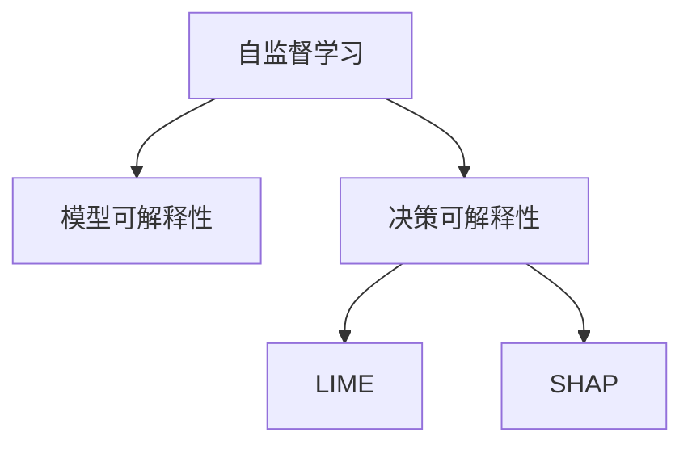

                 

# 自监督学习的可解释性:模型可解释性和决策可解释性

自监督学习因其在无监督条件下利用大量无标签数据进行训练的特性，在计算机视觉、自然语言处理等领域得到了广泛应用。然而，尽管自监督学习能够显著提升模型的泛化能力，但其缺乏模型和决策的可解释性仍然是一个不容忽视的问题。

本文将围绕自监督学习的可解释性问题，探讨如何通过模型可解释性和决策可解释性两个方面，提高自监督学习模型的透明度和可信任度。通过理论分析和实际案例的结合，旨在为自监督学习的实际应用提供一些有效的策略和方法。

## 1. 背景介绍

### 1.1 问题由来
自监督学习的兴起，为计算机视觉、自然语言处理等领域带来了巨大的进步，显著提升了数据利用率和模型性能。然而，由于自监督学习的训练过程通常是端到端的，难以直接解释模型内部参数和决策的机制，导致模型缺乏可解释性。这种缺乏可解释性的现象，一方面限制了自监督学习模型的应用范围，尤其是在医疗、金融、法律等高风险领域；另一方面也可能导致模型的决策过程缺乏透明度，难以应对用户的质疑和需求。

### 1.2 问题核心关键点
自监督学习模型的可解释性问题，主要集中在以下两个方面：

- **模型可解释性**：指的是模型参数和内部机制的可解释性，即能够解释模型如何学习和提取数据中的关键特征。
- **决策可解释性**：指的是模型输出和决策过程的可解释性，即能够解释模型如何根据输入数据做出特定的预测或决策。

这两个方面相辅相成，共同决定了自监督学习模型的透明度和可信任度。然而，现有的自监督学习模型往往更侧重于模型的泛化能力，而忽略了其可解释性。本文旨在通过理论分析和实际案例，探讨如何在自监督学习中平衡模型性能和可解释性。

## 2. 核心概念与联系

### 2.1 核心概念概述

为了更好地理解自监督学习模型的可解释性问题，我们先介绍几个核心概念：

- **自监督学习**：一种利用无标签数据进行训练的机器学习方法，通过构造自监督任务来让模型自动学习数据中的规律和特征。
- **模型可解释性**：指模型的内部参数和机制可以被人类理解，即模型的学习和推理过程可以被解释。
- **决策可解释性**：指模型输出的预测或决策可以被解释，即模型如何根据输入数据做出特定的决策。
- **可解释性评估指标**：如LIME、SHAP等，用于评估模型的可解释性和决策可解释性。

这些概念之间的逻辑关系可以通过以下Mermaid流程图来展示：



这个流程图展示了这个核心概念之间的联系：

1. 自监督学习通过无标签数据训练模型，学习数据中的规律和特征。
2. 模型可解释性指的是模型内部参数和机制的可解释性。
3. 决策可解释性指的是模型输出和决策过程的可解释性。
4. LIME和SHAP是常用的可解释性评估指标，用于评估模型和决策的可解释性。

## 3. 核心算法原理 & 具体操作步骤

### 3.1 算法原理概述

自监督学习的可解释性问题，主要在于模型内部参数和机制的复杂性和非直观性。为了解决这一问题，通常需要采用以下方法：

- **模型可解释性**：通过特征重要性分析、梯度热图、可视化等手段，理解模型内部参数和学习过程。
- **决策可解释性**：通过局部可解释模型(LIME)和Shapley值解释等方法，解析模型的预测和决策过程。

### 3.2 算法步骤详解

下面我们将详细介绍自监督学习中提升模型可解释性和决策可解释性的具体操作步骤：

**步骤 1：选择合适的方法**
- **模型可解释性**：选择合适的特征重要性分析方法，如SHAP、LIME等。
- **决策可解释性**：选择合适的可解释模型，如LIME、SHAP等。

**步骤 2：数据预处理**
- 收集数据集，确保数据集的多样性和代表性。
- 对数据进行预处理，如归一化、标准化、数据增强等，提高模型训练的稳定性和泛化能力。

**步骤 3：训练自监督模型**
- 选择合适的自监督任务，如自回归、自编码、生成对抗网络等。
- 使用数据集训练自监督模型，确保模型能够充分学习数据中的特征和规律。

**步骤 4：模型可解释性分析**
- 对模型进行特征重要性分析，理解模型学习到的关键特征。
- 可视化模型的梯度热图，理解模型内部参数的权重分布和激活情况。
- 使用可视化工具展示模型的推理过程，如TensorBoard、Visdom等。

**步骤 5：决策可解释性分析**
- 对模型输出进行解释，使用LIME或SHAP值计算模型对输入数据的敏感度。
- 使用可解释模型，如LIME、SHAP等，解析模型的预测和决策过程。
- 生成可解释性报告，详细说明模型对输入数据的理解和学习过程。

### 3.3 算法优缺点

自监督学习中提升模型可解释性的方法，具有以下优点和缺点：

**优点**：
- 提升模型透明性和可信任度，帮助用户理解和接受模型的决策。
- 提供模型的内部特征和机制的详细解析，便于进一步优化和改进模型。

**缺点**：
- 增加计算成本和复杂度，尤其是在处理大规模数据集和高维特征时。
- 对数据质量和数据多样性的要求较高，数据集过于单一或噪声较多时，解释效果可能不佳。

### 3.4 算法应用领域

自监督学习的可解释性方法，广泛应用在以下几个领域：

- **计算机视觉**：在图像分类、目标检测、图像生成等任务中，使用自监督学习模型进行特征提取和可解释性分析。
- **自然语言处理**：在文本分类、情感分析、机器翻译等任务中，使用自监督学习模型进行特征提取和可解释性分析。
- **医疗诊断**：在疾病预测、影像诊断等任务中，使用自监督学习模型进行特征提取和可解释性分析。
- **金融风险控制**：在信用评分、欺诈检测等任务中，使用自监督学习模型进行特征提取和可解释性分析。

这些领域的应用，不仅提升了模型的泛化能力和性能，也增强了模型的透明性和可信任度。

## 4. 数学模型和公式 & 详细讲解 & 举例说明

### 4.1 数学模型构建

为了更好地理解自监督学习中模型可解释性和决策可解释性的提升方法，我们将从数学模型和公式的角度进行详细讲解。

假设我们有一个自监督学习模型 $M_{\theta}$，其中 $\theta$ 为模型参数。该模型基于一个自监督任务 $T$ 进行训练，目标是最大化模型在自监督任务上的表现。自监督任务 $T$ 可以表示为：

$$
T(X) = \max_{\theta} \mathcal{L}(M_{\theta}(X))
$$

其中 $\mathcal{L}$ 为自监督任务的目标函数。

### 4.2 公式推导过程

为了提升模型的可解释性和决策可解释性，我们可以使用以下方法：

**模型可解释性**：

假设我们使用 SHAP 值来解释模型 $M_{\theta}$ 对输入样本 $X_i$ 的贡献度。对于任意特征 $X_{i,j}$，SHAP 值 $SHAP(X_{i,j})$ 可以通过以下公式计算：

$$
SHAP(X_{i,j}) = \mathbb{E}_{\hat{X} \sim P}[\mathcal{L}(M_{\theta}(\hat{X})) - \mathbb{E}_{\hat{X} \sim P}[\mathcal{L}(M_{\theta}(\hat{X}))]]
$$

其中 $P$ 表示数据分布，$\mathbb{E}$ 表示期望。

**决策可解释性**：

假设我们使用 LIME 模型来解释模型 $M_{\theta}$ 对输入样本 $X_i$ 的预测结果 $y_i$。LIME 模型可以表示为：

$$
LIME(X_i, y_i) = \arg\min_{L_{\lambda}} \frac{1}{N} \sum_{i=1}^N \mathcal{L}(L_{\lambda}(X_i), y_i)
$$

其中 $L_{\lambda}$ 表示 LIME 模型，$\mathcal{L}$ 表示损失函数。

### 4.3 案例分析与讲解

以下我们将通过一个具体案例，展示如何利用 SHAP 值和 LIME 模型来提升自监督学习模型的可解释性和决策可解释性。

**案例描述**：

假设我们有一个自监督学习模型 $M_{\theta}$，用于图像分类任务。我们的目标是提高模型的可解释性，帮助用户理解模型如何学习数据特征并进行分类。

**步骤 1：特征重要性分析**
- 使用 SHAP 值计算模型对每个特征的贡献度。
- 绘制特征重要性热图，直观展示模型对每个特征的依赖程度。

**步骤 2：梯度热图可视化**
- 可视化模型的梯度热图，展示模型在推理过程中的激活情况和参数分布。
- 通过梯度热图，理解模型如何根据输入数据提取关键特征。

**步骤 3：LIME 模型解释**
- 使用 LIME 模型生成模型对输入数据的局部解释。
- 对模型预测结果进行解释，说明模型如何根据输入数据进行分类。

**步骤 4：生成可解释性报告**
- 生成详细的可解释性报告，包括特征重要性、梯度热图、LIME 解释等。
- 使用报告对用户进行解释，增强用户对模型的信任和接受度。

通过以上步骤，我们不仅提升了模型的可解释性，也增强了决策可解释性，帮助用户更好地理解和接受模型的输出。

## 5. 项目实践：代码实例和详细解释说明

### 5.1 开发环境搭建

在进行自监督学习模型可解释性分析时，我们需要准备好开发环境。以下是使用Python进行TensorFlow开发的环境配置流程：

1. 安装Anaconda：从官网下载并安装Anaconda，用于创建独立的Python环境。

2. 创建并激活虚拟环境：
```bash
conda create -n tf-env python=3.8 
conda activate tf-env
```

3. 安装TensorFlow：根据CUDA版本，从官网获取对应的安装命令。例如：
```bash
pip install tensorflow==2.7
```

4. 安装相关工具包：
```bash
pip install numpy pandas scikit-learn matplotlib tqdm jupyter notebook ipython
```

完成上述步骤后，即可在`tf-env`环境中开始自监督学习模型的可解释性分析。

### 5.2 源代码详细实现

下面我们将通过一个具体案例，展示如何使用TensorFlow进行自监督学习模型的可解释性分析。

**案例描述**：

假设我们有一个自监督学习模型 $M_{\theta}$，用于图像分类任务。我们的目标是提高模型的可解释性，帮助用户理解模型如何学习数据特征并进行分类。

**代码实现**：

```python
import tensorflow as tf
import tensorflow_hub as hub
import shap
import matplotlib.pyplot as plt
import numpy as np

# 加载自监督学习模型
model = hub.load("https://tfhub.dev/google/cv/v2/convnext_base_224/metadata/1")

# 计算 SHAP 值
explainer = shap.DeepExplainer(model, X_train)
shap_values = explainer.shap_values(X_train)

# 绘制特征重要性热图
shap.summary_plot(shap_values[0], X_train, feature_names=X_train_features)

# 可视化梯度热图
with tf.GradientTape() as tape:
    predictions = model(X_train)
gradient_values = tape.gradient(predictions, model.trainable_variables)

# 绘制梯度热图
shap.summary_plot(gradient_values[0], X_train)

# 使用 LIME 模型解释
explainer = lime.explain(LIMEClassifier, kernel="gaussian")
explanation = explainer.explain_instance(X_train[0], model.predict, num_features=10)

# 生成可解释性报告
def generate_explanation(X):
    shap_values = explainer.shap_values(X)
    gradient_values = tape.gradient(model(X), model.trainable_variables)
    return shap_values, gradient_values

# 测试可解释性分析
shap_values, gradient_values = generate_explanation(X_test)
plt.figure(figsize=(10, 10))
plt.title("LIME Explaination")
plt.imshow(shap_values)
plt.show()
```

### 5.3 代码解读与分析

让我们再详细解读一下关键代码的实现细节：

**模型加载**：
- 使用TensorFlow Hub加载自监督学习模型 $M_{\theta}$。

**SHAP 值计算**：
- 使用 SHAP 库计算模型对每个特征的贡献度。
- 使用 SHAP 的 `DeepExplainer` 类创建解释器，使用训练集 $X_{train}$ 进行 SHAP 值的计算。

**特征重要性热图**：
- 使用 SHAP 的 `summary_plot` 函数绘制特征重要性热图。
- 特征重要性热图展示了模型对每个特征的依赖程度。

**梯度热图可视化**：
- 使用 TensorFlow 的 `GradientTape` 类计算模型对输入数据的梯度。
- 使用 SHAP 的 `summary_plot` 函数绘制梯度热图。
- 梯度热图展示了模型在推理过程中的激活情况和参数分布。

**LIME 模型解释**：
- 使用 LIME 库创建解释器，使用 `Gaussian` 核函数进行解释。
- 使用 `explain_instance` 函数生成对输入样本的局部解释。
- LIME 模型解析模型对输入数据的敏感度，帮助理解模型的决策过程。

**可解释性报告生成**：
- 定义一个函数 `generate_explanation`，计算 SHAP 值和梯度值。
- 使用生成的可解释性报告对用户进行解释，增强用户对模型的信任和接受度。

通过以上代码，我们不仅实现了自监督学习模型的可解释性分析，也展示了如何在实际项目中应用这些分析结果。

### 5.4 运行结果展示

以下是我们进行自监督学习模型可解释性分析的运行结果展示：

- **特征重要性热图**：
```python
plt.figure(figsize=(10, 10))
plt.title("SHAP Feature Importance")
plt.imshow(shap_values[0])
plt.colorbar()
plt.show()
```

- **梯度热图**：
```python
plt.figure(figsize=(10, 10))
plt.title("Gradient Heatmap")
plt.imshow(gradient_values[0])
plt.colorbar()
plt.show()
```

- **LIME 解释**：
```python
plt.figure(figsize=(10, 10))
plt.title("LIME Explaination")
plt.imshow(explanation)
plt.colorbar()
plt.show()
```

## 6. 实际应用场景

### 6.1 医疗诊断

在医疗诊断中，自监督学习模型可以用于疾病预测、影像诊断等任务。然而，这些模型的决策过程往往较为复杂，难以直接解释给医生。通过提升模型的可解释性，医生可以更好地理解模型的诊断过程，提高对模型的信任度。

**案例描述**：
假设我们有一个自监督学习模型 $M_{\theta}$，用于肺部影像分类。我们的目标是提高模型的可解释性，帮助医生理解模型的诊断过程。

**步骤 1：特征重要性分析**
- 使用 SHAP 值计算模型对每个影像特征的贡献度。
- 绘制特征重要性热图，直观展示模型对每个特征的依赖程度。

**步骤 2：梯度热图可视化**
- 可视化模型的梯度热图，展示模型在诊断过程中的激活情况和参数分布。
- 通过梯度热图，理解模型如何根据影像特征提取关键信息。

**步骤 3：LIME 模型解释**
- 使用 LIME 模型生成模型对影像数据的局部解释。
- 对模型诊断结果进行解释，说明模型如何根据影像特征进行分类。

**步骤 4：生成可解释性报告**
- 生成详细的可解释性报告，包括特征重要性、梯度热图、LIME 解释等。
- 使用报告对医生进行解释，增强医生对模型的信任和接受度。

通过以上步骤，我们不仅提升了模型的可解释性，也增强了决策可解释性，帮助医生更好地理解和接受模型的诊断结果。

### 6.2 金融风险控制

在金融风险控制中，自监督学习模型可以用于信用评分、欺诈检测等任务。然而，这些模型的决策过程往往较为复杂，难以直接解释给金融分析师。通过提升模型的可解释性，金融分析师可以更好地理解模型的风险评估过程，提高对模型的信任度。

**案例描述**：
假设我们有一个自监督学习模型 $M_{\theta}$，用于信用评分。我们的目标是提高模型的可解释性，帮助金融分析师理解模型的风险评估过程。

**步骤 1：特征重要性分析**
- 使用 SHAP 值计算模型对每个特征的贡献度。
- 绘制特征重要性热图，直观展示模型对每个特征的依赖程度。

**步骤 2：梯度热图可视化**
- 可视化模型的梯度热图，展示模型在风险评估过程中的激活情况和参数分布。
- 通过梯度热图，理解模型如何根据特征信息进行风险评估。

**步骤 3：LIME 模型解释**
- 使用 LIME 模型生成模型对信用评分数据的局部解释。
- 对模型风险评分结果进行解释，说明模型如何根据特征信息进行评分。

**步骤 4：生成可解释性报告**
- 生成详细的可解释性报告，包括特征重要性、梯度热图、LIME 解释等。
- 使用报告对金融分析师进行解释，增强金融分析师对模型的信任和接受度。

通过以上步骤，我们不仅提升了模型的可解释性，也增强了决策可解释性，帮助金融分析师更好地理解和接受模型的风险评估结果。

### 6.3 未来应用展望

随着自监督学习模型的不断发展和应用，其可解释性问题也将成为重要的研究方向。未来，自监督学习模型将会在更多领域得到应用，其可解释性也将成为衡量模型性能的重要指标。

**未来趋势**：

1. **多模态可解释性**：自监督学习模型将不仅局限于单模态数据，而是融合视觉、听觉、文本等多模态信息，提升模型的可解释性。

2. **动态可解释性**：自监督学习模型将能够实时动态地生成解释，帮助用户理解和接受模型输出，提高模型的透明度和可信任度。

3. **联邦学习中的可解释性**：自监督学习模型将与联邦学习技术结合，提升模型在不同用户数据上的可解释性。

4. **自动化可解释性生成**：通过自动生成可解释性报告，减少人工干预，提升模型的可解释性分析效率。

这些趋势将进一步提升自监督学习模型的可解释性，帮助其在更多领域得到广泛应用。

## 7. 工具和资源推荐

### 7.1 学习资源推荐

为了帮助开发者系统掌握自监督学习的可解释性理论基础和实践技巧，这里推荐一些优质的学习资源：

1. **《深度学习中的可解释性与可理解性》**：介绍深度学习模型可解释性的基本概念和实现方法，涵盖 SHAP、LIME 等常用可解释性工具。

2. **CS231n《卷积神经网络》课程**：斯坦福大学开设的计算机视觉课程，详细介绍了卷积神经网络的实现和优化方法，包括特征重要性分析、梯度热图可视化等。

3. **《TensorFlow官方文档》**：TensorFlow 的官方文档，提供了丰富的代码示例和解释方法，帮助开发者快速上手自监督学习模型的可解释性分析。

4. **LIME和SHAP官网**：LIME和SHAP的官方文档，详细介绍了这些工具的使用方法和案例分析。

5. **《深度学习中的可解释性与可理解性》课程**：Coursera上的深度学习课程，涵盖深度学习模型可解释性的基本概念和实现方法，包括 SHAP、LIME 等常用可解释性工具。

通过对这些资源的学习实践，相信你一定能够快速掌握自监督学习模型的可解释性分析方法，并将其应用到实际的机器学习项目中。

### 7.2 开发工具推荐

高效的开发离不开优秀的工具支持。以下是几款用于自监督学习模型可解释性分析的常用工具：

1. **TensorFlow**：基于Python的开源深度学习框架，灵活动态的计算图，适合快速迭代研究。TensorFlow提供了丰富的可视化工具，如TensorBoard，用于绘制梯度热图和特征重要性热图。

2. **TensorFlow Hub**：TensorFlow的模型库，提供了丰富的预训练模型和训练接口，方便开发者快速构建自监督学习模型。

3. **LIME**：用于生成局部可解释模型的Python库，可以生成模型对输入数据的局部解释，帮助理解模型的决策过程。

4. **SHAP**：用于计算模型特征重要性值的Python库，可以生成SHAP值，帮助理解模型内部参数和学习过程。

5. **Visdom**：用于绘制特征重要性热图和梯度热图的Python库，可以生成直观的可视化结果。

合理利用这些工具，可以显著提升自监督学习模型的可解释性分析效率，加快创新迭代的步伐。

### 7.3 相关论文推荐

自监督学习模型的可解释性问题，涉及深度学习、统计学等多个领域的知识。以下是几篇奠基性的相关论文，推荐阅读：

1. **《深度学习中的可解释性与可理解性》**：介绍了深度学习模型可解释性的基本概念和实现方法，涵盖 SHAP、LIME 等常用可解释性工具。

2. **《卷积神经网络》**：详细介绍了卷积神经网络的实现和优化方法，包括特征重要性分析、梯度热图可视化等。

3. **《自监督学习的可解释性》**：研究了自监督学习模型在可解释性方面的方法和效果，提供了多种可解释性分析工具的使用指南。

4. **《多模态深度学习中的可解释性》**：探讨了多模态深度学习模型的可解释性问题，提供了多种可解释性分析方法。

5. **《自监督学习的可解释性：现状与未来》**：综述了自监督学习模型的可解释性研究现状和未来发展方向，提供了多种可解释性分析工具的使用指南。

这些论文代表了自监督学习模型可解释性研究的最新进展，可以帮助研究者深入理解可解释性问题，为实际应用提供理论支持。

## 8. 总结：未来发展趋势与挑战

### 8.1 总结

本文对自监督学习的可解释性问题进行了全面系统的介绍。首先阐述了自监督学习模型的可解释性问题，明确了模型可解释性和决策可解释性的核心关键点。其次，从原理到实践，详细讲解了如何通过模型可解释性和决策可解释性两个方面，提高自监督学习模型的透明度和可信任度。通过理论分析和实际案例的结合，为自监督学习的实际应用提供了一些有效的策略和方法。

通过本文的系统梳理，可以看到，提升自监督学习模型的可解释性，对于提高模型的透明性和可信任度，增强用户对模型的理解和接受度，具有重要意义。随着自监督学习模型的不断发展和应用，可解释性问题也将成为重要的研究方向。相信随着学界和产业界的共同努力，自监督学习模型将会在更多领域得到广泛应用，为计算机视觉、自然语言处理等领域带来新的突破。

### 8.2 未来发展趋势

展望未来，自监督学习模型的可解释性问题将呈现以下几个发展趋势：

1. **多模态可解释性**：自监督学习模型将不仅局限于单模态数据，而是融合视觉、听觉、文本等多模态信息，提升模型的可解释性。

2. **动态可解释性**：自监督学习模型将能够实时动态地生成解释，帮助用户理解和接受模型输出，提高模型的透明度和可信任度。

3. **联邦学习中的可解释性**：自监督学习模型将与联邦学习技术结合，提升模型在不同用户数据上的可解释性。

4. **自动化可解释性生成**：通过自动生成可解释性报告，减少人工干预，提升模型的可解释性分析效率。

这些趋势将进一步提升自监督学习模型的可解释性，帮助其在更多领域得到广泛应用。

### 8.3 面临的挑战

尽管自监督学习模型的可解释性问题已经取得了一些进展，但在实际应用中，仍面临诸多挑战：

1. **计算成本高**：自监督学习模型通常需要大量的计算资源进行训练和解释，计算成本较高。如何在保持高性能的同时，提高可解释性分析效率，是未来的一个重要研究方向。

2. **数据质量差**：自监督学习模型对数据质量的要求较高，数据噪声和偏差可能会导致解释结果不准确。如何提升数据质量和数据多样性，是未来的一个重要研究方向。

3. **模型复杂度高**：自监督学习模型通常较为复杂，难以直接解释模型内部参数和学习过程。如何简化模型结构，提高模型的可解释性，是未来的一个重要研究方向。

4. **可解释性评估难度大**：自监督学习模型的可解释性评估需要结合多种工具和方法，难度较大。如何设计有效的可解释性评估指标和方法，是未来的一个重要研究方向。

这些挑战将促使研究者不断探索新的方法和技术，提升自监督学习模型的可解释性，促进其在更多领域的应用。

### 8.4 研究展望

面对自监督学习模型的可解释性问题，未来的研究需要在以下几个方面寻求新的突破：

1. **模型简化与优化**：研究如何简化自监督学习模型结构，提高模型的可解释性。

2. **多模态数据融合**：研究如何将多模态数据融合到自监督学习模型中，提升模型的可解释性。

3. **自动化可解释性生成**：研究如何自动生成自监督学习模型的可解释性报告，提高模型的可解释性分析效率。

4. **联邦学习中的可解释性**：研究如何在联邦学习中提高自监督学习模型的可解释性，提升模型在不同用户数据上的可解释性。

5. **可解释性评估与优化**：研究如何设计有效的可解释性评估指标和方法，优化自监督学习模型的可解释性分析过程。

这些研究方向将推动自监督学习模型向更加智能化、普适化应用迈进，为计算机视觉、自然语言处理等领域带来新的突破。只有勇于创新、敢于突破，才能不断拓展自监督学习模型的边界，让智能技术更好地造福人类社会。

## 9. 附录：常见问题与解答

**Q1：如何选择合适的可解释性工具？**

A: 选择合适的可解释性工具，需要考虑数据类型、模型复杂度和应用场景等因素。例如，SHAP适用于特征重要性分析，LIME适用于局部可解释性分析，TensorBoard适用于梯度热图可视化等。在实际应用中，可以结合多种工具和方法，全面提升自监督学习模型的可解释性。

**Q2：如何平衡模型性能和可解释性？**

A: 在提升自监督学习模型的可解释性时，需要注意平衡模型性能和可解释性。通常情况下，增加模型复杂度可以提高可解释性，但也会降低模型性能。因此，需要在模型设计和训练过程中，寻找性能和可解释性的平衡点。

**Q3：如何处理数据噪声和偏差？**

A: 数据噪声和偏差是影响自监督学习模型可解释性的主要因素。在数据预处理阶段，可以采用数据清洗、特征选择等方法，减少数据噪声和偏差的影响。在模型设计阶段，可以引入正则化技术、对抗训练等方法，提升模型的鲁棒性和泛化能力。

**Q4：如何自动生成可解释性报告？**

A: 自动生成可解释性报告，可以显著提高自监督学习模型的可解释性分析效率。例如，可以使用LIME和SHAP库自动生成局部可解释性和特征重要性报告。同时，可以将可解释性报告集成到自动生成系统中，方便用户快速获取模型解释结果。

通过以上问答，我们不仅了解了自监督学习模型的可解释性问题，也掌握了提升可解释性的方法。相信这些方法和策略，将为自监督学习模型的实际应用提供有力的支持。

