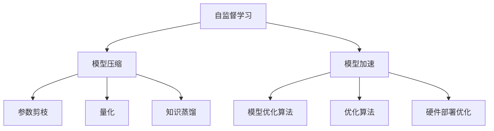

                 

# 自监督学习的应用部署:模型压缩和模型加速

> 关键词：自监督学习,模型压缩,模型加速,深度学习,训练效率,模型优化

## 1. 背景介绍

### 1.1 问题由来
在深度学习领域，自监督学习(Self-Supervised Learning, SSL)正成为一种越来越重要的方法，特别是在模型压缩和模型加速方面。传统的监督学习依赖于大量标注数据，而标注数据的获取往往代价昂贵且耗时。与之相反，自监督学习可以利用无标签数据，通过自训练的方式，学习到模型的特征表示，提高模型的泛化能力和泛用性。

自监督学习通过学习数据本身的内在结构，如语言模型预测、图像重建等，来优化模型。在模型压缩和模型加速方面，自监督学习能够大幅减小模型体积，提高训练速度和推理效率，从而在各种硬件资源受限的平台上更好地应用。本文将详细探讨自监督学习在模型压缩和模型加速中的应用，为深度学习开发者提供实用的指导。

### 1.2 问题核心关键点
自监督学习的应用部署主要集中在以下几个方面：
1. 模型压缩：通过自监督学习，可以学习到更加紧凑的模型特征表示，显著减小模型参数量。
2. 模型加速：自监督学习可以帮助模型更快地收敛，显著提高训练和推理效率。
3. 数据增强：自监督学习能够生成大量合成数据，丰富训练数据集，提升模型泛化能力。
4. 泛用性：自监督学习方法能够适应多种不同的模型架构和应用场景，具有高度的通用性。

## 2. 核心概念与联系

### 2.1 核心概念概述

在深入探讨自监督学习在模型压缩和模型加速中的应用之前，首先介绍几个关键概念：

- **自监督学习**：利用无标签数据进行模型训练，通过预设的任务或预训练目标，让模型自动学习到数据的潜在结构，从而获得泛化能力。
- **模型压缩**：通过参数剪枝、量化、知识蒸馏等技术手段，减小模型体积和计算复杂度。
- **模型加速**：通过优化模型结构、算法和硬件部署，提升模型训练和推理的速度和效率。

### 2.2 核心概念原理和架构的 Mermaid 流程图


这个流程图展示了自监督学习与模型压缩和模型加速之间的联系：自监督学习通过学习数据的内在结构，优化模型特征表示，从而在模型压缩和模型加速中起到关键作用。参数剪枝、量化、知识蒸馏等技术都基于自监督学习的思路进行优化，模型优化算法和硬件部署优化则是加速的直接手段。

## 3. 核心算法原理 & 具体操作步骤
### 3.1 算法原理概述

自监督学习的核心思想是利用无标签数据进行模型训练，通过预设的任务或预训练目标，让模型自动学习到数据的潜在结构，从而获得泛化能力。常见的自监督学习任务包括：

- 语言模型预测：给定一段文本，预测下一个词的概率分布。
- 图像重建：给定一个图片，预测其经过一系列变换后恢复原貌的概率分布。
- 对比学习：通过正负样本对比，让模型学习到数据之间的一致性和差异性。

自监督学习的应用部署主要包括以下几个关键步骤：

1. 选择适合自监督学习的模型架构，如Transformer、CNN等。
2. 设计自监督学习任务，根据任务特点选择合适的预训练目标。
3. 构建训练数据集，包括无标签数据和部分有标签数据。
4. 训练模型，通过优化算法如Adam、SGD等最小化损失函数。
5. 模型压缩和加速，根据实际应用场景进行参数剪枝、量化等优化操作。

### 3.2 算法步骤详解

#### 3.2.1 模型选择
选择合适的模型架构是自监督学习应用的基础。当前，Transformer模型在自然语言处理任务中表现优异，其自注意力机制能够很好地处理长距离依赖关系，适用于自监督学习任务。对于计算机视觉任务，卷积神经网络(CNN)依然是主流选择。

#### 3.2.2 任务设计
根据任务特点，设计合适的自监督学习任务。例如，对于语言模型预测，可以使用基于下一个词的预测任务，也可以使用基于句子完形填空的任务。对于图像重建，可以使用像素级别的重建任务，也可以使用更高级的特征重建任务。

#### 3.2.3 数据构建
构建适合自监督学习的数据集。无标签数据可以通过公开数据集获取，也可以利用数据增强技术从有标签数据中生成。例如，对于语言模型预测任务，可以通过回译、数据合成等方式生成更多训练样本。

#### 3.2.4 模型训练
选择合适的优化算法，如Adam、SGD等，最小化损失函数。常用的自监督学习损失函数包括交叉熵、均方误差等。例如，对于语言模型预测任务，可以使用交叉熵损失函数。

#### 3.2.5 模型压缩和加速
根据实际应用场景进行模型优化，如参数剪枝、量化、知识蒸馏等。使用TensorFlow、PyTorch等深度学习框架提供的工具，可以很方便地实现这些优化操作。

### 3.3 算法优缺点

自监督学习在模型压缩和模型加速方面具有以下优点：

- 依赖较少标注数据：自监督学习可以利用无标签数据进行训练，减少对标注数据的依赖。
- 泛化能力强：自监督学习通过学习数据的内在结构，能够提高模型的泛化能力和泛用性。
- 训练速度快：自监督学习能够显著提高模型的收敛速度，减少训练时间。

同时，自监督学习也存在一些局限性：

- 数据生成难度大：自监督学习生成高质量合成数据需要更多计算资源和预处理工作。
- 模型鲁棒性不足：自监督学习模型可能过拟合训练数据，泛化能力受限。
- 对硬件要求高：自监督学习通常需要更大计算资源进行训练，硬件部署成本较高。

尽管存在这些局限性，自监督学习在模型压缩和模型加速方面仍具有广泛的应用前景。

### 3.4 算法应用领域

自监督学习在模型压缩和模型加速方面具有广泛的应用前景，主要涵盖以下几个领域：

- 移动端应用：移动设备资源受限，自监督学习可以有效减小模型体积，提升推理速度。
- 嵌入式系统：嵌入式系统对计算资源和功耗有严格要求，自监督学习有助于优化模型参数和结构。
- 实时应用：如语音识别、自然语言处理等实时应用场景，自监督学习可以显著提高处理速度和效率。
- 边缘计算：自监督学习可以优化模型，减少边缘设备计算负担，提升系统性能。

## 4. 数学模型和公式 & 详细讲解 & 举例说明
### 4.1 数学模型构建

本节将使用数学语言对自监督学习在模型压缩和模型加速中的应用进行详细讲解。

以语言模型预测任务为例，记模型参数为 $\theta$，训练样本为 $\{x_i\}_{i=1}^N$，对应的标签为 $\{y_i\}_{i=1}^N$，其中 $y_i \in V$ 为可能的词汇表。假设模型 $M_{\theta}$ 在输入 $x_i$ 上的预测概率分布为 $P(y_i|x_i; \theta)$，则模型在训练集上的经验风险为：

$$
\mathcal{L}(\theta) = -\frac{1}{N}\sum_{i=1}^N \log P(y_i|x_i; \theta)
$$

其中 $\log P(y_i|x_i; \theta)$ 为模型在训练样本上的预测概率的对数，通过最大化预测概率，优化模型参数。

### 4.2 公式推导过程

以语言模型预测任务为例，推导模型的参数更新公式。

假设使用交叉熵损失函数，则模型的损失函数为：

$$
\mathcal{L}(\theta) = -\frac{1}{N}\sum_{i=1}^N \log \frac{\exp \theta_i^\top x_i}{\sum_{j=1}^n \exp \theta_j^\top x_i}
$$

其中 $\theta_i$ 为模型参数，$x_i$ 为输入样本，$\exp$ 为指数函数。

对损失函数求导，得：

$$
\frac{\partial \mathcal{L}(\theta)}{\partial \theta_i} = \frac{1}{N}\sum_{i=1}^N (\theta_i^\top x_i - \log \sum_{j=1}^n \exp \theta_j^\top x_i)
$$

将梯度带入参数更新公式：

$$
\theta_i \leftarrow \theta_i - \eta \frac{\partial \mathcal{L}(\theta)}{\partial \theta_i}
$$

其中 $\eta$ 为学习率。

### 4.3 案例分析与讲解

以下以BERT模型的自监督学习为例，介绍其语言模型预测任务的参数更新过程。

BERT模型通过两个预训练任务进行自监督学习：语言模型预测和下一句预测。在语言模型预测任务中，模型通过预测下一个词的概率分布来优化参数。假设模型参数为 $\theta$，输入样本为 $x_i$，对应的标签为 $y_i$，模型输出为 $h_i \in \mathbb{R}^{d_h}$，其中 $d_h$ 为模型输出维度。则模型的损失函数为：

$$
\mathcal{L}(\theta) = -\frac{1}{N}\sum_{i=1}^N \log P(y_i|h_i; \theta)
$$

其中 $P(y_i|h_i; \theta) = \text{softmax}(\theta^\top h_i)$。

对损失函数求导，得：

$$
\frac{\partial \mathcal{L}(\theta)}{\partial \theta_i} = \frac{1}{N}\sum_{i=1}^N \frac{y_i}{P(y_i|h_i; \theta)}(h_i)_i
$$

将梯度带入参数更新公式：

$$
\theta_i \leftarrow \theta_i - \eta \frac{1}{N}\sum_{i=1}^N \frac{y_i}{P(y_i|h_i; \theta)}(h_i)_i
$$

以上就是BERT模型在自监督学习任务中的参数更新过程。通过自监督学习，BERT模型能够学习到更加紧凑的特征表示，从而在模型压缩和模型加速中发挥重要作用。

## 5. 项目实践：代码实例和详细解释说明
### 5.1 开发环境搭建

在进行自监督学习的应用部署前，需要准备相应的开发环境。以下是使用Python进行TensorFlow开发的简单配置流程：

1. 安装Anaconda：从官网下载并安装Anaconda，用于创建独立的Python环境。
2. 创建并激活虚拟环境：
```bash
conda create -n tensorflow-env python=3.8
conda activate tensorflow-env
```
3. 安装TensorFlow：
```bash
pip install tensorflow
```
4. 安装必要的工具包：
```bash
pip install numpy pandas matplotlib tensorboard
```

完成上述步骤后，即可在`tensorflow-env`环境中进行TensorFlow开发。

### 5.2 源代码详细实现

下面以BERT模型的语言模型预测任务为例，给出使用TensorFlow进行自监督学习的PyTorch代码实现。

首先，定义模型和数据：

```python
import tensorflow as tf
from tensorflow.keras.layers import Dense, Input
from tensorflow.keras.models import Model

# 定义BERT模型
input_ids = Input(shape=(128, ), dtype=tf.int32)
hidden = Dense(768, activation='relu')(input_ids)
output = Dense(vocab_size, activation='softmax')(hidden)

model = Model(inputs=input_ids, outputs=output)
```

然后，定义数据预处理函数：

```python
from tensorflow.keras.preprocessing.text import Tokenizer
from tensorflow.keras.preprocessing.sequence import pad_sequences

def tokenize(text):
    tokenizer = Tokenizer(num_words=vocab_size, oov_token=oov_token)
    tokenizer.fit_on_texts(text)
    return tokenizer.texts_to_sequences(text)

def pad_sequences_for_bert(sequences):
    max_len = max([len(seq) for seq in sequences])
    return pad_sequences(sequences, maxlen=max_len, padding='post', truncating='post', value=padding_idx)
```

接下来，构建数据集：

```python
texts = ...
tokenized_texts = [tokenize(text) for text in texts]
tokenized_texts_padded = pad_sequences_for_bert(tokenized_texts)
labels = ...

train_data = (tokenized_texts_padded, labels)
```

最后，定义训练过程：

```python
from tensorflow.keras.optimizers import Adam

model.compile(optimizer=Adam(lr=learning_rate), loss='categorical_crossentropy', metrics=['accuracy'])

model.fit(train_data, epochs=num_epochs, batch_size=batch_size)
```

以上就是使用TensorFlow进行BERT模型自监督学习的完整代码实现。通过自定义的预训练任务，TensorFlow可以很方便地进行自监督学习，并优化模型参数。

### 5.3 代码解读与分析

让我们再详细解读一下关键代码的实现细节：

**定义模型**：
- `input_ids` 输入层，输入维度为序列长度和词嵌入维度。
- `hidden` 隐藏层，使用ReLU激活函数。
- `output` 输出层，使用softmax激活函数。

**数据预处理**：
- `tokenize` 函数将文本转换成序列，并使用`Tokenizer`进行分词和索引。
- `pad_sequences_for_bert` 函数对序列进行填充，确保所有序列的长度一致。

**构建数据集**：
- 使用`train_data`定义训练数据，包含填充后的序列和对应的标签。

**训练过程**：
- 使用`Adam`优化器进行参数更新，损失函数为交叉熵。
- 调用`fit`函数进行模型训练，设置训练轮数和批大小。

可以看到，TensorFlow使得自监督学习的实现变得简单高效，开发者只需关注模型的设计和数据预处理，即可快速进行自监督学习，并优化模型参数。

## 6. 实际应用场景
### 6.1 移动端应用

移动设备资源受限，自监督学习可以有效减小模型体积，提升推理速度。例如，可以将BERT模型在移动设备上进行自监督学习，使用参数剪枝和量化技术进行模型压缩，然后部署到移动应用中，进行实时语音识别和自然语言处理。

### 6.2 嵌入式系统

嵌入式系统对计算资源和功耗有严格要求，自监督学习有助于优化模型参数和结构。例如，可以在嵌入式设备上训练自监督学习模型，减小模型体积和计算复杂度，实现高效的图像识别和语音处理功能。

### 6.3 实时应用

如语音识别、自然语言处理等实时应用场景，自监督学习可以显著提高处理速度和效率。例如，可以在实时语音识别系统中使用自监督学习模型进行特征提取，提升系统响应速度。

### 6.4 边缘计算

自监督学习可以优化模型，减少边缘设备计算负担，提升系统性能。例如，在边缘计算设备上部署自监督学习模型，进行图像和视频处理，可以减少云端的计算负载，提高系统效率。

## 7. 工具和资源推荐
### 7.1 学习资源推荐

为了帮助开发者系统掌握自监督学习的原理和实践，这里推荐一些优质的学习资源：

1. **《深度学习入门：基于TensorFlow》**：作者林轩田，从基础到高级，深入浅出地介绍了深度学习的原理和实践，涵盖自监督学习、模型压缩等前沿话题。

2. **CS231n：卷积神经网络课程**：斯坦福大学开设的计算机视觉课程，包含大量实践代码和自监督学习任务，适合计算机视觉领域的开发者学习。

3. **《TensorFlow实战》**：TensorFlow官方文档，提供了完整的模型训练和优化指南，包括自监督学习的实现技巧。

4. **Transformers官方文档**：HuggingFace开发的NLP工具库，集成了多款先进的自监督学习模型，是进行自监督学习任务开发的利器。

5. **CLUE开源项目**：中文语言理解测评基准，包含大量自监督学习任务和基准模型，适合中文NLP领域的研究者学习。

通过对这些资源的学习实践，相信你一定能够快速掌握自监督学习的精髓，并用于解决实际的深度学习问题。

### 7.2 开发工具推荐

高效的开发离不开优秀的工具支持。以下是几款用于自监督学习开发的常用工具：

1. **TensorFlow**：由Google主导开发的开源深度学习框架，生产部署方便，适合大规模工程应用。

2. **PyTorch**：基于Python的开源深度学习框架，灵活动态的计算图，适合快速迭代研究。

3. **Transformers库**：HuggingFace开发的NLP工具库，集成了多款先进的自监督学习模型，是进行自监督学习任务开发的利器。

4. **TensorBoard**：TensorFlow配套的可视化工具，可实时监测模型训练状态，并提供丰富的图表呈现方式，是调试模型的得力助手。

5. **Weights & Biases**：模型训练的实验跟踪工具，可以记录和可视化模型训练过程中的各项指标，方便对比和调优。

6. **TensorFlow Extended (TFX)**：Google推出的深度学习系统，包含数据管道、模型训练和部署等功能，适合企业级的深度学习应用开发。

合理利用这些工具，可以显著提升自监督学习的开发效率，加快创新迭代的步伐。

### 7.3 相关论文推荐

自监督学习在深度学习领域的发展源于学界的持续研究。以下是几篇奠基性的相关论文，推荐阅读：

1. **《Unsupervised Representation Learning with Deep Convolutional Generative Adversarial Networks》**：提出了自监督学习的GAN框架，利用生成对抗网络学习无标签数据的内在结构。

2. **《Self-Supervised Learning with Prediction Tasks》**：提出了自监督学习的预测任务框架，利用模型的预测能力进行自训练。

3. **《XLNet: Generalized Autoregressive Pretraining for Language Understanding》**：提出了XLNet模型，结合自回归和自编码的优点，提升了模型的自监督学习效果。

4. **《SimCLR: A Simple Framework for Contrastive Learning of Visual Representations》**：提出了SimCLR模型，利用对比学习进行图像特征表示的训练。

5. **《Noise-Contrastive Estimation: A New Estimator for Unnormalized Statistical Models》**：提出了噪声对比估计算法，用于生成数据增强和自监督学习。

这些论文代表了大规模自监督学习的发展脉络。通过学习这些前沿成果，可以帮助研究者把握学科前进方向，激发更多的创新灵感。

## 8. 总结：未来发展趋势与挑战

### 8.1 总结

本文对自监督学习在模型压缩和模型加速中的应用进行了全面系统的介绍。首先阐述了自监督学习的背景和应用前景，明确了自监督学习在优化模型结构和提升训练效率方面的独特价值。其次，从原理到实践，详细讲解了自监督学习的数学模型和关键步骤，给出了自监督学习任务开发的完整代码实例。同时，本文还广泛探讨了自监督学习在移动端、嵌入式系统、实时应用等多个领域的应用前景，展示了自监督学习范式的广阔潜力。此外，本文精选了自监督学习的各类学习资源，力求为读者提供全方位的技术指引。

通过本文的系统梳理，可以看到，自监督学习在深度学习领域的应用越来越广泛，能够有效提升模型的泛化能力和泛用性。未来，伴随自监督学习的不断发展，深度学习模型将在更多场景中发挥作用，推动人工智能技术的进一步进步。

### 8.2 未来发展趋势

展望未来，自监督学习在模型压缩和模型加速方面将呈现以下几个发展趋势：

1. **自监督学习的普及**：随着深度学习模型的不断演进，自监督学习将逐渐成为模型的默认训练方式，在更多任务和领域中得到应用。

2. **自监督学习任务的拓展**：除了语言模型预测、图像重建等常见任务外，自监督学习将扩展到更多的领域，如音频、视频等，实现多模态学习。

3. **自监督学习与强化学习的结合**：自监督学习能够提供丰富的无标签数据，与强化学习结合，提升模型的自我优化能力。

4. **自监督学习与知识蒸馏的融合**：自监督学习生成的合成数据能够与知识蒸馏结合，进一步提升模型的泛化能力和鲁棒性。

5. **自监督学习在硬件优化中的应用**：自监督学习模型的计算需求可以与硬件优化结合，提升模型训练和推理的效率。

这些趋势凸显了自监督学习技术的广泛应用前景。这些方向的探索发展，必将进一步提升深度学习模型的性能和应用范围，为人工智能技术的发展注入新的活力。

### 8.3 面临的挑战

尽管自监督学习在模型压缩和模型加速方面已经取得了瞩目成就，但在迈向更加智能化、普适化应用的过程中，它仍面临着诸多挑战：

1. **数据生成难度大**：自监督学习生成高质量合成数据需要更多计算资源和预处理工作。
2. **模型鲁棒性不足**：自监督学习模型可能过拟合训练数据，泛化能力受限。
3. **对硬件要求高**：自监督学习通常需要更大计算资源进行训练，硬件部署成本较高。

尽管存在这些局限性，自监督学习在模型压缩和模型加速方面仍具有广泛的应用前景。

### 8.4 研究展望

面对自监督学习面临的挑战，未来的研究需要在以下几个方面寻求新的突破：

1. **无监督和半监督学习的结合**：探索无监督和半监督学习的结合方式，利用少量标注数据进行优化，提高模型的泛化能力。
2. **参数高效的自监督学习**：开发更加参数高效的自监督学习方法，在固定大部分自监督参数的情况下，只更新极少量的任务相关参数。
3. **多任务自监督学习**：研究多任务自监督学习方法，利用多个任务的学习信号进行优化，提升模型的泛化能力。
4. **自监督学习与预训练的融合**：将自监督学习与预训练技术结合，进一步提升模型的泛化能力和泛用性。

这些研究方向将进一步推动自监督学习技术的发展，为深度学习模型的优化和应用提供新的思路。

## 9. 附录：常见问题与解答

**Q1: 自监督学习与其他深度学习范式（如监督学习和强化学习）相比，有何优势？**

A: 自监督学习主要依赖无标签数据进行训练，能够减少对标注数据的依赖，降低训练成本。与其他深度学习范式相比，自监督学习具有以下优势：
1. **数据依赖少**：自监督学习可以利用无标签数据进行训练，降低数据获取和标注成本。
2. **泛化能力强**：自监督学习能够学习到数据的内在结构，提升模型的泛化能力。
3. **训练速度快**：自监督学习能够显著提高模型的收敛速度，减少训练时间。

**Q2: 自监督学习在模型压缩和模型加速中的具体应用有哪些？**

A: 自监督学习在模型压缩和模型加速中的应用主要包括以下几个方面：
1. **参数剪枝**：通过自监督学习，可以学习到更加紧凑的特征表示，减小模型参数量。
2. **量化**：利用自监督学习生成的合成数据进行训练，提高模型的泛化能力，进而进行量化优化，减小模型体积。
3. **知识蒸馏**：利用自监督学习生成的合成数据，作为知识蒸馏的来源，提高模型的泛化能力和鲁棒性。
4. **模型优化**：通过自监督学习任务，优化模型的结构和参数，提高训练和推理效率。

**Q3: 自监督学习模型在实际应用中需要注意哪些问题？**

A: 自监督学习模型在实际应用中需要注意以下问题：
1. **数据生成难度大**：自监督学习生成高质量合成数据需要更多计算资源和预处理工作，需要在时间和资源上做好准备。
2. **模型鲁棒性不足**：自监督学习模型可能过拟合训练数据，泛化能力受限，需要在训练过程中进行合理的正则化和数据增强。
3. **对硬件要求高**：自监督学习通常需要更大计算资源进行训练，需要在硬件部署和优化上下功夫。
4. **模型可解释性**：自监督学习模型的决策过程通常缺乏可解释性，需要在模型设计和评估中考虑可解释性和可审计性。

**Q4: 自监督学习在深度学习中的应用前景如何？**

A: 自监督学习在深度学习中的应用前景非常广阔，主要体现在以下几个方面：
1. **模型压缩**：自监督学习能够学习到更加紧凑的特征表示，减小模型参数量，提升模型的泛化能力和泛用性。
2. **模型加速**：自监督学习能够显著提高模型的收敛速度，减少训练时间，提高推理效率。
3. **数据增强**：自监督学习能够生成大量合成数据，丰富训练数据集，提升模型泛化能力。
4. **多模态学习**：自监督学习可以扩展到更多的领域，如音频、视频等，实现多模态学习，提升模型的跨领域迁移能力。

通过以上介绍和分析，相信你对自监督学习在模型压缩和模型加速中的应用有了更全面的了解。自监督学习作为深度学习的重要组成部分，将在未来深度学习模型和应用中发挥更加重要的作用，为人工智能技术的发展注入新的动力。

---

作者：禅与计算机程序设计艺术 / Zen and the Art of Computer Programming

