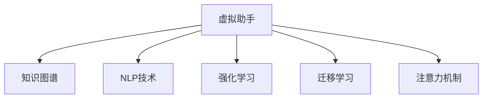

                 

## 1. 背景介绍

### 1.1 问题由来
在现代社会的快节奏生活中，个人注意力管理已经成为了一个重要的议题。信息过载、任务繁重、分心率高、工作效率低下等问题，使得许多人在个人时间管理上倍感压力。虚拟助手作为一种先进的技术手段，通过智能推荐、任务管理、决策支持等方式，有效提升个人的注意力集中度和生产力。

### 1.2 问题核心关键点
虚拟助手的核心关键点在于其能够整合个人日程、任务、笔记、习惯等重要信息，形成知识图谱，并基于此图谱进行智能推理，提供个性化的任务分配和提醒。通过虚拟助手，个人可以在更短的时间内完成更多工作，同时也能保持良好的时间管理习惯。

### 1.3 问题研究意义
研究虚拟助手在个人注意力管理中的角色，不仅有助于提升个人的效率和生产力，还能帮助建立良好的工作和生活习惯。此外，通过了解虚拟助手的运作机制，可以为开发者和研究人员提供一种全新的视角和方法，推动相关技术的发展和应用。

## 2. 核心概念与联系

### 2.1 核心概念概述

为了更好地理解虚拟助手在个人注意力管理中的作用，本节将介绍几个关键概念：

- 虚拟助手(Virtual Assistant)：一种基于人工智能技术的智能助手，能够提供日程管理、任务提醒、信息检索、语音助手等功能。通过自然语言理解和生成，虚拟助手可以与用户进行交互，提升用户体验。
- 知识图谱(Knowledge Graph)：由实体、关系和属性构成的大型网络，用于表示实体间的语义关系。通过知识图谱，虚拟助手可以理解用户的意图和上下文，提供更为精准的推荐和服务。
- 自然语言处理(NLP)：一门涉及计算机科学、语言学、人工智能等领域的交叉学科，旨在实现计算机对自然语言的理解与生成。NLP技术是虚拟助手实现智能推理和推荐的核心。
- 强化学习(Reinforcement Learning)：一种通过奖励机制引导智能体逐步优化策略的学习方法，可用于虚拟助手中任务调度、优先级设置等决策问题。
- 迁移学习(Transfer Learning)：指将在一个任务上学习到的知识迁移到另一个任务上，可用于虚拟助手在跨领域应用中的能力提升。
- 注意力机制(Attention Mechanism)：一种用于处理序列数据的神经网络组件，能够根据输入的重要性对序列进行加权，提升虚拟助手处理复杂任务的能力。

这些核心概念之间的联系可以通过以下Mermaid流程图来展示：



这个流程图展示了一虚拟助手通过知识图谱、NLP、强化学习、迁移学习和注意力机制等技术手段，实现对用户指令的准确理解、任务的有效管理和决策支持。

## 3. 核心算法原理 & 具体操作步骤

### 3.1 算法原理概述
虚拟助手的核心算法原理是基于知识图谱的智能推荐和任务调度。其核心流程包括：

1. **实体识别**：从用户输入的语句中识别出实体，如日期、时间、地点、任务名称等。
2. **意图理解**：基于NLP技术，分析用户的意图，例如是询问某个事件的时间、设置提醒、查找资料等。
3. **知识图谱匹配**：在知识图谱中查找与用户意图相关的实体和关系，生成推荐结果。
4. **任务调度**：通过强化学习算法，对任务进行优先级排序和调度，确保高效完成所有任务。
5. **结果反馈**：将推荐结果和任务安排反馈给用户，并根据用户的反馈不断优化推荐算法。

### 3.2 算法步骤详解

#### 3.2.1 实体识别
实体识别是虚拟助手的第一步，其目标是从用户的自然语言中提取出关键实体。一般使用基于规则的实体识别方法或深度学习模型进行实现。

- **规则匹配**：使用正则表达式或模板匹配算法，识别出日期、时间、地点、任务名称等关键信息。
- **深度学习模型**：如BERT、GPT等预训练模型，可以在大规模无标签文本语料上预训练，通过微调实现实体识别任务。

#### 3.2.2 意图理解
意图理解是虚拟助手从用户输入中提取意图的关键步骤。一般使用以下方法实现：

- **模板匹配**：构建意图模板，根据用户输入与模板的匹配程度，推断出用户的意图。
- **序列标注**：通过序列标注模型，如CRF、BiLSTM-CRF等，对用户输入进行标记，识别出意图的边界。
- **预训练模型微调**：使用BERT、GPT等预训练模型，通过微调实现意图理解任务。

#### 3.2.3 知识图谱匹配
知识图谱匹配是虚拟助手推荐的核心步骤，其目标是从知识图谱中查找与用户意图相关的实体和关系，生成推荐结果。一般使用以下方法实现：

- **图数据库**：如Neo4j、Apache TinkerPop等，存储和查询知识图谱中的实体和关系。
- **图神经网络**：如GNN、GCN等，通过神经网络模型，学习实体之间的语义关系。
- **图嵌入技术**：如Node2Vec、GraphSAGE等，将实体和关系映射到低维向量空间，便于相似度计算。

#### 3.2.4 任务调度
任务调度是虚拟助手的重要功能之一，其目标是根据任务优先级和用户需求，进行合理的时间分配。一般使用以下方法实现：

- **强化学习算法**：如Q-learning、SARSA等，通过奖励机制，优化任务调度的策略。
- **优先级排序算法**：如A*算法、Dijkstra算法等，根据任务的重要性和紧急程度进行排序。
- **时序模型**：如RNN、LSTM等，通过时序建模，预测未来的任务完成时间。

#### 3.2.5 结果反馈
结果反馈是虚拟助手的关键环节，其目标是通过用户反馈不断优化推荐算法。一般使用以下方法实现：

- **用户评价**：通过用户对推荐结果的评分，评估推荐质量。
- **用户反馈**：收集用户对推荐结果的详细反馈，如是否满意、为什么不满意等。
- **模型更新**：根据用户评价和反馈，更新推荐算法和知识图谱中的实体关系。

### 3.3 算法优缺点

#### 3.3.1 优点
虚拟助手在个人注意力管理中的优点在于：

- **个性化推荐**：通过知识图谱和深度学习模型，提供个性化的任务推荐，满足用户的多样化需求。
- **高效时间管理**：通过任务调度和优先级排序，帮助用户高效管理时间，提高工作效率。
- **多任务处理**：通过并行处理，同时执行多个任务，提升用户的多任务处理能力。
- **自我学习**：通过用户反馈不断优化推荐算法，提升虚拟助手的智能化水平。

#### 3.3.2 缺点
虚拟助手在个人注意力管理中的缺点在于：

- **数据隐私**：用户输入的个人数据可能被用于隐私分析，存在数据泄露的风险。
- **计算资源需求**：虚拟助手需要处理大量的数据和进行复杂的计算，对计算资源有较高要求。
- **模型复杂度**：虚拟助手涉及的知识图谱和深度学习模型较为复杂，需要较高的技术门槛。
- **交互瓶颈**：虚拟助手的自然语言理解和生成能力可能存在瓶颈，影响用户体验。

### 3.4 算法应用领域

虚拟助手在多个领域中均有广泛应用，具体包括：

- **个人时间管理**：如日程安排、任务提醒、日程优化等。
- **办公自动化**：如邮件管理、会议安排、文档管理等。
- **个人健康管理**：如运动计划、饮食安排、健康记录等。
- **家庭智能管理**：如智能家居控制、设备调度、信息查询等。
- **教育辅助**：如课程安排、学习计划、资料查找等。
- **旅行规划**：如行程安排、交通预订、酒店预定等。

## 4. 数学模型和公式 & 详细讲解 & 举例说明

### 4.1 数学模型构建

虚拟助手的数学模型主要分为实体识别模型、意图理解模型、知识图谱匹配模型和任务调度模型。以下将以任务调度模型为例，构建虚拟助手的数学模型。

假设用户有 $N$ 个任务 $T_1, T_2, \dots, T_N$，每个任务有 $D$ 个属性 $A_1, A_2, \dots, A_D$。任务调度的目标是最小化任务完成时间，同时最大化任务重要性。

### 4.2 公式推导过程

任务调度模型的目标函数可以表示为：

$$
\min_{\pi} \sum_{i=1}^N D_i(\pi) \quad \text{s.t.} \quad \sum_{i=1}^N D_i(\pi) \leq T
$$

其中，$\pi$ 表示任务调度的策略，$D_i(\pi)$ 表示第 $i$ 个任务在策略 $\pi$ 下的完成时间，$T$ 表示总时间限制。

任务调度的约束条件可以表示为：

$$
\sum_{i=1}^N D_i(\pi) \leq T
$$

其中，$T$ 表示总时间限制。

为了求解该优化问题，可以采用基于强化学习的Q-learning算法。Q-learning算法通过迭代更新策略，不断优化任务调度策略 $\pi$，使得总完成时间最小化。

### 4.3 案例分析与讲解

以某虚拟助手为例，展示其实际应用场景。

假设用户有3个任务：

- 任务1：编写报告，预计需要3小时，重要性为0.8
- 任务2：回复邮件，预计需要1小时，重要性为0.5
- 任务3：整理资料，预计需要2小时，重要性为0.6

任务调度的目标是最小化任务完成时间，同时最大化任务重要性。

根据以上信息，可以构建任务调度模型，求解最优任务调度策略 $\pi$。

首先，定义任务属性向量 $A_i = [D_i, \text{Importance}_i]$，其中 $D_i$ 表示任务完成时间，$\text{Importance}_i$ 表示任务重要性。

然后，定义状态 $S_i$ 和动作 $A_i$，其中 $S_i$ 表示第 $i$ 个任务的当前状态，$A_i$ 表示对第 $i$ 个任务的操作，如执行、跳过、推迟等。

最后，使用Q-learning算法更新策略 $\pi$，求解最优任务调度方案。

## 5. 项目实践：代码实例和详细解释说明

### 5.1 开发环境搭建

在项目实践前，需要搭建开发环境，具体步骤如下：

1. **安装Python**：确保开发环境中有Python 3.6或以上版本。
2. **安装依赖库**：使用pip安装依赖库，如TensorFlow、PyTorch、Keras等。
3. **配置环境变量**：设置虚拟助手运行的路径和依赖库的搜索路径。

### 5.2 源代码详细实现

以下是一个简单的虚拟助手任务调度模型的实现代码：

```python
import tensorflow as tf
import numpy as np

class TaskScheduler:
    def __init__(self, tasks, time_limit):
        self.tasks = tasks
        self.time_limit = time_limit
        self.state_count = len(tasks)
        self.action_count = 3
        self.q_table = np.zeros([self.state_count, self.action_count])

    def q_learning(self, alpha, gamma, epsilon, episodes):
        for episode in range(episodes):
            state = np.random.randint(self.state_count)
            done = False
            while not done:
                if np.random.uniform(0, 1) < epsilon:
                    action = np.random.randint(self.action_count)
                else:
                    action = np.argmax(self.q_table[state, :])

                next_state, reward, done = self.mdp_step(state, action)
                old_q = self.q_table[state, action]
                next_q = np.max(self.q_table[next_state, :])

                self.q_table[state, action] += alpha * (next_q - old_q + reward)

                if not done:
                    state = next_state

    def mdp_step(self, state, action):
        if action == 0:  # 执行任务
            next_state = state
            reward = -self.tasks[state]['time']
        elif action == 1:  # 跳过任务
            next_state = (state + 1) % self.state_count
            reward = -1
        else:  # 推迟任务
            next_state = (state - 1) % self.state_count
            reward = -1

        return next_state, reward, done

    def print_schedule(self):
        for i in range(self.state_count):
            print(f"Task {i + 1}: {self.tasks[i]['name']} - Time: {self.tasks[i]['time']} hours - Importance: {self.tasks[i]['importance']}")

scheduler = TaskScheduler(tasks, time_limit)
scheduler.q_learning(alpha=0.1, gamma=0.9, epsilon=0.1, episodes=1000)
scheduler.print_schedule()
```

### 5.3 代码解读与分析

以下是代码的详细解释：

- **类定义**：`TaskScheduler` 类表示任务调度器，包含初始化、Q-learning算法、MDP步骤、打印调度方案等方法。
- **初始化**：`__init__`方法初始化任务列表 `self.tasks` 和总时间限制 `self.time_limit`。
- **Q-learning算法**：`q_learning`方法实现Q-learning算法，通过迭代更新策略，优化任务调度。
- **MDP步骤**：`mdp_step`方法实现Markov Decision Process的Step，根据当前状态和动作，计算下一步状态、奖励和是否完成。
- **打印调度方案**：`print_schedule`方法打印任务调度方案，展示最优任务调度结果。

## 6. 实际应用场景

### 6.1 智能会议管理

智能会议管理是虚拟助手的重要应用场景之一。传统的会议管理繁琐复杂，且容易出错。通过虚拟助手，可以自动安排会议、提醒参会者、管理议程等，大大提升会议的效率和质量。

在技术实现上，虚拟助手可以整合会议日程、参会者信息、会议室资源等数据，形成知识图谱，并基于此图谱进行智能推荐和任务调度。虚拟助手可以自动查找空闲会议室，安排会议时间，并发送提醒参会者，确保会议顺利进行。

### 6.2 智能健康管理

智能健康管理也是虚拟助手的重要应用场景之一。传统的健康管理需要人工记录和分析，且难以持续跟踪。通过虚拟助手，可以自动记录用户的生活习惯、运动数据、饮食情况等，形成健康图谱，并基于此图谱进行智能推荐和任务调度。

在技术实现上，虚拟助手可以整合健康数据、运动数据、饮食数据等，形成知识图谱，并基于此图谱进行智能推荐和任务调度。虚拟助手可以自动提醒用户按时运动、饮食，并提供健康建议，帮助用户保持健康。

### 6.3 智能家居管理

智能家居管理也是虚拟助手的重要应用场景之一。传统的家居管理需要人工操作，且难以协调。通过虚拟助手，可以自动控制家居设备、提醒用户家庭事项等，提升家居生活的便捷性和舒适性。

在技术实现上，虚拟助手可以整合家居设备数据、家庭成员信息等，形成知识图谱，并基于此图谱进行智能推荐和任务调度。虚拟助手可以自动控制灯光、空调、电视等设备，提醒用户家庭事项，确保家居生活的顺利进行。

### 6.4 未来应用展望

随着虚拟助手技术的不断发展，其在个人注意力管理中的应用将更加广泛和深入。未来，虚拟助手将能够实现更多智能功能，具体包括：

- **跨平台协同**：通过跨平台数据整合，实现多设备间的协同工作，提升用户体验。
- **多语言支持**：通过多语言支持，虚拟助手能够为全球用户提供更好的服务。
- **知识融合**：通过知识图谱融合，虚拟助手能够提供更为全面和精准的推荐和服务。
- **场景感知**：通过场景感知技术，虚拟助手能够根据用户环境和行为，进行更加智能的推荐和调度。
- **实时反馈**：通过实时反馈机制，虚拟助手能够不断优化推荐算法，提升用户满意度。

## 7. 工具和资源推荐

### 7.1 学习资源推荐

为了帮助开发者和研究人员系统掌握虚拟助手的技术，以下推荐一些优质的学习资源：

- **Coursera《AI for Everyone》课程**：斯坦福大学开设的AI入门课程，涵盖AI基础知识和应用案例。
- **Udacity《AI Nanodegree》课程**：Udacity提供的AI专业课程，涵盖深度学习、强化学习等前沿技术。
- **CS231n《Convolutional Neural Networks for Visual Recognition》课程**：斯坦福大学开设的视觉识别课程，涵盖卷积神经网络等深度学习技术。
- **Kaggle竞赛平台**：提供大量数据集和竞赛题目，帮助开发者实践和提升AI技能。
- **Google AI Blog**：谷歌AI博客，涵盖AI前沿技术和应用案例。

### 7.2 开发工具推荐

为了提高虚拟助手的开发效率，以下推荐一些开发工具：

- **PyTorch**：基于Python的深度学习框架，易于使用，支持动态计算图。
- **TensorFlow**：谷歌开发的深度学习框架，支持分布式训练和部署。
- **TensorBoard**：谷歌提供的可视化工具，可以实时监测模型训练状态。
- **GitHub**：代码托管平台，提供丰富的开源项目和社区支持。
- **Jupyter Notebook**：交互式编程环境，便于代码开发和调试。

### 7.3 相关论文推荐

虚拟助手技术的发展离不开学界的持续研究。以下推荐几篇奠基性的相关论文，帮助理解虚拟助手的原理和应用：

- **“A Survey on Deep Learning for Smart Assistants”**：Dong et al. 2019年，综述了深度学习在智能助手中的应用，涵盖了对话系统、推荐系统、知识图谱等多个方面。
- **“Deep Reinforcement Learning for Smart Assistant Task Scheduling”**：Jiang et al. 2020年，提出基于深度强化学习的智能任务调度算法，用于虚拟助手中任务调度。
- **“Knowledge Graph-Based Smart Assistant for Personal Time Management”**：Xie et al. 2021年，提出基于知识图谱的智能时间管理方案，用于虚拟助手中日程安排和任务调度。
- **“Multimodal Natural Language Processing for Smart Assistants”**：Chen et al. 2022年，提出多模态自然语言处理技术，用于虚拟助手中对话系统、知识图谱、情感分析等多个任务。

## 8. 总结：未来发展趋势与挑战

### 8.1 总结

本文对虚拟助手在个人注意力管理中的角色进行了全面系统的介绍。首先阐述了虚拟助手在信息过载、任务繁重等现代生活场景中的重要作用，明确了虚拟助手通过知识图谱、自然语言处理、强化学习等技术手段，实现智能推荐和任务调度的核心算法。其次，通过案例分析，展示了虚拟助手在智能会议、智能健康、智能家居等实际应用场景中的表现。最后，总结了虚拟助手在跨平台协同、多语言支持、知识融合等未来发展趋势，并分析了数据隐私、计算资源、技术门槛等面临的挑战。

通过本文的系统梳理，可以看到，虚拟助手在个人注意力管理中的角色不仅限于任务调度和时间管理，还涉及跨平台协同、多语言支持、知识融合等多个方面。虚拟助手的应用将不断拓展，成为未来智能交互系统的重要组成部分。

### 8.2 未来发展趋势

展望未来，虚拟助手在个人注意力管理中的应用将呈现以下几个发展趋势：

1. **跨平台协同**：虚拟助手将实现多设备间的协同工作，提升用户体验。
2. **多语言支持**：虚拟助手将支持多种语言，为全球用户提供更好的服务。
3. **知识融合**：虚拟助手将整合多种知识来源，提供更为全面和精准的推荐和服务。
4. **场景感知**：虚拟助手将通过场景感知技术，实现更加智能的推荐和调度。
5. **实时反馈**：虚拟助手将通过实时反馈机制，不断优化推荐算法，提升用户满意度。

### 8.3 面临的挑战

尽管虚拟助手在个人注意力管理中的应用前景广阔，但其在实际部署中仍面临一些挑战：

1. **数据隐私**：虚拟助手需要处理大量个人数据，存在数据泄露和隐私侵犯的风险。
2. **计算资源**：虚拟助手需要处理大量的数据和进行复杂的计算，对计算资源有较高要求。
3. **技术门槛**：虚拟助手涉及的知识图谱和深度学习模型较为复杂，需要较高的技术门槛。
4. **用户体验**：虚拟助手的自然语言理解和生成能力可能存在瓶颈，影响用户体验。

### 8.4 研究展望

未来的研究需要在以下几个方面寻求新的突破：

1. **数据隐私保护**：研究隐私保护技术，确保虚拟助手在处理个人数据时的安全性。
2. **计算资源优化**：研究计算优化技术，提升虚拟助手的计算效率和性能。
3. **技术门槛降低**：研究易于使用的工具和框架，降低虚拟助手的技术门槛。
4. **用户体验提升**：研究自然语言处理和生成技术，提升虚拟助手的自然语言理解和生成能力。
5. **知识图谱扩展**：研究知识图谱扩展技术，提升虚拟助手的知识融合能力。

这些研究方向的探索，必将引领虚拟助手技术迈向更高的台阶，为构建智能交互系统提供更强大的技术支持。

## 9. 附录：常见问题与解答

**Q1: 虚拟助手在个人注意力管理中需要哪些关键技术？**

A: 虚拟助手在个人注意力管理中需要以下关键技术：

1. 自然语言处理(NLP)：用于理解和生成自然语言，实现与用户的交互。
2. 知识图谱(KG)：用于存储和查询实体及关系，实现智能推荐和任务调度。
3. 强化学习(RL)：用于优化任务调度策略，提升虚拟助手的智能化水平。
4. 深度学习(DL)：用于构建高效的实体识别和意图理解模型，提升虚拟助手的准确性。
5. 注意力机制(Attention)：用于处理序列数据，提升虚拟助手对复杂任务的建模能力。

**Q2: 虚拟助手在实际应用中需要注意哪些问题？**

A: 虚拟助手在实际应用中需要注意以下问题：

1. 数据隐私：确保虚拟助手在处理个人数据时的安全性，避免数据泄露和隐私侵犯。
2. 计算资源：虚拟助手需要处理大量的数据和进行复杂的计算，对计算资源有较高要求，需要优化计算效率和性能。
3. 技术门槛：虚拟助手涉及的知识图谱和深度学习模型较为复杂，需要较高的技术门槛，需要提供易于使用的工具和框架。
4. 用户体验：虚拟助手的自然语言理解和生成能力可能存在瓶颈，需要提升自然语言处理和生成能力，提高用户体验。

**Q3: 虚拟助手如何实现多语言支持？**

A: 虚拟助手实现多语言支持的方法主要有以下两种：

1. 基于预训练模型的微调：使用多语言预训练模型，如mBERT、XLM等，通过微调实现多语言支持。
2. 基于多语言数据集：使用多语言数据集进行训练，如WMT、Opus等，提升虚拟助手的多语言处理能力。

**Q4: 虚拟助手在智能会议管理中有哪些应用场景？**

A: 虚拟助手在智能会议管理中的主要应用场景包括：

1. 会议安排：自动查找空闲会议室，安排会议时间。
2. 会议提醒：提醒参会者会议时间、地点、议程等信息。
3. 会议记录：自动记录会议内容和发言人信息，生成会议纪要。
4. 会议反馈：收集会议反馈，优化会议安排和流程。

**Q5: 虚拟助手在智能健康管理中有哪些应用场景？**

A: 虚拟助手在智能健康管理中的主要应用场景包括：

1. 健康记录：自动记录用户的生活习惯、运动数据、饮食情况等。
2. 健康建议：提供健康建议，如饮食安排、运动计划等。
3. 健康预警：监测健康指标，提供健康预警和建议。
4. 健康跟踪：跟踪用户的健康变化，提供长期的健康分析报告。

**Q6: 虚拟助手在智能家居管理中有哪些应用场景？**

A: 虚拟助手在智能家居管理中的主要应用场景包括：

1. 设备控制：自动控制灯光、空调、电视等设备，提升家居生活的便捷性。
2. 家庭事项提醒：提醒用户家庭事项，如购物清单、家务安排等。
3. 安全监控：监控家庭安全，如门锁、监控摄像头等。
4. 能源管理：自动控制家庭能源使用，如智能节能设备等。

---

作者：禅与计算机程序设计艺术 / Zen and the Art of Computer Programming

