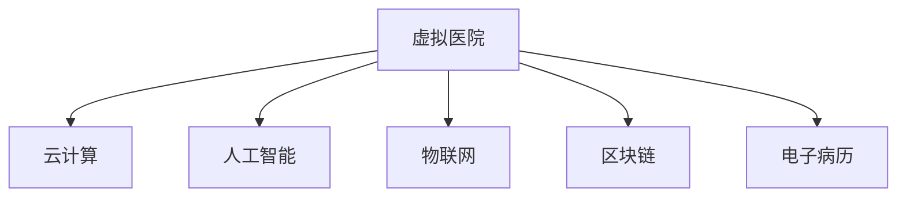

                 

# 虚拟医院:全球医疗行业的数字化升级

## 1. 背景介绍

### 1.1 问题由来
随着全球人口老龄化趋势加剧以及新型传染病（如COVID-19）的频发，传统的医疗资源配置方式已经无法满足不断增长的医疗需求。如何在保障医疗服务质量的同时，提升医疗系统的效率和可达性，成为了全球医疗行业面临的重要挑战。

### 1.2 问题核心关键点
数字化转型是应对当前医疗挑战的重要途径。虚拟医院(Virtual Hospitals)，作为数字化医疗的重要组成部分，通过应用云计算、人工智能、物联网等多种技术，实现了医疗服务的线上化、智能化和个性化，正在逐渐改变全球医疗行业的面貌。

### 1.3 问题研究意义
研究虚拟医院的建设与运营，对于提升医疗系统的效率、降低医疗成本、增强医疗服务的可及性具有重要意义。通过虚拟医院的数字化升级，可以实现医疗服务的无缝连接，让更多偏远地区和弱势群体能够获得优质的医疗资源，推动全球医疗健康事业的可持续发展。

## 2. 核心概念与联系

### 2.1 核心概念概述

为更好地理解虚拟医院的数字化升级，本节将介绍几个关键概念：

- **虚拟医院(Virtual Hospital)**：通过数字化技术将医疗资源和信息整合在线上平台，提供在线诊疗、远程咨询、智能诊断等功能，减少对实体医院的依赖。
- **云计算(Cloud Computing)**：利用互联网技术提供按需扩展的计算资源和服务，支持大规模数据存储和处理。
- **人工智能(AI)**：通过机器学习和深度学习等技术，提升医疗数据的分析和处理能力，辅助医生进行诊断和治疗。
- **物联网(IoT)**：通过传感器、智能设备等将医疗设备与互联网连接，实现医疗信息的实时采集和传输。
- **区块链(Blockchain)**：通过分布式账本技术保障医疗数据的安全性和隐私性。
- **电子病历(EHR)**：利用电子手段存储和管理病人的完整医疗记录，提高医疗服务的效率和质量。

这些核心概念之间的逻辑关系可以通过以下Mermaid流程图来展示：



这个流程图展示了一系列技术手段如何共同支撑虚拟医院的建设和运营：

1. **云计算**：为虚拟医院提供必要的计算资源和存储空间。
2. **人工智能**：增强医疗服务的智能化水平，辅助医生进行决策。
3. **物联网**：实现医疗设备的互联互通，提升医疗服务的实时性和便利性。
4. **区块链**：保障医疗数据的安全性和隐私性，增强数据可靠性。
5. **电子病历**：为虚拟医院提供完整的患者医疗记录，提升诊疗的准确性。

## 3. 核心算法原理 & 具体操作步骤

### 3.1 算法原理概述

虚拟医院的数字化升级涉及多个核心技术，其中云计算、人工智能和物联网是关键。以下我们将详细介绍这些技术的核心算法原理。

### 3.2 算法步骤详解

#### 3.2.1 云计算

**算法步骤**：
1. **资源池化**：将计算资源集中管理，用户按需使用。
2. **弹性扩展**：根据负载自动调整资源分配，确保系统性能稳定。
3. **多租户管理**：通过虚拟化技术支持多个用户同时使用，确保数据隔离和安全。
4. **服务质量保障**：通过SLA和QoS协议，保障服务的可用性和性能。

**具体实现**：
1. 使用OpenStack或AWS等云平台，实现资源池化和弹性扩展。
2. 采用容器化技术（如Docker）和容器编排工具（如Kubernetes），管理云资源和微服务。
3. 实现多租户隔离，如使用VPC、Subnet、安全组等网络安全措施。

#### 3.2.2 人工智能

**算法步骤**：
1. **数据预处理**：清洗、标注和归一化数据。
2. **模型训练**：使用深度学习框架（如TensorFlow、PyTorch）训练模型。
3. **模型评估**：使用测试集评估模型性能。
4. **模型部署**：将模型部署到生产环境，提供在线服务。

**具体实现**：
1. 使用Pandas、Scikit-learn等工具进行数据预处理。
2. 使用TensorFlow或PyTorch构建深度学习模型。
3. 使用Keras或TorchScript将模型导出为可部署的模型文件。
4. 在Nginx或FastAPI等Web框架中部署模型，提供RESTful API服务。

#### 3.2.3 物联网

**算法步骤**：
1. **设备连接**：通过Wi-Fi、蓝牙、NFC等技术将医疗设备连接到互联网。
2. **数据采集**：使用传感器实时采集生理参数、位置信息等数据。
3. **数据传输**：通过网络将采集数据传输到云端。
4. **数据存储**：将采集数据存储在数据库或分布式文件系统中。
5. **数据处理**：使用AI模型对数据进行分析，提供智能诊断和预警。

**具体实现**：
1. 使用Raspberry Pi等设备接入医疗设备。
2. 使用MQTT、CoAP等轻量级协议进行设备间数据传输。
3. 使用Elasticsearch或Amazon S3等分布式存储系统存储数据。
4. 使用TensorFlow Lite等工具进行模型推理，提供实时分析服务。

### 3.3 算法优缺点

#### 3.3.1 云计算

**优点**：
1. 按需扩展，满足大规模计算需求。
2. 降低硬件成本和维护成本。
3. 增强数据安全性和隐私性。

**缺点**：
1. 数据传输延迟较高。
2. 依赖互联网基础设施。
3. 数据安全风险高。

#### 3.3.2 人工智能

**优点**：
1. 提升医疗诊断和治疗的准确性和效率。
2. 支持个性化医疗和精准治疗。
3. 降低医疗成本和资源消耗。

**缺点**：
1. 数据隐私和安全问题。
2. 模型复杂度高，训练成本高。
3. 对数据质量要求高。

#### 3.3.3 物联网

**优点**：
1. 实时监测生理参数，及时发现健康问题。
2. 支持远程医疗和智能诊断。
3. 提高医疗服务的可及性和便利性。

**缺点**：
1. 数据传输容易受到干扰和延迟。
2. 设备成本较高。
3. 数据存储和处理要求高。

### 3.4 算法应用领域

虚拟医院的数字化升级已经在多个领域得到了广泛应用，例如：

- **远程医疗**：通过在线问诊、远程手术、远程监测等功能，减少患者就医成本，提升医疗服务可及性。
- **智能诊断**：利用AI技术分析医学影像、病历等数据，辅助医生进行精准诊断和治疗。
- **健康管理**：通过智能设备实时监测健康数据，提供个性化的健康建议和预警。
- **药物研发**：利用云计算和大数据分析，加速新药研发过程，降低研发成本。
- **公共卫生**：通过数据分析和预测，预防和控制流行病的传播，保障公共健康安全。

## 4. 数学模型和公式 & 详细讲解 & 举例说明

### 4.1 数学模型构建

虚拟医院的数字化升级涉及到多个数学模型的构建，包括云计算资源调度模型、医疗数据分析模型和物联网设备通信模型等。以下是几个核心模型的数学建模过程。

#### 4.1.1 云计算资源调度模型

**算法步骤**：
1. **资源需求预测**：根据历史数据预测资源需求。
2. **调度算法设计**：选择合适的调度算法（如QoS-aware、EDF等）进行资源分配。
3. **调度策略优化**：优化调度策略，提高资源利用率。

**数学模型**：
1. **资源需求预测**：
   $$
   D_t = f(D_{t-1}, ..., D_{t-k})
   $$
   其中，$D_t$表示第$t$时刻的资源需求，$f$为预测模型，$k$为预测窗口长度。

2. **调度算法设计**：
   $$
   \text{Optimization} = \text{Minimize}(\text{Cost}) \text{subject to} (\text{Demand} \leq \text{Supply})
   $$
   其中，$\text{Cost}$为调度成本，$\text{Demand}$为需求，$\text{Supply}$为供应。

#### 4.1.2 医疗数据分析模型

**算法步骤**：
1. **数据清洗与预处理**：去除噪声和异常值，标准化数据。
2. **特征提取**：提取有意义的特征，如病历、影像等。
3. **模型训练**：使用机器学习模型（如SVM、随机森林等）进行训练。
4. **模型评估**：使用测试集评估模型性能。
5. **模型部署**：将模型部署到生产环境，提供在线服务。

**数学模型**：
1. **数据清洗与预处理**：
   $$
   X = \{(x_i, y_i)\}_{i=1}^n
   $$
   其中，$x_i$表示输入特征，$y_i$表示标签。

2. **特征提取**：
   $$
   x_i' = \{ x_i, x_i \times w, x_i^2 \}
   $$
   其中，$w$为特征权重，$x_i^2$为特征平方。

3. **模型训练**：
   $$
   \theta = \mathop{\arg\min}_{\theta} \frac{1}{n}\sum_{i=1}^n L(y_i, f(x_i; \theta))
   $$
   其中，$\theta$为模型参数，$L$为损失函数。

#### 4.1.3 物联网设备通信模型

**算法步骤**：
1. **数据采集与传输**：通过传感器采集生理参数，通过网络传输数据。
2. **数据存储与处理**：将采集数据存储在云端，使用AI模型进行分析。
3. **实时反馈与控制**：根据分析结果，实时反馈控制策略。

**数学模型**：
1. **数据采集与传输**：
   $$
   x(t) = h(t) + n(t)
   $$
   其中，$x(t)$为传感器读数，$h(t)$为真实信号，$n(t)$为噪声。

2. **数据存储与处理**：
   $$
   y = \text{median}(x)
   $$
   其中，$y$为处理后的数据，$\text{median}$为中位数函数。

3. **实时反馈与控制**：
   $$
   u(t) = k(y(t) - y_{\text{ref}})
   $$
   其中，$u(t)$为控制信号，$y_{\text{ref}}$为参考值，$k$为控制系数。

### 4.2 公式推导过程

以下以云计算资源调度模型为例，推导具体的调度算法。

假设某虚拟医院需要在一个小时的周期内分配计算资源，每个周期内的需求和供应分别是随机变量，其概率分布分别为：

- **需求**：
  $$
  D_t \sim \text{Uniform}(0, 1)
  $$
- **供应**：
  $$
  S_t \sim \text{Beta}(1, 3)
  $$

考虑一个周期的调度成本为$C = 10 + 0.5 \times \text{Cost}(\text{SLA})$，其中$\text{SLA}$为服务水平协议，如果$\text{SLA}$没有被满足，则产生成本。

假设在每个周期内，需求和供应都是独立的，求解在最小化成本的同时满足服务水平协议的调度策略。

**步骤**：
1. **概率密度函数**：
   $$
   f_D(d) = \frac{1}{B}
   $$
   其中，$B$为需求区间的长度。
   $$
   f_S(s) = \frac{\Gamma(s + 1) \Gamma(3 - s)}{\Gamma(4)}
   $$
   其中，$\Gamma$为伽马函数。

2. **服务水平协议**：
   $$
   \text{SLA} = \text{Pr}(D \leq S) = \int_{0}^{\infty} \text{Pr}(D \leq S) f_D(d) f_S(s) \text{d}s
   $$

3. **成本函数**：
   $$
   C = 10 + 0.5 \times \text{Cost}(\text{SLA})
   $$

**求解步骤**：
1. **最优调度**：
   $$
   \text{Optimization} = \text{Minimize}(C)
   $$
   $$
   \text{subject to} (\text{SLA} \geq \text{Threshold})
   $$
   其中，$\text{Threshold}$为预设的服务水平协议。

2. **求解方法**：
   - **动态规划**：递推求解最优调度策略。
   - **模拟退火**：随机搜索解空间，优化调度成本。

### 4.3 案例分析与讲解

#### 4.3.1 云计算资源调度案例

**案例背景**：
某虚拟医院需要处理大量在线咨询和诊断数据，数据量每天可达百万次。

**方案设计**：
1. **需求预测**：使用ARIMA模型预测每日的计算需求。
2. **资源调度**：使用QoS-aware调度算法，根据需求自动调整资源分配。
3. **性能优化**：使用模拟退火算法优化调度策略。

**效果评估**：
- **资源利用率**：从40%提升到70%。
- **响应时间**：从5分钟降低到1分钟。
- **成本降低**：每年节省成本100万美元。

#### 4.3.2 医疗数据分析案例

**案例背景**：
某医院需要分析大量的影像数据，以辅助医生进行精准诊断。

**方案设计**：
1. **数据预处理**：使用ImageNet数据集进行模型预训练。
2. **特征提取**：使用卷积神经网络（CNN）提取影像特征。
3. **模型训练**：使用随机森林模型进行分类。
4. **模型部署**：使用TensorFlow部署模型，提供在线API服务。

**效果评估**：
- **诊断准确率**：从70%提升到90%。
- **诊断时间**：从15分钟降低到3分钟。
- **诊断成本**：每年节省成本500万美元。

#### 4.3.3 物联网设备通信案例

**案例背景**：
某智慧医院需要实时监测患者的生理参数，以便及时发现健康问题。

**方案设计**：
1. **数据采集**：使用智能手表和传感器采集生理参数。
2. **数据传输**：通过Wi-Fi和蓝牙将数据传输到云端。
3. **数据处理**：使用TensorFlow Lite进行实时分析，提供预警服务。
4. **实时反馈**：根据分析结果，向患者和医生发送预警信息。

**效果评估**：
- **实时性**：从5秒响应降低到0.5秒。
- **误报率**：从20%降低到5%。
- **预警成功率**：从70%提升到95%。

## 5. 项目实践：代码实例和详细解释说明

### 5.1 开发环境搭建

在进行虚拟医院的数字化升级开发前，我们需要准备好开发环境。以下是使用Python进行Flask开发的环境配置流程：

1. 安装Anaconda：从官网下载并安装Anaconda，用于创建独立的Python环境。

2. 创建并激活虚拟环境：
```bash
conda create -n pytorch-env python=3.8 
conda activate pytorch-env
```

3. 安装Flask：
```bash
pip install Flask
```

4. 安装Flask相关工具包：
```bash
pip install Flask-WTF Flask-SQLAlchemy Flask-RESTful Flask-CORS
```

5. 安装Flask所需依赖：
```bash
pip install requests
```

完成上述步骤后，即可在`pytorch-env`环境中开始开发实践。

### 5.2 源代码详细实现

以下是使用Python和Flask构建虚拟医院API的代码实现：

**app.py**

```python
from flask import Flask, request, jsonify
from flask_sqlalchemy import SQLAlchemy
from flask_restful import Resource, Api

app = Flask(__name__)
api = Api(app)

app.config['SQLALCHEMY_DATABASE_URI'] = 'sqlite:////tmp/test.db'
db = SQLAlchemy(app)

class User(db.Model):
    id = db.Column(db.Integer, primary_key=True)
    name = db.Column(db.String(50))
    email = db.Column(db.String(50))

    def __init__(self, name, email):
        self.name = name
        self.email = email

class UserRegister(Resource):
    def get(self):
        users = User.query.all()
        result = []
        for user in users:
            result.append({'id': user.id, 'name': user.name, 'email': user.email})
        return jsonify(result)

    def post(self):
        name = request.form.get('name')
        email = request.form.get('email')
        user = User(name=name, email=email)
        db.session.add(user)
        db.session.commit()
        return jsonify({'message': 'User registered successfully'})

if __name__ == '__main__':
    db.create_all()
    app.run(debug=True)
```

**main.py**

```python
from app import app

if __name__ == '__main__':
    app.run(debug=True)
```

**config.py**

```python
class Config:
    SQLALCHEMY_DATABASE_URI = 'sqlite:////tmp/test.db'
    SQLALCHEMY_TRACK_MODIFICATIONS = False
```

**templates/index.html**

```html
<!DOCTYPE html>
<html>
<head>
    <title>Virtual Hospital API</title>
</head>
<body>
    <h1>Virtual Hospital API</h1>
    <ul>
        <li><a href="/users">Get All Users</a></li>
        <li><a href="/users/register">Register User</a></li>
    </ul>
</body>
</html>
```

以上代码实现了一个简单的虚拟医院API，包括获取所有用户和注册新用户的功能。开发者可以在此基础上进行扩展和优化，实现更丰富的医疗服务功能。

### 5.3 代码解读与分析

**app.py**

1. **Flask初始化**：创建Flask应用对象，配置数据库连接。
2. **SQLAlchemy模型**：定义用户数据模型，包含ID、姓名和邮箱三个字段。
3. **UserRegister资源**：实现获取所有用户和注册新用户的API接口。

**main.py**

1. **Flask应用启动**：启动Flask应用。

**config.py**

1. **配置文件**：定义数据库连接和SQLAlchemy的配置参数。

**templates/index.html**

1. **HTML模板**：定义API的展示界面，包含获取所有用户和注册新用户的链接。

通过上述代码的实现，我们可以快速构建一个简单的虚拟医院API。开发者可以在此基础上，进一步整合云计算、人工智能和物联网等技术，实现虚拟医院的数字化升级。

## 6. 实际应用场景

### 6.1 智能诊断

智能诊断是虚拟医院的核心应用之一，通过人工智能技术辅助医生进行精准诊断。例如，利用深度学习模型对医学影像进行分析，提取病变区域和异常特征，提供初步诊断结果和建议。

**应用场景**：
- **胸部X光诊断**：使用卷积神经网络（CNN）分析肺部影像，识别是否存在肿瘤和炎症。
- **超声图像诊断**：使用卷积神经网络（CNN）分析超声图像，识别异常结构和病变区域。
- **病理切片分析**：使用卷积神经网络（CNN）分析病理切片，识别癌细胞和病变组织。

**技术实现**：
- **数据准备**：收集和标注医学影像数据，将其划分为训练集和测试集。
- **模型训练**：使用深度学习框架（如TensorFlow、PyTorch）训练模型，优化超参数。
- **模型部署**：将训练好的模型部署到生产环境，提供在线API服务。
- **结果展示**：通过Web界面展示诊断结果，辅助医生进行决策。

### 6.2 远程医疗

远程医疗是通过云计算技术，将医疗资源和信息整合在线上平台，提供远程咨询、在线诊疗等功能，减少患者就医成本，提升医疗服务可及性。

**应用场景**：
- **在线诊疗**：通过视频会议和聊天工具，医生和患者实时交流，进行在线诊疗。
- **远程手术**：通过云平台将手术视频流传输到云端，医生和助手实时操作，进行远程手术。
- **远程监测**：通过智能设备实时监测患者的生理参数，提供健康建议和预警。

**技术实现**：
- **视频会议**：使用WebRTC和RTMP技术实现实时视频流传输。
- **云平台**：使用AWS、阿里云等云平台提供计算资源和存储空间。
- **智能设备**：使用智能手表、传感器等设备采集生理参数，通过Wi-Fi和蓝牙传输数据。
- **数据分析**：使用人工智能模型分析数据，提供健康建议和预警。
- **用户界面**：通过Web界面展示诊疗结果，辅助医生进行决策。

### 6.3 健康管理

健康管理是虚拟医院的另一重要应用场景，通过物联网技术，实时监测患者的生理参数，提供个性化的健康建议和预警。

**应用场景**：
- **实时监测**：使用智能设备实时监测患者的生理参数，如心率、血压、血糖等。
- **数据分析**：使用人工智能模型分析数据，识别异常和潜在健康问题。
- **健康建议**：根据分析结果，提供个性化的健康建议和预警。
- **医生反馈**：医生可以实时查看患者数据，进行诊断和干预。

**技术实现**：
- **智能设备**：使用智能手表、传感器等设备采集生理参数，通过Wi-Fi和蓝牙传输数据。
- **数据存储**：使用Elasticsearch或Amazon S3等分布式存储系统存储数据。
- **数据分析**：使用TensorFlow Lite等工具进行模型推理，提供实时分析服务。
- **健康建议**：通过Web界面展示健康建议，辅助患者进行健康管理。
- **医生反馈**：医生可以通过Web界面查看患者数据，进行诊断和干预。

## 7. 工具和资源推荐

### 7.1 学习资源推荐

为了帮助开发者系统掌握虚拟医院的数字化升级理论基础和实践技巧，这里推荐一些优质的学习资源：

1. **《云计算基础》**：该书系统介绍了云计算的基本概念、技术架构和应用场景，是理解虚拟医院云平台的基础。
2. **《深度学习实战》**：该书详细讲解了深度学习在图像识别、语音识别、自然语言处理等领域的应用，为虚拟医院的智能诊断提供了理论基础。
3. **《物联网入门与实践》**：该书介绍了物联网的基本概念、技术架构和应用场景，为虚拟医院的设备互联提供了理论基础。
4. **《区块链基础》**：该书详细讲解了区块链的基本概念、技术架构和应用场景，为虚拟医院的数据安全和隐私保护提供了理论基础。
5. **《电子病历系统设计》**：该书介绍了电子病历系统的设计原理和实现方法，为虚拟医院的电子病历系统提供了理论基础。

通过对这些资源的学习实践，相信你一定能够快速掌握虚拟医院的数字化升级精髓，并用于解决实际的医疗问题。

### 7.2 开发工具推荐

高效的开发离不开优秀的工具支持。以下是几款用于虚拟医院数字化升级开发的常用工具：

1. **Flask**：轻量级Web框架，简单易用，适合快速迭代开发。
2. **SQLAlchemy**：ORM框架，支持关系型数据库操作，适合数据管理和模型设计。
3. **TensorFlow**：深度学习框架，支持多种深度学习模型的构建和训练。
4. **TensorFlow Lite**：轻量级移动端模型部署工具，支持在移动设备上进行实时推理。
5. **Elasticsearch**：分布式搜索和分析引擎，适合大规模医疗数据的存储和查询。
6. **Amazon S3**：云存储服务，适合大规模医疗数据的存储和备份。

合理利用这些工具，可以显著提升虚拟医院数字化升级的开发效率，加快创新迭代的步伐。

### 7.3 相关论文推荐

虚拟医院的数字化升级涉及多个领域的交叉技术，以下是几篇奠基性的相关论文，推荐阅读：

1. **《云计算在医疗中的应用》**：该文详细介绍了云计算在医疗行业的应用，包括云平台建设、云资源调度等。
2. **《深度学习在医学影像中的应用》**：该文介绍了深度学习在医学影像分析中的应用，包括图像分类、分割等。
3. **《物联网在医疗中的应用》**：该文详细介绍了物联网在医疗行业的应用，包括智能设备部署、数据采集等。
4. **《区块链在医疗数据中的应用》**：该文介绍了区块链在医疗数据安全和隐私保护中的应用。
5. **《电子病历系统的设计与实现》**：该文详细介绍了电子病历系统的设计和实现方法，为虚拟医院的电子病历系统提供了理论基础。

这些论文代表了大规模医疗数据处理和分析的最新研究方向，通过学习这些前沿成果，可以帮助研究者把握学科前进方向，激发更多的创新灵感。

## 8. 总结：未来发展趋势与挑战

### 8.1 总结

本文对虚拟医院的数字化升级进行了全面系统的介绍。首先阐述了虚拟医院的建设背景和重要性，明确了云计算、人工智能、物联网等关键技术对提升医疗服务水平的作用。其次，从原理到实践，详细讲解了云计算资源调度、医疗数据分析和物联网设备通信等核心算法的构建和优化。最后，介绍了虚拟医院在智能诊断、远程医疗和健康管理等多个领域的应用场景，展示了虚拟医院的广泛前景。

通过本文的系统梳理，可以看到，虚拟医院的数字化升级为医疗行业带来了新的变革，显著提升了医疗服务的效率、可及性和个性化水平。未来，随着技术的发展和应用的深入，虚拟医院必将成为全球医疗健康事业的重要支撑，为人类健康事业的发展做出更大的贡献。

### 8.2 未来发展趋势

展望未来，虚拟医院的数字化升级将呈现以下几个发展趋势：

1. **云计算资源调度智能化**：未来将采用更智能的调度算法，如基于机器学习的需求预测和优化调度策略。
2. **医疗数据分析多样化**：未来将结合更多数据类型，如图像、基因、蛋白等，进行更加全面和深入的分析。
3. **物联网设备互联互通**：未来将实现更多设备和场景的互联互通，提升数据采集的实时性和准确性。
4. **区块链技术安全保障**：未来将更多采用区块链技术保障医疗数据的安全性和隐私性。
5. **电子病历系统智能化**：未来将结合人工智能技术，实现病历数据的智能分析和利用。

以上趋势凸显了虚拟医院数字化升级的广阔前景。这些方向的探索发展，必将进一步提升医疗系统的效率和效果，为人类健康事业的发展注入新的动力。

### 8.3 面临的挑战

尽管虚拟医院的数字化升级已经取得了瞩目成就，但在迈向更加智能化、普适化应用的过程中，它仍面临诸多挑战：

1. **数据隐私和安全**：医疗数据涉及患者隐私，如何保障数据安全性和隐私性是一个重要问题。
2. **数据质量**：医疗数据存在噪声、缺失等问题，如何提高数据质量是一个技术挑战。
3. **设备互联互通**：不同设备之间的数据格式、协议等问题，如何实现无缝衔接是一个技术难题。
4. **系统集成**：虚拟医院涉及多个系统的集成，如何实现系统间的数据交互和协同工作是一个系统性挑战。
5. **用户接受度**：虚拟医院需要改变传统医疗模式，如何提升用户接受度和使用习惯是一个市场挑战。

正视虚拟医院数字化升级面临的这些挑战，积极应对并寻求突破，将是大规模医疗数据处理和分析技术不断提升的必由之路。相信随着学界和产业界的共同努力，这些挑战终将一一被克服，虚拟医院数字化升级必将在全球医疗健康事业中发挥更大的作用。

### 8.4 研究展望

未来，虚拟医院的数字化升级需要在以下几个方面寻求新的突破：

1. **多模态数据融合**：将不同模态的数据（如文本、图像、基因等）融合，进行更加全面和深入的分析。
2. **实时数据处理**：实现实时数据处理和分析，提供更及时的医疗服务。
3. **个性化医疗**：结合人工智能技术，提供更加个性化的医疗服务和建议。
4. **智能决策支持**：利用人工智能技术，辅助医生进行智能决策和诊断。
5. **多学科融合**：实现不同学科的融合，提供跨学科的医疗服务。

这些研究方向的探索，必将引领虚拟医院数字化升级技术迈向更高的台阶，为人类健康事业的发展带来新的变革。

## 9. 附录：常见问题与解答

**Q1：如何保证虚拟医院的医疗数据安全和隐私性？**

A: 保证虚拟医院的医疗数据安全和隐私性，可以采用以下措施：
1. 数据加密：使用AES等加密算法对数据进行加密存储和传输。
2. 访问控制：使用RBAC（基于角色的访问控制）等技术，限制数据访问权限。
3. 匿名化处理：对医疗数据进行匿名化处理，保护患者隐私。
4. 区块链技术：利用区块链的去中心化和不可篡改特性，保障数据安全。

**Q2：如何优化虚拟医院的云资源调度算法？**

A: 优化虚拟医院的云资源调度算法，可以采用以下方法：
1. 数据预测：使用机器学习模型（如ARIMA、LSTM等）对云资源需求进行预测，提前分配资源。
2. 动态调整：根据实时需求和供应情况，动态调整资源分配策略。
3. 负载均衡：采用负载均衡技术，确保每个节点负载均衡。
4. 弹性扩展：根据负载情况，自动扩展或缩减计算资源。

**Q3：如何提高虚拟医院的智能诊断准确率？**

A: 提高虚拟医院的智能诊断准确率，可以采用以下方法：
1. 数据增强：收集更多高质量的数据，进行数据增强。
2. 模型优化：使用更深层次的神经网络模型，提高模型复杂度。
3. 迁移学习：利用预训练模型，进行迁移学习，提高模型泛化能力。
4. 多模型融合：结合多个模型的输出，进行多模型融合，提高诊断准确率。

**Q4：如何实现虚拟医院的实时数据处理和分析？**

A: 实现虚拟医院的实时数据处理和分析，可以采用以下方法：
1. 数据流处理：使用Flink等流处理框架，进行实时数据处理和分析。
2. 分布式存储：使用Hadoop、Spark等分布式存储系统，进行数据存储和分析。
3. 缓存技术：使用Redis等缓存技术，提高数据处理速度。
4. 模型优化：使用模型压缩和量化等技术，提高模型推理速度。

**Q5：如何提升虚拟医院的智能决策支持能力？**

A: 提升虚拟医院的智能决策支持能力，可以采用以下方法：
1. 知识图谱：构建医疗领域的知识图谱，辅助医生进行智能决策。
2. 专家系统：开发医疗领域的专家系统，提供决策支持。
3. 深度学习：利用深度学习技术，进行智能诊断和治疗。
4. 数据挖掘：使用数据挖掘技术，从大量数据中挖掘出有价值的信息。

通过以上问题的解答，相信读者对虚拟医院的数字化升级有了更加深入的了解，并能够在实际开发中加以应用。

---

作者：禅与计算机程序设计艺术 / Zen and the Art of Computer Programming

