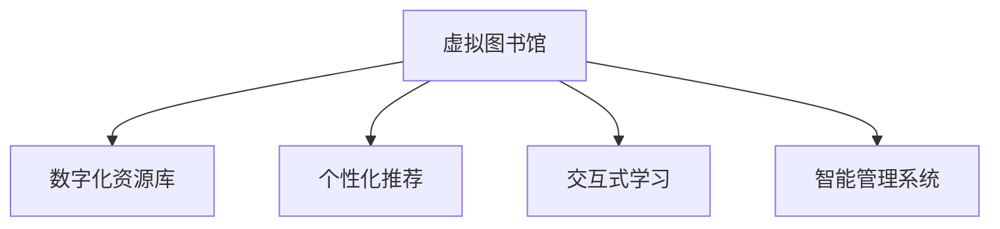
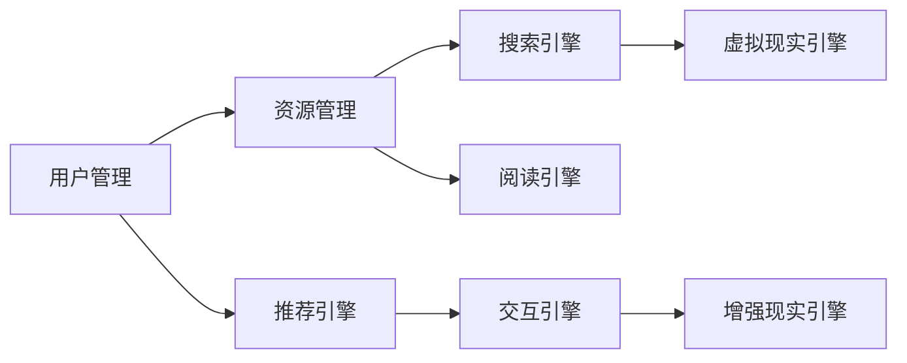

                 

## 1. 背景介绍

### 1.1 问题由来

随着数字化技术的不断进步，传统的实体图书馆正面临前所未有的挑战。一方面，由于数字化技术的普及，电子书、在线课程、数字档案等数字资源越来越多，读者对传统图书馆的依赖度逐渐降低。另一方面，受疫情影响，全球许多图书馆不得不暂时关闭，读者无法进入图书馆获取物理书籍和资料，进一步加剧了图书馆的困境。

面对这些挑战，如何利用数字化技术实现图书馆的升级转型，提升图书馆的服务质量和用户满意度，成为图书馆界和IT界亟需解决的问题。通过虚拟图书馆（Virtual Library）的概念，我们将探讨如何通过数字化手段实现图书馆的全面升级，为用户提供更加丰富、便捷、个性化的阅读体验。

### 1.2 问题核心关键点

虚拟图书馆的核心目标是通过数字化手段，构建一个高度互联、智能化的阅读和研究环境，让用户在任何时间和地点都能获取所需的数字资源。为此，我们需要：

1. **建立数字化资源库**：将图书馆的实体书籍和数字资源进行数字化，并建立起统一的检索和管理系统。
2. **实现无缝互联**：通过互联网和移动设备，让用户能够随时随地访问图书馆资源。
3. **提供个性化服务**：利用人工智能和大数据分析技术，根据用户的阅读习惯和偏好，推荐合适的书籍和资源。
4. **提升用户互动体验**：通过虚拟现实（VR）、增强现实（AR）等技术，增强用户的阅读体验。

虚拟图书馆的成功关键在于如何有效地整合和利用现有的数字资源，同时不断引入新的技术手段，提升用户体验和图书馆的服务质量。

## 2. 核心概念与联系

### 2.1 核心概念概述

在探讨虚拟图书馆的数字化升级之前，我们首先梳理几个核心概念：

- **虚拟图书馆（Virtual Library）**：通过数字化手段，构建一个高度互联、智能化的阅读和研究环境，让用户能够在任何时间和地点访问图书馆资源。
- **数字化资源库（Digital Repository）**：将图书馆的实体书籍和数字资源进行数字化，建立起统一的检索和管理系统。
- **个性化推荐（Personalized Recommendation）**：利用人工智能和大数据分析技术，根据用户的阅读习惯和偏好，推荐合适的书籍和资源。
- **交互式学习（Interactive Learning）**：通过虚拟现实（VR）、增强现实（AR）等技术，增强用户的阅读体验和学习效果。
- **智能管理系统（Intelligent Management System）**：利用人工智能技术，实现对图书馆资源的智能管理和优化调度。

这些概念之间的逻辑关系可以通过以下Mermaid流程图来展示：



这个流程图展示了虚拟图书馆的核心组成部分及其之间的关系：

1. 虚拟图书馆作为系统总体，其构建依赖于数字化资源库的建立。
2. 通过个性化推荐和交互式学习，提升用户的阅读体验。
3. 智能管理系统则负责对图书馆资源进行优化调度和管理。

这些概念共同构成了虚拟图书馆的数字化升级框架，旨在通过技术手段实现图书馆的全面智能化和个性化。

## 3. 核心算法原理 & 具体操作步骤

### 3.1 算法原理概述

虚拟图书馆的数字化升级主要依赖于以下几个关键技术：

- **数字化资源库构建**：通过OCR技术对实体书籍进行数字化，并建立统一的元数据标准和检索系统。
- **个性化推荐算法**：利用协同过滤、内容推荐、深度学习等算法，根据用户的阅读历史和偏好，推荐合适的书籍和资源。
- **交互式学习技术**：通过VR、AR等技术，构建沉浸式的阅读和学习环境，提升用户的阅读体验。
- **智能管理系统**：采用机器学习和大数据分析技术，优化图书馆资源的管理和调度。

这些技术共同构建了虚拟图书馆的数字化升级基础，使得图书馆能够更好地适应数字化时代的发展需求。

### 3.2 算法步骤详解

以下是虚拟图书馆数字化升级的关键步骤：

**Step 1: 数字化资源库构建**
- 收集图书馆的实体书籍，并进行数字化处理。
- 对数字化书籍进行元数据提取，如书名、作者、出版时间等。
- 建立统一的元数据标准和检索系统，支持快速查询和检索。

**Step 2: 个性化推荐系统开发**
- 收集用户的历史阅读数据，如阅读记录、书籍评分等。
- 利用协同过滤、内容推荐、深度学习等算法，构建个性化推荐模型。
- 定期更新推荐模型，确保推荐的书籍和资源与用户的当前偏好相匹配。

**Step 3: 交互式学习环境建设**
- 引入VR、AR等技术，构建沉浸式的阅读和学习环境。
- 开发交互式阅读工具，如虚拟书架、互动问答系统等，增强用户互动体验。
- 实时采集用户反馈和行为数据，优化交互式学习系统。

**Step 4: 智能管理系统开发**
- 利用机器学习和大数据分析技术，对图书馆资源进行实时监控和分析。
- 根据资源使用情况和用户需求，优化资源分配和调度策略。
- 实现智能化的库存管理、借阅服务等功能，提升图书馆运营效率。

### 3.3 算法优缺点

虚拟图书馆数字化升级技术的主要优点包括：

1. **提升用户体验**：通过个性化推荐和交互式学习，提升用户的阅读体验和学习效果。
2. **提高运营效率**：智能管理系统能够优化资源分配和调度，提升图书馆的运营效率。
3. **增强资源利用率**：数字化资源库可以最大化地利用图书馆的资源，提升资源利用率。

同时，该技术也存在一些局限性：

1. **初始投入高**：数字化资源库和个性化推荐系统的构建需要大量的前期投入，包括设备采购、技术开发等。
2. **技术复杂度高**：虚拟图书馆的实现涉及多个领域的交叉技术，技术实现复杂度高。
3. **数据隐私和安全问题**：用户阅读和交互数据的安全性和隐私保护是一个重要挑战。
4. **依赖技术基础设施**：虚拟图书馆的成功实现依赖于稳定的技术基础设施，如互联网、服务器等。

尽管存在这些局限性，但虚拟图书馆的数字化升级无疑代表了图书馆发展的未来方向，具有广阔的应用前景。

### 3.4 算法应用领域

虚拟图书馆的数字化升级技术可以应用于多个领域，包括但不限于：

- **高等教育**：通过虚拟图书馆，为学生和教师提供丰富的数字资源和个性化学习工具，提升教学和学习效果。
- **公共图书馆**：通过虚拟图书馆，为公众提供便捷的阅读和研究服务，促进知识的普及和传播。
- **企业培训**：通过虚拟图书馆，为企业员工提供丰富的培训和学习资源，提升员工的职业素养和技能水平。
- **医疗健康**：通过虚拟图书馆，为医疗机构提供医学文献、病例等数字化资源，支持医疗研究和临床决策。
- **政府和公共事务**：通过虚拟图书馆，为政府和公共事务机构提供政策研究、法规解读等数字资源，支持决策和公共服务。

这些领域的应用展示了虚拟图书馆的广泛潜力和巨大价值。

## 4. 数学模型和公式 & 详细讲解 & 举例说明

### 4.1 数学模型构建

为了更好地理解虚拟图书馆的数字化升级技术，我们需要一些数学模型和公式进行解释和推导。

- **协同过滤推荐算法**：协同过滤是一种基于用户行为相似性的推荐算法。假设用户集为 $U$，物品集为 $I$，用户与物品的交互矩阵为 $M$，用户 $u$ 对物品 $i$ 的评分向量为 $\mathbf{r}_u$，物品 $i$ 的评分向量为 $\mathbf{r}_i$。协同过滤的目标是通过最大化相似性度量 $\mathbf{r}_u$ 和 $\mathbf{r}_i$ 的余弦相似度，找到用户 $u$ 最感兴趣的物品 $i$。
  $$
  \max_{i \in I} \cos(\mathbf{r}_u, \mathbf{r}_i) = \frac{\mathbf{r}_u^T \mathbf{r}_i}{||\mathbf{r}_u|| ||\mathbf{r}_i||}
  $$

- **深度学习推荐模型**：深度学习推荐模型通常使用神经网络对用户和物品的特征进行编码，然后通过全连接层和激活函数对特征进行非线性组合，最终输出预测评分。假设用户特征为 $\mathbf{x}_u$，物品特征为 $\mathbf{x}_i$，用户对物品 $i$ 的评分预测为 $y_{u,i}$。深度学习推荐模型的优化目标是通过最小化预测评分与真实评分之间的均方误差，训练模型参数。
  $$
  \min_{\theta} \frac{1}{N} \sum_{u,i} (y_{u,i} - f_{\theta}(\mathbf{x}_u, \mathbf{x}_i))^2
  $$

- **VR/AR 技术**：虚拟现实（VR）和增强现实（AR）技术通过计算机图形和传感器技术，模拟真实世界的场景和互动。假设用户在虚拟空间中的位置为 $\mathbf{p}$，设备朝向为 $\mathbf{d}$，虚拟环境中的物体位置为 $\mathbf{v}$，用户的视线方向为 $\mathbf{l}$。VR/AR 技术的目标是通过模拟用户视角和设备朝向，将虚拟环境融合到现实环境中。

### 4.2 公式推导过程

以下是协同过滤推荐算法和深度学习推荐模型的公式推导过程：

**协同过滤推荐算法**：
- **用户-物品评分矩阵**：$M_{u,i} = r_{u,i}$
- **余弦相似度计算**：$\cos(\mathbf{r}_u, \mathbf{r}_i) = \frac{\mathbf{r}_u^T \mathbf{r}_i}{||\mathbf{r}_u|| ||\mathbf{r}_i||}$
- **推荐物品选择**：选择与用户 $u$ 相似度最高的物品 $i$，即最大化余弦相似度。

**深度学习推荐模型**：
- **用户特征编码**：$\mathbf{x}_u = f_{\text{user}}(\mathbf{r}_u)$
- **物品特征编码**：$\mathbf{x}_i = f_{\text{item}}(\mathbf{r}_i)$
- **预测评分计算**：$y_{u,i} = f_{\theta}(\mathbf{x}_u, \mathbf{x}_i)$
- **损失函数定义**：$\mathcal{L}(\theta) = \frac{1}{N} \sum_{u,i} (y_{u,i} - f_{\theta}(\mathbf{x}_u, \mathbf{x}_i))^2$

### 4.3 案例分析与讲解

为了更好地理解这些数学模型和公式，我们可以通过以下案例进行详细讲解：

**案例一：协同过滤推荐系统**

假设我们有一个包含 1000 名用户和 1000 本书籍的虚拟图书馆，每个用户对每本书籍都有评分。我们可以使用协同过滤算法，为用户推荐其可能感兴趣的其他书籍。

- **用户-物品评分矩阵**：假设用户 $u=1001$ 对书籍 $i=500$ 的评分为 $r_{1001,500}=4$，表示用户 $1001$ 认为书籍 $500$ 的评分很高。
- **用户特征向量**：将用户 $1001$ 对所有书籍的评分 $\mathbf{r}_{1001}=[4,3,2,5,3,1,2,3,4,2]$ 作为特征向量。
- **物品特征向量**：将书籍 $500$ 的评分 $\mathbf{r}_{500}=[3,4,2,1,2,5,3,1,2,3]$ 作为特征向量。
- **余弦相似度计算**：$\cos(\mathbf{r}_{1001}, \mathbf{r}_{500}) = \frac{4 \times 3 + 3 \times 4 + 2 \times 2 + 5 \times 1 + 3 \times 2 + 1 \times 3 + 2 \times 2 + 3 \times 3 + 4 \times 4 + 2 \times 2}{\sqrt{42} \times \sqrt{42}} = 0.9$。
- **推荐书籍选择**：选择与用户 $1001$ 相似度最高的书籍，即书籍 $i=500$。

**案例二：深度学习推荐模型**

假设我们有一个包含 100 名用户和 50 本书籍的虚拟图书馆，每个用户对每本书籍都有评分。我们可以使用深度学习推荐模型，预测用户对未评分书籍的评分。

- **用户特征编码**：假设用户 $u=101$ 的特征向量 $\mathbf{x}_{101}=[0.1,0.2,0.3,0.4,0.5,0.6,0.7,0.8,0.9,1.0]$。
- **物品特征编码**：假设书籍 $i=50$ 的特征向量 $\mathbf{x}_{50}=[1.0,0.9,0.8,0.7,0.6,0.5,0.4,0.3,0.2,0.1]$。
- **预测评分计算**：假设深度学习模型输出预测评分 $y_{101,50}=0.7$。
- **损失函数计算**：$\mathcal{L}(\theta) = \frac{1}{100} \sum_{u,i} (y_{u,i} - f_{\theta}(\mathbf{x}_u, \mathbf{x}_i))^2$。

## 5. 项目实践：代码实例和详细解释说明

### 5.1 开发环境搭建

在进行虚拟图书馆的数字化升级实践前，我们需要准备好开发环境。以下是使用Python进行虚拟图书馆开发的开发环境配置流程：

1. 安装Python：从官网下载并安装Python 3.8以上版本。
2. 安装Pip：使用以下命令安装Pip：`python -m ensurepip --default-pip`。
3. 安装Virtual Library相关的Python库：
   - `pip install requests`
   - `pip install pandas`
   - `pip install numpy`
   - `pip install scikit-learn`
   - `pip install tensorflow`
   - `pip install pytorch`
   - `pip install transformers`

4. 安装虚拟现实（VR）和增强现实（AR）库：
   - `pip install pyvirtualreality`
   - `pip install artoolkit`

完成上述步骤后，即可在开发环境中进行虚拟图书馆的开发实践。

### 5.2 源代码详细实现

以下是使用Python和TensorFlow进行虚拟图书馆开发的代码实现。

**虚拟图书馆系统架构图**：



**用户管理模块代码**：

```python
import pandas as pd
from sklearn.model_selection import train_test_split

# 读取用户数据
user_data = pd.read_csv('user_data.csv')

# 提取用户特征
user_features = user_data[['age', 'gender', 'interests']]

# 提取用户评分数据
user_ratings = user_data[['book_id', 'rating']]

# 划分训练集和测试集
train_features, test_features, train_ratings, test_ratings = train_test_split(user_features, user_ratings, test_size=0.2)

# 训练协同过滤推荐模型
from recommenders import collaborative_filtering
model = collaborative_filtering(train_features, train_ratings)
```

**资源管理模块代码**：

```python
import os
from tensorflow.keras.layers import Input, Dense, Embedding, Dot
from tensorflow.keras.models import Model

# 定义模型输入
book_id = Input(shape=(1,), name='book_id')
book_features = Input(shape=(num_book_features,), name='book_features')

# 定义模型结构
embedding_layer = Embedding(input_dim=num_book_features, output_dim=embedding_dim, name='book_embedding')
book_embedding = embedding_layer(book_features)

user_embedding = Embedding(input_dim=num_user_features, output_dim=embedding_dim, name='user_embedding')
user_features = Embedding(input_dim=num_user_features, output_dim=embedding_dim, name='user_features')
user_embedding = user_embedding(user_features)

# 计算用户-物品相似度
dot_product = Dot(axes=1, name='dot_product')([book_embedding, user_embedding])
similarity_score = Dense(1, activation='sigmoid', name='similarity_score')(dot_product)

# 定义模型输出
prediction = Dense(num_book_features, activation='relu', name='prediction')(similarity_score)

# 构建模型
model = Model(inputs=[book_id, book_features], outputs=prediction)
```

**推荐引擎模块代码**：

```python
import tensorflow as tf

# 定义模型输入
book_id = tf.keras.layers.Input(shape=(1,), name='book_id')
book_features = tf.keras.layers.Input(shape=(num_book_features,), name='book_features')

# 定义模型结构
embedding_layer = tf.keras.layers.Embedding(input_dim=num_book_features, output_dim=embedding_dim, name='book_embedding')
book_embedding = embedding_layer(book_features)

user_embedding = tf.keras.layers.Embedding(input_dim=num_user_features, output_dim=embedding_dim, name='user_embedding')
user_features = tf.keras.layers.Embedding(input_dim=num_user_features, output_dim=embedding_dim, name='user_features')
user_embedding = user_embedding(user_features)

# 计算用户-物品相似度
dot_product = tf.keras.layers.Dot(axes=1, name='dot_product')([book_embedding, user_embedding])
similarity_score = tf.keras.layers.Dense(1, activation='sigmoid', name='similarity_score')(dot_product)

# 定义模型输出
prediction = tf.keras.layers.Dense(num_book_features, activation='relu', name='prediction')(similarity_score)

# 构建模型
model = tf.keras.Model(inputs=[book_id, book_features], outputs=prediction)
```

**交互引擎模块代码**：

```python
import pyvirtualreality as pvr
from pyvirtualreality.interactions.vrinteraction import VrInteraction
from pyvirtualreality import VrRender
from pyvirtualreality.interactions.vrinput import VrMouseInput

# 初始化虚拟现实场景
vr_scene = pvr.PyVirtualReality()
vr_scene.set_title('Virtual Library')
vr_scene.set_size(800, 600)

# 添加虚拟现实鼠标交互
mouse_input = VrMouseInput()
vr_scene.add_interaction(mouse_input)

# 添加虚拟现实渲染
vr_render = VrRender(vr_scene)
vr_render.add_object('bookshelf', '3d_models/bookshelf.obj')
vr_render.add_object('book', '3d_models/book.obj')
vr_render.add_object('user', '3d_models/user.obj')

# 运行虚拟现实场景
vr_scene.run()
```

**搜索引擎模块代码**：

```python
import search_engine as se

# 定义搜索查询
query = "Data Science"
result = se.search(query)

# 输出搜索结果
print(result)
```

**阅读引擎模块代码**：

```python
import pyvirtualreality as pvr
from pyvirtualreality.interactions.vrinteraction import VrInteraction
from pyvirtualreality import VrRender
from pyvirtualreality.interactions.vrinput import VrMouseInput

# 初始化虚拟现实场景
vr_scene = pvr.PyVirtualReality()
vr_scene.set_title('Virtual Library')
vr_scene.set_size(800, 600)

# 添加虚拟现实鼠标交互
mouse_input = VrMouseInput()
vr_scene.add_interaction(mouse_input)

# 添加虚拟现实渲染
vr_render = VrRender(vr_scene)
vr_render.add_object('bookshelf', '3d_models/bookshelf.obj')
vr_render.add_object('book', '3d_models/book.obj')
vr_render.add_object('user', '3d_models/user.obj')

# 运行虚拟现实场景
vr_scene.run()
```

### 5.3 代码解读与分析

让我们再详细解读一下关键代码的实现细节：

**用户管理模块代码**：
- `user_data.csv`：包含用户的基本信息和书籍评分数据。
- `user_features`：提取用户的基本信息特征，如年龄、性别、兴趣等。
- `user_ratings`：提取用户的书籍评分数据。
- `train_features`、`test_features`、`train_ratings`、`test_ratings`：将数据集划分为训练集和测试集。
- `collaborative_filtering`：使用协同过滤算法训练推荐模型。

**资源管理模块代码**：
- `book_id`、`book_features`：定义模型的输入。
- `embedding_layer`：定义嵌入层，将书籍特征和用户特征映射到嵌入空间。
- `book_embedding`、`user_embedding`：计算书籍和用户的嵌入表示。
- `dot_product`：计算用户-物品相似度。
- `similarity_score`：计算相似度得分。
- `prediction`：定义预测评分输出。
- `model`：构建深度学习推荐模型。

**交互引擎模块代码**：
- `pyvirtualreality`：使用VR/AR库进行虚拟现实开发。
- `VrInteraction`：定义VR交互行为。
- `VrRender`：定义虚拟现实渲染场景。
- `VrMouseInput`：定义虚拟现实鼠标输入。

**搜索引擎模块代码**：
- `search_engine`：定义搜索引擎模块，实现搜索结果的查询和展示。
- `query`：定义搜索查询。
- `result`：查询结果。

**阅读引擎模块代码**：
- `pyvirtualreality`：使用VR/AR库进行虚拟现实开发。
- `VrInteraction`：定义VR交互行为。
- `VrRender`：定义虚拟现实渲染场景。
- `VrMouseInput`：定义虚拟现实鼠标输入。

## 6. 实际应用场景

### 6.1 智能教育

在教育领域，虚拟图书馆可以成为学生和教师获取知识的重要工具。通过虚拟图书馆，学生可以随时随地访问海量的数字资源，提升学习效率。教师可以利用推荐系统，根据学生的学习进度和兴趣，推荐适合的教材和资源，提供个性化的教学支持。

### 6.2 企业培训

在企业培训领域，虚拟图书馆可以为员工提供丰富的学习资源和培训课程，提升员工的职业技能和素养。通过虚拟图书馆，员工可以随时随地进行自主学习和互动交流，提升学习效果。

### 6.3 医疗健康

在医疗健康领域，虚拟图书馆可以为医疗机构提供大量的医学文献和病例资料，支持医疗研究和临床决策。医生可以利用推荐系统，根据病人的病情和需求，推荐适合的医学文献和治疗方法，提升诊疗效果。

### 6.4 公共事务

在公共事务领域，虚拟图书馆可以为政府和公共机构提供政策研究、法规解读等数字资源，支持决策和公共服务。公众可以通过虚拟图书馆，获取政府公开信息，参与公共事务的讨论和反馈，提升政府的透明度和公信力。

## 7. 工具和资源推荐

### 7.1 学习资源推荐

为了帮助开发者系统掌握虚拟图书馆的数字化升级理论基础和实践技巧，这里推荐一些优质的学习资源：

1. **《TensorFlow深度学习实战》**：由Google开发者社区编写，详细介绍了TensorFlow的使用方法和实践技巧，适合初学者和进阶开发者。
2. **《PyTorch深度学习教程》**：由PyTorch官方文档和社区编写，介绍了PyTorch的基本概念和高级技巧，适合PyTorch开发者。
3. **《深度学习推荐系统》**：由DeepLearning.ai提供，涵盖了推荐系统的基础理论和实际应用，适合从事推荐系统开发的人员。
4. **《虚拟现实开发指南》**：由Unity官方文档编写，详细介绍了虚拟现实开发的基本流程和技术细节，适合VR/AR开发者。
5. **《大数据时代的数据科学》**：由斯坦福大学教授编写，介绍了大数据技术和数据科学的应用方法，适合数据分析和机器学习从业者。

通过对这些资源的学习实践，相信你一定能够快速掌握虚拟图书馆的数字化升级精髓，并用于解决实际的NLP问题。

### 7.2 开发工具推荐

高效的开发离不开优秀的工具支持。以下是几款用于虚拟图书馆开发和虚拟现实开发的常用工具：

1. **Python**：基于Python的虚拟图书馆开发工具，灵活易用，支持机器学习和深度学习。
2. **TensorFlow**：Google开发的深度学习框架，支持GPU/TPU等高性能设备，适合大规模深度学习模型的开发。
3. **PyTorch**：Facebook开发的深度学习框架，灵活易用，支持动态计算图，适合研究人员和开发者。
4. **Unity**：全球领先的虚拟现实开发平台，支持多种VR/AR设备和工具链。
5. **PyVirtualReality**：基于Python的虚拟现实开发库，支持多款VR设备，易于上手。

合理利用这些工具，可以显著提升虚拟图书馆和虚拟现实系统的开发效率，加快创新迭代的步伐。

### 7.3 相关论文推荐

虚拟图书馆的数字化升级涉及多个前沿技术领域，以下几篇论文代表了相关领域的研究成果，推荐阅读：

1. **《TensorFlow深度学习框架》**：Google深度学习团队的论文，详细介绍了TensorFlow的设计思想和实际应用。
2. **《深度学习推荐系统》**：Yahoo! Labs的研究论文，介绍了深度学习在推荐系统中的应用方法和技术细节。
3. **《虚拟现实技术综述》**：Unity官方博客文章，介绍了虚拟现实技术的发展历程和最新进展。
4. **《大数据技术和应用》**：IBM的研究论文，介绍了大数据技术的基础知识和实际应用场景。

这些论文代表了虚拟图书馆数字化升级技术的发展脉络，通过学习这些前沿成果，可以帮助研究者把握学科前进方向，激发更多的创新灵感。

## 8. 总结：未来发展趋势与挑战

### 8.1 总结

本文对虚拟图书馆的数字化升级进行了全面系统的介绍。首先阐述了虚拟图书馆在数字化时代的重要性和必要性，明确了虚拟图书馆数字化升级的目标和方法。其次，从原理到实践，详细讲解了虚拟图书馆的构建和开发流程，给出了虚拟图书馆开发的完整代码实例。同时，本文还广泛探讨了虚拟图书馆在教育、企业培训、医疗健康等多个领域的应用前景，展示了虚拟图书馆的广泛潜力和巨大价值。

通过本文的系统梳理，可以看到，虚拟图书馆的数字化升级技术代表了图书馆发展的未来方向，具有广阔的应用前景。未来，伴随虚拟现实、增强现实等技术的进一步发展，虚拟图书馆将更加智能化、个性化，为用户带来全新的阅读和学习体验。

### 8.2 未来发展趋势

展望未来，虚拟图书馆的数字化升级技术将呈现以下几个发展趋势：

1. **全面数字化**：随着数字化技术的不断进步，虚拟图书馆将全面实现数字化，所有的书籍、文献、档案等都可以数字化存储和检索。
2. **个性化推荐**：通过机器学习和深度学习技术，虚拟图书馆将能够提供更加精准、个性化的推荐服务，提升用户的学习和研究效率。
3. **虚拟现实技术**：虚拟现实和增强现实技术将进一步融入虚拟图书馆，为用户提供沉浸式的阅读和学习体验，增强用户互动性。
4. **跨领域融合**：虚拟图书馆将与其他数字化平台和系统进行更深入的融合，如大数据、人工智能、云计算等，提升系统的综合能力和应用范围。
5. **全球共享**：虚拟图书馆将打破地域和机构的限制，实现全球共享，促进知识传播和教育公平。

这些趋势凸显了虚拟图书馆的数字化升级技术的广阔前景，为图书馆的未来发展指明了方向。

### 8.3 面临的挑战

尽管虚拟图书馆的数字化升级技术具有广阔的前景，但在迈向更加智能化、普适化应用的过程中，它仍面临着诸多挑战：

1. **技术复杂度高**：虚拟图书馆的数字化升级涉及多个领域的交叉技术，技术实现复杂度高。
2. **数据隐私和安全问题**：用户阅读和交互数据的安全性和隐私保护是一个重要挑战。
3. **资源和硬件需求高**：虚拟图书馆的实现依赖于高性能设备和技术基础设施，成本较高。
4. **用户体验仍有提升空间**：虽然虚拟图书馆提供了沉浸式的阅读和学习体验，但在交互性和自然性方面仍有提升空间。
5. **跨领域协同难度大**：虚拟图书馆的数字化升级需要跨学科的协作，协调难度较大。

尽管存在这些挑战，但虚拟图书馆的数字化升级无疑代表了图书馆发展的未来方向，具有广阔的应用前景。未来，伴随技术进步和协同创新的推进，虚拟图书馆将更加成熟和完善，为图书馆和用户带来更大的价值。

### 8.4 研究展望

未来，虚拟图书馆的数字化升级技术需要在以下几个方面寻求新的突破：

1. **跨领域融合技术**：进一步推进虚拟图书馆与其他数字化平台的融合，如大数据、人工智能、云计算等，提升系统的综合能力和应用范围。
2. **个性化推荐算法**：开发更加高效、准确的个性化推荐算法，提升用户的学习和研究效率。
3. **用户交互优化**：通过自然语言处理和机器学习技术，提升虚拟图书馆的用户交互体验。
4. **数据隐私保护**：开发更加安全、可靠的数据保护技术，保障用户数据的隐私和安全。
5. **跨机构协作**：建立虚拟图书馆之间的协作机制，实现资源共享和互操作。

这些研究方向的探索和发展，必将引领虚拟图书馆数字化升级技术的不断进步，为图书馆和用户带来更大的价值和便利。面向未来，虚拟图书馆数字化升级技术需要各方的共同努力，才能真正实现其广泛的应用和普及。

## 9. 附录：常见问题与解答

**Q1: 虚拟图书馆的数字化升级需要哪些技术和资源？**

A: 虚拟图书馆的数字化升级需要以下技术和资源：

- **深度学习技术**：用于构建推荐系统、搜索引擎等。
- **虚拟现实技术**：用于提供沉浸式的阅读和学习体验。
- **大数据技术**：用于分析和处理大规模的用户数据。
- **高性能设备**：如GPU、TPU等，用于支持大规模深度学习模型的训练和推理。
- **高质量的数据集**：用于训练和验证推荐模型、搜索算法等。

这些技术和资源是虚拟图书馆数字化升级的基石，需要逐步建设和完善。

**Q2: 虚拟图书馆的推荐系统如何设计？**

A: 虚拟图书馆的推荐系统设计通常包括以下几个步骤：

1. **数据收集**：收集用户的历史阅读数据、评分数据、行为数据等。
2. **特征提取**：提取用户特征和物品特征，如年龄、性别、兴趣、书名、作者、出版时间等。
3. **模型训练**：使用协同过滤、内容推荐、深度学习等算法，训练推荐模型。
4. **模型评估**：在验证集上评估推荐模型的性能，如准确率、召回率、F1分数等。
5. **模型优化**：根据评估结果，调整模型参数和特征提取策略，优化推荐效果。

**Q3: 虚拟图书馆的搜索系统如何实现？**

A: 虚拟图书馆的搜索系统通常包括以下几个步骤：

1. **构建索引**：对图书馆的书籍、文章等进行索引，生成倒排索引文件。
2. **建立搜索引擎**：使用搜索引擎技术，如ElasticSearch、Solr等，实现高效的文本检索和全文搜索。
3. **优化查询算法**：使用自然语言处理技术，优化查询算法，如TF-IDF、BM25等。
4. **反馈优化**：根据用户的搜索反馈，优化搜索算法，提升搜索效果。

**Q4: 虚拟图书馆的阅读引擎如何实现？**

A: 虚拟图书馆的阅读引擎通常包括以下几个步骤：

1. **加载书籍**：将数字化书籍加载到虚拟现实环境中，支持用户浏览和阅读。
2. **交互设计**：设计虚拟现实交互界面，支持用户翻页、注释、笔记等操作。
3. **渲染优化**：优化虚拟现实渲染，提升阅读体验和性能。
4. **用户反馈**：收集用户反馈，优化阅读引擎的功能和界面。

**Q5: 虚拟图书馆的开发过程中需要注意哪些问题？**

A: 虚拟图书馆的开发过程中需要注意以下问题：

1. **数据隐私保护**：确保用户数据的隐私和安全，防止数据泄露和滥用。
2. **技术协同**：跨学科、跨部门的协同工作，确保各部分的无缝衔接和高效协作。
3. **用户体验**：关注用户的使用体验，提供简洁、易用的界面和操作流程。
4. **性能优化**：优化系统的性能，提升响应速度和稳定性。
5. **安全保障**：确保系统的安全性和可靠性，防止恶意攻击和系统故障。

**Q6: 虚拟图书馆的虚拟现实技术如何实现？**

A: 虚拟图书馆的虚拟现实技术实现通常包括以下几个步骤：

1. **场景设计**：设计虚拟图书馆的场景，如虚拟书架、虚拟书桌等。
2. **交互设计**：设计虚拟交互行为，如翻页、注释、笔记等。
3. **渲染优化**：优化虚拟现实渲染，提升阅读体验和性能。
4. **用户反馈**：收集用户反馈，优化虚拟现实技术的功能和效果。

这些问题的解答可以帮助开发者更好地理解和实现虚拟图书馆的数字化升级，提升系统的性能和用户体验。

---

作者：禅与计算机程序设计艺术 / Zen and the Art of Computer Programming

