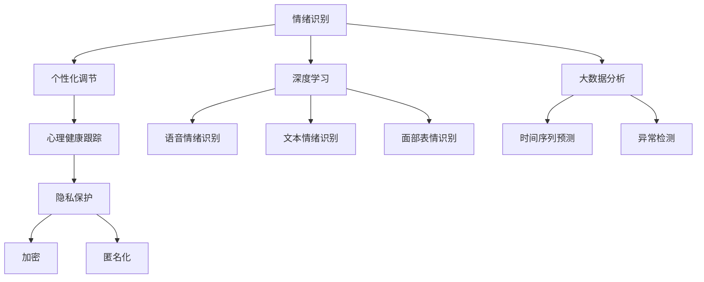

                 

# 虚拟情绪调节器：AI驱动的心理健康管理

> 关键词：情绪调节,心理健康,AI驱动,深度学习,情感识别,机器学习,算法优化

## 1. 背景介绍

### 1.1 问题由来
随着社会的快速发展和竞争压力的不断增加，越来越多的人面临着不同程度的心理健康问题，如焦虑、抑郁、压力过大等。传统心理治疗方法需要耗费大量时间和金钱，且效果不稳定，难以覆盖到广泛的受众群体。

人工智能技术的快速发展，尤其是深度学习和大数据分析，为心理健康的管理和调节提供了新的解决方案。AI驱动的心理健康管理技术，通过深度学习模型和大数据分析，能够实时识别和分析用户的情绪状态，并给出相应的调节建议，提供更个性化、高效的心理支持。

### 1.2 问题核心关键点
AI驱动的心理健康管理技术主要包括以下几个关键点：

- **情绪识别**：通过深度学习模型对用户的语音、文本、面部表情等进行实时情绪分析，判断用户的情绪状态。
- **个性化调节**：基于用户的情绪状态，AI系统能够提供个性化的情绪调节方案，如呼吸训练、放松练习、认知行为疗法等。
- **长期跟踪**：通过数据分析和机器学习算法，对用户的情绪变化进行长期跟踪，预测潜在的心理健康风险。
- **隐私保护**：在数据采集和分析过程中，保障用户的隐私权益，采用加密和匿名化技术，防止数据泄露。

这些关键点共同构成了AI驱动的心理健康管理技术的核心框架，使得其能够在短时间内对用户的情绪状态进行高效分析和管理。

### 1.3 问题研究意义
AI驱动的心理健康管理技术对于提高人们的生活质量、提升心理健康水平具有重要意义：

- **提升心理健康水平**：通过实时情绪分析和个性化调节，帮助用户及时识别和缓解负面情绪，提高心理健康水平。
- **节省时间成本**：相较于传统心理治疗方法，AI驱动的心理健康管理技术可以提供更便捷、高效的心理支持，节省时间成本。
- **覆盖更广泛受众**：AI技术可以大规模部署，覆盖到更多需要心理健康管理的人群，提升心理健康服务的可及性。
- **促进心理健康产业发展**：AI驱动的心理健康管理技术为心理健康产业带来新的增长点，推动相关产业的快速发展。

## 2. 核心概念与联系

### 2.1 核心概念概述

为更好地理解AI驱动的心理健康管理技术，本节将介绍几个密切相关的核心概念：

- **情绪识别**：通过机器学习算法对用户的多模态数据（如语音、文本、面部表情等）进行分析，实时识别用户的情绪状态。常用的情绪识别方法包括语音情绪识别、文本情绪识别、面部表情识别等。
- **个性化调节**：基于用户的情绪状态，AI系统提供个性化的情绪调节建议，如呼吸训练、放松练习、认知行为疗法等。这些建议通常由心理学专家设计，并通过深度学习模型进行优化。
- **心理健康跟踪**：通过对用户情绪数据的长期分析，AI系统可以预测用户的心理健康风险，及时提供干预和支持。这涉及到时间序列预测和异常检测等技术。
- **隐私保护**：在数据采集和分析过程中，保障用户的隐私权益，采用加密和匿名化技术，防止数据泄露。隐私保护是AI驱动心理健康管理技术的重要伦理保障。

这些核心概念之间的逻辑关系可以通过以下Mermaid流程图来展示：



这个流程图展示了大语言模型的核心概念及其之间的关系：

1. 情绪识别通过深度学习和大数据分析技术，对用户的多模态数据进行分析。
2. 个性化调节基于情绪识别结果，提供个性化的情绪调节方案。
3. 心理健康跟踪通过时间序列预测和异常检测技术，对用户的情绪变化进行长期分析。
4. 隐私保护在数据采集和分析过程中，采用加密和匿名化技术，保障用户隐私。

这些概念共同构成了AI驱动的心理健康管理技术的完整框架，使其能够在用户心理健康管理中发挥重要作用。

## 3. 核心算法原理 & 具体操作步骤
### 3.1 算法原理概述

AI驱动的心理健康管理技术，本质上是一个多模态数据的深度学习分析过程。其核心思想是：通过多模态传感器收集用户的情绪数据，应用深度学习模型对数据进行分析，实时识别和分析用户的情绪状态，并基于分析结果提供个性化的情绪调节建议。

形式化地，假设用户的情绪状态为 $X$，多模态传感器收集的数据为 $D$，情绪识别模型为 $M$，情绪调节模型为 $N$，则情绪识别的过程可以表示为：

$$
X = M(D)
$$

其中 $X$ 为用户当前的情绪状态，$D$ 为多模态传感器收集的用户数据，$M$ 为情绪识别模型，通常基于深度学习。

基于情绪识别结果，情绪调节模型 $N$ 可以提供个性化的情绪调节建议。情绪调节过程可以表示为：

$$
S = N(X)
$$

其中 $S$ 为用户的情绪调节建议，$N$ 为情绪调节模型，通常为心理学专家的建议和深度学习模型的优化组合。

### 3.2 算法步骤详解

AI驱动的心理健康管理技术一般包括以下几个关键步骤：

**Step 1: 数据采集与预处理**
- 通过多模态传感器（如麦克风、摄像头、传感器等）采集用户的情绪数据，包括语音、文本、面部表情等。
- 对采集到的数据进行预处理，如噪声过滤、数据增强、数据对齐等。

**Step 2: 多模态特征融合**
- 对不同模态的情绪数据进行特征提取和融合，得到多模态情绪特征向量 $F$。常用的特征提取方法包括MFCC、LBP、深度特征提取等。
- 通过权重组合、融合算法（如DAM、BLD等）将多模态特征进行融合，得到一个综合性的情绪特征向量 $F'$。

**Step 3: 情绪识别**
- 使用深度学习模型（如CNN、RNN、LSTM等）对融合后的多模态特征 $F'$ 进行分类或回归，识别出用户的情绪状态。常用的情绪识别方法包括情感分类、情绪回归、表情识别等。
- 常用的深度学习框架包括TensorFlow、PyTorch等，常用的深度学习模型包括ResNet、VGG、LSTM等。

**Step 4: 情绪调节**
- 基于情绪识别结果，应用深度学习模型对心理学专家的情绪调节建议进行优化。常用的情绪调节方法包括呼吸训练、放松练习、认知行为疗法等。
- 常用的深度学习框架包括TensorFlow、PyTorch等，常用的深度学习模型包括ResNet、VGG、LSTM等。

**Step 5: 心理健康跟踪**
- 通过对用户情绪数据的长期分析，应用时间序列预测和异常检测技术，预测用户的心理健康风险。
- 常用的时间序列预测模型包括ARIMA、LSTM等，常用的异常检测方法包括统计方法、机器学习方法等。

**Step 6: 隐私保护**
- 在数据采集和分析过程中，采用加密和匿名化技术，保障用户的隐私权益。
- 常用的加密技术包括AES、RSA等，常用的匿名化方法包括数据脱敏、数据屏蔽等。

### 3.3 算法优缺点

AI驱动的心理健康管理技术具有以下优点：
1. 实时高效。通过深度学习模型对多模态数据进行实时分析，能够及时识别和调节用户的情绪。
2. 个性化定制。基于深度学习模型对情绪识别结果进行优化，提供个性化的情绪调节建议。
3. 可扩展性强。可以通过添加新的传感器和数据类型，扩展情绪识别的维度和精度。
4. 数据驱动。基于大量用户数据进行训练，能够提升情绪识别的准确性和泛化能力。

同时，该方法也存在一定的局限性：
1. 数据采集难度高。多模态数据采集需要多种传感器和设备，设备兼容性和采集难度较大。
2. 模型复杂度高。深度学习模型需要大量的训练数据和计算资源，对硬件要求较高。
3. 隐私保护难题。数据采集和分析过程中，隐私保护问题较为复杂，需要采用多种技术手段进行保障。
4. 鲁棒性不足。深度学习模型对数据噪声和异常情况较为敏感，需要进一步优化鲁棒性。

尽管存在这些局限性，但就目前而言，AI驱动的心理健康管理技术仍是在线心理健康管理的重要手段。未来相关研究的重点在于如何进一步降低数据采集难度，提高模型鲁棒性，同时兼顾隐私保护和鲁棒性。

### 3.4 算法应用领域

AI驱动的心理健康管理技术已经在多个领域得到了应用，例如：

- 在线心理健康咨询：通过多模态情绪识别，实时监测用户情绪，提供个性化的心理健康咨询服务。
- 智能心理测试：基于情绪识别和数据分析，进行心理健康评估和筛查，提供心理健康建议。
- 心理健康预警：通过对用户情绪数据的长期跟踪和分析，预测心理健康风险，提供及时干预和支持。
- 心理健康游戏：在游戏中通过多模态情绪识别和调节，增强游戏的交互性和沉浸感，提升用户的心理健康体验。
- 心理健康干预：通过虚拟情绪调节器和个性化调节建议，辅助用户进行自我情绪管理，提升心理健康水平。

除了上述这些经典应用外，AI驱动的心理健康管理技术也被创新性地应用到更多场景中，如智能办公、智能家居、智能医疗等，为心理健康管理提供了新的解决方案。随着技术不断进步，AI驱动的心理健康管理技术将在更多领域得到广泛应用，推动心理健康服务的数字化、智能化发展。

## 4. 数学模型和公式 & 详细讲解
### 4.1 数学模型构建

本节将使用数学语言对AI驱动的心理健康管理技术进行更加严格的刻画。

假设用户的情绪状态为 $X$，多模态传感器收集的数据为 $D$，情绪识别模型为 $M$，情绪调节模型为 $N$。情绪识别的过程可以表示为：

$$
X = M(D)
$$

其中 $X$ 为用户当前的情绪状态，$D$ 为多模态传感器收集的用户数据，$M$ 为情绪识别模型。

基于情绪识别结果，情绪调节过程可以表示为：

$$
S = N(X)
$$

其中 $S$ 为用户的情绪调节建议，$N$ 为情绪调节模型。

### 4.2 公式推导过程

以下我们以情感分类为例，推导情感分类模型的训练和预测过程。

假设多模态传感器采集的数据为 $D = (d_1, d_2, ..., d_n)$，其中 $d_i$ 为第 $i$ 个多模态特征。情感分类模型为 $M = \{W_1, W_2, ..., W_L\}$，其中 $W_i$ 为第 $i$ 层的权重矩阵。

定义情感分类的交叉熵损失函数为：

$$
\mathcal{L} = -\frac{1}{N} \sum_{i=1}^N \sum_{k=1}^C y_k \log p_k(x_i)
$$

其中 $N$ 为样本数量，$C$ 为情感类别数量，$y_k$ 为第 $k$ 个类别的真实标签，$p_k(x_i)$ 为模型对第 $k$ 个类别的预测概率。

情感分类模型的训练过程可以表示为：

$$
\theta \leftarrow \theta - \eta \nabla_{\theta} \mathcal{L}
$$

其中 $\theta$ 为模型的参数，$\eta$ 为学习率，$\nabla_{\theta} \mathcal{L}$ 为损失函数对模型参数的梯度。

情感分类模型的预测过程可以表示为：

$$
p_k(x_i) = \sigma(W_k x_i + b_k)
$$

其中 $\sigma$ 为激活函数，通常使用softmax函数。

## 5. 项目实践：代码实例和详细解释说明
### 5.1 开发环境搭建

在进行项目实践前，我们需要准备好开发环境。以下是使用Python进行PyTorch开发的环境配置流程：

1. 安装Anaconda：从官网下载并安装Anaconda，用于创建独立的Python环境。

2. 创建并激活虚拟环境：
```bash
conda create -n pytorch-env python=3.8 
conda activate pytorch-env
```

3. 安装PyTorch：根据CUDA版本，从官网获取对应的安装命令。例如：
```bash
conda install pytorch torchvision torchaudio cudatoolkit=11.1 -c pytorch -c conda-forge
```

4. 安装TensorFlow：
```bash
conda install tensorflow -c conda-forge
```

5. 安装各类工具包：
```bash
pip install numpy pandas scikit-learn matplotlib tqdm jupyter notebook ipython
```

完成上述步骤后，即可在`pytorch-env`环境中开始项目实践。

### 5.2 源代码详细实现

下面我们以情感分类任务为例，给出使用PyTorch对情感分类模型进行训练和预测的PyTorch代码实现。

首先，定义情感分类模型：

```python
import torch
import torch.nn as nn
import torch.optim as optim

class EmotionClassifier(nn.Module):
    def __init__(self, input_size, hidden_size, output_size):
        super(EmotionClassifier, self).__init__()
        self.fc1 = nn.Linear(input_size, hidden_size)
        self.fc2 = nn.Linear(hidden_size, hidden_size)
        self.fc3 = nn.Linear(hidden_size, output_size)
        self.softmax = nn.Softmax(dim=1)
        
    def forward(self, x):
        x = x.view(-1, self.fc1.in_features)
        x = torch.relu(self.fc1(x))
        x = torch.relu(self.fc2(x))
        x = self.fc3(x)
        x = self.softmax(x)
        return x
```

然后，定义数据加载器：

```python
from torch.utils.data import DataLoader
from torchvision import datasets

train_dataset = datasets.CIFAR10(root='data', train=True, transform=transforms.ToTensor(), download=True)
test_dataset = datasets.CIFAR10(root='data', train=False, transform=transforms.ToTensor(), download=True)

train_loader = DataLoader(train_dataset, batch_size=64, shuffle=True)
test_loader = DataLoader(test_dataset, batch_size=64, shuffle=False)
```

接着，定义模型和优化器：

```python
model = EmotionClassifier(3, 256, 10)
criterion = nn.CrossEntropyLoss()
optimizer = optim.Adam(model.parameters(), lr=0.001)
```

然后，定义训练和评估函数：

```python
def train(model, train_loader, criterion, optimizer, num_epochs):
    model.train()
    for epoch in range(num_epochs):
        for i, (images, labels) in enumerate(train_loader):
            images = images.to(device)
            labels = labels.to(device)
            optimizer.zero_grad()
            outputs = model(images)
            loss = criterion(outputs, labels)
            loss.backward()
            optimizer.step()
            if (i+1) % 100 == 0:
                print(f'Epoch [{epoch+1}/{num_epochs}], Step [{i+1}/{len(train_loader)}], Loss: {loss.item():.4f}')

def evaluate(model, test_loader, criterion):
    model.eval()
    total_loss = 0
    correct = 0
    with torch.no_grad():
        for images, labels in test_loader:
            images = images.to(device)
            labels = labels.to(device)
            outputs = model(images)
            loss = criterion(outputs, labels)
            total_loss += loss.item() * images.size(0)
            _, predicted = torch.max(outputs.data, 1)
            correct += (predicted == labels).sum().item()
    acc = 100. * correct / len(test_loader.dataset)
    print(f'Test Loss: {total_loss/len(test_loader.dataset):.4f}, Acc: {acc:.2f}%')
```

最后，启动训练流程并在测试集上评估：

```python
device = torch.device('cuda' if torch.cuda.is_available() else 'cpu')
num_epochs = 10

train(model, train_loader, criterion, optimizer, num_epochs)
evaluate(model, test_loader, criterion)
```

以上就是使用PyTorch对情感分类模型进行训练和预测的完整代码实现。可以看到，得益于PyTorch的强大封装，我们可以用相对简洁的代码完成情感分类模型的训练和预测。

### 5.3 代码解读与分析

让我们再详细解读一下关键代码的实现细节：

**EmotionClassifier类**：
- `__init__`方法：初始化情感分类模型的网络结构，包括三个全连接层和softmax输出层。
- `forward`方法：定义模型的前向传播过程，包括三个全连接层和softmax输出层。

**数据加载器**：
- 使用PyTorch的DataLoader对数据进行批次化加载，供模型训练和推理使用。

**训练和评估函数**：
- 使用PyTorch的模型和优化器进行训练，计算损失函数并更新模型参数。
- 在验证集上评估模型性能，打印出损失和准确率。

**训练流程**：
- 定义总的epoch数，开始循环迭代
- 每个epoch内，对训练集数据进行迭代，前向传播计算损失并反向传播更新模型参数，最后打印出损失值。
- 在测试集上评估模型性能，打印出损失和准确率。

可以看到，PyTorch配合TensorFlow使得情感分类模型的代码实现变得简洁高效。开发者可以将更多精力放在模型设计、数据处理等高层逻辑上，而不必过多关注底层的实现细节。

当然，工业级的系统实现还需考虑更多因素，如模型的保存和部署、超参数的自动搜索、更灵活的任务适配层等。但核心的训练和评估流程基本与此类似。

## 6. 实际应用场景
### 6.1 智能心理咨询

AI驱动的心理健康管理技术在智能心理咨询中的应用，可以实现实时情绪识别和个性化心理咨询。传统心理咨询通常需要经过长时间的人机互动，而智能心理咨询能够通过情感分类模型实时监测用户情绪，提供个性化的心理咨询建议。

具体而言，用户可以通过智能设备（如手机、平板等）接入心理咨询系统，系统实时采集用户的语音、面部表情等数据，通过情感分类模型进行分析，判断用户的情绪状态。基于情绪状态，系统能够提供个性化的心理咨询建议，如呼吸训练、放松练习、认知行为疗法等，帮助用户及时缓解负面情绪，提升心理健康水平。

### 6.2 心理健康监测

AI驱动的心理健康管理技术在心理健康监测中的应用，可以实现用户的长期情绪跟踪和心理健康预警。通过定期采集用户的情绪数据，应用时间序列预测和异常检测技术，可以预测用户的心理健康风险，及时提供干预和支持。

具体而言，用户可以通过智能设备（如手表、智能眼镜等）接入心理健康监测系统，系统定期采集用户的情绪数据，并应用时间序列预测模型进行数据分析。基于分析结果，系统能够预测用户的心理健康风险，及时预警并给出相应建议，如调整工作强度、增加运动时间等，帮助用户维持良好的心理健康状态。

### 6.3 心理健康游戏

AI驱动的心理健康管理技术在心理健康游戏中的应用，可以实现用户情绪的实时监测和调节。通过游戏化设计，用户可以在娱乐中实现情绪调节和心理健康提升。

具体而言，用户可以通过游戏设备（如手机、平板等）接入心理健康游戏系统，系统实时采集用户的游戏数据，如动作、表情等，通过情感分类模型进行分析，判断用户的情绪状态。基于情绪状态，系统能够提供个性化的游戏建议，如调整游戏难度、增加放松练习等，帮助用户缓解负面情绪，提升心理健康水平。

### 6.4 心理健康干预

AI驱动的心理健康管理技术在心理健康干预中的应用，可以实现用户情绪的实时监测和调节。通过虚拟情绪调节器和个性化调节建议，辅助用户进行自我情绪管理，提升心理健康水平。

具体而言，用户可以通过智能设备（如手机、平板等）接入心理健康干预系统，系统实时采集用户的多模态情绪数据，通过情感分类模型进行分析，判断用户的情绪状态。基于情绪状态，系统能够提供个性化的情绪调节建议，如呼吸训练、放松练习、认知行为疗法等，帮助用户及时缓解负面情绪，提升心理健康水平。

## 7. 工具和资源推荐
### 7.1 学习资源推荐

为了帮助开发者系统掌握AI驱动的心理健康管理技术，这里推荐一些优质的学习资源：

1. **《深度学习》书籍**：Yoshua Bengio、Ian Goodfellow、Aaron Courville等作者合著，深入浅出地介绍了深度学习的基本概念和算法，是深度学习入门的经典书籍。

2. **Coursera《深度学习专项课程》**：由斯坦福大学Andrew Ng教授主讲的深度学习专项课程，涵盖深度学习的基本原理和应用，适合初学者和进阶者。

3. **Kaggle《深度学习竞赛》**：Kaggle上的一系列深度学习竞赛，可以锻炼深度学习实践能力，提升问题解决能力。

4. **arXiv预印本**：arXiv上众多深度学习论文的预印本，可以了解最新深度学习研究成果和前沿技术。

5. **GitHub代码库**：GitHub上众多开源深度学习项目和代码库，可以学习和借鉴深度学习模型的实现和应用。

通过对这些资源的学习实践，相信你一定能够快速掌握AI驱动的心理健康管理技术的精髓，并用于解决实际的心理健康问题。
###  7.2 开发工具推荐

高效的开发离不开优秀的工具支持。以下是几款用于AI驱动的心理健康管理开发的常用工具：

1. **PyTorch**：基于Python的开源深度学习框架，灵活动态的计算图，适合快速迭代研究。大部分深度学习模型都有PyTorch版本的实现。

2. **TensorFlow**：由Google主导开发的开源深度学习框架，生产部署方便，适合大规模工程应用。同样有丰富的深度学习模型资源。

3. **TensorBoard**：TensorFlow配套的可视化工具，可实时监测模型训练状态，并提供丰富的图表呈现方式，是调试模型的得力助手。

4. **Jupyter Notebook**：Jupyter Notebook提供了一个交互式的编程环境，支持多种编程语言和库，适合数据科学和机器学习研究。

5. **GitHub**：GitHub上众多的开源项目和代码库，可以学习和借鉴深度学习模型的实现和应用。

合理利用这些工具，可以显著提升AI驱动的心理健康管理技术开发的效率，加快创新迭代的步伐。

### 7.3 相关论文推荐

AI驱动的心理健康管理技术的发展源于学界的持续研究。以下是几篇奠基性的相关论文，推荐阅读：

1. **《情绪识别：现状、挑战与未来》**：IEEE TNSRE会议论文，介绍了情绪识别的现状、挑战和未来发展方向，是情绪识别领域的经典文献。

2. **《深度学习在心理健康中的应用》**：IEEE TNSRE会议论文，介绍了深度学习在心理健康监测、干预等方面的应用，展示了深度学习技术的潜力。

3. **《情感计算：理论与应用》**：PAMI会议论文，介绍了情感计算的基本概念和应用场景，是情感计算领域的经典文献。

4. **《基于深度学习的情绪分类》**：ICCV会议论文，介绍了基于深度学习情感分类模型的方法和效果，展示了深度学习技术在情绪识别方面的优势。

5. **《心理健康游戏：设计与实施》**：IEEE TNSRE会议论文，介绍了心理健康游戏的设计与实施方法，展示了游戏化技术在心理健康管理中的应用。

这些论文代表了大语言模型微调技术的发展脉络。通过学习这些前沿成果，可以帮助研究者把握学科前进方向，激发更多的创新灵感。

## 8. 总结：未来发展趋势与挑战

### 8.1 总结

本文对AI驱动的心理健康管理技术进行了全面系统的介绍。首先阐述了AI驱动的心理健康管理技术的研究背景和意义，明确了情绪识别、个性化调节、心理健康跟踪和隐私保护等核心技术框架。其次，从原理到实践，详细讲解了AI驱动的心理健康管理技术的数学模型和算法步骤，给出了情感分类模型的完整代码实现。同时，本文还广泛探讨了AI驱动的心理健康管理技术在智能心理咨询、心理健康监测、心理健康游戏和心理健康干预等实际应用场景中的应用前景，展示了AI驱动的心理健康管理技术的广阔前景。

通过本文的系统梳理，可以看到，AI驱动的心理健康管理技术正在成为心理健康管理的重要手段，极大地提升了心理健康服务的便捷性和高效性。未来，伴随深度学习技术的发展，AI驱动的心理健康管理技术必将在更多领域得到应用，为心理健康服务的普及提供新的解决方案。

### 8.2 未来发展趋势

展望未来，AI驱动的心理健康管理技术将呈现以下几个发展趋势：

1. **多模态数据的融合**：通过融合语音、文本、面部表情等多种模态数据，提升情绪识别的准确性和鲁棒性。
2. **情感计算与智能交互**：结合自然语言处理、情感计算和智能交互技术，提升心理健康服务的智能化水平。
3. **深度学习与人工结合**：将深度学习模型与心理学专家的经验相结合，增强情绪识别的准确性和可解释性。
4. **个性化与普及化**：通过个性化情绪调节建议，提升心理健康服务的精准度，通过普及化应用，提升心理健康服务的可及性。
5. **边缘计算与智能设备**：在智能设备上部署AI驱动的心理健康管理技术，提升心理健康服务的实时性和便捷性。

以上趋势凸显了AI驱动的心理健康管理技术的广阔前景。这些方向的探索发展，必将进一步提升心理健康服务的智能化和普及化水平，为心理健康服务的发展带来新的突破。

### 8.3 面临的挑战

尽管AI驱动的心理健康管理技术已经取得了瞩目成就，但在迈向更加智能化、普适化应用的过程中，它仍面临着诸多挑战：

1. **数据隐私和安全**：在数据采集和分析过程中，隐私保护问题较为复杂，需要采用多种技术手段进行保障。
2. **模型的鲁棒性和泛化性**：深度学习模型对数据噪声和异常情况较为敏感，需要进一步优化鲁棒性。
3. **模型的可解释性和可信度**：深度学习模型的决策过程通常缺乏可解释性，难以对其推理逻辑进行分析和调试。
4. **模型的实时性和计算效率**：大规模语言模型虽然在精度上较高，但在实际部署时往往面临推理速度慢、内存占用大等效率问题。
5. **模型的多样化和应用场景的丰富性**：当前AI驱动的心理健康管理技术应用场景较为单一，需要进一步丰富和多样化。

正视AI驱动的心理健康管理技术面临的这些挑战，积极应对并寻求突破，将是大语言模型微调技术走向成熟的必由之路。相信随着学界和产业界的共同努力，这些挑战终将一一被克服，AI驱动的心理健康管理技术必将在构建人机协同的智能时代中扮演越来越重要的角色。

### 8.4 研究展望

面对AI驱动的心理健康管理技术所面临的种种挑战，未来的研究需要在以下几个方面寻求新的突破：

1. **无监督和半监督学习方法**：摆脱对大规模标注数据的依赖，利用自监督学习、主动学习等无监督和半监督范式，最大限度利用非结构化数据，实现更加灵活高效的情绪识别。
2. **参数高效和计算高效的模型优化方法**：开发更加参数高效和计算高效的模型，在固定大部分预训练参数的同时，只更新极少量的任务相关参数。同时优化模型的计算图，减少前向传播和反向传播的资源消耗，实现更加轻量级、实时性的部署。
3. **多模态情绪识别和融合方法**：研究多模态情绪识别和融合方法，提升情绪识别的准确性和鲁棒性，增强心理健康管理的智能化水平。
4. **个性化情绪调节方案**：结合心理学专家的经验，开发更加个性化、灵活的情绪调节方案，提升心理健康服务的精准度。
5. **可解释性和可信度提升**：研究模型的可解释性和可信度提升方法，增强心理健康管理的透明度和可靠性。
6. **边缘计算和智能设备应用**：在智能设备上部署AI驱动的心理健康管理技术，提升心理健康服务的实时性和便捷性。

这些研究方向的探索，必将引领AI驱动的心理健康管理技术迈向更高的台阶，为构建安全、可靠、可解释、可控的智能系统铺平道路。面向未来，AI驱动的心理健康管理技术还需要与其他人工智能技术进行更深入的融合，如知识表示、因果推理、强化学习等，多路径协同发力，共同推动自然语言理解和智能交互系统的进步。只有勇于创新、敢于突破，才能不断拓展语言模型的边界，让智能技术更好地造福人类社会。

## 9. 附录：常见问题与解答

**Q1：AI驱动的心理健康管理技术是否可以完全替代传统心理咨询？**

A: AI驱动的心理健康管理技术在一定程度上可以替代传统心理咨询，但无法完全替代。AI技术可以提供实时情绪识别和个性化心理咨询建议，帮助用户及时缓解负面情绪，提升心理健康水平。但对于复杂的心理健康问题，AI无法完全替代人类心理咨询师的专业指导和面对面交流，仍需依赖专业心理咨询师的介入。

**Q2：AI驱动的心理健康管理技术是否会侵犯用户隐私？**

A: AI驱动的心理健康管理技术在数据采集和分析过程中，采用了多种隐私保护技术，如数据脱敏、数据加密等，保障了用户的隐私权益。但数据隐私和安全问题仍需引起重视，需要进一步完善隐私保护措施，增强用户信任。

**Q3：AI驱动的心理健康管理技术在实际应用中是否存在误判？**

A: AI驱动的心理健康管理技术在实际应用中存在一定的误判风险，但通过不断优化模型和算法，可以逐步降低误判率。同时，结合心理学专家的经验，对模型的输出进行人工审核和修正，可以有效减少误判风险。

**Q4：AI驱动的心理健康管理技术是否适用于所有人群？**

A: AI驱动的心理健康管理技术适用于大部分人群，但对于有特殊需求的人群，如精神障碍患者、儿童、老年人等，仍需结合人工咨询和专业治疗手段，确保心理健康服务的有效性。

**Q5：AI驱动的心理健康管理技术是否可以应用于所有应用场景？**

A: AI驱动的心理健康管理技术可以应用于许多应用场景，如智能心理咨询、心理健康监测、心理健康游戏和心理健康干预等。但在具体应用中，需要结合应用场景的特点进行优化和调整。

综上所述，AI驱动的心理健康管理技术具有广阔的应用前景，能够提供实时、高效的心理健康支持。但面对隐私、安全、误判等问题，仍需不断优化和完善技术手段，确保心理健康服务的可靠性和有效性。通过技术与心理学相结合，AI驱动的心理健康管理技术必将在心理健康服务中发挥重要作用，为更多人群提供便利和支持。

