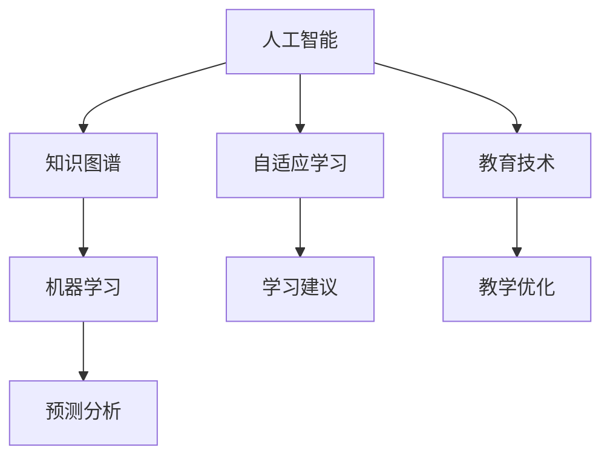

                 

# 虚拟教育平台:全球脑时代的知识获取渠道

> 关键词：虚拟教育, 人工智能, 知识图谱, 自适应学习, 机器学习, 教育技术

## 1. 背景介绍

在现代社会，信息爆炸的趋势日益显著，知识的获取和更新速度不断加快。传统的教育模式已经无法满足人们对知识不断增长的需求，如何利用先进的科技手段，构建一个高效、个性化、普及性的知识获取渠道，成为当前教育领域亟需解决的问题。

近年来，随着人工智能和大数据技术的飞速发展，虚拟教育平台应运而生，将传统的面对面教学与线上自主学习相结合，提供了一个全新的知识获取渠道。虚拟教育平台利用人工智能和大数据技术，结合最新的教育学理论和心理学研究，为学习者提供了一个个性化、自主可控的学习环境。

本博客将深入探讨虚拟教育平台的核心概念和关键技术，分析其工作原理和实际应用场景，并展望其未来的发展方向。

## 2. 核心概念与联系

### 2.1 核心概念概述

虚拟教育平台的核心概念主要包括：

- **人工智能**：利用机器学习、自然语言处理、计算机视觉等技术，构建智能化的学习辅助系统，提供个性化的学习建议和反馈。
- **知识图谱**：通过构建结构化的知识体系，将大量知识进行分类、组织和关联，便于学习者检索和理解。
- **自适应学习**：根据学习者的学习行为、认知能力和学习偏好，动态调整学习内容和路径，提高学习效率。
- **机器学习**：通过算法模型对学习数据进行分析和预测，优化学习过程，提升学习效果。
- **教育技术**：结合最新的教育理念和实践，利用技术手段实现教育目标，改善教学质量。

这些核心概念相互联系，共同构成了虚拟教育平台的基础框架。通过深入理解这些概念，可以更好地把握虚拟教育平台的工作原理和优化方向。

### 2.2 核心概念原理和架构的 Mermaid 流程图



这个流程图展示了虚拟教育平台的核心概念之间的联系：

1. **人工智能**与**知识图谱**：通过知识图谱，人工智能可以更好地理解和获取知识，从而提供更精准的学习建议。
2. **自适应学习**：基于人工智能的预测分析和教学优化，自适应学习可以动态调整学习内容，提升学习效率。
3. **机器学习**：通过学习者的行为数据进行预测分析，不断优化学习过程。
4. **教育技术**：结合最新的教育理念和实践，利用技术手段改善教学质量。

## 3. 核心算法原理 & 具体操作步骤

### 3.1 算法原理概述

虚拟教育平台的核心算法原理主要包括：

- **推荐算法**：利用协同过滤、内容推荐等技术，为学习者推荐个性化的学习内容和路径。
- **自适应算法**：通过学习者的学习行为和认知能力，动态调整学习内容和难度，实现自适应学习。
- **机器学习算法**：通过分析学习者的行为数据，预测学习者的学习效果，优化学习路径。

这些算法共同构成了虚拟教育平台的智能化核心，使其能够实现个性化的知识获取和智能化学习。

### 3.2 算法步骤详解

虚拟教育平台的算法步骤主要包括：

1. **数据收集**：收集学习者的学习行为、认知能力、兴趣爱好等数据。
2. **数据预处理**：对收集的数据进行清洗、归一化等预处理，以便进行后续的分析和建模。
3. **特征提取**：从预处理后的数据中提取有用的特征，用于构建推荐模型和自适应模型。
4. **模型训练**：利用机器学习算法，对提取的特征进行训练，构建推荐模型和自适应模型。
5. **模型评估**：对训练好的模型进行评估，选择最优的模型。
6. **模型应用**：将训练好的模型应用到实际的学习过程中，实现个性化推荐和自适应学习。

### 3.3 算法优缺点

虚拟教育平台的算法优点主要包括：

- **个性化推荐**：根据学习者的兴趣爱好和认知能力，提供个性化的学习内容和路径。
- **自适应学习**：动态调整学习内容和难度，提高学习效率。
- **智能化辅助**：利用人工智能和大数据技术，提供智能化的学习辅助系统。

算法缺点主要包括：

- **数据隐私**：学习者的数据隐私保护是一个重要的问题，需要在算法设计中加以考虑。
- **模型复杂度**：一些复杂的算法模型可能需要较高的计算资源和存储资源，可能面临性能瓶颈。
- **模型可解释性**：一些算法的决策过程较为复杂，难以解释和调试，需要更多的研究和改进。

### 3.4 算法应用领域

虚拟教育平台的算法应用领域非常广泛，主要包括：

- **在线教育平台**：为学生提供个性化的学习内容和路径，提高学习效果。
- **职业培训**：为职业人士提供个性化的技能培训和职业规划，提升职业竞争力。
- **学术研究**：为研究人员提供个性化的文献推荐和研究工具，加速科研进程。
- **终身学习**：为终身学习者提供个性化的学习建议和知识获取渠道，持续提升自我。

## 4. 数学模型和公式 & 详细讲解 & 举例说明

### 4.1 数学模型构建

虚拟教育平台的数学模型主要包括以下几个方面：

- **推荐模型**：协同过滤、内容推荐等算法。
- **自适应模型**：动态调整学习内容和难度的模型。
- **机器学习模型**：分类、回归等算法。

以推荐模型为例，常见的协同过滤算法可以表示为：

$$
\text{similarity}(u, v) = \frac{1}{N} \sum_{i=1}^{N} \text{similarity}(\text{item}_i^{(u)}, \text{item}_i^{(v)})
$$

其中，$u$ 和 $v$ 分别表示两个用户，$N$ 表示物品数量，$\text{similarity}(\text{item}_i^{(u)}, \text{item}_i^{(v)})$ 表示用户 $u$ 和 $v$ 对物品 $i$ 的相似度。

### 4.2 公式推导过程

协同过滤算法中的相似度计算公式可以进一步推导为：

$$
\text{similarity}(u, v) = \frac{1}{N} \sum_{i=1}^{N} u_i v_i
$$

其中，$u_i$ 和 $v_i$ 分别表示用户 $u$ 和 $v$ 对物品 $i$ 的评分。

### 4.3 案例分析与讲解

以Netflix的协同过滤算法为例，Netflix 通过分析用户对电影和电视节目的评分，推荐个性化的内容。协同过滤算法基于用户对物品的评分进行相似度计算，从而推荐用户可能喜欢的物品。Netflix 的推荐系统基于用户的历史评分数据，实现了高度个性化的内容推荐，提升了用户的满意度。

## 5. 项目实践：代码实例和详细解释说明

### 5.1 开发环境搭建

在虚拟教育平台的开发过程中，我们需要搭建一个完整的开发环境。以下是使用Python和TensorFlow进行开发的流程：

1. 安装Python：从官网下载并安装Python，建议选择3.7及以上版本。
2. 安装TensorFlow：从官网下载并安装TensorFlow，建议选择1.15及以上版本。
3. 安装其他依赖库：安装TensorBoard、NumPy、Pandas等依赖库。

```bash
pip install tensorflow tensorboard numpy pandas
```

完成环境搭建后，即可开始开发虚拟教育平台的代码实现。

### 5.2 源代码详细实现

以下是虚拟教育平台推荐系统的源代码实现，具体实现细节包括数据预处理、特征提取、模型训练等：

```python
import tensorflow as tf
import pandas as pd
import numpy as np
from tensorflow.keras.layers import Embedding, Dense, Dot

# 读取数据
data = pd.read_csv('data.csv')

# 数据预处理
user_ids = data['user_id'].values
item_ids = data['item_id'].values
ratings = data['rating'].values

# 构建用户和物品的嵌入矩阵
user_embeddings = tf.keras.layers.Embedding(input_dim=len(user_ids), output_dim=10, mask_zero=True)(user_ids)
item_embeddings = tf.keras.layers.Embedding(input_dim=len(item_ids), output_dim=10, mask_zero=True)(item_ids)

# 构建相似度矩阵
similarity_matrix = Dot(axes=(1, 1))([user_embeddings, item_embeddings])

# 构建推荐模型
model = tf.keras.Sequential([
    Dot(axes=(1, 1), name='similarity'),
    Dense(10),
    Dense(1, activation='sigmoid')
])

# 编译模型
model.compile(loss='binary_crossentropy', optimizer='adam', metrics=['accuracy'])

# 训练模型
model.fit(similarity_matrix, ratings, epochs=10, batch_size=32)

# 评估模型
test_data = pd.read_csv('test_data.csv')
test_user_ids = test_data['user_id'].values
test_item_ids = test_data['item_id'].values
test_ratings = test_data['rating'].values

test_user_embeddings = tf.keras.layers.Embedding(input_dim=len(test_user_ids), output_dim=10, mask_zero=True)(test_user_ids)
test_item_embeddings = tf.keras.layers.Embedding(input_dim=len(test_item_ids), output_dim=10, mask_zero=True)(test_item_ids)

test_similarity_matrix = Dot(axes=(1, 1))([test_user_embeddings, test_item_embeddings])
test_ratings_pred = model.predict(test_similarity_matrix)
```

### 5.3 代码解读与分析

以上代码实现了一个简单的协同过滤推荐系统，主要包括数据预处理、嵌入矩阵构建、相似度计算和模型训练等步骤。

- 数据预处理：将用户ID和物品ID转换成独热编码形式，以便进行嵌入操作。
- 嵌入矩阵构建：使用Embedding层构建用户和物品的嵌入矩阵。
- 相似度计算：使用Dot层计算用户和物品的相似度。
- 模型训练：使用二分类交叉熵损失函数和Adam优化器训练推荐模型。
- 模型评估：在测试集上进行预测，计算预测准确率。

## 6. 实际应用场景

### 6.1 在线教育平台

在线教育平台利用虚拟教育平台的技术，为学生提供个性化的学习内容和路径，提高了学习效果。例如，Coursera和Udacity等平台通过分析学生的学习行为，提供个性化的课程推荐和学习路径，提升了学生的学习体验和成绩。

### 6.2 职业培训

职业培训领域利用虚拟教育平台，为职业人士提供个性化的技能培训和职业规划，提升职业竞争力。例如，LinkedIn Learning平台通过分析用户的学习历史和兴趣，推荐个性化的课程和学习路径，帮助用户提升职业技能。

### 6.3 学术研究

学术研究领域利用虚拟教育平台，为研究人员提供个性化的文献推荐和研究工具，加速科研进程。例如，Semantic Scholar平台通过分析研究人员的研究兴趣和历史文献，推荐相关的论文和研究工具，提高了科研效率。

### 6.4 终身学习

终身学习领域利用虚拟教育平台，为终身学习者提供个性化的学习建议和知识获取渠道，持续提升自我。例如，Khan Academy平台通过分析学习者的学习行为和兴趣爱好，推荐个性化的学习内容和路径，帮助学习者不断学习新知识。

## 7. 工具和资源推荐

### 7.1 学习资源推荐

为了帮助开发者系统掌握虚拟教育平台的核心技术，以下是一些优质的学习资源推荐：

1. Coursera《深度学习与自然语言处理》课程：由斯坦福大学教授讲授，涵盖了深度学习和自然语言处理的基本概念和前沿技术。
2. Udacity《人工智能与机器学习》纳米学位：系统讲解人工智能和机器学习的基本原理和实践应用，包括推荐系统等内容。
3. TensorFlow官方文档：详细介绍了TensorFlow的各项功能和应用，是学习和实践虚拟教育平台的重要资料。
4. PyTorch官方文档：介绍了PyTorch的基本概念和应用，是深度学习领域的重要工具。
5. Kaggle平台：提供大量的数据集和竞赛任务，可以帮助开发者练习和应用虚拟教育平台的技术。

### 7.2 开发工具推荐

为了提高开发效率，以下是一些常用的开发工具推荐：

1. Visual Studio Code：支持多种编程语言和扩展，是开发虚拟教育平台的常用工具。
2. Jupyter Notebook：支持代码、文档和结果的一体化展示，是数据分析和机器学习常用的开发工具。
3. TensorBoard：提供模型训练和性能分析的工具，帮助开发者调试和优化虚拟教育平台。
4. Docker：支持容器化部署，方便开发者快速搭建虚拟教育平台的开发环境。
5. Git：支持版本控制和协作开发，是虚拟教育平台开发中的必备工具。

### 7.3 相关论文推荐

以下是几篇虚拟教育平台相关的经典论文，推荐阅读：

1. 《推荐系统：理论与算法》：介绍了推荐系统的基本原理和算法，是推荐系统领域的重要参考书。
2. 《自适应学习：设计与实现》：介绍了自适应学习的概念和算法，是自适应学习领域的重要文献。
3. 《知识图谱构建与应用》：介绍了知识图谱的基本概念和应用，是知识图谱领域的重要参考。
4. 《基于深度学习的在线教育平台》：介绍了深度学习在在线教育平台中的应用，是教育技术领域的重要文献。
5. 《终身学习：理论与实践》：介绍了终身学习的基本概念和实践应用，是终身学习领域的重要文献。

## 8. 总结：未来发展趋势与挑战

### 8.1 研究成果总结

本文对虚拟教育平台的核心概念和关键技术进行了深入探讨，分析了其工作原理和实际应用场景，展望了其未来的发展方向。虚拟教育平台通过人工智能和大数据技术，为学习者提供个性化、自主可控的学习环境，提高了学习效率和效果。

### 8.2 未来发展趋势

虚拟教育平台的未来发展趋势主要包括以下几个方面：

1. **智能化程度提升**：通过更先进的算法和模型，提升虚拟教育平台的智能化程度，实现更精准的推荐和自适应学习。
2. **跨平台无缝衔接**：实现虚拟教育平台在不同平台之间的无缝衔接，提高用户的使用体验。
3. **隐私保护加强**：加强用户数据隐私保护，建立可信的隐私保护机制，确保用户数据的安全性。
4. **多模态学习支持**：支持多模态学习，结合文本、图像、视频等多种信息源，提升学习效果。
5. **教育场景深度融合**：深入融合虚拟教育平台与传统的教学场景，实现线上线下的融合，提升教学质量。

### 8.3 面临的挑战

虚拟教育平台在发展过程中面临以下挑战：

1. **数据隐私和安全**：用户数据隐私保护是一个重要的问题，需要在算法设计中加以考虑。
2. **模型复杂度和计算资源**：一些复杂的算法模型可能需要较高的计算资源和存储资源，可能面临性能瓶颈。
3. **模型可解释性**：一些算法的决策过程较为复杂，难以解释和调试，需要更多的研究和改进。
4. **用户接受度**：虚拟教育平台的推广和应用需要用户接受度的提升，需要进行大量宣传和教育。
5. **教育公平性**：虚拟教育平台的普及需要考虑到教育公平性问题，避免加剧数字鸿沟。

### 8.4 研究展望

未来的研究需要在以下几个方面寻求新的突破：

1. **隐私保护算法**：开发更高效的隐私保护算法，保障用户数据的安全性。
2. **跨平台技术**：研究跨平台无缝衔接的技术，提升用户体验。
3. **多模态学习**：研究多模态学习算法，支持多模态信息的融合。
4. **教育公平性**：研究教育公平性问题，提升虚拟教育平台的普及度。
5. **用户体验设计**：研究用户体验设计，提升用户接受度和满意度。

总之，虚拟教育平台的发展前景广阔，但在推广和应用过程中，仍需要解决诸多挑战。只有通过不断的研究和优化，才能实现虚拟教育平台的普及和应用，为全球脑时代的知识获取渠道提供新的可能性。

## 9. 附录：常见问题与解答

**Q1：虚拟教育平台如何保证用户数据的安全性？**

A: 虚拟教育平台通过以下方式保障用户数据的安全性：

1. **数据加密**：对用户数据进行加密存储和传输，防止数据泄露。
2. **访问控制**：通过身份验证和权限管理，确保只有授权用户可以访问和修改数据。
3. **数据匿名化**：对用户数据进行匿名化处理，保护用户隐私。
4. **安全审计**：建立安全审计机制，定期检查和评估系统的安全性。
5. **合规性保障**：遵循相关的法律法规和行业标准，确保数据处理的合规性。

**Q2：虚拟教育平台如何实现个性化推荐？**

A: 虚拟教育平台通过以下方式实现个性化推荐：

1. **协同过滤**：通过分析用户对物品的评分数据，推荐用户可能喜欢的物品。
2. **内容推荐**：根据用户的历史行为数据，推荐相关的内容。
3. **协同增强**：结合协同过滤和内容推荐，提供更加精准的推荐结果。
4. **多模态推荐**：结合文本、图像、视频等多种信息源，提升推荐效果。

**Q3：虚拟教育平台如何实现自适应学习？**

A: 虚拟教育平台通过以下方式实现自适应学习：

1. **用户模型构建**：构建用户的学习模型，包括认知能力、兴趣爱好、学习行为等。
2. **动态调整学习路径**：根据用户的学习模型，动态调整学习内容和难度。
3. **个性化学习建议**：提供个性化的学习建议和反馈，帮助用户更好地学习。

**Q4：虚拟教育平台如何处理大规模数据？**

A: 虚拟教育平台处理大规模数据的主要方式包括：

1. **分布式计算**：使用分布式计算框架，如Hadoop、Spark等，处理大规模数据。
2. **数据分片**：将大规模数据分片处理，提高数据处理的效率。
3. **数据压缩**：对数据进行压缩存储，减少存储空间需求。
4. **增量更新**：采用增量更新技术，实时更新数据，减少计算资源的消耗。

**Q5：虚拟教育平台如何提升用户体验？**

A: 虚拟教育平台通过以下方式提升用户体验：

1. **界面设计**：设计简洁、易用的用户界面，提升用户的操作体验。
2. **个性化推荐**：提供个性化的推荐内容，提升用户的兴趣度和满意度。
3. **自适应学习**：提供自适应学习路径，提高学习效率和效果。
4. **实时反馈**：提供实时的学习反馈，帮助用户及时调整学习策略。

**Q6：虚拟教育平台如何处理跨平台问题？**

A: 虚拟教育平台处理跨平台问题的主要方式包括：

1. **数据同步**：实现不同平台之间的数据同步，保证数据的一致性。
2. **API接口设计**：设计统一的API接口，支持不同平台之间的交互。
3. **跨平台框架**：使用跨平台框架，如Flutter、React Native等，实现多平台的开发和部署。
4. **客户端优化**：优化不同平台上的客户端，提升用户体验。

---

作者：禅与计算机程序设计艺术 / Zen and the Art of Computer Programming

