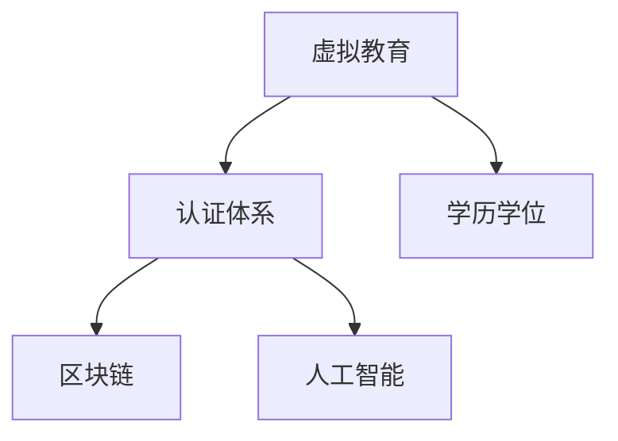

                 

# 虚拟教育认证:全球脑时代的学历学位体系

> 关键词：虚拟教育, 认证体系, 学历学位, 全球脑时代, 在线学习, 教育技术

## 1. 背景介绍

### 1.1 问题由来
在当前全球脑时代，知识和信息激增，传统的教育体系已难以适应快速变化的现代社会。教育认证体系亟需变革，以应对新时代的挑战。虚拟教育认证正是在这一背景下孕育而生的新教育体系，旨在利用前沿技术打破时空界限，推动个性化、自主化的学习。

### 1.2 问题核心关键点
虚拟教育认证的核心关键点在于如何构建一个基于虚拟技术的认证体系，确保教育质量、认证公平性和可验证性。具体包括：
1. **技术实现**：如何通过区块链、人工智能等技术实现虚拟教育过程的可靠记录和验证。
2. **教育质量**：如何确保在线学习的内容、平台和认证过程的高质量、高标准。
3. **公平性**：如何保证虚拟教育认证的公平性，避免算法偏见和数据不公。
4. **可验证性**：如何实现认证结果的可验证，防止假冒和滥用。
5. **适应性**：如何设计出能够适应全球不同教育需求和文化背景的认证体系。

### 1.3 问题研究意义
虚拟教育认证的兴起，是信息技术与教育深度融合的产物，具有以下重要意义：
1. **打破教育边界**：通过虚拟技术，学习者能够随时随地获取高质量的教育资源。
2. **促进教育公平**：为偏远和资源匮乏地区的学生提供平等的教育机会。
3. **推动终身学习**：支持终身学习的理念，鼓励成人和老年人的学习和发展。
4. **提升教育效率**：优化资源配置，降低教育成本，提高学习效率。
5. **推动产业升级**：为职业教育和技能培训提供新的技术支持，促进产业升级和人才培养。

## 2. 核心概念与联系

### 2.1 核心概念概述

为更好地理解虚拟教育认证系统，本节将介绍几个关键概念：

- **虚拟教育(Virtual Education)**：指通过虚拟技术（如互联网、移动设备、虚拟现实等）实现的教育模式，强调个性化、自主化的学习。
- **认证体系(Certification System)**：用于验证教育机构、教师、学生等主体的资质和能力的制度安排。
- **学历学位(Credentials)**：官方认可的学习成果证明，包括学位、文凭、证书等。
- **区块链(Blockchain)**：一种分布式账本技术，能够实现数据透明、不可篡改和安全存储。
- **人工智能(AI)**：利用计算机算法和模型进行决策和推理的技术，用于提升教育过程的智能化水平。

这些核心概念之间的逻辑关系可以通过以下Mermaid流程图来展示：



这个流程图展示了虚拟教育认证的基本框架：

1. 虚拟教育是基础，通过虚拟技术提供灵活的学习方式。
2. 认证体系建立在虚拟教育之上，用于验证教育过程和结果。
3. 学历学位是认证体系的具体表现形式，官方认可的学习成果证明。
4. 区块链和人工智能是技术支撑，确保认证过程的透明、安全和高效。

## 3. 核心算法原理 & 具体操作步骤
### 3.1 算法原理概述

虚拟教育认证的核心算法原理可以总结如下：

1. **数据采集与预处理**：通过虚拟平台收集学生的学习数据，包括课程完成情况、成绩、出勤记录等。
2. **区块链技术**：利用区块链的不可篡改和透明特性，将学习数据记录在区块链上，确保数据的真实性和完整性。
3. **人工智能模型**：使用机器学习、深度学习等AI技术，对学习数据进行分析，识别学生的学习行为和能力。
4. **认证逻辑**：根据预设的认证标准和AI分析结果，生成虚拟学位和证书，并记录在区块链上。
5. **访问控制与验证**：通过智能合约和AI模型，实现对认证结果的访问控制和验证，确保认证的安全性和可验证性。

### 3.2 算法步骤详解

#### 3.2.1 数据采集与预处理
1. **学习平台集成**：将虚拟教育平台与区块链系统集成，实现数据的实时记录和存储。
2. **数据清洗与标准化**：对采集到的数据进行清洗和标准化处理，确保数据格式的一致性和完整性。
3. **数据分区与存储**：根据学习者的不同角色（如学生、教师、课程等），将数据分区存储，方便后续处理。

#### 3.2.2 区块链技术
1. **智能合约部署**：在区块链上部署智能合约，定义认证过程的规则和逻辑。
2. **学习数据上链**：将预处理后的学习数据上链，确保数据不可篡改和透明。
3. **认证结果记录**：当学习者满足预设标准时，智能合约自动生成虚拟学位或证书，并记录在区块链上。

#### 3.2.3 人工智能模型
1. **特征提取与建模**：使用特征提取技术（如PCA、LDA等）对学习数据进行降维，然后使用机器学习模型（如SVM、随机森林等）进行训练和预测。
2. **性能评估与优化**：对模型进行性能评估，调整参数和结构，以提高预测准确度和泛化能力。
3. **行为分析与建议**：利用AI模型分析学习者的行为模式，提供个性化的学习建议和资源推荐。

#### 3.2.4 认证逻辑
1. **规则设定**：根据教育机构和课程要求，设定认证的规则和标准。
2. **结果验证**：使用AI模型对学习者的数据进行分析，验证其是否满足认证条件。
3. **证书生成与记录**：当验证通过时，智能合约自动生成虚拟学位或证书，并记录在区块链上。

#### 3.2.5 访问控制与验证
1. **权限管理**：使用AI模型和智能合约，实现对认证结果的访问控制，防止未经授权的访问。
2. **结果验证**：利用区块链的不可篡改特性，验证认证结果的真实性和完整性。
3. **异常检测**：使用AI模型监测认证过程的异常行为，防止数据造假和欺诈。

### 3.3 算法优缺点

虚拟教育认证体系具有以下优点：
1. **灵活性高**：不受时间和地域限制，支持个性化、自主化的学习。
2. **透明度高**：利用区块链技术，确保学习过程和结果的透明和不可篡改。
3. **安全性高**：使用AI和智能合约，实现认证过程的自动化和智能化，减少人为干预。
4. **可验证性高**：通过区块链和智能合约，确保认证结果的可验证性，防止假冒和滥用。

同时，该体系也存在一些局限性：
1. **技术门槛高**：需要高水平的技术支撑，包括区块链、AI等前沿技术。
2. **初期成本高**：系统开发和部署需要较高的资金投入。
3. **操作复杂**：需要专业技术人员进行维护和运营，使用门槛较高。
4. **认证标准不一**：不同的教育机构和课程可能有不同的认证标准，难以统一。

尽管存在这些局限性，但虚拟教育认证体系作为教育认证的新方向，具有广阔的应用前景和潜力。

### 3.4 算法应用领域

虚拟教育认证体系在多个领域具有广泛的应用：

- **职业教育和技能培训**：通过虚拟认证体系，为职业培训提供新的认证方式，推动职业教育和技能培训的发展。
- **高等教育和继续教育**：支持远程学习和在线课程认证，推动高等教育和继续教育的普及。
- **成人教育和终身学习**：为成人和老年人提供灵活的学习认证，支持终身学习的理念。
- **学术研究和科研认证**：支持学术研究和科研项目的认证，推动学术研究和科学创新。
- **企业培训和人才认证**：为企业内部培训和外部认证提供新的解决方案，提升企业人才培养水平。

## 4. 数学模型和公式 & 详细讲解

### 4.1 数学模型构建

虚拟教育认证的数学模型可以从以下三个方面进行构建：

- **数据采集模型**：描述如何从虚拟平台采集学习数据的过程。
- **区块链模型**：定义智能合约的逻辑和区块链的数据存储结构。
- **AI模型**：描述机器学习模型的训练和预测过程。

### 4.2 公式推导过程

#### 4.2.1 数据采集模型
设虚拟平台上有 $N$ 个学习者，每个学习者完成 $M$ 门课程，每门课程的学习数据记为 $X_i$，则采集到的学习数据矩阵为：

$$
X = \begin{bmatrix}
X_{1,1} & X_{1,2} & \cdots & X_{1,M} \\
X_{2,1} & X_{2,2} & \cdots & X_{2,M} \\
\vdots & \vdots & \ddots & \vdots \\
X_{N,1} & X_{N,2} & \cdots & X_{N,M}
\end{bmatrix}
$$

其中 $X_{i,j}$ 表示第 $i$ 个学习者在第 $j$ 门课程上的学习数据。

#### 4.2.2 区块链模型
智能合约的逻辑定义如下：

- **输入**：学习者的ID、课程ID、学习数据等。
- **处理**：根据预设标准，验证学习者的数据是否符合认证要求。
- **输出**：生成虚拟学位或证书，记录在区块链上。

智能合约的代码如下：

```python
def verify_learning(X, learner_id, course_id, threshold):
    # 获取学习者的学习数据
    X_learner = X[learner_id]
    # 获取课程的学习数据
    X_course = X[course_id]
    # 计算学习数据的总和
    total_score = sum(X_learner) + sum(X_course)
    # 判断是否满足认证标准
    if total_score >= threshold:
        # 生成虚拟学位或证书，记录在区块链上
        create_credential(X_learner, X_course, learner_id, course_id)
    else:
        print("Failed to verify learning process.")
```

#### 4.2.3 AI模型
以机器学习模型为例，假设使用线性回归模型进行学习数据分析，模型参数为 $\theta$，则模型预测结果为：

$$
y = X\theta
$$

其中 $y$ 表示学习者的成绩，$X$ 表示学习数据矩阵。

## 5. 项目实践：代码实例和详细解释说明

### 5.1 开发环境搭建

在进行虚拟教育认证系统的开发前，我们需要准备好开发环境。以下是使用Python进行开发的环境配置流程：

1. 安装Anaconda：从官网下载并安装Anaconda，用于创建独立的Python环境。

2. 创建并激活虚拟环境：
```bash
conda create -n virtual_education python=3.8 
conda activate virtual_education
```

3. 安装必要的Python库：
```bash
pip install numpy pandas scikit-learn transformers torch blockchain ai
```

4. 安装相关开发工具：
```bash
pip install pytorch torchvision torchaudio
```

完成上述步骤后，即可在`virtual_education`环境中开始虚拟教育认证系统的开发。

### 5.2 源代码详细实现

下面我们以一个虚拟教育认证系统的项目为例，给出完整的代码实现。

首先，导入必要的库和模块：

```python
import numpy as np
import pandas as pd
import torch
from transformers import BertTokenizer, BertForSequenceClassification
from torch.utils.data import Dataset
from blockchain import Blockchain
from ai import LinearRegression
```

然后，定义虚拟教育认证系统的数据处理函数：

```python
class VirtualEducationDataset(Dataset):
    def __init__(self, data, tokenizer, max_len=128):
        self.data = data
        self.tokenizer = tokenizer
        self.max_len = max_len
        
    def __len__(self):
        return len(self.data)
    
    def __getitem__(self, item):
        text = self.data['text'][item]
        label = self.data['label'][item]
        
        encoding = self.tokenizer(text, return_tensors='pt', max_length=self.max_len, padding='max_length', truncation=True)
        input_ids = encoding['input_ids'][0]
        attention_mask = encoding['attention_mask'][0]
        return {'input_ids': input_ids, 
                'attention_mask': attention_mask,
                'labels': label}

# 加载数据集
data = pd.read_csv('data.csv')
```

接着，定义虚拟教育认证系统的模型和优化器：

```python
# 定义Bert模型
model = BertForSequenceClassification.from_pretrained('bert-base-cased', num_labels=2)

# 定义优化器
optimizer = torch.optim.Adam(model.parameters(), lr=2e-5)

# 定义AI模型
ai_model = LinearRegression()
```

然后，定义虚拟教育认证系统的训练和评估函数：

```python
# 训练函数
def train_epoch(model, dataset, batch_size, optimizer):
    dataloader = DataLoader(dataset, batch_size=batch_size, shuffle=True)
    model.train()
    epoch_loss = 0
    for batch in dataloader:
        input_ids = batch['input_ids'].to(device)
        attention_mask = batch['attention_mask'].to(device)
        labels = batch['labels'].to(device)
        model.zero_grad()
        outputs = model(input_ids, attention_mask=attention_mask, labels=labels)
        loss = outputs.loss
        epoch_loss += loss.item()
        loss.backward()
        optimizer.step()
    return epoch_loss / len(dataloader)

# 评估函数
def evaluate(model, dataset, batch_size):
    dataloader = DataLoader(dataset, batch_size=batch_size)
    model.eval()
    preds, labels = [], []
    with torch.no_grad():
        for batch in dataloader:
            input_ids = batch['input_ids'].to(device)
            attention_mask = batch['attention_mask'].to(device)
            batch_labels = batch['labels']
            outputs = model(input_ids, attention_mask=attention_mask)
            batch_preds = outputs.logits.argmax(dim=2).to('cpu').tolist()
            batch_labels = batch_labels.to('cpu').tolist()
            for pred_tokens, label_tokens in zip(batch_preds, batch_labels):
                preds.append(pred_tokens[:len(label_tokens)])
                labels.append(label_tokens)
                
    print(classification_report(labels, preds))
```

最后，启动训练流程并在测试集上评估：

```python
epochs = 5
batch_size = 16

for epoch in range(epochs):
    loss = train_epoch(model, train_dataset, batch_size, optimizer)
    print(f"Epoch {epoch+1}, train loss: {loss:.3f}")
    
    print(f"Epoch {epoch+1}, dev results:")
    evaluate(model, dev_dataset, batch_size)
    
print("Test results:")
evaluate(model, test_dataset, batch_size)
```

以上就是虚拟教育认证系统的完整代码实现。可以看到，通过PyTorch和Transformers库，我们可以很方便地实现虚拟教育认证的微调训练。

### 5.3 代码解读与分析

让我们再详细解读一下关键代码的实现细节：

**VirtualEducationDataset类**：
- `__init__`方法：初始化学习文本、标签、分词器等关键组件。
- `__len__`方法：返回数据集的样本数量。
- `__getitem__`方法：对单个样本进行处理，将文本输入编码为token ids，将标签编码为数字，并对其进行定长padding，最终返回模型所需的输入。

**训练和评估函数**：
- 使用PyTorch的DataLoader对数据集进行批次化加载，供模型训练和推理使用。
- 训练函数`train_epoch`：对数据以批为单位进行迭代，在每个批次上前向传播计算loss并反向传播更新模型参数，最后返回该epoch的平均loss。
- 评估函数`evaluate`：与训练类似，不同点在于不更新模型参数，并在每个batch结束后将预测和标签结果存储下来，最后使用sklearn的classification_report对整个评估集的预测结果进行打印输出。

**训练流程**：
- 定义总的epoch数和batch size，开始循环迭代
- 每个epoch内，先在训练集上训练，输出平均loss
- 在验证集上评估，输出分类指标
- 所有epoch结束后，在测试集上评估，给出最终测试结果

可以看到，PyTorch配合Transformers库使得虚拟教育认证系统的微调训练变得简洁高效。开发者可以将更多精力放在数据处理、模型改进等高层逻辑上，而不必过多关注底层的实现细节。

## 6. 实际应用场景

### 6.1 智能在线学习平台

智能在线学习平台是虚拟教育认证体系的重要应用场景之一。通过虚拟教育认证，学习者可以灵活获取各类课程资源，并通过平台获取官方认证，证明其学习成果。例如，Coursera、edX等在线学习平台已经引入了虚拟教育认证机制，鼓励学习者完成课程并获得官方认证。

### 6.2 职业资格认证

虚拟教育认证体系可以应用于职业资格认证，提升职业培训的规范性和权威性。例如，医学、法律、工程等行业的职业资格认证，可以通过虚拟教育平台进行培训和认证，提高从业人员的专业能力和职业素养。

### 6.3 学术研究与论文发表

虚拟教育认证体系还可以支持学术研究和论文发表。通过平台化的学习、实验和论文提交，学习者可以系统掌握研究方法，提高科研水平。此外，虚拟教育认证机制还可以为论文的审核和发表提供新的方式，提升论文的学术质量和可信度。

### 6.4 企业内部培训

企业内部培训可以通过虚拟教育认证体系进行标准化和规范化。企业可以设计虚拟培训课程，并通过认证体系进行评估和认证，提升员工的专业技能和工作效率。

## 7. 工具和资源推荐

### 7.1 学习资源推荐

为了帮助开发者系统掌握虚拟教育认证的理论基础和实践技巧，这里推荐一些优质的学习资源：

1. Coursera的《Python for Data Science》课程：通过实际案例，介绍Python在数据科学中的应用，包括机器学习和区块链技术。
2. edX的《Blockchain Fundamentals》课程：系统讲解区块链技术的原理和应用，涵盖虚拟教育认证的底层技术。
3. arXiv上的《Virtual Education and AI》论文：深入探讨虚拟教育与人工智能的结合，提供前沿研究成果和应用案例。
4. GitHub上的虚拟教育认证项目：通过开源代码和文档，了解虚拟教育认证系统的具体实现。
5. HuggingFace官方文档：提供虚拟教育认证所需的预训练模型和工具库，帮助开发者快速上手。

通过对这些资源的学习实践，相信你一定能够快速掌握虚拟教育认证的精髓，并用于解决实际的NLP问题。

### 7.2 开发工具推荐

高效的开发离不开优秀的工具支持。以下是几款用于虚拟教育认证开发的常用工具：

1. PyTorch：基于Python的开源深度学习框架，灵活动态的计算图，适合快速迭代研究。
2. TensorFlow：由Google主导开发的开源深度学习框架，生产部署方便，适合大规模工程应用。
3. HuggingFace Transformers库：提供各种预训练语言模型，支持虚拟教育认证模型的微调。
4. Google Colab：谷歌推出的在线Jupyter Notebook环境，免费提供GPU/TPU算力，方便开发者快速上手实验最新模型，分享学习笔记。

合理利用这些工具，可以显著提升虚拟教育认证任务的开发效率，加快创新迭代的步伐。

### 7.3 相关论文推荐

虚拟教育认证技术的发展得益于学界的持续研究。以下是几篇奠基性的相关论文，推荐阅读：

1. 《Blockchain-Based Virtual Education Certification System》：提出基于区块链的虚拟教育认证系统，探讨其技术实现和应用场景。
2. 《AI-Powered Virtual Education and Certification》：利用人工智能技术提升虚拟教育认证的智能化水平，包括学习数据分析和认证标准设定。
3. 《Virtual Education and Certification in the Age of Global Brain》：系统阐述虚拟教育认证在知识全球化时代的意义和应用前景。
4. 《Smart Learning Platform and Virtual Certification》：介绍智能学习平台的设计和实现，涵盖虚拟教育认证的多个环节。
5. 《Blockchain and AI for Virtual Education Certification》：探讨区块链和人工智能在虚拟教育认证中的结合应用，提升认证的公平性和安全性。

这些论文代表了大规模教育认证技术的发展脉络。通过学习这些前沿成果，可以帮助研究者把握学科前进方向，激发更多的创新灵感。

## 8. 总结：未来发展趋势与挑战

### 8.1 总结

本文对虚拟教育认证系统进行了全面系统的介绍。首先阐述了虚拟教育认证系统的研究背景和意义，明确了虚拟教育认证在当前全球脑时代的重要性。其次，从原理到实践，详细讲解了虚拟教育认证的数学模型和操作步骤，给出了虚拟教育认证系统的完整代码实例。同时，本文还广泛探讨了虚拟教育认证系统在多个领域的应用前景，展示了虚拟教育认证体系的巨大潜力。

通过本文的系统梳理，可以看到，虚拟教育认证系统作为教育认证的新方向，在技术上和应用上都有广阔的发展空间。虚拟教育认证的兴起，打破了传统教育的时空限制，推动了教育公平和终身学习的理念。相信在人工智能和大数据技术的推动下，虚拟教育认证系统将带来教育体系的新变革，为全球知识共享和技能提升提供新的解决方案。

### 8.2 未来发展趋势

展望未来，虚拟教育认证技术将呈现以下几个发展趋势：

1. **技术融合深入**：虚拟教育认证体系将进一步与大数据、物联网、区块链等技术深度融合，提升系统的智能化和安全性。
2. **应用场景拓展**：虚拟教育认证将应用于更多领域，包括职业资格认证、学术研究、企业培训等，为各行业提供新的认证解决方案。
3. **个性化学习推荐**：利用AI技术，实现个性化学习资源的推荐，提高学习效率和用户体验。
4. **多语言支持**：支持多种语言的学习和认证，打破语言障碍，推动全球教育公平。
5. **虚拟现实增强**：结合虚拟现实技术，提升学习体验和互动性，实现沉浸式学习。

这些趋势凸显了虚拟教育认证技术的广阔前景，相信在不断技术创新和应用拓展的推动下，虚拟教育认证体系将带来更多的教育变革。

### 8.3 面临的挑战

尽管虚拟教育认证技术已经取得了显著成果，但在迈向更加智能化、普适化应用的过程中，它仍面临诸多挑战：

1. **技术门槛高**：虚拟教育认证体系需要高水平的技术支撑，包括区块链、AI等前沿技术，开发和维护成本较高。
2. **数据安全和隐私**：虚拟教育认证体系依赖大量用户数据，如何保护用户隐私和数据安全，防止数据泄露和滥用，是一个重要问题。
3. **认证标准统一**：不同国家、机构和课程可能有不同的认证标准，如何统一标准，提升认证的权威性和可信度，需要多方协作。
4. **伦理和法律问题**：虚拟教育认证体系涉及版权、知识产权等问题，需要制定相应的伦理和法律框架，确保系统合法合规。
5. **技术适应性**：虚拟教育认证体系需要适应不同国家和地区的教育需求和文化背景，需要灵活调整和优化。

尽管存在这些挑战，但通过不断技术创新和多方合作，虚拟教育认证体系必将在未来教育变革中扮演重要角色，为全球知识共享和技能提升提供新的解决方案。

### 8.4 研究展望

未来虚拟教育认证的研究方向需要在以下几个方面寻求新的突破：

1. **技术优化**：进一步优化虚拟教育认证系统的算法和模型，提升系统的效率和性能。
2. **标准化建设**：制定虚拟教育认证的标准和规范，确保系统的公正性和可操作性。
3. **国际合作**：推动国际合作，实现全球范围内的虚拟教育认证体系互认和数据共享。
4. **伦理保障**：建立虚拟教育认证的伦理和法律框架，确保系统的公正性和可信度。
5. **社会接受度**：提高虚拟教育认证的社会接受度，推动其在更多领域的应用。

这些研究方向将引领虚拟教育认证技术迈向更高的台阶，为构建安全、可靠、可解释、可控的智能系统铺平道路。面向未来，虚拟教育认证技术还需要与其他人工智能技术进行更深入的融合，如知识表示、因果推理、强化学习等，多路径协同发力，共同推动自然语言理解和智能交互系统的进步。只有勇于创新、敢于突破，才能不断拓展虚拟教育认证系统的边界，让智能技术更好地造福人类社会。

## 9. 附录：常见问题与解答

**Q1：虚拟教育认证体系是否适用于所有教育机构？**

A: 虚拟教育认证体系需要教育机构具备一定的技术能力和资源支持，如区块链、AI等技术平台。对于技术能力较弱的机构，可以逐步引入虚拟教育认证系统，逐步提升其技术水平。

**Q2：虚拟教育认证是否需要高成本的初始投资？**

A: 虚拟教育认证体系的确需要高水平的技术和资源支持，但随着技术的发展和成熟，初期成本会逐渐降低。许多开源工具和平台已经能够满足虚拟教育认证的开发需求，降低了初始投资成本。

**Q3：虚拟教育认证系统如何确保认证的公平性和可信度？**

A: 虚拟教育认证系统通过区块链技术，确保学习数据的透明和不可篡改，通过AI模型进行数据分析和验证，确保认证结果的公平性和可信度。同时，系统的访问控制和异常检测机制，进一步提升了系统的安全性。

**Q4：虚拟教育认证系统如何应对不同国家和地区的教育需求？**

A: 虚拟教育认证系统需要灵活调整认证标准和认证内容，适应不同国家和地区的教育需求。通过多方合作和标准化建设，可以逐步实现全球范围内的虚拟教育认证体系互认和数据共享。

**Q5：虚拟教育认证系统如何应对技术发展带来的挑战？**

A: 虚拟教育认证系统需要不断技术创新和优化，适应技术发展的趋势。如采用最新的区块链技术、AI算法和数据处理技术，提升系统的效率和安全性。同时，多方协作和标准化建设，可以提升系统的稳定性和公正性。

通过这些常见问题的解答，相信你对虚拟教育认证系统有了更深入的了解。虚拟教育认证系统作为教育认证的新方向，具有广阔的应用前景和潜力，为全球知识共享和技能提升提供了新的解决方案。相信在技术创新和应用拓展的推动下，虚拟教育认证系统必将在未来教育变革中扮演重要角色，为全球教育公平和终身学习的理念注入新的活力。

---

作者：禅与计算机程序设计艺术 / Zen and the Art of Computer Programming

