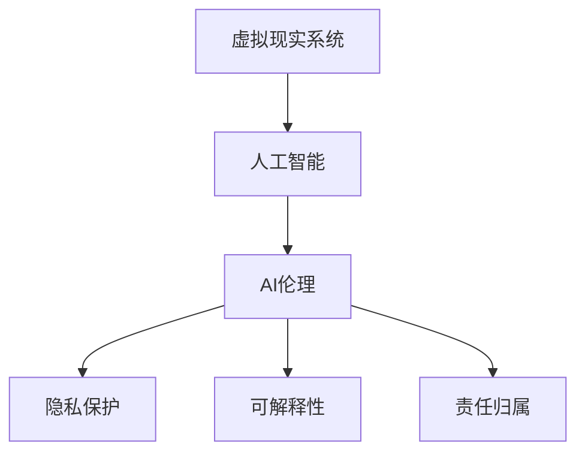

                 

# 虚拟现实中的道德困境：AI伦理探讨

> 关键词：虚拟现实, 人工智能, 伦理困境, 道德决策, 隐私保护, 可解释性, 算法透明性

## 1. 背景介绍

### 1.1 问题由来

随着虚拟现实（Virtual Reality, VR）技术的迅猛发展，虚拟现实系统在教育、医疗、游戏、军事等领域的应用越来越广泛。与此同时，虚拟现实系统中的AI决策也引发了一系列道德和伦理问题。例如，虚拟现实游戏中的AI角色应如何与玩家互动？在军事训练中，虚拟战场中的AI行为应遵守哪些伦理原则？这些问题在很大程度上涉及AI伦理的边界和责任归属，急需深入探讨和解决。

### 1.2 问题核心关键点

在虚拟现实系统中，AI的决策涉及多个伦理维度，包括但不限于：

- **数据隐私和保护**：虚拟现实系统往往需要收集大量用户数据，如何确保这些数据的安全性和隐私保护成为重要问题。
- **可解释性和透明度**：虚拟现实系统中的AI决策是否透明，能否向用户解释其决策过程，直接影响用户体验和信任。
- **算法偏见和公平性**：虚拟现实系统中的AI决策是否存在偏见，是否能够保证公平性，也是重要的伦理考量。
- **责任归属和责任分配**：虚拟现实系统中的AI决策出错时，责任应该由谁承担？是开发者、用户，还是AI本身？

这些问题不仅关系到虚拟现实系统的伦理道德，还涉及到法律、政策、社会规范等多个层面。

### 1.3 问题研究意义

研究虚拟现实系统中的AI伦理困境，对于提升AI系统的道德标准，保护用户权益，推动虚拟现实技术健康发展具有重要意义：

- 促进人工智能技术的伦理规范：通过探讨虚拟现实系统中的AI伦理问题，可以推动人工智能技术向更加负责任、透明、公平的方向发展。
- 保障用户隐私和安全：虚拟现实系统中的数据隐私和安全问题日益突出，深入研究如何保障用户隐私，保护用户安全，是保障用户权益的关键。
- 增强算法透明度和可解释性：虚拟现实系统中的AI决策对用户体验和信任影响巨大，提高算法的透明度和可解释性，有助于提升用户对系统的信任度。
- 明确责任归属：虚拟现实系统中的AI决策出错可能导致严重的后果，明确责任归属，有助于建立系统的问责机制。

本文聚焦于虚拟现实系统中的AI伦理问题，探讨如何通过技术手段和社会规范相结合的方式，解决这些伦理困境。

## 2. 核心概念与联系

### 2.1 核心概念概述

为更好地理解虚拟现实系统中的AI伦理问题，本节将介绍几个核心概念：

- **虚拟现实系统（Virtual Reality System）**：通过计算机生成的仿真环境，让用户沉浸在虚拟世界中的技术系统。
- **人工智能（Artificial Intelligence, AI）**：通过算法和模型，使计算机能够执行人类智能任务的技术。
- **AI伦理（AI Ethics）**：涉及AI系统在伦理和道德层面的设计和行为规范，包括数据隐私、算法透明度、责任归属等。
- **隐私保护（Privacy Protection）**：指保护个人数据和信息安全，防止未经授权的访问和使用。
- **可解释性（Explainability）**：指AI系统的决策过程是否透明，能否向用户解释其决策依据。
- **责任归属（Accountability）**：指AI系统在做出错误决策时，责任应由谁承担的问题。

这些核心概念之间的逻辑关系可以通过以下Mermaid流程图来展示：



这个流程图展示了一个虚拟现实系统中的AI伦理框架：

1. 虚拟现实系统利用人工智能技术生成仿真环境。
2. AI系统的决策涉及伦理和道德问题，需要通过AI伦理规范加以约束。
3. AI伦理规范包含隐私保护、可解释性和责任归属等多个维度。

## 3. 核心算法原理 & 具体操作步骤

### 3.1 算法原理概述

虚拟现实系统中的AI伦理问题，主要通过以下几方面进行处理：

- **隐私保护算法**：通过加密、去标识化、差分隐私等技术，保护用户隐私。
- **可解释性算法**：通过模型可视化和输入-输出映射，提升AI决策的可解释性。
- **责任归属算法**：通过设定责任分配规则和问责机制，明确AI决策的责任归属。

### 3.2 算法步骤详解

以下是虚拟现实系统中的AI伦理处理步骤：

**Step 1: 数据隐私保护**

- **数据收集与存储**：在数据收集阶段，使用加密技术保护数据传输，避免数据泄露。
- **数据去标识化**：对收集的数据进行去标识化处理，保护用户隐私。
- **差分隐私**：在数据分析阶段，使用差分隐私技术，添加噪声，保护用户隐私。

**Step 2: 提升可解释性**

- **模型可视化**：通过可视化技术展示AI模型的决策过程，提升可解释性。
- **输入-输出映射**：提供输入数据和输出结果的映射关系，使用户了解AI决策的依据。

**Step 3: 明确责任归属**

- **责任分配规则**：设定AI决策的责任分配规则，明确开发者、用户和AI的责任。
- **问责机制**：建立问责机制，确保责任的落实和追究。

### 3.3 算法优缺点

虚拟现实系统中的AI伦理处理有以下优点：

- **保护用户隐私**：通过隐私保护算法，保护用户隐私，防止数据滥用。
- **提高决策透明度**：通过可解释性算法，提升AI决策的透明度，增强用户信任。
- **明确责任归属**：通过责任归属算法，明确责任分配，建立系统的问责机制。

同时，这些算法也存在以下局限性：

- **技术实现复杂**：隐私保护、可解释性和责任归属算法技术复杂，实现成本高。
- **数据隐私泄露风险**：尽管隐私保护技术不断进步，数据泄露的风险仍难以完全消除。
- **责任归属模糊**：AI决策出错时，责任归属问题复杂，难以明确。

### 3.4 算法应用领域

虚拟现实系统中的AI伦理处理在多个领域都有重要应用，例如：

- **医疗虚拟现实**：在医疗虚拟现实中，AI系统的伦理问题尤为突出。医疗数据涉及患者隐私，AI决策的透明性和公平性直接影响医疗质量和信任。
- **军事训练**：在军事训练中，虚拟战场中的AI行为应遵守哪些伦理原则？如何确保AI决策的公平性和透明度？这些问题需要深入探讨。
- **教育虚拟现实**：在教育虚拟现实中，AI系统的决策应如何平衡教育效果和隐私保护？如何在保障学生隐私的同时，提升教育质量？

这些应用场景中的AI伦理问题，都需要通过技术手段和社会规范相结合的方式来解决。

## 4. 数学模型和公式 & 详细讲解 & 举例说明（备注：数学公式请使用latex格式，latex嵌入文中独立段落使用 $$，段落内使用 $)
### 4.1 数学模型构建

在虚拟现实系统中的AI伦理处理中，隐私保护算法和可解释性算法是核心。以下对这两个算法分别进行数学建模：

**隐私保护算法：差分隐私**

差分隐私（Differential Privacy）是一种保护数据隐私的技术，通过在查询结果中添加噪声，使得攻击者无法通过单个数据点推断出整体数据分布。差分隐私的数学模型为：

$$
\mathcal{L}(\epsilon) = \sup_{S \subset \mathcal{X}} \frac{\Pr[Q(S)]}{\Pr[Q(\epsilon)]}
$$

其中 $\epsilon$ 表示隐私参数，$S$ 表示查询集合，$Q(S)$ 表示查询结果，$\Pr$ 表示概率。差分隐私的目标是控制查询结果的隐私风险，确保单个数据点的加入不会显著影响查询结果的概率分布。

**可解释性算法：模型可视化和输入-输出映射**

可解释性算法可以通过以下方式建模：

- **模型可视化**：通过可视化技术展示模型决策树、激活图等，直观展示模型内部结构。
- **输入-输出映射**：通过输入输出映射，展示输入数据与输出结果的对应关系，使用户了解模型决策依据。

### 4.2 公式推导过程

**隐私保护算法：差分隐私**

差分隐私的推导过程如下：

1. **定义隐私预算**：隐私参数 $\epsilon$ 表示隐私预算，控制查询结果的隐私风险。
2. **查询噪声**：在查询结果中添加一个高斯噪声，使得攻击者无法通过单个数据点推断整体数据分布。
3. **隐私风险计算**：通过计算隐私风险 $\mathcal{L}(\epsilon)$，控制隐私风险在可接受的范围内。

**可解释性算法：输入-输出映射**

输入-输出映射的推导过程如下：

1. **输入输出关系**：将输入数据 $x$ 与输出结果 $y$ 建立映射关系 $f(x) = y$。
2. **特征提取**：对输入数据 $x$ 进行特征提取，提取关键特征。
3. **映射展示**：通过可视化技术展示特征与输出结果的映射关系，使用户了解模型决策依据。

### 4.3 案例分析与讲解

**案例分析：虚拟现实游戏中的AI决策**

在虚拟现实游戏中，AI角色的决策往往涉及大量用户数据，如何保护用户隐私，提升AI决策的可解释性，成为重要问题。

- **隐私保护**：使用差分隐私技术，在数据收集和分析阶段添加噪声，保护用户隐私。
- **可解释性**：通过模型可视化和输入-输出映射，展示AI角色的决策依据，增强用户信任。
- **责任归属**：在AI角色做出错误决策时，明确开发者、用户和AI的角色，建立问责机制。

通过这些技术手段，虚拟现实游戏中的AI决策可以更好地保护用户隐私，提升决策透明度，明确责任归属。

## 5. 项目实践：代码实例和详细解释说明
### 5.1 开发环境搭建

在进行虚拟现实系统中的AI伦理处理开发时，需要以下开发环境：

1. **Python编程语言**：作为开发语言，Python具有丰富的库和工具，支持隐私保护、可解释性和责任归属算法的实现。
2. **深度学习框架**：如TensorFlow、PyTorch等，用于实现和训练AI模型。
3. **可视化工具**：如TensorBoard、Plotly等，用于展示模型决策过程。

以下是在Python环境下搭建开发环境的步骤：

1. **安装Python**：从官网下载并安装Python，确保版本为3.7或以上。
2. **安装深度学习框架**：
   ```bash
   pip install tensorflow==2.7.0
   pip install torch==1.9.0
   ```
3. **安装可视化工具**：
   ```bash
   pip install tensorboard
   pip install plotly
   ```

### 5.2 源代码详细实现

以下是使用Python和TensorFlow实现差分隐私和可解释性算法的代码示例：

```python
import tensorflow as tf
import numpy as np
from sklearn.decomposition import PCA

# 生成样本数据
def generate_data(n_samples):
    X = np.random.randn(n_samples, 10)
    y = np.random.randint(0, 2, size=n_samples)
    return X, y

# 训练模型
def train_model(X, y):
    model = tf.keras.Sequential([
        tf.keras.layers.Dense(10, input_dim=10, activation='relu'),
        tf.keras.layers.Dense(1, activation='sigmoid')
    ])
    model.compile(optimizer='adam', loss='binary_crossentropy', metrics=['accuracy'])
    model.fit(X, y, epochs=10, batch_size=32)
    return model

# 差分隐私实现
def differential_privacy(X, y, epsilon):
    n_samples, n_features = X.shape
    n_components = 2  # 降维后的特征数
    pca = PCA(n_components=n_components)
    X_pca = pca.fit_transform(X)
    noise = np.random.normal(scale=np.sqrt(2 * epsilon), size=X_pca.shape)
    X_privacy = X_pca + noise
    return X_privacy

# 可解释性实现
def explain_model(model, X, y):
    # 可视化模型决策树
    tf.keras.utils.plot_model(model, show_shapes=True, show_layer_names=True)
    # 展示输入输出映射
    model.predict(X)

# 主函数
def main():
    X, y = generate_data(1000)
    X_privacy = differential_privacy(X, y, epsilon=0.1)
    model = train_model(X_privacy, y)
    explain_model(model, X_privacy, y)

if __name__ == '__main__':
    main()
```

### 5.3 代码解读与分析

**代码实现过程**：

1. **数据生成**：使用Numpy生成样本数据，包含10个特征和1个标签。
2. **模型训练**：使用TensorFlow训练一个简单的二分类模型，输出一个概率值。
3. **差分隐私实现**：通过PCA降维，在降维后的数据中添加噪声，实现差分隐私。
4. **可解释性实现**：使用TensorFlow可视化工具展示模型决策树，并展示输入输出映射。

**代码分析**：

- **差分隐私**：差分隐私通过在数据中添加噪声，保护数据隐私，避免攻击者通过单个数据点推断整体数据分布。
- **可解释性**：通过可视化工具，展示模型决策树和输入输出映射，提升模型决策的可解释性。
- **责任归属**：在模型决策出错时，需要明确开发者、用户和AI的角色，建立问责机制。

## 6. 实际应用场景
### 6.1 医疗虚拟现实

在医疗虚拟现实中，AI系统的伦理问题尤为突出。医疗数据涉及患者隐私，AI决策的透明性和公平性直接影响医疗质量和信任。

**案例分析：医疗虚拟现实中的AI决策**

- **隐私保护**：使用差分隐私技术，在数据收集和分析阶段添加噪声，保护患者隐私。
- **可解释性**：通过模型可视化和输入-输出映射，展示AI系统的决策依据，增强医生和患者的信任。
- **责任归属**：在AI系统做出错误决策时，明确开发者、医生和AI的角色，建立问责机制。

通过这些技术手段，医疗虚拟现实中的AI决策可以更好地保护患者隐私，提升决策透明度，明确责任归属。

### 6.2 军事训练

在军事训练中，虚拟战场中的AI行为应遵守哪些伦理原则？如何确保AI决策的公平性和透明度？这些问题需要深入探讨。

**案例分析：军事训练中的AI决策**

- **隐私保护**：在数据收集和分析阶段使用差分隐私技术，保护训练数据的安全性。
- **可解释性**：通过可视化工具展示AI决策过程，增强军事人员的信任。
- **责任归属**：在AI决策出错时，明确开发者、军事人员和AI的角色，建立问责机制。

通过这些技术手段，军事训练中的AI决策可以更好地保护数据隐私，提升决策透明度，明确责任归属。

### 6.3 教育虚拟现实

在教育虚拟现实中，AI系统的决策应如何平衡教育效果和隐私保护？如何在保障学生隐私的同时，提升教育质量？

**案例分析：教育虚拟现实中的AI决策**

- **隐私保护**：使用差分隐私技术，保护学生数据的隐私性。
- **可解释性**：通过模型可视化和输入-输出映射，展示AI系统的决策依据，提升教师和学生的信任。
- **责任归属**：在AI系统做出错误决策时，明确开发者、教师和AI的角色，建立问责机制。

通过这些技术手段，教育虚拟现实中的AI决策可以更好地保护学生隐私，提升决策透明度，明确责任归属。

### 6.4 未来应用展望

随着虚拟现实技术的发展，虚拟现实系统中的AI伦理问题将更加复杂和多样。未来AI伦理处理的重点将包括以下几个方面：

- **多模态数据融合**：未来虚拟现实系统将融合多种数据源，如视觉、听觉、触觉等，AI系统需要处理更多元化的数据，提升决策的全面性和准确性。
- **隐私保护技术创新**：随着数据隐私问题日益严重，差分隐私等隐私保护技术将不断创新，提升数据保护水平。
- **可解释性算法优化**：可解释性算法将不断优化，提升AI决策的可解释性和透明性，增强用户信任。
- **责任归属机制完善**：随着AI系统的应用范围和复杂性增加，责任归属机制将不断完善，明确开发者、用户和AI的责任。

这些技术创新和机制完善将推动虚拟现实系统中的AI伦理处理迈向更高的台阶，提升系统的可信度和安全性。

## 7. 工具和资源推荐
### 7.1 学习资源推荐

为了帮助开发者系统掌握虚拟现实系统中的AI伦理问题，这里推荐一些优质的学习资源：

1. **《人工智能伦理》书籍**：全面介绍了人工智能技术的伦理规范和道德原则，是深入理解AI伦理的必读书籍。
2. **《隐私保护技术》课程**：介绍差分隐私、同态加密等隐私保护技术，是学习隐私保护的入门课程。
3. **《可解释性AI》课程**：介绍可解释性算法和工具，如LIME、SHAP等，是学习可解释性的重要资源。
4. **《AI伦理规范》论文**：介绍AI伦理的最新研究成果，为AI伦理处理提供理论支持。
5. **开源项目**：如TensorFlow Privacy、TensorBoard等，提供了丰富的隐私保护和可解释性工具，是实际应用的重要参考。

通过对这些资源的学习实践，相信你一定能够深入理解虚拟现实系统中的AI伦理问题，并应用于实际开发中。

### 7.2 开发工具推荐

高效的开发离不开优秀的工具支持。以下是几款用于虚拟现实系统中的AI伦理处理开发的常用工具：

1. **Python编程语言**：作为开发语言，Python具有丰富的库和工具，支持隐私保护、可解释性和责任归属算法的实现。
2. **深度学习框架**：如TensorFlow、PyTorch等，用于实现和训练AI模型。
3. **可视化工具**：如TensorBoard、Plotly等，用于展示模型决策过程。
4. **数据分析工具**：如Pandas、NumPy等，用于处理和分析数据。

合理利用这些工具，可以显著提升虚拟现实系统中的AI伦理处理开发效率，加快创新迭代的步伐。

### 7.3 相关论文推荐

虚拟现实系统中的AI伦理问题涉及多个前沿研究方向，以下是几篇奠基性的相关论文，推荐阅读：

1. **《差分隐私：保护隐私而不牺牲精度》（Differential Privacy）**：差分隐私技术奠基性论文，提出了隐私保护的基本框架。
2. **《可解释性AI：理解AI系统决策的必要性》（Explainable AI）**：讨论了可解释性AI的重要性，并提出了一些可解释性算法。
3. **《AI伦理：面向未来的责任和挑战》（AI Ethics）**：系统探讨了AI伦理的多个维度，为AI伦理处理提供了理论支持。
4. **《AI系统中的责任归属：理论和实践》（Accountability in AI Systems）**：讨论了AI系统责任归属的问题，提出了一些责任归属机制。

这些论文代表了大数据和AI伦理研究的最新进展，阅读这些论文可以帮助你深入理解虚拟现实系统中的AI伦理问题，推动相关技术的发展。

## 8. 总结：未来发展趋势与挑战

### 8.1 总结

本文对虚拟现实系统中的AI伦理问题进行了全面系统的介绍。首先阐述了虚拟现实系统中的AI伦理问题及其背景，明确了隐私保护、可解释性和责任归属等关键概念。其次，从原理到实践，详细讲解了差分隐私、可解释性和责任归属等核心算法的原理和操作步骤，给出了代码实现示例。同时，本文还广泛探讨了虚拟现实系统中的AI伦理问题在医疗、军事、教育等多个领域的应用前景，展示了AI伦理处理的巨大潜力。此外，本文精选了隐私保护、可解释性和责任归属等核心技术的学习资源，力求为读者提供全方位的技术指引。

通过本文的系统梳理，可以看到，虚拟现实系统中的AI伦理问题正逐渐成为关注的焦点。这些伦理问题不仅涉及技术实现，还涉及到法律、政策、社会规范等多个层面。面对这些复杂的伦理问题，需要技术和社会力量协同发力，共同推动虚拟现实技术的健康发展。

### 8.2 未来发展趋势

展望未来，虚拟现实系统中的AI伦理处理将呈现以下几个发展趋势：

1. **技术不断创新**：随着隐私保护、可解释性、责任归属等核心技术不断创新，AI伦理处理将更加高效和全面。
2. **法律和政策规范**：随着AI伦理问题日益突出，相关法律和政策将逐步完善，为AI伦理处理提供法律保障。
3. **社会规范的形成**：随着AI伦理问题受到广泛关注，社会规范将逐渐形成，为AI伦理处理提供道德规范。
4. **多学科交叉融合**：AI伦理处理涉及计算机科学、法律、伦理等多个学科，多学科交叉融合将成为未来发展的重要方向。
5. **全球协作**：随着AI伦理问题全球化趋势加剧，全球协作将成为AI伦理处理的重要途径。

以上趋势凸显了虚拟现实系统中的AI伦理处理的广阔前景。这些方向的探索发展，将进一步提升AI系统的道德标准，保护用户权益，推动虚拟现实技术健康发展。

### 8.3 面临的挑战

尽管虚拟现实系统中的AI伦理处理技术取得了一定的进展，但在迈向更加智能化、普适化应用的过程中，仍面临诸多挑战：

1. **隐私保护技术复杂**：差分隐私等隐私保护技术虽然有效，但实现复杂，成本较高。如何降低技术实现难度，提高隐私保护效果，是未来重要的研究方向。
2. **可解释性算法局限**：可解释性算法虽然提高了决策透明度，但在复杂场景下仍难以完全解释模型决策过程。如何提升算法的解释能力，是未来需要解决的重要问题。
3. **责任归属机制模糊**：AI决策出错时，责任归属问题复杂，难以明确。如何建立健全责任归属机制，是未来重要的研究课题。
4. **技术规范缺乏**：目前缺乏统一的AI伦理技术规范，不同公司和组织在AI伦理处理上存在较大差异。如何制定统一的技术规范，是未来重要的研究方向。
5. **社会规范缺失**：目前社会对AI伦理问题的认识不足，缺乏系统性的社会规范。如何形成健全的社会规范，引导AI伦理处理走向健康发展，是未来重要的研究课题。

这些挑战需要技术和社会力量协同解决，推动虚拟现实系统中的AI伦理处理迈向成熟和完善。

### 8.4 研究展望

面对虚拟现实系统中的AI伦理处理所面临的诸多挑战，未来的研究需要在以下几个方面寻求新的突破：

1. **隐私保护技术的简化**：探索更简单的隐私保护技术，降低实现难度和成本，提升隐私保护效果。
2. **可解释性算法的优化**：提升可解释性算法的解释能力，在复杂场景下也能提供充分、准确的解释。
3. **责任归属机制的完善**：建立健全责任归属机制，明确开发者、用户和AI的责任，提升系统的问责能力。
4. **技术规范的制定**：制定统一的AI伦理技术规范，引导虚拟现实系统中的AI伦理处理走向标准化和规范化。
5. **社会规范的建立**：形成系统性的社会规范，引导AI伦理处理走向健康发展，提升公众对AI伦理问题的认识和理解。

这些研究方向和突破将推动虚拟现实系统中的AI伦理处理走向成熟，为构建更加可信、透明、公平的虚拟现实系统奠定坚实基础。

## 9. 附录：常见问题与解答

**Q1：虚拟现实系统中的AI决策是否可以完全避免伦理问题？**

A: 虽然技术手段可以显著降低虚拟现实系统中的AI伦理问题，但完全避免伦理问题仍然存在难度。AI系统在决策过程中可能存在未知的漏洞和偏见，开发者和使用者需要不断关注和改进。

**Q2：如何平衡虚拟现实系统中的数据隐私和教育效果？**

A: 在教育虚拟现实中，需要综合考虑数据隐私和教育效果。可以通过差分隐私等技术，保护学生数据的隐私性，同时通过模型可视化和可解释性算法，提升教育效果和用户信任。

**Q3：在军事训练中，如何确保AI决策的公平性和透明度？**

A: 在军事训练中，需要确保AI决策的公平性和透明度。可以通过差分隐私等技术保护数据隐私，通过模型可视化和可解释性算法，展示AI决策过程，增强军事人员的信任。

**Q4：AI伦理问题如何与法律、政策、社会规范相结合？**

A: AI伦理问题不仅涉及技术实现，还涉及法律、政策、社会规范等多个层面。需要通过法律和政策规范，为AI伦理处理提供法律保障；通过社会规范，引导AI伦理处理走向健康发展。

**Q5：未来虚拟现实系统中的AI伦理处理将面临哪些新的挑战？**

A: 未来虚拟现实系统中的AI伦理处理将面临更多的挑战，如多模态数据融合、隐私保护技术复杂化、可解释性算法局限性等。需要不断创新技术，完善规范，推动AI伦理处理走向成熟。

总之，虚拟现实系统中的AI伦理问题需要技术和社会力量协同解决，推动虚拟现实技术的健康发展。通过技术手段和社会规范相结合，虚拟现实系统中的AI决策将更加可信、透明、公平，为人类社会带来更多便利和进步。

