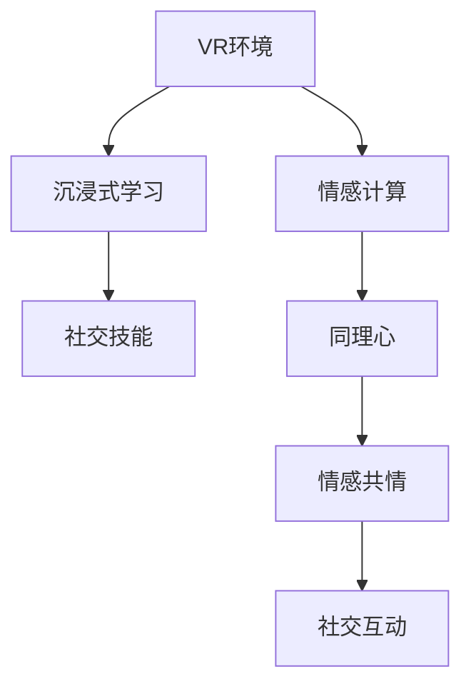

                 

# 虚拟现实同理心培训创业：沉浸式社交技能提升

> 关键词：虚拟现实(VR), 同理心训练, 社交技能, 沉浸式学习, 人机交互, 情感计算, 沉浸式游戏, 心理治疗, 教育应用

## 1. 背景介绍

### 1.1 问题由来

随着社会进步和信息技术的发展，人类交往方式发生了深刻的变化。数字设备和互联网的普及，使人们越来越多地依赖虚拟世界进行社交互动，带来了丰富的沟通方式和更广阔的社交空间，但也暴露出一系列新的挑战。尤其是当面对虚拟世界的陌生交互对象时，个体往往缺乏对对方心理状态的准确感知和有效同理心。缺乏同理心的交互不仅影响用户体验，更会导致社会隔阂与冲突。

特别是对于青少年、职场新人、自闭症患者、老年群体等易出现同理心问题的特殊人群，在虚拟环境中培养和提升同理心尤为重要。但是，传统的同理心训练方法往往难以模拟真实情境，效果有限。因此，将虚拟现实(VR)技术引入同理心培训，通过沉浸式、互动性的体验，提供更真实的社交场景，成为解决这一问题的有效途径。

### 1.2 问题核心关键点

同理心培训的核心在于帮助个体理解并共情他人的情感状态，从而提升其社会互动能力。其主要关键点包括：

1. **虚拟环境构建**：通过VR技术创建与现实世界尽可能相似的环境，使受训者沉浸其中。
2. **情感共情学习**：通过模拟真实情境，让受训者在虚拟世界中体验他人的情感和行为，学习如何识别和共情。
3. **互动反馈机制**：实时获取受训者的反应，提供及时反馈，强化正确行为，矫正错误行为。
4. **学习效果评估**：通过客观指标和心理评估，量化同理心培训的效果。

基于上述关键点，本文将系统探讨虚拟现实同理心培训的原理、技术和实践，帮助读者理解这一新兴领域。

## 2. 核心概念与联系

### 2.1 核心概念概述

虚拟现实同理心培训是一种利用VR技术进行情感共情训练的方法，旨在通过沉浸式、互动性的体验，提升个体对他人情感的识别和共情能力。其核心概念包括：

- **虚拟现实(VR)**：一种通过计算机技术生成的模拟环境，使用户能够沉浸其中，感受到身临其境的效果。
- **同理心**：指个体能够感知和理解他人情感的能力，即情感共情能力。
- **沉浸式学习**：一种深度参与式学习方式，通过创造高度真实的学习环境，使学习者获得更强的情感和认知体验。
- **情感计算**：利用计算技术识别、理解、生成和影响人类情感的能力。
- **人机交互**：通过自然交互界面，使用户与计算机系统进行信息交换的过程。
- **社交技能**：个体在社会互动中表现出来的能力，包括倾听、表达、合作等。

这些概念之间存在紧密联系，共同构成了虚拟现实同理心培训的完整框架。例如，通过虚拟现实技术构建的沉浸式学习环境，可以有效模拟真实社交场景，帮助个体练习和提升社交技能，同时激发其情感共鸣，增强同理心。

### 2.2 核心概念原理和架构的 Mermaid 流程图



这个流程图展示了大语言模型微调的核心概念及其之间的关系：

1. VR环境是沉浸式学习的基础。
2. 通过情感计算，VR环境可以模拟真实社交场景，激发受训者的情感体验。
3. 社交技能训练依赖于情感共情学习。
4. 同理心是情感共情训练的核心目标。
5. 最终通过社交互动，实现情感共鸣和行为改进。

## 3. 核心算法原理 & 具体操作步骤

### 3.1 算法原理概述

虚拟现实同理心培训的算法原理主要基于情感共情学习和社交技能训练。以下是详细的算法原理概述：

1. **情感共情学习**：通过VR环境中的模拟交互，受训者学习识别和理解他人的情感状态。具体而言，系统通过模拟不同情境，使受训者在虚拟环境中经历他人的情感变化，从而学会共情。

2. **社交技能训练**：在情感共情学习的基础上，受训者通过互动反馈机制，反复练习社交技能。系统会实时记录受训者的行为和情感反应，提供即时反馈，强化正确行为，矫正错误行为。

### 3.2 算法步骤详解

以下是虚拟现实同理心培训的详细步骤：

**Step 1: 数据采集与VR环境设计**
- 采集现实世界中的社交互动场景数据，构建虚拟世界模型。
- 设计沉浸式学习环境，包括场景布局、人物动作、交互界面等。

**Step 2: 情感共情学习**
- 模拟真实社交场景，让受训者通过VR设备进入虚拟环境。
- 通过情感计算技术，实时识别受训者的情感状态，并与虚拟环境中的人物情感变化同步。
- 受训者在虚拟环境中练习识别他人的情感，通过不断的模拟体验，提升同理心。

**Step 3: 社交技能训练**
- 设计互动反馈机制，使受训者在虚拟环境中模拟真实社交情境。
- 记录受训者的行为和情感反应，实时提供反馈和指导。
- 受训者通过多次练习和反馈，逐步掌握正确的社交技能，提升同理心。

**Step 4: 学习效果评估**
- 通过客观指标和心理评估，量化受训者的同理心和社交技能提升效果。
- 根据评估结果，调整培训内容和方法，持续优化培训效果。

### 3.3 算法优缺点

虚拟现实同理心培训具有以下优点：

1. **高度沉浸式**：通过VR技术创建高度真实的环境，使受训者能够深度沉浸其中，获得更强烈的情感体验。
2. **互动性强**：通过实时互动和即时反馈，使受训者能够主动参与训练，提高学习效果。
3. **多场景模拟**：能够模拟多种真实社交情境，覆盖更多样化的情感和行为变化，提升受训者的同理心泛化能力。
4. **安全可控**：在虚拟环境中进行训练，没有现实世界的潜在风险，可以反复练习，逐步提升技能。

但同时也存在一些缺点：

1. **设备成本高**：VR设备价格昂贵，维护和更新成本较高，推广难度较大。
2. **技术复杂度高**：需要多学科团队合作，开发难度大，技术要求高。
3. **操作复杂**：受训者需要一定的技术操作基础，学习曲线较陡。
4. **心理适应性**：部分受训者可能对VR环境产生抵触情绪，影响培训效果。

### 3.4 算法应用领域

虚拟现实同理心培训在多个领域具有广泛应用前景，包括但不限于：

1. **青少年教育**：通过虚拟游戏和互动故事，帮助青少年理解和共情他人情感，培养良好的人际交往能力。
2. **职场培训**：提升职场新人的同理心和社交技能，增强团队协作和工作沟通效果。
3. **心理健康**：通过虚拟现实技术进行心理治疗，帮助自闭症患者和抑郁症患者更好地理解和共情他人情感，改善心理健康状态。
4. **老年群体**：帮助老年人提升社交技能，改善孤独感和社交隔离问题，增强社会参与度。
5. **特殊教育**：通过虚拟环境进行特殊教育，帮助有特殊需求的学生理解他人的情感和行为，促进社交融合。

## 4. 数学模型和公式 & 详细讲解

### 4.1 数学模型构建

在虚拟现实同理心培训中，情感共情学习可以形式化为数学模型，用于量化受训者的情感状态和共情能力。

设情感状态空间为 $\mathcal{E}$，共情能力空间为 $\mathcal{S}$，模型 $f$ 的输入为虚拟环境中的交互数据 $x \in \mathcal{X}$，输出为受训者的情感状态 $y \in \mathcal{E}$ 和共情能力 $s \in \mathcal{S}$。情感共情学习可以表示为：

$$
\min_{\theta} \mathcal{L}(f_{\theta}(x), y, s)
$$

其中 $\theta$ 为模型参数，$\mathcal{L}$ 为损失函数，用于衡量模型预测的情感状态和共情能力与真实值之间的差异。

### 4.2 公式推导过程

以情感识别为例，假设模型为全连接神经网络，其输出为情感状态 $\hat{y}$，则模型可以表示为：

$$
\hat{y} = \sigma(\mathbf{W}x + \mathbf{b})
$$

其中 $\mathbf{W}$ 和 $\mathbf{b}$ 分别为模型权重和偏置，$\sigma$ 为激活函数。通过最小化均方误差损失，训练得到模型参数 $\theta$：

$$
\mathcal{L}(y, \hat{y}) = \frac{1}{N} \sum_{i=1}^N (y_i - \hat{y}_i)^2
$$

在社交技能训练中，假设模型输出为受训者的行为反应 $a$，则模型可以表示为：

$$
a = \mathbf{W}x + \mathbf{b}
$$

通过最小化交叉熵损失，训练得到模型参数 $\theta$：

$$
\mathcal{L}(a, \hat{a}) = -\frac{1}{N} \sum_{i=1}^N y_i \log \hat{a}_i + (1-y_i) \log (1-\hat{a}_i)
$$

### 4.3 案例分析与讲解

以下以情感识别为例，详细讲解情感共情学习的数学模型和公式推导：

假设虚拟环境中的人物情感状态为 $y \in \{1, 2, 3, 4\}$，分别表示“开心”、“悲伤”、“愤怒”和“平静”。模型输出为 $\hat{y} \in \{1, 2, 3, 4\}$。情感识别模型的损失函数可以表示为：

$$
\mathcal{L}(y, \hat{y}) = \frac{1}{N} \sum_{i=1}^N (y_i - \hat{y}_i)^2
$$

在训练过程中，模型通过反向传播算法，不断调整权重和偏置，最小化损失函数，使得模型预测的情感状态逼近真实值。

## 5. 项目实践：代码实例和详细解释说明

### 5.1 开发环境搭建

为了开发虚拟现实同理心培训系统，需要搭建包含VR设备和计算平台的开发环境。以下是具体步骤：

1. **设备选择**：选择适合的VR设备，如Oculus Rift、HTC Vive等，并确保其兼容性。
2. **硬件配置**：选择高性能的计算平台，包括GPU、CPU、内存等，以支持虚拟现实环境的高帧率和低延迟。
3. **软件开发环境**：搭建Python开发环境，安装所需的库和工具包，如PyTorch、TensorFlow、PIL等。

### 5.2 源代码详细实现

以下是虚拟现实同理心培训系统的代码实现，以情感识别和社交技能训练为例：

```python
import torch
import torch.nn as nn
import torch.optim as optim
from torch.utils.data import DataLoader
import numpy as np
import os

class EmotionClassifier(nn.Module):
    def __init__(self, input_size, output_size):
        super(EmotionClassifier, self).__init__()
        self.fc1 = nn.Linear(input_size, 256)
        self.fc2 = nn.Linear(256, 256)
        self.fc3 = nn.Linear(256, output_size)
        self.softmax = nn.Softmax(dim=1)

    def forward(self, x):
        x = self.fc1(x)
        x = torch.relu(x)
        x = self.fc2(x)
        x = torch.relu(x)
        x = self.fc3(x)
        x = self.softmax(x)
        return x

class BehaviorClassifier(nn.Module):
    def __init__(self, input_size, output_size):
        super(BehaviorClassifier, self).__init__()
        self.fc1 = nn.Linear(input_size, 256)
        self.fc2 = nn.Linear(256, 256)
        self.fc3 = nn.Linear(256, output_size)
        self.softmax = nn.Softmax(dim=1)

    def forward(self, x):
        x = self.fc1(x)
        x = torch.relu(x)
        x = self.fc2(x)
        x = torch.relu(x)
        x = self.fc3(x)
        x = self.softmax(x)
        return x

def train_model(model, data_loader, criterion, optimizer, n_epochs):
    model.train()
    for epoch in range(n_epochs):
        for batch in data_loader:
            inputs, labels = batch
            optimizer.zero_grad()
            outputs = model(inputs)
            loss = criterion(outputs, labels)
            loss.backward()
            optimizer.step()

        if (epoch + 1) % 10 == 0:
            print('Epoch [{}/{}], Loss: {:.4f}'.format(epoch+1, n_epochs, loss.item()))

def evaluate_model(model, data_loader, criterion):
    model.eval()
    total_loss = 0
    correct = 0
    with torch.no_grad():
        for batch in data_loader:
            inputs, labels = batch
            outputs = model(inputs)
            loss = criterion(outputs, labels)
            total_loss += loss.item() * labels.size(0)
            _, predicted = torch.max(outputs.data, 1)
            total_correct = (predicted == labels).sum().item()
            correct += total_correct

    print('Accuracy: {:.2f}%'.format(100 * correct / len(data_loader.dataset)))

# 数据准备
train_data = ...
val_data = ...
test_data = ...

# 模型构建
model = EmotionClassifier(input_size, output_size)
criterion = nn.CrossEntropyLoss()
optimizer = optim.Adam(model.parameters(), lr=0.001)

# 模型训练
train_model(model, train_data, criterion, optimizer, n_epochs)

# 模型评估
evaluate_model(model, val_data, criterion)

# 社交技能训练
model = BehaviorClassifier(input_size, output_size)
criterion = nn.CrossEntropyLoss()
optimizer = optim.Adam(model.parameters(), lr=0.001)

# 模型训练
train_model(model, train_data, criterion, optimizer, n_epochs)

# 模型评估
evaluate_model(model, val_data, criterion)
```

### 5.3 代码解读与分析

上述代码实现了一个简单的情感识别和社交技能训练模型，包含了数据加载、模型构建、训练和评估等关键步骤。

- **模型构建**：定义了两个全连接神经网络，用于情感识别和行为分类。
- **数据加载**：使用PyTorch的数据加载机制，将数据集划分为训练集、验证集和测试集，支持批量处理和随机打乱。
- **训练和评估**：定义了训练和评估函数，通过反向传播算法更新模型参数，并使用交叉熵损失计算损失函数，评估模型的性能。

## 6. 实际应用场景

### 6.1 智能教育

在智能教育领域，虚拟现实同理心培训可以应用于青少年的情感共情和社交技能培养。通过虚拟课堂和游戏化教学，使学生能够在沉浸式环境中学习识别和理解他人的情感，提升人际交往能力，促进心理健康。

### 6.2 职场培训

在职场培训中，虚拟现实同理心培训可以帮助新员工快速融入团队，提升团队合作和沟通效果。通过模拟各种职场情境，使员工练习情感共情和社交技能，增强工作表现。

### 6.3 心理健康

在心理健康领域，虚拟现实同理心培训可以帮助自闭症患者和抑郁症患者更好地理解和共情他人情感，改善心理健康状态。通过虚拟治疗环境，使患者能够在安全可控的情况下进行情感共情训练，增强社会适应能力。

### 6.4 老年群体

在老年群体中，虚拟现实同理心培训可以帮助老年人提升社交技能，缓解孤独感和社交隔离问题，增强社会参与度。通过虚拟社交场景，使老年人能够与他人互动，增进情感交流。

### 6.5 特殊教育

在特殊教育中，虚拟现实同理心培训可以帮助有特殊需求的学生理解他人的情感和行为，促进社交融合。通过虚拟环境模拟真实情境，使学生能够在安全可控的情况下进行情感共情训练，提升社交能力。

## 7. 工具和资源推荐

### 7.1 学习资源推荐

为了帮助开发者系统掌握虚拟现实同理心培训的技术，以下是一些优质的学习资源：

1. **Coursera《Virtual Reality Fundamentals》课程**：由斯坦福大学开设的VR基础课程，介绍了VR技术的基本原理和应用场景。
2. **Udacity《Virtual Reality Developer》纳米学位**：介绍了VR开发的具体流程和工具，适合有一定编程基础的开发者。
3. **Google VR平台官方文档**：提供了详细的VR开发指南和SDK，是开发VR应用的重要参考资料。
4. **Unity VR开发教程**：Unity是广泛使用的游戏引擎，提供了丰富的VR开发资源和教程，适合初学者学习。
5. **VR医疗应用案例研究**：介绍了虚拟现实技术在心理健康和医疗领域的应用，包括情感共情训练的实践案例。

### 7.2 开发工具推荐

以下是几款用于虚拟现实同理心培训开发的常用工具：

1. **Oculus SDK**：由Oculus开发的VR开发框架，支持Oculus Rift和Spectre等设备。
2. **HTC Vive SDK**：由HTC开发的VR开发框架，支持HTC Vive设备。
3. **Unity VR**：一款强大的游戏引擎，支持VR开发，提供了丰富的VR组件和工具。
4. **Unreal Engine**：另一款广泛使用的游戏引擎，支持VR开发，适合复杂的交互和渲染需求。
5. **PsychoPy**：用于心理学实验的Python库，支持VR实验设计和数据采集，适合心理治疗应用。

### 7.3 相关论文推荐

以下是几篇奠基性的相关论文，推荐阅读：

1. **《Virtual Reality for Emotional Empathy Education》**：探讨了VR技术在情感共情教育中的应用，展示了多个案例研究。
2. **《Emotion Recognition and Affective Computing with Deep Learning》**：介绍了情感计算和深度学习技术在情感识别中的应用，提供了详细的算法实现。
3. **《Social Skill Training through Virtual Reality》**：介绍了虚拟现实技术在社交技能训练中的应用，展示了多项实验结果。
4. **《PsychoPy: An introductory guide to building psychological experiments in Python》**：提供了使用PsychoPy进行心理实验的详细指南，适合心理治疗应用。
5. **《A Survey on Emotion Recognition from Speech and EEG Signals》**：介绍了情感识别技术在语音和脑电图等模态上的应用，提供了丰富的文献综述。

## 8. 总结：未来发展趋势与挑战

### 8.1 研究成果总结

虚拟现实同理心培训技术在多个领域展现了巨大的潜力，通过沉浸式学习和实时互动，显著提升了受训者的情感共情和社交技能。然而，目前仍面临一些挑战，包括技术成本高、设备复杂、操作复杂等。

### 8.2 未来发展趋势

展望未来，虚拟现实同理心培训技术将呈现以下几个发展趋势：

1. **技术成熟化**：随着技术的不断发展，VR设备和计算平台的性能将逐步提升，成本将逐渐降低，推广难度将减小。
2. **内容多样化**：将开发更多高质量的虚拟现实内容，覆盖更广泛的情感和社交情境，提升培训效果。
3. **互动增强化**：通过增强现实(AR)技术、自然语言处理(NLP)技术等，提升虚拟环境的互动性和自然性，增强培训体验。
4. **个性化定制化**：根据受训者的个体差异，定制个性化的培训内容和反馈机制，提升培训效果。
5. **跨领域应用**：将虚拟现实同理心培训技术应用于更多领域，如教育、医疗、心理咨询等，拓展应用范围。

### 8.3 面临的挑战

尽管虚拟现实同理心培训技术具有广阔的应用前景，但在实际应用中仍面临一些挑战：

1. **技术成本高**：当前VR设备和计算平台的成本较高，推广难度大。
2. **设备复杂度**：VR设备的操作复杂，用户体验仍有提升空间。
3. **互动真实性**：虚拟环境的互动性和真实性仍有待提高，可能导致受训者的心理适应性问题。
4. **数据隐私保护**：虚拟环境中收集和处理的数据隐私保护问题需引起重视。
5. **伦理道德考量**：在培训过程中，需考虑伦理道德问题，避免对受训者造成心理负担。

### 8.4 研究展望

未来，虚拟现实同理心培训技术需要在以下几个方面进行深入研究：

1. **技术优化**：开发更高效、更易用的VR设备和计算平台，降低技术成本，提升用户体验。
2. **内容创新**：创新虚拟内容的设计和开发，提升情感共情和社交技能的训练效果。
3. **个性化定制**：开发个性化定制的培训方案，根据受训者的个体差异进行差异化培训。
4. **伦理保障**：建立严格的伦理规范和数据保护机制，确保培训的合法性和安全性。
5. **跨领域应用**：拓展虚拟现实同理心培训的应用领域，推动其在更多行业中的落地应用。

总之，虚拟现实同理心培训技术是未来社会互动和心理健康的重要工具，具有广泛的应用前景。通过不断的技术创新和应用探索，相信这一技术将为提升人类的同理心和社交能力做出重要贡献。

## 9. 附录：常见问题与解答

**Q1: 虚拟现实同理心培训的主要技术难点是什么？**

A: 虚拟现实同理心培训的主要技术难点包括：

1. **设备成本**：当前VR设备和计算平台成本较高，推广难度大。
2. **设备复杂性**：VR设备操作复杂，用户体验仍有提升空间。
3. **互动真实性**：虚拟环境的互动性和真实性仍有待提高，可能导致受训者的心理适应性问题。
4. **数据隐私**：虚拟环境中收集和处理的数据隐私保护问题需引起重视。
5. **伦理道德**：在培训过程中，需考虑伦理道德问题，避免对受训者造成心理负担。

**Q2: 如何确保虚拟现实同理心培训的效果？**

A: 确保虚拟现实同理心培训效果的几个关键点包括：

1. **高质量数据**：确保虚拟环境中使用的数据高质量，覆盖多种情感和社交情境。
2. **互动性**：通过实时互动和即时反馈，使受训者能够在虚拟环境中进行深度参与。
3. **个性化定制**：根据受训者的个体差异，定制个性化的培训内容和反馈机制。
4. **多学科合作**：多学科团队合作开发，确保培训内容的专业性和科学性。
5. **持续评估**：通过客观指标和心理评估，持续跟踪和评估培训效果，及时调整培训方案。

**Q3: 虚拟现实同理心培训的常见应用场景有哪些？**

A: 虚拟现实同理心培训的常见应用场景包括：

1. **青少年教育**：通过虚拟游戏和互动故事，帮助青少年理解和共情他人情感，培养良好的人际交往能力。
2. **职场培训**：提升职场新人的同理心和社交技能，增强团队协作和工作沟通效果。
3. **心理健康**：帮助自闭症患者和抑郁症患者更好地理解和共情他人情感，改善心理健康状态。
4. **老年群体**：提升老年人的社交技能，缓解孤独感和社交隔离问题，增强社会参与度。
5. **特殊教育**：通过虚拟环境进行特殊教育，帮助有特殊需求的学生理解他人的情感和行为，促进社交融合。

**Q4: 虚拟现实同理心培训的局限性有哪些？**

A: 虚拟现实同理心培训的局限性包括：

1. **设备成本高**：当前VR设备和计算平台的成本较高，推广难度大。
2. **设备复杂度**：VR设备的操作复杂，用户体验仍有提升空间。
3. **互动真实性**：虚拟环境的互动性和真实性仍有待提高，可能导致受训者的心理适应性问题。
4. **数据隐私保护**：虚拟环境中收集和处理的数据隐私保护问题需引起重视。
5. **伦理道德考量**：在培训过程中，需考虑伦理道德问题，避免对受训者造成心理负担。

**Q5: 虚拟现实同理心培训如何应用于心理健康治疗？**

A: 虚拟现实同理心培训可以应用于心理健康治疗，主要通过以下几个方面：

1. **虚拟治疗环境**：通过虚拟环境模拟真实情境，使患者能够在安全可控的情况下进行情感共情训练，增强社会适应能力。
2. **实时互动**：通过虚拟治疗环境，使患者能够与治疗师进行实时互动，增强治疗效果。
3. **个性化定制**：根据患者的个体差异，定制个性化的培训方案，提升治疗效果。
4. **数据收集和分析**：通过虚拟环境中收集的数据，分析患者的情感状态和行为变化，及时调整治疗方案。

总之，虚拟现实同理心培训技术是未来社会互动和心理健康的重要工具，具有广泛的应用前景。通过不断的技术创新和应用探索，相信这一技术将为提升人类的同理心和社交能力做出重要贡献。

---

作者：禅与计算机程序设计艺术 / Zen and the Art of Computer Programming

