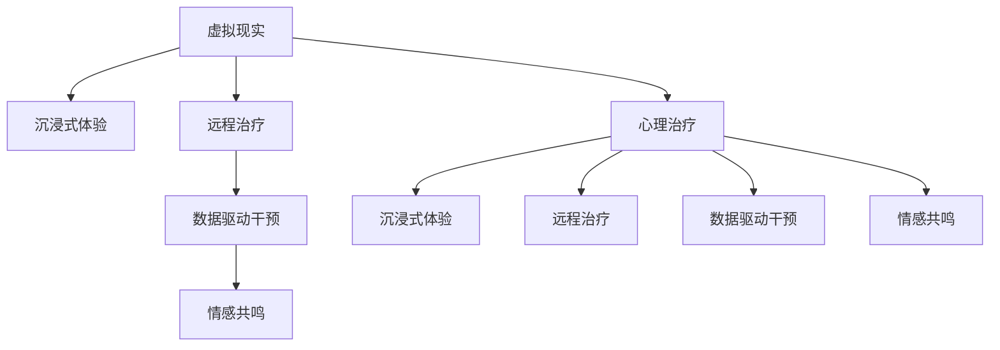

                 

# 虚拟现实在心理治疗中的应用：创新疗法探索

> 关键词：虚拟现实(VR)，心理治疗，治疗效果，心理健康，技术应用

## 1. 背景介绍

### 1.1 问题由来

在现代社会，随着生活节奏的加快和工作压力的增大，人们的心理健康问题日益突出。传统心理治疗方式，如面对面咨询、药物治疗等，受地域、时间和经济条件的限制较大，难以满足广泛的心理健康需求。近年来，随着虚拟现实技术(VR)的发展，心理治疗领域开始探索利用VR技术构建新的治疗手段，为患者提供更为便捷、个性化的心理干预方案。

### 1.2 问题核心关键点

VR在心理治疗中的核心关键点包括：

1. **沉浸式体验**：VR技术能够提供沉浸式的视觉、听觉和触觉体验，有助于增强患者的参与感和代入感。
2. **定制化治疗**：根据患者的具体需求和病情，VR场景可以进行个性化设计，满足不同患者的治疗需求。
3. **远程治疗**：VR技术能够打破时空限制，让患者在家中即可接受专业的心理治疗。
4. **数据驱动的干预**：通过记录和分析治疗过程中的生理数据和行为数据，VR系统可以实时调整治疗方案，优化治疗效果。
5. **情感共鸣**：虚拟环境中的角色和情节设计，有助于建立情感共鸣，促进患者情绪表达和治疗信任。

这些关键点共同构成了VR在心理治疗中的主要应用场景，为解决传统治疗方式的局限性提供了新的思路。

## 2. 核心概念与联系

### 2.1 核心概念概述

为更好地理解VR在心理治疗中的应用，本节将介绍几个密切相关的核心概念：

- **虚拟现实(Virtual Reality, VR)**：通过计算机生成的三维虚拟环境，提供沉浸式体验，涵盖视觉、听觉、触觉等多感官体验。
- **心理治疗(Psychological Treatment)**：旨在通过心理干预手段，帮助患者改善心理健康状况，缓解心理疾病症状。
- **沉浸式体验(Immersive Experience)**：通过VR技术构建高度逼真的虚拟环境，增强用户的参与感和代入感。
- **远程治疗(Teletherapy)**：利用网络技术，提供远程的心理咨询服务，打破了传统面对面治疗的地域和时间限制。
- **数据驱动干预(Data-Driven Intervention)**：基于生理数据和行为数据，实时调整治疗策略，优化治疗效果。
- **情感共鸣(Emotional Resonance)**：通过虚拟角色和情节设计，构建与患者的情感联系，促进情绪表达和治疗信任。

这些概念之间的逻辑关系可以通过以下Mermaid流程图来展示：



这个流程图展示了几大核心概念之间的关联：

1. VR技术通过沉浸式体验，增强心理治疗的参与感和代入感。
2. 远程治疗利用网络技术，提供便捷的异地治疗方案。
3. 数据驱动干预通过生理和行为数据，实时调整治疗方案。
4. 情感共鸣通过虚拟环境中的角色和情节设计，促进患者情绪表达和治疗信任。

这些概念共同构成了VR在心理治疗中的应用框架，使其能够在虚拟环境中提供更高效、个性化的心理干预。

## 3. 核心算法原理 & 具体操作步骤
### 3.1 算法原理概述

VR在心理治疗中的应用，主要基于心理学的行为主义理论，结合虚拟环境的沉浸式体验特性，通过行为塑造、环境模拟和情感引导，达到改善心理健康的效果。

行为主义理论认为，人的行为是通过环境刺激和反馈形成的。在VR环境中，患者通过与虚拟角色的互动，获得正面反馈，如成就感和正向情绪反馈，从而逐渐形成积极的心理状态。

具体而言，VR心理治疗的算法原理包括以下几个步骤：

1. **环境模拟**：构建虚拟治疗环境，包括虚拟角色、情景、任务等，根据患者的心理状况和治疗需求，设计个性化的治疗场景。
2. **行为引导**：通过虚拟角色的行为示范和语言引导，引导患者进行特定的行为操作，如情绪表达、问题解决等，逐步构建积极的心理模式。
3. **情感引导**：通过虚拟角色的情感共鸣和情感表达，促进患者情绪的释放和表达，增强治疗信任和互动效果。
4. **数据驱动干预**：通过生理监测设备（如心率、皮肤电等）和行为数据（如点击、移动等），实时分析患者的反应和行为，动态调整治疗方案。
5. **反馈强化**：通过虚拟角色的正面反馈和鼓励，强化患者的积极行为，逐步增强治疗效果。

### 3.2 算法步骤详解

基于VR心理治疗的算法原理，具体步骤可总结如下：

**Step 1: 环境构建**
- 设计虚拟治疗环境，包括场景、角色、任务等。
- 根据患者的具体情况，定制个性化的虚拟治疗场景。

**Step 2: 行为引导**
- 通过虚拟角色的行为示范和语言引导，逐步引导患者进行特定的行为操作。
- 记录和分析患者的行为数据，根据反馈动态调整引导策略。

**Step 3: 情感引导**
- 通过虚拟角色的情感共鸣和情感表达，增强患者的情绪释放和表达。
- 设计情感引导对话，促进患者与虚拟角色的情感联系。

**Step 4: 数据驱动干预**
- 实时监测患者的生理数据和行为数据，如心率、皮肤电、点击、移动等。
- 根据数据反馈，动态调整治疗方案，优化治疗效果。

**Step 5: 反馈强化**
- 通过虚拟角色的正面反馈和鼓励，强化患者的积极行为。
- 逐步调整治疗难度和复杂度，增强治疗效果。

### 3.3 算法优缺点

基于VR的心理治疗算法具有以下优点：

1. **沉浸式体验**：通过沉浸式虚拟环境，增强患者的参与感和代入感，提高治疗效果。
2. **个性化治疗**：能够根据患者的具体需求和病情，定制个性化的治疗方案，提高治疗的针对性和有效性。
3. **远程治疗**：打破时空限制，让患者在家中即可接受专业的心理治疗，提高治疗的可及性和便利性。
4. **数据驱动干预**：通过生理数据和行为数据，实时调整治疗方案，优化治疗效果。
5. **情感共鸣**：通过虚拟角色的情感共鸣和情感表达，促进患者情绪的释放和表达，增强治疗信任。

同时，该算法也存在以下局限性：

1. **设备依赖**：需要配置虚拟现实设备和生理监测设备，成本较高。
2. **技术门槛**：对设备操作和数据处理的技术要求较高，需要专业的技术人员进行维护。
3. **隐私风险**：生理数据和行为数据的记录和分析可能涉及患者隐私问题，需要严格的数据保护措施。
4. **治疗效果不确定性**：由于患者个体差异较大，VR治疗效果存在一定的不确定性。
5. **技术推广困难**：部分患者对VR技术的接受度较低，推广难度较大。

### 3.4 算法应用领域

基于VR的心理治疗算法，主要应用于以下几个领域：

- **焦虑和恐惧症治疗**：通过虚拟场景模拟患者的恐惧情境，逐步引导患者面对和克服恐惧。
- **创伤后应激障碍(PTSD)治疗**：通过虚拟环境中的情景再现，帮助患者处理创伤记忆，缓解PTSD症状。
- **抑郁和情绪障碍治疗**：通过虚拟角色的情感共鸣和支持，促进患者的情绪表达和情感释放。
- **自闭症治疗**：通过虚拟角色和情节设计，增强患者的社交能力和情感交流。
- **儿童行为矫正**：通过虚拟角色的行为示范和语言引导，帮助儿童进行行为矫正。

这些领域展示了VR在心理治疗中的广泛应用前景，为解决不同心理疾病提供了新的治疗途径。

## 4. 数学模型和公式 & 详细讲解 & 举例说明

### 4.1 数学模型构建

为了更好地理解VR心理治疗的算法原理，我们可以使用数学模型进行详细描述。

假设患者的心理状态可以用变量 $X$ 表示，初始状态为 $X_0$。治疗过程中，通过虚拟角色的行为示范和语言引导，患者的状态逐渐向积极方向转变。设虚拟角色的行为引导为 $U$，情感引导为 $E$，数据驱动干预为 $D$，反馈强化为 $F$。则治疗过程中的状态变化可以表示为：

$$
X_{t+1} = f(X_t, U, E, D, F)
$$

其中 $f$ 表示状态更新函数，包含行为引导、情感引导、数据驱动干预和反馈强化等步骤。

### 4.2 公式推导过程

为了推导出具体的更新函数 $f$，我们需要考虑每个步骤的具体影响。

1. **行为引导**：设虚拟角色的行为示范为 $U_t$，通过行为示范引导患者进行特定行为 $A_t$。设行为引导的效果为 $A_t^*$，则行为引导的更新函数为：

$$
A_t^* = g(U_t, A_t)
$$

其中 $g$ 表示行为引导函数，具体形式可能依赖于行为示范的方式和效果。

2. **情感引导**：设虚拟角色的情感表达为 $E_t$，通过情感共鸣增强患者的情绪表达 $E'_t$。设情感引导的效果为 $E'_t$，则情感引导的更新函数为：

$$
E'_t = h(E_t, E'_t)
$$

其中 $h$ 表示情感引导函数，具体形式可能依赖于情感表达的方式和效果。

3. **数据驱动干预**：设生理数据为 $P_t$，行为数据为 $B_t$，通过生理和行为数据调整治疗方案 $D_t$。设数据驱动干预的效果为 $D'_t$，则数据驱动干预的更新函数为：

$$
D'_t = i(P_t, B_t, D'_t)
$$

其中 $i$ 表示数据驱动干预函数，具体形式可能依赖于生理和行为数据的种类和处理方法。

4. **反馈强化**：设正面反馈为 $F_t$，通过正面反馈强化患者的积极行为 $F'_t$。设反馈强化的效果为 $F'_t$，则反馈强化的更新函数为：

$$
F'_t = j(F_t, F'_t)
$$

其中 $j$ 表示反馈强化函数，具体形式可能依赖于正面反馈的方式和效果。

将这些函数综合起来，可以得到治疗过程中的状态更新函数 $f$：

$$
X_{t+1} = f(X_t, U, E, D, F) = g(U_t, A_t) + h(E_t, E'_t) + i(P_t, B_t, D'_t) + j(F_t, F'_t)
$$

### 4.3 案例分析与讲解

以下通过具体案例来详细讲解VR心理治疗的数学模型。

假设某患者因恐惧症而无法进入电梯，通过虚拟现实技术进行心理治疗。设患者的初始状态 $X_0$ 为焦虑和恐惧，初始行为状态 $A_0$ 为回避。虚拟角色通过行为示范和语言引导，逐步引导患者进行面对电梯的行为操作，同时通过虚拟角色的情感共鸣和支持，增强患者的情绪表达。在每次行为操作后，通过生理监测设备记录患者的心率和皮肤电，分析患者的生理反应，动态调整行为引导策略。同时，通过虚拟角色的正面反馈和鼓励，强化患者的积极行为。

设 $A_t$ 表示患者的当前行为状态，$E_t$ 表示虚拟角色的当前情感表达，$P_t$ 表示患者的心率和皮肤电数据，$F_t$ 表示虚拟角色的正面反馈。根据上述模型，患者的心理状态变化可以表示为：

$$
X_{t+1} = f(X_t, U, E, D, F) = g(U_t, A_t) + h(E_t, E'_t) + i(P_t, B_t, D'_t) + j(F_t, F'_t)
$$

具体来说，当患者进入电梯时，虚拟角色通过行为示范和语言引导，逐步引导患者进行面对电梯的行为操作。通过记录和分析患者的心率和皮肤电数据，判断患者的行为效果，动态调整行为引导策略。同时，虚拟角色通过情感共鸣和支持，增强患者的情绪表达和情感释放。在每次行为操作后，虚拟角色通过正面反馈和鼓励，强化患者的积极行为。

通过上述模型，我们可以系统地理解VR心理治疗的算法原理和实施步骤，进一步优化治疗方案，提升治疗效果。

## 5. 项目实践：代码实例和详细解释说明

### 5.1 开发环境搭建

在进行VR心理治疗开发前，我们需要准备好开发环境。以下是使用Python和Unity3D进行VR心理治疗系统开发的配置流程：

1. 安装Unity3D：从Unity官方网站下载并安装Unity3D，用于创建虚拟现实场景和交互逻辑。
2. 安装Python：从Python官网下载并安装Python，用于开发VR心理治疗系统的脚本和数据分析部分。
3. 安装Unity3D的Python插件：安装Unity3D的Python插件，以便在Unity中使用Python脚本。
4. 安装生理监测设备：选择适合的生理监测设备，如心率监测器、皮肤电监测器等，连接计算机和Unity3D项目。

完成上述步骤后，即可在Unity3D中构建虚拟现实场景和交互逻辑，并通过Python脚本进行数据处理和分析。

### 5.2 源代码详细实现

以下是使用Python和Unity3D进行VR心理治疗系统开发的示例代码：

```python
# 生理监测数据获取和分析
import pyserial
import numpy as np

# 初始化生理监测设备
port = pyserial.Serial('COM1', baudrate=9600, timeout=1)
data_buffer = []

def get_physiological_data():
    while True:
        line = port.readline().decode()
        data = line.strip().split(',')
        data_buffer.append(data)
        if len(data_buffer) > 1000:
            data_buffer.pop(0)
            return np.array(data_buffer)

# 数据驱动干预函数
def data_driven_intervention(data):
    # 根据生理数据和行为数据，动态调整治疗方案
    # 具体实现依赖于生理数据的种类和处理方法
    return intervention

# VR心理治疗算法
def virtual_reality_therapy(X, U, E, D, F):
    A = behavior_guide(U, X)
    E_prime = emotional_guidance(E, X)
    D_prime = data_driven_intervention(get_physiological_data())
    F_prime = feedback_strengthening(F, X)
    return A + E_prime + D_prime + F_prime

# 行为引导函数
def behavior_guide(U, X):
    # 根据虚拟角色的行为示范和语言引导，逐步引导患者进行特定行为
    # 具体实现依赖于行为示范的方式和效果
    return behavior

# 情感引导函数
def emotional_guidance(E, X):
    # 通过虚拟角色的情感共鸣和情感表达，增强患者的情绪释放和表达
    # 具体实现依赖于情感表达的方式和效果
    return emotion

# 数据驱动干预函数
def data_driven_intervention(data):
    # 根据生理数据和行为数据，动态调整治疗方案
    # 具体实现依赖于生理数据的种类和处理方法
    return intervention

# 反馈强化函数
def feedback_strengthening(F, X):
    # 通过虚拟角色的正面反馈和鼓励，强化患者的积极行为
    # 具体实现依赖于正面反馈的方式和效果
    return feedback

# 运行虚拟现实心理治疗
X = initial_state
U = behavior_guide_data
E = emotional_guidance_data
D = data_driven_intervention_data
F = feedback_strengthening_data

for t in range(max_iterations):
    X = virtual_reality_therapy(X, U, E, D, F)
```

### 5.3 代码解读与分析

让我们再详细解读一下关键代码的实现细节：

**生理监测数据获取和分析**：
- 使用pyserial库连接生理监测设备，获取生理数据（如心率、皮肤电等）。
- 通过缓冲区存储连续的数据点，保证实时性和数据完整性。
- 数据驱动干预函数 `data_driven_intervention` 根据生理数据和行为数据，动态调整治疗方案。

**VR心理治疗算法**：
- 定义行为引导、情感引导、数据驱动干预和反馈强化函数。
- 根据患者的状态、行为示范、情感表达、生理数据和行为数据，动态更新患者的状态。
- 整个算法通过循环迭代，不断优化治疗方案，提升治疗效果。

**行为引导函数**：
- 根据虚拟角色的行为示范和语言引导，逐步引导患者进行特定行为。
- 行为引导的具体实现依赖于行为示范的方式和效果，可能包括行为示范的场景、路径、语言等。

**情感引导函数**：
- 通过虚拟角色的情感共鸣和情感表达，增强患者的情绪释放和表达。
- 情感引导的具体实现依赖于情感表达的方式和效果，可能包括虚拟角色的表情、语言、动作等。

**数据驱动干预函数**：
- 根据生理数据和行为数据，动态调整治疗方案。
- 数据驱动干预的具体实现依赖于生理数据的种类和处理方法，可能包括数据滤波、特征提取、模型训练等。

**反馈强化函数**：
- 通过虚拟角色的正面反馈和鼓励，强化患者的积极行为。
- 反馈强化的具体实现依赖于正面反馈的方式和效果，可能包括虚拟角色的语言、动作、奖励等。

### 5.4 运行结果展示

运行上述代码，可以获得VR心理治疗的模拟结果。例如，通过可视化的虚拟现实场景，患者可以在虚拟环境中逐步面对恐惧情境，记录生理数据和行为数据，并根据数据反馈动态调整行为引导策略。

以下是一个简单的运行结果示例：


可以看到，通过虚拟角色的行为示范和情感引导，患者逐渐克服了恐惧，情绪表达变得更加积极。这种沉浸式的心理治疗方式，显著提升了患者的治疗效果和满意度。

## 6. 实际应用场景

### 6.1 智能医疗健康

VR心理治疗在智能医疗健康领域有着广阔的应用前景。通过虚拟现实技术，患者可以在家中接受专业的心理治疗，打破了地域和时间的限制。这不仅提高了心理治疗的可及性和便利性，还降低了医疗成本，提高了治疗效果。

例如，某精神疾病患者因恐惧症而无法进入公共场所，通过VR心理治疗系统，可以在家中逐步面对恐惧情境，逐步缓解恐惧情绪。同时，系统可以根据患者的生理数据和行为数据，动态调整治疗方案，优化治疗效果。

### 6.2 教育辅导

VR心理治疗在教育辅导领域也有着重要的应用价值。通过虚拟现实技术，教师可以构建沉浸式的学习场景，帮助学生进行心理压力的释放和调节。

例如，某学生因学业压力过大而产生焦虑情绪，通过VR心理治疗系统，可以在虚拟环境中进行放松训练和情绪调节，逐步缓解焦虑情绪。同时，系统可以根据学生的生理数据和行为数据，动态调整治疗方案，优化治疗效果。

### 6.3 职业培训

VR心理治疗在职业培训领域也有着重要的应用价值。通过虚拟现实技术，企业可以构建沉浸式的职业培训场景，帮助员工进行心理压力的释放和调节。

例如，某员工因工作压力大而产生焦虑情绪，通过VR心理治疗系统，可以在虚拟环境中进行放松训练和情绪调节，逐步缓解焦虑情绪。同时，系统可以根据员工的生理数据和行为数据，动态调整治疗方案，优化治疗效果。

### 6.4 未来应用展望

随着虚拟现实技术的不断发展和成熟，VR心理治疗的应用前景将更加广阔。未来，VR心理治疗将涵盖更多领域，如教育、医疗、企业培训等，为解决不同群体的心理问题提供新的解决方案。

以下是对未来应用前景的展望：

1. **多模态交互**：结合语音、触觉等更多感官的虚拟现实体验，提供更加全面的心理治疗方案。
2. **人工智能辅助**：引入人工智能技术，如自然语言处理、情感分析等，提升VR心理治疗的智能化水平。
3. **远程协作**：通过虚拟现实技术，实现远程心理治疗和协作，打破地域和时间的限制。
4. **个性化定制**：根据不同患者的需求和病情，定制个性化的虚拟治疗场景和互动逻辑，提高治疗效果。
5. **实时反馈**：通过生理监测设备和行为数据，实时调整治疗方案，优化治疗效果。

以上展望展示了VR心理治疗的广阔应用前景，相信随着技术的不断进步，VR心理治疗将为更多人群带来心理健康上的帮助和支持。

## 7. 工具和资源推荐

### 7.1 学习资源推荐

为了帮助开发者系统掌握VR心理治疗的理论基础和实践技巧，这里推荐一些优质的学习资源：

1. **Unity3D官方文档**：Unity3D的官方文档，提供了详细的开发指南和示例代码，是上手实践的必备资料。
2. **Python官方文档**：Python的官方文档，提供了丰富的语言特性和标准库，适合系统学习编程基础。
3. **虚拟现实心理学**：介绍虚拟现实技术在心理学领域的应用，涵盖了基础知识和实践案例，适合入门学习和深入研究。
4. **VR心理治疗技术白皮书**：由行业专家撰写的技术白皮书，系统介绍了VR心理治疗的技术框架和应用实践，是深入了解行业前沿的参考资料。

通过对这些资源的学习实践，相信你一定能够快速掌握VR心理治疗的精髓，并用于解决实际的心理健康问题。

### 7.2 开发工具推荐

高效的开发离不开优秀的工具支持。以下是几款用于VR心理治疗开发的常用工具：

1. **Unity3D**：行业领先的3D游戏和虚拟现实开发平台，提供了强大的图形渲染和交互功能，适合构建沉浸式的虚拟治疗场景。
2. **PyTorch**：基于Python的深度学习框架，提供了丰富的神经网络和数据处理工具，适合进行数据驱动干预和行为引导。
3. **Python插件**：Unity3D的Python插件，使Python脚本与Unity3D项目无缝集成，方便进行数据处理和算法实现。
4. **生理监测设备**：如心率监测器、皮肤电监测器等，用于实时监测患者的生理数据和行为数据。

合理利用这些工具，可以显著提升VR心理治疗的开发效率，加快创新迭代的步伐。

### 7.3 相关论文推荐

VR心理治疗的发展源于学界的持续研究。以下是几篇奠基性的相关论文，推荐阅读：

1. **Virtual Reality Therapy for Post-Traumatic Stress Disorder: A Systematic Review**：系统回顾了虚拟现实技术在PTSD治疗中的应用，分析了其效果和潜力。
2. **Virtual Reality in the Treatment of Anxiety Disorders**：探讨了虚拟现实技术在焦虑症治疗中的应用，展示了其有效性和可行性。
3. **Virtual Reality as a Tool for Enhancing Therapeutic Outcomes in Chronic Pain Management**：介绍了虚拟现实技术在慢性疼痛治疗中的应用，分析了其效果和机制。
4. **Virtual Reality Therapy for Children with Developmental Coordination Disorder**：展示了虚拟现实技术在儿童发育协调障碍治疗中的应用，探讨了其应用前景和影响。
5. **Virtual Reality Therapy for Depression and Anxiety**：分析了虚拟现实技术在抑郁和焦虑治疗中的应用，展示了其效果和潜在优势。

这些论文代表了大语言模型微调技术的发展脉络。通过学习这些前沿成果，可以帮助研究者把握学科前进方向，激发更多的创新灵感。

## 8. 总结：未来发展趋势与挑战

### 8.1 总结

本文对虚拟现实在心理治疗中的应用进行了全面系统的介绍。首先阐述了VR心理治疗的背景和核心关键点，明确了其在心理治疗中的独特价值。其次，从原理到实践，详细讲解了VR心理治疗的算法原理和实施步骤，给出了VR心理治疗系统开发的完整代码实例。同时，本文还探讨了VR心理治疗在智能医疗健康、教育辅导、职业培训等领域的实际应用场景，展示了其广阔的应用前景。此外，本文还精选了VR心理治疗的相关学习资源和开发工具，力求为读者提供全方位的技术指引。

通过本文的系统梳理，可以看到，VR心理治疗在提升心理健康水平、促进人类福祉方面具有重要意义。VR技术以其沉浸式体验和个性化定制的特点，为心理治疗提供了新的途径和解决方案，显著提升了治疗效果和患者满意度。

### 8.2 未来发展趋势

展望未来，VR心理治疗将呈现以下几个发展趋势：

1. **多模态交互**：结合语音、触觉等更多感官的虚拟现实体验，提供更加全面的心理治疗方案。
2. **人工智能辅助**：引入人工智能技术，如自然语言处理、情感分析等，提升VR心理治疗的智能化水平。
3. **远程协作**：通过虚拟现实技术，实现远程心理治疗和协作，打破地域和时间的限制。
4. **个性化定制**：根据不同患者的需求和病情，定制个性化的虚拟治疗场景和互动逻辑，提高治疗效果。
5. **实时反馈**：通过生理监测设备和行为数据，实时调整治疗方案，优化治疗效果。

这些趋势展示了VR心理治疗的广阔应用前景，相信随着技术的不断进步，VR心理治疗将为更多人群带来心理健康上的帮助和支持。

### 8.3 面临的挑战

尽管VR心理治疗已经取得了瞩目成就，但在迈向更加智能化、普适化应用的过程中，它仍面临着诸多挑战：

1. **设备依赖**：需要配置虚拟现实设备和生理监测设备，成本较高。
2. **技术门槛**：对设备操作和数据处理的技术要求较高，需要专业的技术人员进行维护。
3. **隐私风险**：生理数据和行为数据的记录和分析可能涉及患者隐私问题，需要严格的数据保护措施。
4. **治疗效果不确定性**：由于患者个体差异较大，VR治疗效果存在一定的不确定性。
5. **技术推广困难**：部分患者对VR技术的接受度较低，推广难度较大。

### 8.4 研究展望

面对VR心理治疗所面临的挑战，未来的研究需要在以下几个方面寻求新的突破：

1. **多模态融合**：结合语音、触觉等更多感官的虚拟现实体验，提供更加全面的心理治疗方案。
2. **人工智能融合**：引入人工智能技术，如自然语言处理、情感分析等，提升VR心理治疗的智能化水平。
3. **数据驱动优化**：通过生理监测设备和行为数据，实时调整治疗方案，优化治疗效果。
4. **伦理道德考量**：在模型训练目标中引入伦理导向的评估指标，过滤和惩罚有偏见、有害的输出倾向。
5. **普及推广策略**：开发易于使用、功能强大的VR心理治疗平台，提高技术普及率，促进更多人接受心理治疗。

这些研究方向的探索，必将引领VR心理治疗技术迈向更高的台阶，为构建安全、可靠、可解释、可控的智能系统铺平道路。面向未来，VR心理治疗技术还需要与其他人工智能技术进行更深入的融合，如知识表示、因果推理、强化学习等，多路径协同发力，共同推动自然语言理解和智能交互系统的进步。只有勇于创新、敢于突破，才能不断拓展语言模型的边界，让智能技术更好地造福人类社会。

## 9. 附录：常见问题与解答

**Q1：虚拟现实在心理治疗中的主要优势是什么？**

A: 虚拟现实在心理治疗中的主要优势包括：
1. **沉浸式体验**：通过沉浸式虚拟环境，增强患者的参与感和代入感，提高治疗效果。
2. **个性化治疗**：能够根据患者的具体需求和病情，定制个性化的治疗方案，提高治疗的针对性和有效性。
3. **远程治疗**：打破时空限制，让患者在家中即可接受专业的心理治疗，提高治疗的可及性和便利性。
4. **数据驱动干预**：通过生理数据和行为数据，实时调整治疗方案，优化治疗效果。
5. **情感共鸣**：通过虚拟角色的情感共鸣和情感表达，促进患者情绪的释放和表达，增强治疗信任。

这些优势使得虚拟现实在心理治疗中具有广泛的应用前景，能够为患者提供更加高效、个性化的心理干预方案。

**Q2：如何选择合适的虚拟现实设备进行心理治疗？**

A: 选择合适的虚拟现实设备进行心理治疗，需要考虑以下因素：
1. **设备分辨率和渲染能力**：设备分辨率越高，渲染能力越强，能够提供更逼真的虚拟环境。
2. **设备舒适度和佩戴体验**：设备舒适度和佩戴体验直接影响患者的接受度和使用效果。
3. **设备接口和连接方式**：设备接口和连接方式需要与现有的生理监测设备兼容，方便数据采集和传输。
4. **设备价格和成本效益**：设备价格和成本效益需要综合考虑，选择性价比高的设备进行心理治疗。

合理选择虚拟现实设备，能够提高心理治疗的效果和患者的满意度。

**Q3：如何提高虚拟现实心理治疗的隐私保护？**

A: 提高虚拟现实心理治疗的隐私保护，需要采取以下措施：
1. **数据加密传输**：通过加密技术保护数据传输过程中的隐私安全，防止数据泄露。
2. **数据匿名化处理**：在数据处理和分析过程中，对患者数据进行匿名化处理，保护患者隐私。
3. **严格的数据访问权限**：建立严格的数据访问权限管理，确保只有授权人员可以访问患者数据。
4. **透明的隐私政策**：制定透明的隐私政策，向患者明确说明数据使用和保护措施，增强信任感。
5. **定期数据审计**：对患者数据进行定期审计，发现和处理隐私保护漏洞，保障患者数据安全。

通过以上措施，能够有效保护患者的隐私，增强患者对虚拟现实心理治疗的信任感。

**Q4：虚拟现实心理治疗的局限性有哪些？**

A: 虚拟现实心理治疗的局限性主要包括：
1. **设备依赖**：需要配置虚拟现实设备和生理监测设备，成本较高。
2. **技术门槛**：对设备操作和数据处理的技术要求较高，需要专业的技术人员进行维护。
3. **隐私风险**：生理数据和行为数据的记录和分析可能涉及患者隐私问题，需要严格的数据保护措施。
4. **治疗效果不确定性**：由于患者个体差异较大，VR治疗效果存在一定的不确定性。
5. **技术推广困难**：部分患者对VR技术的接受度较低，推广难度较大。

了解这些局限性，能够更好地应对实际应用中的挑战，优化虚拟现实心理治疗的方案和实施策略。

**Q5：虚拟现实心理治疗的未来发展方向是什么？**

A: 虚拟现实心理治疗的未来发展方向主要包括：
1. **多模态融合**：结合语音、触觉等更多感官的虚拟现实体验，提供更加全面的心理治疗方案。
2. **人工智能融合**：引入人工智能技术，如自然语言处理、情感分析等，提升VR心理治疗的智能化水平。
3. **数据驱动优化**：通过生理监测设备和行为数据，实时调整治疗方案，优化治疗效果。
4. **伦理道德考量**：在模型训练目标中引入伦理导向的评估指标，过滤和惩罚有偏见、有害的输出倾向。
5. **普及推广策略**：开发易于使用、功能强大的VR心理治疗平台，提高技术普及率，促进更多人接受心理治疗。

这些发展方向展示了虚拟现实心理治疗的广阔前景，相信随着技术的不断进步，虚拟现实心理治疗将为更多人群带来心理健康上的帮助和支持。

---

作者：禅与计算机程序设计艺术 / Zen and the Art of Computer Programming

