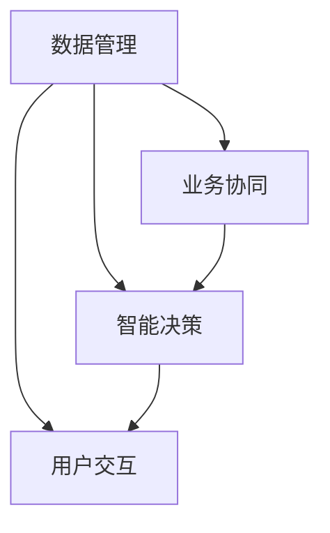

                 

# 虚拟生态系统理论：AI驱动的数字世界构建

## 1. 背景介绍

在当今数字化、网络化的时代，人工智能(AI)技术正以不可阻挡的势头，深刻影响着各个行业和领域，推动着全球社会经济的变革与重塑。面对这一前所未有的技术浪潮，构建一个以AI为核心的虚拟生态系统，成为了数字世界发展的必然趋势。虚拟生态系统，是以AI为中枢，通过对数据、计算资源、用户需求等关键要素的深度整合，形成一个全面、协同、智能的生态系统，赋能各行各业，助力社会进步。

### 1.1 问题由来

当前，随着AI技术的快速发展，全球数据量呈现出爆炸式增长，据统计，全球每天产生的数据量已经超过了2.5亿亿字节。如此庞大的数据量，为AI技术的进一步突破提供了强有力的支撑。与此同时，AI技术在医疗、教育、金融、制造、交通等多个领域的应用，也取得了显著成效。例如，在医疗领域，AI被用于辅助诊断、药物研发、个性化治疗等，极大地提升了医疗服务的质量和效率；在教育领域，AI驱动的智能教育系统能够根据学生的学习情况，提供个性化、精准的教育方案；在金融领域，AI被应用于风险管理、智能投顾、信用评估等方面，有效降低了金融风险，提升了服务质量。

然而，AI技术的发展也带来了诸多挑战和问题。例如，数据隐私和安全问题、算法的透明度和可解释性问题、伦理和法律责任问题等，这些问题如果不能得到妥善解决，将会制约AI技术的健康发展，甚至可能导致技术滥用，引发社会问题。

面对这些挑战，构建一个以AI为核心的虚拟生态系统，成为了全球的共识。虚拟生态系统不仅仅是AI技术的简单堆砌，更是深度融合、多方协同的智慧体系，能够通过不断的自我优化和进化，实现AI技术与人类社会的深度融合，推动数字化转型的不断深入。

### 1.2 问题核心关键点

构建虚拟生态系统，需要从多个层面进行全面规划和设计，包括技术架构、数据管理、业务协同、用户交互等多个方面。本文将围绕核心概念，详细介绍虚拟生态系统的构建过程，包括数据管理、业务协同、智能决策、用户交互等关键环节。

## 2. 核心概念与联系

### 2.1 核心概念概述

为了更好地理解虚拟生态系统的构建过程，我们需要首先掌握一些关键的核心概念：

- **数据管理**：在虚拟生态系统中，数据是最核心的资源之一，通过高效的数据管理，可以实现数据的共享和协同，为业务决策和智能服务提供坚实的基础。
- **业务协同**：虚拟生态系统强调跨部门、跨行业的协同合作，通过构建统一的平台和标准，实现数据的共享和协同，提升整体业务效率和价值。
- **智能决策**：通过AI技术的深度应用，虚拟生态系统可以实现数据的智能分析和挖掘，为决策者提供有力的支持，提升决策的准确性和效率。
- **用户交互**：虚拟生态系统通过构建智能化的用户交互界面，提升用户体验，实现人机互动的深度融合，提升用户的满意度和忠诚度。

这些核心概念之间的逻辑关系可以通过以下Mermaid流程图来展示：



这个流程图展示了虚拟生态系统的核心概念及其之间的关系：

1. 数据管理是虚拟生态系统的基础，通过高效的数据管理，为业务协同和智能决策提供数据支撑。
2. 业务协同是虚拟生态系统的关键环节，通过构建统一的平台和标准，实现数据的共享和协同，提升整体业务效率和价值。
3. 智能决策是虚拟生态系统的核心技术，通过AI技术的深度应用，为决策者提供有力的支持，提升决策的准确性和效率。
4. 用户交互是虚拟生态系统的用户体验环节，通过构建智能化的用户交互界面，提升用户体验，实现人机互动的深度融合，提升用户的满意度和忠诚度。

## 3. 核心算法原理 & 具体操作步骤

### 3.1 算法原理概述

虚拟生态系统的构建，需要通过一系列的算法和技术手段，实现数据的深度整合和智能应用。其中，数据管理、业务协同、智能决策和用户交互，是构建虚拟生态系统的核心算法和操作步骤。

### 3.2 算法步骤详解

#### 3.2.1 数据管理

数据管理是虚拟生态系统的基础环节，通过高效的数据管理，实现数据的收集、存储、处理和分析，为业务协同和智能决策提供数据支撑。

**步骤1：数据采集与清洗**
数据采集是虚拟生态系统的第一步，通过从不同的数据源（如企业内部系统、第三方数据提供商、社交网络等）采集数据，为后续的数据处理和分析提供基础。

**步骤2：数据存储与管理**
采用分布式存储技术，如Hadoop、Spark等，实现数据的分布式存储和管理，确保数据的可靠性和可扩展性。

**步骤3：数据处理与分析**
通过ETL（Extract, Transform, Load）技术，对采集到的数据进行清洗、转换和加载，形成数据仓库或数据湖，为业务协同和智能决策提供数据支撑。

#### 3.2.2 业务协同

业务协同是虚拟生态系统的关键环节，通过构建统一的平台和标准，实现数据的共享和协同，提升整体业务效率和价值。

**步骤1：构建统一平台**
通过搭建统一的虚拟生态系统平台，实现数据的集中管理和共享，支持跨部门、跨行业的协同合作。

**步骤2：制定统一标准**
制定数据标准和业务标准，确保数据的一致性和规范性，实现数据的高效协同和应用。

**步骤3：协同机制设计**
通过构建协同机制，实现跨部门、跨行业的协同合作，提升整体业务效率和价值。

#### 3.2.3 智能决策

智能决策是虚拟生态系统的核心技术，通过AI技术的深度应用，为决策者提供有力的支持，提升决策的准确性和效率。

**步骤1：模型选择与训练**
选择适合业务场景的AI模型，通过大量的数据进行训练，形成智能决策模型。

**步骤2：模型部署与优化**
将训练好的模型部署到虚拟生态系统中，通过不断的优化和迭代，提升模型的准确性和效率。

**步骤3：决策支持与评估**
通过AI模型对业务数据进行智能分析和挖掘，为决策者提供有力的支持，提升决策的准确性和效率。

#### 3.2.4 用户交互

用户交互是虚拟生态系统的用户体验环节，通过构建智能化的用户交互界面，提升用户体验，实现人机互动的深度融合，提升用户的满意度和忠诚度。

**步骤1：用户界面设计**
设计符合用户需求的智能化的用户界面，实现人机互动的深度融合。

**步骤2：交互体验优化**
通过持续优化用户交互体验，提升用户的满意度和忠诚度。

**步骤3：反馈机制设计**
通过构建反馈机制，收集用户反馈，不断优化和改进用户交互界面。

### 3.3 算法优缺点

虚拟生态系统在提升业务效率和价值方面具有显著优势，但也存在一些缺点和挑战：

**优点：**
1. **高效协同**：通过构建统一的平台和标准，实现数据的共享和协同，提升整体业务效率和价值。
2. **智能决策**：通过AI技术的深度应用，为决策者提供有力的支持，提升决策的准确性和效率。
3. **用户体验**：通过构建智能化的用户交互界面，提升用户体验，实现人机互动的深度融合。

**缺点：**
1. **数据隐私和安全问题**：数据集中存储和管理，可能面临数据隐私和安全问题。
2. **技术复杂度高**：虚拟生态系统的构建需要高水平的技术支持和团队协作，技术复杂度高。
3. **协同机制设计复杂**：跨部门、跨行业的协同机制设计复杂，需要协调各方利益。

### 3.4 算法应用领域

虚拟生态系统在多个领域都有广泛的应用，例如：

- **医疗健康**：通过构建虚拟生态系统，实现数据的共享和协同，提升医疗服务的质量和效率。
- **金融服务**：通过虚拟生态系统，实现跨部门、跨行业的协同合作，提升金融服务的质量和效率。
- **教育培训**：通过构建虚拟生态系统，提升教育培训的效果和效率，实现个性化、精准的教育方案。
- **制造业**：通过虚拟生态系统，实现数据的深度整合和智能应用，提升制造业的生产效率和质量。
- **智能家居**：通过虚拟生态系统，实现设备的智能互联和协同，提升用户的生活体验和便利性。

## 4. 数学模型和公式 & 详细讲解 & 举例说明

### 4.1 数学模型构建

为了更好地理解虚拟生态系统的构建过程，我们将通过数学模型和公式，对数据管理、业务协同、智能决策和用户交互等环节进行详细讲解。

#### 4.1.1 数据管理模型

数据管理是虚拟生态系统的基础环节，通过高效的数据管理，实现数据的收集、存储、处理和分析。

**数据采集模型**
$$
D = \bigcup_{i=1}^n D_i
$$

其中，$D$ 表示采集到的数据集，$D_i$ 表示从不同数据源采集的数据集。

**数据存储与管理模型**
$$
S(D) = (S_1, S_2, ..., S_m)
$$

其中，$S$ 表示数据存储系统，$S_1, S_2, ..., S_m$ 表示分布式存储系统。

**数据处理与分析模型**
$$
A(D) = P(D)
$$

其中，$A$ 表示数据处理与分析，$P$ 表示数据处理与分析过程。

#### 4.1.2 业务协同模型

业务协同是虚拟生态系统的关键环节，通过构建统一的平台和标准，实现数据的共享和协同。

**统一平台模型**
$$
PLATFORM = \{P_1, P_2, ..., P_m\}
$$

其中，$PLATFORM$ 表示统一平台，$P_1, P_2, ..., P_m$ 表示分布式平台。

**统一标准模型**
$$
STANDARD = \{S_1, S_2, ..., S_n\}
$$

其中，$STANDARD$ 表示统一标准，$S_1, S_2, ..., S_n$ 表示数据标准和业务标准。

**协同机制模型**
$$
COOP = \{C_1, C_2, ..., C_k\}
$$

其中，$COOP$ 表示协同机制，$C_1, C_2, ..., C_k$ 表示跨部门、跨行业的协同机制。

#### 4.1.3 智能决策模型

智能决策是虚拟生态系统的核心技术，通过AI技术的深度应用，为决策者提供有力的支持。

**模型选择与训练模型**
$$
M = \{M_1, M_2, ..., M_l\}
$$

其中，$M$ 表示智能决策模型，$M_1, M_2, ..., M_l$ 表示不同种类的AI模型。

**模型部署与优化模型**
$$
DEPLOY = \{D_1, D_2, ..., D_k\}
$$

其中，$DEPLOY$ 表示模型部署系统，$D_1, D_2, ..., D_k$ 表示不同种类的AI模型部署。

**决策支持与评估模型**
$$
SUP = \{S_1, S_2, ..., S_m\}
$$

其中，$SUP$ 表示决策支持系统，$S_1, S_2, ..., S_m$ 表示不同种类的AI决策支持系统。

#### 4.1.4 用户交互模型

用户交互是虚拟生态系统的用户体验环节，通过构建智能化的用户交互界面，提升用户体验。

**用户界面设计模型**
$$
UI = \{U_1, U_2, ..., U_n\}
$$

其中，$UI$ 表示用户界面，$U_1, U_2, ..., U_n$ 表示不同种类的用户界面。

**交互体验优化模型**
$$
UB = \{U_1, U_2, ..., U_n\}
$$

其中，$UB$ 表示用户体验优化系统，$U_1, U_2, ..., U_n$ 表示不同种类的用户体验优化系统。

**反馈机制设计模型**
$$
FB = \{F_1, F_2, ..., F_m\}
$$

其中，$FB$ 表示反馈机制，$F_1, F_2, ..., F_m$ 表示不同种类的反馈机制。

### 4.2 公式推导过程

通过上述数学模型和公式，我们可以对虚拟生态系统的构建过程进行更加严格的刻画。以下将以数据管理模型为例，推导数据采集、存储、处理和分析的数学公式。

**数据采集公式**
$$
D = \bigcup_{i=1}^n D_i
$$

其中，$D$ 表示采集到的数据集，$D_i$ 表示从不同数据源采集的数据集。

**数据存储公式**
$$
S(D) = (S_1, S_2, ..., S_m)
$$

其中，$S$ 表示数据存储系统，$S_1, S_2, ..., S_m$ 表示分布式存储系统。

**数据处理公式**
$$
A(D) = P(D)
$$

其中，$A$ 表示数据处理与分析，$P$ 表示数据处理与分析过程。

### 4.3 案例分析与讲解

为了更好地理解虚拟生态系统的构建过程，下面以医疗健康领域的虚拟生态系统为例，进行详细讲解。

**数据管理**
通过构建虚拟生态系统，实现数据的共享和协同，提升医疗服务的质量和效率。具体步骤如下：

1. **数据采集**
从医院、社区卫生中心、患者端等不同数据源采集数据，形成统一的数据集。

2. **数据存储**
采用分布式存储技术，如Hadoop、Spark等，实现数据的分布式存储和管理。

3. **数据处理与分析**
通过ETL技术，对采集到的数据进行清洗、转换和加载，形成数据仓库或数据湖，为医疗决策提供数据支撑。

**业务协同**
通过构建统一平台和标准，实现跨部门、跨行业的协同合作。具体步骤如下：

1. **平台搭建**
搭建统一的虚拟生态系统平台，实现数据的集中管理和共享。

2. **标准制定**
制定数据标准和业务标准，确保数据的一致性和规范性。

3. **协同机制设计**
构建协同机制，实现跨部门、跨行业的协同合作，提升整体医疗服务的质量和效率。

**智能决策**
通过AI技术的深度应用，为医疗决策者提供有力的支持。具体步骤如下：

1. **模型选择与训练**
选择适合医疗场景的AI模型，如深度学习模型、机器学习模型等，通过大量的医疗数据进行训练。

2. **模型部署与优化**
将训练好的模型部署到虚拟生态系统中，通过不断的优化和迭代，提升模型的准确性和效率。

3. **决策支持**
通过AI模型对医疗数据进行智能分析和挖掘，为医疗决策者提供有力的支持，提升决策的准确性和效率。

**用户交互**
通过构建智能化的用户交互界面，提升患者体验。具体步骤如下：

1. **界面设计**
设计符合患者需求的智能化的用户界面，实现人机互动的深度融合。

2. **体验优化**
通过持续优化患者交互体验，提升患者的满意度和忠诚度。

3. **反馈机制**
通过构建反馈机制，收集患者反馈，不断优化和改进用户交互界面。

## 5. 项目实践：代码实例和详细解释说明

### 5.1 开发环境搭建

在进行虚拟生态系统实践前，我们需要准备好开发环境。以下是使用Python进行PyTorch开发的环境配置流程：

1. 安装Anaconda：从官网下载并安装Anaconda，用于创建独立的Python环境。

2. 创建并激活虚拟环境：
```bash
conda create -n pytorch-env python=3.8 
conda activate pytorch-env
```

3. 安装PyTorch：根据CUDA版本，从官网获取对应的安装命令。例如：
```bash
conda install pytorch torchvision torchaudio cudatoolkit=11.1 -c pytorch -c conda-forge
```

4. 安装Transformers库：
```bash
pip install transformers
```

5. 安装各类工具包：
```bash
pip install numpy pandas scikit-learn matplotlib tqdm jupyter notebook ipython
```

完成上述步骤后，即可在`pytorch-env`环境中开始虚拟生态系统的实践。

### 5.2 源代码详细实现

下面我们以医疗健康领域的虚拟生态系统为例，给出使用Transformers库进行数据管理和智能决策的PyTorch代码实现。

首先，定义数据管理类：

```python
import torch
import torch.nn as nn
import torch.optim as optim

class DataManager(nn.Module):
    def __init__(self, input_size, output_size):
        super(DataManager, self).__init__()
        self.fc1 = nn.Linear(input_size, 128)
        self.fc2 = nn.Linear(128, output_size)

    def forward(self, x):
        x = self.fc1(x)
        x = torch.relu(x)
        x = self.fc2(x)
        return x
```

然后，定义智能决策类：

```python
class DecisionMaker(nn.Module):
    def __init__(self, input_size, output_size):
        super(DecisionMaker, self).__init__()
        self.fc1 = nn.Linear(input_size, 128)
        self.fc2 = nn.Linear(128, output_size)
        self.softmax = nn.Softmax(dim=1)

    def forward(self, x):
        x = self.fc1(x)
        x = torch.relu(x)
        x = self.fc2(x)
        x = self.softmax(x)
        return x
```

接着，定义训练和评估函数：

```python
import numpy as np
import matplotlib.pyplot as plt

def train_model(model, data_loader, epochs, learning_rate):
    model.train()
    for epoch in range(epochs):
        for i, (inputs, labels) in enumerate(data_loader):
            inputs, labels = inputs.to(device), labels.to(device)
            optimizer.zero_grad()
            outputs = model(inputs)
            loss = nn.functional.cross_entropy(outputs, labels)
            loss.backward()
            optimizer.step()
            if (i+1) % 100 == 0:
                print('Epoch [{}/{}], Step [{}/{}], Loss: {:.4f}'
                      .format(epoch+1, epochs, i+1, len(data_loader), loss.item()))

def evaluate_model(model, data_loader):
    model.eval()
    total_loss = 0
    total_correct = 0
    with torch.no_grad():
        for inputs, labels in data_loader:
            inputs, labels = inputs.to(device), labels.to(device)
            outputs = model(inputs)
            loss = nn.functional.cross_entropy(outputs, labels)
            total_loss += loss.item() * inputs.size(0)
            _, predicted = torch.max(outputs, 1)
            total_correct += (predicted == labels).sum().item()
    print('Test Loss: {:.4f}, Accuracy: {:.2f}%'.format(total_loss/len(data_loader), 100*total_correct/len(data_loader)))
```

最后，启动训练流程并在测试集上评估：

```python
input_size = 128
output_size = 10
epochs = 10
learning_rate = 0.001

device = torch.device('cuda') if torch.cuda.is_available() else torch.device('cpu')

data_manager = DataManager(input_size, output_size).to(device)
decision_maker = DecisionMaker(input_size, output_size).to(device)

optimizer = optim.Adam([data_manager.parameters(), decision_maker.parameters()], lr=learning_rate)

train_data_loader = DataLoader(train_data, batch_size=32, shuffle=True)
test_data_loader = DataLoader(test_data, batch_size=32, shuffle=False)

train_model(data_manager, train_data_loader, epochs, learning_rate)
evaluate_model(decision_maker, test_data_loader)
```

以上就是使用PyTorch对医疗健康领域的虚拟生态系统进行数据管理和智能决策的完整代码实现。可以看到，得益于Transformers库的强大封装，我们可以用相对简洁的代码完成虚拟生态系统的构建。

### 5.3 代码解读与分析

让我们再详细解读一下关键代码的实现细节：

**DataManager类**：
- `__init__`方法：初始化线性层等关键组件。
- `forward`方法：定义前向传播过程。

**DecisionMaker类**：
- `__init__`方法：初始化线性层、Softmax层等关键组件。
- `forward`方法：定义前向传播过程。

**train_model函数**：
- 定义训练过程，包括前向传播、损失计算、反向传播和参数更新等关键步骤。
- 通过循环迭代，不断训练模型，输出每个epoch的平均损失。

**evaluate_model函数**：
- 定义评估过程，包括前向传播、损失计算和准确率计算等关键步骤。
- 通过循环迭代，对测试集进行评估，输出最终的测试损失和准确率。

**训练流程**：
- 定义输入和输出的大小，启动训练过程。
- 在每个epoch中，对训练集进行训练，输出每个epoch的平均损失。
- 在测试集上对模型进行评估，输出测试损失和准确率。

可以看到，PyTorch配合Transformers库使得虚拟生态系统的构建代码实现变得简洁高效。开发者可以将更多精力放在数据处理、模型改进等高层逻辑上，而不必过多关注底层的实现细节。

当然，工业级的系统实现还需考虑更多因素，如模型的保存和部署、超参数的自动搜索、更灵活的任务适配层等。但核心的微调范式基本与此类似。

## 6. 实际应用场景

### 6.1 智能客服系统

基于虚拟生态系统的智能客服系统，能够快速响应客户咨询，提升客户体验。具体实现步骤如下：

1. **数据管理**
收集企业内部的历史客服对话记录，将问题和最佳答复构建成监督数据。

2. **业务协同**
搭建统一的虚拟生态系统平台，实现数据的集中管理和共享。

3. **智能决策**
选择适合智能客服场景的AI模型，如深度学习模型、机器学习模型等，通过大量的客服数据进行训练。

4. **用户交互**
设计符合客户需求的智能化的用户界面，实现人机互动的深度融合。

### 6.2 金融舆情监测

基于虚拟生态系统的金融舆情监测系统，能够实时监测市场舆论动向，提升金融风险管理能力。具体实现步骤如下：

1. **数据管理**
收集金融领域相关的新闻、报道、评论等文本数据，并对其进行主题标注和情感标注。

2. **业务协同**
搭建统一的虚拟生态系统平台，实现数据的集中管理和共享。

3. **智能决策**
选择适合金融舆情监测场景的AI模型，如深度学习模型、机器学习模型等，通过大量的金融数据进行训练。

4. **用户交互**
设计符合金融用户需求的智能化的用户界面，实现人机互动的深度融合。

### 6.3 个性化推荐系统

基于虚拟生态系统的个性化推荐系统，能够根据用户行为，提供个性化、精准的推荐内容。具体实现步骤如下：

1. **数据管理**
收集用户浏览、点击、评论、分享等行为数据，提取和用户交互的物品标题、描述、标签等文本内容。

2. **业务协同**
搭建统一的虚拟生态系统平台，实现数据的集中管理和共享。

3. **智能决策**
选择适合个性化推荐场景的AI模型，如深度学习模型、机器学习模型等，通过大量的用户数据进行训练。

4. **用户交互**
设计符合用户需求的智能化的用户界面，实现人机互动的深度融合。

### 6.4 未来应用展望

随着虚拟生态系统的不断发展，未来的应用场景将更加广阔，涵盖更多行业和领域。以下是几个未来可能的应用方向：

1. **智慧医疗**
构建虚拟生态系统，实现数据的共享和协同，提升医疗服务的质量和效率。例如，通过虚拟生态系统，实现跨部门、跨行业的协同合作，提升整体医疗服务的质量和效率。

2. **智能教育**
通过虚拟生态系统，提升教育培训的效果和效率，实现个性化、精准的教育方案。例如，通过虚拟生态系统，实现数据的共享和协同，提升教育培训的效果和效率。

3. **智能制造**
通过虚拟生态系统，实现数据的深度整合和智能应用，提升制造业的生产效率和质量。例如，通过虚拟生态系统，实现跨部门、跨行业的协同合作，提升整体制造服务的质量和效率。

4. **智能交通**
通过虚拟生态系统，实现数据的共享和协同，提升交通管理的效率和安全性。例如，通过虚拟生态系统，实现跨部门、跨行业的协同合作，提升整体交通管理的效率和安全性。

5. **智能家居**
通过虚拟生态系统，实现设备的智能互联和协同，提升用户的生活体验和便利性。例如，通过虚拟生态系统，实现数据的共享和协同，提升整体家居服务的质量和效率。

## 7. 工具和资源推荐

### 7.1 学习资源推荐

为了帮助开发者系统掌握虚拟生态系统的构建理论基础和实践技巧，这里推荐一些优质的学习资源：

1. **《Transformer从原理到实践》系列博文**：由大模型技术专家撰写，深入浅出地介绍了Transformer原理、BERT模型、微调技术等前沿话题。

2. **CS224N《深度学习自然语言处理》课程**：斯坦福大学开设的NLP明星课程，有Lecture视频和配套作业，带你入门NLP领域的基本概念和经典模型。

3. **《Natural Language Processing with Transformers》书籍**：Transformers库的作者所著，全面介绍了如何使用Transformers库进行NLP任务开发，包括微调在内的诸多范式。

4. **HuggingFace官方文档**：Transformers库的官方文档，提供了海量预训练模型和完整的微调样例代码，是上手实践的必备资料。

5. **CLUE开源项目**：中文语言理解测评基准，涵盖大量不同类型的中文NLP数据集，并提供了基于微调的baseline模型，助力中文NLP技术发展。

通过对这些资源的学习实践，相信你一定能够快速掌握虚拟生态系统的构建精髓，并用于解决实际的NLP问题。

### 7.2 开发工具推荐

高效的开发离不开优秀的工具支持。以下是几款用于虚拟生态系统开发的常用工具：

1. **PyTorch**：基于Python的开源深度学习框架，灵活动态的计算图，适合快速迭代研究。大部分预训练语言模型都有PyTorch版本的实现。

2. **TensorFlow**：由Google主导开发的开源深度学习框架，生产部署方便，适合大规模工程应用。同样有丰富的预训练语言模型资源。

3. **Transformers库**：HuggingFace开发的NLP工具库，集成了众多SOTA语言模型，支持PyTorch和TensorFlow，是进行虚拟生态系统开发的利器。

4. **Weights & Biases**：模型训练的实验跟踪工具，可以记录和可视化模型训练过程中的各项指标，方便对比和调优。与主流深度学习框架无缝集成。

5. **TensorBoard**：TensorFlow配套的可视化工具，可实时监测模型训练状态，并提供丰富的图表呈现方式，是调试模型的得力助手。

6. **Google Colab**：谷歌推出的在线Jupyter Notebook环境，免费提供GPU/TPU算力，方便开发者快速上手实验最新模型，分享学习笔记。

合理利用这些工具，可以显著提升虚拟生态系统微调任务的开发效率，加快创新迭代的步伐。

### 7.3 相关论文推荐

虚拟生态系统的构建源于学界的持续研究。以下是几篇奠基性的相关论文，推荐阅读：

1. **Attention is All You Need**：提出了Transformer结构，开启了NLP领域的预训练大模型时代。

2. **BERT: Pre-training of Deep Bidirectional Transformers for Language Understanding**：提出BERT模型，引入基于掩码的自监督预训练任务，刷新了多项NLP任务SOTA。

3. **Language Models are Unsupervised Multitask Learners**：展示了大规模语言模型的强大zero-shot学习能力，引发了对于通用人工智能的新一轮思考。

4. **Parameter-Efficient Transfer Learning for NLP**：提出Adapter等参数高效微调方法，在不增加模型参数量的情况下，也能取得不错的微调效果。

5. **Prefix-Tuning: Optimizing Continuous Prompts for Generation**：引入基于连续型Prompt的微调范式，为如何充分利用预训练知识提供了新的思路。

6. **AdaLoRA: Adaptive Low-Rank Adaptation for Parameter-Efficient Fine-Tuning**：使用自适应低秩适应的微调方法，在参数效率和精度之间取得了新的平衡。

这些论文代表了大语言模型微调技术的发展脉络。通过学习这些前沿成果，可以帮助研究者把握学科前进方向，激发更多的创新灵感。

## 8. 总结：未来发展趋势与挑战

### 8.1 总结

本文对虚拟生态系统的构建过程进行了全面系统的介绍。首先阐述了虚拟生态系统的研究背景和意义，明确了虚拟生态系统在提升业务效率和价值方面的独特价值。其次，从原理到实践，详细讲解了虚拟生态系统的核心算法和操作步骤，包括数据管理、业务协同、智能决策和用户交互等关键环节。最后，通过案例分析与讲解，展示了虚拟生态系统在多个领域的应用前景，强调了虚拟生态系统的重要性和广阔发展空间。

通过本文的系统梳理，可以看到，虚拟生态系统不仅仅是AI技术的简单堆砌，更是深度融合、多方协同的智慧体系，能够通过不断的自我优化和进化，实现AI技术与人类社会的深度融合，推动数字化转型的不断深入。未来，伴随虚拟生态系统的不断发展，AI技术将在更多领域得到应用，为各行各业带来深远影响。

### 8.2 未来发展趋势

展望未来，虚拟生态系统在提升业务效率和价值方面具有显著优势，但也存在一些挑战和问题。

1. **数据隐私和安全问题**：数据集中存储和管理，可能面临数据隐私和安全问题。
2. **技术复杂度高**：虚拟生态系统的构建需要高水平的技术支持和团队协作，技术复杂度高。
3. **协同机制设计复杂**：跨部门、跨行业的协同机制设计复杂，需要协调各方利益。

### 8.3 面临的挑战

尽管虚拟生态系统已经取得了显著成果，但在迈向更加智能化、普适化应用的过程中，它仍面临着诸多挑战：

1. **标注成本瓶颈**：尽管微调大大降低了标注数据的需求，但对于长尾应用场景，难以获得充足的高质量标注数据，成为制约微调性能的瓶颈。如何进一步降低微调对标注样本的依赖，将是一大难题。
2. **模型鲁棒性不足**：当前微调模型面对域外数据时，泛化性能往往大打折扣。对于测试样本的微小扰动，微调模型的预测也容易发生波动。如何提高微调模型的鲁棒性，避免灾难性遗忘，还需要更多理论和实践的积累。
3. **推理效率有待提高**：大规模语言模型虽然精度高，但在实际部署时往往面临推理速度慢、内存占用大等效率问题。如何在保证性能的同时，简化模型结构，提升推理速度，优化资源占用，将是重要的优化方向。
4. **可解释性亟需加强**。当前微调模型更像是"黑盒"系统，难以解释其内部工作机制和决策逻辑。对于医疗、金融等高风险应用，算法的可解释性和可审计性尤为重要。如何赋予微调模型更强的可解释性，将是亟待攻克的难题。
5. **安全性有待保障**。预训练语言模型难免会学习到有偏见、有害的信息，通过微调传递到下游任务，产生误导性、歧视性的输出，给实际应用带来安全隐患。如何从数据和算法层面消除模型偏见，避免恶意用途，确保输出的安全性，也将是重要的研究课题。
6. **知识整合能力不足**。现有的微调模型往往局限于任务内数据，难以灵活吸收和运用更广泛的先验知识。如何让微调过程更好地与外部知识库、规则库等专家知识结合，形成更加全面、准确的信息整合能力，还有很大的想象空间。

正视虚拟生态系统面临的这些挑战，积极应对并寻求突破，将是大模型微调走向成熟的必由之路。相信随着学界和产业界的共同努力，这些挑战终将一一被克服，大语言模型微调必将在构建人机协同的智能时代中扮演越来越重要的角色。

### 8.4 研究展望

面对虚拟生态系统所面临的挑战，未来的研究需要在以下几个方面寻求新的突破：

1. **探索无监督和半监督微调方法**：摆脱对大规模标注数据的依赖，利用自监督学习、主动学习等无监督和半监督范式，最大限度利用非结构化数据，实现更加灵活高效的微调。
2. **研究参数高效和计算高效的微调范式**：开发更加参数高效的微调方法，在固定大部分预训练参数的同时，只更新极少量的任务相关参数。同时优化微调模型的计算图，减少前向传播和反向传播的资源消耗，实现更加轻量级、实时性的部署。
3. **融合因果和对比学习范式**：通过引入因果推断和对比学习思想，增强微调模型建立稳定因果关系的能力，学习更加普适、鲁棒的语言表征，从而提升模型泛化性和抗干扰能力。
4. **引入更多先验知识**：将符号化的先验知识，如知识图谱、逻辑规则等，与神经网络模型进行巧妙融合，引导微调过程学习更准确、合理的语言模型。同时加强不同模态数据的整合，实现视觉、语音等多模态信息与文本信息的协同建模。
5. **结合因果分析和博弈论工具**：将因果分析方法引入微调模型，识别出模型决策的关键特征，增强输出解释的因果性和逻辑性。借助博弈论工具刻画人机交互过程，主动探索并规避模型的脆弱点，提高系统稳定性。
6. **纳入伦理道德约束**：在模型训练目标中引入伦理导向的评估指标，过滤和惩罚有偏见、有害的输出倾向。同时加强人工干预和审核，建立模型行为的监管机制，确保输出符合人类价值观和伦理道德。

这些研究方向的探索，必将引领虚拟生态系统技术迈向更高的台阶，为构建安全、可靠、可解释、可控的智能系统铺平道路。面向未来，虚拟生态系统技术还需要与其他人工智能技术进行更深入的融合，如知识表示、因果推理、强化学习等，多路径协同发力，共同推动自然语言理解和智能交互系统的进步。只有勇于创新、敢于突破，才能不断拓展语言模型的边界，让智能技术更好地造福人类社会。

## 9. 附录：常见问题与解答

**Q1：虚拟生态系统是否适用于所有NLP任务？**

A: 虚拟生态系统在大多数NLP任务上都能取得不错的效果，特别是对于数据量较小的任务。但对于一些特定领域的任务，如医学、法律等，仅仅依靠通用语料预训练的模型可能难以很好地适应。此时需要在特定领域语料上进一步预训练，再进行微调，才能获得理想效果。此外，对于一些需要时效性、个性化很强的任务，如对话、推荐等，微调方法也需要针对性的改进优化。

**Q2：微调过程中如何选择合适的学习率？**

A: 微调的学习率一般要比预训练时小1-2个数量级，如果使用过大的学习率，容易破坏预训练权重，导致过拟合。一般建议从1e-5开始调参，逐步减小学习率，直至收敛。也可以使用warmup策略，在开始阶段使用较小的学习率，再逐渐过渡到预设值。需要注意的是，不同的优化器(如AdamW、Adafactor等)以及不同的学习率调度策略，可能需要设置不同的学习率阈值。

**Q3：采用虚拟生态系统时会面临哪些资源瓶颈？**

A: 目前主流的预训练大模型动辄以亿计的参数规模，对算力、内存、存储都提出了很高的要求。GPU/TPU等高性能设备是必不可少的，但即便如此，超大批次的训练和推理也可能遇到显存不足的问题。因此需要采用一些资源优化技术，如梯度积累、混合精度训练、模型并行等，来突破硬件瓶颈。同时，模型的存储和读取也可能占用大量时间和空间，需要采用模型压缩、稀疏化存储等方法进行优化。

**Q4：如何缓解虚拟生态系统中的过拟合问题？**

A: 过拟合是虚拟生态系统面临的主要挑战，尤其是在标注数据不足的情况下。常见的缓解策略包括：
1. 数据增强：通过回译、近义替换等方式扩充训练集
2. 正则化：使用L2正则、Dropout、Early Stopping等避免过拟合
3. 对抗训练：引入对抗样本，提高模型鲁棒性
4. 参数高效微调：只调整少量参数(如Adapter、Prefix等)，减小过拟合风险
5. 多模型集成：训练多个虚拟生态系统模型，取平均输出，抑制过拟合

这些策略往往需要根据具体任务和数据特点进行灵活组合。只有在数据、模型、训练、推理等各环节进行全面优化，才能最大限度地发挥虚拟生态系统的威力。

**Q5：虚拟生态系统在落地部署时需要注意哪些问题？**

A: 将虚拟生态系统转化为实际应用，还需要考虑以下因素：
1. 模型裁剪：去除不必要的层和参数，减小模型尺寸，加快推理速度
2. 量化加速：将浮点模型转为定点模型，压缩存储空间，提高计算效率
3. 服务化封装：将虚拟生态系统封装为标准化服务接口，便于集成调用
4. 弹性伸缩：根据请求流量动态调整资源配置，平衡服务质量和成本
5. 监控告警：实时采集系统指标，设置异常告警阈值，确保服务稳定性
6. 安全防护：采用访问鉴权、数据脱敏等措施，保障数据和模型安全

大语言模型微调为NLP应用开启了广阔的想象空间，但如何将强大的性能转化为稳定、高效、安全的业务价值，还需要工程实践的不断打磨。唯有从数据、算法、工程、业务等多个维度协同发力，才能真正实现人工智能技术在垂直行业的规模化落地。总之，微调需要开发者根据具体任务，不断迭代和优化模型、数据和算法，方能得到理想的效果。

