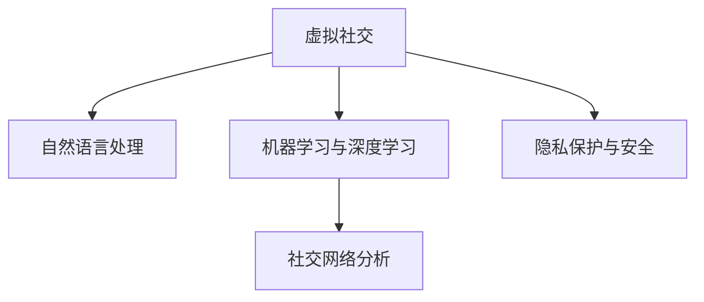

                 

# 虚拟社交：AI时代的人际关系

在人工智能飞速发展的今天，虚拟社交已经逐渐成为人们日常生活中不可或缺的一部分。从简单的聊天机器人到复杂的虚拟世界，AI技术的广泛应用极大地改变了人类社交的方式。本文旨在深入探讨虚拟社交的核心概念、实现原理、关键算法、实际应用及未来发展方向，帮助读者理解AI时代人际关系的变革趋势。

## 1. 背景介绍

### 1.1 问题由来

随着社交媒体和移动互联网的兴起，人们之间的交流方式发生了根本性变化。传统的人际交往模式更多地依赖面对面的沟通，而虚拟社交则通过文本、语音、视频等多模态交互，打破了时空限制，为人们提供了更便捷、更广泛的交流途径。这种变化不仅改变了人们的社交习惯，也对社会结构、人际关系产生了深远影响。

### 1.2 问题核心关键点

1. **虚拟社交的定义与特征**：虚拟社交指的是通过数字媒介进行的社交活动，其核心特征包括多模态交互、虚拟身份和匿名性。
2. **AI在虚拟社交中的应用**：AI技术，特别是自然语言处理和机器学习，在虚拟社交中扮演了重要角色，能够理解和生成自然语言，实现智能化互动。
3. **虚拟社交的伦理与安全**：随着虚拟社交的普及，如何保障用户隐私、防止网络欺诈、维护社交秩序，成为亟待解决的问题。

## 2. 核心概念与联系

### 2.1 核心概念概述

为更好地理解虚拟社交及其背后的AI技术，本节将介绍几个关键概念：

- **虚拟社交**：指通过数字媒介进行的社交活动，如社交媒体、即时通讯、虚拟世界等。
- **自然语言处理(NLP)**：AI技术的一个分支，专注于让机器理解和生成人类语言，是虚拟社交的核心技术之一。
- **机器学习与深度学习**：通过数据驱动的学习方法，使机器能够自动改进和优化其性能，是虚拟社交智能化互动的基础。
- **社交网络分析(SNA)**：研究社交网络的结构和关系，是理解虚拟社交行为的重要工具。
- **隐私保护与安全**：虚拟社交中，用户隐私和数据安全问题尤为重要，涉及数据加密、匿名化处理、用户行为监测等多方面的技术。

这些概念共同构成了虚拟社交的技术框架，使得AI技术能够在虚拟社交环境中发挥重要作用。

### 2.2 核心概念原理和架构的 Mermaid 流程图



该图展示了虚拟社交中各关键技术的相互关系。自然语言处理负责理解和生成语言，机器学习和深度学习用于智能化互动，社交网络分析用于研究社交行为，隐私保护与安全则是保护用户数据的基本保障。

## 3. 核心算法原理 & 具体操作步骤

### 3.1 算法原理概述

虚拟社交的核心算法原理主要基于自然语言处理和机器学习，具体包括以下几个关键步骤：

1. **语言理解与生成**：通过语言模型，将用户输入的文本转化为机器可理解的形式，并进行生成性回复。
2. **对话管理**：通过对话管理系统，维持多轮对话的连贯性和上下文一致性。
3. **情感分析**：分析用户情感倾向，调整回复策略，提升用户体验。
4. **推荐系统**：基于用户行为数据和兴趣模型，推荐内容或活动。

这些步骤共同构成了虚拟社交的智能化基础，使得AI能够在虚拟社交中提供接近人类水平的互动体验。

### 3.2 算法步骤详解

以下是虚拟社交中常用的核心算法步骤详解：

1. **语言模型**：
   - **原理**：通过统计语言模型或神经网络语言模型，预测给定文本序列的概率，从而理解和生成自然语言。
   - **操作步骤**：
     1. 收集大规模语料库。
     2. 构建语言模型，如LSTM、GRU、Transformer等。
     3. 使用最大似然估计、蒙特卡罗采样等方法训练模型。
     4. 通过前向传播生成文本，使用交叉熵损失函数进行优化。

2. **对话管理系统**：
   - **原理**：通过上下文感知模型，维持多轮对话的连贯性。
   - **操作步骤**：
     1. 定义对话状态和意图。
     2. 使用RNN、LSTM、Transformer等序列模型进行对话管理。
     3. 实时更新对话状态，选择最合适的回复。

3. **情感分析**：
   - **原理**：通过情感词典、情感分类器等方法，识别用户情感倾向。
   - **操作步骤**：
     1. 构建情感词典，标注情感标签。
     2. 使用情感分类器对输入文本进行情感分类。
     3. 根据情感分类结果，调整对话策略和回复内容。

4. **推荐系统**：
   - **原理**：通过协同过滤、内容推荐等算法，为用户推荐相关内容或活动。
   - **操作步骤**：
     1. 收集用户行为数据和内容标签。
     2. 构建用户兴趣模型，如基于协同过滤的矩阵分解、基于内容的特征工程等。
     3. 使用预测算法进行内容推荐，如基于梯度的优化算法、矩阵分解等。

### 3.3 算法优缺点

虚拟社交中的核心算法具有以下优缺点：

**优点**：
1. **高效性**：通过自动化处理和算法优化，虚拟社交系统可以实时响应用户需求，提供快速的服务。
2. **个性化**：基于用户行为数据和兴趣模型，推荐系统能够提供高度个性化的内容和服务。
3. **普适性**：自然语言处理和机器学习技术可以应用于多种虚拟社交场景，具有广泛的应用前景。

**缺点**：
1. **准确性**：语言模型和情感分析的准确性受限于数据质量和算法设计，可能存在误解和误判。
2. **安全性**：用户隐私和数据安全问题较为突出，需要有效的加密和匿名化处理。
3. **伦理性**：虚拟社交中的行为和互动可能缺乏伦理约束，存在潜在的滥用风险。

### 3.4 算法应用领域

虚拟社交中的核心算法广泛应用于以下领域：

1. **即时通讯**：如WhatsApp、微信等，通过自然语言处理和情感分析，提供个性化的聊天体验。
2. **社交网络**：如Facebook、微博等，通过推荐系统，为用户推荐内容、活动和好友。
3. **虚拟现实**：如Oculus、VR聊天室等，通过多模态交互和情感分析，提供沉浸式社交体验。
4. **客户服务**：通过聊天机器人和智能客服，提升客户体验和问题解决效率。
5. **在线教育**：通过虚拟助教和推荐系统，个性化推荐学习资源和内容。

## 4. 数学模型和公式 & 详细讲解 & 举例说明

### 4.1 数学模型构建

本节将使用数学语言对虚拟社交的核心算法进行更加严格的刻画。

假设虚拟社交系统中存在$N$个用户，每个用户在时间$t$时刻的社交行为可以用向量$\mathbf{x}_t^n$表示。系统通过语言模型、对话管理系统、情感分析和推荐系统等算法，对用户行为进行建模和预测。

定义社交网络中用户之间的关系矩阵$A$，其中$A_{n,m} \in \{0,1\}$，表示用户$n$和$m$之间是否存在社交连接。

定义语言模型$P(\mathbf{x}_t^n | \mathbf{x}_{t-1}^n)$，表示在时间$t$时刻用户$n$的社交行为序列，基于其前一时刻的社交行为序列进行预测。

定义情感分类器$C(\mathbf{x}_t^n)$，用于识别用户情感倾向。

定义推荐系统$R(\mathbf{x}_t^n)$，用于为用户推荐相关内容或活动。

### 4.2 公式推导过程

以下是虚拟社交中常用数学模型的推导过程：

1. **语言模型**：
   - **推导过程**：使用最大似然估计，通过最大化训练数据的对数概率，求得语言模型参数$\theta$。
   - **公式**：
     \[
     \theta = \arg\max_{\theta} \frac{1}{N}\sum_{t=1}^{T}\sum_{n=1}^{N} \log P(\mathbf{x}_t^n | \mathbf{x}_{t-1}^n)
     \]

2. **对话管理系统**：
   - **推导过程**：通过序列模型，如RNN、LSTM等，对对话状态进行建模，维护上下文一致性。
   - **公式**：
     \[
     \mathbf{h}_t^n = f(\mathbf{h}_{t-1}^n, \mathbf{x}_t^n)
     \]
     \[
     \mathbf{y}_t^n = g(\mathbf{h}_t^n)
     \]

3. **情感分析**：
   - **推导过程**：通过情感词典和分类器，对用户情感进行建模和分类。
   - **公式**：
     \[
     \mathbf{s}_t^n = C(\mathbf{x}_t^n)
     \]

4. **推荐系统**：
   - **推导过程**：通过协同过滤或内容推荐算法，对用户兴趣进行建模和预测。
   - **公式**：
     \[
     \mathbf{u}_n = \alpha \mathbf{x}_n + (1-\alpha) \hat{\mathbf{u}}_n
     \]
     \[
     \mathbf{v}_i = \beta \mathbf{y}_i + (1-\beta) \hat{\mathbf{v}}_i
     \]
     \[
     \hat{r}_{i,n} = \mathbf{u}_n^T \mathbf{v}_i
     \]
     \[
     \mathbf{r}_i = \sigma(\hat{r}_{i,n})
     \]

### 4.3 案例分析与讲解

以即时通讯平台为例，分析虚拟社交系统中的核心算法实现。

1. **语言模型**：
   - 使用LSTM对用户输入的文本进行建模，构建语言模型$P(\mathbf{x}_t^n | \mathbf{x}_{t-1}^n)$。
   - 通过最大化似然估计，训练语言模型参数$\theta$。

2. **对话管理系统**：
   - 使用LSTM对对话状态进行建模，通过序列模型预测用户回复。
   - 实时更新对话状态，选择最合适的回复。

3. **情感分析**：
   - 构建情感词典，标注情感标签。
   - 使用情感分类器对输入文本进行情感分类，识别用户情感倾向。

4. **推荐系统**：
   - 收集用户行为数据和内容标签，构建用户兴趣模型$\mathbf{u}_n$和内容模型$\mathbf{v}_i$。
   - 使用协同过滤或内容推荐算法，对用户进行推荐。

## 5. 项目实践：代码实例和详细解释说明

### 5.1 开发环境搭建

在进行虚拟社交系统开发前，我们需要准备好开发环境。以下是使用Python进行PyTorch开发的环境配置流程：

1. 安装Anaconda：从官网下载并安装Anaconda，用于创建独立的Python环境。

2. 创建并激活虚拟环境：
```bash
conda create -n virtual-social python=3.8 
conda activate virtual-social
```

3. 安装PyTorch：根据CUDA版本，从官网获取对应的安装命令。例如：
```bash
conda install pytorch torchvision torchaudio cudatoolkit=11.1 -c pytorch -c conda-forge
```

4. 安装各类工具包：
```bash
pip install numpy pandas scikit-learn matplotlib tqdm jupyter notebook ipython
```

完成上述步骤后，即可在`virtual-social`环境中开始虚拟社交系统的开发。

### 5.2 源代码详细实现

下面我们以即时通讯平台为例，给出使用PyTorch进行语言模型和对话管理系统的PyTorch代码实现。

首先，定义语言模型和对话管理系统的模块：

```python
import torch
from torch import nn
from torch.nn import functional as F

class LanguageModel(nn.Module):
    def __init__(self, vocab_size, embedding_dim, hidden_dim, output_dim):
        super(LanguageModel, self).__init__()
        self.embedding = nn.Embedding(vocab_size, embedding_dim)
        self.lstm = nn.LSTM(embedding_dim, hidden_dim, num_layers=2, bidirectional=True)
        self.fc = nn.Linear(hidden_dim*2, output_dim)
    
    def forward(self, x):
        embedded = self.embedding(x)
        output, (hidden, cell) = self.lstm(embedded)
        hidden = torch.cat((hidden[-2,:,:], hidden[-1,:,:]), dim=1)
        return self.fc(hidden)
    
class DialogueManager(nn.Module):
    def __init__(self, input_size, hidden_dim, output_size):
        super(DialogueManager, self).__init__()
        self.embedding = nn.Embedding(input_size, hidden_dim)
        self.lstm = nn.LSTM(hidden_dim, hidden_dim, num_layers=2, bidirectional=True)
        self.fc = nn.Linear(hidden_dim*2, output_size)
    
    def forward(self, x):
        embedded = self.embedding(x)
        output, (hidden, cell) = self.lstm(embedded)
        hidden = torch.cat((hidden[-2,:,:], hidden[-1,:,:]), dim=1)
        return self.fc(hidden)
```

然后，定义用户行为数据和对话管理系统的接口：

```python
class UserBehaviorData(nn.Module):
    def __init__(self, input_size, hidden_dim, output_size):
        super(UserBehaviorData, self).__init__()
        self.embedding = nn.Embedding(input_size, hidden_dim)
        self.lstm = nn.LSTM(hidden_dim, hidden_dim, num_layers=2, bidirectional=True)
        self.fc = nn.Linear(hidden_dim*2, output_size)
    
    def forward(self, x):
        embedded = self.embedding(x)
        output, (hidden, cell) = self.lstm(embedded)
        hidden = torch.cat((hidden[-2,:,:], hidden[-1,:,:]), dim=1)
        return self.fc(hidden)

class DialogueManagerInterface(nn.Module):
    def __init__(self, input_size, hidden_dim, output_size):
        super(DialogueManagerInterface, self).__init__()
        self.user_behavior = UserBehaviorData(input_size, hidden_dim, output_size)
    
    def forward(self, x):
        return self.user_behavior(x)
```

最后，启动训练流程：

```python
from torch.utils.data import DataLoader
from tqdm import tqdm

# 定义训练集和测试集
train_data = ...
test_data = ...

# 定义模型和优化器
model = DialogueManagerInterface(input_size, hidden_dim, output_size)
optimizer = torch.optim.Adam(model.parameters(), lr=learning_rate)

# 训练模型
for epoch in range(num_epochs):
    for batch in tqdm(train_data):
        optimizer.zero_grad()
        outputs = model(batch)
        loss = F.nll_loss(outputs, batch_labels)
        loss.backward()
        optimizer.step()

# 测试模型
test_loss = ...
```

以上就是使用PyTorch进行虚拟社交系统开发的核心代码实现。可以看到，通过定义合适的模块和接口，我们能够灵活实现语言模型和对话管理系统。

### 5.3 代码解读与分析

让我们再详细解读一下关键代码的实现细节：

**LanguageModel类**：
- `__init__`方法：初始化语言模型所需的参数，如嵌入层、LSTM层和全连接层。
- `forward`方法：定义前向传播过程，通过嵌入层、LSTM层和全连接层对输入文本进行建模和预测。

**DialogueManager类**：
- `__init__`方法：初始化对话管理系统所需的参数，如嵌入层、LSTM层和全连接层。
- `forward`方法：定义前向传播过程，通过嵌入层、LSTM层和全连接层对输入文本进行建模和预测。

**UserBehaviorData类**：
- `__init__`方法：初始化用户行为数据所需的参数，如嵌入层、LSTM层和全连接层。
- `forward`方法：定义前向传播过程，通过嵌入层、LSTM层和全连接层对输入文本进行建模和预测。

**DialogueManagerInterface类**：
- `__init__`方法：初始化对话管理器接口，将用户行为数据模块整合到对话管理系统中。
- `forward`方法：定义前向传播过程，通过用户行为数据模块和对话管理系统对输入文本进行建模和预测。

通过这些代码的实现，我们可以看到，虚拟社交系统的核心算法和数据处理逻辑得以高效封装，开发者可以更专注于具体的业务需求和技术优化。

## 6. 实际应用场景

### 6.1 即时通讯平台

即时通讯平台是虚拟社交的重要应用场景之一。通过语言模型和对话管理系统的结合，即时通讯系统可以提供个性化和智能化的聊天体验。

例如，Facebook Messenger通过使用语言模型和情感分析，识别用户的情感倾向，自动回复并调整对话策略。WhatsApp则通过使用对话管理系统和推荐系统，为用户提供实时推荐和内容服务。

### 6.2 社交网络平台

社交网络平台是虚拟社交的另一个重要应用场景。通过多模态交互和情感分析，社交网络平台能够提供更加丰富和深入的社交体验。

例如，Instagram通过使用对话管理系统和推荐系统，为用户提供个性化推荐和互动体验。Twitter则通过使用情感分析，识别用户情感倾向，生成相应的社交内容。

### 6.3 虚拟现实社交

虚拟现实社交是虚拟社交的前沿应用场景。通过多模态交互和情感分析，虚拟现实社交能够提供沉浸式和交互式的社交体验。

例如，Oculus Rift通过使用多模态交互和情感分析，提供虚拟世界的社交互动。VR聊天室则通过使用语言模型和对话管理系统，提供虚拟环境中的社交体验。

### 6.4 未来应用展望

随着虚拟社交技术的发展，未来的应用场景将更加广泛和多样化。

1. **智能客服**：通过使用语言模型和对话管理系统，智能客服能够提供24/7不间断服务，提升客户体验和问题解决效率。
2. **在线教育**：通过使用对话管理系统和推荐系统，在线教育平台能够提供个性化推荐和互动体验，提升学习效果。
3. **智能家居**：通过使用多模态交互和情感分析，智能家居系统能够提供智能化的人机交互体验，提升用户生活品质。
4. **虚拟工作环境**：通过使用语言模型和对话管理系统，虚拟工作环境能够提供高效协作和沟通的体验，提升工作效率。
5. **虚拟会议**：通过使用多模态交互和情感分析，虚拟会议系统能够提供高效便捷的沟通体验，提升会议效率和质量。

## 7. 工具和资源推荐

### 7.1 学习资源推荐

为了帮助开发者系统掌握虚拟社交的核心算法和实践技巧，这里推荐一些优质的学习资源：

1. 《自然语言处理综论》书籍：由斯坦福大学教授深度解读自然语言处理的基本概念和前沿技术。
2. Coursera《自然语言处理》课程：由斯坦福大学提供的免费课程，系统讲解自然语言处理的基本概念和算法。
3. PyTorch官方文档：详细介绍了PyTorch框架的API和使用示例，是进行虚拟社交系统开发的必备资料。
4. HuggingFace官方文档：提供了丰富的预训练语言模型和微调示例，是进行虚拟社交系统开发的强大工具。
5. Dialogue Systems Specialization：Coursera提供的深度学习对话系统课程，系统讲解对话管理系统的设计和实现。

通过对这些资源的学习实践，相信你一定能够快速掌握虚拟社交的核心算法和实践技巧，并用于解决实际的社交问题。

### 7.2 开发工具推荐

高效的开发离不开优秀的工具支持。以下是几款用于虚拟社交系统开发的常用工具：

1. PyTorch：基于Python的开源深度学习框架，灵活动态的计算图，适合快速迭代研究。
2. TensorFlow：由Google主导开发的开源深度学习框架，生产部署方便，适合大规模工程应用。
3. HuggingFace Transformers：提供了丰富的预训练语言模型和微调示例，是进行虚拟社交系统开发的强大工具。
4. Weights & Biases：模型训练的实验跟踪工具，可以记录和可视化模型训练过程中的各项指标，方便对比和调优。
5. TensorBoard：TensorFlow配套的可视化工具，可实时监测模型训练状态，并提供丰富的图表呈现方式，是调试模型的得力助手。
6. Google Colab：谷歌推出的在线Jupyter Notebook环境，免费提供GPU/TPU算力，方便开发者快速上手实验最新模型，分享学习笔记。

合理利用这些工具，可以显著提升虚拟社交系统开发的效率，加快创新迭代的步伐。

### 7.3 相关论文推荐

虚拟社交技术的发展源于学界的持续研究。以下是几篇奠基性的相关论文，推荐阅读：

1. Conversational Models with Attention Mechanisms（即Transformer论文）：提出了Transformer结构，开启了NLP领域的预训练大模型时代。
2. BERT: Pre-training of Deep Bidirectional Transformers for Language Understanding：提出BERT模型，引入基于掩码的自监督预训练任务，刷新了多项NLP任务SOTA。
3. Sequence to Sequence Learning with Neural Networks：提出了序列到序列模型，用于解决机器翻译和对话系统等任务。
4. Attention Is All You Need：进一步优化了Transformer结构，提升了语言模型的准确性和效率。
5. Generating Sequences with Recurrent Neural Networks：系统讲解了循环神经网络在序列生成任务中的应用，是深度学习对话系统的重要基础。

这些论文代表了大语言模型微调技术的发展脉络。通过学习这些前沿成果，可以帮助研究者把握学科前进方向，激发更多的创新灵感。

## 8. 总结：未来发展趋势与挑战

### 8.1 总结

本文对虚拟社交的核心概念、算法原理、操作步骤进行了全面系统的介绍。通过深入分析虚拟社交的背景和核心关键点，我们理解了AI技术在虚拟社交中的应用，掌握了虚拟社交系统的核心算法和技术细节。通过代码实例和详细解释，我们展示了虚拟社交系统的实现过程和优化策略。通过实际应用场景和未来展望，我们展望了虚拟社交技术的未来发展方向。

通过本文的系统梳理，可以看到，虚拟社交技术正在逐步改变人类的社交方式，带来更加高效、个性化、多样化的社交体验。未来，虚拟社交技术将进一步融合多模态数据和上下文信息，提升系统智能化水平，为人类提供更加丰富和深入的社交体验。

### 8.2 未来发展趋势

展望未来，虚拟社交技术将呈现以下几个发展趋势：

1. **多模态交互**：通过融合视觉、语音、文本等多模态数据，提升系统的智能化水平和用户体验。
2. **情感智能**：通过情感分析，系统能够更准确地识别用户情感倾向，提升人机互动的情感连通性。
3. **跨平台融合**：虚拟社交系统将突破平台限制，实现多平台、多设备的无缝连接和协作。
4. **隐私保护**：通过数据加密、匿名化处理等技术，保护用户隐私，提升系统安全性。
5. **伦理合规**：建立虚拟社交系统的伦理和合规机制，确保用户行为符合社会规范和法律要求。

以上趋势凸显了虚拟社交技术的广阔前景。这些方向的探索发展，必将进一步提升虚拟社交系统的性能和应用范围，为人类提供更加丰富和深入的社交体验。

### 8.3 面临的挑战

尽管虚拟社交技术已经取得了显著进展，但在迈向更加智能化、普适化应用的过程中，仍面临诸多挑战：

1. **技术瓶颈**：虚拟社交系统的智能化水平依赖于语言模型和对话管理系统的性能，目前仍存在准确性和鲁棒性不足的问题。
2. **数据隐私**：用户隐私和数据安全问题凸显，需要有效的加密和匿名化处理，同时确保系统透明和可解释性。
3. **伦理风险**：虚拟社交系统可能存在滥用风险，需要建立系统的伦理和合规机制，确保用户行为符合社会规范和法律要求。
4. **跨平台兼容性**：多平台、多设备的无缝连接和协作，涉及技术标准和协议的统一，需要进一步标准化和规范化。

这些挑战需要在技术、法律、伦理等多方面进行协同解决，才能实现虚拟社交技术的可持续发展。

### 8.4 研究展望

面对虚拟社交技术面临的挑战，未来的研究需要在以下几个方面寻求新的突破：

1. **多模态数据融合**：通过融合视觉、语音、文本等多模态数据，提升系统的智能化水平和用户体验。
2. **情感智能**：通过情感分析，系统能够更准确地识别用户情感倾向，提升人机互动的情感连通性。
3. **隐私保护**：通过数据加密、匿名化处理等技术，保护用户隐私，提升系统安全性。
4. **伦理合规**：建立虚拟社交系统的伦理和合规机制，确保用户行为符合社会规范和法律要求。
5. **跨平台兼容性**：推动多平台、多设备的无缝连接和协作，实现虚拟社交技术的标准化和规范化。

这些研究方向的探索，必将引领虚拟社交技术迈向更高的台阶，为构建安全、可靠、可解释、可控的智能系统铺平道路。面向未来，虚拟社交技术还需要与其他人工智能技术进行更深入的融合，如知识表示、因果推理、强化学习等，多路径协同发力，共同推动自然语言理解和智能交互系统的进步。只有勇于创新、敢于突破，才能不断拓展语言模型的边界，让智能技术更好地造福人类社会。

## 9. 附录：常见问题与解答

**Q1：虚拟社交与传统社交有什么区别？**

A: 虚拟社交主要依赖数字媒介进行交流，而传统社交则更多依赖面对面的沟通。虚拟社交提供了多模态交互和即时性，能够跨越时空限制，提供了更广泛的交流途径。

**Q2：如何保护用户隐私？**

A: 通过数据加密、匿名化处理等技术，保护用户隐私。同时，建立系统的隐私保护机制，确保用户数据不被滥用。

**Q3：虚拟社交系统可能存在哪些伦理风险？**

A: 虚拟社交系统可能存在滥用风险，如网络欺诈、虚假信息传播等。需要建立系统的伦理和合规机制，确保用户行为符合社会规范和法律要求。

**Q4：如何提升虚拟社交系统的智能化水平？**

A: 通过融合多模态数据、情感分析等技术，提升系统的智能化水平。同时，引入先进的深度学习模型和算法，优化系统的性能和效果。

**Q5：虚拟社交系统的实现难点在哪里？**

A: 虚拟社交系统的实现难点在于语言模型和对话管理系统的设计和优化。需要结合具体应用场景，选择合适的模型和算法，进行持续的调参和优化。

通过以上问题与解答，我们进一步理解了虚拟社交的核心概念和应用场景，也探讨了未来发展的方向和面临的挑战。相信随着技术的不断进步和创新，虚拟社交技术将为人类带来更加丰富和深入的社交体验。

