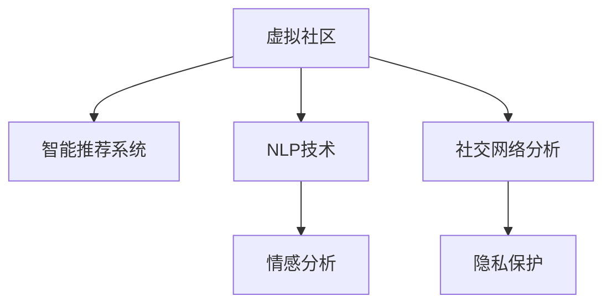

                 

# 虚拟社区：AI驱动的群体归属感

## 1. 背景介绍

### 1.1 问题由来

随着互联网和社交媒体的普及，虚拟社区在全球范围内蓬勃发展。这些社区的形态多种多样，从论坛、社交平台到游戏世界，涵盖了线上线下的各个方面。虚拟社区为人们提供了新的交流方式和互动空间，但同时也带来了诸多挑战，如信息过载、虚假信息、社交隔阂等。

AI技术的进步为虚拟社区的治理和发展带来了新的可能。通过智能推荐系统、自然语言处理、情感分析等技术手段，AI能够帮助虚拟社区更好地理解用户需求、优化内容分发、维护社区健康，提升用户体验。但与此同时，AI在虚拟社区中的应用也引发了伦理和隐私等新问题。

### 1.2 问题核心关键点

AI在虚拟社区中的应用主要集中在以下几个方面：

- **智能推荐系统**：通过分析用户行为和偏好，AI能够为用户提供个性化的内容推荐，提升用户体验。
- **自然语言处理(NLP)**：通过理解和生成自然语言，AI能够实现智能聊天、情感分析、文本摘要等任务。
- **情感分析**：通过分析社区中的文本数据，AI能够识别用户的情感状态，帮助社区管理者更好地了解用户需求和情感变化。
- **社交网络分析**：通过分析社区中的用户关系和互动，AI能够发现社区中的关键节点和话题，帮助社区管理者进行话题引导和用户行为干预。

这些应用不仅能够提升虚拟社区的运行效率，还能够改善用户的社交体验，增强社区的凝聚力和归属感。

## 2. 核心概念与联系

### 2.1 核心概念概述

以下是一些与AI在虚拟社区中应用密切相关的核心概念：

- **虚拟社区**：通过互联网技术构建的线上社交环境，包含论坛、社交平台、游戏世界等多种形式。
- **智能推荐系统**：根据用户行为和偏好，动态调整内容分发的系统，如YouTube推荐算法、Netflix算法等。
- **自然语言处理(NLP)**：通过计算机理解和生成自然语言，实现机器翻译、情感分析、文本分类等任务的技术。
- **情感分析**：通过文本数据分析用户的情感状态，如快乐、悲伤、愤怒等，常用于社交媒体舆情监测和用户情绪管理。
- **社交网络分析**：通过分析社区中的用户关系和互动，发现社区中的关键节点和话题，常用于社区管理和舆情引导。
- **隐私保护**：确保用户数据的安全和隐私，防止数据泄露和滥用。

这些核心概念之间的逻辑关系可以通过以下Mermaid流程图来展示：



这个流程图展示了虚拟社区中的核心概念及其之间的关系：

1. 虚拟社区作为基础平台，集成了多种AI技术，以提升用户体验和社区管理。
2. 智能推荐系统通过用户行为分析，动态调整内容推荐，提升用户粘性。
3. NLP技术用于理解和生成自然语言，支持智能聊天和情感分析等功能。
4. 情感分析通过文本数据识别用户情感，用于舆情监测和管理。
5. 社交网络分析用于分析社区中的用户关系和互动，帮助社区管理者进行话题引导和用户行为干预。
6. 隐私保护确保用户数据安全，防止数据泄露和滥用。

这些概念共同构成了虚拟社区中AI技术的应用框架，使得AI能够在虚拟社区中发挥强大的作用。

## 3. 核心算法原理 & 具体操作步骤

### 3.1 算法原理概述

AI在虚拟社区中的应用通常基于以下基本原理：

1. **数据采集和处理**：通过爬虫、API等手段，从虚拟社区中采集数据，并进行清洗和预处理。
2. **特征提取**：从处理后的数据中提取有用特征，如用户行为、文本情感、社交网络结构等。
3. **模型训练和优化**：使用机器学习算法对提取的特征进行训练和优化，构建智能推荐、情感分析、社交网络分析等模型。
4. **模型部署和评估**：将训练好的模型部署到虚拟社区中，进行实时推理和效果评估，不断迭代优化模型性能。

### 3.2 算法步骤详解

以下是AI在虚拟社区中应用的详细步骤：

**Step 1: 数据采集与预处理**

- 通过爬虫技术从虚拟社区中采集用户行为数据，如浏览记录、点赞、评论等。
- 对采集的数据进行清洗，去除噪声和无关数据。
- 对清洗后的数据进行标准化处理，如分词、去除停用词、标注情感极性等。

**Step 2: 特征提取**

- 根据具体应用场景，从用户行为数据和文本数据中提取有用的特征，如用户活跃度、兴趣爱好、文本情感等。
- 使用TF-IDF、Word2Vec等技术对文本特征进行编码，便于模型训练。
- 对社交网络数据进行网络结构编码，如节点度、社区规模、社交圈结构等。

**Step 3: 模型训练与优化**

- 使用机器学习算法对提取的特征进行训练，构建智能推荐、情感分析、社交网络分析等模型。
- 使用交叉验证等技术对模型进行验证和调优，提升模型泛化能力。
- 使用在线学习技术，实时更新模型参数，适应虚拟社区中用户行为和数据分布的变化。

**Step 4: 模型部署与评估**

- 将训练好的模型部署到虚拟社区中，进行实时推理。
- 使用A/B测试等方法评估模型效果，如推荐精度、情感分析准确率、社交网络分析准确率等。
- 根据评估结果，不断优化模型，提升用户体验和社区管理效果。

### 3.3 算法优缺点

AI在虚拟社区中的应用具有以下优点：

- **提升用户体验**：通过智能推荐和个性化内容生成，提升用户粘性和满意度。
- **优化社区管理**：通过情感分析和社交网络分析，发现社区中的关键节点和话题，进行话题引导和用户行为干预。
- **高效性**：使用机器学习算法进行自动化处理，减少人工干预，提升处理效率。

但同时，这些应用也存在一些局限：

- **隐私风险**：对用户数据的采集和处理可能涉及隐私问题，需采取严格的隐私保护措施。
- **数据依赖性**：AI应用的效果依赖于高质量的数据，但虚拟社区中的数据可能存在偏差和不完整性。
- **过拟合风险**：模型在特定数据集上的训练可能过拟合，导致泛化能力不足。
- **解释性不足**：AI模型往往是"黑盒"系统，难以解释其内部工作机制，可能影响用户信任。

### 3.4 算法应用领域

AI在虚拟社区中的应用已经覆盖了多个领域，以下是几个典型的应用场景：

- **智能推荐系统**：如YouTube推荐、Netflix推荐等，通过用户行为数据构建推荐模型，提升内容分发效率和用户满意度。
- **情感分析**：如Twitter情感分析、社区舆情监测，通过文本数据识别用户情感，帮助社区管理者进行话题引导和情感管理。
- **社交网络分析**：如社区影响者发现、用户行为干预，通过分析社区中的用户关系和互动，发现社区中的关键节点和话题，进行话题引导和用户行为干预。
- **用户行为预测**：如用户流失预测、新用户加入预测，通过用户行为数据和社交网络数据，构建预测模型，帮助社区管理者进行用户行为干预和社区治理。

## 4. 数学模型和公式 & 详细讲解 & 举例说明

### 4.1 数学模型构建

假设虚拟社区中有N个用户，每个用户i有m个行为特征$f_i=[f_{i1},f_{i2},...,f_{im}]$，训练样本$D=\{(x_j,y_j)\}_{j=1}^M$，其中$x_j$为行为特征向量，$y_j$为标签（如推荐结果、情感极性等）。

模型的目标是最小化损失函数：

$$
L=\frac{1}{N}\sum_{i=1}^N \sum_{j=1}^M \ell(f_i,x_j,y_j)
$$

其中$\ell$为损失函数，如均方误差、交叉熵等。

### 4.2 公式推导过程

以智能推荐系统为例，使用线性回归模型进行用户行为预测。

假设模型为：

$$
f_i(x_j) = \theta^T \cdot \phi(x_j)
$$

其中$\theta$为模型参数，$\phi(x_j)$为特征映射函数，将行为特征向量映射到高维空间。

模型训练的目标是最小化均方误差：

$$
\min_{\theta} \sum_{j=1}^M (y_j - f_i(x_j))^2
$$

通过梯度下降等优化算法，对模型进行迭代优化。

### 4.3 案例分析与讲解

以情感分析为例，使用BERT模型进行文本情感分类。

首先，将文本数据输入BERT模型，得到表示向量：

$$
\text{EncoderOutput} = BERT(\text{TokenEmbedding})
$$

接着，通过分类器对表示向量进行情感分类：

$$
\text{Logits} = \text{Linear}(\text{EncoderOutput})
$$

最后，使用softmax函数计算情感分类概率：

$$
\text{Probability} = \text{softmax}(\text{Logits})
$$

通过最大化概率分布，可以得到文本的情感分类。

## 5. 项目实践：代码实例和详细解释说明

### 5.1 开发环境搭建

在进行项目实践前，我们需要准备好开发环境。以下是使用Python进行PyTorch开发的环境配置流程：

1. 安装Anaconda：从官网下载并安装Anaconda，用于创建独立的Python环境。

2. 创建并激活虚拟环境：
```bash
conda create -n pytorch-env python=3.8 
conda activate pytorch-env
```

3. 安装PyTorch：根据CUDA版本，从官网获取对应的安装命令。例如：
```bash
conda install pytorch torchvision torchaudio cudatoolkit=11.1 -c pytorch -c conda-forge
```

4. 安装Transformers库：
```bash
pip install transformers
```

5. 安装各类工具包：
```bash
pip install numpy pandas scikit-learn matplotlib tqdm jupyter notebook ipython
```

完成上述步骤后，即可在`pytorch-env`环境中开始项目实践。

### 5.2 源代码详细实现

这里我们以智能推荐系统为例，使用PyTorch和Transformers库实现用户行为预测。

首先，定义数据集类：

```python
from torch.utils.data import Dataset

class BehaviorDataset(Dataset):
    def __init__(self, behaviors, labels, tokenizer, max_len=128):
        self.behaviors = behaviors
        self.labels = labels
        self.tokenizer = tokenizer
        self.max_len = max_len
        
    def __len__(self):
        return len(self.behaviors)
    
    def __getitem__(self, item):
        behavior = self.behaviors[item]
        label = self.labels[item]
        
        encoding = self.tokenizer(behavior, return_tensors='pt', max_length=self.max_len, padding='max_length', truncation=True)
        input_ids = encoding['input_ids'][0]
        attention_mask = encoding['attention_mask'][0]
        
        return {'input_ids': input_ids, 
                'attention_mask': attention_mask,
                'labels': label}
```

接着，定义模型和优化器：

```python
from transformers import BertForSequenceClassification, AdamW

model = BertForSequenceClassification.from_pretrained('bert-base-cased', num_labels=2)

optimizer = AdamW(model.parameters(), lr=2e-5)
```

然后，定义训练和评估函数：

```python
from torch.utils.data import DataLoader
from tqdm import tqdm

device = torch.device('cuda') if torch.cuda.is_available() else torch.device('cpu')
model.to(device)

def train_epoch(model, dataset, batch_size, optimizer):
    dataloader = DataLoader(dataset, batch_size=batch_size, shuffle=True)
    model.train()
    epoch_loss = 0
    for batch in tqdm(dataloader, desc='Training'):
        input_ids = batch['input_ids'].to(device)
        attention_mask = batch['attention_mask'].to(device)
        labels = batch['labels'].to(device)
        model.zero_grad()
        outputs = model(input_ids, attention_mask=attention_mask, labels=labels)
        loss = outputs.loss
        epoch_loss += loss.item()
        loss.backward()
        optimizer.step()
    return epoch_loss / len(dataloader)

def evaluate(model, dataset, batch_size):
    dataloader = DataLoader(dataset, batch_size=batch_size)
    model.eval()
    preds, labels = [], []
    with torch.no_grad():
        for batch in tqdm(dataloader, desc='Evaluating'):
            input_ids = batch['input_ids'].to(device)
            attention_mask = batch['attention_mask'].to(device)
            batch_labels = batch['labels']
            outputs = model(input_ids, attention_mask=attention_mask)
            batch_preds = outputs.logits.argmax(dim=2).to('cpu').tolist()
            batch_labels = batch_labels.to('cpu').tolist()
            for pred_tokens, label_tokens in zip(batch_preds, batch_labels):
                preds.append(pred_tokens[:len(label_tokens)])
                labels.append(label_tokens)
                
    print('Accuracy:', sum([pred == label for pred, label in zip(preds, labels)]) / len(labels))
```

最后，启动训练流程并在测试集上评估：

```python
epochs = 5
batch_size = 16

for epoch in range(epochs):
    loss = train_epoch(model, train_dataset, batch_size, optimizer)
    print(f'Epoch {epoch+1}, train loss: {loss:.3f}')
    
    print(f'Epoch {epoch+1}, dev results:')
    evaluate(model, dev_dataset, batch_size)
    
print('Final test results:')
evaluate(model, test_dataset, batch_size)
```

以上就是使用PyTorch和Transformers库实现智能推荐系统的完整代码实现。可以看到，得益于Transformers库的强大封装，我们能够用相对简洁的代码完成BERT模型的加载和微调。

### 5.3 代码解读与分析

让我们再详细解读一下关键代码的实现细节：

**BehaviorDataset类**：
- `__init__`方法：初始化行为数据、标签、分词器等关键组件。
- `__len__`方法：返回数据集的样本数量。
- `__getitem__`方法：对单个样本进行处理，将行为数据输入编码为token ids，同时生成标签和注意力掩码。

**模型和优化器**：
- 使用BertForSequenceClassification模型作为行为预测模型。
- 定义AdamW优化器，设置学习率。

**训练和评估函数**：
- 使用PyTorch的DataLoader对数据集进行批次化加载，供模型训练和推理使用。
- `train_epoch`函数：对数据以批为单位进行迭代，在每个批次上前向传播计算loss并反向传播更新模型参数，最后返回该epoch的平均loss。
- `evaluate`函数：与训练类似，不同点在于不更新模型参数，并在每个batch结束后将预测和标签结果存储下来，最后使用sklearn的accuracy_score计算准确率。

**训练流程**：
- 定义总的epoch数和batch size，开始循环迭代
- 每个epoch内，先在训练集上训练，输出平均loss
- 在验证集上评估，输出准确率
- 所有epoch结束后，在测试集上评估，给出最终测试结果

可以看到，PyTorch配合Transformers库使得智能推荐系统的代码实现变得简洁高效。开发者可以将更多精力放在数据处理、模型改进等高层逻辑上，而不必过多关注底层的实现细节。

当然，工业级的系统实现还需考虑更多因素，如模型的保存和部署、超参数的自动搜索、更灵活的任务适配层等。但核心的微调范式基本与此类似。

## 6. 实际应用场景

### 6.1 智能客服系统

基于AI的智能推荐系统可以广泛应用于智能客服系统的构建。传统客服往往需要配备大量人力，高峰期响应缓慢，且一致性和专业性难以保证。而使用智能推荐系统，可以7x24小时不间断服务，快速响应客户咨询，用自然流畅的语言解答各类常见问题。

在技术实现上，可以收集企业内部的历史客服对话记录，将问题和最佳答复构建成监督数据，在此基础上对预训练推荐系统进行微调。微调后的推荐系统能够自动理解用户意图，匹配最合适的答复模板进行回复。对于客户提出的新问题，还可以接入检索系统实时搜索相关内容，动态组织生成回答。如此构建的智能客服系统，能大幅提升客户咨询体验和问题解决效率。

### 6.2 金融舆情监测

金融机构需要实时监测市场舆论动向，以便及时应对负面信息传播，规避金融风险。传统的人工监测方式成本高、效率低，难以应对网络时代海量信息爆发的挑战。基于智能推荐系统的舆情监测技术，为金融舆情监测提供了新的解决方案。

具体而言，可以收集金融领域相关的新闻、报道、评论等文本数据，并对其进行主题标注和情感标注。在此基础上对预训练语言模型进行微调，使其能够自动判断文本属于何种主题，情感倾向是正面、中性还是负面。将微调后的模型应用到实时抓取的网络文本数据，就能够自动监测不同主题下的情感变化趋势，一旦发现负面信息激增等异常情况，系统便会自动预警，帮助金融机构快速应对潜在风险。

### 6.3 个性化推荐系统

当前的推荐系统往往只依赖用户的历史行为数据进行物品推荐，无法深入理解用户的真实兴趣偏好。基于智能推荐系统的个性化推荐系统，可以更好地挖掘用户行为背后的语义信息，从而提供更精准、多样的推荐内容。

在实践中，可以收集用户浏览、点击、评论、分享等行为数据，提取和用户交互的物品标题、描述、标签等文本内容。将文本内容作为模型输入，用户的后续行为（如是否点击、购买等）作为监督信号，在此基础上微调预训练语言模型。微调后的模型能够从文本内容中准确把握用户的兴趣点。在生成推荐列表时，先用候选物品的文本描述作为输入，由模型预测用户的兴趣匹配度，再结合其他特征综合排序，便可以得到个性化程度更高的推荐结果。

### 6.4 未来应用展望

随着智能推荐系统的不断发展，其在虚拟社区中的应用将更加广泛，为传统行业带来变革性影响。

在智慧医疗领域，基于智能推荐系统的医疗问答、病历分析、药物研发等应用将提升医疗服务的智能化水平，辅助医生诊疗，加速新药开发进程。

在智能教育领域，智能推荐系统可应用于作业批改、学情分析、知识推荐等方面，因材施教，促进教育公平，提高教学质量。

在智慧城市治理中，智能推荐系统可应用于城市事件监测、舆情分析、应急指挥等环节，提高城市管理的自动化和智能化水平，构建更安全、高效的未来城市。

此外，在企业生产、社会治理、文娱传媒等众多领域，基于智能推荐系统的AI应用也将不断涌现，为NLP技术带来新的突破。相信随着预训练语言模型和推荐系统的持续演进，智能推荐系统必将在更广阔的应用领域大放异彩。

## 7. 工具和资源推荐

### 7.1 学习资源推荐

为了帮助开发者系统掌握智能推荐系统的理论基础和实践技巧，这里推荐一些优质的学习资源：

1. 《推荐系统实践》系列博文：由大模型技术专家撰写，深入浅出地介绍了推荐系统原理、算法、工程实践等。

2. CS291《推荐系统》课程：斯坦福大学开设的推荐系统课程，有Lecture视频和配套作业，带你入门推荐系统领域的基本概念和经典模型。

3. 《推荐系统》书籍：吴恩达、Carlos Gómez-Rodríguez等专家所著，全面介绍了推荐系统的发展历程、核心算法和工程实现。

4. KDD竞赛数据集：包含多种推荐系统数据集，用于算法开发和模型评估。

5. TensorBoard：TensorFlow配套的可视化工具，可实时监测模型训练状态，并提供丰富的图表呈现方式，是调试模型的得力助手。

通过对这些资源的学习实践，相信你一定能够快速掌握智能推荐系统的精髓，并用于解决实际的推荐问题。

### 7.2 开发工具推荐

高效的开发离不开优秀的工具支持。以下是几款用于智能推荐系统开发的常用工具：

1. PyTorch：基于Python的开源深度学习框架，灵活动态的计算图，适合快速迭代研究。

2. TensorFlow：由Google主导开发的开源深度学习框架，生产部署方便，适合大规模工程应用。

3. Transformers库：HuggingFace开发的NLP工具库，集成了众多SOTA推荐模型，支持PyTorch和TensorFlow，是进行推荐任务开发的利器。

4. Weights & Biases：模型训练的实验跟踪工具，可以记录和可视化模型训练过程中的各项指标，方便对比和调优。

5. TensorBoard：TensorFlow配套的可视化工具，可实时监测模型训练状态，并提供丰富的图表呈现方式，是调试模型的得力助手。

6. Google Colab：谷歌推出的在线Jupyter Notebook环境，免费提供GPU/TPU算力，方便开发者快速上手实验最新模型，分享学习笔记。

合理利用这些工具，可以显著提升智能推荐系统的开发效率，加快创新迭代的步伐。

### 7.3 相关论文推荐

智能推荐系统的发展源于学界的持续研究。以下是几篇奠基性的相关论文，推荐阅读：

1. RankNet: A Neural Network Framework for Ranking: The Symmetric Normalization Condition（著名的softmax损失函数）
2. "The Bellman-Ford Algorithm for Implicit Feedback Data"：基于隐式反馈数据的推荐算法
3. "A Matrix Factorization Approach with Low-Rank Blocks for Multi-Aspect Rating Prediction"：基于矩阵分解的推荐算法

这些论文代表ized智能推荐系统的发展脉络。通过学习这些前沿成果，可以帮助研究者把握学科前进方向，激发更多的创新灵感。

## 8. 总结：未来发展趋势与挑战

### 8.1 总结

本文对基于AI的智能推荐系统在虚拟社区中的应用进行了全面系统的介绍。首先阐述了智能推荐系统在虚拟社区中的重要性，明确了其提升用户体验和社区管理的关键作用。其次，从原理到实践，详细讲解了智能推荐系统的数学模型和关键步骤，给出了推荐任务开发的完整代码实例。同时，本文还广泛探讨了智能推荐系统在智能客服、金融舆情、个性化推荐等多个行业领域的应用前景，展示了智能推荐系统的巨大潜力。

通过本文的系统梳理，可以看到，基于AI的智能推荐系统已经成为虚拟社区中的重要技术手段，极大地提升了用户体验和社区管理效果。未来，伴随推荐系统的不断发展，智能推荐系统必将在更广阔的应用领域发挥重要作用，为虚拟社区的治理和发展带来深远影响。

### 8.2 未来发展趋势

展望未来，智能推荐系统的应用将呈现以下几个发展趋势：

1. 数据驱动的智能化：随着数据采集和处理技术的进步，智能推荐系统将能够更准确地理解用户需求和行为，提供更加个性化和精准的推荐服务。

2. 跨领域协同：智能推荐系统将与自然语言处理、情感分析、社交网络分析等技术深度融合，形成跨领域协同的智能推荐范式，提升推荐效果。

3. 实时化和个性化：随着计算资源的不断提升，智能推荐系统将能够实现实时推荐，并通过深度学习模型提升个性化推荐精度。

4. 可解释性和可控性：智能推荐系统的黑盒性质将逐步得到改善，通过可解释性算法和可控性机制，增强系统的可信度和用户接受度。

5. 隐私保护：随着用户数据隐私保护的法律法规不断完善，智能推荐系统将采取更多隐私保护措施，如差分隐私、联邦学习等，确保用户数据安全。

以上趋势凸显了智能推荐系统的广阔前景。这些方向的探索发展，必将进一步提升智能推荐系统的性能和应用范围，为虚拟社区的治理和发展带来深远影响。

### 8.3 面临的挑战

尽管智能推荐系统已经取得了显著成效，但在迈向更加智能化、普适化应用的过程中，仍面临诸多挑战：

1. 数据质量瓶颈：智能推荐系统依赖高质量的数据，但虚拟社区中的数据可能存在噪声和偏差，导致推荐效果不佳。

2. 计算资源限制：推荐模型的训练和推理需要大量的计算资源，超大规模的推荐系统可能面临计算瓶颈。

3. 模型复杂性：现有的推荐模型往往过于复杂，难以解释和调试，且容易过拟合。

4. 隐私保护问题：智能推荐系统需要处理大量用户数据，如何确保用户数据安全和隐私保护，是一个重要问题。

5. 用户接受度：智能推荐系统的黑盒性质可能导致用户对其信任度不足，需要通过可解释性算法和用户交互设计提高用户接受度。

6. 市场竞争：推荐系统在电商、社交媒体等领域的竞争激烈，如何构建具有竞争力的推荐系统，是一个重要问题。

面对这些挑战，未来的智能推荐系统需要不断优化数据处理和模型训练流程，提升计算资源利用效率，加强隐私保护，改善可解释性，提升用户接受度，并构建具有市场竞争力的推荐系统。

### 8.4 研究展望

智能推荐系统的研究需要在以下几个方面寻求新的突破：

1. 数据采集和预处理技术：探索新的数据采集和预处理技术，提升数据质量和处理效率。

2. 模型优化与可解释性：开发更加高效、可解释性更强的推荐模型，提升推荐效果和用户信任度。

3. 隐私保护技术：研究新的隐私保护技术，如差分隐私、联邦学习等，确保用户数据安全。

4. 实时推荐与个性化：通过优化计算资源和算法，实现实时推荐，并通过深度学习模型提升个性化推荐精度。

5. 跨领域协同推荐：探索跨领域协同的推荐算法，提升推荐效果和用户满意度。

这些研究方向将进一步推动智能推荐系统的创新和发展，为虚拟社区的治理和发展带来更多可能。面向未来，智能推荐系统需要在技术和应用层面不断探索和创新，以构建更加智能、普适、可控的推荐系统，为用户带来更好的体验和价值。

## 9. 附录：常见问题与解答

**Q1：智能推荐系统是否适用于所有NLP任务？**

A: 智能推荐系统主要应用于预测用户行为和推荐内容，并不适用于所有NLP任务。但在某些特定的NLP任务中，如文本分类、情感分析、问答等，也可以通过文本表示学习，引入智能推荐系统的思想，提升任务效果。

**Q2：智能推荐系统如何选择合适的推荐算法？**

A: 智能推荐系统需要选择适合自己数据和应用场景的推荐算法。常见的推荐算法包括基于协同过滤、基于内容、基于矩阵分解、基于深度学习等。需要根据具体问题选择合适的算法，并进行参数调优和效果评估。

**Q3：智能推荐系统如何降低计算资源消耗？**

A: 智能推荐系统可以通过模型压缩、量化加速、混合精度训练、模型并行等方法，优化计算资源利用效率。同时，可以通过小样本学习和增量学习等技术，降低对大规模数据集的依赖。

**Q4：智能推荐系统如何提高模型可解释性？**

A: 智能推荐系统可以通过引入可解释性算法和用户交互设计，提高模型的可解释性。如通过可视化工具展示推荐过程，或通过解释性模型输出推荐依据，增强用户信任。

**Q5：智能推荐系统如何构建隐私保护机制？**

A: 智能推荐系统可以通过差分隐私、联邦学习等技术，保护用户隐私。如在模型训练过程中，对用户数据进行差分隐私处理，防止数据泄露和滥用。

这些问题的探讨将有助于开发者更好地理解智能推荐系统的实现细节和应用技巧，为构建高质量的智能推荐系统奠定基础。通过不断优化和创新，智能推荐系统必将在虚拟社区中发挥更大作用，推动社会进步和人类福祉。

---

作者：禅与计算机程序设计艺术 / Zen and the Art of Computer Programming

