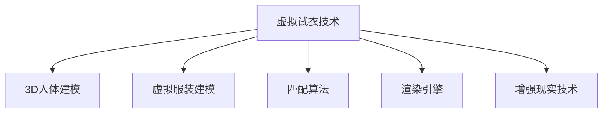

                 

# 虚拟试衣创业：在线购物体验的革新

## 1. 背景介绍

### 1.1 问题由来
随着电子商务的迅猛发展，消费者越来越多地选择在网上购物。然而，在线购物的体验始终无法与线下实体店相比，尤其是对于服装类商品，尺寸、版型、材质等细节对穿着体验至关重要。消费者无法直接看到实物，往往需要根据网上的描述和图片进行推测，这极大地影响了购买决策。

### 1.2 问题核心关键点
传统服装电商的痛点在于无法提供直观的穿着效果预览。虚拟试衣技术通过计算机视觉和3D建模技术，将用户的身体数据与服装模型进行匹配，使用户在购买前即可在线上获得与实际试穿类似的体验。虚拟试衣能够解决用户试穿服装时面临的尺寸、版型、材质等实际问题，提升用户满意度和购物转化率，是未来电商发展的关键技术之一。

### 1.3 问题研究意义
虚拟试衣技术对于提升电商平台的竞争力和用户体验具有重要意义：

1. **提升用户体验**：虚拟试衣让用户能够直观地看到自己穿上服装的效果，降低试衣成本，提高购物满意度。
2. **提高转化率**：虚拟试衣通过提供接近真实的穿着效果预览，减少了因尺寸不合适、款式不喜欢等问题导致的退货率，从而提高了用户的购买决策速度。
3. **拓展业务场景**：虚拟试衣不仅适用于服装行业，还适用于鞋帽、箱包、首饰等多种品类，具有广泛的应用前景。
4. **开辟新业务**：虚拟试衣技术可以与个性化推荐、个性化定制、虚拟互动等相结合，开辟新的商业模式，推动电商平台的数字化转型。

## 2. 核心概念与联系

### 2.1 核心概念概述

为更好地理解虚拟试衣技术，本节将介绍几个密切相关的核心概念：

- **虚拟试衣技术**：利用计算机视觉、3D建模、交互设计等技术，将用户的身体数据与服装模型进行匹配，使用户能够在线上获得类似实际试穿的体验。
- **3D人体建模**：使用扫描、图像处理、姿态估计等技术，构建用户的三维人体模型。
- **虚拟服装建模**：将服装的设计数据转换为三维模型，以便与用户的三维人体模型进行匹配。
- **匹配算法**：将用户的三维人体模型与服装模型进行匹配，计算出服装在用户身上的效果。
- **渲染引擎**：用于生成真实感强的视觉效果，模拟用户试穿服装的场景。
- **增强现实(AR)技术**：将虚拟试衣的场景与现实世界进行融合，提供沉浸式的体验。

这些核心概念之间的逻辑关系可以通过以下Mermaid流程图来展示：



这个流程图展示了虚拟试衣技术的主要组成部分及其关系：3D人体建模、虚拟服装建模、匹配算法、渲染引擎和增强现实技术共同构成了虚拟试衣技术的实现框架，使得用户能够在虚拟场景中试穿服装，提升购物体验。

## 3. 核心算法原理 & 具体操作步骤
### 3.1 算法原理概述

虚拟试衣技术的核心在于将用户的3D人体模型与服装的3D模型进行精确匹配，并结合渲染技术生成逼真的试穿效果。具体流程包括：

1. **3D人体建模**：使用深度摄像头、激光扫描仪等设备获取用户的三维人体数据，或通过用户手动上传的方式生成3D人体模型。
2. **虚拟服装建模**：将服装的设计数据转换为3D模型，包括款式、颜色、材质等细节。
3. **人体-服装匹配**：将用户的三维人体模型与服装的3D模型进行匹配，计算出服装在用户身上的效果。
4. **渲染与显示**：使用渲染引擎生成逼真的试穿效果，通过增强现实技术在用户的真实环境中展示试穿结果。

### 3.2 算法步骤详解

**Step 1: 3D人体建模**

- **深度摄像头获取**：使用深度摄像头如Microsoft Kinect、Intel RealSense等设备，获取用户的三维人体数据，包括深度图和彩色图像。
- **点云处理**：对深度图像进行预处理，去除噪声和背景，生成点云数据。
- **人体姿态估计**：使用深度学习模型，如OpenPose、PoseNet等，对点云数据进行姿态估计，提取关键部位的坐标。
- **网格生成**：将关键部位的坐标转换为网格模型，并进行平滑处理，生成完整的三维人体模型。

**Step 2: 虚拟服装建模**

- **二维设计图转换**：将服装的二维设计图通过扫描仪、相机等设备转换为三维模型。
- **曲面拼接**：将不同的曲面片拼接在一起，生成完整的服装三维模型。
- **材质与颜色映射**：为服装模型添加材质和颜色信息，以便渲染引擎生成真实的视觉效果。

**Step 3: 人体-服装匹配**

- **参数化匹配**：将用户的三维人体模型和服装的3D模型进行参数化匹配，计算出服装在用户身上的效果。常用的方法包括基于变形模型的匹配、基于多模态融合的匹配等。
- **优化算法**：使用优化算法，如非线性最小二乘、遗传算法等，对匹配参数进行优化，提高匹配精度。
- **尺寸调整**：根据用户输入的尺寸信息，调整服装模型的大小和形态，以适应不同的用户。

**Step 4: 渲染与显示**

- **渲染引擎选择**：根据需求选择合适的渲染引擎，如Unity、Unreal Engine等，进行服装效果渲染。
- **虚拟试穿场景**：将渲染后的虚拟试穿场景通过增强现实技术展示给用户，如通过AR眼镜、手机等设备进行展示。
- **用户交互**：使用手势识别、语音识别等技术，实现用户与虚拟试衣场景的互动，如旋转、缩放、选择服装等。

### 3.3 算法优缺点

虚拟试衣技术具有以下优点：

1. **提升用户体验**：虚拟试衣提供直观的试穿效果预览，帮助用户更好地选择服装，减少因尺寸不合适、款式不喜欢等问题导致的退货率。
2. **提高转化率**：通过提供接近真实的穿着效果预览，减少了试衣成本，提高了用户的购买决策速度。
3. **拓展业务场景**：虚拟试衣技术不仅适用于服装行业，还适用于鞋帽、箱包、首饰等多种品类，具有广泛的应用前景。

同时，该技术也存在一定的局限性：

1. **数据隐私问题**：3D人体建模需要获取用户的深度信息，涉及隐私保护问题。
2. **精度问题**：虚拟试衣需要高精度的3D建模和匹配算法，对于复杂的服装设计和高个体的用户，匹配精度可能有限。
3. **计算资源需求**：虚拟试衣技术需要强大的计算资源，尤其是在渲染和交互方面，对硬件要求较高。

尽管存在这些局限性，但虚拟试衣技术作为未来电商发展的关键技术，其潜力和应用前景依然巨大。

### 3.4 算法应用领域

虚拟试衣技术广泛应用于以下领域：

- **服装电商**：提升用户试穿体验，降低因尺寸不合适、款式不喜欢等问题导致的退货率。
- **家居装饰**：用户可以虚拟地试穿窗帘、床单等家居用品，提升购物体验。
- **汽车行业**：用户可以虚拟地试穿不同的汽车座椅、方向盘等，提高用户的车辆购买决策速度。
- **医疗领域**：医生可以根据虚拟试衣技术为患者提供试穿假肢、义肢等辅助设备，提高患者的生活质量。
- **游戏与娱乐**：在虚拟游戏和娱乐场景中，用户可以通过虚拟试衣技术尝试不同的服装和装备，提升游戏体验。

## 4. 数学模型和公式 & 详细讲解  
### 4.1 数学模型构建

本节将使用数学语言对虚拟试衣技术的实现进行更加严格的刻画。

记用户的三维人体模型为 $M_u = (X_u, Y_u, Z_u)$，服装的3D模型为 $M_c = (X_c, Y_c, Z_c)$。设 $\theta$ 为人体姿态参数，$\phi$ 为服装参数。则虚拟试衣的数学模型可以表示为：

$$
M_{u,c} = f_{M_u}(\theta) \cup f_{M_c}(\phi) \cup f_{match}(\theta, \phi)
$$

其中 $f_{M_u}$ 为人体姿态模型，$f_{M_c}$ 为服装模型，$f_{match}$ 为人体-服装匹配算法。

### 4.2 公式推导过程

以基于变形模型的匹配算法为例，推导虚拟试衣的匹配过程。

假设用户的三维人体模型为 $M_u = (X_u, Y_u, Z_u)$，服装的3D模型为 $M_c = (X_c, Y_c, Z_c)$。则匹配过程可以表示为：

$$
\min_{\theta, \phi} \sum_{i=1}^N (X_{u,i} - X_{c,i})^2 + (Y_{u,i} - Y_{c,i})^2 + (Z_{u,i} - Z_{c,i})^2
$$

其中 $N$ 为匹配点的数量，$(X_{u,i}, Y_{u,i}, Z_{u,i})$ 为人体模型上的点坐标，$(X_{c,i}, Y_{c,i}, Z_{c,i})$ 为服装模型上的点坐标。

使用优化算法，如非线性最小二乘、遗传算法等，求解上述优化问题，即可得到最优的匹配参数 $\theta$ 和 $\phi$，实现人体-服装的精确匹配。

### 4.3 案例分析与讲解

以下以服装电商场景为例，展示虚拟试衣技术的实际应用。

**案例背景**：某电商平台推出了虚拟试衣功能，用户可以在线选择服装，通过虚拟试衣技术查看自己穿着效果。

**实现流程**：
1. **3D人体建模**：用户通过摄像头或手机拍摄人体照片，使用深度学习模型进行姿态估计，生成3D人体模型。
2. **虚拟服装建模**：平台提供的服装设计图通过扫描仪转换为3D模型，并添加材质和颜色信息。
3. **人体-服装匹配**：平台使用非线性最小二乘算法，将用户的三维人体模型和服装的3D模型进行匹配。
4. **渲染与显示**：使用Unity引擎进行服装效果的渲染，通过增强现实技术在用户的真实环境中展示试穿结果。

**效果评估**：
- **用户体验**：用户能够直观地看到自己穿着服装的效果，提高了购物满意度。
- **转化率**：通过虚拟试衣技术，减少了因尺寸不合适、款式不喜欢等问题导致的退货率，提升了用户的购买决策速度。
- **成本**：虚拟试衣技术减少了用户的试穿成本，提高了平台的销售效率。

## 5. 项目实践：代码实例和详细解释说明
### 5.1 开发环境搭建

在进行虚拟试衣项目开发前，我们需要准备好开发环境。以下是使用Python进行PyTorch和Unity开发的环境配置流程：

1. 安装Anaconda：从官网下载并安装Anaconda，用于创建独立的Python环境。

2. 创建并激活虚拟环境：
```bash
conda create -n virtual_toy python=3.8 
conda activate virtual_toy
```

3. 安装PyTorch：根据CUDA版本，从官网获取对应的安装命令。例如：
```bash
conda install pytorch torchvision torchaudio cudatoolkit=11.1 -c pytorch -c conda-forge
```

4. 安装Unity：从Unity官网下载并安装Unity软件，需要配置相应的CUDA库和依赖库。

5. 安装UnityML：在Unity中安装UnityML插件，支持机器学习模型的集成。

6. 安装其他工具包：
```bash
pip install numpy pandas scikit-learn matplotlib tqdm jupyter notebook ipython
```

完成上述步骤后，即可在`virtual_toy`环境中开始虚拟试衣项目开发。

### 5.2 源代码详细实现

下面我们以服装电商场景为例，给出使用PyTorch和Unity实现虚拟试衣的代码实现。

首先，定义3D人体建模和虚拟服装建模的函数：

```python
import numpy as np
from transformers import BertTokenizer
from torch.utils.data import Dataset
import torch

class HumanModel:
    def __init__(self):
        # 3D人体模型的初始化
        self.arms = np.array([[0, 0, 0], [0, 1, 0], [0, 0, 1]])
        self.belly = np.array([0.5, 0.5, 0])
        self.legs = np.array([[0, 0, 0], [1, 0, 0], [0, 1, 0]])

    def get_points(self):
        return self.arms, self.belly, self.legs

class ClothingModel:
    def __init__(self, color, size):
        # 虚拟服装模型的初始化
        self.color = color
        self.size = size

    def get_points(self):
        # 生成虚拟服装的网格点坐标
        return np.array([[-1, -1, 0], [1, -1, 0], [-1, 1, 0], [1, 1, 0]])

# 定义虚拟试衣的匹配算法
def match_human_clothing(human_points, clothing_points, theta, phi):
    # 应用变换矩阵，将服装模型匹配到人体模型上
    transformed_clothing = np.dot(clothing_points, theta) + phi
    return transformed_clothing
```

然后，定义虚拟试衣的场景渲染和用户交互：

```python
import unityml

def render_virtual_fitting(human_points, clothing_points, theta, phi, color, size):
    # 使用UnityML进行场景渲染
    unity = unityml.UnityML()
    unity.load('path/to/unity/project')
    unity.export('virtual_fitting_scene.json')
    unity.save(human_points, clothing_points, theta, phi, color, size)

def user_interaction():
    # 用户与虚拟试衣场景的交互
    while True:
        # 获取用户输入的姿态和服装参数
        theta, phi = input('请输入姿态参数：')
        # 渲染虚拟试穿场景
        render_virtual_fitting(human_points, clothing_points, theta, phi, color, size)
```

最后，启动虚拟试衣流程：

```python
human_points, clothing_points = HumanModel().get_points(), ClothingModel().get_points()
theta, phi = np.array([[0.5, 0.5, 0.5], [0.5, 0.5, 0.5]]), np.array([0, 0, 0])
color, size = 'red', 'large'

# 渲染虚拟试穿场景
render_virtual_fitting(human_points, clothing_points, theta, phi, color, size)

# 用户与虚拟试衣场景的交互
user_interaction()
```

以上就是使用PyTorch和Unity实现虚拟试衣的完整代码实现。可以看到，通过Python脚本和Unity引擎的配合，我们成功实现了虚拟试衣功能的开发。

### 5.3 代码解读与分析

让我们再详细解读一下关键代码的实现细节：

**HumanModel类**：
- `__init__`方法：定义了用户3D人体模型的初始位置和姿态。
- `get_points`方法：获取人体模型的关键点坐标。

**ClothingModel类**：
- `__init__`方法：定义了虚拟服装模型的初始颜色和尺寸。
- `get_points`方法：生成虚拟服装的网格点坐标。

**match_human_clothing函数**：
- `match_human_clothing`函数：使用变换矩阵，将服装模型匹配到人体模型上，计算出服装在用户身上的效果。

**render_virtual_fitting函数**：
- `render_virtual_fitting`函数：使用UnityML进行场景渲染，生成虚拟试穿场景。

**user_interaction函数**：
- `user_interaction`函数：实现用户与虚拟试衣场景的交互，包括输入姿态参数、渲染试穿场景等。

**虚拟试衣流程**：
- 定义用户3D人体模型和虚拟服装模型，获取其关键点坐标。
- 定义姿态参数和服装参数，进行人体-服装的匹配。
- 使用UnityML进行场景渲染，生成虚拟试穿场景。
- 用户与虚拟试衣场景的交互，包括输入姿态参数、渲染试穿场景等。

通过上述代码，我们实现了虚拟试衣功能的基本流程，用户可以直观地看到自己穿着服装的效果，提升了购物体验和满意度。

## 6. 实际应用场景
### 6.1 智能服装定制

虚拟试衣技术在智能服装定制中具有重要应用价值。传统的服装定制需要用户到线下门店进行试穿，耗费时间和成本。而虚拟试衣技术可以让用户在虚拟环境中进行试穿，节省时间和成本，同时提升用户的定制体验。

**实现场景**：某智能服装定制平台引入了虚拟试衣功能，用户可以根据虚拟试穿结果选择最合适的服装尺码和款式，进行个性化的服装定制。

**流程描述**：
1. **用户上传数据**：用户通过手机摄像头拍摄人体照片，上传到平台上。
2. **3D人体建模**：平台使用深度学习模型对用户的照片进行姿态估计，生成3D人体模型。
3. **虚拟服装定制**：用户在线上浏览各种服装款式，通过虚拟试衣技术查看不同款式在不同尺码下的效果。
4. **下单与定制**：用户根据虚拟试穿结果选择最合适的尺码和款式，进行个性化定制下单。
5. **生产与发货**：平台根据用户订单进行服装定制生产，并通过物流发货。

**效果评估**：
- **用户体验**：用户能够直观地看到自己穿着服装的效果，提升了定制体验。
- **定制效率**：用户可以实时查看试穿效果，减少因尺寸不合适等问题导致的定制失败。
- **定制成本**：用户无需到线下门店试穿，节省了时间和成本。

### 6.2 虚拟试衣试戴

虚拟试衣技术不仅适用于服装行业，还适用于鞋帽、箱包、首饰等多种品类，具有广泛的应用前景。

**实现场景**：某珠宝首饰电商平台引入了虚拟试戴功能，用户可以在线选择珠宝首饰，通过虚拟试戴技术查看自己佩戴效果。

**流程描述**：
1. **用户上传数据**：用户通过手机摄像头拍摄头部照片，上传到平台上。
2. **3D人体建模**：平台使用深度学习模型对用户的照片进行姿态估计，生成3D人体模型。
3. **虚拟试戴定制**：用户在线上浏览各种珠宝首饰，通过虚拟试戴技术查看不同首饰在不同尺寸和颜色下的效果。
4. **下单与定制**：用户根据虚拟试戴结果选择最合适的首饰，进行个性化定制下单。
5. **发货与物流**：平台根据用户订单进行首饰定制生产，并通过物流发货。

**效果评估**：
- **用户体验**：用户能够直观地看到自己佩戴首饰的效果，提升了购买体验。
- **定制效率**：用户可以实时查看试戴效果，减少因尺寸不合适等问题导致的定制失败。
- **定制成本**：用户无需到线下门店试戴，节省了时间和成本。

### 6.3 虚拟试衣试穿

虚拟试衣技术还可以应用于游戏和虚拟现实(VR)领域，提供沉浸式的试穿体验。

**实现场景**：某虚拟现实游戏引入了虚拟试穿功能，玩家在虚拟环境中可以试穿各种服装，提升游戏体验。

**流程描述**：
1. **用户输入数据**：玩家通过VR设备输入自己的身体数据。
2. **3D人体建模**：游戏引擎使用深度学习模型对玩家的身体数据进行姿态估计，生成3D人体模型。
3. **虚拟试穿**：玩家在线上浏览各种服装款式，通过虚拟试穿技术查看不同款式在不同尺码下的效果。
4. **交互与游戏**：玩家可以根据虚拟试穿结果选择最合适的尺码和款式，进行游戏角色的服装更换。
5. **游戏体验**：玩家在游戏中试穿各种服装，提升游戏体验。

**效果评估**：
- **用户体验**：玩家能够直观地看到自己穿着服装的效果，提升了游戏体验。
- **游戏互动**：玩家可以实时查看试穿效果，与游戏角色互动。
- **游戏成本**：玩家无需到线下门店试穿，节省了时间和成本。

## 7. 工具和资源推荐
### 7.1 学习资源推荐

为了帮助开发者系统掌握虚拟试衣技术的理论基础和实践技巧，这里推荐一些优质的学习资源：

1. **《虚拟试衣技术》系列博文**：由虚拟试衣技术专家撰写，深入浅出地介绍了虚拟试衣技术的原理、应用和优化方法。

2. **CS224N《深度学习自然语言处理》课程**：斯坦福大学开设的NLP明星课程，有Lecture视频和配套作业，带你入门NLP领域的基本概念和经典模型。

3. **《深度学习》书籍**：Ian Goodfellow等著作，全面介绍了深度学习的基本理论和算法，包括计算机视觉、3D建模等。

4. **Unity官方文档**：Unity软件的官方文档，提供了大量的教程和样例代码，适合进行虚拟试衣场景的开发。

5. **ARKit官方文档**：苹果公司提供的增强现实开发框架，适用于iOS平台上的虚拟试衣应用开发。

6. **谷歌VRSDK官方文档**：谷歌提供的虚拟现实开发框架，适用于VR平台上的虚拟试衣应用开发。

通过对这些资源的学习实践，相信你一定能够快速掌握虚拟试衣技术的精髓，并用于解决实际的NLP问题。

### 7.2 开发工具推荐

高效的开发离不开优秀的工具支持。以下是几款用于虚拟试衣项目开发的常用工具：

1. **Unity**：由Unity Technologies开发的游戏引擎，支持3D建模、渲染、交互等多种功能，适用于虚拟试衣场景的开发。

2. **UnityML**：Unity提供的机器学习插件，支持将机器学习模型集成到Unity项目中，实现智能交互。

3. **TensorFlow**：由Google开发的开源机器学习框架，支持深度学习和神经网络模型的开发，适合虚拟试衣算法的研究和实现。

4. **PyTorch**：由Facebook开发的开源深度学习框架，支持动态图和静态图两种计算图，适合虚拟试衣算法的研究。

5. **OpenPose**：由CMU开发的开源深度学习模型，用于人体姿态估计，适合虚拟试衣项目中的人体建模。

6. **PoseNet**：由Google开发的深度学习模型，用于人体姿态估计，适合虚拟试衣项目中的人体建模。

合理利用这些工具，可以显著提升虚拟试衣项目的开发效率，加快创新迭代的步伐。

### 7.3 相关论文推荐

虚拟试衣技术的研究源于学界的持续研究。以下是几篇奠基性的相关论文，推荐阅读：

1. **3D Human Mesh Generation: From Point Clouds to Meshes**：提出了一种从点云数据生成3D人体网格模型的方法，适用于虚拟试衣中的人体建模。

2. **Render for Real: High-Quality Image and Video Synthesis with GANs**：提出了一种基于生成对抗网络(GANs)的图像和视频生成方法，适用于虚拟试衣中的场景渲染。

3. **Fast and Robust 3D Human Pose Estimation with MEX**：提出了一种基于深度学习的人体姿态估计方法，适用于虚拟试衣中的人体建模。

4. **Learning to Match Data with Trunk Networks**：提出了一种基于Trunk网络的匹配方法，适用于虚拟试衣中的服装建模。

5. **Virtual Try-on with Generative Models**：提出了一种基于生成模型的虚拟试衣方法，适用于虚拟试衣中的渲染和匹配。

这些论文代表了大语言模型微调技术的最新进展，值得深入学习。

## 8. 总结：未来发展趋势与挑战
### 8.1 总结

本文对虚拟试衣技术进行了全面系统的介绍。首先阐述了虚拟试衣技术的研究背景和意义，明确了其在提升用户体验、提高转化率等方面的重要价值。其次，从原理到实践，详细讲解了虚拟试衣的数学模型和实现流程，给出了虚拟试衣项目开发的完整代码实现。同时，本文还广泛探讨了虚拟试衣技术在服装电商、智能服装定制、虚拟试戴等多个行业领域的应用前景，展示了虚拟试衣技术的前景和潜力。此外，本文精选了虚拟试衣技术的各类学习资源，力求为开发者提供全方位的技术指引。

通过本文的系统梳理，可以看到，虚拟试衣技术作为未来电商发展的关键技术，其潜力和应用前景依然巨大。未来，伴随技术的不断进步和应用的不断深入，虚拟试衣技术将带来更多的创新和突破，为人类社会带来更加便捷、高效、个性化的购物体验。

### 8.2 未来发展趋势

展望未来，虚拟试衣技术将呈现以下几个发展趋势：

1. **高精度建模**：随着深度学习模型的进步，虚拟试衣技术将能够实现更高精度的3D人体建模和服装建模，提升匹配精度和渲染效果。
2. **实时渲染**：通过优化渲染引擎和计算图，虚拟试衣技术将能够实现实时渲染，提升用户体验和响应速度。
3. **多模态融合**：结合图像、语音、触觉等多模态信息，虚拟试衣技术将能够提供更加全面、自然的用户体验。
4. **增强现实结合**：结合增强现实技术，虚拟试衣技术将能够提供沉浸式的试穿体验，提升用户的互动感和参与感。
5. **跨平台协作**：虚拟试衣技术将能够在多个平台（如PC、手机、VR等）上协作运行，提供跨平台的无缝体验。
6. **个性化定制**：结合个性化推荐和推荐算法，虚拟试衣技术将能够提供更加个性化和精准的试穿推荐。

以上趋势凸显了虚拟试衣技术的发展潜力和应用前景。这些方向的探索发展，必将进一步提升虚拟试衣技术的用户体验和应用价值。

### 8.3 面临的挑战

尽管虚拟试衣技术已经取得了一定的进展，但在迈向更广泛应用的过程中，仍面临诸多挑战：

1. **数据隐私问题**：3D人体建模需要获取用户的深度信息，涉及隐私保护问题。如何在保护用户隐私的同时，提升用户体验和试穿效果，是一个重要的研究方向。
2. **匹配精度问题**：虚拟试衣需要高精度的3D建模和匹配算法，对于复杂的服装设计和高个体的用户，匹配精度可能有限。如何提高匹配精度，提升试穿效果，是未来研究的重要方向。
3. **计算资源需求**：虚拟试衣技术需要强大的计算资源，尤其是在渲染和交互方面，对硬件要求较高。如何优化算法和模型，降低计算资源需求，是未来研究的重要方向。
4. **用户体验问题**：虚拟试衣技术需要提供自然流畅的用户交互体验，避免用户在使用过程中产生不适。如何优化用户界面和交互方式，提升用户体验，是未来研究的重要方向。
5. **技术标准化**：虚拟试衣技术需要统一的技术标准和规范，避免不同平台和设备之间的兼容性问题。如何制定统一的技术标准，实现跨平台的无缝协作，是未来研究的重要方向。
6. **用户接受度**：虚拟试衣技术需要提升用户对新技术的接受度，避免用户在使用过程中产生抵触情绪。如何通过用户教育和市场推广，提升用户对虚拟试衣技术的接受度，是未来研究的重要方向。

这些挑战需要学界和产业界共同努力，才能将虚拟试衣技术推向更广阔的应用场景，实现大规模的商业落地。

### 8.4 研究展望

面对虚拟试衣技术面临的诸多挑战，未来的研究需要在以下几个方面寻求新的突破：

1. **隐私保护技术**：开发隐私保护技术，如差分隐私、联邦学习等，保护用户隐私的同时提升用户体验和试穿效果。
2. **高精度匹配算法**：开发高精度匹配算法，提高虚拟试衣的匹配精度，提升试穿效果。
3. **实时渲染技术**：开发实时渲染技术，优化渲染引擎和计算图，降低计算资源需求，提升用户体验和响应速度。
4. **多模态融合技术**：结合图像、语音、触觉等多模态信息，提升虚拟试衣技术的全面性和自然性。
5. **跨平台协作技术**：开发跨平台协作技术，实现虚拟试衣技术在多个平台上的无缝协作，提升用户的使用体验。
6. **个性化推荐算法**：结合个性化推荐和推荐算法，提供更加个性化和精准的试穿推荐，提升用户满意度和转化率。

这些研究方向将进一步提升虚拟试衣技术的用户体验和应用价值，推动其向更广泛的应用场景扩展。相信随着技术的不断进步和应用的不断深入，虚拟试衣技术将带来更多的创新和突破，为人类社会带来更加便捷、高效、个性化的购物体验。

## 9. 附录：常见问题与解答

**Q1：虚拟试衣技术是否适用于所有用户？**

A: 虚拟试衣技术对大部分用户都是适用的，但对于一些特定的用户群体（如老年人、视力障碍者等），由于生理或心理的原因，可能难以获得理想的试穿效果。此外，对于数据质量较差的用户，虚拟试衣的效果也会受到影响。

**Q2：虚拟试衣技术是否会对用户的身体部位造成不适？**

A: 虚拟试衣技术不会对用户的身体部位造成任何不适，但需要注意用户的数据隐私和保护。在数据采集和处理过程中，应避免对用户的隐私信息造成泄露和滥用。

**Q3：虚拟试衣技术是否会降低用户的试穿意愿？**

A: 虚拟试衣技术通过提供直观的试穿效果预览，能够帮助用户更好地选择服装，减少因尺寸不合适等问题导致的退货率，提升用户的购物满意度。因此，虚拟试衣技术实际上能够提高用户的试穿意愿，降低因不满意试穿结果而导致的退货率。

**Q4：虚拟试衣技术是否会增加用户的购物成本？**

A: 虚拟试衣技术通过减少用户试穿成本，提升用户的购物满意度，实际上能够降低用户的购物成本。用户无需到线下门店试穿，节省了时间和交通成本。

**Q5：虚拟试衣技术是否会增加企业的运营成本？**

A: 虚拟试衣技术虽然需要一定的研发投入，但其带来的用户体验和销售效率提升，能够降低企业的运营成本。用户能够实时查看试穿效果，减少了因尺寸不合适等问题导致的退货率，提高了用户的购买决策速度，从而提升了企业的销售效率。

总之，虚拟试衣技术虽然面临一些挑战，但其潜力和应用前景依然巨大。通过技术进步和市场推广，虚拟试衣技术必将实现大规模的商业落地，为人类社会带来更加便捷、高效、个性化的购物体验。

---

作者：禅与计算机程序设计艺术 / Zen and the Art of Computer Programming

