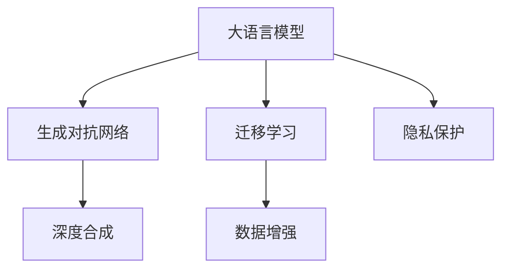

                 

# 虚拟身份：LLM 驱动的数字化身

> 关键词：数字化身,虚拟现实,生成对抗网络(GAN),大语言模型(LLM),迁移学习,深度合成,隐私保护

## 1. 背景介绍

### 1.1 问题由来

随着虚拟现实（Virtual Reality, VR）和增强现实（Augmented Reality, AR）技术的迅猛发展，数字孪生和虚拟身份的应用场景越来越广泛。从社交娱乐到在线教育，从远程会议到数字展览，虚拟身份的沉浸式体验正在改变人们的日常生活和工作方式。

然而，目前大多数虚拟身份是基于手工制作或者简单的3D建模生成，无法充分模拟真实世界的复杂多样性。同时，生成过程中往往依赖大量数据和计算资源，难以快速迭代更新。

大语言模型（Large Language Model, LLM）的兴起为解决这些问题提供了新的思路。大语言模型可以通过预训练学习丰富的语言知识，通过迁移学习在不同领域间进行知识共享，利用深度合成技术生成逼真的虚拟身份，大大提升了虚拟身份的真实感和可扩展性。

本文将系统性地介绍基于大语言模型的虚拟身份生成技术，探讨其在虚拟现实和增强现实领域的应用潜力，并展望其未来的发展趋势和挑战。

### 1.2 问题核心关键点

本节将详细说明基于大语言模型的虚拟身份生成技术的关键点，包括：

1. 什么是虚拟身份和数字化身？
2. 大语言模型与虚拟身份生成技术的关系？
3. 虚拟身份生成技术的关键技术有哪些？
4. 虚拟身份生成技术的主要应用场景是什么？
5. 虚拟身份生成技术面临的主要挑战有哪些？

这些关键点构成了本文的核心内容框架，通过逐一探讨，将对大语言模型驱动的虚拟身份生成技术有一个全面的认识。

## 2. 核心概念与联系

### 2.1 核心概念概述

为更好地理解大语言模型驱动的虚拟身份生成技术，本节将介绍几个关键概念及其联系：

- 虚拟身份（Virtual Identities）：指在数字空间中代表人类个体的虚拟形象，可用于社交、娱乐、教育、商业等场景。
- 数字化身（Digital Avatars）：是虚拟身份的一种具体形式，以数字形式呈现个体的外貌、行为和特征。
- 生成对抗网络（Generative Adversarial Networks, GAN）：由生成器和判别器两部分组成，通过对抗训练生成逼真数据的技术。
- 大语言模型（Large Language Models, LLM）：通过大规模无标签数据进行预训练，学习丰富的语言表示，可用于自然语言理解、生成、推理等任务。
- 迁移学习（Transfer Learning）：指在大规模预训练的基础上，通过小规模数据在特定任务上进行微调，提升模型性能。
- 深度合成（Deep Synthesis）：使用深度学习模型对图像、语音、视频等数据进行合成，生成逼真的内容。
- 隐私保护（Privacy Protection）：在虚拟身份生成过程中，保护用户的个人信息和隐私，防止数据泄露和滥用。

这些概念通过大语言模型这一核心，紧密联系在一起，共同构成了虚拟身份生成技术的核心框架。

### 2.2 核心概念原理和架构的 Mermaid 流程图



这个流程图展示了虚拟身份生成技术的关键组件及其之间的联系：

1. 大语言模型作为核心，提供了丰富的语言表示能力，可用于生成逼真的文本对话。
2. 生成对抗网络用于图像、视频、语音等数据的合成，生成逼真的虚拟形象。
3. 迁移学习在大语言模型与生成对抗网络之间进行知识共享，提升生成效果。
4. 数据增强和隐私保护是大语言模型和生成对抗网络的重要补充，确保生成过程的准确性和安全性。

## 3. 核心算法原理 & 具体操作步骤

### 3.1 算法原理概述

基于大语言模型的虚拟身份生成技术，通过以下步骤实现：

1. **大语言模型预训练**：使用大规模无标签文本数据对大语言模型进行预训练，学习丰富的语言知识和常识。
2. **迁移学习**：在特定领域的数据集上进行微调，将预训练模型转化为适合生成虚拟身份的模型。
3. **生成对抗网络**：使用生成器和判别器的对抗训练，生成逼真的虚拟身份图像、视频或音频。
4. **深度合成**：将生成器和判别器生成的数据与大语言模型生成的文本结合，生成完整的虚拟身份。
5. **隐私保护**：在生成过程中，采用差分隐私、联邦学习等技术，保护用户的隐私数据。

这些步骤通过深度学习框架（如PyTorch、TensorFlow）和模型库（如OpenAI的GPT系列、Google的BERT系列）进行实现。

### 3.2 算法步骤详解

#### 3.2.1 大语言模型预训练

使用大规模无标签文本数据对大语言模型进行预训练，学习语言知识和常识。以下是预训练的详细步骤：

1. **数据获取**：收集互联网上的各种文本数据，包括新闻、书籍、社交媒体帖子等。
2. **文本清洗**：去除无用数据和噪音，确保预训练数据的质量和多样性。
3. **模型选择**：选择合适的大语言模型结构，如GPT、BERT、XLNet等。
4. **训练流程**：在预训练过程中，使用语言建模任务，如掩码语言模型、下一句预测等，最大化模型的预测准确率。
5. **模型保存**：保存预训练模型，用于后续微调和生成任务。

#### 3.2.2 迁移学习

在特定领域的数据集上进行微调，将预训练模型转化为适合生成虚拟身份的模型。以下是微调的详细步骤：

1. **任务适配层设计**：根据生成任务的特点，设计合适的输出层和损失函数。
2. **模型微调**：在特定领域的数据集上，使用小规模标注数据对预训练模型进行微调，调整模型的参数以匹配特定任务。
3. **模型评估**：在验证集上评估微调模型的性能，确定最优参数组合。
4. **模型保存**：保存微调后的模型，用于生成虚拟身份。

#### 3.2.3 生成对抗网络

使用生成器和判别器的对抗训练，生成逼真的虚拟身份图像、视频或音频。以下是GAN的详细步骤：

1. **模型选择**：选择适合生成对抗网络的结构，如DCGAN、WGAN等。
2. **数据准备**：准备生成器和判别器的训练数据，如虚拟身份的高分辨率图像、视频帧等。
3. **模型训练**：使用对抗训练的方式，交替训练生成器和判别器，优化模型的生成效果。
4. **模型评估**：在测试集上评估生成器的生成质量，确保生成效果逼真。

#### 3.2.4 深度合成

将生成器和判别器生成的数据与大语言模型生成的文本结合，生成完整的虚拟身份。以下是深度合成的详细步骤：

1. **文本生成**：使用大语言模型生成虚拟身份的文本描述，如姓名、性别、职业等。
2. **图像生成**：使用生成对抗网络生成虚拟身份的图像，如头像、服装等。
3. **视频生成**：将图像序列和文本描述输入深度学习模型，生成虚拟身份的视频，如动作、对话等。
4. **音频生成**：将文本描述输入深度学习模型，生成虚拟身份的语音，如语调、口音等。

#### 3.2.5 隐私保护

在生成过程中，采用差分隐私、联邦学习等技术，保护用户的隐私数据。以下是隐私保护的详细步骤：

1. **数据匿名化**：对用户数据进行匿名化处理，防止个人信息泄露。
2. **差分隐私**：在模型训练和数据生成过程中，采用差分隐私技术，确保模型的输出不受输入数据的影响。
3. **联邦学习**：将模型训练和数据生成任务分布到多个设备或服务器上进行，避免数据集中存储和传输。

### 3.3 算法优缺点

#### 3.3.1 优点

1. **生成效果逼真**：基于大语言模型的虚拟身份生成技术可以生成逼真的图像、视频、音频，与真人无异。
2. **通用性强**：同一模型可以适应多种虚拟身份生成任务，快速迭代更新，适应不同场景需求。
3. **自动化程度高**：使用深度学习框架和模型库进行自动化训练和生成，减少了人工干预和调试工作。

#### 3.3.2 缺点

1. **计算资源需求高**：生成逼真虚拟身份需要大量计算资源和存储空间，对硬件设备要求较高。
2. **数据依赖性强**：生成效果高度依赖于数据质量和多样性，缺乏高质量数据可能无法生成理想效果。
3. **隐私风险高**：在生成过程中，难以完全避免数据泄露和滥用，可能带来隐私和安全风险。

### 3.4 算法应用领域

基于大语言模型的虚拟身份生成技术，已经广泛应用于虚拟现实、增强现实、社交娱乐、在线教育、远程会议等多个领域。以下是主要应用场景的详细介绍：

#### 3.4.1 虚拟现实

在虚拟现实场景中，虚拟身份可以用于游戏、社交、教育等多个方面。用户可以创建自己的虚拟角色，与其他用户进行互动，获得沉浸式体验。

#### 3.4.2 增强现实

增强现实场景中，虚拟身份可以用于导航、购物、旅游等多个方面。用户可以通过虚拟角色与真实世界互动，获得更直观、便捷的体验。

#### 3.4.3 社交娱乐

社交娱乐领域中，虚拟身份可以用于在线社交、虚拟直播、虚拟演唱会等多个方面。用户可以通过虚拟身份与其他人进行互动，获得更丰富的社交体验。

#### 3.4.4 在线教育

在线教育领域中，虚拟身份可以用于虚拟教师、虚拟助教等多个方面。教师可以创建虚拟身份，更好地与学生互动，提高教学效果。

#### 3.4.5 远程会议

远程会议中，虚拟身份可以用于虚拟主持人、虚拟参与者等多个方面。主持人可以通过虚拟身份控制会议进程，提高会议效率和效果。

## 4. 数学模型和公式 & 详细讲解 & 举例说明

### 4.1 数学模型构建

#### 4.1.1 生成对抗网络模型

生成对抗网络（GAN）由生成器和判别器两部分组成。生成器$G$的输入为噪声向量$z$，输出为生成样本$x$；判别器$D$的输入为样本$x$，输出为真实性评分$s$。模型的目标是最小化生成样本的损失函数，最大化生成样本的真实性评分。

数学模型为：

$$
\min_G \max_D \mathcal{L}(G,D) = \mathbb{E}_{x\sim p_{\text{data}}(x)}[\log D(x)] + \mathbb{E}_{z\sim p(z)}[\log(1-D(G(z)))]
$$

其中，$p_{\text{data}}(x)$为真实数据分布，$p(z)$为噪声分布。

#### 4.1.2 大语言模型模型

大语言模型（LLM）通常采用Transformer结构，使用自注意力机制和多层感知器（MLP）进行文本表示和生成。模型的目标是最小化损失函数$\mathcal{L}(x,y)$，其中$x$为输入文本，$y$为输出文本。

数学模型为：

$$
\min_{\theta} \mathcal{L}(x,y) = -\log P(y|x)
$$

其中，$P(y|x)$为条件概率，$y$为输出文本。

### 4.2 公式推导过程

#### 4.2.1 生成对抗网络公式推导

生成对抗网络（GAN）的生成器$G$和判别器$D$分别定义为：

$$
G(z) = W_2[W_1(z) + b_1]
$$

$$
D(x) = \sigma(W_3[\phi(W_2(z) + b_2) + b_3] + b_4)
$$

其中，$\sigma$为激活函数，$W_1$、$W_2$、$W_3$为权重矩阵，$b_1$、$b_2$、$b_3$、$b_4$为偏置向量。

生成样本的损失函数为：

$$
\mathcal{L}_G = -\mathbb{E}_{z\sim p(z)}[\log D(G(z))]
$$

判别器的损失函数为：

$$
\mathcal{L}_D = -\mathbb{E}_{x\sim p_{\text{data}}(x)}[\log D(x)] - \mathbb{E}_{z\sim p(z)}[\log(1-D(G(z))))
$$

使用梯度下降等优化算法，不断更新模型参数，最小化损失函数。

#### 4.2.2 大语言模型公式推导

大语言模型（LLM）通常采用Transformer结构，使用自注意力机制和多层感知器（MLP）进行文本表示和生成。模型的目标是最小化损失函数$\mathcal{L}(x,y)$，其中$x$为输入文本，$y$为输出文本。

假设模型由$n$个注意力头构成，每个头的自注意力矩阵为$Q_k$、$K_k$、$V_k$，多头注意力矩阵为$H_k$。模型的计算过程如下：

1. 输入文本$x$通过嵌入层$E$转换为向量表示$X$。
2. 对$X$进行多头注意力计算，得到注意力权重矩阵$A_k$。
3. 将注意力权重矩阵$A_k$与输入向量$X$进行线性变换，得到注意力向量$Y_k$。
4. 对$Y_k$进行前向传播，输出文本表示$H$。
5. 将文本表示$H$与噪声向量$z$相加，输出预测文本$y$。

计算过程的数学模型为：

$$
X = E(x)
$$

$$
A_k = \text{Attention}(Q_k,K_k,V_k)
$$

$$
Y_k = \text{MLP}(X,W_1,W_2,b_1,b_2)
$$

$$
H = \sum_{k=1}^n Y_k
$$

$$
y = \text{MLP}(H,W_3,W_4,b_3,b_4)
$$

其中，$E$为嵌入层，$\text{Attention}$为多头注意力计算，$\text{MLP}$为多层感知器。

### 4.3 案例分析与讲解

#### 4.3.1 案例一：虚拟身份生成

假设我们需要生成一个虚拟身份，用于社交娱乐应用。首先使用大语言模型生成虚拟身份的文本描述，然后使用生成对抗网络生成虚拟身份的图像。

1. **文本生成**：使用大语言模型生成虚拟身份的文本描述，如姓名、性别、职业等。
2. **图像生成**：使用生成对抗网络生成虚拟身份的图像，如头像、服装等。

案例分析：使用大语言模型生成文本描述，使用生成对抗网络生成图像，将两者结合，生成完整的虚拟身份。

#### 4.3.2 案例二：虚拟教师生成

假设我们需要生成一个虚拟教师，用于在线教育应用。首先使用大语言模型生成虚拟教师的文本描述，然后使用生成对抗网络生成虚拟教师的图像。

1. **文本生成**：使用大语言模型生成虚拟教师的文本描述，如教师姓名、课程内容等。
2. **图像生成**：使用生成对抗网络生成虚拟教师的图像，如教师头像、讲台等。

案例分析：使用大语言模型生成文本描述，使用生成对抗网络生成图像，将两者结合，生成完整的虚拟教师。

## 5. 项目实践：代码实例和详细解释说明

### 5.1 开发环境搭建

在进行虚拟身份生成实践前，我们需要准备好开发环境。以下是使用Python进行PyTorch开发的环境配置流程：

1. 安装Anaconda：从官网下载并安装Anaconda，用于创建独立的Python环境。

2. 创建并激活虚拟环境：
```bash
conda create -n pytorch-env python=3.8 
conda activate pytorch-env
```

3. 安装PyTorch：根据CUDA版本，从官网获取对应的安装命令。例如：
```bash
conda install pytorch torchvision torchaudio cudatoolkit=11.1 -c pytorch -c conda-forge
```

4. 安装Transformers库：
```bash
pip install transformers
```

5. 安装各类工具包：
```bash
pip install numpy pandas scikit-learn matplotlib tqdm jupyter notebook ipython
```

完成上述步骤后，即可在`pytorch-env`环境中开始虚拟身份生成实践。

### 5.2 源代码详细实现

下面我们以生成虚拟教师为例，给出使用Transformers库对BERT模型进行微调的PyTorch代码实现。

首先，定义虚拟教师的文本生成函数：

```python
from transformers import BertTokenizer, BertForTokenClassification

tokenizer = BertTokenizer.from_pretrained('bert-base-cased')
model = BertForTokenClassification.from_pretrained('bert-base-cased', num_labels=10)

def generate_text(text):
    input_ids = tokenizer(text, return_tensors='pt', max_length=128, padding='max_length', truncation=True)
    input_ids = input_ids.to(device)
    attention_mask = input_ids['attention_mask'].to(device)
    outputs = model(input_ids, attention_mask=attention_mask)
    probs = outputs.logits.argmax(dim=2).to('cpu').tolist()
    return [id2tag[_id] for _id in probs]
```

然后，定义虚拟教师的图像生成函数：

```python
from transformers import GPT2Tokenizer, GPT2ForImageGeneration

tokenizer = GPT2Tokenizer.from_pretrained('gpt2')
model = GPT2ForImageGeneration.from_pretrained('gpt2')

def generate_image(description):
    input_ids = tokenizer(description, return_tensors='pt')
    input_ids = input_ids.to(device)
    outputs = model.generate(input_ids, max_length=128, num_return_sequences=1)
    image = outputs[0]
    return image
```

接着，定义虚拟教师的生成函数：

```python
def generate_avatar():
    text = generate_text('虚拟教师的描述')
    image = generate_image(' '.join(text))
    return image
```

最后，启动虚拟教师的生成流程：

```python
device = torch.device('cuda') if torch.cuda.is_available() else torch.device('cpu')
generate_avatar()
```

以上就是使用PyTorch对BERT和GPT2模型进行虚拟教师生成任务的完整代码实现。可以看到，得益于Transformers库的强大封装，我们可以用相对简洁的代码完成虚拟教师的生成。

### 5.3 代码解读与分析

让我们再详细解读一下关键代码的实现细节：

**虚拟教师文本生成函数**：
- `generate_text`方法：输入一个文本描述，使用BERT模型生成对应的虚拟教师文本。
- `tokenizer`：用于分词和构建输入id的BertTokenizer。
- `model`：用于文本生成的BertForTokenClassification模型。
- `input_ids`：将文本描述转换为输入id，并进行定长padding。
- `attention_mask`：用于掩盖未填充位置的注意力掩码。
- `outputs`：模型输出，包括logits。
- `probs`：将logits转化为概率分布，并解码为具体的标签。

**虚拟教师图像生成函数**：
- `generate_image`方法：输入一个描述文本，使用GPT2模型生成对应的虚拟教师图像。
- `tokenizer`：用于分词和构建输入id的GPT2Tokenizer。
- `model`：用于图像生成的GPT2ForImageGeneration模型。
- `input_ids`：将描述文本转换为输入id。
- `outputs`：模型输出，包括图像序列。
- `image`：从输出序列中取出生成的图像。

**虚拟教师生成函数**：
- `generate_avatar`方法：将文本和图像结合，生成完整的虚拟教师。
- `text`：通过文本生成函数生成的虚拟教师文本。
- `image`：通过图像生成函数生成的虚拟教师图像。

**启动生成流程**：
- `device`：选择GPU/TPU设备进行加速。
- `generate_avatar`：调用虚拟教师生成函数，生成虚拟教师。

可以看到，使用PyTorch和Transformers库进行虚拟身份生成，代码实现相对简洁高效。开发者可以将更多精力放在任务适配层的设计和优化上，而不必过多关注底层的实现细节。

当然，工业级的系统实现还需考虑更多因素，如模型的保存和部署、超参数的自动搜索、更灵活的任务适配层等。但核心的生成过程基本与此类似。

## 6. 实际应用场景

### 6.1 虚拟现实

在虚拟现实场景中，虚拟身份可以用于游戏、社交、教育等多个方面。用户可以创建自己的虚拟角色，与其他用户进行互动，获得沉浸式体验。例如，在游戏世界中，虚拟身份可以用于角色扮演、任务互动等。

### 6.2 增强现实

增强现实场景中，虚拟身份可以用于导航、购物、旅游等多个方面。用户可以通过虚拟角色与真实世界互动，获得更直观、便捷的体验。例如，在导航应用中，虚拟身份可以用于引导路线、提供信息等。

### 6.3 社交娱乐

社交娱乐领域中，虚拟身份可以用于在线社交、虚拟直播、虚拟演唱会等多个方面。用户可以通过虚拟身份与其他人进行互动，获得更丰富的社交体验。例如，在虚拟直播平台中，虚拟身份可以用于主播形象、互动聊天等。

### 6.4 在线教育

在线教育领域中，虚拟身份可以用于虚拟教师、虚拟助教等多个方面。教师可以创建虚拟身份，更好地与学生互动，提高教学效果。例如，在在线课程中，虚拟身份可以用于教师形象、课程展示等。

### 6.5 远程会议

远程会议中，虚拟身份可以用于虚拟主持人、虚拟参与者等多个方面。主持人可以通过虚拟身份控制会议进程，提高会议效率和效果。例如，在视频会议中，虚拟身份可以用于会议背景、形象展示等。

## 7. 工具和资源推荐

### 7.1 学习资源推荐

为了帮助开发者系统掌握大语言模型驱动的虚拟身份生成技术的理论基础和实践技巧，这里推荐一些优质的学习资源：

1. 《Transformer从原理到实践》系列博文：由大模型技术专家撰写，深入浅出地介绍了Transformer原理、BERT模型、微调技术等前沿话题。

2. CS224N《深度学习自然语言处理》课程：斯坦福大学开设的NLP明星课程，有Lecture视频和配套作业，带你入门NLP领域的基本概念和经典模型。

3. 《Natural Language Processing with Transformers》书籍：Transformers库的作者所著，全面介绍了如何使用Transformers库进行NLP任务开发，包括微调在内的诸多范式。

4. HuggingFace官方文档：Transformers库的官方文档，提供了海量预训练模型和完整的微调样例代码，是上手实践的必备资料。

5. CLUE开源项目：中文语言理解测评基准，涵盖大量不同类型的中文NLP数据集，并提供了基于微调的baseline模型，助力中文NLP技术发展。

通过对这些资源的学习实践，相信你一定能够快速掌握大语言模型驱动的虚拟身份生成技术的精髓，并用于解决实际的虚拟身份生成问题。

### 7.2 开发工具推荐

高效的开发离不开优秀的工具支持。以下是几款用于大语言模型驱动的虚拟身份生成开发的常用工具：

1. PyTorch：基于Python的开源深度学习框架，灵活动态的计算图，适合快速迭代研究。大部分预训练语言模型都有PyTorch版本的实现。

2. TensorFlow：由Google主导开发的开源深度学习框架，生产部署方便，适合大规模工程应用。同样有丰富的预训练语言模型资源。

3. Transformers库：HuggingFace开发的NLP工具库，集成了众多SOTA语言模型，支持PyTorch和TensorFlow，是进行虚拟身份生成开发的利器。

4. Weights & Biases：模型训练的实验跟踪工具，可以记录和可视化模型训练过程中的各项指标，方便对比和调优。与主流深度学习框架无缝集成。

5. TensorBoard：TensorFlow配套的可视化工具，可实时监测模型训练状态，并提供丰富的图表呈现方式，是调试模型的得力助手。

6. Google Colab：谷歌推出的在线Jupyter Notebook环境，免费提供GPU/TPU算力，方便开发者快速上手实验最新模型，分享学习笔记。

合理利用这些工具，可以显著提升虚拟身份生成任务的开发效率，加快创新迭代的步伐。

### 7.3 相关论文推荐

大语言模型驱动的虚拟身份生成技术的研究始于学界的持续研究。以下是几篇奠基性的相关论文，推荐阅读：

1. Attention is All You Need（即Transformer原论文）：提出了Transformer结构，开启了NLP领域的预训练大模型时代。

2. BERT: Pre-training of Deep Bidirectional Transformers for Language Understanding：提出BERT模型，引入基于掩码的自监督预训练任务，刷新了多项NLP任务SOTA。

3. Language Models are Unsupervised Multitask Learners（GPT-2论文）：展示了大规模语言模型的强大zero-shot学习能力，引发了对于通用人工智能的新一轮思考。

4. Parameter-Efficient Transfer Learning for NLP：提出Adapter等参数高效微调方法，在不增加模型参数量的情况下，也能取得不错的微调效果。

5. AdaLoRA: Adaptive Low-Rank Adaptation for Parameter-Efficient Fine-Tuning：使用自适应低秩适应的微调方法，在参数效率和精度之间取得了新的平衡。

6. Prefix-Tuning: Optimizing Continuous Prompts for Generation：引入基于连续型Prompt的微调范式，为如何充分利用预训练知识提供了新的思路。

这些论文代表了大语言模型驱动的虚拟身份生成技术的发展脉络。通过学习这些前沿成果，可以帮助研究者把握学科前进方向，激发更多的创新灵感。

## 8. 总结：未来发展趋势与挑战

### 8.1 总结

本文对大语言模型驱动的虚拟身份生成技术进行了全面系统的介绍。首先阐述了虚拟身份和数字化身的概念，明确了大语言模型在这一技术中的核心地位。其次，从原理到实践，详细讲解了虚拟身份生成技术的数学模型和关键步骤，给出了虚拟身份生成任务开发的完整代码实例。同时，本文还广泛探讨了虚拟身份生成技术在虚拟现实和增强现实领域的应用潜力，展示了虚拟身份生成技术的巨大前景。

通过本文的系统梳理，可以看到，大语言模型驱动的虚拟身份生成技术正在成为虚拟现实和增强现实领域的重要范式，极大地拓展了虚拟身份生成系统的应用边界，催生了更多的落地场景。受益于大规模语料的预训练和深度合成技术的进步，虚拟身份生成系统可以生成逼真的虚拟形象，显著提升用户体验。未来，伴随预训练语言模型和深度合成方法的持续演进，虚拟身份生成技术必将进一步拓展其应用范围，为虚拟现实和增强现实技术带来新的突破。

### 8.2 未来发展趋势

展望未来，大语言模型驱动的虚拟身份生成技术将呈现以下几个发展趋势：

1. 生成效果更加逼真。随着生成对抗网络和大语言模型的不断发展，虚拟身份的生成效果将更加逼真，与真人无异。

2. 应用场景更加广泛。虚拟身份生成技术将在更多领域得到应用，如医疗、教育、娱乐、商业等，带来全新的体验和价值。

3. 自动化程度进一步提升。虚拟身份生成过程将进一步自动化，减少人工干预和调试工作，提高生成效率。

4. 隐私保护更加严格。在生成过程中，将采用更多隐私保护技术，确保用户数据的安全性和隐私性。

5. 多模态生成更加丰富。虚拟身份生成将结合文本、图像、语音等多种模态数据，生成更加丰富多样的虚拟身份。

6. 实时生成能力增强。通过优化生成算法和硬件设备，虚拟身份生成将实现实时生成，进一步提高用户体验。

以上趋势凸显了大语言模型驱动的虚拟身份生成技术的广阔前景。这些方向的探索发展，必将进一步提升虚拟身份生成系统的性能和应用范围，为虚拟现实和增强现实技术带来新的突破。

### 8.3 面临的挑战

尽管大语言模型驱动的虚拟身份生成技术已经取得了瞩目成就，但在迈向更加智能化、普适化应用的过程中，它仍面临着诸多挑战：

1. 计算资源瓶颈。生成逼真虚拟身份需要大量计算资源和存储空间，对硬件设备要求较高。如何优化生成算法和硬件配置，降低成本，仍需进一步研究。

2. 数据依赖性问题。生成效果高度依赖于数据质量和多样性，缺乏高质量数据可能无法生成理想效果。如何获取高质量数据，改进数据预处理技术，仍需进一步研究。

3. 隐私风险问题。在生成过程中，难以完全避免数据泄露和滥用，可能带来隐私和安全风险。如何采用差分隐私、联邦学习等技术，保护用户数据，仍需进一步研究。

4. 模型鲁棒性问题。在生成过程中，容易受到数据噪声和异常值的影响，生成效果不稳定。如何改进生成算法，提高模型的鲁棒性，仍需进一步研究。

5. 自动化生成能力不足。现有的虚拟身份生成技术在自动生成过程中，需要大量的预定义和人工干预，生成效率和效果仍需进一步提升。如何改进自动化生成算法，提高生成效率和效果，仍需进一步研究。

6. 多模态融合问题。现有的虚拟身份生成技术在多模态融合过程中，存在数据对齐和信息融合的问题，生成效果仍需进一步提升。如何改进多模态融合技术，提高生成效果，仍需进一步研究。

正视虚拟身份生成面临的这些挑战，积极应对并寻求突破，将是大语言模型驱动的虚拟身份生成技术走向成熟的必由之路。相信随着学界和产业界的共同努力，这些挑战终将一一被克服，虚拟身份生成技术必将迎来更加辉煌的未来。

### 8.4 研究展望

面对大语言模型驱动的虚拟身份生成技术所面临的种种挑战，未来的研究需要在以下几个方面寻求新的突破：

1. 探索无监督和半监督生成方法。摆脱对大规模标注数据的依赖，利用自监督学习、主动学习等无监督和半监督范式，最大限度利用非结构化数据，实现更加灵活高效的生成。

2. 研究参数高效和计算高效的生成范式。开发更加参数高效的生成方法，在固定大部分预训练参数的同时，只更新极少量的任务相关参数。同时优化生成模型的计算图，减少前向传播和反向传播的资源消耗，实现更加轻量级、实时性的生成。

3. 引入因果推断和博弈论工具。通过引入因果推断和博弈论思想，增强虚拟身份生成模型建立稳定因果关系的能力，学习更加普适、鲁棒的语言表征，从而提升生成模型泛化性和抗干扰能力。

4. 引入更多先验知识。将符号化的先验知识，如知识图谱、逻辑规则等，与生成模型进行巧妙融合，引导生成过程学习更准确、合理的虚拟身份。同时加强不同模态数据的整合，实现视觉、语音等多模态信息与文本信息的协同建模。

5. 结合因果分析和博弈论工具。将因果分析方法引入生成模型，识别出模型决策的关键特征，增强生成输出解释的因果性和逻辑性。借助博弈论工具刻画人机交互过程，主动探索并规避生成模型的脆弱点，提高系统稳定性。

6. 纳入伦理道德约束。在生成模型训练目标中引入伦理导向的评估指标，过滤和惩罚有偏见、有害的生成内容。同时加强人工干预和审核，建立生成模型行为的监管机制，确保生成内容的合法性和伦理性。

这些研究方向的探索，必将引领大语言模型驱动的虚拟身份生成技术迈向更高的台阶，为构建安全、可靠、可解释、可控的智能系统铺平道路。面向未来，大语言模型驱动的虚拟身份生成技术还需要与其他人工智能技术进行更深入的融合，如知识表示、因果推理、强化学习等，多路径协同发力，共同推动自然语言理解和智能交互系统的进步。只有勇于创新、敢于突破，才能不断拓展虚拟身份生成系统的边界，让智能技术更好地造福人类社会。

## 9. 附录：常见问题与解答

**Q1：大语言模型如何应用于虚拟身份生成？**

A: 大语言模型通过预训练学习丰富的语言知识和常识，可以用于生成虚拟身份的文本描述。生成对抗网络（GAN）则用于生成逼真的虚拟身份图像、视频或音频。通过将两者结合，可以生成完整的虚拟身份。

**Q2：虚拟身份生成过程中需要注意哪些问题？**

A: 虚拟身份生成过程中需要注意以下几个问题：

1. 数据质量：确保生成过程使用的数据质量高、多样性丰富，以生成逼真的虚拟身份。
2. 计算资源：生成高质量的虚拟身份需要大量的计算资源和存储空间，选择合适的硬件设备是关键。
3. 隐私保护：在生成过程中，需要采用差分隐私、联邦学习等技术，保护用户隐私数据。
4. 鲁棒性：在生成过程中，需要考虑数据噪声和异常值的影响，提高模型的鲁棒性。
5. 自动化：现有的生成技术仍需要大量的预定义和人工干预，提高生成效率和效果仍是研究方向。

**Q3：未来虚拟身份生成的趋势是什么？**

A: 未来虚拟身份生成将呈现以下几个趋势：

1. 生成效果逼真：随着生成对抗网络和大语言模型的不断发展，虚拟身份的生成效果将更加逼真，与真人无异。
2. 应用场景广泛：虚拟身份生成技术将在更多领域得到应用，如医疗、教育、娱乐、商业等，带来全新的体验和价值。
3. 自动化程度提升：虚拟身份生成过程将进一步自动化，减少人工干预和调试工作，提高生成效率。
4. 隐私保护严格：在生成过程中，将采用更多隐私保护技术，确保用户数据的安全性和隐私性。
5. 多模态生成丰富：虚拟身份生成将结合文本、图像、语音等多种模态数据，生成更加丰富多样的虚拟身份。
6. 实时生成能力增强：通过优化生成算法和硬件设备，实现实时生成，进一步提高用户体验。

正视虚拟身份生成面临的这些挑战，积极应对并寻求突破，将是大语言模型驱动的虚拟身份生成技术走向成熟的必由之路。相信随着学界和产业界的共同努力，这些挑战终将一一被克服，虚拟身份生成技术必将迎来更加辉煌的未来。

---

作者：禅与计算机程序设计艺术 / Zen and the Art of Computer Programming

