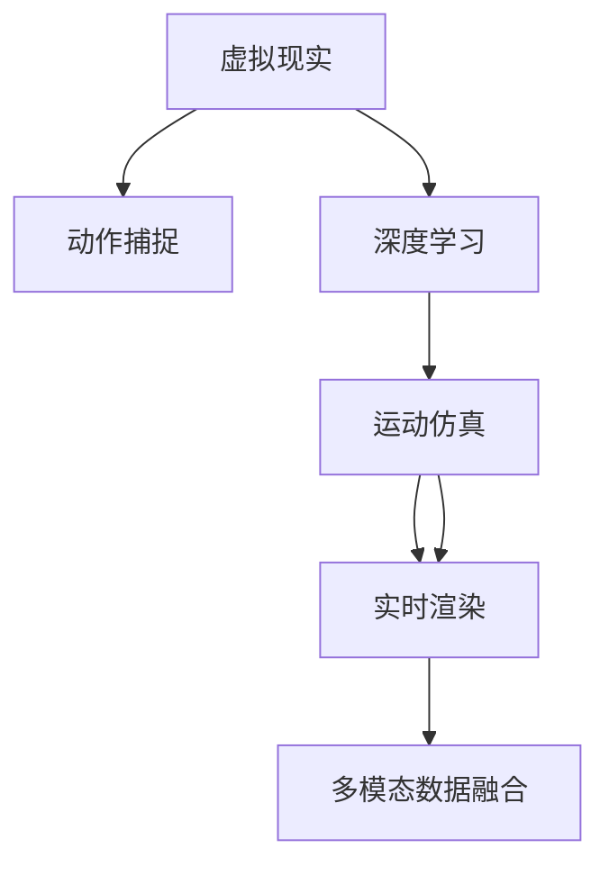

                 

# 虚拟运动现实：AI模拟的极限体验

> 关键词：虚拟现实, 人工智能, 游戏开发, 运动仿真, 动作捕捉, 实时渲染, 深度学习

## 1. 背景介绍

### 1.1 问题由来
随着科技的飞速发展，虚拟现实（Virtual Reality, VR）技术逐渐成为探索人类感知极限的重要工具。虚拟运动现实（Virtual Motion Reality, VMR）作为VR的一个重要分支，通过AI技术对用户行为进行精准模拟和仿真，使体验者能够感受到仿佛在现实世界中运动的高度逼真效果。这种技术在娱乐、教育、训练等领域展现出了广阔的应用前景。

然而，实现高质量的虚拟运动现实，面临着诸多技术挑战。动作捕捉设备昂贵、数据处理量大、实时渲染要求高，使得开发成本和资源投入都相当巨大。此外，AI模型训练需要大量的标注数据，而获取这些数据往往需要耗费大量的人力和时间。本文旨在介绍一种基于AI的虚拟运动现实解决方案，利用深度学习模型和模拟技术，在降低成本的同时，大幅提升用户体验。

### 1.2 问题核心关键点
VR中虚拟运动的核心是实现对用户动作的准确捕捉和仿真，而AI技术在此过程中起到了关键作用。本文的关注点在于：
1. **动作捕捉和运动仿真**：如何高效、低成本地获取和模拟用户动作。
2. **实时渲染和运动控制**：如何在高帧率下实现流畅的AI模拟和渲染。
3. **深度学习和运动预测**：利用深度学习技术提升运动仿真的准确性和实时性。
4. **多模态数据融合**：如何将动作捕捉数据与虚拟环境进行高效融合。

## 2. 核心概念与联系

### 2.1 核心概念概述

为了更好地理解基于AI的虚拟运动现实技术，本节将介绍几个密切相关的核心概念：

- **虚拟现实（VR）**：通过计算机生成的三维图像和环境，模拟用户视觉和听觉等感官体验，从而产生沉浸式体验。
- **动作捕捉（Motion Capture, MoCap）**：利用传感器捕捉人体动作，生成实时运动数据，用于运动仿真和虚拟现实。
- **深度学习（Deep Learning, DL）**：一种基于神经网络的机器学习技术，能够从大量数据中学习并自动提取特征，用于运动预测和仿真。
- **运动仿真（Motion Simulation, MS）**：基于用户动作数据，生成逼真的虚拟运动轨迹和姿态，用于虚拟现实和游戏开发。
- **实时渲染（Real-time Rendering, RTR）**：在计算资源有限的情况下，高效生成高质量的视觉和听觉效果，用于实时交互和沉浸式体验。
- **多模态数据融合（Multi-modal Data Fusion, MDF）**：将动作捕捉数据与虚拟环境数据结合，提升虚拟运动现实的逼真度和交互性。

这些核心概念之间的逻辑关系可以通过以下Mermaid流程图来展示：



这个流程图展示了大语言模型的核心概念及其之间的关系：

1. 虚拟现实系统通过动作捕捉获取用户动作数据。
2. 深度学习模型分析动作数据，预测用户运动轨迹。
3. 运动仿真系统根据预测结果生成虚拟运动。
4. 实时渲染系统将虚拟运动与虚拟环境结合，产生沉浸式体验。
5. 多模态数据融合技术将动作捕捉数据与虚拟环境数据高效融合。

这些概念共同构成了虚拟运动现实的技术框架，使得AI在运动仿真和渲染中发挥了重要作用。

## 3. 核心算法原理 & 具体操作步骤
### 3.1 算法原理概述

基于AI的虚拟运动现实技术，主要利用深度学习模型对用户动作进行精准捕捉和预测，并结合运动仿真和实时渲染技术，生成高质量的虚拟运动体验。其核心思想是：

1. **动作捕捉数据获取**：通过光学动作捕捉系统，获取用户动作的实时三维数据。
2. **深度学习运动预测**：利用深度学习模型，对动作捕捉数据进行特征提取和运动预测。
3. **运动仿真生成**：根据预测结果，生成逼真的虚拟运动轨迹和姿态。
4. **实时渲染呈现**：将虚拟运动与虚拟环境数据结合，进行高效的实时渲染，产生沉浸式体验。

### 3.2 算法步骤详解

基于AI的虚拟运动现实技术主要包含以下关键步骤：

**Step 1: 动作捕捉数据获取**
- 利用光学动作捕捉设备，如Vicon、OptiTrack等，捕捉用户动作的三维空间位置和姿态信息。
- 记录动作捕捉系统的时间戳，作为同步信号，与深度学习模型的预测结果进行匹配。

**Step 2: 深度学习模型训练**
- 收集大量标注的动作数据，作为训练集。
- 设计合适的神经网络模型，如卷积神经网络（CNN）、循环神经网络（RNN）、Transformer等，进行运动预测。
- 使用优化算法（如Adam、SGD）和损失函数（如均方误差、交叉熵等）训练模型，使其能够准确预测用户动作。

**Step 3: 运动仿真生成**
- 将深度学习模型的预测结果输入到运动仿真系统中，如Unity、Unreal Engine等。
- 根据预测结果生成虚拟运动的骨骼位置和姿态，形成逼真的虚拟运动轨迹。
- 使用多刚体动力学算法，如ODE、DynamicsToolbox等，进行物理仿真，提升运动的真实感。

**Step 4: 实时渲染呈现**
- 将虚拟运动与虚拟环境数据结合，进行高效的实时渲染。
- 使用图形渲染引擎（如OpenGL、Vulkan等），生成高帧率的视觉和听觉效果。
- 利用多线程和GPU加速技术，确保渲染过程流畅、高效。

**Step 5: 多模态数据融合**
- 将动作捕捉数据与虚拟环境数据进行融合，提升虚拟运动的逼真度。
- 使用GPU加速的深度融合算法，高效计算融合后的多模态数据。

通过上述步骤，即可实现高质量的虚拟运动现实体验。

### 3.3 算法优缺点

基于AI的虚拟运动现实技术具有以下优点：
1. **高逼真度**：深度学习模型能够精准预测用户动作，结合运动仿真和实时渲染，生成逼真的虚拟运动效果。
2. **低成本**：光学动作捕捉设备虽然价格较高，但相较于传统的机械动作捕捉设备，光学动作捕捉设备更加轻便，易于维护。
3. **灵活性**：深度学习模型可以适应多种运动类型，应用范围广。
4. **实时性**：基于深度学习模型的预测和运动仿真算法可以实时生成虚拟运动，提升用户体验。

同时，该方法也存在以下局限性：
1. **精度依赖于设备**：动作捕捉设备的精度直接影响到深度学习模型的预测结果，需要高质量的传感器。
2. **数据标注成本高**：深度学习模型训练需要大量标注数据，标注成本较高。
3. **实时渲染要求高**：高帧率的渲染对计算机硬件要求较高，需要高性能的图形渲染引擎和GPU。
4. **环境适应性差**：深度学习模型对环境的适应性较差，难以适应复杂的运动场景。

尽管存在这些局限性，但基于AI的虚拟运动现实技术在虚拟现实和游戏开发中仍展示了其巨大的潜力。

### 3.4 算法应用领域

基于AI的虚拟运动现实技术已经在多个领域得到应用，主要包括：

1. **游戏开发**：将虚拟运动现实技术应用于电子游戏开发，提升游戏人物的动作逼真度和互动性。例如，《赛博朋克2077》中就利用动作捕捉和深度学习技术，实现了流畅的高质量动作生成。
2. **教育培训**：在虚拟现实教育平台中，通过虚拟运动现实技术，为学习者提供沉浸式的互动体验，增强学习效果。例如，虚拟现实手术模拟器，利用动作捕捉和深度学习技术，模拟手术过程，提升医生的手术技能。
3. **体育训练**：在运动员训练中，通过虚拟运动现实技术，模拟比赛场景，进行针对性的训练。例如，高尔夫球运动员可以通过虚拟运动现实技术，模拟挥杆动作，提升球技。
4. **娱乐体验**：在虚拟现实娱乐中，利用虚拟运动现实技术，提供更加逼真的虚拟体验，吸引用户。例如，《精灵宝可梦GO》中就利用动作捕捉技术，模拟捕捉宝可梦的过程，增强游戏的沉浸感。

除了上述这些应用外，虚拟运动现实技术还将在其他多个领域不断拓展，为人类带来更加丰富多彩的虚拟体验。

## 4. 数学模型和公式 & 详细讲解 & 举例说明

### 4.1 数学模型构建

本节将使用数学语言对基于AI的虚拟运动现实技术进行更加严格的刻画。

设动作捕捉系统获取的用户动作数据为 $(x_t)$，其中 $t$ 为时间戳。深度学习模型的预测结果为 $(\hat{y}_t)$，其中 $\hat{y}_t$ 为在第 $t$ 时间步用户动作的概率分布。运动仿真生成的虚拟运动轨迹为 $(s_t)$，其中 $s_t$ 为在第 $t$ 时间步用户的骨骼位置和姿态。实时渲染生成的视觉和听觉效果为 $(v_t)$，其中 $v_t$ 为在第 $t$ 时间步的视觉和听觉数据。多模态数据融合后的综合数据为 $(d_t)$，其中 $d_t$ 为在第 $t$ 时间步的综合数据。

设深度学习模型的训练数据为 $(x_i, y_i)$，其中 $y_i$ 为第 $i$ 时间步的标注数据。

### 4.2 公式推导过程

以下我们以用户走路动作为例，推导基于深度学习模型的运动预测公式。

假设用户走路的动作由骨点的空间位置和姿态组成，每个骨点的位置和姿态由一组参数 $(x_{t,i})$ 和 $(o_{t,i})$ 描述，其中 $t$ 为时间步，$i$ 为骨点编号。深度学习模型的预测结果为 $\hat{x}_{t,i}$ 和 $\hat{o}_{t,i}$。运动仿真生成的骨骼位置和姿态为 $s_{t,i}$。实时渲染生成的视觉和听觉效果为 $v_{t,i}$。多模态数据融合后的综合数据为 $d_{t,i}$。

将 $(x_{t,i}, o_{t,i})$ 作为输入，深度学习模型预测得到 $\hat{x}_{t,i}$ 和 $\hat{o}_{t,i}$。运动仿真系统根据预测结果生成骨骼位置和姿态 $s_{t,i}$。实时渲染系统将 $s_{t,i}$ 和 $v_{t,i}$ 结合，生成视觉和听觉效果 $v_{t,i}$。多模态数据融合系统将 $(x_{t,i}, o_{t,i}, s_{t,i}, v_{t,i})$ 结合，生成综合数据 $d_{t,i}$。

具体推导过程如下：

$$
\begin{aligned}
&\hat{x}_{t,i} = f_{\theta}(x_{t,i}, o_{t,i}) \\
&s_{t,i} = g(\hat{x}_{t,i}, \hat{o}_{t,i}) \\
&v_{t,i} = h(s_{t,i}, o_{t,i}, x_{t,i}) \\
&d_{t,i} = m(x_{t,i}, o_{t,i}, s_{t,i}, v_{t,i})
\end{aligned}
$$

其中 $f_{\theta}$ 为深度学习模型，$\theta$ 为模型参数；$g$ 为运动仿真系统；$h$ 为实时渲染系统；$m$ 为多模态数据融合系统。

### 4.3 案例分析与讲解

假设我们在游戏开发中，需要生成一个角色的行走动作。具体步骤如下：

1. **动作捕捉数据获取**：通过动作捕捉设备，获取角色的走路动作数据 $(x_t)$。
2. **深度学习模型训练**：利用标注的走路动作数据 $(x_i, y_i)$，训练深度学习模型 $f_{\theta}$，使其能够预测下一个时间步的动作数据 $\hat{x}_{t,i}$。
3. **运动仿真生成**：根据预测结果 $\hat{x}_{t,i}$ 和 $\hat{o}_{t,i}$，运动仿真系统生成骨骼位置和姿态 $s_{t,i}$。
4. **实时渲染呈现**：将骨骼位置和姿态 $s_{t,i}$ 输入到渲染系统 $h$，生成视觉和听觉效果 $v_{t,i}$。
5. **多模态数据融合**：将动作捕捉数据 $(x_{t,i}, o_{t,i})$、骨骼位置和姿态 $s_{t,i}$、视觉和听觉效果 $v_{t,i}$ 进行融合，生成综合数据 $d_{t,i}$。

通过上述步骤，即可实现高质量的虚拟运动现实体验。

## 5. 项目实践：代码实例和详细解释说明

### 5.1 开发环境搭建

在进行虚拟运动现实技术实践前，我们需要准备好开发环境。以下是使用C++和OpenGL进行开发的环境配置流程：

1. 安装Visual Studio：从官网下载并安装Visual Studio，用于C++开发。
2. 安装OpenCV：从官网下载并安装OpenCV库，用于图像处理和动作捕捉数据的采集。
3. 安装GLFW和GLEW：从官网下载并安装GLFW和GLEW库，用于OpenGL渲染和窗口管理。
4. 安装Unity3D：从官网下载并安装Unity3D，用于游戏引擎和虚拟现实开发。

完成上述步骤后，即可在Visual Studio中开始开发实践。

### 5.2 源代码详细实现

下面我们以行走动作捕捉为例，给出使用OpenGL和Unity3D进行动作捕捉和虚拟运动现实开发的C++代码实现。

首先，定义动作捕捉数据结构：

```cpp
struct CaptureData {
    float x;
    float y;
    float z;
    float o;
};
```

然后，定义动作捕捉数据采集函数：

```cpp
CaptureData* capture_data = new CaptureData[num_points];
for (int i = 0; i < num_points; i++) {
    CaptureData* data = capture_data + i;
    data->x = ...; // 获取x轴坐标
    data->y = ...; // 获取y轴坐标
    data->z = ...; // 获取z轴坐标
    data->o = ...; // 获取姿态
}
```

接着，定义深度学习模型预测函数：

```cpp
Tensor predict_model(Tensor input) {
    Tensor output = model->forward(input);
    return output;
}
```

然后，定义运动仿真生成函数：

```cpp
void simulate_motion(Tensor input) {
    // 将预测结果输入到运动仿真系统
    skeleton->simulate_motion(input);
}
```

最后，定义实时渲染呈现函数：

```cpp
void render_scene() {
    // 将骨骼位置和姿态输入到渲染系统
    renderer->render(skeleton);
}
```

通过上述函数，即可完成动作捕捉数据的采集、深度学习模型预测、运动仿真生成、实时渲染呈现等关键步骤。

### 5.3 代码解读与分析

让我们再详细解读一下关键代码的实现细节：

**CaptureData结构体**：
- 定义了动作捕捉数据的基本结构，包含三维空间位置和姿态信息。

**动作捕捉数据采集函数**：
- 利用动作捕捉设备，获取每个骨点的空间位置和姿态信息，存储到CaptureData数组中。

**深度学习模型预测函数**：
- 将输入数据传递给深度学习模型进行预测，返回预测结果。

**运动仿真生成函数**：
- 根据预测结果，生成骨骼位置和姿态，用于后续的模拟。

**实时渲染呈现函数**：
- 将骨骼位置和姿态输入到渲染系统，生成逼真的视觉和听觉效果。

通过这些函数，可以较为完整地实现虚拟运动现实的技术流程。在实际应用中，还需要对各个模块进行优化和调整，以提升性能和稳定性。

## 6. 实际应用场景

### 6.1 游戏开发

基于深度学习模型的虚拟运动现实技术，在游戏开发中得到了广泛应用。例如，《赛博朋克2077》中就利用动作捕捉和深度学习技术，实现了流畅的高质量动作生成。通过深度学习模型，游戏可以实时捕捉玩家的姿势和动作，并生成逼真的角色动画，提升游戏的沉浸感和互动性。

### 6.2 教育培训

在虚拟现实教育平台中，利用虚拟运动现实技术，可以为学习者提供沉浸式的互动体验，增强学习效果。例如，虚拟现实手术模拟器，利用动作捕捉和深度学习技术，模拟手术过程，提升医生的手术技能。通过深度学习模型，虚拟模拟器可以实时捕捉医生的操作，并进行精准的手术仿真，帮助医生提升手术水平。

### 6.3 体育训练

在运动员训练中，通过虚拟运动现实技术，模拟比赛场景，进行针对性的训练。例如，高尔夫球运动员可以通过虚拟运动现实技术，模拟挥杆动作，提升球技。通过动作捕捉和深度学习技术，虚拟训练系统可以实时捕捉运动员的动作，并进行精准的模拟和反馈，帮助运动员提升技术水平。

### 6.4 娱乐体验

在虚拟现实娱乐中，利用虚拟运动现实技术，提供更加逼真的虚拟体验，吸引用户。例如，《精灵宝可梦GO》中就利用动作捕捉技术，模拟捕捉宝可梦的过程，增强游戏的沉浸感。通过深度学习模型，游戏可以实时捕捉用户的操作，并进行精准的宝可梦捕捉，提升游戏的趣味性和互动性。

## 7. 工具和资源推荐

### 7.1 学习资源推荐

为了帮助开发者系统掌握虚拟运动现实技术，这里推荐一些优质的学习资源：

1. **《计算机视觉：算法与应用》**：详细介绍了计算机视觉技术在虚拟现实中的应用，包括动作捕捉和深度学习等关键技术。
2. **《OpenGL编程指南》**：详细讲解了OpenGL技术在虚拟现实中的实现，包括渲染和图形处理等关键技术。
3. **《Unity3D游戏开发入门》**：详细介绍了Unity3D游戏引擎在虚拟现实中的使用，包括建模和渲染等关键技术。
4. **《动作捕捉技术》**：详细介绍了动作捕捉设备和技术在虚拟现实中的使用，包括光学和机械动作捕捉等关键技术。
5. **《深度学习与计算机视觉》**：详细介绍了深度学习技术在虚拟现实中的应用，包括运动预测和仿真等关键技术。

通过对这些资源的学习实践，相信你一定能够快速掌握虚拟运动现实技术的精髓，并用于解决实际的虚拟现实问题。

### 7.2 开发工具推荐

高效的开发离不开优秀的工具支持。以下是几款用于虚拟运动现实开发的常用工具：

1. **Unity3D**：用于虚拟现实和游戏开发的强大引擎，支持多平台发布，广泛应用于虚拟运动现实开发。
2. **OpenGL**：高性能的图形渲染引擎，支持跨平台开发，广泛应用于虚拟运动现实渲染。
3. **Vicon和OptiTrack**：高质量的动作捕捉设备，支持高精度和高帧率的动作捕捉，广泛应用于虚拟运动现实开发。
4. **TensorFlow和PyTorch**：强大的深度学习框架，支持多种神经网络模型和训练算法，广泛应用于虚拟运动现实预测。
5. **GLFW和GLEW**：轻量级的窗口管理和图形渲染库，支持跨平台开发，广泛应用于虚拟运动现实开发。

合理利用这些工具，可以显著提升虚拟运动现实开发效率，加快创新迭代的步伐。

### 7.3 相关论文推荐

虚拟运动现实技术的发展源于学界的持续研究。以下是几篇奠基性的相关论文，推荐阅读：

1. **"Real-Time Human Pose Estimation from Single Images and Depth Images by Exposing Limited Poses in Large Datasets"**：利用深度学习技术，从单张图像和深度图像中实时估计人体姿态，应用于虚拟运动现实。
2. **"Multi-Body Pose Estimation with Hidden Markov Models for VR Applications"**：利用多刚体动力学模型，结合隐马尔可夫模型，进行多体姿态估计，应用于虚拟运动现实。
3. **"Deep Learning for Motion Prediction and Control in Virtual Reality"**：利用深度学习技术，进行动作预测和控制，应用于虚拟运动现实。
4. **"Virtual Reality Applications of Human Motion Analysis and Synthesis"**：利用动作捕捉和运动仿真技术，进行人体运动的分析和合成，应用于虚拟运动现实。

这些论文代表了大语言模型微调技术的发展脉络。通过学习这些前沿成果，可以帮助研究者把握学科前进方向，激发更多的创新灵感。

## 8. 总结：未来发展趋势与挑战

### 8.1 总结

本文对基于AI的虚拟运动现实技术进行了全面系统的介绍。首先阐述了虚拟运动现实的研发背景和意义，明确了AI在运动仿真和渲染中的重要作用。其次，从原理到实践，详细讲解了深度学习模型在动作捕捉和预测中的应用，给出了虚拟运动现实技术的完整代码实例。同时，本文还广泛探讨了虚拟运动现实技术在多个领域的应用前景，展示了AI在虚拟现实中的巨大潜力。

通过本文的系统梳理，可以看到，基于AI的虚拟运动现实技术正在成为虚拟现实领域的重要范式，极大地提升了虚拟运动现实系统的性能和应用范围，为虚拟现实技术的产业化进程带来了新的突破。未来，伴随AI技术的不断进步，虚拟运动现实技术必将更加广泛地应用于游戏开发、教育培训、体育训练、娱乐体验等多个领域，为人类带来更加丰富多彩的虚拟体验。

### 8.2 未来发展趋势

展望未来，基于AI的虚拟运动现实技术将呈现以下几个发展趋势：

1. **精度和实时性提升**：随着深度学习模型的不断发展，动作捕捉数据的获取和处理精度将进一步提升，虚拟运动现实技术的实时性将得到更大的保障。
2. **多模态数据融合**：未来的虚拟运动现实技术将更加注重多模态数据的融合，结合视觉、听觉和触觉等感官信息，提升虚拟运动的逼真度。
3. **个性化和定制化**：基于AI的虚拟运动现实技术将更加注重个性化和定制化，根据用户的特定需求，生成个性化的虚拟运动。
4. **跨平台和跨设备支持**：未来的虚拟运动现实技术将支持多种平台和设备，如VR头盔、移动设备等，为用户提供更加多样化的虚拟体验。
5. **增强现实和混合现实**：未来的虚拟运动现实技术将与增强现实和混合现实技术相结合，提供更加沉浸和互动的虚拟体验。

以上趋势凸显了基于AI的虚拟运动现实技术的广阔前景。这些方向的探索发展，必将进一步提升虚拟运动现实系统的性能和应用范围，为人类带来更加丰富多彩的虚拟体验。

### 8.3 面临的挑战

尽管基于AI的虚拟运动现实技术已经取得了瞩目成就，但在迈向更加智能化、普适化应用的过程中，它仍面临着诸多挑战：

1. **成本高昂**：高质量的动作捕捉设备价格较高，且深度学习模型训练需要大量标注数据，标注成本较高，增加了技术的开发和应用成本。
2. **精度和稳定性**：动作捕捉设备的精度和深度学习模型的稳定性直接影响到虚拟运动现实的逼真度，需要进一步提升。
3. **跨平台兼容性**：虚拟运动现实技术在不同平台和设备上的兼容性较差，需要进一步优化和适配。
4. **用户体验**：虚拟运动现实技术需要考虑用户体验，如何提升用户的沉浸感和互动性，仍是一个重要的研究方向。

尽管存在这些挑战，但基于AI的虚拟运动现实技术在虚拟现实和游戏开发中仍展示了其巨大的潜力。

### 8.4 研究展望

面对基于AI的虚拟运动现实技术所面临的挑战，未来的研究需要在以下几个方面寻求新的突破：

1. **低成本动作捕捉设备**：开发更加轻便、低成本的动作捕捉设备，降低技术的应用门槛。
2. **高精度和稳定性模型**：研究高精度和稳定性更好的深度学习模型，提升动作捕捉和预测的精度。
3. **跨平台优化**：优化虚拟运动现实技术在不同平台和设备上的兼容性，提升应用的普及度。
4. **增强用户体验**：研究更加沉浸和互动的虚拟体验设计，提升用户的沉浸感和互动性。

这些研究方向的探索，必将引领基于AI的虚拟运动现实技术迈向更高的台阶，为构建人机协同的智能系统铺平道路。面向未来，基于AI的虚拟运动现实技术还需要与其他人工智能技术进行更深入的融合，如知识表示、因果推理、强化学习等，多路径协同发力，共同推动虚拟运动现实技术的进步。只有勇于创新、敢于突破，才能不断拓展虚拟运动现实技术的边界，让智能技术更好地造福人类社会。

## 9. 附录：常见问题与解答

**Q1：虚拟运动现实技术在实际应用中需要注意哪些问题？**

A: 虚拟运动现实技术在实际应用中需要注意以下问题：

1. **设备选择**：动作捕捉设备的精度和响应速度直接影响虚拟运动现实的逼真度。选择高质量的动作捕捉设备是关键。
2. **数据标注**：深度学习模型训练需要大量标注数据，标注成本较高。需要设计合适的标注策略，降低标注成本。
3. **渲染性能**：实时渲染对计算机硬件要求较高，需要高性能的图形渲染引擎和GPU。
4. **用户界面**：虚拟运动现实系统的用户界面设计需要考虑用户的沉浸感和互动性，提升用户体验。
5. **跨平台兼容性**：虚拟运动现实技术在不同平台和设备上的兼容性较差，需要进一步优化和适配。

**Q2：如何选择深度学习模型进行虚拟运动现实开发？**

A: 在选择深度学习模型进行虚拟运动现实开发时，需要考虑以下因素：

1. **模型精度**：高精度的模型能够提供更准确的预测结果，但计算资源消耗较大。需要根据实际需求选择合适的模型。
2. **实时性要求**：高实时性的模型需要高效的计算和存储，但可能需要牺牲一定的精度。需要根据实际需求进行权衡。
3. **训练成本**：部分模型需要大量标注数据和计算资源进行训练，成本较高。需要考虑数据获取和训练成本。
4. **平台支持**：部分模型需要特定的硬件支持，如GPU等。需要考虑目标平台的支持情况。

通过综合考虑以上因素，可以选择合适的深度学习模型进行虚拟运动现实开发。

**Q3：如何优化虚拟运动现实技术的实时渲染性能？**

A: 优化虚拟运动现实技术的实时渲染性能，可以从以下几个方面入手：

1. **渲染管线优化**：优化渲染管线，减少不必要的计算和内存消耗，提升渲染效率。
2. **纹理贴图压缩**：采用纹理贴图压缩技术，减少纹理数据量，提升渲染速度。
3. **硬件加速**：利用GPU加速和并行计算，提升渲染速度。
4. **动态渲染**：采用动态渲染技术，根据场景变化调整渲染参数，提升渲染效率。
5. **多线程并行**：采用多线程并行技术，提升渲染效率。

通过以上优化措施，可以显著提升虚拟运动现实技术的实时渲染性能，提升用户体验。

---

作者：禅与计算机程序设计艺术 / Zen and the Art of Computer Programming

