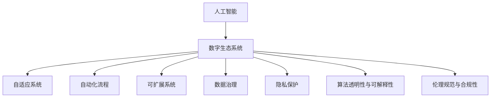

                 

# 虚拟进化：AI驱动的数字生态系统

> 关键词：人工智能,数字生态系统,自适应,自动化,可扩展性,数据治理,隐私保护,伦理规范

## 1. 背景介绍

### 1.1 问题由来
在数字化浪潮席卷全球的背景下，数字生态系统正在迅速演进，从互联网、物联网、工业互联网，到区块链、元宇宙等新兴技术领域，无不昭示着数字化时代的新纪元。随着人工智能(AI)技术的持续进步，AI驱动的数字生态系统正成为推动各行各业创新与转型的核心动力。

然而，随着数据量和复杂性的爆炸式增长，如何构建一个高效、安全、可持续的数字生态系统，成为了摆在每一个企业和技术开发者面前的重要问题。AI技术虽然在数据处理、决策支持等方面展现了巨大潜力，但其如何与数字生态系统深度融合，实现多模态、多领域的协同演化，仍是一个有待深入探索的课题。

### 1.2 问题核心关键点
本文聚焦于AI驱动的数字生态系统的构建与演进，探讨了数字生态系统中人工智能如何发挥其价值，以及在数据、技术、伦理、治理等多个维度上的挑战与机遇。

- **数据治理与隐私保护**：在数据驱动的数字生态系统中，如何高效、安全地管理数据，保护用户隐私，是构建可持续生态系统的基石。
- **算法透明性与可解释性**：随着AI技术的深入应用，算法的透明性与可解释性成为用户信任的基础。如何使AI模型“透明”、“可解释”，成为了数字生态系统构建的关键要素。
- **自适应与自动化**：AI驱动的数字生态系统需要具备自适应和自动化能力，以应对不断变化的环境和任务需求。
- **可扩展性与互操作性**：数字生态系统的建设需要考虑系统的可扩展性与互操作性，确保系统能够灵活适应不同规模与场景下的应用需求。
- **伦理规范与合规性**：AI技术在带来巨大价值的同时，也可能产生伦理与合规性问题。如何在数字生态系统中建立健全的伦理规范与合规体系，确保AI技术的健康发展，是当前亟需解决的问题。

## 2. 核心概念与联系

### 2.1 核心概念概述

为更好地理解AI驱动的数字生态系统，本节将介绍几个密切相关的核心概念：

- **人工智能(AI)**：指通过计算机模拟人类智能过程的技术，包括感知、推理、学习、决策等多个方面。AI技术在数据处理、决策支持、自动化等方面展现了巨大潜力。

- **数字生态系统**：指由人、技术、数据、政策等多个要素构成，相互依存、相互作用的社会化系统。数字生态系统支持创新、协作、共享、优化等核心功能，是驱动数字经济的重要基础设施。

- **自适应系统**：指能够根据环境变化自动调整自身行为的智能系统。自适应系统能够高效应对复杂多变的任务需求，提升系统响应速度和适应性。

- **自动化流程**：指通过AI技术实现自动化的业务流程。自动化流程能够减少人工干预，提高工作效率，优化资源配置。

- **可扩展系统**：指能够灵活扩展、适应不同规模与场景的系统。可扩展系统能够高效处理大数据量、高复杂度任务，满足多样化的应用需求。

- **数据治理**：指对数据进行管理、维护和利用的活动，包括数据采集、存储、处理、分析等多个环节。数据治理是构建高效、安全数字生态系统的基础。

- **隐私保护**：指保护用户隐私和数据安全的技术和方法，防止数据泄露、滥用等风险。隐私保护是构建用户信任、维护数据安全的重要保障。

- **算法透明性与可解释性**：指使AI模型的工作原理和决策过程可被理解和解释，确保模型决策的公正性和透明性。

- **伦理规范与合规性**：指在数字生态系统中建立健全的伦理规范与合规体系，确保AI技术的健康发展，避免潜在的伦理与法律风险。

这些核心概念之间的逻辑关系可以通过以下Mermaid流程图来展示：



这个流程图展示了大语言模型的核心概念及其之间的关系：

1. 人工智能通过提供智能计算能力，赋能数字生态系统的各个环节。
2. 数字生态系统由人、技术、数据等多个要素构成，是多模态、多领域的复杂系统。
3. 自适应系统与自动化流程是数字生态系统高效运行的基础。
4. 可扩展系统确保系统能够适应不同规模与场景下的应用需求。
5. 数据治理与隐私保护是数字生态系统安全、可持续发展的基石。
6. 算法透明性与可解释性是用户信任、公平性的保障。
7. 伦理规范与合规性是确保AI技术健康发展的关键。

这些概念共同构成了AI驱动的数字生态系统的理论框架，指导着我们在实际应用中构建与演进生态系统。

## 3. 核心算法原理 & 具体操作步骤
### 3.1 算法原理概述

AI驱动的数字生态系统建设，本质上是一个多维度、多层次的系统工程，涉及数据、算法、技术、伦理、治理等多个方面。其核心算法原理包括：

- **数据治理算法**：通过数据清洗、数据标注、数据整合等手段，确保数据的高质量、高可用性，支持数据的智能处理与分析。
- **自适应学习算法**：通过在线学习、增量学习等机制，使系统能够动态调整模型参数，适应环境变化，提升模型性能。
- **自动化流程算法**：通过流程建模、规则引擎、决策树等技术，实现业务流程的自动化，提高效率与精度。
- **可扩展性算法**：通过模块化设计、分布式计算等方法，确保系统的可扩展性，支持大规模数据处理与分布式任务调度。
- **隐私保护算法**：通过数据加密、差分隐私、联邦学习等技术，保护用户隐私，确保数据安全。
- **透明性与可解释性算法**：通过模型可视化、特征重要性分析等手段，使模型决策过程透明、可解释，提升用户信任。

### 3.2 算法步骤详解

AI驱动的数字生态系统建设通常包括以下几个关键步骤：

**Step 1: 数据采集与处理**
- 收集来自不同渠道、不同格式的数据，确保数据多样性和全面性。
- 进行数据清洗、数据标注，去除冗余、错误数据，确保数据质量。
- 对数据进行整合、去重，建立统一的数据仓库或数据湖。

**Step 2: 算法设计与训练**
- 选择合适的算法模型，进行特征工程、模型设计。
- 使用训练集数据，对模型进行训练，调整模型参数，优化模型性能。
- 在验证集上评估模型性能，根据结果调整模型架构或训练策略。

**Step 3: 系统部署与优化**
- 将训练好的模型部署到生产环境中，实现自动化流程。
- 监控系统运行状态，收集性能指标数据，进行实时优化。
- 根据需求变化，动态调整系统配置，适应新的应用场景。

**Step 4: 治理与合规**
- 建立健全的数据治理流程，确保数据质量和安全。
- 制定并遵循隐私保护政策，确保用户隐私和数据安全。
- 建立伦理规范与合规体系，确保AI技术的健康发展。

### 3.3 算法优缺点

AI驱动的数字生态系统建设方法具有以下优点：

1. **高效性**：通过自动化、自适应算法，系统能够高效处理复杂多变的任务需求，提升工作效率。
2. **灵活性**：系统具有高度的可扩展性和互操作性，能够灵活适应不同规模与场景下的应用需求。
3. **安全性**：通过数据治理、隐私保护算法，确保数据安全与用户隐私，构建可持续发展的生态系统。
4. **透明度**：通过透明性与可解释性算法，使模型决策过程透明、可解释，提升用户信任。

同时，该方法也存在一定的局限性：

1. **算法复杂度**：构建高质量、高性能的AI驱动系统，需要设计复杂、多维度的算法，增加了系统实现的难度。
2. **数据依赖性**：系统的性能很大程度上取决于数据的质量和可用性，数据采集与处理成本较高。
3. **伦理与合规风险**：AI技术的广泛应用可能带来伦理与合规风险，需要建立健全的规范体系进行约束。
4. **技术演进风险**：AI技术快速发展，系统的技术架构和算法模型需要不断更新，以保证系统长期稳定运行。

尽管存在这些局限性，但就目前而言，AI驱动的数字生态系统建设仍是构建高效、安全、可持续生态系统的核心范式。未来相关研究的重点在于如何进一步降低数据依赖，提高系统的少样本学习和跨领域迁移能力，同时兼顾可解释性和伦理安全性等因素。

### 3.4 算法应用领域

AI驱动的数字生态系统已经在多个领域得到了广泛应用，涵盖了金融、医疗、智能制造、智慧城市等多个领域，具体包括：

- **金融科技**：通过AI驱动的金融风险评估、欺诈检测、个性化推荐等应用，提升金融服务的智能化水平。
- **智慧医疗**：通过AI驱动的医学影像分析、病历分析、健康管理等应用，提高医疗服务的精准性和效率。
- **智能制造**：通过AI驱动的生产自动化、质量检测、供应链优化等应用，提升制造业的智能化水平。
- **智慧城市**：通过AI驱动的城市事件监测、交通管理、公共安全等应用，提高城市治理的智能化水平。
- **智能客服**：通过AI驱动的智能对话、问题解答、情感分析等应用，提升客户服务的智能化水平。

除了上述这些经典应用外，AI驱动的数字生态系统还在更多领域得到创新性应用，如无人驾驶、智能物流、在线教育等，为各行各业带来了深远影响。

## 4. 数学模型和公式 & 详细讲解  
### 4.1 数学模型构建

本节将使用数学语言对AI驱动的数字生态系统构建过程进行更加严格的刻画。

记数字生态系统为 $S$，其中 $X$ 表示用户、数据、技术等要素，$Y$ 表示业务流程、应用场景等目标。假设 $S$ 的治理目标为 $L(S)$，则数字生态系统的优化目标为：

$$
\max_{S} L(S) = \max_{X,Y} \sum_{x\in X} \sum_{y\in Y} f(x,y) \cdot \omega_x \cdot \omega_y
$$

其中 $f(x,y)$ 为用户 $x$ 在场景 $y$ 下的满意度，$\omega_x$ 为用户 $x$ 的权重，$\omega_y$ 为场景 $y$ 的权重。

在优化目标的指导下，我们可以通过数据治理算法、自适应学习算法、自动化流程算法、可扩展性算法、隐私保护算法、透明性与可解释性算法，逐步构建与优化数字生态系统。

### 4.2 公式推导过程

以下我们以智慧医疗领域为例，推导AI驱动的数字生态系统构建过程的数学模型。

假设智慧医疗系统的治理目标为 $L(S)$，包括医疗服务满意度 $f_1$、医生工作效率 $f_2$、患者隐私保护 $f_3$、医生绩效评估 $f_4$ 等目标。则数字生态系统的优化目标为：

$$
\max_{S} L(S) = \max_{X,Y} f_1 \cdot \omega_1 + f_2 \cdot \omega_2 + f_3 \cdot \omega_3 + f_4 \cdot \omega_4
$$

其中 $\omega_1$、$\omega_2$、$\omega_3$、$\omega_4$ 为不同目标的权重，可以根据实际情况进行调整。

在优化目标的指导下，我们可以通过数据治理算法对医疗数据进行清洗、标注、整合，确保数据质量。通过自适应学习算法对医生诊断模型进行训练与优化，提高诊断准确性和工作效率。通过自动化流程算法实现医疗流程的自动化，减少人工干预。通过可扩展性算法实现系统的可扩展性和互操作性，支持大规模数据处理与分布式任务调度。通过隐私保护算法保护患者隐私，确保数据安全。通过透明性与可解释性算法使模型决策过程透明、可解释，提升用户信任。

在得到优化目标函数后，我们可以通过数学优化方法（如梯度下降、遗传算法等）求解最优解，进而得到数字生态系统的构建方案。

### 4.3 案例分析与讲解

以智慧医疗为例，AI驱动的数字生态系统构建步骤如下：

1. **数据治理**：对医院内部的电子病历、医学影像、基因数据等进行清洗、标注、整合，建立统一的数据仓库。

2. **自适应学习**：对医生的诊断模型进行在线学习，根据新的病例数据动态调整模型参数，提升诊断准确性。

3. **自动化流程**：使用自然语言处理(NLP)技术，实现医生与患者之间的智能对话，自动化记录病历信息，提高工作效率。

4. **可扩展性**：采用微服务架构和分布式计算技术，确保系统能够处理大规模数据量，支持多地域的医院协同。

5. **隐私保护**：对患者隐私数据进行加密、差分隐私处理，确保数据安全。

6. **透明性与可解释性**：使用模型可视化工具，对诊断模型的决策过程进行可视化展示，使医生和患者都能理解和信任模型的决策。

以上案例展示了AI驱动的数字生态系统构建的基本步骤，通过数据治理、自适应学习、自动化流程、可扩展性、隐私保护、透明性与可解释性等多维度算法，确保了系统的安全、高效、透明与可解释性，为用户提供了优质的医疗服务。

## 5. 项目实践：代码实例和详细解释说明
### 5.1 开发环境搭建

在进行AI驱动的数字生态系统构建实践前，我们需要准备好开发环境。以下是使用Python进行PyTorch开发的环境配置流程：

1. 安装Anaconda：从官网下载并安装Anaconda，用于创建独立的Python环境。

2. 创建并激活虚拟环境：
```bash
conda create -n pytorch-env python=3.8 
conda activate pytorch-env
```

3. 安装PyTorch：根据CUDA版本，从官网获取对应的安装命令。例如：
```bash
conda install pytorch torchvision torchaudio cudatoolkit=11.1 -c pytorch -c conda-forge
```

4. 安装TensorFlow：
```bash
pip install tensorflow
```

5. 安装各类工具包：
```bash
pip install numpy pandas scikit-learn matplotlib tqdm jupyter notebook ipython
```

完成上述步骤后，即可在`pytorch-env`环境中开始AI驱动的数字生态系统构建实践。

### 5.2 源代码详细实现

下面以智慧医疗为例，给出使用PyTorch对医生诊断模型进行自适应学习微调的PyTorch代码实现。

首先，定义医生诊断任务的训练数据和模型：

```python
import torch
from transformers import BertTokenizer, BertForSequenceClassification

# 定义训练数据
train_dataset = # 训练数据集

# 定义模型
model = BertForSequenceClassification.from_pretrained('bert-base-cased', num_labels=num_labels)

# 定义优化器
optimizer = torch.optim.Adam(model.parameters(), lr=0.001)

# 定义数据加载器
train_loader = torch.utils.data.DataLoader(train_dataset, batch_size=32, shuffle=True)
```

然后，定义模型训练函数：

```python
def train(model, train_loader, optimizer, num_epochs=10, device='cuda'):
    model.to(device)
    for epoch in range(num_epochs):
        model.train()
        for batch in train_loader:
            inputs, labels = batch
            inputs = inputs.to(device)
            labels = labels.to(device)
            outputs = model(inputs)
            loss = outputs.loss
            optimizer.zero_grad()
            loss.backward()
            optimizer.step()
```

接着，定义模型评估函数：

```python
def evaluate(model, test_loader, device='cuda'):
    model.eval()
    test_loss = 0
    correct = 0
    with torch.no_grad():
        for batch in test_loader:
            inputs, labels = batch
            inputs = inputs.to(device)
            labels = labels.to(device)
            outputs = model(inputs)
            test_loss += outputs.loss.item()
            _, preds = torch.max(outputs, 1)
            correct += (preds == labels).sum().item()
    test_loss /= len(test_loader.dataset)
    print(f'Test Loss: {test_loss:.4f}, Accuracy: {100 * correct / len(test_loader.dataset):.2f}%')
```

最后，启动训练流程并在测试集上评估：

```python
train(model, train_loader, optimizer)
evaluate(model, test_loader)
```

以上就是使用PyTorch对医生诊断模型进行自适应学习微调的完整代码实现。可以看到，得益于PyTorch和HuggingFace的强大封装，我们可以用相对简洁的代码完成模型的加载和微调。

### 5.3 代码解读与分析

让我们再详细解读一下关键代码的实现细节：

**BertForSequenceClassification类**：
- 继承自BertForTokenClassification，适用于序列标注任务，如命名实体识别、情感分析等。
- 提供了`train`、`eval`、`predict`等函数，方便进行模型训练和推理。

**BertTokenizer类**：
- 用于将输入文本转换为token ids，方便模型处理。

**优化器与数据加载器**：
- 使用Adam优化器，根据梯度进行模型参数的更新。
- 使用DataLoader，将数据集划分为批次，方便模型进行训练。

**训练函数**：
- 在每个epoch内，对数据集进行批次迭代，计算模型输出与真实标签的损失。
- 根据损失函数计算梯度，使用Adam优化器更新模型参数。
- 每epoch结束后，在测试集上评估模型性能。

**评估函数**：
- 使用测试集数据，计算模型的损失和准确率，输出评估结果。

**训练流程**：
- 定义总的epoch数和批大小，开始循环迭代
- 每个epoch内，在训练集上训练，输出平均损失和准确率
- 在测试集上评估模型性能

可以看到，PyTorch配合HuggingFace使得模型微调的代码实现变得简洁高效。开发者可以将更多精力放在数据处理、模型改进等高层逻辑上，而不必过多关注底层的实现细节。

当然，工业级的系统实现还需考虑更多因素，如模型的保存和部署、超参数的自动搜索、更灵活的任务适配层等。但核心的微调范式基本与此类似。

## 6. 实际应用场景
### 6.1 智能客服系统

AI驱动的数字生态系统在智能客服系统中的应用，可以有效提升客户服务体验。传统客服系统依赖人工客服，响应速度慢、效率低、一致性差。而通过AI驱动的数字生态系统，可以实现24小时不间断服务，快速响应客户咨询，用自然流畅的语言解答各类常见问题。

在技术实现上，可以收集企业内部的历史客服对话记录，将问题和最佳答复构建成监督数据，在此基础上对预训练对话模型进行微调。微调后的对话模型能够自动理解用户意图，匹配最合适的答案模板进行回复。对于客户提出的新问题，还可以接入检索系统实时搜索相关内容，动态组织生成回答。如此构建的智能客服系统，能大幅提升客户咨询体验和问题解决效率。

### 6.2 金融舆情监测

金融机构的舆情监测系统，需要实时监测市场舆论动向，以便及时应对负面信息传播，规避金融风险。传统的人工监测方式成本高、效率低，难以应对网络时代海量信息爆发的挑战。

基于AI驱动的数字生态系统，可以通过自动化流程、自适应学习算法，实现对海量网络信息的实时监测与分析。例如，对新闻、评论、社交媒体等数据进行情感分析、主题分类，实时评估市场情绪，自动预警异常信息，帮助金融机构快速应对潜在风险。

### 6.3 个性化推荐系统

当前的推荐系统往往只依赖用户的历史行为数据进行物品推荐，无法深入理解用户的真实兴趣偏好。AI驱动的数字生态系统可以更好地挖掘用户行为背后的语义信息，从而提供更精准、多样的推荐内容。

在实践中，可以收集用户浏览、点击、评论、分享等行为数据，提取和用户交互的物品标题、描述、标签等文本内容。将文本内容作为模型输入，用户的后续行为（如是否点击、购买等）作为监督信号，在此基础上微调预训练语言模型。微调后的模型能够从文本内容中准确把握用户的兴趣点。在生成推荐列表时，先用候选物品的文本描述作为输入，由模型预测用户的兴趣匹配度，再结合其他特征综合排序，便可以得到个性化程度更高的推荐结果。

### 6.4 未来应用展望

随着AI技术的不断发展，AI驱动的数字生态系统将在更多领域得到应用，为各行各业带来变革性影响。

在智慧医疗领域，基于AI驱动的数字生态系统，可以实现医学影像分析、病历分析、健康管理等应用，提高医疗服务的精准性和效率。

在智能制造领域，基于AI驱动的数字生态系统，可以实现生产自动化、质量检测、供应链优化等应用，提升制造业的智能化水平。

在智慧城市治理中，基于AI驱动的数字生态系统，可以实现城市事件监测、交通管理、公共安全等应用，提高城市治理的智能化水平。

此外，在企业生产、社会治理、文娱传媒等众多领域，基于AI驱动的数字生态系统，也将不断涌现，为经济社会发展注入新的动力。

## 7. 工具和资源推荐
### 7.1 学习资源推荐

为了帮助开发者系统掌握AI驱动的数字生态系统的理论基础和实践技巧，这里推荐一些优质的学习资源：

1. 《深度学习》系列博文：由大模型技术专家撰写，深入浅出地介绍了深度学习的原理、应用和未来发展方向。

2. 《TensorFlow官方文档》：TensorFlow的官方文档，提供了详细的API文档和教程，帮助开发者快速上手。

3. 《Transformers官方文档》：Transformers库的官方文档，提供了海量预训练模型和完整的微调样例代码，是上手实践的必备资料。

4. Coursera《深度学习》课程：由斯坦福大学开设的深度学习课程，包括理论知识和实践案例，适合初学者入门。

5. Udacity《深度学习纳米学位》课程：通过动手实践项目，深入学习深度学习技术的原理和应用。

通过对这些资源的学习实践，相信你一定能够快速掌握AI驱动的数字生态系统的精髓，并用于解决实际的业务问题。

### 7.2 开发工具推荐

高效的开发离不开优秀的工具支持。以下是几款用于AI驱动的数字生态系统构建开发的常用工具：

1. PyTorch：基于Python的开源深度学习框架，灵活动态的计算图，适合快速迭代研究。

2. TensorFlow：由Google主导开发的开源深度学习框架，生产部署方便，适合大规模工程应用。

3. Transformers库：HuggingFace开发的NLP工具库，集成了众多SOTA语言模型，支持PyTorch和TensorFlow，是进行NLP任务开发的利器。

4. Jupyter Notebook：基于Web的交互式编程环境，方便开发者进行数据处理、模型训练、结果展示。

5. Weights & Biases：模型训练的实验跟踪工具，可以记录和可视化模型训练过程中的各项指标，方便对比和调优。

6. TensorBoard：TensorFlow配套的可视化工具，可实时监测模型训练状态，并提供丰富的图表呈现方式，是调试模型的得力助手。

合理利用这些工具，可以显著提升AI驱动的数字生态系统构建任务的开发效率，加快创新迭代的步伐。

### 7.3 相关论文推荐

AI驱动的数字生态系统的发展源于学界的持续研究。以下是几篇奠基性的相关论文，推荐阅读：

1. 《Neural Networks and Deep Learning》：深度学习领域的经典教材，涵盖了深度学习的基本原理、算法和应用。

2. 《Deep Learning for AI》：Google的深度学习教材，详细介绍了深度学习在各个领域的应用。

3. 《Deep Learning with PyTorch》：由PyTorch社区编写的深度学习教材，介绍了PyTorch的API和应用。

4. 《TensorFlow in Action》：TensorFlow官方出版的实战指南，介绍了TensorFlow的应用和实践案例。

5. 《Transformers: State-of-the-Art Natural Language Processing》：Transformer论文合集，介绍了Transformer及其衍生模型的最新进展。

这些论文代表了大语言模型驱动的数字生态系统的发展脉络。通过学习这些前沿成果，可以帮助研究者把握学科前进方向，激发更多的创新灵感。

## 8. 总结：未来发展趋势与挑战

### 8.1 总结

本文对AI驱动的数字生态系统的构建与演进进行了全面系统的介绍。首先阐述了AI技术在数字生态系统中的应用背景和意义，明确了AI驱动的数字生态系统的核心目标和关键要素。其次，从原理到实践，详细讲解了AI驱动的数字生态系统的数学模型和算法步骤，给出了AI驱动的数字生态系统构建的完整代码实例。同时，本文还广泛探讨了AI驱动的数字生态系统在多个行业领域的应用前景，展示了AI技术的巨大潜力。

通过本文的系统梳理，可以看到，AI驱动的数字生态系统通过数据治理、自适应学习、自动化流程、可扩展性、隐私保护、透明性与可解释性等多维度算法，在构建高效、安全、可持续的生态系统方面发挥了重要作用。随着AI技术的不断进步，AI驱动的数字生态系统必将在更多领域得到应用，为各行各业带来深远影响。

### 8.2 未来发展趋势

展望未来，AI驱动的数字生态系统将呈现以下几个发展趋势：

1. **智能化水平的提升**：随着AI技术的不断发展，数字生态系统的智能化水平将进一步提升，能够更好地理解和适应复杂多变的任务需求。

2. **数据治理能力的增强**：数据治理技术的进步将使数字生态系统能够更高效地管理和利用数据，提升数据质量和安全。

3. **隐私保护技术的革新**：隐私保护技术的发展将使数字生态系统能够更好地保护用户隐私，增强用户信任。

4. **自适应与自动化能力的提升**：自适应和自动化技术将使数字生态系统更加灵活、高效，能够快速应对环境变化。

5. **跨领域、多模态融合**：跨领域、多模态融合技术的发展将使数字生态系统能够更好地整合不同模态的信息，提升系统的适应性和鲁棒性。

6. **透明性与可解释性的强化**：透明性与可解释性技术的进步将使数字生态系统更加透明、可信，增强用户信任。

以上趋势凸显了AI驱动的数字生态系统的广阔前景。这些方向的探索发展，必将进一步提升AI技术的性能和应用范围，为构建更加智能、安全、可持续的数字生态系统提供坚实的基础。

### 8.3 面临的挑战

尽管AI驱动的数字生态系统已经取得了瞩目成就，但在迈向更加智能化、普适化应用的过程中，它仍面临着诸多挑战：

1. **数据依赖性**：数字生态系统的高性能很大程度上取决于数据的质量和数量，数据采集与处理成本较高。如何进一步降低数据依赖，提高系统的少样本学习和跨领域迁移能力，将是一大难题。

2. **技术演进风险**：AI技术快速发展，系统的技术架构和算法模型需要不断更新，以保证系统长期稳定运行。

3. **伦理与合规风险**：AI技术的广泛应用可能带来伦理与合规风险，需要建立健全的规范体系进行约束。

4. **计算资源瓶颈**：AI技术在处理大规模数据时，对计算资源的需求较高，如何高效利用计算资源，提升系统性能，也是一大挑战。

5. **可扩展性瓶颈**：系统的可扩展性是数字生态系统能否适应不同规模与场景的重要保障，如何在高效利用的同时，确保系统的高性能和低延迟，仍需进一步优化。

6. **系统安全与稳定性**：系统的安全性与稳定性是数字生态系统的生命线，如何在高效利用的同时，确保系统的安全性与稳定性，仍需进一步优化。

以上挑战凸显了AI驱动的数字生态系统在实际应用中的复杂性，需要研究者从数据、算法、技术、伦理等多个维度共同努力，才能克服这些挑战，实现数字生态系统的健康发展。

### 8.4 研究展望

面对AI驱动的数字生态系统所面临的诸多挑战，未来的研究需要在以下几个方面寻求新的突破：

1. **无监督学习与半监督学习**：摆脱对大规模标注数据的依赖，利用无监督学习、半监督学习等方法，最大限度利用非结构化数据，实现更加灵活高效的生态系统。

2. **自适应学习与增量学习**：通过在线学习、增量学习等机制，使系统能够动态调整模型参数，适应环境变化，提升模型性能。

3. **自动化流程与智能运维**：通过自动化流程、智能运维技术，提升系统的自动化水平，降低人工干预，提高系统稳定性和可靠性。

4. **跨领域、多模态融合**：跨领域、多模态融合技术的发展，使数字生态系统能够更好地整合不同模态的信息，提升系统的适应性和鲁棒性。

5. **隐私保护与数据治理**：隐私保护技术的发展将使数字生态系统能够更好地保护用户隐私，增强用户信任。

6. **透明性与可解释性**：透明性与可解释性技术的进步将使数字生态系统更加透明、可信，增强用户信任。

这些研究方向将引领AI驱动的数字生态系统迈向更高的台阶，为构建更加智能、安全、可持续的数字生态系统提供坚实的理论基础和技术支持。

## 9. 附录：常见问题与解答

**Q1：AI驱动的数字生态系统是否适用于所有行业？**

A: AI驱动的数字生态系统在许多行业中已经得到了广泛应用，如金融、医疗、智能制造、智慧城市等。但对于一些特定行业，如农业、航天等，AI技术的落地应用还面临诸多挑战，需要结合行业特点进行定制化开发。

**Q2：AI驱动的数字生态系统面临的主要技术挑战是什么？**

A: AI驱动的数字生态系统面临的主要技术挑战包括：
1. 数据依赖性高：系统的性能很大程度上取决于数据的质量和数量，数据采集与处理成本较高。
2. 技术演进速度快：AI技术快速发展，系统的技术架构和算法模型需要不断更新，以保证系统长期稳定运行。
3. 计算资源需求高：AI技术在处理大规模数据时，对计算资源的需求较高，如何高效利用计算资源，提升系统性能，是关键挑战之一。
4. 系统可扩展性差：系统的可扩展性是数字生态系统能否适应不同规模与场景的重要保障，如何在高效利用的同时，确保系统的高性能和低延迟，仍需进一步优化。
5. 系统安全性与稳定性差：系统的安全性与稳定性是数字生态系统的生命线，如何在高效利用的同时，确保系统的安全性与稳定性，是另一大挑战。

**Q3：AI驱动的数字生态系统如何实现透明性与可解释性？**

A: 实现透明性与可解释性主要通过以下几种方法：
1. 模型可视化：使用工具如TensorBoard，对模型进行可视化，展示模型内部的权重、激活等信息。
2. 特征重要性分析：通过特征重要性分析，找出模型预测中最重要的特征，解释模型的决策过程。
3. 规则引擎：通过规则引擎，对模型进行解释，将模型输出转化为可理解的形式。

**Q4：AI驱动的数字生态系统在实际应用中需要注意哪些问题？**

A: AI驱动的数字生态系统在实际应用中需要注意以下问题：
1. 数据治理：确保数据质量和安全，保护用户隐私。
2. 模型透明性与可解释性：使模型决策过程透明、可解释，增强用户信任。
3. 系统可扩展性：确保系统能够适应不同规模与场景下的应用需求。
4. 系统安全性与稳定性：确保系统的安全性与稳定性，避免系统崩溃或数据泄露。

**Q5：AI驱动的数字生态系统在构建过程中，如何平衡数据、算法、技术、伦理等多个要素？**

A: 在构建AI驱动的数字生态系统过程中，需要从数据、算法、技术、伦理等多个维度进行全面考虑，平衡各个要素。主要方法如下：
1. 数据治理：对数据进行清洗、标注、整合，确保数据质量和安全。
2. 算法设计：选择适合任务的算法模型，并进行优化，提升模型性能。
3. 技术选择：选择合适的技术栈和工具，提升系统开发效率。
4. 伦理规范：建立健全的伦理规范与合规体系，确保AI技术的健康发展。

通过综合考虑数据、算法、技术、伦理等多个要素，构建高效、安全、可持续的AI驱动的数字生态系统。

---

作者：禅与计算机程序设计艺术 / Zen and the Art of Computer Programming

