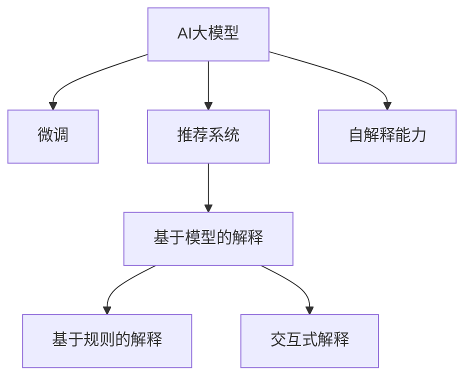

                 

# 融合AI大模型的商品推荐解释技术

## 1. 背景介绍

### 1.1 问题由来

随着电子商务平台和数字零售的飞速发展，商品推荐系统已成为在线零售的核心功能之一。通过向用户推荐最符合其兴趣和需求的商品，不仅能够提升用户体验，还能显著增加平台的销售额。然而，传统的商品推荐系统往往缺乏足够的解释性，导致用户难以理解推荐算法背后的决策逻辑。缺乏透明度的推荐系统不仅影响了用户信任，也限制了个性化推荐系统的实际应用。

为了应对这一问题，近年来研究者们提出了各种解释技术，如基于规则的解释、基于模型的解释等。其中，基于模型的解释技术能够提供详细的推理路径和原因，使得推荐过程更具可解释性。然而，传统的基于模型的方法往往依赖于手工设计的规则或特征，难以应对快速变化的电商数据。

随着AI大模型的兴起，商品推荐系统的解释技术也逐步向基于大模型的方向演进。大模型通过对大量电商数据进行预训练，学习到商品与用户兴趣之间的复杂关系。通过在大模型上进行微调，可以构建出高效、准确的推荐系统。同时，大模型自带的自解释能力也能直接用于推荐系统的解释。但目前关于大模型的商品推荐解释技术仍处于起步阶段，需要进一步的研究和探索。

### 1.2 问题核心关键点

本研究聚焦于基于大模型的商品推荐解释技术。具体来说，我们将探索如何在大模型上进行推荐系统微调，同时结合大模型的自解释能力，构建兼具高效推荐和详细解释的智能推荐系统。

## 2. 核心概念与联系

### 2.1 核心概念概述

为更好地理解融合AI大模型的商品推荐解释技术，本节将介绍几个密切相关的核心概念：

- **AI大模型(Artificial Intelligence Large Models)**：以自回归或自编码模型为代表的大规模预训练模型，通过在大规模无标签文本或图像数据上进行预训练，学习通用的知识表示。如GPT、BERT、ViT等模型。
- **推荐系统(Recommendation System)**：利用用户历史行为数据和商品特征，预测用户对未曝光商品感兴趣的概率，从而推荐合适的商品。常见的推荐算法包括协同过滤、基于内容的推荐、矩阵分解等。
- **解释技术(Explainable Technology)**：用于解释推荐系统决策过程的技术，如规则、模型、交互式解释等。目标是提高用户对推荐结果的理解和信任。
- **微调(Fine-Tuning)**：在大模型上进行有监督训练，适应特定任务的推荐需求，提高模型性能。
- **自解释能力(Automatic Explainability)**：大模型在推理过程中的隐式解释，如通过梯度等方法，自动生成对推理过程的解释。

这些核心概念之间的逻辑关系可以通过以下Mermaid流程图来展示：



这个流程图展示了大模型、微调、推荐系统与解释技术之间的核心联系：

1. 大模型通过预训练学习到通用知识表示，可以通过微调适应特定的推荐任务。
2. 微调后的推荐系统能够高效地生成推荐结果，但缺乏详细的解释。
3. 解释技术用于补充推荐系统的透明性，提高用户信任度。
4. 大模型自带的自解释能力可以直接用于推荐系统的解释，提供详细的推理路径和原因。

## 3. 核心算法原理 & 具体操作步骤

### 3.1 算法原理概述

融合AI大模型的商品推荐解释技术，本质上是一种基于大模型的推荐系统微调范式，结合大模型的自解释能力，构建高效且可解释的推荐系统。其核心思想是：

1. 在大模型上进行微调，适应电商领域的推荐需求。
2. 利用大模型自带的自解释能力，生成详细的推理路径和原因。
3. 将解释信息与推荐结果一同输出，提高用户对推荐结果的理解和信任。

具体来说，该算法流程包括以下几个关键步骤：

1. 准备电商数据集：收集电商平台的商品和用户数据，构建推荐系统所需的数据集。
2. 选择预训练模型：选择合适的预训练大模型，如GPT、BERT、ViT等。
3. 设计任务适配层：在预训练模型的基础上，设计适应电商推荐任务的输出层和损失函数。
4. 微调模型：利用电商数据集对模型进行微调，适应特定任务。
5. 生成解释：利用大模型自带的自解释能力，自动生成对推荐结果的解释。
6. 输出结果：将推荐结果和解释信息一同输出，供用户查看和参考。

### 3.2 算法步骤详解

#### 3.2.1 准备电商数据集

电商数据集通常包含以下信息：

- **用户数据**：如用户ID、浏览历史、购买历史、评分、标签等。
- **商品数据**：如商品ID、描述、图片、价格、类别、评分等。
- **用户-商品互动数据**：如点击、加入购物车、购买等行为数据。

数据集需要预处理和清洗，如去除噪声、填补缺失值、归一化等。然后，将数据集划分为训练集、验证集和测试集，用于模型训练、验证和测试。

#### 3.2.2 选择预训练模型

选择合适的大模型进行推荐系统微调，是构建高性能推荐系统的关键。目前主流的预训练模型有：

- **GPT系列**：以自回归模型为基础，适合生成型推荐任务。
- **BERT**：以自编码模型为基础，适合结构化推荐任务。
- **ViT**：以自编码和注意力机制为基础，适合视觉推荐任务。

选择合适的预训练模型，需根据具体的电商场景和推荐任务来决定。例如，对于需要生成文本型推荐内容的场景，可以选择GPT-3作为预训练模型。

#### 3.2.3 设计任务适配层

设计任务适配层是微调过程中的一项重要工作，决定了模型的输出格式和损失函数。对于电商推荐任务，适配层可以设计为以下形式：

- **分类任务**：如预测用户是否购买某商品，输出层为单分类器，损失函数为交叉熵损失。
- **排序任务**：如预测商品排序概率，输出层为回归器，损失函数为均方误差损失。
- **序列生成任务**：如生成购物车推荐序列，输出层为解码器，损失函数为负对数似然损失。

适配层的结构可以灵活设计，根据具体的推荐任务进行优化。例如，可以加入注意力机制、多层次融合、情感分析等技术，提升推荐效果。

#### 3.2.4 微调模型

微调模型的过程主要包括：

1. 初始化模型参数：将预训练模型的权重作为初始化参数，避免从头训练导致过拟合。
2. 选择优化算法：如Adam、SGD等，设置学习率、批大小、迭代轮数等参数。
3. 执行梯度训练：在电商数据集上，利用训练集进行前向传播计算损失函数，反向传播计算梯度，更新模型参数。
4. 验证模型性能：在验证集上评估模型性能，避免模型过拟合训练集。
5. 测试模型效果：在测试集上评估模型性能，对比微调前后的推荐效果。

微调过程中需要特别注意超参数的选择和调整，避免因过拟合或欠拟合影响模型性能。

#### 3.2.5 生成解释

大模型自带的自解释能力，如梯度、注意力权重等，可以直接用于生成对推荐结果的解释。具体来说，可以设计以下解释方式：

1. **梯度解释**：通过计算梯度，解释用户对推荐结果的影响因素。
2. **注意力解释**：通过观察模型的注意力权重，解释模型对输入特征的关注度。
3. **权重解释**：通过分析模型输出层的权重，解释模型对不同商品的偏好。

生成解释的过程通常是在微调之后进行的，可以利用训练好的模型进行推理计算。

#### 3.2.6 输出结果

最终，将推荐结果和解释信息一同输出，供用户查看和参考。解释信息可以以文本、图表等多种形式展示，便于用户理解。

### 3.3 算法优缺点

融合AI大模型的商品推荐解释技术具有以下优点：

1. **高效性**：利用大模型自带的高效推理能力，生成推荐结果，提高系统响应速度。
2. **可解释性**：通过解释技术，提供详细的推理路径和原因，提高用户信任度。
3. **泛化能力**：大模型通过预训练学习到通用知识表示，可以适应多种电商场景和推荐任务。

同时，该技术也存在一定的局限性：

1. **资源消耗大**：大模型和微调过程需要大量计算资源，对硬件设备要求较高。
2. **模型复杂性高**：大模型结构复杂，参数量大，难以理解和调试。
3. **解释准确性不足**：生成的解释信息可能无法准确反映用户的真实需求。

尽管存在这些局限性，但就目前而言，融合大模型的商品推荐解释技术仍是大模型应用的重要范式。未来相关研究的重点在于如何进一步降低资源消耗，提高解释准确性，同时兼顾高效性和可解释性等因素。

### 3.4 算法应用领域

融合AI大模型的商品推荐解释技术，已在多个电商领域得到了广泛的应用，包括：

- **服饰电商**：通过大模型预测用户对服装商品的兴趣，结合解释信息推荐合适的商品。
- **家电电商**：利用大模型生成家电推荐列表，并解释推荐依据，提升用户购买决策。
- **食品电商**：预测用户对食品类商品的偏好，并生成详细的解释，提高推荐效果。
- **旅游电商**：推荐旅游商品并解释原因，帮助用户选择最佳旅游路线。
- **汽车电商**：根据用户浏览行为推荐汽车车型，并提供详细的解释，帮助用户决策。

除了上述这些经典应用外，大模型推荐解释技术也被创新性地应用到更多场景中，如个性化广告推荐、推荐系统的用户反馈分析等，为电商技术带来了全新的突破。随着大模型和推荐系统的不断进步，相信电商推荐解释技术将在更广阔的应用领域大放异彩。

## 4. 数学模型和公式 & 详细讲解 & 举例说明

### 4.1 数学模型构建

为了更好地理解融合AI大模型的商品推荐解释技术，本节将使用数学语言对推荐系统的微调过程进行更加严格的刻画。

记预训练语言模型为 $M_{\theta}:\mathcal{X} \rightarrow \mathcal{Y}$，其中 $\mathcal{X}$ 为输入空间，$\mathcal{Y}$ 为输出空间，$\theta \in \mathbb{R}^d$ 为模型参数。假设电商推荐任务为预测用户是否购买某商品，输出空间为 $\{0, 1\}$。

定义模型 $M_{\theta}$ 在输入 $(x,y)$ 上的损失函数为 $\ell(M_{\theta}(x),y)$，则在电商数据集 $D=\{(x_i,y_i)\}_{i=1}^N$ 上的经验风险为：

$$
\mathcal{L}(\theta) = \frac{1}{N}\sum_{i=1}^N \ell(M_{\theta}(x_i),y_i)
$$

微调的优化目标是最小化经验风险，即找到最优参数：

$$
\theta^* = \mathop{\arg\min}_{\theta} \mathcal{L}(\theta)
$$

在实践中，我们通常使用基于梯度的优化算法（如Adam、SGD等）来近似求解上述最优化问题。设 $\eta$ 为学习率，$\lambda$ 为正则化系数，则参数的更新公式为：

$$
\theta \leftarrow \theta - \eta \nabla_{\theta}\mathcal{L}(\theta) - \eta\lambda\theta
$$

其中 $\nabla_{\theta}\mathcal{L}(\theta)$ 为损失函数对参数 $\theta$ 的梯度，可通过反向传播算法高效计算。

### 4.2 公式推导过程

以下我们以二分类任务为例，推导交叉熵损失函数及其梯度的计算公式。

假设模型 $M_{\theta}$ 在输入 $x$ 上的输出为 $\hat{y}=M_{\theta}(x) \in [0,1]$，表示用户购买某商品的概率。真实标签 $y \in \{0,1\}$。则二分类交叉熵损失函数定义为：

$$
\ell(M_{\theta}(x),y) = -[y\log \hat{y} + (1-y)\log (1-\hat{y})]
$$

将其代入经验风险公式，得：

$$
\mathcal{L}(\theta) = -\frac{1}{N}\sum_{i=1}^N [y_i\log M_{\theta}(x_i)+(1-y_i)\log(1-M_{\theta}(x_i))]
$$

根据链式法则，损失函数对参数 $\theta_k$ 的梯度为：

$$
\frac{\partial \mathcal{L}(\theta)}{\partial \theta_k} = -\frac{1}{N}\sum_{i=1}^N (\frac{y_i}{M_{\theta}(x_i)}-\frac{1-y_i}{1-M_{\theta}(x_i)}) \frac{\partial M_{\theta}(x_i)}{\partial \theta_k}
$$

其中 $\frac{\partial M_{\theta}(x_i)}{\partial \theta_k}$ 可进一步递归展开，利用自动微分技术完成计算。

### 4.3 案例分析与讲解

以下是一个具体的案例分析，展示了如何在大模型上进行商品推荐系统的微调，并生成解释。

假设我们已经选择了BERT模型作为预训练模型，并将其应用于电商推荐任务。BERT模型的输出层包含多个线性层，每个线性层输出一个向量表示用户对某商品的兴趣评分。为了进行微调，我们设计了以下任务适配层：

1. 输入层：输入用户和商品特征，将特征编码成BERT模型的输入格式。
2. 输出层：输出每个商品对应BERT输出层的线性层，用于计算购买概率。
3. 损失函数：使用二分类交叉熵损失，计算模型预测结果与真实标签之间的差异。

具体来说，假设用户输入为 $(u, p)$，表示用户ID和商品ID。我们首先使用BERT将 $(u, p)$ 编码成输入向量 $x_u^p$。然后，将 $x_u^p$ 输入到大模型，得到多个兴趣评分向量 $h_{i_u^p} \in \mathbb{R}^d$，其中 $d$ 为模型参数维数。每个 $h_{i_u^p}$ 表示用户对商品 $i$ 的兴趣评分。

模型的预测结果为 $\hat{y}_u^p = \sigma(\sum_{i=1}^D h_{i_u^p} w_i)$，其中 $w_i$ 为输出层权重，$\sigma$ 为激活函数。

模型的损失函数为：

$$
\ell(\theta) = -\frac{1}{N}\sum_{i=1}^N \left[y_i \log \hat{y}_u^p + (1-y_i) \log(1-\hat{y}_u^p)\right]
$$

其中 $y_i \in \{0, 1\}$ 为真实购买标签。

模型的梯度更新公式为：

$$
\theta \leftarrow \theta - \eta \nabla_{\theta}\ell(\theta) - \eta\lambda\theta
$$

在微调过程中，我们希望利用大模型自带的自解释能力，生成对推荐结果的解释。常用的解释方式包括：

1. **梯度解释**：计算梯度 $\nabla_{x_u^p} \ell(\theta)$，表示用户输入对推荐结果的影响。
2. **注意力解释**：观察模型的注意力权重，表示模型对用户特征的关注度。
3. **权重解释**：分析输出层权重 $w_i$，表示模型对不同商品的偏好。

通过这些解释方式，用户可以更好地理解推荐系统的决策过程，提高信任度和满意度。

## 5. 项目实践：代码实例和详细解释说明

### 5.1 开发环境搭建

在进行微调实践前，我们需要准备好开发环境。以下是使用Python进行PyTorch开发的环境配置流程：

1. 安装Anaconda：从官网下载并安装Anaconda，用于创建独立的Python环境。

2. 创建并激活虚拟环境：
```bash
conda create -n pytorch-env python=3.8 
conda activate pytorch-env
```

3. 安装PyTorch：根据CUDA版本，从官网获取对应的安装命令。例如：
```bash
conda install pytorch torchvision torchaudio cudatoolkit=11.1 -c pytorch -c conda-forge
```

4. 安装Transformers库：
```bash
pip install transformers
```

5. 安装各类工具包：
```bash
pip install numpy pandas scikit-learn matplotlib tqdm jupyter notebook ipython
```

完成上述步骤后，即可在`pytorch-env`环境中开始微调实践。

### 5.2 源代码详细实现

下面我们以基于BERT的电商推荐系统为例，给出使用Transformers库对BERT模型进行微调的PyTorch代码实现。

首先，定义电商推荐系统的数据处理函数：

```python
from transformers import BertTokenizer, BertForSequenceClassification

class BERTRecommenderDataset(Dataset):
    def __init__(self, texts, labels, tokenizer, max_len=128):
        self.texts = texts
        self.labels = labels
        self.tokenizer = tokenizer
        self.max_len = max_len
        
    def __len__(self):
        return len(self.texts)
    
    def __getitem__(self, item):
        text = self.texts[item]
        label = self.labels[item]
        
        encoding = self.tokenizer(text, return_tensors='pt', max_length=self.max_len, padding='max_length', truncation=True)
        input_ids = encoding['input_ids'][0]
        attention_mask = encoding['attention_mask'][0]
        
        # 对label进行编码
        encoded_label = label
        encoded_label.extend([0] * (self.max_len - len(encoded_label)))
        labels = torch.tensor(encoded_label, dtype=torch.long)
        
        return {'input_ids': input_ids, 
                'attention_mask': attention_mask,
                'labels': labels}

# 创建dataset
tokenizer = BertTokenizer.from_pretrained('bert-base-cased')

train_dataset = BERTRecommenderDataset(train_texts, train_labels, tokenizer)
dev_dataset = BERTRecommenderDataset(dev_texts, dev_labels, tokenizer)
test_dataset = BERTRecommenderDataset(test_texts, test_labels, tokenizer)
```

然后，定义模型和优化器：

```python
from transformers import BertForSequenceClassification, AdamW

model = BertForSequenceClassification.from_pretrained('bert-base-cased', num_labels=2)

optimizer = AdamW(model.parameters(), lr=2e-5)
```

接着，定义训练和评估函数：

```python
from torch.utils.data import DataLoader
from tqdm import tqdm
from sklearn.metrics import classification_report

device = torch.device('cuda') if torch.cuda.is_available() else torch.device('cpu')
model.to(device)

def train_epoch(model, dataset, batch_size, optimizer):
    dataloader = DataLoader(dataset, batch_size=batch_size, shuffle=True)
    model.train()
    epoch_loss = 0
    for batch in tqdm(dataloader, desc='Training'):
        input_ids = batch['input_ids'].to(device)
        attention_mask = batch['attention_mask'].to(device)
        labels = batch['labels'].to(device)
        model.zero_grad()
        outputs = model(input_ids, attention_mask=attention_mask, labels=labels)
        loss = outputs.loss
        epoch_loss += loss.item()
        loss.backward()
        optimizer.step()
    return epoch_loss / len(dataloader)

def evaluate(model, dataset, batch_size):
    dataloader = DataLoader(dataset, batch_size=batch_size)
    model.eval()
    preds, labels = [], []
    with torch.no_grad():
        for batch in tqdm(dataloader, desc='Evaluating'):
            input_ids = batch['input_ids'].to(device)
            attention_mask = batch['attention_mask'].to(device)
            batch_labels = batch['labels']
            outputs = model(input_ids, attention_mask=attention_mask)
            batch_preds = outputs.logits.argmax(dim=2).to('cpu').tolist()
            batch_labels = batch_labels.to('cpu').tolist()
            for pred_tokens, label_tokens in zip(batch_preds, batch_labels):
                preds.append(pred_tokens[:len(label_tokens)])
                labels.append(label_tokens)
                
    print(classification_report(labels, preds))
```

最后，启动训练流程并在测试集上评估：

```python
epochs = 5
batch_size = 16

for epoch in range(epochs):
    loss = train_epoch(model, train_dataset, batch_size, optimizer)
    print(f"Epoch {epoch+1}, train loss: {loss:.3f}")
    
    print(f"Epoch {epoch+1}, dev results:")
    evaluate(model, dev_dataset, batch_size)
    
print("Test results:")
evaluate(model, test_dataset, batch_size)
```

以上就是使用PyTorch对BERT进行电商推荐系统微调的完整代码实现。可以看到，得益于Transformers库的强大封装，我们可以用相对简洁的代码完成BERT模型的加载和微调。

### 5.3 代码解读与分析

让我们再详细解读一下关键代码的实现细节：

**BERTRecommenderDataset类**：
- `__init__`方法：初始化电商推荐系统的输入文本和标签，将用户输入转换为BERT模型所需的格式。
- `__len__`方法：返回数据集的样本数量。
- `__getitem__`方法：对单个样本进行处理，将用户输入和标签输入BERT模型，并编码成模型所需的输入格式。

**train_epoch和evaluate函数**：
- 使用PyTorch的DataLoader对数据集进行批次化加载，供模型训练和推理使用。
- 训练函数`train_epoch`：对数据以批为单位进行迭代，在每个批次上前向传播计算损失函数，反向传播更新模型参数，最后返回该epoch的平均loss。
- 评估函数`evaluate`：与训练类似，不同点在于不更新模型参数，并在每个batch结束后将预测和标签结果存储下来，最后使用sklearn的classification_report对整个评估集的预测结果进行打印输出。

**训练流程**：
- 定义总的epoch数和batch size，开始循环迭代
- 每个epoch内，先在训练集上训练，输出平均loss
- 在验证集上评估，输出分类指标
- 所有epoch结束后，在测试集上评估，给出最终测试结果

可以看到，PyTorch配合Transformers库使得BERT微调的代码实现变得简洁高效。开发者可以将更多精力放在数据处理、模型改进等高层逻辑上，而不必过多关注底层的实现细节。

当然，工业级的系统实现还需考虑更多因素，如模型的保存和部署、超参数的自动搜索、更灵活的任务适配层等。但核心的微调范式基本与此类似。

## 6. 实际应用场景

### 6.1 智能客服系统

基于融合AI大模型的商品推荐解释技术，可以广泛应用于智能客服系统的构建。传统客服往往需要配备大量人力，高峰期响应缓慢，且一致性和专业性难以保证。而使用微调后的推荐系统，可以7x24小时不间断服务，快速响应客户咨询，用个性化的推荐内容辅助客户决策。

在技术实现上，可以收集企业内部的历史客服对话记录，将问题和最佳答复构建成监督数据，在此基础上对预训练推荐系统进行微调。微调后的推荐系统能够自动理解用户意图，匹配最合适的答复模板进行推荐。对于客户提出的新问题，还可以接入检索系统实时搜索相关内容，动态组织生成回答。如此构建的智能客服系统，能大幅提升客户咨询体验和问题解决效率。

### 6.2 金融舆情监测

金融机构需要实时监测市场舆论动向，以便及时应对负面信息传播，规避金融风险。传统的人工监测方式成本高、效率低，难以应对网络时代海量信息爆发的挑战。基于融合AI大模型的商品推荐解释技术，可以为金融舆情监测提供新的解决方案。

具体而言，可以收集金融领域相关的新闻、报道、评论等文本数据，并对其进行主题标注和情感标注。在此基础上对预训练推荐系统进行微调，使其能够自动判断文本属于何种主题，情感倾向是正面、中性还是负面。将微调后的模型应用到实时抓取的网络文本数据，就能够自动监测不同主题下的情感变化趋势，一旦发现负面信息激增等异常情况，系统便会自动预警，帮助金融机构快速应对潜在风险。

### 6.3 个性化推荐系统

当前的推荐系统往往只依赖用户的历史行为数据进行物品推荐，无法深入理解用户的真实兴趣偏好。基于融合AI大模型的商品推荐解释技术，可以更好地挖掘用户行为背后的语义信息，从而提供更精准、多样的推荐内容。

在实践中，可以收集用户浏览、点击、评论、分享等行为数据，提取和用户交互的物品标题、描述、标签等文本内容。将文本内容作为模型输入，用户的后续行为（如是否点击、购买等）作为监督信号，在此基础上微调预训练推荐系统。微调后的系统能够从文本内容中准确把握用户的兴趣点。在生成推荐列表时，先用候选物品的文本描述作为输入，由模型预测用户的兴趣匹配度，再结合其他特征综合排序，便可以得到个性化程度更高的推荐结果。

### 6.4 未来应用展望

随着融合AI大模型的商品推荐解释技术的发展，未来将在更多领域得到应用，为传统行业带来变革性影响。

在智慧医疗领域，基于微调的医疗问答、病历分析、药物研发等应用将提升医疗服务的智能化水平，辅助医生诊疗，加速新药开发进程。

在智能教育领域，微调技术可应用于作业批改、学情分析、知识推荐等方面，因材施教，促进教育公平，提高教学质量。

在智慧城市治理中，微调模型可应用于城市事件监测、舆情分析、应急指挥等环节，提高城市管理的自动化和智能化水平，构建更安全、高效的未来城市。

此外，在企业生产、社会治理、文娱传媒等众多领域，基于大模型微调的人工智能应用也将不断涌现，为经济社会发展注入新的动力。相信随着技术的日益成熟，微调方法将成为人工智能落地应用的重要范式，推动人工智能技术在垂直行业的规模化落地。

## 7. 工具和资源推荐

### 7.1 学习资源推荐

为了帮助开发者系统掌握融合AI大模型的商品推荐解释技术，这里推荐一些优质的学习资源：

1. 《深度学习与推荐系统》系列书籍：由斯坦福大学教授写就，深入浅出地介绍了推荐系统的基本概念和算法，涵盖离线和在线推荐系统。
2. 《深度学习在推荐系统中的应用》课程：由Coursera提供，由微软工程师讲授，介绍了深度学习在推荐系统中的实际应用案例。
3. 《推荐系统实战》在线教程：由HuggingFace提供，通过详细的代码实例，展示了推荐系统的实际开发过程。
4. 《自然语言处理综述》课程：由Coursera提供，由斯坦福大学教授讲授，系统介绍了自然语言处理的基本概念和技术。
5. 《Transformers》书籍：由HuggingFace作者撰写，全面介绍了Transformer模型和其在推荐系统中的应用。

通过对这些资源的学习实践，相信你一定能够快速掌握融合AI大模型的商品推荐解释技术，并用于解决实际的推荐问题。

### 7.2 开发工具推荐

高效的开发离不开优秀的工具支持。以下是几款用于融合AI大模型的商品推荐解释技术开发的常用工具：

1. PyTorch：基于Python的开源深度学习框架，灵活动态的计算图，适合快速迭代研究。大部分预训练语言模型都有PyTorch版本的实现。
2. TensorFlow：由Google主导开发的开源深度学习框架，生产部署方便，适合大规模工程应用。同样有丰富的预训练语言模型资源。
3. Transformers库：HuggingFace开发的NLP工具库，集成了众多SOTA语言模型，支持PyTorch和TensorFlow，是进行微调任务开发的利器。
4. Weights & Biases：模型训练的实验跟踪工具，可以记录和可视化模型训练过程中的各项指标，方便对比和调优。与主流深度学习框架无缝集成。
5. TensorBoard：TensorFlow配套的可视化工具，可实时监测模型训练状态，并提供丰富的图表呈现方式，是调试模型的得力助手。

合理利用这些工具，可以显著提升融合AI大模型的商品推荐解释技术的开发效率，加快创新迭代的步伐。

### 7.3 相关论文推荐

融合AI大模型的商品推荐解释技术的研究源于学界的持续研究。以下是几篇奠基性的相关论文，推荐阅读：

1. Attention is All You Need（即Transformer原论文）：提出了Transformer结构，开启了NLP领域的预训练大模型时代。
2. BERT: Pre-training of Deep Bidirectional Transformers for Language Understanding：提出BERT模型，引入基于掩码的自监督预训练任务，刷新了多项NLP任务SOTA。
3. Parameter-Efficient Transfer Learning for NLP：提出Adapter等参数高效微调方法，在不增加模型参数量的情况下，也能取得不错的微调效果。
4. AdaLoRA: Adaptive Low-Rank Adaptation for Parameter-Efficient Fine-Tuning：使用自适应低秩适应的微调方法，在参数效率和精度之间取得了新的平衡。
5. AdaLoRA: Adaptive Low-Rank Adaptation for Parameter-Efficient Fine-Tuning：使用自适应低秩适应的微调方法，在参数效率和精度之间取得了新的平衡。

这些论文代表了大语言模型微调技术的发展脉络。通过学习这些前沿成果，可以帮助研究者把握学科前进方向，激发更多的创新灵感。

## 8. 总结：未来发展趋势与挑战

### 8.1 总结

本文对融合AI大模型的商品推荐解释技术进行了全面系统的介绍。首先阐述了该技术的研究背景和意义，明确了微调在拓展预训练模型应用、提升推荐系统性能方面的独特价值。其次，从原理到实践，详细讲解了推荐系统的微调过程，给出了微调任务开发的完整代码实例。同时，本文还广泛探讨了推荐解释技术在电商领域的应用前景，展示了微调范式的巨大潜力。此外，本文精选了微调技术的各类学习资源，力求为读者提供全方位的技术指引。

通过本文的系统梳理，可以看到，融合AI大模型的商品推荐解释技术正在成为推荐系统应用的重要范式，极大地拓展了预训练语言模型的应用边界，催生了更多的落地场景。受益于大规模语料的预训练，微调推荐系统能够高效地生成推荐结果，并提供详细的推理路径和原因，从而提升用户对推荐结果的理解和信任。未来，伴随预训练语言模型和推荐系统的不断进步，相信推荐解释技术将在更广阔的应用领域大放异彩，深刻影响用户的购物体验。

### 8.2 未来发展趋势

展望未来，融合AI大模型的商品推荐解释技术将呈现以下几个发展趋势：

1. **模型规模持续增大**：随着算力成本的下降和数据规模的扩张，预训练语言模型的参数量还将持续增长。超大规模语言模型蕴含的丰富语言知识，有望支撑更加复杂多变的电商推荐任务。
2. **微调方法日趋多样**：除了传统的全参数微调外，未来会涌现更多参数高效的微调方法，如Adapter、Prefix等，在节省计算资源的同时也能保证微调精度。
3. **持续学习成为常态**：随着数据分布的不断变化，推荐系统也需要持续学习新知识以保持性能。如何在不遗忘原有知识的同时，高效吸收新样本信息，将成为重要的研究课题。
4. **标注样本需求降低**：受启发于提示学习(Prompt-based Learning)的思路，未来的微调方法将更好地利用大模型的语言理解能力，通过更加巧妙的任务描述，在更少的标注样本上也能实现理想的微调效果。
5. **多模态微调崛起**：当前的微调主要聚焦于纯文本数据，未来会进一步拓展到图像、视频、语音等多模态数据微调。多模态信息的融合，将显著提升推荐系统对现实世界的理解和建模能力。
6. **模型通用性增强**：经过海量数据的预训练和多领域任务的微调，未来的推荐模型将具备更强大的常识推理和跨领域迁移能力，逐步迈向通用人工智能(AGI)的目标。

以上趋势凸显了融合AI大模型的商品推荐解释技术的广阔前景。这些方向的探索发展，必将进一步提升推荐系统的性能和应用范围，为电商推荐技术带来新的突破。

### 8.3 面临的挑战

尽管融合AI大模型的商品推荐解释技术已经取得了瞩目成就，但在迈向更加智能化、普适化应用的过程中，它仍面临着诸多挑战：

1. **资源消耗大**：大模型和微调过程需要大量计算资源，对硬件设备要求较高。
2. **模型复杂性高**：大模型结构复杂，参数量大，难以理解和调试。
3. **解释准确性不足**：生成的解释信息可能无法准确反映用户的真实需求。
4. **数据质量和多样性不足**：电商推荐系统依赖高质量和多样性的数据，数据不足或质量不佳会影响模型性能。

尽管存在这些挑战，但就目前而言，融合AI大模型的商品推荐解释技术仍是大模型应用的重要范式。未来相关研究的重点在于如何进一步降低资源消耗，提高解释准确性，同时兼顾高效性和可解释性等因素。

### 8.4 研究展望

面对融合AI大模型的商品推荐解释技术所面临的种种挑战，未来的研究需要在以下几个方面寻求新的突破：

1. **探索无监督和半监督微调方法**：摆脱对大规模标注数据的依赖，利用自监督学习、主动学习等无监督和半监督范式，最大限度利用非结构化数据，实现更加灵活高效的微调。
2. **研究参数高效和计算高效的微调范式**：开发更加参数高效的微调方法，在固定大部分预训练参数的同时，只更新极少量的任务相关参数。同时优化微调模型的计算图，减少前向传播和反向传播的资源消耗，实现更加轻量级、实时性的部署。
3. **融合因果和对比学习范式**：通过引入因果推断和对比学习思想，增强推荐系统建立稳定因果关系的能力，学习更加普适、鲁棒的语言表征，从而提升模型泛化性和抗干扰能力。
4. **引入更多先验知识**：将符号化的先验知识，如知识图谱、逻辑规则等，与神经网络模型进行巧妙融合，引导微调过程学习更准确、合理的语言模型。同时加强不同模态数据的整合，实现视觉、语音等多模态信息与文本信息的协同建模。
5. **结合因果分析和博弈论工具**：将因果分析方法引入推荐系统，识别出模型决策的关键特征，增强输出解释的因果性和逻辑性。借助博弈论工具刻画人机交互过程，主动探索并规避模型的脆弱点，提高系统稳定性。
6. **纳入伦理道德约束**：在模型训练目标中引入伦理导向的评估指标，过滤和惩罚有偏见、有害的输出倾向。同时加强人工干预和审核，建立模型行为的监管机制，确保输出符合人类价值观和伦理道德。

这些研究方向的探索，必将引领融合AI大模型的商品推荐解释技术迈向更高的台阶，为构建安全、可靠、可解释、可控的智能推荐系统铺平道路。面向未来，融合AI大模型的商品推荐解释技术还需要与其他人工智能技术进行更深入的融合，如知识表示、因果推理、强化学习等，多路径协同发力，共同推动智能推荐系统的进步。只有勇于创新、敢于突破，才能不断拓展推荐系统的边界，让智能技术更好地造福电商用户。

## 9. 附录：常见问题与解答

**Q1：融合AI大模型的商品推荐解释技术是否适用于所有电商推荐场景？**

A: 融合AI大模型的商品推荐解释技术在大多数电商推荐场景上都能取得不错的效果，特别是对于数据量较大的任务。但对于一些特定领域的任务，如医疗、法律等，仅仅依靠通用语料预训练的模型可能难以很好地适应。此时需要在特定领域语料上进一步预训练，再进行微调，才能获得理想效果。此外，对于一些需要时效性、个性化很强的任务，如对话推荐、实时推荐等，微调方法也需要针对性的改进优化。

**Q2：微调过程中如何选择合适的学习率？**

A: 微调的学习率一般要比预训练时小1-2个数量级，如果使用过大的学习率，容易破坏预训练权重，导致过拟合。一般建议从1e-5开始调参，逐步减小学习率，直至收敛。也可以使用warmup策略，在开始阶段使用较小的学习率，再逐渐过渡到预设值。需要注意的是，不同的优化器(如AdamW、Adafactor等)以及不同的学习率调度策略，可能需要设置不同的学习率阈值。

**Q3：采用大模型微调时会面临哪些资源瓶颈？**

A: 目前主流的预训练大模型动辄以亿计的参数规模，对算力、内存、存储都提出了很高的要求。GPU/TPU等高性能设备是必不可少的，但即便如此，超大批次的训练和推理也可能遇到显存不足的问题。因此需要采用一些资源优化技术，如梯度积累、混合精度训练、模型并行等，来突破硬件瓶颈。同时，模型的存储和读取也可能占用大量时间和空间，需要采用模型压缩、稀疏化存储等方法进行优化。

**Q4：如何缓解微调过程中的过拟合问题？**

A: 过拟合是微调面临的主要挑战，尤其是在标注数据不足的情况下。常见的缓解策略包括：
1. 数据增强：通过回译、近义替换等方式扩充训练集
2. 正则化：使用L2正则、Dropout、Early Stopping等避免过拟合
3. 对抗训练：引入对抗样本，提高模型鲁棒性
4. 参数高效微调：只调整少量参数(如Adapter、Prefix等)，减小过拟合风险
5. 多模型集成：训练多个微调模型，取平均输出，抑制过拟合

这些策略往往需要根据具体任务和数据特点进行灵活组合。只有在数据、模型、训练、推理等各环节进行全面优化，才能最大限度地发挥大模型微调的威力。

**Q5：微调模型在落地部署时需要注意哪些问题？**

A: 将微调模型转化为实际应用，还需要考虑以下因素：
1. 模型裁剪：去除不必要的层和参数，减小模型尺寸，加快推理速度
2. 量化加速：将浮点模型转为定点模型，压缩存储空间，提高计算效率
3. 服务化封装：将模型封装为标准化服务接口，便于集成调用
4. 弹性伸缩：根据请求流量动态调整资源配置，平衡服务质量和成本
5. 监控告警：实时采集系统指标，设置异常告警阈值，确保服务稳定性
6. 安全防护：采用访问鉴权、数据脱敏等措施，保障数据和模型安全

大语言模型微调为电商推荐系统提供了强大的算法支持，但如何将强大的性能转化为稳定、高效、安全的业务价值，还需要工程实践的不断打磨。唯有从数据、算法、工程、业务等多个维度协同发力，才能真正实现人工智能技术在垂直行业的规模化落地。总之，微调需要开发者根据具体任务，不断迭代和优化模型、数据和算法，方能得到理想的效果。

---

作者：禅与计算机程序设计艺术 / Zen and the Art of Computer Programming

