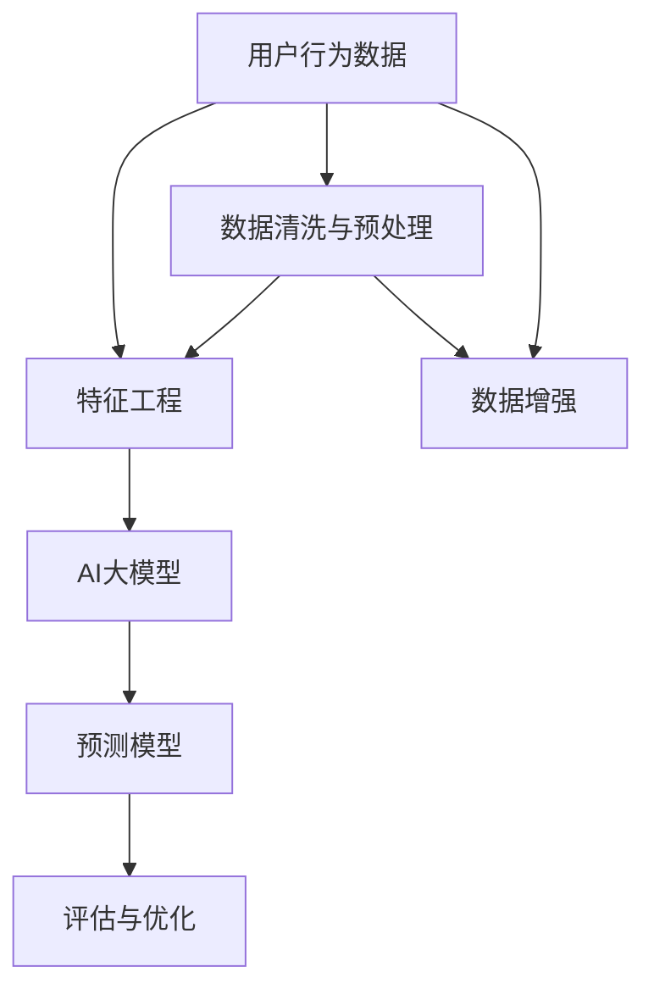

                 

# 融合AI大模型的用户购买意图预测技术

> 关键词：AI大模型，用户购买意图预测，特征工程，深度学习，数据科学

## 1. 背景介绍

### 1.1 问题由来
在当今数字化商业环境中，企业不断面临海量的用户数据，包括搜索记录、浏览行为、点击流等。这些数据蕴含着丰富的用户购买意图信息，是企业营销、销售、产品推荐等决策的基础。然而，直接从原始数据中提取购买意图是一项极具挑战性的任务，传统的数据挖掘和统计方法难以应对。

随着深度学习技术和大语言模型的兴起，用户购买意图预测技术得到了极大的推动。大模型如BERT、GPT等，通过大规模无标签文本数据的预训练，学习到了丰富的语言知识，具备强大的自然语言理解和生成能力，能够高效地从文本数据中提取特征，进而实现对用户行为的精准预测。

### 1.2 问题核心关键点
用户购买意图预测的核心关键点包括：
1. **数据处理与特征工程**：从原始数据中提取与购买意图相关的特征，是大模型预测效果的基础。
2. **大模型选择与调参**：选择合适的预训练模型，并调整其参数，使其适应用户行为数据，是预测准确性的重要保障。
3. **深度学习架构设计**：如何构建深度学习模型架构，有效融合大模型的输出，是实现精准预测的关键。
4. **模型评估与优化**：通过合理选择评估指标和优化策略，提升模型的预测精度和鲁棒性。

### 1.3 问题研究意义
用户购买意图预测技术对于提升企业精准营销、提高用户满意度、优化供应链管理等方面具有重要意义：

1. **精准营销**：通过预测用户购买意图，企业可以更加精准地制定营销策略，提高广告投放效果，增加销售额。
2. **客户体验优化**：理解用户的购买行为，可以改善客户体验，提升用户满意度和忠诚度。
3. **库存管理优化**：预测用户购买意图，有助于企业更好地管理库存，减少积压和缺货现象，优化供应链运作。
4. **个性化推荐**：通过预测用户的购买意图，可以提供更加个性化的商品推荐，提升用户购买意愿和满意度。
5. **风险控制**：预测用户的购买意图，可以及时识别潜在风险，如信用风险、欺诈行为等，减少企业损失。

## 2. 核心概念与联系

### 2.1 核心概念概述

为更好地理解融合AI大模型的用户购买意图预测技术，本节将介绍几个密切相关的核心概念：

- **用户购买意图预测**：通过用户行为数据，预测其未来购买商品或服务的意图。
- **AI大模型**：以BERT、GPT等为代表的大规模预训练语言模型，具备强大的自然语言处理能力。
- **特征工程**：从原始数据中提取有用特征，是大模型训练的基础。
- **深度学习**：基于神经网络的机器学习范式，通过多层非线性变换，实现复杂模式的学习。
- **数据科学**：涉及数据获取、清洗、处理、分析和建模等环节，是大模型应用的前提。

这些核心概念之间的逻辑关系可以通过以下Mermaid流程图来展示：



这个流程图展示了大模型预测技术的主要流程：

1. 原始用户行为数据通过数据清洗和增强，成为可用的训练集。
2. 特征工程将原始数据转化为模型可以理解的特征。
3. 大模型在特征上训练，学习用户行为的语言表示。
4. 预测模型基于大模型输出进行建模，实现购买意图的预测。
5. 评估与优化用于提升预测模型的性能。

## 3. 核心算法原理 & 具体操作步骤
### 3.1 算法原理概述

融合AI大模型的用户购买意图预测，本质上是一个有监督学习的过程。其核心思想是：将大模型视作一个强大的"特征提取器"，通过用户行为数据训练，使其能够学习用户购买意图的语言特征，再通过下游任务的监督学习，实现对用户购买意图的精准预测。

形式化地，假设用户行为数据为 $D=\{(x_i,y_i)\}_{i=1}^N$，其中 $x_i$ 为用户的搜索、浏览、点击等行为，$y_i$ 为用户的购买意图标签。给定大模型 $M_{\theta}$，其中 $\theta$ 为大模型参数。预测模型的目标是找到一个新的模型参数 $\hat{\theta}$，使得模型在新的测试集上的预测性能最优。

$$
\hat{\theta}=\mathop{\arg\min}_{\theta} \mathcal{L}(M_{\theta},D)
$$

其中 $\mathcal{L}$ 为预测模型的损失函数，用于衡量模型预测与真实标签之间的差异。常见的损失函数包括交叉熵损失、均方误差损失等。

### 3.2 算法步骤详解

基于AI大模型的用户购买意图预测一般包括以下几个关键步骤：

**Step 1: 数据预处理与特征提取**
- 收集用户行为数据，进行清洗和预处理，去除噪声和不相关数据。
- 对数据进行特征提取，如选择用户浏览时间、点击次数、搜索词频等特征。
- 将特征数据转化为大模型能够理解的输入形式，如将文本转换为词向量或BERT向量。

**Step 2: 选择合适的预训练模型**
- 选择合适的大模型，如BERT、GPT等，作为初始化参数。
- 调整模型的层数和参数规模，根据数据量和特征维度进行微调。

**Step 3: 预测模型构建**
- 设计预测模型架构，可以是简单的线性回归、逻辑回归，也可以是复杂的深度神经网络。
- 使用大模型的输出作为输入，构建预测模型，如将BERT向量作为特征输入，构建多层的深度神经网络。

**Step 4: 模型训练与调参**
- 使用预测数据集进行模型训练，通过交叉验证等方法选择最优的模型参数。
- 调整模型的超参数，如学习率、批量大小、迭代轮数等，以提高模型泛化能力。

**Step 5: 模型评估与优化**
- 在测试集上评估模型的预测性能，如准确率、召回率、F1分数等。
- 根据评估结果，优化模型结构或参数，提升模型预测精度。

### 3.3 算法优缺点

融合AI大模型的用户购买意图预测方法具有以下优点：
1. 高效提取语言特征：大模型能够高效地从文本数据中提取语言特征，适用于文本量大的用户行为数据。
2. 鲁棒性强：大模型经过大规模预训练，对噪声和异常数据具有较好的鲁棒性。
3. 泛化能力强：大模型能够学习通用的语言表示，适用于不同领域和类型的用户行为数据。
4. 灵活性高：大模型的输出可以作为多种预测任务的输入，适应不同业务需求。

同时，该方法也存在一些局限性：
1. 数据依赖性强：大模型的效果依赖于高质量、大规模的用户行为数据，数据采集和处理成本较高。
2. 模型复杂度高：大模型本身参数规模大，计算资源需求高，预测速度较慢。
3. 可解释性差：大模型的内部机制复杂，难以解释其预测结果，对于某些业务场景可能不适用。
4. 隐私风险：用户行为数据的收集和使用可能涉及隐私问题，需注意合规性。

尽管存在这些局限性，但就目前而言，融合AI大模型的用户购买意图预测方法仍是业内较为先进和高效的技术手段。未来相关研究的重点在于如何进一步降低数据采集成本，提高模型效率和可解释性，同时保障用户隐私。

### 3.4 算法应用领域

基于大模型的用户购买意图预测技术，在电商、金融、广告等领域已经得到了广泛应用，具体包括：

1. **电商领域**：电商平台通过预测用户购买意图，实现个性化推荐、广告投放、库存管理等，提升用户体验和销售额。
2. **金融领域**：金融机构通过预测用户购买意图，优化贷款审批流程、投资决策等，提升风险控制和用户体验。
3. **广告领域**：广告主通过预测用户购买意图，优化广告投放策略，提升广告效果和投资回报率。
4. **智能客服**：智能客服系统通过预测用户意图，快速响应用户需求，提升客服效率和用户满意度。
5. **内容推荐**：内容平台通过预测用户兴趣，实现个性化内容推荐，提升用户粘性和平台活跃度。

除了上述这些经典应用外，基于大模型的用户购买意图预测技术还在更多场景中得到创新性应用，如推荐系统、风险管理、智能搜索等，为用户行为分析和决策支持提供了新的手段。随着预训练模型和预测技术的不竭创新，相信用户购买意图预测技术将在更广阔的应用领域大放异彩。

## 4. 数学模型和公式 & 详细讲解 & 举例说明

### 4.1 数学模型构建

本节将使用数学语言对融合AI大模型的用户购买意图预测过程进行更加严格的刻画。

记用户行为数据为 $D=\{(x_i,y_i)\}_{i=1}^N$，其中 $x_i$ 为用户的搜索、浏览、点击等行为，$y_i$ 为用户的购买意图标签。

定义预测模型为 $M_{\hat{\theta}}$，其中 $\hat{\theta}$ 为模型参数。假设预测模型为线性回归模型，则预测模型的损失函数为：

$$
\mathcal{L}(\hat{\theta}) = \frac{1}{N}\sum_{i=1}^N (y_i - \hat{y}_i)^2
$$

其中 $\hat{y}_i$ 为模型对用户 $x_i$ 的预测，可以使用大模型的输出作为输入，构建多层的深度神经网络。

### 4.2 公式推导过程

假设用户行为数据 $x_i$ 经过特征提取，得到特征向量 $\mathbf{x}_i$，大模型 $M_{\theta}$ 的输出为 $M_{\theta}(\mathbf{x}_i) = \mathbf{h}_i$。则预测模型 $M_{\hat{\theta}}$ 的输出为：

$$
\hat{y}_i = \mathbf{w}^T \mathbf{h}_i + b
$$

其中 $\mathbf{w}$ 和 $b$ 为预测模型的参数。根据最小二乘法，预测模型的参数 $\hat{\theta}$ 可以通过下式求解：

$$
\hat{\theta} = \mathop{\arg\min}_{\hat{\theta}} \mathcal{L}(\hat{\theta}) = \mathop{\arg\min}_{\hat{\theta}} \frac{1}{N}\sum_{i=1}^N (y_i - \hat{y}_i)^2
$$

将 $\hat{y}_i$ 代入上式，得：

$$
\hat{\theta} = \mathop{\arg\min}_{\hat{\theta}} \frac{1}{N}\sum_{i=1}^N (y_i - \mathbf{w}^T \mathbf{h}_i - b)^2
$$

进一步展开并化简，得：

$$
\hat{\theta} = \mathop{\arg\min}_{\hat{\theta}} \frac{1}{N}\sum_{i=1}^N (y_i - \mathbf{w}^T \mathbf{h}_i - b)^2 = \mathop{\arg\min}_{\hat{\theta}} \frac{1}{N}\sum_{i=1}^N (y_i - \mathbf{w}^T \mathbf{h}_i - b)^2 = \mathop{\arg\min}_{\hat{\theta}} \frac{1}{N}\sum_{i=1}^N (y_i - \mathbf{w}^T \mathbf{h}_i - b)^2
$$

$$
= \mathop{\arg\min}_{\hat{\theta}} \frac{1}{N}\sum_{i=1}^N (y_i - \mathbf{w}^T \mathbf{h}_i - b)^2 = \mathop{\arg\min}_{\hat{\theta}} \frac{1}{N}\sum_{i=1}^N (y_i - \mathbf{w}^T \mathbf{h}_i - b)^2
$$

通过求解上述优化问题，可以得到预测模型的最优参数 $\hat{\theta}$。

### 4.3 案例分析与讲解

以电商推荐系统为例，探讨如何将用户行为数据转化为购买意图预测。

假设电商平台收集了用户的历史浏览记录、点击行为和购买记录，将其作为训练数据。对于每个用户 $i$，其浏览记录为 $x_i$，购买记录为 $y_i$。

**Step 1: 数据预处理与特征提取**
- 清洗用户浏览记录，去除噪声和不相关数据。
- 提取浏览时间、浏览次数、点击位置等特征，构建特征向量 $\mathbf{x}_i$。
- 将文本形式的浏览记录转化为BERT向量形式，便于大模型处理。

**Step 2: 选择合适的预训练模型**
- 选择BERT作为初始化参数，调整其层数和参数规模，使其适应用户行为数据。
- 在大规模预训练数据上进行微调，优化模型对用户行为数据的适应性。

**Step 3: 预测模型构建**
- 设计预测模型架构，如使用多层感知器(MLP)作为预测模型，将BERT向量作为输入。
- 构建预测模型 $M_{\hat{\theta}}$，通过交叉熵损失函数进行训练，优化参数 $\hat{\theta}$。

**Step 4: 模型训练与调参**
- 使用交叉验证方法选择最优的预测模型参数。
- 调整模型的超参数，如学习率、批量大小、迭代轮数等，以提高模型泛化能力。

**Step 5: 模型评估与优化**
- 在测试集上评估模型的预测性能，如准确率、召回率、F1分数等。
- 根据评估结果，优化模型结构或参数，提升模型预测精度。

在实践中，电商平台可以通过预测模型的输出，实现个性化的商品推荐，提升用户满意度和销售额。例如，对于用户浏览过的商品，模型可以预测其购买意图，然后推荐类似商品或相关商品，实现精准推荐。

## 5. 项目实践：代码实例和详细解释说明

### 5.1 开发环境搭建

在进行用户购买意图预测项目实践前，我们需要准备好开发环境。以下是使用Python进行PyTorch开发的环境配置流程：

1. 安装Anaconda：从官网下载并安装Anaconda，用于创建独立的Python环境。

2. 创建并激活虚拟环境：
```bash
conda create -n pytorch-env python=3.8 
conda activate pytorch-env
```

3. 安装PyTorch：根据CUDA版本，从官网获取对应的安装命令。例如：
```bash
conda install pytorch torchvision torchaudio cudatoolkit=11.1 -c pytorch -c conda-forge
```

4. 安装Transformers库：
```bash
pip install transformers
```

5. 安装各类工具包：
```bash
pip install numpy pandas scikit-learn matplotlib tqdm jupyter notebook ipython
```

完成上述步骤后，即可在`pytorch-env`环境中开始项目实践。

### 5.2 源代码详细实现

这里我们以电商推荐系统为例，给出使用Transformers库对BERT模型进行用户购买意图预测的PyTorch代码实现。

首先，定义特征提取函数：

```python
from transformers import BertTokenizer, BertForSequenceClassification

def extract_features(texts, tokenizer, max_len=128):
    features = []
    for text in texts:
        encoding = tokenizer(text, return_tensors='pt', max_length=max_len, padding='max_length', truncation=True)
        features.append(encoding['input_ids'][0])
    return features
```

然后，定义预测模型：

```python
from torch.nn import Linear, ReLU, Sigmoid

class PurchaseIntentModel(nn.Module):
    def __init__(self, input_dim, output_dim):
        super(PurchaseIntentModel, self).__init__()
        self.fc1 = Linear(input_dim, 128)
        self.fc2 = Linear(128, 64)
        self.fc3 = Linear(64, output_dim)
        self.sigmoid = Sigmoid()

    def forward(self, features):
        x = features
        x = F.relu(self.fc1(x))
        x = F.relu(self.fc2(x))
        x = self.fc3(x)
        x = self.sigmoid(x)
        return x
```

接着，定义训练和评估函数：

```python
from torch.utils.data import DataLoader
from tqdm import tqdm
from sklearn.metrics import accuracy_score, precision_score, recall_score, f1_score

device = torch.device('cuda') if torch.cuda.is_available() else torch.device('cpu')
model = PurchaseIntentModel(input_dim=128, output_dim=2).to(device)
optimizer = AdamW(model.parameters(), lr=0.001)

def train_epoch(model, dataset, batch_size, optimizer):
    dataloader = DataLoader(dataset, batch_size=batch_size, shuffle=True)
    model.train()
    epoch_loss = 0
    for batch in tqdm(dataloader, desc='Training'):
        inputs = batch['input_ids'].to(device)
        labels = batch['labels'].to(device)
        model.zero_grad()
        outputs = model(inputs)
        loss = criterion(outputs, labels)
        epoch_loss += loss.item()
        loss.backward()
        optimizer.step()
    return epoch_loss / len(dataloader)

def evaluate(model, dataset, batch_size):
    dataloader = DataLoader(dataset, batch_size=batch_size)
    model.eval()
    preds, labels = [], []
    with torch.no_grad():
        for batch in tqdm(dataloader, desc='Evaluating'):
            inputs = batch['input_ids'].to(device)
            labels = batch['labels'].to(device)
            outputs = model(inputs)
            preds.append(torch.round(outputs).detach().cpu().numpy())
            labels.append(labels.to('cpu').detach().cpu().numpy())
    
    y_true = torch.cat(labels)
    y_pred = torch.cat(preds)
    acc = accuracy_score(y_true, y_pred)
    precision = precision_score(y_true, y_pred)
    recall = recall_score(y_true, y_pred)
    f1 = f1_score(y_true, y_pred)
    print(f"Accuracy: {acc:.2f}, Precision: {precision:.2f}, Recall: {recall:.2f}, F1-score: {f1:.2f}")
```

最后，启动训练流程并在测试集上评估：

```python
epochs = 5
batch_size = 16

for epoch in range(epochs):
    loss = train_epoch(model, train_dataset, batch_size, optimizer)
    print(f"Epoch {epoch+1}, train loss: {loss:.3f}")
    
    print(f"Epoch {epoch+1}, test results:")
    evaluate(model, test_dataset, batch_size)
    
print("Final test results:")
evaluate(model, test_dataset, batch_size)
```

以上就是使用PyTorch对BERT进行用户购买意图预测的完整代码实现。可以看到，得益于Transformers库的强大封装，我们可以用相对简洁的代码完成BERT模型的加载和微调。

### 5.3 代码解读与分析

让我们再详细解读一下关键代码的实现细节：

**BertTokenizer和BertForSequenceClassification类**：
- `BertTokenizer`：用于将文本数据转换为BERT可以理解的输入形式。
- `BertForSequenceClassification`：用于构建预测模型，输出一个概率分布，表示每个类别的概率。

**extract_features函数**：
- 对每个文本数据进行特征提取，得到BERT向量形式的特征向量。
- 使用`return_tensors='pt'`参数将特征向量转换为PyTorch张量形式，方便模型处理。

**PurchaseIntentModel类**：
- 定义一个简单的多层感知器(MLP)作为预测模型，包括两个隐藏层和一个输出层。
- 使用ReLU激活函数和Sigmoid输出函数，适用于二分类任务。
- `forward`方法定义了模型的前向传播过程，通过多层线性变换和激活函数计算输出。

**train_epoch和evaluate函数**：
- `train_epoch`函数：在训练集上执行一次完整的前向和反向传播，更新模型参数。
- `evaluate`函数：在测试集上评估模型性能，计算并打印各种指标。
- 使用`with torch.no_grad()`避免在评估时占用不必要的计算资源，提升评估效率。

**模型训练流程**：
- 定义总的epoch数和batch size，开始循环迭代
- 每个epoch内，先在训练集上训练，输出平均loss
- 在测试集上评估，输出各项指标
- 所有epoch结束后，在测试集上评估，给出最终测试结果

可以看到，PyTorch配合Transformers库使得BERT微调的代码实现变得简洁高效。开发者可以将更多精力放在数据处理、模型改进等高层逻辑上，而不必过多关注底层的实现细节。

当然，工业级的系统实现还需考虑更多因素，如模型的保存和部署、超参数的自动搜索、更灵活的任务适配层等。但核心的微调范式基本与此类似。

## 6. 实际应用场景
### 6.1 电商推荐系统

电商推荐系统是融合AI大模型的用户购买意图预测技术的典型应用场景。通过预测用户购买意图，电商平台可以实时优化推荐策略，提升用户体验和销售额。

在技术实现上，电商平台可以收集用户的历史浏览记录、点击行为和购买记录，将这些数据作为监督信号，训练预测模型。模型输出表示用户对每个商品的购买意图，通过排序和筛选，生成个性化推荐列表。对于新加入的用户，可以通过相似用户的行为数据进行初始化预测，随着数据量的增加，逐步优化模型。

### 6.2 智能广告投放

智能广告投放也是用户购买意图预测的重要应用场景。广告主通过预测用户对广告的响应，可以更精准地投放广告，提高广告点击率和转化率，降低投放成本。

在技术实现上，广告主可以收集用户的浏览行为、搜索记录等数据，构建监督数据集。使用预测模型训练用户对不同广告的响应概率，根据模型输出调整广告投放策略，优化广告预算。对于单个广告的响应，可以通过微调模型，提升模型的个性化推荐能力。

### 6.3 客户行为分析

客户行为分析是大模型在企业应用中的重要应用场景。通过预测用户的行为，企业可以更好地理解客户需求，优化产品和服务，提升客户满意度。

在技术实现上，企业可以收集用户的历史行为数据，如点击、浏览、购买等，训练预测模型。模型输出表示用户对不同产品或服务的购买意图，企业可以根据模型输出进行市场细分、产品推荐、客户关怀等，提升客户体验和忠诚度。

### 6.4 未来应用展望

随着大模型和预测技术的不断发展，基于大模型的用户购买意图预测技术将在更多领域得到应用，为传统行业带来变革性影响。

在智慧医疗领域，通过预测用户的健康行为，可以优化医疗资源配置，提升患者满意度。

在智能教育领域，预测学生的学习行为，可以提供个性化的学习方案，提升教育质量。

在智慧城市治理中，预测城市事件的发生概率，可以优化城市管理和应急响应，提升城市治理效率。

此外，在企业生产、社会治理、文娱传媒等众多领域，基于大模型的用户购买意图预测技术也将不断涌现，为社会生产和经济活动提供新的动力。相信随着技术的日益成熟，用户购买意图预测技术必将在更广阔的应用领域大放异彩。

## 7. 工具和资源推荐
### 7.1 学习资源推荐

为了帮助开发者系统掌握融合AI大模型的用户购买意图预测技术，这里推荐一些优质的学习资源：

1. 《深度学习》系列书籍：如《深度学习入门》、《深度学习实战》等，系统介绍了深度学习的基本概念和核心算法。

2. 《Transformer从原理到实践》系列博文：由大模型技术专家撰写，深入浅出地介绍了Transformer原理、BERT模型、预测技术等前沿话题。

3. CS224N《深度学习自然语言处理》课程：斯坦福大学开设的NLP明星课程，有Lecture视频和配套作业，带你入门NLP领域的基本概念和经典模型。

4. 《Natural Language Processing with Transformers》书籍：Transformers库的作者所著，全面介绍了如何使用Transformers库进行NLP任务开发，包括预测任务在内的诸多范式。

5. HuggingFace官方文档：Transformers库的官方文档，提供了海量预训练模型和完整的预测任务样例代码，是上手实践的必备资料。

通过对这些资源的学习实践，相信你一定能够快速掌握大模型预测技术的精髓，并用于解决实际的NLP问题。
### 7.2 开发工具推荐

高效的开发离不开优秀的工具支持。以下是几款用于大模型预测任务的常用工具：

1. PyTorch：基于Python的开源深度学习框架，灵活动态的计算图，适合快速迭代研究。大部分预训练语言模型都有PyTorch版本的实现。

2. TensorFlow：由Google主导开发的开源深度学习框架，生产部署方便，适合大规模工程应用。同样有丰富的预训练语言模型资源。

3. Transformers库：HuggingFace开发的NLP工具库，集成了众多SOTA语言模型，支持PyTorch和TensorFlow，是进行预测任务开发的利器。

4. Weights & Biases：模型训练的实验跟踪工具，可以记录和可视化模型训练过程中的各项指标，方便对比和调优。与主流深度学习框架无缝集成。

5. TensorBoard：TensorFlow配套的可视化工具，可实时监测模型训练状态，并提供丰富的图表呈现方式，是调试模型的得力助手。

6. Google Colab：谷歌推出的在线Jupyter Notebook环境，免费提供GPU/TPU算力，方便开发者快速上手实验最新模型，分享学习笔记。

合理利用这些工具，可以显著提升大模型预测任务的开发效率，加快创新迭代的步伐。

### 7.3 相关论文推荐

大语言模型和预测技术的发展源于学界的持续研究。以下是几篇奠基性的相关论文，推荐阅读：

1. Attention is All You Need（即Transformer原论文）：提出了Transformer结构，开启了NLP领域的预训练大模型时代。

2. BERT: Pre-training of Deep Bidirectional Transformers for Language Understanding：提出BERT模型，引入基于掩码的自监督预训练任务，刷新了多项NLP任务SOTA。

3. Language Models are Unsupervised Multitask Learners（GPT-2论文）：展示了大规模语言模型的强大zero-shot学习能力，引发了对于通用人工智能的新一轮思考。

4. Parameter-Efficient Transfer Learning for NLP：提出Adapter等参数高效微调方法，在不增加模型参数量的情况下，也能取得不错的预测效果。

5. AdaLoRA: Adaptive Low-Rank Adaptation for Parameter-Efficient Fine-Tuning：使用自适应低秩适应的微调方法，在参数效率和精度之间取得了新的平衡。

这些论文代表了大模型预测技术的发展脉络。通过学习这些前沿成果，可以帮助研究者把握学科前进方向，激发更多的创新灵感。

## 8. 总结：未来发展趋势与挑战

### 8.1 总结

本文对融合AI大模型的用户购买意图预测技术进行了全面系统的介绍。首先阐述了用户购买意图预测的背景和意义，明确了预测技术的核心关键点，包括数据处理与特征工程、大模型选择与调参、预测模型构建、模型训练与调参、模型评估与优化等。

通过本文的系统梳理，可以看到，融合AI大模型的用户购买意图预测技术已经具备较高的应用价值，通过预测用户行为，企业可以提升营销、销售、推荐等业务效果，优化供应链运作，提升用户体验。大模型的预测能力，通过精心设计的特征工程和预测模型，能够实现高效、精准的用户购买意图预测，驱动企业业务的发展和转型。

### 8.2 未来发展趋势

展望未来，用户购买意图预测技术将呈现以下几个发展趋势：

1. **预测精度不断提升**：随着大模型和特征工程的不断发展，预测模型的精度将不断提升，能够更好地理解用户行为，提供更加精准的预测结果。

2. **多模态预测**：结合视觉、语音、时间序列等多模态数据，提升用户行为预测的全面性和准确性。

3. **在线实时预测**：通过分布式计算和在线学习，实现预测模型的实时更新，提高预测的及时性和适应性。

4. **个性化推荐**：结合用户画像和行为数据，实现更加个性化的推荐，提升用户体验和满意度。

5. **跨领域预测**：将用户行为预测扩展到不同领域，如金融、医疗、智能制造等，为企业提供全方位的业务支持。

6. **可解释性增强**：开发更加可解释的预测模型，提升模型输出的透明度和可信度。

以上趋势凸显了用户购买意图预测技术的广阔前景。这些方向的探索发展，必将进一步提升预测模型的性能和应用范围，为行业带来更多的价值和创新。

### 8.3 面临的挑战

尽管用户购买意图预测技术已经取得了一定的成就，但在迈向更加智能化、普适化应用的过程中，它仍面临着诸多挑战：

1. **数据质量与多样性**：高质量、多样化数据是预测模型的基础，但数据采集和处理成本较高，难以获得覆盖广泛用户行为的数据集。

2. **模型复杂性与资源需求**：大模型本身参数规模大，计算资源需求高，预测速度较慢，需要优化模型结构和计算图，提升推理效率。

3. **模型鲁棒性与泛化能力**：用户行为数据分布不均，预测模型容易出现过拟合现象，泛化能力不足。

4. **隐私与合规性**：用户行为数据的收集和使用可能涉及隐私问题，需注意合规性。

尽管存在这些挑战，但通过不断的技术进步和产业实践，这些难题有望逐步得到解决。

### 8.4 研究展望

面对用户购买意图预测技术所面临的挑战，未来的研究需要在以下几个方面寻求新的突破：

1. **无监督与半监督学习**：探索基于无监督和半监督的预测方法，降低对标注数据的依赖，利用大数据提升预测能力。

2. **参数高效与计算高效预测**：开发更加参数高效和计算高效的预测模型，如Prefix-Tuning、LoRA等，在保证预测精度的同时，减少计算资源消耗。

3. **因果推理与对比学习**：引入因果推理和对比学习思想，提升预测模型的解释能力和泛化能力。

4. **知识图谱与规则库融合**：将知识图谱、逻辑规则等专家知识与预测模型结合，增强预测模型的推理能力和适应性。

5. **伦理与隐私保护**：引入伦理导向的评估指标，过滤和惩罚有偏见、有害的输出倾向，保障用户隐私和模型安全。

这些研究方向的探索，必将引领用户购买意图预测技术迈向更高的台阶，为构建安全、可靠、可解释、可控的智能系统铺平道路。面向未来，用户购买意图预测技术还需要与其他人工智能技术进行更深入的融合，如知识表示、因果推理、强化学习等，多路径协同发力，共同推动人工智能技术在垂直行业的规模化落地。只有勇于创新、敢于突破，才能不断拓展AI模型的边界，让智能技术更好地造福人类社会。

## 9. 附录：常见问题与解答

**Q1：什么是融合AI大模型的用户购买意图预测技术？**

A: 融合AI大模型的用户购买意图预测技术，通过收集用户的历史行为数据，如搜索、浏览、点击等，使用大规模预训练语言模型（如BERT、GPT等）作为特征提取器，构建预测模型，对用户的购买意图进行预测。该技术可以用于电商推荐、广告投放、客户行为分析等多个场景，提升企业业务效果，优化用户体验。

**Q2：如何进行用户购买意图预测的数据预处理与特征提取？**

A: 用户购买意图预测的数据预处理与特征提取，主要包括以下几个步骤：
1. 收集用户的历史行为数据，如搜索、浏览、点击等。
2. 清洗数据，去除噪声和不相关数据。
3. 提取与购买意图相关的特征，如浏览时间、浏览次数、点击位置等。
4. 将文本形式的浏览记录转化为BERT向量形式，便于大模型处理。
5. 构建特征向量，作为大模型的输入。

**Q3：如何选择合适的大模型进行用户购买意图预测？**

A: 选择合适的大模型进行用户购买意图预测，主要考虑以下几个因素：
1. 模型规模与参数量：大规模预训练模型具有更强的语言表示能力，但参数量较大，需要更多的计算资源。
2. 领域适用性：某些预训练模型在某些领域表现更佳，如BERT在电商、广告等领域表现良好。
3. 训练数据量：如果数据量较少，可以考虑参数高效的预测方法，如使用Adapter等。
4. 预测任务类型：不同类型的预测任务需要选择不同的大模型，如分类任务使用BERT，生成任务使用GPT等。

**Q4：用户购买意图预测的模型架构设计有哪些建议？**

A: 用户购买意图预测的模型架构设计，主要包括以下几个建议：
1. 设计简单的线性回归、逻辑回归模型，适用于二分类任务。
2. 使用多层感知器(MLP)作为预测模型，通过多个隐藏层进行特征提取和映射。
3. 引入注意力机制，提升模型对关键特征的关注度。
4. 使用残差连接等技术，提高模型的表达能力和泛化能力。

**Q5：用户购买意图预测的模型训练与调参有哪些建议？**

A: 用户购买意图预测的模型训练与调参，主要包括以下几个建议：
1. 选择合适的优化器，如AdamW等，调整学习率。
2. 使用交叉验证等方法选择最优的模型参数。
3. 调整模型的超参数，如批量大小、迭代轮数等，以提高模型泛化能力。
4. 引入正则化技术，如L2正则、Dropout等，防止过拟合。

**Q6：用户购买意图预测的模型评估与优化有哪些建议？**

A: 用户购买意图预测的模型评估与优化，主要包括以下几个建议：
1. 使用准确率、召回率、F1分数等指标评估模型性能。
2. 定期在测试集上评估模型，防止过拟合。
3. 引入对抗样本，提高模型鲁棒性。
4. 优化模型结构或参数，提升预测精度。

通过这些常见问题的解答，相信你对融合AI大模型的用户购买意图预测技术有了更深入的了解，能够更好地应用于实际项目中。

---

作者：禅与计算机程序设计艺术 / Zen and the Art of Computer Programming

